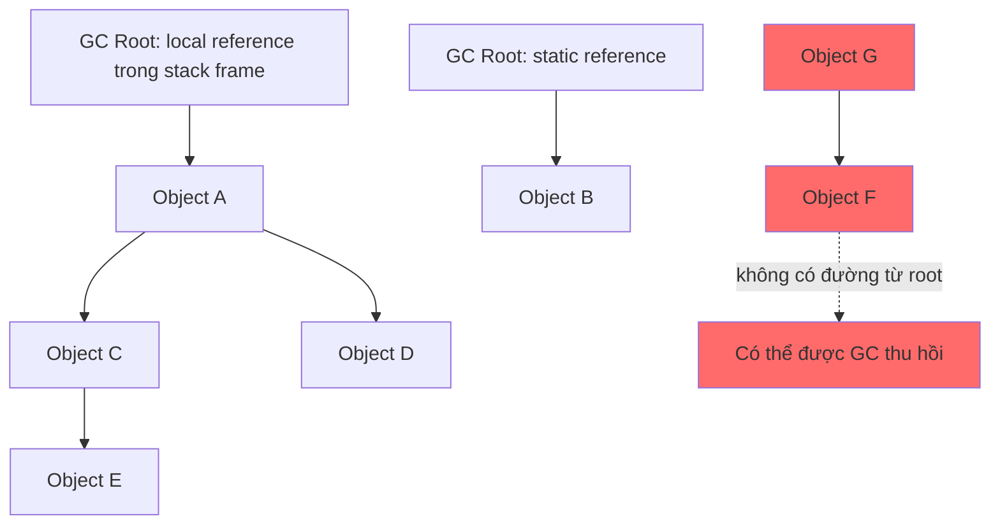
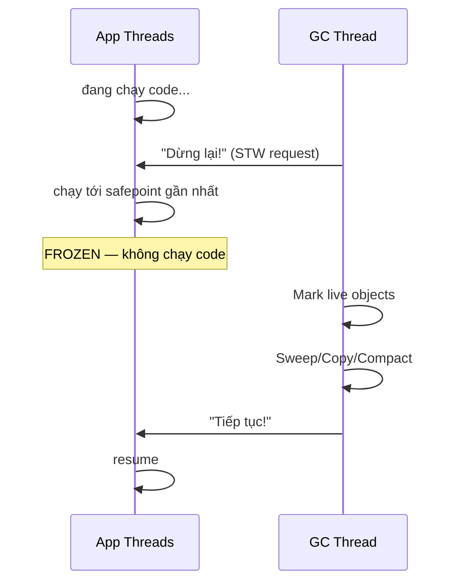
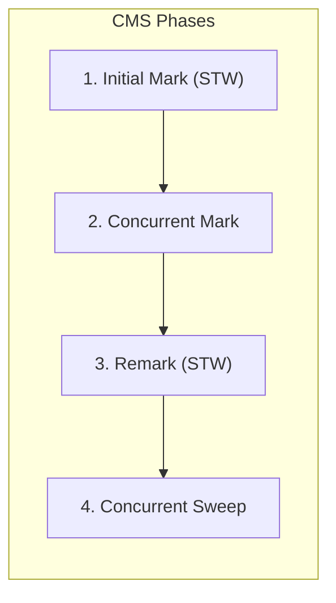
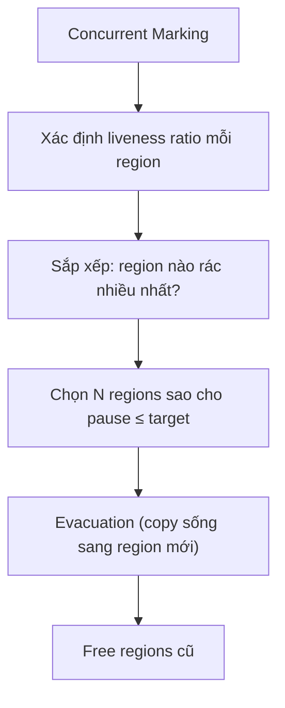

Garbage Collection tự động thu hồi vùng nhớ của object không còn reachable trong JVM. GC giúp lập trình viên không phải giải phóng từng object, nhưng vẫn tạo ra trade-off giữa throughput, pause time và memory footprint.

## Mục lục

- [Tổng quan](#1-tổng-quan)
- [GC Roots & Reachability — ai sống, ai chết?](#2-gc-roots--reachability--ai-sống-ai-chết)
- [Generational Hypothesis — vì sao chia Young/Old](#3-generational-hypothesis--vì-sao-chia-youngold)
- [Heap Layout: Eden, Survivor, Old, Metaspace](#4-heap-layout-eden-survivor-old-metaspace)
  - [Mô hình generational cổ điển — Young và Old](#41-mô-hình-generational-cổ-điển--young-và-old)
  - [Từ new đến Eden — TLAB và đường cấp phát](#42-từ-new-đến-eden--tlab-và-đường-cấp-phát)
  - [Minor GC và hai Survivor](#43-minor-gc-và-hai-survivor)
  - [Promotion vào Old Gen](#44-promotion-vào-old-gen)
  - [Metaspace — vùng native ngoài Heap](#45-metaspace--vùng-native-ngoài-heap)
  - [Layout phụ thuộc vào collector](#46-layout-phụ-thuộc-vào-collector)
- [Ba thuật toán nền tảng: Mark-Sweep, Copying, Mark-Compact](#5-ba-thuật-toán-nền-tảng-mark-sweep-copying-mark-compact)
  - [Vấn đề cần giải quyết: thu hồi và phân mảnh](#51-vấn-đề-cần-giải-quyết-thu-hồi-và-phân-mảnh)
  - [Mark-Sweep — đánh dấu rồi thu hồi](#52-mark-sweep--đánh-dấu-rồi-thu-hồi)
  - [Copying — copy object sống sang vùng trống](#53-copying--copy-object-sống-sang-vùng-trống)
  - [Mark-Compact — dồn object sống về một chỗ](#54-mark-compact--dồn-object-sống-về-một-chỗ)
  - [So sánh và chọn thuật toán](#55-so-sánh-và-chọn-thuật-toán)
- [Stop-the-World — tại sao GC phải dừng ứng dụng](#6-stop-the-world--tại-sao-gc-phải-dừng-ứng-dụng)
- [Serial & Parallel Collector — thế hệ đầu](#7-serial--parallel-collector--thế-hệ-đầu)
- [CMS — Concurrent Mark Sweep (deprecated)](#8-cms--concurrent-mark-sweep-deprecated)
- [G1 — Garbage First (default từ JDK 9)](#9-g1--garbage-first-default-từ-jdk-9)
- [ZGC — Sub-millisecond pause (JDK 15+)](#10-zgc--sub-millisecond-pause-jdk-15)
- [So sánh 5 Collector](#11-so-sánh-5-collector)
- [GC Log — đọc hiểu và phân tích](#12-gc-log--đọc-hiểu-và-phân-tích)
- [Tuning thực chiến — flags quan trọng nhất](#13-tuning-thực-chiến--flags-quan-trọng-nhất)
- [Anti-patterns gây GC pressure](#14-anti-patterns-gây-gc-pressure)
- [Tóm tắt — Cheat sheet & 5 nguyên tắc](#15-tóm-tắt--cheat-sheet--5-nguyên-tắc)

---

## 1. Tổng quan

Collector xác định object còn sống từ GC Roots, sau đó áp dụng các thuật toán copy, mark, sweep hoặc compact theo cách tổ chức heap. Giả thuyết thế hệ giúp phần lớn collector xử lý object ngắn hạn và dài hạn bằng chiến lược khác nhau.

Không có collector tốt nhất cho mọi hệ thống. Việc chọn và tuning phải dựa trên mục tiêu latency, kích thước heap, allocation rate và dữ liệu từ GC log thay vì chỉ thay đổi flag theo kinh nghiệm.

## 2. GC Roots & Reachability — ai sống, ai chết?

### 2.1. GC Root là biến nào trong code?

> [!IMPORTANT]
> **Không có biến đặc biệt nào tên hoặc kiểu là `GC Root`.** Một biến trở thành **nguồn GC Root** vì vị trí mà reference của nó đang được lưu, không phải vì tên, kiểu dữ liệu hay annotation.

Xét trực tiếp đoạn code sau:

```java
class OrderService {
    // (1) CACHE: static reference → nguồn GC Root khi class còn được load
    static final List<Order> CACHE = new ArrayList<>();

    void process() {
        // (2) order: local reference → nguồn GC Root khi method đang chạy
        Order order = new Order();

        // (3) customer: cũng là local reference → nguồn GC Root khi còn được dùng
        Customer customer = order.customer();

        // Phần tử nằm trong ArrayList KHÔNG phải root
        CACHE.add(order);
        sendEmail(customer);
    }
}
```

Trong ví dụ này, câu trả lời cho “biến nào là GC Root?” là:

| Thành phần | Là nguồn GC Root? | Lý do |
|------------|-------------------|-------|
| Static reference `CACHE` | **Có** | JVM có thể bắt đầu từ static field của class đang được load |
| Local reference `order` | **Có**, khi còn live trong method | JVM có thể bắt đầu từ slot `order` trong stack frame đang chạy |
| Local reference `customer` | **Có**, khi còn live trong method | Nó cũng nằm trong stack frame đang chạy |
| Object tạo bởi `new Order()` | **Không** | Đây là object trong Heap được `order` trỏ tới |
| Field bên trong object `Order` | **Không** | GC chỉ thấy field này sau khi đã đi tới object `Order` |
| Phần tử `Order` bên trong `CACHE` | **Không** | Đây là reference thông thường bên trong `ArrayList` |
| Biến primitive như `int count` | **Không** | Primitive không trỏ tới object nào trong Heap |

Có thể hình dung Heap nằm bên phải đường phân cách:

```text
        NƠI JVM BẮT ĐẦU                         HEAP

[stack slot: order] ────────────────────────→ [Order object]
      GC Root                                    │
                                                 └──→ [Customer object]

[static slot: CACHE] ───────────────────────→ [ArrayList object]
      GC Root                                    │
                                                 └──→ [Order object]
```

**GC Root là nơi bắt đầu mũi tên ở bên trái, không phải object `Order` hay `ArrayList` ở bên phải.** Nói ngắn gọn:

> GC Root = reference mà JVM có thể lấy ra trực tiếp từ trạng thái thực thi như stack, static storage, thread hoặc JNI, thay vì phải đi qua một object khác trong Heap.

Khi `process()` kết thúc, stack frame bị xóa nên hai nguồn root `order` và `customer` biến mất. Nhưng object `Order` vẫn sống vì còn đường khác:

```text
static root CACHE → ArrayList → Order
```

Nếu gọi `CACHE.clear()` và không còn root nào khác dẫn tới `Order`, object đó mới trở thành đối tượng có thể được GC thu hồi.

> [!NOTE]
> Nói chính xác ở mức JVM, root là **slot/handle đang chứa reference**, không phải cái tên `order` hay `CACHE`. Các tên biến chỉ giúp lập trình viên nhận ra slot đó trong source code. Heap dump tool đôi khi gọi luôn object được slot trỏ tới là “GC Root”, nên cách hiển thị có thể gây nhầm.

### 2.2. JVM dùng GC Roots như thế nào?

GC xác định object **sống** hay **chết** bằng **reachability analysis** (không dùng reference counting):



Trong sơ đồ, `A`, `B`, `C`, `D`, `E` sống vì có ít nhất một đường đi từ GC Root. `F` và `G` có thể tham chiếu lẫn nhau nhưng vẫn chết vì cả cụm không có đường đi từ bất kỳ root nào.

Các nguồn GC Root phổ biến:

| Nguồn GC Root | Ví dụ | Root tồn tại trong bao lâu? |
|----------------|-------|-----------------------------|
| Local reference trong stack frame | Biến `order` của method đang chạy | Đến khi JVM không còn cần slot đó hoặc stack frame kết thúc |
| Active thread | Thread pool worker chưa dừng | Trong khi thread còn được JVM xem là active |
| Static reference của loaded class | `static Map<String, User> cache` | Thường đến khi class được unload hoặc field được gán lại |
| JNI global/local reference | Native code giữ Java object | Đến khi native code xóa handle hoặc native frame kết thúc |
| JVM internal reference | System class, class loader, một số VM structure | Theo vòng đời structure tương ứng trong JVM |
| Monitor đang được JVM sử dụng | Object liên quan đến synchronization đang hoạt động | Trong thời gian JVM còn cần monitor đó |

**Thuật toán khái niệm**:

1. JVM chụp tập GC Roots tại thời điểm phù hợp.
2. Đánh dấu object được các root trỏ trực tiếp tới.
3. Duyệt tiếp toàn bộ reference từ các object đã đánh dấu.
4. Object nào không được đánh dấu, tức không có đường từ root, thì **eligible for collection**.

> [!IMPORTANT]
> “Eligible for collection” nghĩa là GC **được phép** thu hồi, không đảm bảo object sẽ được thu hồi ngay lập tức. Thời điểm thực tế phụ thuộc collector và chu kỳ GC.

> [!WARNING]
> Object có thể vẫn **chiếm memory** dù ứng dụng không còn cần nó nếu vẫn có đường reference từ một GC Root — đây là bản chất của memory leak trong Java. Ví dụ: `static List<>` chỉ `add()` mà không `remove()` sẽ giữ toàn bộ phần tử sống.

### 2.3. Finalization & Phantom Reference

Object có `finalize()` **không bị thu hồi ngay** — nó phải qua hàng đợi finalization (chạy bởi `FinalizerThread`), sau đó **lần GC tiếp theo** mới thực sự giải phóng. Nghĩa là object "chết" tồn tại thêm **ít nhất 1 GC cycle**.

```java
// ❌ Đừng dùng finalize() — deprecated từ JDK 9
protected void finalize() { closeConnection(); }

// ✅ Dùng try-with-resources hoặc Cleaner (JDK 9+)
Cleaner.create().register(obj, () -> closeConnection());
```

---

## 3. Generational Hypothesis — vì sao chia Young/Old

Quan sát thực nghiệm trên hầu hết ứng dụng:

> **"Most objects die young."** — 80-98% object trở thành rác ngay sau khi method kết thúc.

```text
Object lifetime distribution (typical web app):
╠══════════════════════════════╗
║  ~95% chết trong < 1 GC      ║ ← Young Generation
╠══════════════════════════════╝
╠═════╗
║ ~5% ║ sống lâu (cache, pool, singleton) ← Old Generation
╠═════╝
```

Từ đó, JVM chia heap thành **generations**:
- **Young Gen**: object mới tạo → GC thường xuyên, nhanh (chỉ scan vùng nhỏ)
- **Old Gen**: object sống qua nhiều GC cycle → GC ít thường xuyên hơn, nhưng đắt hơn

**Lợi ích**: thay vì xử lý **toàn bộ** heap mỗi lần, Young/Minor GC tập trung evacuation vào Young Gen (thường < 10% heap). GC vẫn phải xử lý GC Roots và các reference Old → Young qua remembered set hoặc card table, nhưng không cần quét toàn bộ Old → pause thường ở mức **mili-giây** thay vì **giây**.

---

## 4. Heap Layout: Eden, Survivor, Old, Metaspace

Có hai lớp khái niệm cần tách riêng:

- **Java Heap** chứa object và array. Trong mô hình generational, heap được chia logic thành Young Generation và Old Generation.
- **Metaspace** chứa metadata của class và nằm ngoài Java Heap, trong native memory. Nó không có Eden, Survivor hay Old Gen.

Sơ đồ dưới đây là **mô hình generational cổ điển** thường dùng để giải thích Serial và Parallel Collector. Đây không phải layout cố định cho mọi JVM. G1 chia heap thành regions, còn ZGC dùng cơ chế relocation và barrier khác; phần 4.6 sẽ so sánh.

```text
┌────────────────────────────────────────────────────────────────────────┐
│ Java Heap (object/array; giới hạn bởi Xms và Xmx)                      │
├────────────────────────────────┬───────────────────────────────────────┤
│ Young Generation               │ Old / Tenured Generation              │
│                                │                                       │
│  ┌─────────┬────────┬───────┐  │  Object sống lâu hoặc được promote    │
│  │  Eden   │  S0    │  S1   │  │                                       │
│  │ allocate│ From/To│To/From│  │                                       │
│  └─────────┴────────┴───────┘  │                                       │
└────────────────────────────────┴───────────────────────────────────────┘

Metaspace: vùng native memory riêng, không nằm trong Java Heap
```

| Vùng | Chứa gì | Điều gì thường xảy ra ở đây? |
|------|---------|------------------------------|
| **Eden** | Object mới được cấp phát | TLAB cấp phát object; Young GC thường làm Eden gần như trống lại |
| **Survivor S0/S1** | Object sống sót qua Young GC | Một vùng là **From**, vùng kia là **To**; object sống được copy qua lại và tăng age |
| **Old / Tenured** | Object sống lâu hoặc bị promote sớm | Old/Mixed/Full GC xử lý theo collector; object có thể được compact hoặc evacuate |
| **Metaspace** | Metadata của class, thông tin method và runtime constant pool theo implementation | Class unloading có thể trả native memory khi ClassLoader không còn reachable |

### 4.1. Mô hình generational cổ điển — Young và Old

Trong layout classic, Young Gen thường gồm Eden và hai Survivor. Eden lớn vì phần lớn object chết trước lần Young GC tiếp theo. Hai Survivor cung cấp một vùng nguồn và một vùng đích để copy object sống mà không ghi đè lên nhau.

Tỉ lệ **Eden:S0:S1 ≈ 8:1:1** và Old Gen khoảng **2/3 heap** chỉ là cách minh họa phổ biến, không phải giá trị bắt buộc của JVM:

- Tỉ lệ thực tế phụ thuộc collector, heap size và các flag như `-XX:NewRatio`.
- Với `-XX:NewRatio=2` trong một số collector classic, Old:Young có thể xấp xỉ 2:1. Đây không có nghĩa mọi JVM đều dùng đúng 1/3 heap cho Young.
- JVM có thể tự điều chỉnh kích thước dựa trên allocation rate, pause target và tình trạng Survivor space.
- G1 không giữ Eden/S0/S1 bằng các vùng địa chỉ liền nhau hay theo tỉ lệ 8:1:1; nó gán vai trò cho các region tự do.

> [!IMPORTANT]
> Không nên đọc sơ đồ như một cam kết về địa chỉ hoặc kích thước. `Eden`, `Survivor` và `Old` là logical roles; cách chúng được hiện thực phụ thuộc collector.

### 4.2. Từ new đến Eden — TLAB và đường cấp phát

Với object nhỏ trong collector generational thông thường, đường đi của một lệnh `new` thường như sau:

```text
new Order()
    │
    ├── object nhỏ, TLAB còn chỗ
    │       └── cấp phát trong TLAB thuộc Eden bằng bump-the-pointer
    │
    └── TLAB đầy hoặc object đặc biệt/lớn
            └── slow path → đường cấp phát riêng của collector
                              (Old hoặc Humongous region tùy collector)
```

**TLAB (Thread-Local Allocation Buffer)** là một lát nhỏ của Eden được dành riêng cho từng thread. Khi thread gọi `new`, nó thường chỉ cần tăng một con trỏ trong TLAB. Các thread không phải tranh chấp một allocation pointer dùng chung, nên cấp phát object nhỏ rất nhanh.

Một allocation thông thường gồm các bước:

1. JVM biết layout và kích thước của object từ class metadata.
2. Thread lấy một khoảng trong TLAB; nếu TLAB hết chỗ, JVM xin TLAB mới hoặc đi qua slow path.
3. JVM ghi object header, gán default value cho field và trả reference về cho code Java.
4. Constructor chạy. Object có thể trở thành reachable từ local variable, field hoặc collection sau khi reference được lưu lại.

Object **lớn** hoặc allocation không phù hợp TLAB có thể đi theo đường khác. Với collector classic, một số flag như `PretenureSizeThreshold` có thể khiến object đi thẳng Old Gen. Với G1, object có kích thước ít nhất khoảng một nửa region thường được xử lý như **Humongous allocation** và chiếm một hoặc nhiều Humongous regions. Không có một ngưỡng “object lớn” chung cho mọi collector.

> [!NOTE]
> `new` không đồng nghĩa tuyệt đối với “object luôn nằm trong Eden”. Eden là đường mặc định cho object nhỏ, nhưng collector và kích thước object có thể thay đổi đường cấp phát.

### 4.3. Minor GC và hai Survivor

Trong cách gọi truyền thống, **Minor GC** là lần thu gom Young Generation. GC log hiện đại, đặc biệt với G1, thường dùng tên **Young GC** hoặc **Pause Young**. Với Serial, Parallel và G1, young evacuation thường có một khoảng Stop-the-World; collector khác có thể dùng cơ chế concurrent khác.

Giả sử trước GC, S0 đang là **From** và S1 đang trống để làm **To**:

```text
TRƯỚC YOUNG GC
  Eden: [A chết] [B sống]
  S0 (From): [C sống, age=1]
  S1 (To):   [trống]

SAU KHI COPY OBJECT SỐNG
  Eden: [trống]
  S0 (To mới): [trống]
  S1 (From mới): [B age=1] [C age=2]
```

Điểm quan trọng: `S0` và `S1` không phải hai cấp độ tuổi, cũng không phải nơi mỗi vùng chỉ chứa một object. Mỗi vùng là một buffer chứa nhiều object và hai buffer luân phiên vai trò:

- **From:** vùng đang chứa các object Survivor hiện tại.
- **To:** vùng đang trống để nhận object sống từ Eden và From.

Sau mỗi Young GC, To chứa các object sống mới và trở thành From. From cũ đã được dọn trở thành To cho lần GC tiếp theo.

Tại sao cần hai vùng? Giả sử chỉ có một Survivor:

```text
S0 trước GC: [B chết][C sống]
Eden:        [D sống]

Kết quả cần có: [C sống][D sống]
```

Nếu ghi kết quả ngay vào `S0`, JVM phải di chuyển `C` để lấp chỗ của `B`, đồng thời cập nhật các reference tới `C`. Đó chính là compact ngay trong cùng vùng và phức tạp hơn. Với `S1` đang trống, JVM chỉ cần copy `C` và `D` sang `S1`, rồi bỏ toàn bộ `S0` cũ:

```text
S1 (To): [C sống][D sống]
```

Hai Survivor giúp JVM luôn có một vùng đích sạch để copy object sống mà không ghi đè object khác. Nếu không dùng hai vùng, JVM phải compact tại chỗ, dùng một vùng tạm khác hoặc promote object lên Old sớm.

Quy trình gồm bốn bước:

1. **Tìm nguồn sống:** GC duyệt GC Roots và các reference từ Old vào Young. Remembered Set hoặc card table giúp ghi nhận đường Old → Young để không phải scan toàn bộ Old Gen mỗi lần.
2. **Copy object sống:** object sống trong Eden và From được copy sang To. Reference trỏ tới object được cập nhật theo vị trí mới.
3. **Tăng age:** object sống thêm một Young GC được tăng age, tức số lần sống sót qua collection; age không phải thời gian tính bằng giây.
4. **Hoán đổi Survivor:** To chứa object sống trở thành From cho vòng sau. From cũ đã được dọn trở thành To và phải trống để nhận object ở lần tiếp theo.

Object chết trong Eden hoặc From không cần được copy. Cả vùng cũ có thể được thu hồi sau khi evacuation hoàn tất. Đây là lý do Young GC thường nhanh khi allocation rate cao nhưng phần lớn object ngắn hạn.

> [!WARNING]
> Young GC không phải lúc nào cũng chỉ đọc “Eden”. Một local reference trên stack, static reference và reference từ Old Gen sang Young đều có thể giữ object sống. Bỏ qua các nguồn này sẽ khiến GC thu hồi nhầm object còn được dùng.

### 4.4. Promotion vào Old Gen

Object được **promote** từ Survivor vào Old Gen khi đạt effective tenuring threshold hoặc khi Survivor To không còn đủ chỗ. `-XX:MaxTenuringThreshold` là giới hạn age, không phải lời hứa rằng mọi object sẽ sống đúng số vòng đó. JVM có thể hạ threshold động nếu nhiều object cùng age làm Survivor bị đầy.

```text
Eden ── Young GC, còn sống ──→ Survivor (age + 1)
                                  │
                  age đạt ngưỡng hoặc To đầy
                                  │
                                  ▼
                              Old Gen
```

Có ba tình huống làm Old Gen tăng nhanh:

- **Object thật sự sống lâu:** cache, connection pool, session hoặc singleton giữ reference lâu.
- **Premature promotion:** object chỉ sống lâu hơn vài Young GC nhưng bị đẩy vào Old vì Survivor quá nhỏ.
- **Allocation/promotion pressure:** tốc độ tạo object hoặc kích thước object lớn khiến Young GC không còn đủ chỗ evacuation.

Old GC phụ thuộc collector:

| Collector | Cách xử lý Old thường gặp |
|-----------|---------------------------|
| Serial / Parallel | Mark-Compact hoặc biến thể compact, thường có STW dài hơn Young GC |
| CMS (lịch sử, đã removed) | Mark-Sweep concurrent; không compact nên có fragmentation |
| G1 | Mixed GC evacuate Young và các Old regions được chọn theo garbage density |
| ZGC | Relocation concurrent với barrier; Generational ZGC có Young/Old logic nhưng không dùng S0/S1 classic theo cùng cách |

Vì vậy `Full GC` không nên được hiểu máy móc là “Eden đầy”. Tùy collector, nó có thể xử lý Old, các vùng liên quan và class metadata. Khi Old đầy hoặc promotion không tìm được đích, application có thể gặp `promotion failed`, `to-space exhausted`, Full GC dài hoặc `OutOfMemoryError: Java heap space`.

> [!TIP]
> Muốn biết object được promote sớm hay không, xem GC log theo tuổi Survivor và kích thước Old sau Young GC. Đừng chỉ nhìn tổng heap; hãy nhìn allocation rate, survivor occupancy và promotion rate.

### 4.5. Metaspace — vùng native ngoài Heap

Metaspace thay PermGen từ Java 8 và **không nằm trong vùng heap mà `-Xmx` giới hạn**. Nó lưu class metadata và các cấu trúc liên quan tới method, field, constant pool theo implementation của JVM. Instance như `new User()` vẫn nằm trên Java Heap; Metaspace không phải nơi chứa object ứng dụng.

Một số điểm cần nhớ:

- `-Xmx` giới hạn Java Heap, không tự động giới hạn Metaspace. Container vẫn phải đủ memory cho cả heap, Metaspace, thread stack, code cache và native library.
- `-XX:MetaspaceSize` là ngưỡng ban đầu có thể kích hoạt GC để thử class unloading; nó không phải hard limit đơn giản như `-Xmx`.
- `-XX:MaxMetaspaceSize` đặt giới hạn trên. Nếu metadata vượt giới hạn, JVM có thể ném `OutOfMemoryError: Metaspace`.
- Class chỉ được unload khi ClassLoader tương ứng không còn reachable và JVM có cơ hội thực hiện class unloading. Một static reference, thread context ClassLoader hoặc registry giữ ClassLoader có thể ngăn việc này.
- String object và String pool hiện đại nằm trên Java Heap. Không nên suy ra mọi “constant” đều nằm trong Metaspace.

Nguyên nhân thường gặp của Metaspace OOM là hot reload/redeploy tạo ClassLoader mới nhưng còn reference tới ClassLoader cũ, hoặc framework sinh quá nhiều proxy/class động. Có thể kiểm tra native memory bằng:

```bash
java -XX:NativeMemoryTracking=summary -jar app.jar
jcmd <pid> VM.native_memory summary
```

> [!IMPORTANT]
> Heap OOM và Metaspace OOM là hai vấn đề khác nhau. Tăng `-Xmx` không giải quyết được Metaspace OOM; trước hết cần xác định vùng nào đang tăng bằng GC log, heap dump hoặc Native Memory Tracking.

### 4.6. Layout phụ thuộc vào collector

Cùng tên “Young/Old” nhưng layout vật lý khác nhau đáng kể:

| Collector | Layout dễ hình dung | Hệ quả khi đọc log |
|-----------|----------------------|--------------------|
| Serial / Parallel | Young và Old là các vùng tương đối liền mạch; Eden và hai Survivor có vai trò rõ | Mô hình Eden → S0/S1 → Old phù hợp nhất |
| CMS (lịch sử) | Generational classic; Old mark-sweep và không compact | Có thể gặp fragmentation và Full GC fallback |
| G1 | Heap gồm nhiều region có cùng kích thước; mỗi region được gán Eden, Survivor, Old, Humongous hoặc Free | Không có một Eden/S0/S1 cố định; region đổi vai trò theo nhu cầu |
| ZGC | Heap/relocation được quản lý concurrent bằng barrier; Generational ZGC thêm Young/Old logic | Không nên suy ra pause hoặc layout từ mô hình classic |

G1 vẫn có Young GC và Mixed GC, nhưng Eden/Survivor/Old là **vai trò của region**. Một region Free hôm nay có thể trở thành Eden, rồi sau đó được dùng làm Old. Object Humongous có thể chiếm nhiều region liên tiếp, nên cần đọc thêm các dòng `Humongous allocation` trong log.

> [!NOTE]
> Dùng sơ đồ ở đầu section để hiểu vòng đời object. Khi tuning production, luôn kết hợp sơ đồ đó với collector đang bật (`-XX:+UseG1GC`, `-XX:+UseZGC`...) và GC log thực tế. Cùng một flag hoặc cùng một con số không có cùng ý nghĩa trên mọi collector.

---

## 5. Ba thuật toán nền tảng: Mark-Sweep, Copying, Mark-Compact

Ba thuật toán này đều giải quyết một việc: xác định object nào không còn được dùng và trả vùng nhớ của chúng về cho heap. Điểm khác nhau là cách chúng xử lý những object còn sống.

Trong phần này:

- **Object sống** là object còn đường đi từ một GC Root.
- **Object rác** là object không còn đường đi từ bất kỳ GC Root nào.
- **Vùng trống liền mạch** là một block memory liên tục đủ lớn để cấp phát object mới.

Ba câu hỏi dùng để so sánh các thuật toán:

1. Object sống có bị di chuyển không?
2. Sau GC, vùng trống có liền mạch không?
3. GC phải trả giá bằng thêm memory, thời gian pause hay công sức cập nhật reference?

### 5.1. Vấn đề cần giải quyết: thu hồi và phân mảnh

Giả sử heap đang có các object sau:

```text
[A sống][B rác][C sống][D rác][E sống]
```

GC có thể thu hồi `B` và `D`. Nhưng nếu chỉ xóa chúng tại chỗ, heap sẽ thành:

```text
[A sống][  trống  ][C sống][  trống  ][E sống]
```

Tổng vùng trống có thể đủ lớn, nhưng bị chia thành nhiều block nhỏ. Đây là **fragmentation** — phân mảnh heap.

Phân mảnh gây vấn đề khi JVM cần một block liên tục cho object lớn:

```text
Heap còn 1MB tổng cộng:
[A][trống 0.5MB][C][trống 0.3MB][E][trống 0.2MB]

new byte[1MB]  →  không có block 1MB liền nhau
```

Khi vùng trống nằm liền nhau, JVM có thể cấp phát bằng cách tăng một free pointer. Cách này thường được gọi là **bump-the-pointer**:

```text
Trước: [A][C][E][free................]
new X: [A][C][E][X][free.............]
```

Vì vậy GC không chỉ cần “xóa object rác”. Nó còn phải quyết định có nên sắp xếp lại object sống để tạo vùng trống liền mạch hay không.

> [!NOTE]
> Đây là ví dụ mô hình hóa. G1 và ZGC quản lý heap bằng region và có cơ chế riêng, nhưng bài toán cơ bản — object sống, object rác và vùng trống — vẫn giống nhau.

### 5.2. Mark-Sweep — đánh dấu rồi thu hồi

Mark-Sweep có hai bước rõ ràng:

1. **Mark:** đi từ GC Roots và đánh dấu tất cả object còn sống.
2. **Sweep:** quét vùng nhớ và trả lại các vị trí của object không được đánh dấu.

Áp dụng vào ví dụ trên:

```text
Trước GC:
[A sống][B rác][C sống][D rác][E sống]

Sau MARK:
[A ✓    ][B ✗   ][C ✓    ][D ✗   ][E ✓    ]

Sau SWEEP:
[A sống][  trống  ][C sống][  trống  ][E sống]
```

Mark-Sweep **không di chuyển object sống**. Vì thế các reference tới `A`, `C` và `E` vẫn dùng địa chỉ cũ.

Ưu điểm:

- Không cần di chuyển object.
- Không cần dành riêng một vùng trống lớn để làm vùng đích.
- Có thể phù hợp khi việc di chuyển object là điều không mong muốn.

Nhược điểm chính là fragmentation. Nếu heap chạy lâu và object sống/rác xen kẽ, các block trống nhỏ sẽ xuất hiện ngày càng nhiều. Tổng memory còn trống có thể lớn nhưng không có block đủ lớn cho allocation tiếp theo.

CMS là ví dụ lịch sử dùng Mark-Sweep cho Old Gen. Vì CMS không compact Old Gen, nó có thể phải fallback sang Full GC khi fragmentation quá cao. CMS đã bị remove từ JDK 14.

### 5.3. Copying — copy object sống sang vùng trống

Copying chia vùng nhớ thành **vùng nguồn** và **vùng đích**. GC chỉ copy object sống từ nguồn sang đích, sau đó bỏ toàn bộ vùng nguồn.

```text
Vùng nguồn (From): [A sống][B rác][C sống][D rác][E sống]
Vùng đích (To):   [                         trống                         ]

Copy object sống:
Vùng đích (To):   [A sống][C sống][E sống][             trống             ]

Sau đó:
- bỏ toàn bộ vùng From cũ;
- đổi vai trò From và To cho lần GC tiếp theo.
```

Vì object sống được xếp liên tiếp ở vùng đích, vùng trống sau GC cũng liền mạch. GC không cần xử lý từng object rác; nó chỉ copy những object còn sống.

Ưu điểm:

- Không tạo fragmentation trong vùng đích.
- Chi phí chủ yếu phụ thuộc số object sống.
- Rất phù hợp với Young Generation, nơi phần lớn object thường chết sau một hoặc vài lần collection.

Nhược điểm:

- Object sống phải được di chuyển và các reference tới chúng phải được cập nhật.
- Cần có vùng đích trống.
- Nếu hầu hết object đều sống, phải copy rất nhiều object và vùng đích có thể không đủ.

Trong mô hình Young Gen, Eden và Survivor From là nguồn; Survivor To là đích. Đây không phải lúc nào cũng là mô hình “chia đôi 50/50” của thuật toán copying nguyên bản. Survivor To thường nhỏ hơn Eden, nên object sống quá nhiều có thể bị promote sớm vào Old Gen.

### 5.4. Mark-Compact — dồn object sống về một chỗ

Mark-Compact thực hiện ba việc:

1. Mark object sống.
2. Tính vị trí mới để dồn các object sống về một phía.
3. Di chuyển object và cập nhật các reference tới vị trí mới.

```text
Trước:
[A sống][  trống  ][C sống][  trống  ][E sống]

Sau COMPACT:
[A sống][C sống][E sống][             trống             ]
```

Mark-Compact tạo được một vùng trống liền mạch mà không cần dành riêng 50% heap làm vùng To như mô hình Copying đầy đủ.

Cái giá là object sống bị di chuyển. JVM phải cập nhật các reference liên quan, vì vậy thao tác này thường tốn nhiều thời gian và có thể tạo pause dài nếu nhiều object cần di chuyển. Mức pause thực tế còn phụ thuộc collector, heap size, số thread GC và việc collector có làm việc concurrent hay không.

Mark-Compact thường phù hợp với Old Gen của Serial và Parallel Collector. Old Gen có ít object chết hơn Young Gen, nhưng vùng nhớ lớn hơn; dùng Copying toàn vùng sẽ tốn quá nhiều memory. G1 và ZGC dùng các chiến lược evacuation/relocation hiện đại hơn, không nên đồng nhất chúng với một lần Mark-Compact STW đơn giản.

### 5.5. So sánh và chọn thuật toán

| Đặc điểm | Mark-Sweep | Copying | Mark-Compact |
|----------|------------|---------|--------------|
| Di chuyển object sống? | Không | Có, sang vùng To | Có, dồn trong vùng hiện tại |
| Vùng trống sau GC | Có thể bị phân mảnh | Liền mạch | Liền mạch |
| Memory phụ thêm | Thấp | Cần vùng To | Cần workspace/metadata, thường ít hơn Copying |
| Chi phí nổi bật | Fragmentation | Copy object sống | Di chuyển object và cập nhật reference |
| Nơi thường gặp | CMS lịch sử | Young Gen / evacuation | Old Gen classic |

Có thể nhớ theo quy tắc đơn giản:

- **Nhiều object chết, ít object sống:** dùng Copying/evacuation sẽ hiệu quả vì chỉ phải copy phần sống.
- **Không muốn di chuyển object:** Mark-Sweep tránh được việc cập nhật reference nhưng chấp nhận fragmentation.
- **Cần vùng trống liền mạch và không muốn dành nửa vùng nhớ:** Mark-Compact di chuyển object trong cùng vùng, đổi lại tốn thời gian hơn.

Các collector hiện đại thường kết hợp nhiều ý tưởng:

- Serial/Parallel thường copy Young Gen và compact Old Gen.
- G1 copy object từ các region được chọn trong Young GC hoặc Mixed GC.
- CMS lịch sử dùng concurrent Mark-Sweep cho Old Gen.
- ZGC relocation object concurrent bằng barrier, nên không thể suy ra pause chỉ từ ba thuật toán cơ bản này.

> [!TIP]
> Khi đọc GC log, hãy hỏi ba câu: collection đang xử lý vùng nào, object sống có bị copy/di chuyển không, và sau collection vùng trống được tạo ra như thế nào. Ba câu này hữu ích hơn việc chỉ ghi nhớ tên thuật toán.

Tóm tắt ngắn:

```text
Mark-Sweep   = đánh dấu object sống → thu hồi chỗ của object rác
Copying      = copy object sống sang vùng trống → bỏ vùng nguồn
Mark-Compact = đánh dấu → dồn object sống → gom vùng trống thành một block
```

---

## 6. Stop-the-World — tại sao GC phải dừng ứng dụng

**Stop-the-World (STW)**: JVM yêu cầu **tất cả** application thread dừng lại tại **safepoint** trước khi GC bắt đầu.



**Tại sao cần STW?** Nếu app thread tiếp tục chạy:
- Có thể tạo reference mới (GC đánh dấu sai "chết")
- Có thể xoá reference (GC giữ nhầm "sống")
- Object di chuyển (compact) mà pointer chưa cập nhật → crash

**Safepoint**: điểm trong code mà JVM biết chính xác tất cả reference (vd cuối mỗi method call, cuối mỗi loop iteration). Thread đến safepoint thì dừng.

> [!WARNING]
> STW pause = **tất cả** thread dừng, kể cả thread xử lý request. Pause 12s = mất 12s throughput. Đây là lý do collector hiện đại (G1, ZGC) cố gắng **giảm STW** xuống tối thiểu bằng concurrent marking.

---

## 7. Serial & Parallel Collector — thế hệ đầu

### 7.1. Serial GC (`-XX:+UseSerialGC`)

- **1 thread** cho cả Minor và Full GC
- STW toàn bộ thời gian GC
- Young Gen: copying. Old Gen: mark-compact
- Dùng cho: app nhỏ, client-mode, single-core

### 7.2. Parallel GC (`-XX:+UseParallelGC`) — default JDK 8

- **Nhiều thread GC** song song → giảm pause trên multi-core
- Young Gen: parallel copying. Old Gen: parallel mark-compact
- Vẫn **STW** toàn bộ — chỉ rút ngắn thời gian pause nhờ multi-thread

```text
Serial:    |----Mark----|----Compact----|   (1 thread, 200ms)
Parallel:  |--Mark--|--Compact--|            (8 threads, ~50ms)
```

| Flag | Ý nghĩa |
|------|---------|
| `-XX:ParallelGCThreads=N` | Số thread GC (default = CPU cores) |
| `-XX:MaxGCPauseMillis=200` | Target pause (JVM tự adjust heap) |
| `-XX:GCTimeRatio=99` | App/GC time ratio (99 = GC chiếm ≤1%) |

> [!NOTE]
> Parallel GC tối ưu **throughput** (tổng công việc / thời gian) — phù hợp batch processing, chấp nhận pause dài miễn tổng thời gian GC thấp. Không phù hợp latency-sensitive service.

---

## 8. CMS — Concurrent Mark Sweep (deprecated)

CMS (Concurrent Mark Sweep) là collector đầu tiên làm phần **mark** song song với app:



| Phase | STW? | Làm gì |
|-------|------|--------|
| Initial Mark | **Có** (rất ngắn) | Mark objects trực tiếp từ GC Roots |
| Concurrent Mark | Không | Trace từ roots xuống — app vẫn chạy |
| Remark | **Có** (ngắn) | Fix lại reference thay đổi trong concurrent mark |
| Concurrent Sweep | Không | Giải phóng dead objects — app vẫn chạy |

**Ưu điểm**: STW cực ngắn (chỉ Initial Mark + Remark, ~10-50ms).
**Nhược điểm nghiêm trọng**:
- **Không compact** → fragmentation tích tụ → cuối cùng trigger **Full GC** (fallback Serial, STW dài)
- **Floating garbage**: object chết trong lúc concurrent mark sẽ sống thêm 1 cycle
- **CPU hungry**: concurrent threads cạnh tranh CPU với app

> [!WARNING]
> CMS bị **deprecated** từ JDK 9, **removed** từ JDK 14. Nếu bạn đang dùng CMS → migrate sang **G1** hoặc **ZGC** ngay.

---

## 9. G1 — Garbage First (default từ JDK 9)

### 9.1. Region-based layout

G1 chia heap thành **hàng trăm regions** cùng kích thước (1-32MB), mỗi region có thể là Eden/Survivor/Old/Humongous:

```
┌───┬───┬───┬───┬───┬───┬───┬───┬───┬───┬───┬───┐
│ E │ E │ E │ S │ O │ O │ H │ H │ O │ E │ F │ F │
└───┴───┴───┴───┴───┴───┴───┴───┴───┴───┴───┴───┘
E = Eden, S = Survivor, O = Old, H = Humongous, F = Free
```

**Khác biệt lớn với Parallel/CMS**: G1 **không** cần Young/Old liền mạch. Regions linh hoạt — một region Free có thể trở thành Eden hoặc Old tuỳ nhu cầu.

### 9.2. Mixed GC — chỉ thu regions "rác nhiều nhất"



G1 **chọn** regions có nhiều rác nhất (**"garbage first"**) để thu — đạt hiệu quả tối đa trong target pause time.

### 9.3. Các phase của G1

| Phase | STW? | Mô tả |
|-------|------|-------|
| Young GC (Evacuation) | **Có** (~5-15ms) | Copy sống từ Eden/Survivor → Survivor/Old |
| Concurrent Mark | Không | Trace reachability trên Old regions |
| Remark | **Có** (ngắn) | Finalize marking, process references |
| Cleanup | **Có** (rất ngắn) | Identify fully-empty regions |
| Mixed GC | **Có** (~15-30ms) | Evacuate Young + selected Old regions |

### 9.4. Remembered Set & Card Table

Vấn đề: khi GC Young Gen, làm sao biết Old Gen có reference tới Young?

G1 dùng **Remembered Set (RSet)**: mỗi region giữ set "ai trỏ vào tôi". Khi GC một region, chỉ cần scan RSet thay vì toàn bộ heap:

```
Region A (Old) có field trỏ tới Region B (Young)
→ Region B's RSet ghi nhận: "Region A, offset X trỏ vào tôi"
→ Minor GC chỉ scan roots + RSets → không cần scan toàn Old
```

**Write barrier**: mỗi lần app ghi reference (`obj.field = other`), JVM insert code kiểm tra cross-region reference → cập nhật RSet. Đây là overhead của G1 (~5-10% throughput).

### 9.5. SATB Write Barrier — Snapshot-At-The-Beginning

G1 dùng **SATB** (Snapshot-At-The-Beginning) cho concurrent marking: lưu snapshot trạng thái reference tại thời điểm mark bắt đầu.

**Vấn đề:** Khi concurrent mark đang chạy, app thread có thể xóa reference → GC mất track object (false negative → object sống bị thu nhầm!)

**Giải pháp:** SATB write barrier — mỗi khi app **overwrite** một reference field:

```java
// Pseudo-code SATB write barrier (injected by JIT):
void fieldStore(Object obj, Object newRef) {
    Object oldRef = obj.field;       // đọc ref CŨ
    if (marking_active) {
        SATB_enqueue(oldRef);        // lưu ref cũ vào SATB buffer
    }
    obj.field = newRef;              // ghi ref mới (actual store)
}
```

**Flow:**
1. App ghi `obj.field = newRef`
2. Write barrier lưu **old reference** vào thread-local SATB buffer
3. GC thread drain SATB buffers → mark những objects này là reachable
4. Kết quả: GC **không bao giờ miss** object đang sống tại snapshot time

```
Thread-local SATB Buffer (per-thread):
┌─────┬─────┬─────┬─────┐
│old₁ │old₂ │old₃ │ ... │ → khi đầy → flush vào global queue
└─────┴─────┴─────┴─────┘
              ↓
GC thread: drain + mark old references → safe
```

> [!NOTE]
> SATB có thể dẫn đến **floating garbage** (object chết nhưng vẫn được giữ tới GC cycle sau). Đây là trade-off: correctness (không miss object sống) quan trọng hơn precision (thu hồi ngay mọi garbage).

> [!TIP]
> Flag `-XX:MaxGCPauseMillis=200` (default) là **target** — G1 tự adjust số region thu mỗi lần để đạt target. Giảm target = GC thường xuyên hơn, pause ngắn hơn, nhưng throughput giảm.

---

## 10. ZGC — Sub-millisecond pause (JDK 15+)

### 10.1. Thiết kế mục tiêu

ZGC hướng tới: **pause < 1ms** bất kể heap size (có thể lên **16TB**).

```text
Collector      Max pause (typical)    Heap limit
Parallel       200ms - 2s             ~32GB thực tế
G1             50-200ms               ~64GB thực tế  
ZGC            < 1ms                  16TB
```

### 10.2. Colored Pointers

ZGC lưu metadata **trong chính pointer** (dùng bit cao của 64-bit address):

```
64-bit pointer layout (ZGC):
┌──────────┬─┬─┬─┬─┬────────────────────────────────────┐
│ unused   │M│R│F│ │        Object address (42 bits)    │
└──────────┴─┴─┴─┴─┴────────────────────────────────────┘
             │ │ │
             │ │ └─ Finalizable
             │ └── Remapped
             └─── Marked (0 or 1)
```

Lợi ích: GC có thể kiểm tra trạng thái object (marked? relocated?) chỉ bằng **đọc pointer** — không cần lookup bảng phụ.

### 10.3. Load Barrier

ZGC dùng **load barrier** (thay vì write barrier): mỗi lần app **đọc** reference, JVM insert code kiểm tra pointer color:

```java
// Pseudo-code load barrier
Object ref = obj.field;              // app code
if (ref.colorBits != expectedColor)  // barrier check
    ref = zgc_slow_path(ref);        // fixup: remap/mark/relocate
```

Nếu pointer chưa được remap (object đã di chuyển) → barrier **tự cập nhật** pointer ngay lúc đọc. Kết quả: app luôn thấy pointer đúng, GC di chuyển object **concurrent** mà không cần STW dài.

### 10.4. Concurrent phases

```
ZGC: gần như MỌI THỨ concurrent
┌─────────────────────────────────────────────────────────┐
│ Pause Mark Start (<1ms)                                 │
│ Concurrent Mark & Remap                                 │
│ Pause Mark End (<1ms)                                   │
│ Concurrent Relocate                                     │
│ (app thread tự fixup khi đọc qua load barrier)          │
└─────────────────────────────────────────────────────────┘
STW chỉ ở 2 điểm: Mark Start + Mark End → tổng < 1ms
```

> [!IMPORTANT]
> ZGC đạt pause < 1ms bằng cách: **(1)** concurrent mark, **(2)** concurrent relocate, **(3)** load barrier self-healing pointer. Trade-off: throughput giảm ~5-15% so với Parallel do barrier overhead. Nhưng cho latency-sensitive service, đây là "near-free" GC.

### 10.5. Generational ZGC (JDK 21+)

JDK 21 thêm **Generational ZGC** — kết hợp generational hypothesis + ZGC:

```bash
java -XX:+UseZGC -XX:+ZGenerational MyApp    # JDK 21
java -XX:+UseZGC MyApp                        # JDK 23+ (generational là default)
```

Young objects thu gom thường xuyên hơn (nhỏ, nhanh), Old objects ít hơn → giảm work tổng thể, tăng throughput so với non-generational ZGC.

---

## 11. So sánh 5 Collector

| Tiêu chí | Serial | Parallel | CMS | G1 | ZGC |
|----------|--------|----------|-----|----|----|
| STW pause | Dài | Trung bình | Ngắn (nhưng fragmentation → Full GC) | **Target-based** (~200ms) | **< 1ms** |
| Throughput | Thấp | **Cao nhất** | Trung bình | Tốt | Giảm ~5-15% |
| Heap size phù hợp | < 256MB | 1-8GB | 2-16GB | 4-64GB | **4GB - 16TB** |
| Fragmentation | Không (compact) | Không (compact) | **Có** (sweep) | Không (evacuate) | Không (relocate) |
| Concurrent | Không | Không | **Có** (mark+sweep) | **Có** (mark) | **Gần như toàn bộ** |
| Default JDK | — | JDK 8 | — (removed JDK 14) | **JDK 9-20** | JDK 21+ (gen) |
| Use case | Embedded, client | Batch, throughput | (Legacy) | **General purpose** | Ultra-low latency |

> [!TIP]
> **Chọn nhanh**: Batch job cần throughput → Parallel. Service cần latency ổn → G1. Service cần p99 < 10ms hoặc heap > 32GB → ZGC. Không chắc → G1 (default, an toàn).

---

## 12. GC Log — đọc hiểu và phân tích

### 12.1. Bật GC log

```bash
# JDK 9+ (Unified Logging)
java -Xlog:gc*:file=gc.log:time,level,tags -jar app.jar

# Chi tiết hơn:
java -Xlog:gc*,gc+heap=debug,gc+phases=debug:file=gc.log:time,uptime,level,tags
```

### 12.2. Đọc G1 log

```text
[0.523s][info][gc] GC(3) Pause Young (Normal) (G1 Evacuation Pause)
[0.523s][info][gc] GC(3)   Eden: 24M(24M)->0B(24M) Survivors: 4M->4M Heap: 45M(256M)->29M(256M)
[0.523s][info][gc] GC(3) Pause Young (Normal) (G1 Evacuation Pause) 16M->5M(256M) 8.234ms
```

Giải mã:
- `Pause Young (Normal)`: Minor GC, chỉ Young regions
- `Eden: 24M→0B`: Eden clear hết (copy sống sang Survivor)
- `Heap: 45M→29M(256M)`: Tổng heap giảm từ 45MB xuống 29MB (max 256MB)
- `8.234ms`: **pause time** — thời gian STW

### 12.3. Dấu hiệu cần attention

| Pattern trong log | Nghĩa | Hành động |
|-------------------|-------|-----------|
| `Pause Full` | Full GC — STW rất dài | Tăng heap, check memory leak |
| `To-space exhausted` | Survivor/Old đầy, không có nơi evacuate | Tăng heap hoặc giảm allocation rate |
| `Concurrent Mark Abort` | Marking không kịp → fallback Full GC | Tăng `-XX:InitiatingHeapOccupancyPercent` |
| `Humongous allocation` | Object > 50% region → allocate đặc biệt | Giảm object size hoặc tăng region size |
| GC frequency > 1/s | GC quá thường xuyên | Tăng Young Gen hoặc giảm allocation rate |

---

## 13. Tuning thực chiến — flags quan trọng nhất

### 13.1. Heap sizing

```bash
java -Xms4g -Xmx4g     # Min = Max → tránh resize heap runtime
     -XX:NewRatio=2     # Old:Young = 2:1 (Young = 1/3 heap)
     -jar app.jar
```

> [!IMPORTANT]
> **Luôn set Xms = Xmx** cho production. Nếu khác nhau, JVM phải resize heap (allocate/release memory từ OS) — tốn thời gian và unpredictable.

### 13.2. G1 tuning

```bash
java -XX:+UseG1GC
     -XX:MaxGCPauseMillis=100          # Target pause 100ms
     -XX:InitiatingHeapOccupancyPercent=45  # Bắt đầu concurrent mark khi heap 45%
     -XX:G1HeapRegionSize=16m          # Region 16MB (heap lớn)
     -XX:G1ReservePercent=15           # Reserve 15% heap cho evacuation
     -jar app.jar
```

### 13.3. ZGC tuning

```bash
java -XX:+UseZGC
     -XX:+ZGenerational               # Generational ZGC (JDK 21)
     -XX:SoftMaxHeapSize=4g           # ZGC giữ heap ≤ 4GB nếu có thể
     -Xmx8g                           # Hard limit 8GB
     -jar app.jar
```

ZGC cần ít tuning — chủ yếu set heap đủ lớn (rule of thumb: **2-3x live data set**).

### 13.4. Diagnostic flags

```bash
-XX:+HeapDumpOnOutOfMemoryError       # Auto dump khi OOM
-XX:HeapDumpPath=/var/dumps/           # Nơi lưu heap dump
-XX:+PrintGCApplicationStoppedTime    # Log thời gian app bị dừng
-XX:NativeMemoryTracking=summary      # Track native memory
```

---

## 14. Anti-patterns gây GC pressure

| Anti-pattern | GC impact | Giải pháp |
|--------------|-----------|-----------|
| Allocate triệu object nhỏ trong tight loop | Young Gen đầy → Minor GC liên tục | Object pooling, primitive array, varargs |
| `String` concatenation trong loop (pre-JDK 9) | Tạo `StringBuilder` + `String` mỗi iteration | `StringBuilder` explicit |
| Giữ `static List<>` chỉ add không remove | Old Gen đầy → Full GC | Bounded cache (Caffeine, LRU) |
| Large array resize (`ArrayList.add` triệu lần) | Copy mảng cũ → GC rác + tốn CPU | Pre-size `new ArrayList<>(n)` |
| Autoboxing trong hot path (`Map<Integer, Integer>`) | Mỗi `int` → `Integer` object | Primitive map (Eclipse Collections, HPPC) |
| `finalize()` | Object sống thêm 1+ GC cycle | `Cleaner` hoặc try-with-resources |
| Premature promotion (Young quá nhỏ) | Short-lived object vào Old → Full GC | Tăng Young Gen (`-XX:NewRatio`) |

```java
// ❌ Allocation storm — 1M String objects
String result = "";
for (int i = 0; i < 1_000_000; i++) {
    result += i;    // mỗi += tạo StringBuilder + String mới
}

// ✅ 1 allocation
StringBuilder sb = new StringBuilder(7_000_000);
for (int i = 0; i < 1_000_000; i++) {
    sb.append(i);
}
String result = sb.toString();
```

> [!TIP]
> Tool phân tích GC: **GCViewer**, **GCEasy.io** (upload GC log), **JFR** (Java Flight Recorder) + **JMC** (Mission Control). Luôn bật GC log trên production — overhead gần bằng 0, nhưng là cứu cánh khi troubleshoot.

---

## 15. Tóm tắt — Cheat sheet & 5 nguyên tắc

**Cỗ máy trong 6 dòng:**

```
1. GC xác định sống/chết bằng reachability từ GC Roots (không phải ref counting)
2. Heap chia Young (Eden+Survivor) / Old — 95% object chết ở Young
3. Minor GC = copying trong Young (~ms). Full GC = compact Old (~s)
4. G1: region-based, target pause, mixed GC chọn regions rác nhiều nhất
5. ZGC: colored pointer + load barrier → concurrent relocate → pause < 1ms
6. GC log là nguồn truth duy nhất — luôn bật, đọc hiểu pattern
```

| Collector | Khi nào chọn |
|-----------|-------------|
| Parallel | Batch job, throughput is king |
| G1 | General purpose, latency cần ≤ 200ms |
| ZGC | Ultra-low latency, heap > 32GB, p99 < 10ms |

**5 nguyên tắc khắc cốt:**

1. **Xms = Xmx** — loại bỏ heap resize runtime.
2. **Hiểu allocation rate** — GC pressure ∝ tốc độ tạo object mới. Giảm allocation = giảm GC.
3. **Object sống ngắn là tốt** — chết ở Young Gen = Minor GC rẻ. Sống lâu vô lý = Old Gen pressure.
4. **Luôn bật GC log** — overhead gần 0, troubleshoot cực nhanh khi sự cố.
5. **Đừng tune mù** — đo trước (baseline), đổi 1 flag, đo lại. Không bao giờ copy-paste flags từ Stack Overflow.

> [!TIP]
> Một câu để nhớ: *GC nhanh khi bạn tạo ít rác, để rác chết sớm, và cho collector đủ room để làm việc. Mọi vấn đề GC production, lần ngược lại, gần như luôn quy về allocation rate quá cao hoặc memory leak khiến Old Gen nghẹt.*
