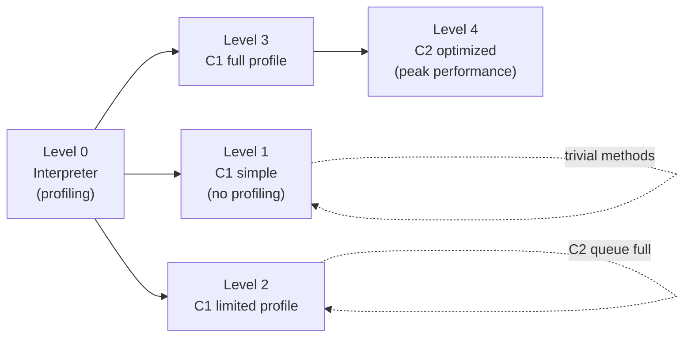

## Mục lục

- [Cùng code, chạy chậm lần đầu rồi nhanh 100× — warmup mystery](#1-cùng-code-chạy-chậm-lần-đầu-rồi-nhanh-100--warmup-mystery)
- [Interpreter → JIT: tại sao không compile trước hết?](#2-interpreter--jit-tại-sao-không-compile-trước-hết)
- [Tiered Compilation — 5 level từ interpreter đến C2 optimized](#3-tiered-compilation--5-level-từ-interpreter-đến-c2-optimized)
- [Profiling & Invocation Counter — khi nào method được compile?](#4-profiling--invocation-counter--khi-nào-method-được-compile)
- [C1 compiler — fast compilation, basic optimizations](#5-c1-compiler--fast-compilation-basic-optimizations)
- [C2 compiler — aggressive optimization, peak performance](#6-c2-compiler--aggressive-optimization-peak-performance)
- [Inlining — optimization quan trọng nhất](#7-inlining--optimization-quan-trọng-nhất)
- [Escape Analysis — object không escape → stack allocate, lock eliminate](#8-escape-analysis--object-không-escape--stack-allocate-lock-eliminate)
- [On-Stack Replacement (OSR) — compile loop đang chạy](#9-on-stack-replacement-osr--compile-loop-đang-chạy)
- [Deoptimization — khi assumption sai, quay lại interpreter](#10-deoptimization--khi-assumption-sai-quay-lại-interpreter)
- [Code Cache — compiled code ở đâu trong memory](#11-code-cache--compiled-code-ở-đâu-trong-memory)
- [GraalVM JIT — Java-written compiler thay thế C2](#12-graalvm-jit--java-written-compiler-thay-thế-c2)
- [Diagnostic flags & đọc JIT output](#13-diagnostic-flags--đọc-jit-output)
- [Tóm tắt — Cheat sheet & 5 nguyên tắc](#14-tóm-tắt--cheat-sheet--5-nguyên-tắc)

---

## 1. Cùng code, chạy chậm lần đầu rồi nhanh 100× — warmup mystery

Benchmark naive: đo thời gian `fibonacci(40)`:

```java
long start = System.nanoTime();
int result = fibonacci(40);
long elapsed = System.nanoTime() - start;
// Lần 1: 850ms
// Lần 2: 820ms
// ...
// Lần 50: 8ms  ← 100× nhanh hơn!
```

Không phải caching, không phải input khác. Cùng computation, cùng result — nhưng JVM **compile lại code** giữa chừng thành native machine code tối ưu.

```text
Lần 1-10:   Interpreter (bytecode → execute từng instruction)     ~800ms
Lần 11-20:  C1 compiled (basic native code)                       ~150ms
Lần 30+:    C2 compiled (aggressive optimized native code)         ~8ms
```

> [!IMPORTANT]
> Java không "interpreted language" cũng không "compiled language" — nó là **mixed-mode**: bắt đầu interpret, thu thập profile, rồi compile thành native code **tốt hơn** static compiler (C/C++) có thể làm — vì nó biết runtime behavior thực tế.

Phần còn lại của doc sẽ đi qua: vì sao JIT chứ không compile trước hết (§2) → tiered compilation 5 level (§3) → profiling & invocation counter (§4) → C1 compiler (§5) → C2 compiler (§6) → inlining (§7) → escape analysis (§8) → on-stack replacement (§9) → deoptimization (§10) → code cache (§11) → GraalVM JIT (§12) → diagnostic flags & JIT output (§13).

---

## 2. Interpreter → JIT: tại sao không compile trước hết?

**AOT (Ahead-Of-Time)** compile mọi thứ trước khi chạy (C, Rust, GraalVM native-image):
- ✅ Startup nhanh
- ❌ Không biết runtime profile → optimization "mù" (phải conservative)
- ❌ Compile time lâu cho project lớn

**JIT (Just-In-Time)** compile **lúc chạy**, sau khi thu thập profile:
- ❌ Startup chậm (warmup)
- ✅ Biết **chính xác** code path nào hot → optimize mạnh tay hơn
- ✅ Speculative optimization: "assume this is always true" → deopt if wrong
- ✅ Chỉ compile code **thực sự chạy** (80/20 rule)

**Ví dụ JIT biết mà AOT không:**

```java
interface Shape { double area(); }
// Runtime: 99.9% thời gian Shape chỉ là Circle
// JIT: inline Circle.area() trực tiếp, bỏ virtual dispatch → 10× nhanh
// AOT: phải giữ virtual dispatch vì không biết runtime sẽ dùng class nào
```

> [!NOTE]
> JIT có **information advantage**: nó thấy actual execution patterns, branch frequencies, type profiles. AOT đoán dựa trên static analysis. Đó là lý do peak throughput Java thường ngang hoặc hơn C++ cho long-running server workloads.

---

## 3. Tiered Compilation — 5 level từ interpreter đến C2 optimized



| Level | Compiler | Profiling | Use case |
|-------|----------|-----------|----------|
| 0 | Interpreter | Có (invocation count, branch) | Mới start, cold code |
| 1 | C1 | Không | Trivial methods (getters), code không hot enough cho C2 |
| 2 | C1 | Limited (invocation + backedge) | C2 queue đầy → dùng C1 tạm |
| 3 | C1 | **Full** (type profile, branch profile) | Đang thu thập data cho C2 |
| 4 | C2 | Không (dùng profile từ L3) | **Peak performance** — aggressive optimizations |

**Typical path**: 0 → 3 → 4 (interpreter → C1 full profile → C2 optimized).

`-XX:+TieredCompilation` (default ON từ JDK 8). Disable: `-XX:-TieredCompilation` → chỉ C2 (slower startup, same peak).

---

## 4. Profiling & Invocation Counter — khi nào method được compile?

### 4.1. Invocation Counter

```
Method counter: tăng mỗi lần method được gọi
Back-edge counter: tăng mỗi lần loop quay lại (backward branch)

Compile threshold (C1): ~invocation 200 (tiered)
Compile threshold (C2): ~invocation 2000+ (after C1 profiling)
```

Khi counter vượt threshold → method enqueue vào **compilation queue**. Compiler thread (background) compile method → swap code pointer.

### 4.2. Type Profile

C1 (level 3) thu thập **receiver type** tại mỗi callsite:

```java
shape.area();  // profile: 99% Circle, 1% Square
```

C2 dùng profile này để **speculate**: "assume luôn là Circle" → inline Circle.area() → bỏ virtual dispatch. Nếu sai → deoptimize (mục 10).

### 4.3. Branch Profile

```java
if (x > 0) {  // profile: 99.8% true
    fastPath();
} else {
    slowPath();
}
// C2: layout code sao cho fast path không branch (fall-through), slow path hiếm → out of line
```

> [!TIP]
> JIT **không** optimize code mà bạn không chạy. Benchmark phải **warmup** đủ (chạy code vài nghìn lần) trước khi đo — nếu không bạn đo interpreter/C1, không phải C2 peak performance. JMH framework tự handle warmup.

---

## 5. C1 compiler — fast compilation, basic optimizations

C1 (Client compiler) — compile nhanh, optimize cơ bản:

| Optimization | Mô tả |
|-------------|--------|
| Method inlining (limited) | Inline small methods |
| Constant folding | `2 + 3` → `5` at compile time |
| Dead code elimination | Remove code never reached |
| Null check elimination | Proven non-null → bỏ check |
| Range check elimination | Array index proven in bounds → bỏ check |
| Register allocation | Local SSA → CPU registers |

C1 compile time: **~µs** (rất nhanh). Code quality: tốt hơn interpreter 5-10×, nhưng chưa peak.

---

## 6. C2 compiler — aggressive optimization, peak performance

C2 (Server compiler) — compile chậm hơn, nhưng code **tốt hơn 2-5×** so với C1:

| Optimization | Mô tả | Impact |
|-------------|--------|--------|
| **Inlining** (aggressive) | Inline deeper, larger methods | Biggest single impact |
| **Escape Analysis** | Object stack-allocated, lock eliminated | Reduce GC, remove sync |
| **Loop unrolling** | Mở loop body N lần, giảm branch | Better ILP |
| **Vectorization (SIMD)** | Auto-vectorize loops → SSE/AVX instructions | 4-16× cho math ops |
| **Intrinsics** | Replace known methods với hand-tuned assembly | Math, String, Array |
| **Speculative optimization** | Type speculation, devirtualize | Bỏ virtual dispatch |
| **Strength reduction** | `x * 8` → `x << 3` | Cheaper ops |
| **Superword** | Combine adjacent scalar ops into SIMD | Data parallelism |

C2 compile time: **~ms** (chậm hơn C1 nhiều). Chạy trên background thread, không block application.

> [!IMPORTANT]
> C2 optimize **dựa trên profile data** từ C1 (level 3). Nếu profile thay đổi sau khi C2 compile (VD: type khác xuất hiện) → deoptimize → re-profile → re-compile. JIT is adaptive.

---

## 7. Inlining — optimization quan trọng nhất

**Inlining**: thay thế method call bằng body của method đó tại callsite.

```java
// Trước inline:
int result = add(a, b);
...
int add(int x, int y) { return x + y; }

// Sau inline:
int result = a + b;  // không còn call overhead (push args, jump, return)
```

**Vì sao quan trọng nhất?** Inlining **mở cửa** cho mọi optimization khác:
- Constant propagation qua method boundary
- Escape analysis thấy object lifecycle đầy đủ
- Dead code elimination khi biết tham số cụ thể
- Loop optimization khi loop body inline

### 7.1. Inlining budget & heuristics

```
-XX:MaxInlineSize=35        (bytecode < 35 bytes → inline luôn, không cần "hot")
-XX:FreqInlineSize=325      (bytecode < 325 bytes → inline nếu hot)
-XX:InlineSmallCode=2000    (compiled code < 2000 bytes → inline)
-XX:MaxInlineLevel=15       (max depth: a() → b() → c() ... 15 cấp)
```

### 7.2. Virtual call devirtualization

```java
interface Animal { void sound(); }
class Dog implements Animal { void sound() { bark(); } }

// JIT profile: callsite luôn nhận Dog
animal.sound();
// C2: speculative devirtualize + inline:
// → ((Dog) animal).bark() → inline bark() body
// + Thêm type guard: if (animal.class != Dog) → deoptimize (uncommon trap)
```

> [!TIP]
> `-XX:+PrintInlining` cho thấy method nào được inline/reject. Lý do reject phổ biến: "too big", "callee is too large", "already compiled into a big method", "call site not reached". Nếu muốn force: `@ForceInline` (internal) hoặc refactor method nhỏ hơn.

---

## 8. Escape Analysis — object không escape → stack allocate, lock eliminate

JIT phân tích object có "escape" (thoát) khỏi method/thread không:

| Escape level | Nghĩa | Optimization |
|-------------|--------|-------------|
| NoEscape | Object chỉ dùng trong method, không store anywhere | **Stack allocation** (bỏ heap + GC), **scalar replacement** |
| ArgEscape | Object truyền vào method khác nhưng không store | Partial optimization |
| GlobalEscape | Object escape (store into field, return, passed to thread) | Không optimize |

```java
public int sumPoints() {
    Point p = new Point(3, 4);   // p KHÔNG escape method
    return p.x + p.y;           // JIT: bỏ allocation, thay bằng: return 3 + 4 = 7
}

// Sau Escape Analysis + Scalar Replacement:
public int sumPoints() {
    int p_x = 3;  // "explode" object thành scalar fields
    int p_y = 4;
    return p_x + p_y;  // = 7 — NO allocation, NO GC pressure
}
```

**Lock elimination** (khi object NoEscape):

```java
public String concat(String a, String b) {
    StringBuffer sb = new StringBuffer();  // NoEscape
    sb.append(a);   // synchronized inside StringBuffer
    sb.append(b);
    return sb.toString();
}
// JIT: sb không escape → lock vô nghĩa → ELIMINATE lock
// → Performance = StringBuilder (unsynchronized)
```

> [!IMPORTANT]
> Escape Analysis cần **inlining trước** — nếu object truyền vào method chưa inline, JIT không thấy "bên trong" method đó → coi là ArgEscape. Inlining + EA = combo mạnh nhất. `-XX:+DoEscapeAnalysis` (default ON).

---

## 9. On-Stack Replacement (OSR) — compile loop đang chạy

Vấn đề: loop chạy 1 triệu iteration trong 1 method call. Invocation counter = 1 (gọi method 1 lần) nhưng **back-edge counter** rất cao. Đợi method được gọi lại lần 2 mới compile → miss toàn bộ loop execution hiện tại.

**OSR**: compile method **NGAY GIỮA LÚC loop đang chạy**, rồi **transfer** execution từ interpreter frame sang compiled code:

```
Interpreter đang chạy iteration 5000 / 1000000
  ↓ back-edge counter > threshold
  ↓ trigger C1/C2 compilation (OSR entry point = loop header)
  ↓ compiled code sẵn sàng
  ↓ transfer state (local vars, stack) từ interpreter → compiled frame
  ↓ tiếp tục từ iteration 5001 trong compiled code
  → Remaining 995000 iterations chạy ở native speed
```

```text
Without OSR: loop 1M iterations all in interpreter = 5s
With OSR: 5000 iterations interpreter (~25ms) + 995000 compiled (~50ms) = ~75ms
```

> [!NOTE]
> OSR compiled code thường **kém tối ưu** hơn normal compiled code (phải handle arbitrary entry point giữa loop). Nếu method được gọi lại, JIT sẽ compile **normal version** (non-OSR) tốt hơn.

---

## 10. Deoptimization — khi assumption sai, quay lại interpreter

JIT **speculate** dựa trên profile. Nếu speculation sai → phải **deoptimize**: discard compiled code, quay lại interpreter:

```java
// Profile: animal luôn là Dog → JIT inline Dog.sound()
animal.sound();
// Đột nhiên: animal = new Cat() xuất hiện!
// → Type guard fail → uncommon trap → deoptimize
```

**Deoptimization flow:**

```
1. Running compiled code → hit uncommon trap (guard fail)
2. JVM pause thread tại safe point
3. Reconstruct interpreter frame từ compiled frame (register → stack)
4. Resume in interpreter (slow path)
5. Re-profile with new type information
6. Re-compile with updated profile (C2 lần 2: bao gồm cả Cat)
```

**Khi nào deopt?**
- Type speculation fail (new type xuất hiện)
- Null check fail (object null lần đầu)
- Array bounds check fail
- Class loading changes (new subclass loaded → invalidate CHA)
- `Thread.stop()` (deprecated, forced deopt)

> [!WARNING]
> Deoptimization rất đắt: reconstruct frame + return to interpreter + re-profile + re-compile. Nếu xảy ra liên tục (oscillate) → performance thrashing. Tránh: giữ type profile ổn định (megamorphic callsite → JIT bỏ cuộc inline).

---

## 11. Code Cache — compiled code ở đâu trong memory

Compiled native code lưu trong **Code Cache** (off-heap memory region):

```
-XX:InitialCodeCacheSize=2496k    (initial)
-XX:ReservedCodeCacheSize=256m    (max — JDK 11+ default)

# JDK 9+: Code Cache chia 3 segment:
# 1. Non-method code (stubs, adapters)          ~5MB
# 2. Profiled code (C1 compiled with profiling)  ~120MB
# 3. Non-profiled code (C2 compiled)             ~120MB
```

**Code Cache full** → JVM **ngừng compile** → performance tụt về C1/interpreter level:

```
CodeCache: size=245760Kb used=245000Kb max_used=245500Kb free=760Kb
 bounds [0x00007f...] CodeHeap 'non-profiled nmethods': [...]
 → CodeCache is almost full. Compiler has been disabled.
```

> [!TIP]
> Monitor Code Cache: `-XX:+PrintCodeCache` (exit), hoặc JMX `java.lang:type=MemoryPool,name=CodeCache`. Nếu full: tăng `-XX:ReservedCodeCacheSize` hoặc review code (quá nhiều generated classes, mega-sized methods).

---

## 12. GraalVM JIT — Java-written compiler thay thế C2

**GraalVM compiler**: JIT compiler viết bằng Java (thay C2 viết bằng C++):

| | C2 | Graal JIT |
|-|---|-----------|
| Language | C++ (~250K LOC) | Java (~150K LOC) |
| Maintainability | Khó (memory management, no safety) | Dễ hơn (GC, type-safe) |
| Optimization quality | Very good | Comparable/better (partial EA, speculative) |
| Compile speed | Fast | Slightly slower (JIT compiling JIT code!) |
| Extensibility | Hard | Easy (Java plugins, Truffle framework) |

**Kích hoạt Graal (JDK 11-16 with JVMCI):**
```
-XX:+UnlockExperimentalVMOptions -XX:+UseJVMCICompiler
```

**GraalVM Native Image** (AOT):
```bash
native-image -jar app.jar  # compile toàn bộ thành native binary
# Startup: ~10ms (vs ~2s JIT warmup)
# Peak throughput: lower (no profile-guided optimization)
# Memory: lower (no JIT compiler, no profiling data)
```

> [!NOTE]
> GraalVM Native Image trade-off: startup ↓↓ (10-100× nhanh), peak throughput ↓ (10-30% chậm hơn warmed JIT), memory ↓. Phù hợp CLI tools, serverless, microservice ngắn hạn. Long-running server: JIT vẫn tốt hơn.

---

## 13. Diagnostic flags & đọc JIT output

```bash
# In compilation events:
-XX:+PrintCompilation
# Output: timestamp compile_id attributes method_name size deopt

# In inlining decisions:
-XX:+PrintInlining

# In assembly (cần hsdis library):
-XX:+UnlockDiagnosticVMOptions -XX:+PrintAssembly

# JIT log cho JITWatch tool:
-XX:+UnlockDiagnosticVMOptions -XX:+LogCompilation -XX:LogFile=jit.log

# Disable C2 (debug: isolate C1 vs C2 issue):
-XX:TieredStopAtLevel=3

# Disable all JIT (measure pure interpreter):
-Xint
```

**PrintCompilation output:**

```text
    147   1       3       java.lang.String::hashCode (55 bytes)
    ↑     ↑       ↑       ↑                         ↑
    time  id    tier    method                    bytecode size

# tier: 1=C1 simple, 2=C1 limited, 3=C1 full, 4=C2
# attributes: % = OSR, s = synchronized, ! = has exception handler, n = native
```

---

## 14. Tóm tắt — Cheat sheet & 5 nguyên tắc

**Cỗ máy trong 6 dòng:**

```
1. Interpreter → C1 (compile nhanh, profile) → C2 (compile chậm, peak optimization)
2. Profiling: invocation count + type profile + branch profile → guide C2 optimizations
3. Inlining: quan trọng nhất — mở cửa cho mọi optimization khác
4. Escape Analysis: NoEscape → stack allocate + lock eliminate + scalar replace
5. Speculative: assume type/branch → optimize aggressive → deopt nếu sai
6. OSR: compile loop ĐANG CHẠY → transfer mid-execution → loop nhanh ngay iteration sau
```

| Phase | Throughput | Startup | Compile cost |
|-------|-----------|---------|-------------|
| Interpreter | 1× | Instant | 0 |
| C1 (Level 3) | 5-10× | ~ms | ~µs per method |
| C2 (Level 4) | 50-100× | ~seconds warmup | ~ms per method |
| C2 + aggressive inlining | 100×+ | ~seconds | Higher |

**5 nguyên tắc khắc cốt:**

1. **JIT > AOT cho long-running server** — profile-guided optimization cho peak throughput vượt static compilation. Warmup = chi phí trả 1 lần.
2. **Inlining là king** — method nhỏ (< 35 bytes) tự động inline. Đừng "optimize" bằng cách gộp logic vào 1 method khổng lồ — ngược lại: methods nhỏ = JIT inline tốt hơn.
3. **Escape Analysis cần inlining** — object truyền vào method chưa inline = escape. Giữ code inline-friendly (small methods, clear types).
4. **Keep types stable** — megamorphic callsite (>2 types) = JIT bỏ cuộc devirtualize + inline. Interface với 1-2 implementation → JIT optimize tốt nhất.
5. **Warmup matters** — đừng benchmark lần chạy đầu. Dùng JMH. Production: pre-warm critical paths trước khi nhận traffic (hoặc dùng CDS + AOT cache JDK 20+).

> [!TIP]
> Một câu để nhớ: *JIT compiler biết nhiều hơn bạn nghĩ — nó thấy code nào thực sự chạy, type nào thực sự xuất hiện, branch nào thực sự đi. Viết code clean, method nhỏ, type ổn định — JIT sẽ lo phần tối ưu tốt hơn bạn tự viết.*
