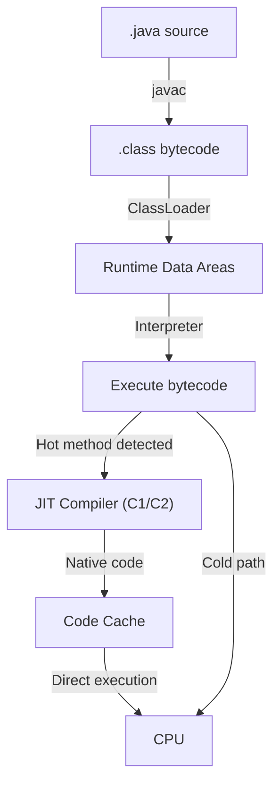
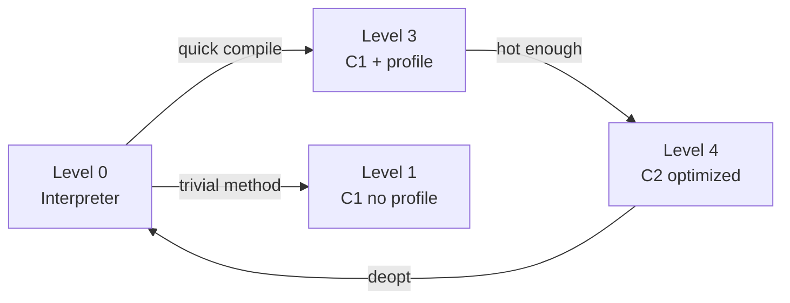

## Mục lục

- [Bối cảnh: "Java chậm" — tại sao Netflix, LinkedIn chạy Java ở scale tỷ request/ngày?](#1-bối-cảnh-java-chậm--tại-sao-netflix-linkedin-chạy-java-ở-scale-tỷ-requestngày)
- [JVM tổng quan — từ .java đến machine code](#2-jvm-tổng-quan--từ-java-đến-machine-code)
- [ClassLoader — hierarchy & delegation model](#3-classloader--hierarchy--delegation-model)
- [Linking: Verify → Prepare → Resolve](#4-linking-verify--prepare--resolve)
- [Runtime Data Areas — memory layout](#5-runtime-data-areas--memory-layout)
- [Bytecode — instruction set cơ bản](#6-bytecode--instruction-set-cơ-bản)
- [Execution Engine — Interpreter → JIT](#7-execution-engine--interpreter--jit)
- [Tiered Compilation — C1 & C2 pipeline](#8-tiered-compilation--c1--c2-pipeline)
- [Method Dispatch — virtual, interface, dynamic](#9-method-dispatch--virtual-interface-dynamic)
- [Inlining — optimisation quan trọng nhất](#10-inlining--optimisation-quan-trọng-nhất)
- [Deoptimization — khi JIT đoán sai](#11-deoptimization--khi-jit-đoán-sai)
- [GraalVM & AOT Compilation](#12-graalvm--aot-compilation)
- [Diagnostic: đọc JIT log & assembly](#13-diagnostic-đọc-jit-log--assembly)
- [Anti-patterns & performance pitfalls](#14-anti-patterns--performance-pitfalls)
- [Tóm tắt — Cheat sheet & 5 nguyên tắc](#15-tóm-tắt--cheat-sheet--5-nguyên-tắc)

---

## 1. Bối cảnh: "Java chậm" — tại sao Netflix, LinkedIn chạy Java ở scale tỷ request/ngày?

Năm 2003, "Java chậm" là sự thật — interpreted bytecode, không optimize. Năm 2024, Java xử lý:
- Netflix: **hàng tỷ API call/ngày**, microservices trên JVM
- LinkedIn: **5+ triệu request/giây** (peak)
- Alibaba: **544.000 đơn/giây** trong 11.11

Bí mật: **JIT compiler** — JVM **quan sát** code chạy, rồi compile hot path thành **native machine code** tối ưu hơn cả C++ compiler (vì có runtime profile data):

```text
Cold start:  Interpreter → ~50x slower than native
After 10K calls: C1 compile → ~5x slower
After 100K calls: C2 compile → on par with / faster than C++
                   (speculative optimization + inlining + escape analysis)
```

> [!IMPORTANT]
> JVM không "chạy bytecode" — nó **biên dịch bytecode thành native code tối ưu** dựa trên runtime behavior thực tế. Đây là adaptive optimization mà AOT compiler (GCC, LLVM) không có được.

---

## 2. JVM tổng quan — từ .java đến machine code



| Component | Vai trò |
|-----------|---------|
| **javac** | Source → bytecode (platform-independent) |
| **ClassLoader** | Load .class vào memory, link, initialize |
| **Runtime Data Areas** | Heap, Stack, Metaspace, Code Cache |
| **Interpreter** | Chạy bytecode từng instruction (ban đầu) |
| **JIT Compiler** | Compile hot methods → native code |
| **GC** | Quản lý heap memory |

---

## 3. ClassLoader — hierarchy & delegation model

### 3.1. Ba ClassLoader mặc định

```
┌─────────────────────────────────────┐
│     Bootstrap ClassLoader            │ ← java.lang.*, java.util.* (rt.jar / modules)
│     (native code, null parent)       │
└─────────────────┬───────────────────┘
                  │ delegate up
┌─────────────────┴───────────────────┐
│     Platform ClassLoader             │ ← java.sql.*, javax.*, JDK extensions
│     (jdk.internal.loader)            │
└─────────────────┬───────────────────┘
                  │ delegate up
┌─────────────────┴───────────────────┐
│     Application ClassLoader          │ ← classpath (your code, libs)
│     (sun.misc.Launcher$AppClassLoader)│
└─────────────────────────────────────┘
```

### 3.2. Parent Delegation Model

Khi cần load class `com.example.Foo`:

```
1. AppClassLoader → hỏi PlatformClassLoader: "bạn có Foo?"
2. PlatformClassLoader → hỏi BootstrapClassLoader: "bạn có Foo?"
3. Bootstrap: "Không" → trả về Platform
4. Platform: "Không" → trả về App
5. AppClassLoader: tự load từ classpath
```

**Tại sao?** Security + consistency. Ngăn user code định nghĩa `java.lang.String` giả.

### 3.3. Custom ClassLoader

```java
public class HotReloadClassLoader extends ClassLoader {
    @Override
    protected Class<?> findClass(String name) throws ClassNotFoundException {
        byte[] bytecode = loadBytecodeFromDisk(name);  // load mới mỗi lần
        return defineClass(name, bytecode, 0, bytecode.length);
    }
}
// Dùng cho: hot-deploy, plugin system, bytecode manipulation
```

> [!TIP]
> Application servers (Tomcat, WildFly) mỗi webapp có **ClassLoader riêng** — isolation giữa apps. Class "cùng tên" từ 2 webapp là 2 class KHÁC NHAU (vì khác ClassLoader = khác identity).

---

## 4. Linking: Verify → Prepare → Resolve

Sau khi ClassLoader load bytecode, JVM thực hiện **linking** 3 bước:

| Phase | Hành động |
|-------|----------|
| **Verify** | Kiểm tra bytecode hợp lệ (stack overflow, type safety, branch targets) |
| **Prepare** | Allocate memory cho static fields, set default values (0, null, false) |
| **Resolve** | Chuyển symbolic references (tên class/method) → direct references (pointer) |

```java
class Foo {
    static int x = 42;    // Prepare: x = 0 (default int)
                           // Initialize: x = 42 (chạy <clinit>)
}
```

**Initialization** (sau linking): chạy `<clinit>` (class initializer) — static blocks, static field assignments. JVM đảm bảo **exactly once**, **thread-safe**.

---

## 5. Runtime Data Areas — memory layout

```
┌─────────────────────────────────────────────────────────────┐
│                         JVM Process                          │
├──────────────────────────┬──────────────────────────────────┤
│     SHARED (all threads) │          PER-THREAD              │
├──────────────────────────┼──────────────────────────────────┤
│  ┌──────────────────┐    │  ┌──────────────────────┐        │
│  │      HEAP        │    │  │   JVM Stack           │        │
│  │  (objects, GC)   │    │  │   (frame per method)  │        │
│  └──────────────────┘    │  └──────────────────────┘        │
│  ┌──────────────────┐    │  ┌──────────────────────┐        │
│  │   Metaspace      │    │  │   PC Register         │        │
│  │  (class metadata)│    │  │   (current bytecode)  │        │
│  └──────────────────┘    │  └──────────────────────┘        │
│  ┌──────────────────┐    │  ┌──────────────────────┐        │
│  │   Code Cache     │    │  │   Native Method Stack │        │
│  │  (JIT compiled)  │    │  │   (JNI calls)         │        │
│  └──────────────────┘    │  └──────────────────────┘        │
└──────────────────────────┴──────────────────────────────────┘
```

| Area | Nội dung | Tuning |
|------|---------|--------|
| **Heap** | Objects, arrays | `-Xms`, `-Xmx` |
| **Metaspace** | Class metadata, method bytecode | `-XX:MaxMetaspaceSize` |
| **Code Cache** | JIT-compiled native code | `-XX:ReservedCodeCacheSize` |
| **JVM Stack** | Stack frames (locals, operand stack) | `-Xss` (per-thread) |
| **PC Register** | Address of current bytecode instruction | Fixed, tiny |

### 5.1. Stack Frame

Mỗi method invocation = 1 **frame** pushed lên JVM stack:

```
┌───────────────────────────────┐
│         Stack Frame           │
├───────────────────────────────┤
│  Local Variable Array         │ ← [0]=this, [1]=param1, [2]=local1 ...
│  Operand Stack                │ ← stack-based computation
│  Frame Data                   │ ← constant pool ref, exception table
└───────────────────────────────┘
```

---

## 6. Bytecode — instruction set cơ bản

### 6.1. Stack-based VM

JVM là **stack machine** — không dùng registers (khác x86):

```java
int add(int a, int b) { return a + b; }
```

Bytecode:
```
0: iload_1        // push a (local var 1) lên operand stack
1: iload_2        // push b (local var 2) lên operand stack
2: iadd           // pop 2 giá trị, cộng, push kết quả
3: ireturn        // pop kết quả, return
```

### 6.2. Các nhóm instruction chính

| Category | Instructions | Mô tả |
|----------|-------------|--------|
| Load/Store | `iload`, `aload`, `istore` | Load/store local vars ↔ operand stack |
| Arithmetic | `iadd`, `isub`, `imul`, `idiv` | Operations trên operand stack |
| Object | `new`, `getfield`, `putfield` | Object creation, field access |
| Invoke | `invokevirtual`, `invokestatic`, `invokeinterface`, `invokedynamic` | Method calls |
| Control | `goto`, `if_icmpgt`, `tableswitch` | Branching |
| Stack | `dup`, `pop`, `swap` | Stack manipulation |

### 6.3. Ví dụ phức tạp hơn

```java
String greet(String name) {
    return "Hello, " + name + "!";
}
```

```
0: new #2             // new StringBuilder
3: dup                // duplicate reference (for <init>)
4: invokespecial #3   // StringBuilder.<init>()
7: ldc #4             // push "Hello, "
9: invokevirtual #5   // StringBuilder.append(String)
12: aload_1           // push name
13: invokevirtual #5  // StringBuilder.append(String)
16: ldc #6            // push "!"
18: invokevirtual #5  // StringBuilder.append(String)
21: invokevirtual #7  // StringBuilder.toString()
24: areturn           // return String
```

> [!TIP]
> `javap -c -p ClassName.class` — xem bytecode. `javap -v` — verbose (constant pool, line numbers). Hiểu bytecode = hiểu JIT, debug performance, security audit.

---

## 7. Execution Engine — Interpreter → JIT

### 7.1. Interpreter

Đọc bytecode → decode → execute từng instruction. **Chậm** (switch-case dispatch) nhưng:
- Bắt đầu **ngay lập tức** (không cần compile time)
- Thu thập **profiling data** (method call count, branch frequencies)

### 7.2. JIT Compiler (Just-In-Time)

Khi method được gọi đủ nhiều (**hot**) → JIT compile thành **native machine code**:

```
Invocation Counter >= CompileThreshold (default: 10,000)
   → Trigger compilation
   → Native code lưu vào Code Cache
   → Subsequent calls → execute native code trực tiếp
```

### 7.3. Tại sao JIT có thể nhanh hơn AOT?

| JIT advantage | Lý do |
|---------------|-------|
| **Profile-guided optimization** | Biết branch nào hay taken → optimize hot path |
| **Speculative optimization** | Inline virtual method nếu chỉ 1 implementation loaded |
| **Escape analysis** | Object không escape method → allocate trên stack (không GC) |
| **Loop optimization** | Unroll loop theo actual iteration count |
| **Dead code elimination** | Runtime biết branch nào never taken |

> [!IMPORTANT]
> JIT = **adaptive optimization**: tối ưu dựa trên **actual runtime behavior** chứ không phải static analysis. Đó là lý do warm JVM nhanh hơn cả C++ trong nhiều benchmark (speculative inlining, devirtualization).

---

## 8. Tiered Compilation — C1 & C2 pipeline

JDK 8+ mặc định dùng **Tiered Compilation** — 5 levels:

| Level | Compiler | Profile | Speed | Optimization |
|-------|----------|---------|-------|-------------|
| 0 | Interpreter | Full profiling | Chậm nhất | Không |
| 1 | **C1** (client) | Không profile | Nhanh | Cơ bản |
| 2 | C1 | Limited profile | Nhanh | Cơ bản + counting |
| 3 | C1 | Full profile | Nhanh | Cơ bản + profiling |
| 4 | **C2** (server) | Dùng profile data | **Nhanh nhất** | **Aggressive** |



**C1** (Client Compiler):
- Compile nhanh, optimization đơn giản
- Inline nhỏ, constant folding, null check elimination
- Target: startup speed

**C2** (Server Compiler):
- Compile chậm hơn, optimization **cực aggressive**
- Loop unrolling, vectorization (SIMD), escape analysis, lock elision, speculative devirtualization
- Target: peak throughput

```bash
# Xem compilation log:
java -XX:+PrintCompilation MyApp
#  87   3    java.lang.String::hashCode (55 bytes)   ← level 3 (C1)
# 155   4    java.lang.String::hashCode (55 bytes)   ← level 4 (C2) → replaced
```

---

## 9. Method Dispatch — virtual, interface, dynamic

### 9.1. invokestatic / invokespecial

- `invokestatic`: static methods — resolved at compile time
- `invokespecial`: constructors, private methods, super calls — known target

Cả hai: **direct dispatch** — JVM biết chính xác method nào, gọi trực tiếp.

### 9.2. invokevirtual — vtable

```java
Animal a = new Dog();
a.speak();  // invokevirtual — runtime dispatch dựa trên actual object type
```

JVM dùng **vtable** (virtual method table):

```
Dog.class metadata:
┌─────────────────────────────┐
│         vtable               │
├─────────────────────────────┤
│ [0] Object.hashCode → addr  │
│ [1] Object.equals → addr    │
│ [2] Animal.speak → Dog.speak addr  │  ← override
│ [3] Dog.fetch → addr         │
└─────────────────────────────┘
```

Dispatch: `receiver.getClass().vtable[method_index]` → **O(1)** lookup.

### 9.3. invokeinterface — itable

Interface method call phức tạp hơn (class implement nhiều interface → vtable index không cố định):

```java
Comparable c = new String("hello");
c.compareTo("world");  // invokeinterface
```

JVM dùng **itable** (interface method table) — search qua interfaces, **O(n)** worst case (nhưng cached).

### 9.4. invokedynamic (JDK 7+)

Cho lambda, method references, dynamic languages:

```java
list.forEach(System.out::println);
// invokedynamic: bootstrap method resolve tại runtime → cache CallSite
```

```
invokedynamic #15 <forEach>
    BootstrapMethod: LambdaMetafactory.metafactory(...)
    → tạo CallSite, link đến generated class cho lambda
    → subsequent calls: direct dispatch (no lookup overhead)
```

> [!TIP]
> `invokedynamic` + `LambdaMetafactory` = lambda không tạo inner class file. JVM sinh class **tại runtime** (hoặc dùng MethodHandle trực tiếp). Nhanh hơn anonymous class cũ.

---

## 10. Inlining — optimisation quan trọng nhất

**Inlining** = copy body của callee method vào call site — loại bỏ method invocation overhead VÀ mở đường cho các optimization khác.

```java
// Before inlining:
int result = Math.max(a, b);

// After inlining (conceptual):
int result = (a >= b) ? a : b;  // no method call, no stack frame
```

### 10.1. Tại sao inlining quan trọng nhất?

Inlining **mở cửa** cho:
- **Constant folding** (nếu a, b là constant → result = constant)
- **Dead code elimination** (nếu branch unreachable)
- **Escape analysis** (object created inside inlined code → stack allocate)
- **Lock elision** (synchronized trên non-escaping object → loại bỏ lock)

### 10.2. Inlining limits

```
-XX:MaxInlineSize=35        ← method ≤ 35 bytes bytecode → luôn inline
-XX:FreqInlineSize=325      ← hot method ≤ 325 bytes → inline
-XX:MaxInlineLevel=9        ← max recursion depth cho inlining
-XX:InlineSmallCode=2000    ← compiled code size limit
```

### 10.3. Monomorphic / Bimorphic call sites

JIT aggressive inline **virtual method** nếu profiling cho thấy chỉ có 1-2 implementations tại call site:

```java
// Monomorphic: chỉ Dog.speak() tại call site này (100% calls)
// → JIT inline Dog.speak() trực tiếp, guard bằng type check

// Megamorphic: 3+ implementations → vtable lookup (không inline)
```

---

## 11. Deoptimization — khi JIT đoán sai

### 11.1. Khi nào deopt?

JIT compiler đưa ra **speculative assumptions**:
- "Class Dog là implementation duy nhất của Animal.speak() tại site này"
- "This branch is always true"
- "This field is never null"

Nếu assumption bị **invalidate** (load class mới implement Animal, branch taken khác) → **deoptimize**:

```
1. Native code bị discard
2. Stack frame chuyển lại về interpreted state (uncommon trap)
3. Execution tiếp tục ở interpreter
4. Profiling lại → re-compile với knowledge mới
```

### 11.2. Ví dụ thực tế

```java
interface Shape { double area(); }
class Circle implements Shape { ... }    // loaded đầu tiên

// JIT: "chỉ có Circle" → inline Circle.area() trực tiếp
shape.area();  // → native: circle-specific code

// LATER: classLoader load Square implements Shape
// → JIT deoptimize! Uncommon trap → interpreter → re-compile với vtable dispatch
```

### 11.3. JIT log cho deopt

```bash
java -XX:+PrintCompilation -XX:+TraceDeoptimization MyApp
```

```
DEOPT: reason=class_check method=App.process(LShape;) bci=12
    Invalidated nmethod at 0x00007f...
    Recompiling: App.process(LShape;)
```

> [!WARNING]
> Frequent deoptimization = performance cliff. Tránh: load class dynamically vào hot path, megamorphic call sites (3+ implementations trên cùng reference type tại cùng line).

---

## 12. GraalVM & AOT Compilation

### 12.1. GraalVM JIT (thay C2)

**Graal** là JIT compiler viết bằng Java (thay C2 viết bằng C++) — dễ extend, dễ optimize:

```bash
java -XX:+UnlockExperimentalVMOptions -XX:+UseJVMCICompiler MyApp
```

Graal có optimization mà C2 không có:
- **Partial escape analysis** (object escape ở 1 branch nhưng không ở branch khác → stack allocate ở branch safe)
- **Better inlining heuristics**
- **Polyglot** (chạy JS, Python, Ruby trên cùng JVM)

### 12.2. Native Image (AOT)

```bash
native-image --no-fallback -o myapp MyApp
# → myapp: standalone native binary, startup < 10ms, no JVM
```

| Feature | JIT (HotSpot) | AOT (Native Image) |
|---------|---------------|-------------------|
| Startup | ~1-5s (warm up) | **< 50ms** |
| Peak throughput | **Cao hơn** (runtime optimization) | Thấp hơn (static compile) |
| Memory footprint | Lớn (JVM overhead) | **Nhỏ** (~10-50MB) |
| Optimization | Runtime profile-guided | Compile-time only |
| Reflection | Full support | **Restricted** (need config) |

> [!TIP]
> AOT (GraalVM Native Image) phù hợp cho: **serverless**, **CLI tools**, **containers** (cần startup nhanh, footprint nhỏ). JIT phù hợp cho: **long-running services** (cần peak throughput sau warm-up).

---

## 13. Diagnostic: đọc JIT log & assembly

### 13.1. PrintCompilation

```bash
java -XX:+PrintCompilation MyApp
```

```
    29    1       java.lang.Object::<init> (1 bytes)
    45    2       java.lang.String::hashCode (55 bytes)
   102    3  s    java.lang.StringBuffer::append (13 bytes)
   156    4  n    java.lang.System::arraycopy (native)
```

| Column | Ý nghĩa |
|--------|---------|
| 29 | Timestamp (ms) |
| 1 | Compilation ID |
| (blank) | Tier (1-4) |
| s | synchronized |
| n | native method |
| (55 bytes) | Bytecode size |

### 13.2. Xem native assembly

```bash
java -XX:+UnlockDiagnosticVMOptions -XX:+PrintAssembly MyApp
# Cần hsdis-amd64.so plugin
```

### 13.3. JFR (Java Flight Recorder)

```bash
java -XX:StartFlightRecording=filename=recording.jfr,duration=60s MyApp
jfr print --events jdk.Compilation recording.jfr
```

---

## 14. Anti-patterns & performance pitfalls

| Anti-pattern | Vì sao ảnh hưởng JVM | Giải pháp |
|--------------|---------------------|-----------|
| Megamorphic call site (3+ types) | JIT không inline → vtable lookup | Redesign để monomorphic/bimorphic |
| Quá nhiều interface layers | invokeinterface + itable search | Flatten hierarchy cho hot paths |
| Reflection trên hot path | Bypass JIT inlining, slow | Cache MethodHandle / code-gen |
| Code Cache đầy | JIT stop compiling → degrade to interpreter | `-XX:ReservedCodeCacheSize=512m` |
| Giant methods (>325 bytes bytecode) | Không được inline | Split method, extract hot parts |
| Startup overhead mà không cần warm | AOT/CDS có thể giúp | AppCDS, GraalVM Native Image |
| `-Xss` quá lớn (10MB) | Mỗi thread tốn 10MB stack → ít thread | Default 512KB-1MB đủ |

**Giữ method nhỏ để JIT inline:**

```java
// ❌ Giant method (500 lines) → JIT KHÔNG inline
public Result processEverything(Request req) {
    // ... 500 lines of code ...
}

// ✅ Split → JIT inline các phần hot:
public Result processEverything(Request req) {
    var validated = validate(req);       // small → inlined
    var enriched = enrich(validated);    // small → inlined
    return compute(enriched);           // small → inlined
}
```

---

## 15. Tóm tắt — Cheat sheet & 5 nguyên tắc

**Cỗ máy trong 6 dòng:**

```
1. javac → bytecode → ClassLoader → Runtime Data Areas
2. Interpreter chạy trước, thu thập profile → JIT compile hot methods
3. Tiered: Level 0 (interp) → Level 3 (C1 + profile) → Level 4 (C2 optimized)
4. Inlining = most important optimization (mở cửa cho mọi opt khác)
5. Speculative optimization: JIT giả định → deopt nếu sai → re-compile
6. ClassLoader delegation: parent-first → security + isolation
```

| Component | Tuning Flag |
|-----------|-------------|
| Heap | `-Xms`, `-Xmx` |
| Metaspace | `-XX:MaxMetaspaceSize` |
| Code Cache | `-XX:ReservedCodeCacheSize` |
| Thread Stack | `-Xss` |
| Compile threshold | `-XX:CompileThreshold` |
| Tiered | `-XX:+TieredCompilation` (default on) |

**5 nguyên tắc khắc cốt:**

1. **JIT > Interpreter** — warm-up JVM trước khi benchmark. Cold JVM ≠ production perf.
2. **Small methods = inlinable** — method ≤ 35 bytes bytecode luôn inline. Giant method = lost optimization.
3. **Monomorphic > Megamorphic** — 1 implementation tại call site → JIT inline. 3+ types → vtable → chậm.
4. **Profile guides optimization** — JIT tối ưu dựa trên actual behavior. Đổi behavior (load class mới) → deopt → re-opt.
5. **Đo warm** — benchmark phải chạy đủ lâu để JIT kick in. JMH tự handle warm-up.

> [!TIP]
> Một câu để nhớ: *JVM không chạy bytecode — nó compile bytecode thành machine code tối ưu theo profile thực tế. Giữ method nhỏ (inlinable), call site monomorphic, và cho JVM warm-up đủ lâu — bạn sẽ có code nhanh ngang C++.*
