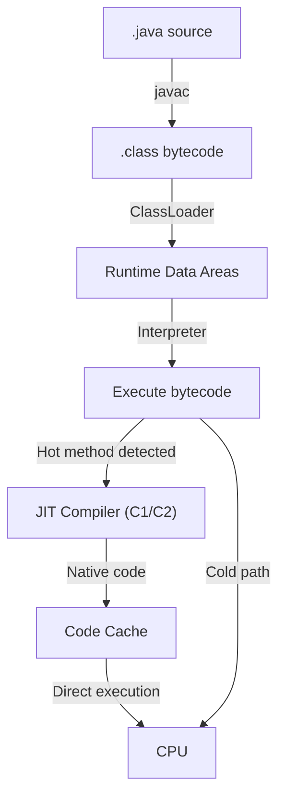
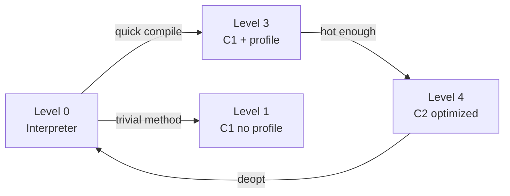

JVM là runtime thực thi Java bytecode và cung cấp các dịch vụ như quản lý bộ nhớ, nạp class, kiểm tra bytecode, biên dịch JIT và điều phối thread. Kiến trúc này là nền tảng cho tính độc lập nền tảng của hệ sinh thái Java.

## Mục lục

- [Tổng quan](#1-tổng-quan)
- [JVM tổng quan — từ .java đến machine code](#2-jvm-tổng-quan--từ-java-đến-machine-code)
- [ClassLoader — hierarchy & delegation model](#3-classloader--hierarchy--delegation-model)
- [Linking: Verify → Prepare → Resolve](#4-linking-verify--prepare--resolve)
- [Runtime Data Areas — memory layout](#5-runtime-data-areas--memory-layout)
- [Bytecode — instruction set cơ bản](#6-bytecode--instruction-set-cơ-bản)
- [Execution Engine — Interpreter → JIT](#7-execution-engine--interpreter--jit)
  - [7.1. Ba loại code: source, bytecode và native machine code](#71-ba-loại-code-source-bytecode-và-native-machine-code)
  - [7.2. Interpreter: cái gì được thông dịch, chạy khi nào?](#72-interpreter-cái-gì-được-thông-dịch-chạy-khi-nào)
  - [7.3. JIT: cái gì được biên dịch, chạy khi nào?](#73-jit-cái-gì-được-biên-dịch-chạy-khi-nào)
  - [7.4. Một method đi qua các trạng thái nào?](#74-một-method-đi-qua-các-trạng-thái-nào)
  - [7.5. Method, loop và native method: trường hợp nào khác?](#75-method-loop-và-native-method-trường-hợp-nào-khác)
  - [7.6. Tại sao JIT có thể nhanh hơn AOT?](#76-tại-sao-jit-có-thể-nhanh-hơn-aot)
- [Tiered Compilation — C1 & C2 pipeline](#8-tiered-compilation--c1--c2-pipeline)
- [Method Dispatch — virtual, interface, dynamic](#9-method-dispatch--virtual-interface-dynamic)
- [Inlining — optimisation quan trọng nhất](#10-inlining--optimisation-quan-trọng-nhất)
- [Deoptimization — khi JIT đoán sai](#11-deoptimization--khi-jit-đoán-sai)
- [GraalVM & AOT Compilation](#12-graalvm--aot-compilation)
- [Diagnostic: đọc JIT log & assembly](#13-diagnostic-đọc-jit-log--assembly)
- [Anti-patterns & performance pitfalls](#14-anti-patterns--performance-pitfalls)
- [Tóm tắt — Cheat sheet & 5 nguyên tắc](#15-tóm-tắt--cheat-sheet--5-nguyên-tắc)

---

## 1. Tổng quan

Source code được compiler chuyển thành bytecode, class loader đưa class vào runtime, execution engine diễn giải hoặc biên dịch bytecode thành machine code, còn runtime data areas giữ trạng thái chương trình. Garbage collector quản lý vòng đời object trên heap.

Hiểu các thành phần và luồng thực thi giúp liên kết hiện tượng ở tầng code với hành vi thật của JVM khi chẩn đoán hiệu năng, lỗi bộ nhớ và vấn đề class loading.

## 2. JVM tổng quan — từ .java đến machine code



| Component | Vai trò |
|-----------|---------|
| **javac** | Source → bytecode (platform-independent) |
| **ClassLoader** | Load .class vào memory, link, initialize |
| **Runtime Data Areas** | Heap, Stack, Metaspace, Code Cache |
| **Interpreter** | Chạy bytecode từng instruction (ban đầu) |
| **JIT Compiler** | Compile hot methods → native code |
| **GC** | Quản lý heap memory |

---

## 3. ClassLoader — hierarchy & delegation model

### 3.1. Ba ClassLoader mặc định

```
┌─────────────────────────────────────┐
│     Bootstrap ClassLoader           │ ← java.lang.*, java.util.* (rt.jar / modules)
│     (native code, null parent)      │
└─────────────────┬───────────────────┘
                  │ delegate up
┌─────────────────┴───────────────────┐
│     Platform ClassLoader            │ ← java.sql.*, javax.*, JDK extensions
│     (jdk.internal.loader)           │
└─────────────────┬───────────────────┘
                  │ delegate up
┌─────────────────┴───────────────────┐
│     Application ClassLoader         │ ← classpath (your code, libs)
│   (sun.misc.Launcher$AppClassLoader)│
└─────────────────────────────────────┘
```

### 3.2. Parent Delegation Model

Khi cần load class `com.example.Foo`:

```
1. AppClassLoader → hỏi PlatformClassLoader: "bạn có Foo?"
2. PlatformClassLoader → hỏi BootstrapClassLoader: "bạn có Foo?"
3. Bootstrap: "Không" → trả về Platform
4. Platform: "Không" → trả về App
5. AppClassLoader: tự load từ classpath
```

**Tại sao?** Security + consistency. Ngăn user code định nghĩa `java.lang.String` giả.

### 3.3. Custom ClassLoader

```java
public class HotReloadClassLoader extends ClassLoader {
    @Override
    protected Class<?> findClass(String name) throws ClassNotFoundException {
        byte[] bytecode = loadBytecodeFromDisk(name);  // load mới mỗi lần
        return defineClass(name, bytecode, 0, bytecode.length);
    }
}
// Dùng cho: hot-deploy, plugin system, bytecode manipulation
```

> [!TIP]
> Application servers (Tomcat, WildFly) mỗi webapp có **ClassLoader riêng** — isolation giữa apps. Class "cùng tên" từ 2 webapp là 2 class KHÁC NHAU (vì khác ClassLoader = khác identity).

---

## 4. Linking: Verify → Prepare → Resolve

Sau khi ClassLoader load bytecode, JVM thực hiện **linking** 3 bước:

| Phase | Hành động |
|-------|----------|
| **Verify** | Kiểm tra bytecode hợp lệ (stack overflow, type safety, branch targets) |
| **Prepare** | Allocate memory cho static fields, set default values (0, null, false) |
| **Resolve** | Chuyển symbolic references (tên class/method) → direct references (pointer) |

```java
class Foo {
    static int x = 42;    // Prepare: x = 0 (default int)
                           // Initialize: x = 42 (chạy <clinit>)
}
```

**Initialization** (sau linking): chạy `<clinit>` (class initializer) — static blocks, static field assignments. JVM đảm bảo **exactly once**, **thread-safe**.

### 4.1. Constant Pool Resolution — từ symbolic → direct reference

Trong `.class` file, mọi reference đều là **symbolic** (text-based). Linking phase **resolve** chúng thành memory addresses:

```
Constant Pool (trong .class file):
  #1 = Methodref   java/lang/Object.<init>:()V     ← symbolic
  #2 = Fieldref    com/example/Foo.name:Ljava/lang/String;
  #3 = Class       com/example/Bar
  #7 = String      "hello"

SAU Resolve:
  #1 → trỏ thẳng vào Method* object trong Metaspace (direct pointer)
  #2 → offset trong object layout (field access = base + offset)
  #3 → Klass* trong Metaspace
  #7 → oop (ordinary object pointer) trong String Pool
```

**Lazy resolution:** JVM resolve **on-demand** (lần đầu dùng), không resolve hết khi load. Nếu class #3 chưa được load → trigger loading chain.

### 4.2. Class initialization lock — thread safety

```java
class Config {
    static final Map<String, String> DEFAULTS = loadDefaults(); // <clinit>
}
```

JVM đảm bảo `<clinit>` chỉ chạy **1 lần** dù nhiều thread access đồng thời:
- Thread đầu tiên acquire **initialization lock** cho class
- Các thread khác **block** cho đến khi init xong
- Đây là lý do **Holder pattern** cho lazy singleton hoạt động thread-safe mà không cần `synchronized`:

```java
class Singleton {
    private static class Holder {
        static final Singleton INSTANCE = new Singleton(); // chạy khi Holder được load
    }
    static Singleton get() { return Holder.INSTANCE; } // trigger load Holder
}
```

---

## 5. Runtime Data Areas — memory layout

```
┌─────────────────────────────────────────────────────────────┐
│                         JVM Process                         │
├──────────────────────────┬──────────────────────────────────┤
│     SHARED (all threads) │          PER-THREAD              │
├──────────────────────────┼──────────────────────────────────┤
│  ┌──────────────────┐    │  ┌──────────────────────┐        │
│  │      HEAP        │    │  │   JVM Stack          │        │
│  │  (objects, GC)   │    │  │   (frame per method) │        │
│  └──────────────────┘    │  └──────────────────────┘        │
│  ┌──────────────────┐    │  ┌──────────────────────┐        │
│  │   Metaspace      │    │  │   PC Register        │        │
│  │  (class metadata)│    │  │   (current bytecode) │        │
│  └──────────────────┘    │  └──────────────────────┘        │
│  ┌──────────────────┐    │  ┌──────────────────────┐        │
│  │   Code Cache     │    │  │   Native Method Stack│        │
│  │  (JIT compiled)  │    │  │   (JNI calls)        │        │
│  └──────────────────┘    │  └──────────────────────┘        │
└──────────────────────────┴──────────────────────────────────┘
```

| Area | Nội dung | Tuning |
|------|---------|--------|
| **Heap** | Objects, arrays | `-Xms`, `-Xmx` |
| **Metaspace** | Class metadata, method bytecode | `-XX:MaxMetaspaceSize` |
| **Code Cache** | JIT-compiled native code | `-XX:ReservedCodeCacheSize` |
| **JVM Stack** | Stack frames (locals, operand stack) | `-Xss` (per-thread) |
| **PC Register** | Address of current bytecode instruction | Fixed, tiny |

### 5.1. Stack Frame

Mỗi method invocation = 1 **frame** pushed lên JVM stack:

```
┌───────────────────────────────┐
│         Stack Frame           │
├───────────────────────────────┤
│  Local Variable Array         │ ← [0]=this, [1]=param1, [2]=local1 ...
│  Operand Stack                │ ← stack-based computation
│  Frame Data                   │ ← constant pool ref, exception table
└───────────────────────────────┘
```

---

## 6. Bytecode — instruction set cơ bản

### 6.1. Stack-based VM

JVM là **stack machine** — không dùng registers (khác x86):

```java
int add(int a, int b) { return a + b; }
```

Bytecode:
```
0: iload_1        // push a (local var 1) lên operand stack
1: iload_2        // push b (local var 2) lên operand stack
2: iadd           // pop 2 giá trị, cộng, push kết quả
3: ireturn        // pop kết quả, return
```

### 6.2. Các nhóm instruction chính

| Category | Instructions | Mô tả |
|----------|-------------|--------|
| Load/Store | `iload`, `aload`, `istore` | Load/store local vars ↔ operand stack |
| Arithmetic | `iadd`, `isub`, `imul`, `idiv` | Operations trên operand stack |
| Object | `new`, `getfield`, `putfield` | Object creation, field access |
| Invoke | `invokevirtual`, `invokestatic`, `invokeinterface`, `invokedynamic` | Method calls |
| Control | `goto`, `if_icmpgt`, `tableswitch` | Branching |
| Stack | `dup`, `pop`, `swap` | Stack manipulation |

### 6.3. Ví dụ phức tạp hơn

```java
String greet(String name) {
    return "Hello, " + name + "!";
}
```

```
0: new #2             // new StringBuilder
3: dup                // duplicate reference (for <init>)
4: invokespecial #3   // StringBuilder.<init>()
7: ldc #4             // push "Hello, "
9: invokevirtual #5   // StringBuilder.append(String)
12: aload_1           // push name
13: invokevirtual #5  // StringBuilder.append(String)
16: ldc #6            // push "!"
18: invokevirtual #5  // StringBuilder.append(String)
21: invokevirtual #7  // StringBuilder.toString()
24: areturn           // return String
```

> [!TIP]
> `javap -c -p ClassName.class` — xem bytecode. `javap -v` — verbose (constant pool, line numbers). Hiểu bytecode = hiểu JIT, debug performance, security audit.

---

## 7. Execution Engine — Interpreter → JIT

`Execution Engine` là phần HotSpot thực thi **bytecode đã được load**, chứ không đọc trực tiếp file `.java`. Nó có hai đường chính:

- **Interpreter**: thông dịch bytecode từng instruction khi code còn mới hoặc không đủ nóng.
- **JIT compiler** (*Just-In-Time*): biên dịch bytecode của method/loop nóng thành machine code đúng kiến trúc CPU hiện tại; CPU chạy machine code đó trực tiếp.

Một ứng dụng bình thường dùng **cả hai**, không phải chọn một trong hai cho toàn bộ chương trình.

### 7.1. Ba loại code: source, bytecode và native machine code

Cần tách ba lần “biên dịch/thực thi” thường bị gọi lẫn là “Java được compile”.

```text
.java source
  └─ javac (khi build; trước lúc application chạy)
       └─ .class bytecode
            └─ HotSpot Interpreter (lúc runtime; từng bytecode instruction)
                 hoặc
            └─ HotSpot JIT C1/C2 (lúc runtime; chỉ code nóng)
                 └─ native machine code trong Code Cache
                      └─ CPU thực thi trực tiếp
```

| Thành phần | Input → Output | Khi chạy | Có làm cho mọi method không? |
|---|---|---|---|
| `javac` | Java source → JVM bytecode | Build/CI, trước khi chạy app | Có, với source được build |
| **Interpreter** | Đọc và thực hiện bytecode | Runtime, khi method được gọi | Có thể; cold method thường chỉ đi đường này |
| **JIT** (`C1`/`C2`) | Bytecode → native machine code | Runtime, sau khi JVM thấy code hot | Không; chỉ compile method hoặc loop đáng đầu tư |
| CPU | Machine code → thao tác phần cứng | Runtime | Chỉ chạy native code: JIT code, JVM runtime và JNI |

Ví dụ code Java:

```java
static int add(int a, int b) {
    return a + b;
}
```

Sau `javac`, JVM nhận bytecode gần như sau:

```text
iload_0       // lấy a, đẩy vào operand stack
iload_1       // lấy b, đẩy vào operand stack
iadd          // cộng hai int
ireturn       // trả kết quả
```

- Nếu `add` còn cold, **interpreter** lần lượt xử lý `iload_0`, `iload_1`, `iadd`, `ireturn` mỗi lần gọi.
- Nếu `add` hot, **JIT** biến cả chuỗi bytecode thành vài native CPU instruction, đại ý `add registerA, registerB; return`. Những lần gọi sau nhảy vào native code đó thay vì quay lại dispatch từng bytecode instruction.

> [!NOTE]
> “Java là interpreted” và “Java là compiled” đều đúng nhưng đang nói về hai tầng khác nhau: `javac` compile **source → bytecode** trước runtime; HotSpot interpreter/JIT xử lý **bytecode → kết quả** lúc runtime.

### 7.2. Interpreter: cái gì được thông dịch, chạy khi nào?

Interpreter thông dịch **JVM bytecode**, không thông dịch Java source. Khi thread gọi một Java method chưa có native code JIT phù hợp, nó thường vào interpreter trước. Interpreter đọc bytecode theo program counter (PC), thực hiện semantics của instruction, rồi chuyển PC sang instruction tiếp theo.

```text
Lần đầu gọi OrderService.calculateTotal()
  → JVM có bytecode của method
  → chưa có JIT native code trong Code Cache
  → interpreter chạy bytecode instruction-by-instruction
  → đồng thời cập nhật profile/counter cho call site, branch và type thực tế
```

Interpreter chậm hơn native code vì mỗi bytecode instruction phải qua một lớp dispatch/runtime work của JVM. Đổi lại, nó có các lợi ích quan trọng:

1. **Startup nhanh**: application chạy ngay, không phải chờ compile hàng nghìn method mà có thể chẳng bao giờ dùng.
2. **Không tốn Code Cache cho code lạnh**: error handler hoặc endpoint hiếm gọi không cần native code riêng.
3. **Tạo dữ liệu để JIT quyết định**: JVM biết method nào gọi nhiều, nhánh `if` nào thường xảy ra và ở một virtual call site thường gặp class nào.

Một cold method có thể **luôn** được thông dịch trong cả vòng đời process. JVM không có yêu cầu phải JIT compile mọi bytecode.

### 7.3. JIT: cái gì được biên dịch, chạy khi nào?

JIT không biên dịch lại `.java` source. Nó lấy bytecode của một **method nóng** hoặc một **loop nóng** đã được interpreter/C1 profile rồi biên dịch thành native machine code cho CPU đang chạy process, ví dụ x86-64 hoặc AArch64. Native code được giữ trong **Code Cache**.

```text
Method/loop đủ hot
  → JVM xếp compilation task cho compiler thread
  → application thread vẫn tiếp tục chạy bản interpreter hoặc bản C1 hiện có
  → C1/C2 compile xong và JVM cài native code vào Code Cache
  → lần gọi/back-edge kế tiếp phù hợp sẽ thực thi native code
```

Điểm cuối rất quan trọng: JIT compilation thường chạy trên **compiler thread nền**. Request/thread gọi method không đứng yên chờ C2 compile xong; nó tiếp tục chạy phiên bản hiện tại. Khi bản native được cài xong, JVM chuyển execution sang bản mới ở điểm vào an toàn.

JVM đánh giá “hot” bằng nhiều tín hiệu, chủ yếu là:

- **Invocation counter**: số lần method được gọi.
- **Back-edge counter**: số lần nhảy ngược ở cuối loop; loop dài trong một lần gọi cũng có thể hot dù method không được gọi nhiều.
- **Profile**: type receiver tại virtual call, tần suất branch, exception path, allocation pattern.

Không nên coi `-XX:CompileThreshold=10000` là luật cố định “đúng 10.000 lần sẽ compile”. Với tiered compilation mặc định, ngưỡng và quyết định compile thay đổi theo level, tốc độ tăng counter, compiler queue, CPU và profile của process. `10.000` chỉ là một ví dụ trực giác cho cơ chế đếm của HotSpot trong một số cấu hình.

### 7.4. Một method đi qua các trạng thái nào?

Với tiered compilation mặc định, lifecycle điển hình của hot method là:

```text
(1) Class được load; method có bytecode
             │
             ▼
(2) Interpreter chạy các lần gọi đầu
    └─ thu thập counter/profile
             │
             ├── vẫn cold ───────────────► tiếp tục interpreter
             │
             ▼
(3) C1 compile nhanh (thường level 1–3)
    └─ native code tối ưu cơ bản; có thể tiếp tục thu profile
             │
             ▼
(4) C2 compile chậm hơn (level 4)
    └─ native code tối ưu mạnh theo profile
             │
             ├── assumption còn đúng ───► tiếp tục chạy C2 code
             │
             └── assumption sai ────────► deoptimization → interpreter/C1 → có thể recompile
```

Ví dụ một API chạy lâu:

```java
long sumPrices(List<Order> orders) {
    long total = 0;
    for (Order order : orders) {
        total += order.priceInCents();
    }
    return total;
}
```

- Vài request đầu: interpreter chạy bytecode của `sumPrices` và `priceInCents`.
- Khi traffic tăng: C1 có thể compile nhanh `sumPrices` để giảm overhead trong lúc tiếp tục đo profile.
- Nếu hầu hết phần tử thực tế đều là `StandardOrder`: C2 có thể inline `StandardOrder.priceInCents()`, tối ưu loop và loại bỏ các kiểm tra đã chứng minh là dư thừa.
- Nếu sau đó xuất hiện nhiều implementation `Order` khác: giả định type không còn đúng; JVM có thể deoptimize rồi compile lại phương án tổng quát hơn.

Do đó, **cùng một method có thể được thực thi bằng interpreter, C1 native code hoặc C2 native code ở các thời điểm khác nhau trong cùng một process**.

### 7.5. Method, loop và native method: trường hợp nào khác?

**Loop nóng có thể được compile khi method đang chạy.** Nếu một method được gọi một lần nhưng có loop chạy hàng triệu vòng, back-edge counter có thể kích hoạt **On-Stack Replacement (OSR)**. JVM biên dịch loop, rồi chuyển frame đang chạy từ interpreter sang native code ở một iteration an toàn thay vì đợi method return và được gọi lại.

```java
void importRows(List<Row> rows) {
    for (Row row : rows) { // có thể OSR nếu loop rất dài
        process(row);
    }
}
```

**Native method** là trường hợp khác với JIT. Method khai báo `native`, ví dụ một phần của `System.arraycopy` hoặc JNI library, đã là mã native do JVM/JDK/library cung cấp (C/C++/assembly hoặc tương đương). JVM không thông dịch bytecode của thân method đó vì không có thân bytecode Java để thông dịch. JIT có thể tối ưu *call site* quanh native method trong một số trường hợp, nhưng không JIT-compile implementation native bên ngoài như một Java method.

```text
Java method bình thường: bytecode → interpreter hoặc JIT → native code
native method / JNI:     Java call boundary → native library/JVM runtime code
```

### 7.6. Tại sao JIT có thể nhanh hơn AOT?

| JIT advantage | Lý do |
|---------------|-------|
| **Profile-guided optimization** | Biết branch nào hay taken → optimize hot path |
| **Speculative optimization** | Inline virtual method nếu chỉ 1 implementation loaded |
| **Escape analysis** | Object không escape method → có thể loại allocation hoặc scalar-replace; không mặc định đồng nghĩa “allocate trên stack” |
| **Loop optimization** | Unroll/vectorize loop dựa trên profile và CPU feature hiện có |
| **Dead code elimination** | Runtime biết một số branch/type không xảy ra ở hot path |

> [!IMPORTANT]
> JIT là **adaptive optimization**: tối ưu dựa trên hành vi runtime thực tế, rồi có thể deoptimize khi giả định không còn đúng. Lợi ích này thường giúp JVM đạt peak throughput rất cao sau warm-up; không có nghĩa JVM luôn nhanh hơn C++ trong mọi benchmark.

---

## 8. Tiered Compilation — C1 & C2 pipeline

JDK 8+ mặc định dùng **Tiered Compilation** — 5 levels:

| Level | Compiler | Profile | Speed | Optimization |
|-------|----------|---------|-------|-------------|
| 0 | Interpreter | Full profiling | Chậm nhất | Không |
| 1 | **C1** (client) | Không profile | Nhanh | Cơ bản |
| 2 | C1 | Limited profile | Nhanh | Cơ bản + counting |
| 3 | C1 | Full profile | Nhanh | Cơ bản + profiling |
| 4 | **C2** (server) | Dùng profile data | **Nhanh nhất** | **Aggressive** |



**C1** (Client Compiler):
- Compile nhanh, optimization đơn giản
- Inline nhỏ, constant folding, null check elimination
- Target: startup speed

**C2** (Server Compiler):
- Compile chậm hơn, optimization **cực aggressive**
- Loop unrolling, vectorization (SIMD), escape analysis, lock elision, speculative devirtualization
- Target: peak throughput

```bash
# Xem compilation log:
java -XX:+PrintCompilation MyApp
#  87   3    java.lang.String::hashCode (55 bytes)   ← level 3 (C1)
# 155   4    java.lang.String::hashCode (55 bytes)   ← level 4 (C2) → replaced
```

---

## 9. Method Dispatch — virtual, interface, dynamic

### 9.1. invokestatic / invokespecial

- `invokestatic`: static methods — resolved at compile time
- `invokespecial`: constructors, private methods, super calls — known target

Cả hai: **direct dispatch** — JVM biết chính xác method nào, gọi trực tiếp.

### 9.2. invokevirtual — vtable

```java
Animal a = new Dog();
a.speak();  // invokevirtual — runtime dispatch dựa trên actual object type
```

JVM dùng **vtable** (virtual method table):

```
Dog.class metadata:
┌───────────────────────────────────┐
│         vtable                    │
├───────────────────────────────────┤
│ [0] Object.hashCode → addr        │
│ [1] Object.equals → addr          │
│ [2] Animal.speak → Dog.speak addr │  ← override
│ [3] Dog.fetch → addr              │
└───────────────────────────────────┘
```

Dispatch: `receiver.getClass().vtable[method_index]` → **O(1)** lookup.

### 9.3. invokeinterface — itable

Interface method call phức tạp hơn (class implement nhiều interface → vtable index không cố định):

```java
Comparable c = new String("hello");
c.compareTo("world");  // invokeinterface
```

JVM dùng **itable** (interface method table) — search qua interfaces, **O(n)** worst case (nhưng cached).

### 9.4. invokedynamic (JDK 7+)

Cho lambda, method references, dynamic languages:

```java
list.forEach(System.out::println);
// invokedynamic: bootstrap method resolve tại runtime → cache CallSite
```

```
invokedynamic #15 <forEach>
    BootstrapMethod: LambdaMetafactory.metafactory(...)
    → tạo CallSite, link đến generated class cho lambda
    → subsequent calls: direct dispatch (no lookup overhead)
```

> [!TIP]
> `invokedynamic` + `LambdaMetafactory` = lambda không tạo inner class file. JVM sinh class **tại runtime** (hoặc dùng MethodHandle trực tiếp). Nhanh hơn anonymous class cũ.

---

## 10. Inlining — optimisation quan trọng nhất

**Inlining** = copy body của callee method vào call site — loại bỏ method invocation overhead VÀ mở đường cho các optimization khác.

```java
// Before inlining:
int result = Math.max(a, b);

// After inlining (conceptual):
int result = (a >= b) ? a : b;  // no method call, no stack frame
```

### 10.1. Tại sao inlining quan trọng nhất?

Inlining **mở cửa** cho:
- **Constant folding** (nếu a, b là constant → result = constant)
- **Dead code elimination** (nếu branch unreachable)
- **Escape analysis** (object created inside inlined code → stack allocate)
- **Lock elision** (synchronized trên non-escaping object → loại bỏ lock)

### 10.2. Inlining limits

```
-XX:MaxInlineSize=35        ← method ≤ 35 bytes bytecode → luôn inline
-XX:FreqInlineSize=325      ← hot method ≤ 325 bytes → inline
-XX:MaxInlineLevel=9        ← max recursion depth cho inlining
-XX:InlineSmallCode=2000    ← compiled code size limit
```

### 10.3. Monomorphic / Bimorphic call sites

JIT aggressive inline **virtual method** nếu profiling cho thấy chỉ có 1-2 implementations tại call site:

```java
// Monomorphic: chỉ Dog.speak() tại call site này (100% calls)
// → JIT inline Dog.speak() trực tiếp, guard bằng type check

// Megamorphic: 3+ implementations → vtable lookup (không inline)
```

---

## 11. Deoptimization — khi JIT đoán sai

### 11.1. Khi nào deopt?

JIT compiler đưa ra **speculative assumptions**:
- "Class Dog là implementation duy nhất của Animal.speak() tại site này"
- "This branch is always true"
- "This field is never null"

Nếu assumption bị **invalidate** (load class mới implement Animal, branch taken khác) → **deoptimize**:

```
1. Native code bị discard
2. Stack frame chuyển lại về interpreted state (uncommon trap)
3. Execution tiếp tục ở interpreter
4. Profiling lại → re-compile với knowledge mới
```

### 11.2. Ví dụ thực tế

```java
interface Shape { double area(); }
class Circle implements Shape { ... }    // loaded đầu tiên

// JIT: "chỉ có Circle" → inline Circle.area() trực tiếp
shape.area();  // → native: circle-specific code

// LATER: classLoader load Square implements Shape
// → JIT deoptimize! Uncommon trap → interpreter → re-compile với vtable dispatch
```

### 11.3. JIT log cho deopt

```bash
java -XX:+PrintCompilation -XX:+TraceDeoptimization MyApp
```

```
DEOPT: reason=class_check method=App.process(LShape;) bci=12
    Invalidated nmethod at 0x00007f...
    Recompiling: App.process(LShape;)
```

> [!WARNING]
> Frequent deoptimization = performance cliff. Tránh: load class dynamically vào hot path, megamorphic call sites (3+ implementations trên cùng reference type tại cùng line).

---

## 12. GraalVM & AOT Compilation

### 12.1. GraalVM JIT (thay C2)

**Graal** là JIT compiler viết bằng Java (thay C2 viết bằng C++) — dễ extend, dễ optimize:

```bash
java -XX:+UnlockExperimentalVMOptions -XX:+UseJVMCICompiler MyApp
```

Graal có optimization mà C2 không có:
- **Partial escape analysis** (object escape ở 1 branch nhưng không ở branch khác → stack allocate ở branch safe)
- **Better inlining heuristics**
- **Polyglot** (chạy JS, Python, Ruby trên cùng JVM)

### 12.2. Native Image (AOT)

```bash
native-image --no-fallback -o myapp MyApp
# → myapp: standalone native binary, startup < 10ms, no JVM
```

| Feature | JIT (HotSpot) | AOT (Native Image) |
|---------|---------------|-------------------|
| Startup | ~1-5s (warm up) | **< 50ms** |
| Peak throughput | **Cao hơn** (runtime optimization) | Thấp hơn (static compile) |
| Memory footprint | Lớn (JVM overhead) | **Nhỏ** (~10-50MB) |
| Optimization | Runtime profile-guided | Compile-time only |
| Reflection | Full support | **Restricted** (need config) |

> [!TIP]
> AOT (GraalVM Native Image) phù hợp cho: **serverless**, **CLI tools**, **containers** (cần startup nhanh, footprint nhỏ). JIT phù hợp cho: **long-running services** (cần peak throughput sau warm-up).

---

## 13. Diagnostic: đọc JIT log & assembly

### 13.1. PrintCompilation

```bash
java -XX:+PrintCompilation MyApp
```

```
    29    1       java.lang.Object::<init> (1 bytes)
    45    2       java.lang.String::hashCode (55 bytes)
   102    3  s    java.lang.StringBuffer::append (13 bytes)
   156    4  n    java.lang.System::arraycopy (native)
```

| Column | Ý nghĩa |
|--------|---------|
| 29 | Timestamp (ms) |
| 1 | Compilation ID |
| (blank) | Tier (1-4) |
| s | synchronized |
| n | native method |
| (55 bytes) | Bytecode size |

### 13.2. Xem native assembly

```bash
java -XX:+UnlockDiagnosticVMOptions -XX:+PrintAssembly MyApp
# Cần hsdis-amd64.so plugin
```

### 13.3. JFR (Java Flight Recorder)

```bash
java -XX:StartFlightRecording=filename=recording.jfr,duration=60s MyApp
jfr print --events jdk.Compilation recording.jfr
```

---

## 14. Anti-patterns & performance pitfalls

| Anti-pattern | Vì sao ảnh hưởng JVM | Giải pháp |
|--------------|---------------------|-----------|
| Megamorphic call site (3+ types) | JIT không inline → vtable lookup | Redesign để monomorphic/bimorphic |
| Quá nhiều interface layers | invokeinterface + itable search | Flatten hierarchy cho hot paths |
| Reflection trên hot path | Bypass JIT inlining, slow | Cache MethodHandle / code-gen |
| Code Cache đầy | JIT stop compiling → degrade to interpreter | `-XX:ReservedCodeCacheSize=512m` |
| Giant methods (>325 bytes bytecode) | Không được inline | Split method, extract hot parts |
| Startup overhead mà không cần warm | AOT/CDS có thể giúp | AppCDS, GraalVM Native Image |
| `-Xss` quá lớn (10MB) | Mỗi thread tốn 10MB stack → ít thread | Default 512KB-1MB đủ |

**Giữ method nhỏ để JIT inline:**

```java
// ❌ Giant method (500 lines) → JIT KHÔNG inline
public Result processEverything(Request req) {
    // ... 500 lines of code ...
}

// ✅ Split → JIT inline các phần hot:
public Result processEverything(Request req) {
    var validated = validate(req);       // small → inlined
    var enriched = enrich(validated);    // small → inlined
    return compute(enriched);           // small → inlined
}
```

---

## 15. Tóm tắt — Cheat sheet & 5 nguyên tắc

**Cỗ máy trong 6 dòng:**

```
1. javac → bytecode → ClassLoader → Runtime Data Areas
2. Interpreter chạy trước, thu thập profile → JIT compile hot methods
3. Tiered: Level 0 (interp) → Level 3 (C1 + profile) → Level 4 (C2 optimized)
4. Inlining = most important optimization (mở cửa cho mọi opt khác)
5. Speculative optimization: JIT giả định → deopt nếu sai → re-compile
6. ClassLoader delegation: parent-first → security + isolation
```

| Component | Tuning Flag |
|-----------|-------------|
| Heap | `-Xms`, `-Xmx` |
| Metaspace | `-XX:MaxMetaspaceSize` |
| Code Cache | `-XX:ReservedCodeCacheSize` |
| Thread Stack | `-Xss` |
| Compile threshold | `-XX:CompileThreshold` |
| Tiered | `-XX:+TieredCompilation` (default on) |

**5 nguyên tắc khắc cốt:**

1. **JIT > Interpreter** — warm-up JVM trước khi benchmark. Cold JVM ≠ production perf.
2. **Small methods = inlinable** — method ≤ 35 bytes bytecode luôn inline. Giant method = lost optimization.
3. **Monomorphic > Megamorphic** — 1 implementation tại call site → JIT inline. 3+ types → vtable → chậm.
4. **Profile guides optimization** — JIT tối ưu dựa trên actual behavior. Đổi behavior (load class mới) → deopt → re-opt.
5. **Đo warm** — benchmark phải chạy đủ lâu để JIT kick in. JMH tự handle warm-up.

> [!TIP]
> Một câu để nhớ: *JVM không chạy bytecode — nó compile bytecode thành machine code tối ưu theo profile thực tế. Giữ method nhỏ (inlinable), call site monomorphic, và cho JVM warm-up đủ lâu — bạn sẽ có code nhanh ngang C++.*
