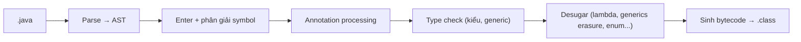
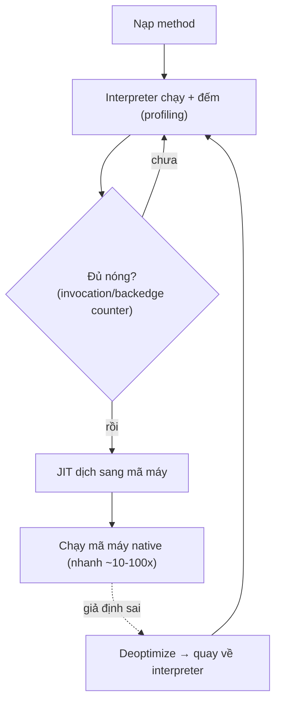

# JVM, JDK & JRE — Từ source tới mã máy

## Mục lục

- [Write once, run anywhere — thực sự xảy ra thế nào](#1-write-once-run-anywhere--thực-sự-xảy-ra-thế-nào)
- [Ba lớp lồng nhau: JDK ⊃ JRE ⊃ JVM](#2-ba-lớp-lồng-nhau-jdk--jre--jvm)
- [javac — từ .java tới bytecode .class](#3-javac--từ-java-tới-bytecode-class)
- [Class file format & constant pool](#4-class-file-format--constant-pool)
- [JVM thực thi: Interpreter + JIT](#5-jvm-thực-thi-interpreter--jit)
- [Tiered Compilation — C1, C2 và profiling](#6-tiered-compilation--c1-c2-và-profiling)
- [AOT, GraalVM Native Image & jlink](#7-aot-graalvm-native-image--jlink)
- [JRE biến mất từ Java 11](#8-jre-biến-mất-từ-java-11)
- [So sánh & khi nào quan tâm cái gì](#9-so-sánh--khi-nào-quan-tâm-cái-gì)
- [Tóm tắt — Cheat sheet](#10-tóm-tắt--cheat-sheet)

---

## 1. Write once, run anywhere — thực sự xảy ra thế nào

Bạn viết `Hello.java` trên macOS, gửi file `Hello.class` cho đồng nghiệp chạy trên Linux ARM và Windows x64 — **không recompile**, vẫn chạy. Điều này nghe hiển nhiên nhưng nó là kết quả của một kiến trúc rất có chủ đích:

```
Hello.java  ──javac──►  Hello.class  ──────►  chạy trên BẤT KỲ JVM nào
(source, người đọc)     (bytecode,            (mỗi OS/CPU có 1 bản JVM riêng
                         máy ảo đọc)            dịch bytecode → mã máy thật)
```

Bí mật: `javac` **không** dịch ra mã máy của một CPU cụ thể. Nó dịch ra **bytecode** — tập lệnh của một "máy tính tưởng tượng" (JVM). Mỗi nền tảng có một bản JVM *native* riêng, và chính JVM mới là thứ biến bytecode thành mã máy thật của nền tảng đó.

> [!IMPORTANT]
> Tính khả chuyển của Java **không** nằm ở ngôn ngữ — nó nằm ở **bytecode + JVM**. Bất kỳ ngôn ngữ nào sinh ra `.class` hợp lệ (Kotlin, Scala, Groovy, Clojure) đều "run anywhere" như Java. JVM là nền tảng, Java chỉ là một trong nhiều khách hàng của nó.

Phần còn lại của doc sẽ đi qua: ba lớp lồng nhau JDK ⊃ JRE ⊃ JVM (§2) → javac từ .java tới bytecode (§3) → class file format & constant pool (§4) → JVM thực thi interpreter + JIT (§5) → tiered compilation C1/C2 (§6) → AOT, GraalVM Native Image & jlink (§7) → JRE biến mất từ Java 11 (§8) → so sánh & khi nào quan tâm cái gì (§9).

---

## 2. Ba lớp lồng nhau: JDK ⊃ JRE ⊃ JVM

Đây là quan hệ **bao hàm**, không phải ba thứ ngang hàng:

```
┌──────────────────────────────────────────────┐
│ JDK (Java Development Kit)                   │
│  ┌──────────────────────────────────────┐    │
│  │ JRE (Java Runtime Environment)       │    │
│  │  ┌──────────────────────────────┐    │    │
│  │  │ JVM                          │    │    │
│  │  │ (class loader, bộ thực thi,  │    │    │
│  │  │  GC, JIT compiler)           │    │    │
│  │  └──────────────────────────────┘    │    │
│  │  + thư viện runtime (java.base, ...) │    │
│  └──────────────────────────────────────┘    │
│  + công cụ dev: javac, jdb, jar, javadoc,    │
│    jlink, jstack, jmap, jcmd, jconsole...    │
└──────────────────────────────────────────────┘
```

| Thành phần | Là gì | Chứa | Dùng để |
|------------|-------|------|---------|
| **JVM** | Máy ảo thực thi bytecode | Class loader, interpreter, JIT, GC | Chạy bytecode → mã máy |
| **JRE** | JVM + thư viện chuẩn | JVM + `java.*`, `javax.*` | Chỉ **chạy** ứng dụng |
| **JDK** | JRE + công cụ phát triển | JRE + `javac`, `jar`, `jdb`... | **Biên dịch + chạy + debug** |

> [!NOTE]
> Quy tắc nhớ: muốn **chạy** app Java → cần JRE. Muốn **biên dịch/phát triển** → cần JDK. JVM một mình không đủ để chạy app (thiếu thư viện chuẩn).

---

## 3. javac — từ .java tới bytecode .class

`javac` là **trình biên dịch tĩnh** nhưng nó làm ít hơn bạn nghĩ — nó cố tình *không* tối ưu sâu (để dành cho JIT lúc runtime). Pipeline của `javac`:



Những việc `javac` làm mà nhiều người không để ý:

- **Erasure generics**: `List<String>` và `List<Integer>` cho ra **cùng** bytecode — generic chỉ tồn tại lúc compile để type-check.
- **Desugar lambda**: lambda biến thành `invokedynamic` + bootstrap method (không phải anonymous class như đôi khi nhầm).
- **String concat**: `a + b` (Java 9+) cũng biến thành `invokedynamic` gọi `StringConcatFactory`.
- **Autoboxing**, **enhanced for**, **switch** đều được "khai đường" (desugar) thành cấu trúc đơn giản hơn.

> [!TIP]
> Đừng kỳ vọng `javac` tối ưu hiệu năng. Nó dịch khá "thẳng tay". Mọi tối ưu nóng (inline, loop unroll, escape analysis) là việc của **JIT lúc runtime**, khi đã có dữ liệu profiling thật.

---

## 4. Class file format & constant pool

File `.class` có cấu trúc nhị phân cố định, bắt đầu bằng **magic number** `0xCAFEBABE`:

```
ClassFile {
    u4 magic;                 // 0xCAFEBABE
    u2 minor_version;
    u2 major_version;         // 52=Java8, 61=Java17, 65=Java21...
    u2 constant_pool_count;
    cp_info constant_pool[];  // "kho" hằng số: tên class, method, string literal...
    u2 access_flags;
    ...
    method_info methods[];    // mỗi method: bytecode trong attribute "Code"
}
```

**Constant pool** là trái tim của class file — một bảng các tham chiếu tượng trưng (symbolic reference): tên class, tên+kiểu method, string literal... Bytecode không nhúng địa chỉ thật, mà trỏ tới chỉ số trong constant pool. Quá trình **link** sau này mới phân giải các tham chiếu tượng trưng này thành địa chỉ thật.

```bash
javap -v Hello.class    # xem constant pool + bytecode + version
javap -c Hello.class    # chỉ xem bytecode đã disassemble
```

> [!NOTE]
> `major_version` quyết định "class file này cần JVM tối thiểu phiên bản nào". Chạy class biên dịch bằng JDK 21 trên JVM 17 → `UnsupportedClassVersionError`. Đây là lỗi version mismatch kinh điển. Dùng `javac --release 17` để compile tương thích ngược.

---

## 5. JVM thực thi: Interpreter + JIT

Khi JVM nạp một method, ban đầu nó **thông dịch** (interpret) — đọc từng bytecode và thực thi. Thông dịch khởi động nhanh nhưng chạy chậm. Song song, JVM **đếm số lần** method/loop chạy. Khi vượt ngưỡng → method "nóng" → **JIT compiler** dịch nó sang **mã máy native** và cache lại.



Điểm tinh tế: JIT làm **tối ưu suy đoán** (speculative) dựa trên profiling. Ví dụ thấy một call site luôn gặp `Dog` → inline luôn `Dog.sound()`. Nếu sau đó xuất hiện `Cat` → giả định sai → **deoptimize**, quay về thông dịch rồi compile lại. Đây là lý do Java "ấm máy" (warmup): vài giây đầu chậm, sau đó nhanh dần.

> [!IMPORTANT]
> Đây là khác biệt nền tảng với C++ (AOT, dịch sẵn toàn bộ): JVM dịch **lúc runtime, dựa trên dữ liệu thật**, nên *về lý thuyết* có thể tối ưu tốt hơn AOT cho code chạy lâu (server). Cái giá là thời gian warmup + tốn RAM cho code cache.

---

## 6. Tiered Compilation — C1, C2 và profiling

HotSpot có **hai** JIT compiler, kết hợp qua **tiered compilation** (mặc định từ Java 8):

| Tier | Compiler | Đặc điểm |
|------|----------|----------|
| 0 | Interpreter | Chạy ngay, thu profiling |
| 1–3 | **C1** (client) | Compile nhanh, tối ưu nhẹ, thêm profiling |
| 4 | **C2** (server) | Compile chậm, tối ưu sâu (inline, escape analysis, loop opt) |

Luồng điển hình: Interpreter (tier 0) → C1 (tier 3, có profiling) → khi cực nóng → C2 (tier 4, tối ưu tối đa). C1 cho hiệu năng "đủ tốt sớm", C2 cho "đỉnh cao muộn".

```bash
java -XX:+PrintCompilation Main     # xem method nào được compile, tier nào
java -XX:+UnlockDiagnosticVMOptions -XX:+PrintInlining Main  # xem inline
```

> [!TIP]
> Với app **chạy ngắn** (CLI, serverless lạnh), warmup của JIT là gánh nặng — bạn trả phí profiling + compile mà chưa kịp hưởng. Đây chính là động lực cho AOT/Native Image (mục 7). Với **server chạy lâu**, để JIT làm việc của nó.

---

## 7. AOT, GraalVM Native Image & jlink

Để tránh warmup và giảm footprint, có các hướng:

- **`jlink`** (Java 9+): cắt một runtime image tối giản chỉ chứa module cần dùng → JRE "may đo", nhỏ hơn nhiều.
- **GraalVM Native Image**: **AOT** dịch *toàn bộ* app + thư viện thành **một binary native** chạy thẳng trên OS, không cần JVM. Khởi động cực nhanh (ms), RAM thấp — lý tưởng cho serverless/CLI/microservice.

| | JIT (HotSpot) | Native Image (AOT) |
|---|---------------|--------------------|
| Khởi động | Chậm (warmup) | Cực nhanh (ms) |
| Đỉnh hiệu năng | Cao nhất (tối ưu runtime) | Thường thấp hơn chút |
| RAM | Cao | Thấp |
| Reflection/dynamic | Tự do | Cần khai báo trước (closed-world) |
| Build time | Nhanh | Chậm |

> [!WARNING]
> Native Image dùng phân tích **closed-world**: mọi class/method dùng tới phải biết lúc build. Reflection, dynamic proxy, JNI cần **cấu hình rõ ràng** (`reflect-config.json`) — đây là khác biệt vận hành lớn so với JVM truyền thống, hay gây lỗi runtime kiểu "ClassNotFound" dù code đúng.

---

## 8. JRE biến mất từ Java 11

Từ **Java 11**, Oracle/OpenJDK **không phát hành JRE riêng** nữa. Lý do:

- Với `jlink`, bạn tự tạo runtime image "may đo" cho app → không cần một JRE chung chung.
- Phân phối thường đi kèm runtime trong container/installer → JRE độc lập mất ý nghĩa.

Hệ quả thực tế: bạn tải **JDK** (bất kể chỉ muốn chạy), hoặc dùng JDK đầy đủ trong image. Khái niệm "cài JRE để chạy app" thuộc về thời Java 8.

> [!NOTE]
> `java -version` vẫn chạy được trên JDK — vì JDK *bao gồm* mọi thứ JRE từng có. Bạn không mất khả năng "chỉ chạy", chỉ là không còn gói JRE *tách rời* để tải nữa.

---

## 9. So sánh & khi nào quan tâm cái gì

| Bạn là... | Quan tâm | Vì sao |
|-----------|----------|--------|
| Dev viết app | JDK (có javac), version target | Compile đúng phiên bản tương thích |
| DevOps đóng gói | jlink / base image, JRE-equivalent | Kích thước image, runtime gọn |
| Tối ưu hiệu năng server | JIT tier, GC, code cache | Warmup, đỉnh throughput |
| Serverless / CLI | Native Image / AOT | Khởi động nhanh, RAM thấp |
| Gỡ lỗi production | JDK tools (jstack, jmap, jcmd) | Cần có trong runtime image |

---

## 10. Tóm tắt — Cheat sheet

**Pipeline trong 4 dòng:**

```
1. .java  --javac-->  .class (bytecode, không phụ thuộc CPU)
2. JVM nạp .class: load → link (verify/prepare/resolve) → initialize
3. Interpreter chạy + profiling → method nóng → JIT (C1→C2) → mã máy
4. JDK ⊃ JRE ⊃ JVM; muốn compile cần JDK, chạy cần JRE-equivalent
```

| Thuật ngữ | Một câu |
|-----------|---------|
| JVM | Máy ảo thực thi bytecode, có GC + JIT |
| JRE | JVM + thư viện chuẩn (chỉ để chạy) |
| JDK | JRE + công cụ dev (compile + chạy + debug) |
| JIT | Dịch bytecode → mã máy lúc runtime, theo profiling |
| AOT | Dịch sẵn toàn bộ → binary native (GraalVM) |

**5 nguyên tắc khắc cốt:**

1. **Khả chuyển nằm ở bytecode + JVM**, không phải ngôn ngữ Java.
2. **javac dịch "thẳng tay"**, mọi tối ưu nóng để cho JIT runtime.
3. **major_version mismatch → `UnsupportedClassVersionError`** — dùng `--release`.
4. **JIT cần warmup**; app ngắn cân nhắc Native Image (AOT).
5. **Từ Java 11 không còn JRE riêng** — dùng JDK hoặc jlink image.

> [!TIP]
> Một câu để nhớ: *Java không nhanh vì compiler giỏi — nó nhanh vì JVM quan sát chương trình chạy thật rồi mới dịch phần nóng sang mã máy, điều mà một compiler tĩnh không bao giờ thấy được.*
