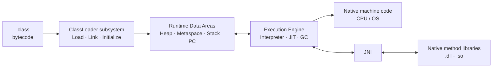
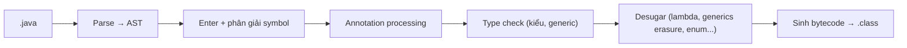
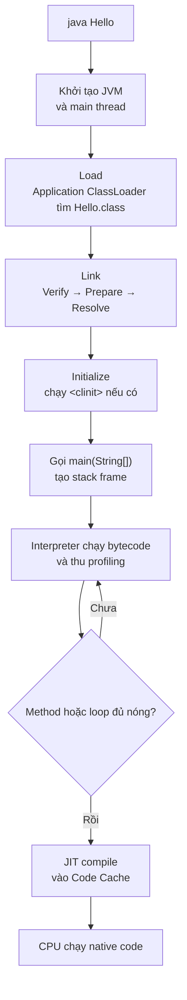
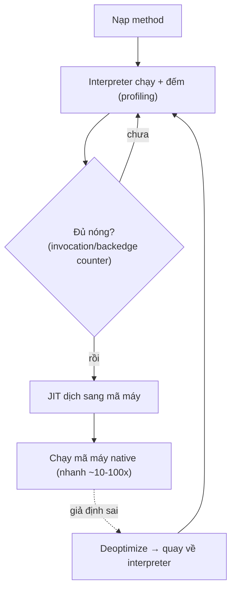
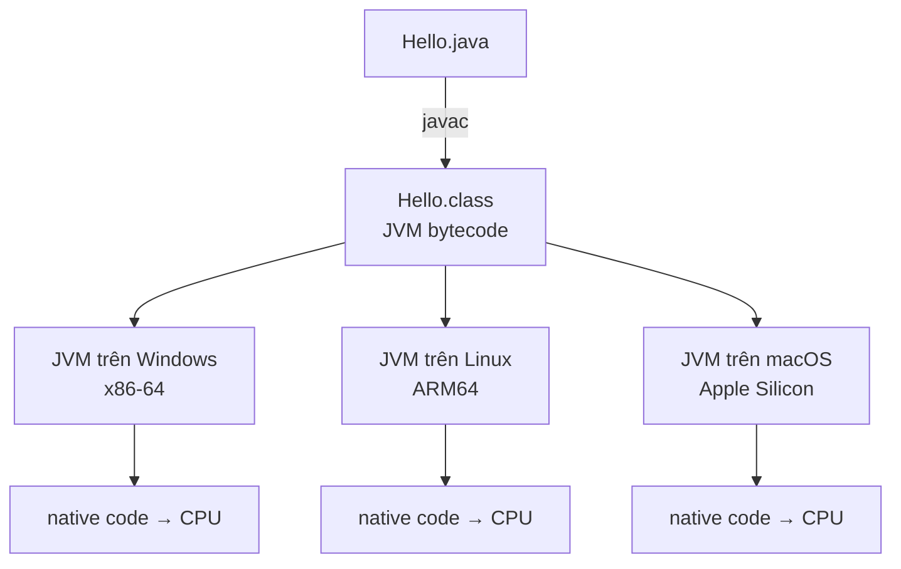

JVM, JRE và JDK là ba khái niệm liên quan nhưng phục vụ các mục đích khác nhau trong nền tảng Java. Phân biệt chúng giúp hiểu thứ gì thực thi bytecode, thứ gì cung cấp thư viện runtime và thứ gì cần cho quá trình phát triển.

## Mục lục

- [Tổng quan](#1-tổng-quan)
- [Ba lớp lồng nhau: JDK ⊃ JRE ⊃ JVM](#2-ba-lớp-lồng-nhau-jdk--jre--jvm)
- [JVM gồm những thành phần chính?](#3-jvm-gồm-những-thành-phần-chính)
  - [ClassLoader Subsystem](#classloader-subsystem)
  - [Runtime Data Areas](#runtime-data-areas)
  - [Execution Engine](#execution-engine)
  - [JNI và Native Method Libraries](#jni-và-native-method-libraries)
- [javac — từ .java tới bytecode .class](#4-javac--từ-java-tới-bytecode-class)
- [Bytecode là gì?](#5-bytecode-là-gì)
- [Class file format & constant pool](#6-class-file-format--constant-pool)
- [JVM hoạt động như thế nào khi chạy một file .class?](#7-jvm-hoạt-động-như-thế-nào-khi-chạy-một-file-class)
- [JVM thực thi: Interpreter + JIT](#8-jvm-thực-thi-interpreter--jit)
- [Tiered Compilation — C1, C2 và profiling](#9-tiered-compilation--c1-c2-và-profiling)
- [Tại sao Java "write once, run anywhere"?](#10-tại-sao-java-write-once-run-anywhere)
- [AOT, GraalVM Native Image & jlink](#11-aot-graalvm-native-image--jlink)
- [JRE biến mất từ Java 11](#12-jre-biến-mất-từ-java-11)
- [So sánh & khi nào quan tâm cái gì](#13-so-sánh--khi-nào-quan-tâm-cái-gì)
- [Tóm tắt — Cheat sheet](#14-tóm-tắt--cheat-sheet)

---

## 1. Tổng quan

JVM là máy ảo thực thi bytecode. JRE theo cách phân loại truyền thống gồm JVM cùng thư viện và thành phần cần để chạy ứng dụng. JDK bổ sung compiler, debugger, javadoc và các công cụ phát triển.

Từ Java 9 và hệ module, cách phân phối runtime đã thay đổi và JRE độc lập không còn được cung cấp như trước. Dù vậy, ba khái niệm vẫn hữu ích để phân tách vai trò kiến trúc.

## 2. Ba lớp lồng nhau: JDK ⊃ JRE ⊃ JVM

Đây là quan hệ **bao hàm**, không phải ba thứ ngang hàng:

```
┌──────────────────────────────────────────────┐
│ JDK (Java Development Kit)                   │
│  ┌──────────────────────────────────────┐    │
│  │ JRE (Java Runtime Environment)       │    │
│  │  ┌──────────────────────────────┐    │    │
│  │  │ JVM                          │    │    │
│  │  │ (class loader, bộ thực thi,  │    │    │
│  │  │  GC, JIT compiler)           │    │    │
│  │  └──────────────────────────────┘    │    │
│  │  + thư viện runtime (java.base, ...) │    │
│  └──────────────────────────────────────┘    │
│  + công cụ dev: javac, jdb, jar, javadoc,    │
│    jlink, jstack, jmap, jcmd, jconsole...    │
└──────────────────────────────────────────────┘
```

| Thành phần | Là gì | Chứa | Dùng để |
|------------|-------|------|---------|
| **JVM** | Máy ảo thực thi bytecode | Class loader, interpreter, JIT, GC | Chạy bytecode → mã máy |
| **JRE** | JVM + thư viện chuẩn | JVM + `java.*`, `javax.*` | Chỉ **chạy** ứng dụng |
| **JDK** | JRE + công cụ phát triển | JRE + `javac`, `jar`, `jdb`... | **Biên dịch + chạy + debug** |

> [!NOTE]
> Quy tắc nhớ: muốn **chạy** app Java → cần một runtime (JRE hoặc JRE-equivalent). Muốn **biên dịch/phát triển** → cần JDK. JVM một mình không đủ để chạy app (thiếu thư viện chuẩn).

---

## 3. JVM gồm những thành phần chính?

JVM không chỉ là một chương trình đọc từng dòng bytecode. Nó là một runtime gồm bộ nạp class, các vùng dữ liệu runtime, bộ thực thi và cầu nối tới mã native. Các khối này phối hợp để biến một file `.class` thành hành vi mà CPU có thể thực hiện.



Đây là mô hình khái niệm. JVM Specification quy định hành vi cần có, nhưng không bắt buộc mọi JVM phải dùng đúng tên hoặc đúng cách tổ chức như HotSpot.

### ClassLoader Subsystem

ClassLoader tìm bytecode, đọc file `.class` và tạo định nghĩa class trong JVM. Quá trình này gồm ba ý chính:

- **Loading:** tìm bytes của class từ classpath, module path hoặc nguồn khác rồi gọi `defineClass`.
- **Linking:** kiểm tra bytecode (**verify**), cấp vùng nhớ ban đầu cho static field (**prepare**) và phân giải symbolic reference (**resolve**).
- **Initialization:** chạy mã khởi tạo static trong `<clinit>` khi class được active use. Initialization diễn ra tối đa một lần và được đồng bộ giữa các thread.

ClassLoader thường dùng **parent delegation**. Application ClassLoader hỏi Platform và Bootstrap ClassLoader trước khi tự tìm class. Cơ chế này giúp code ứng dụng không thể tùy ý thay thế các class nền tảng như `java.lang.String`.

### Runtime Data Areas

Đây là những vùng JVM dùng để lưu trạng thái của chương trình. Một số vùng được chia sẻ cho mọi thread, một số vùng được tạo riêng cho từng thread:

| Vùng | Phạm vi | Nội dung chính |
|------|---------|----------------|
| **Heap** | Chia sẻ | Object và array; được Garbage Collector quản lý |
| **Method Area** | Chia sẻ | Metadata của class, runtime constant pool và thông tin method; HotSpot hiện thực bằng **Metaspace** |
| **Java Stack** | Mỗi thread | Stack frame của từng lời gọi method: local variables, operand stack và frame data |
| **PC Register** | Mỗi thread | Vị trí bytecode tiếp theo của thread đang chạy |
| **Native Method Stack** | Mỗi thread | Trạng thái khi thread gọi native method |
| **Code Cache** | HotSpot-specific | Mã máy do JIT biên dịch; không phải tên vùng bắt buộc trong JVM Specification |

Heap và Method Area là vùng chia sẻ. Ngược lại, mỗi thread có Java Stack và PC Register riêng. Vì vậy lỗi `OutOfMemoryError` trên heap khác bản chất với `StackOverflowError` do call stack quá sâu.

### Execution Engine

Execution Engine đọc bytecode và thực thi nó. Ban đầu **Interpreter** chạy instruction để chương trình khởi động nhanh. JVM đồng thời thu thập profiling — dữ liệu như method nào được gọi nhiều và nhánh nào thường xảy ra. Method hoặc loop đủ nóng sẽ được **JIT Compiler** dịch thành mã máy và lưu trong Code Cache.

Garbage Collector thường được xem là một dịch vụ runtime đi cùng execution engine. Nó theo dõi object trên heap, xác định object không còn reachable và thu hồi vùng nhớ mà không cần developer tự gọi `free`.

### JNI và Native Method Libraries

**JNI (Java Native Interface)** là cầu nối để Java gọi C/C++ hoặc native code khác, và để native code gọi ngược vào JVM. Ví dụ, một phần của thư viện chuẩn có thể dùng system call của OS thông qua native library. Các file `.dll`, `.so` hoặc thư viện hệ thống này phụ thuộc nền tảng, nên JNI là một trong những giới hạn của tính portable.

Đọc sâu hơn: [JVM Architecture](./jvm-architecture), [ClassLoader Deep Dive](./classloader-deep-dive) và [JIT Compilation Deep Dive](./jit-compilation-deep-dive).

> [!NOTE]
> `Method Area` là tên trong đặc tả JVM; `Metaspace` là cách HotSpot hiện thực vùng metadata từ Java 8. Không nên đồng nhất một khái niệm trong đặc tả với tên của một implementation cụ thể.

## 4. javac — từ .java tới bytecode .class

`javac` là **trình biên dịch tĩnh** nhưng nó làm ít hơn bạn nghĩ — nó cố tình *không* tối ưu sâu (để dành cho JIT lúc runtime). Pipeline của `javac`:



Những việc `javac` làm mà nhiều người không để ý:

- **Erasure generics**: `List<String>` và `List<Integer>` cho ra **cùng** bytecode — generic chỉ tồn tại lúc compile để type-check.
- **Desugar lambda**: lambda biến thành `invokedynamic` + bootstrap method (không phải anonymous class như đôi khi nhầm).
- **String concat**: `a + b` (Java 9+) cũng biến thành `invokedynamic` gọi `StringConcatFactory`.
- **Autoboxing**, **enhanced for**, **switch** đều được "khai đường" (desugar) thành cấu trúc đơn giản hơn.

> [!TIP]
> Đừng kỳ vọng `javac` tối ưu hiệu năng. Nó dịch khá "thẳng tay". Mọi tối ưu nóng (inline, loop unroll, escape analysis) là việc của **JIT lúc runtime**, khi đã có dữ liệu profiling thật.

---

## 5. Bytecode là gì?

**Bytecode** là tập lệnh trung gian mà JVM hiểu. `javac` không dịch mã Java trực tiếp thành lệnh x86-64 hay ARM. Nó sinh ra các instruction của một máy ảo trừu tượng, rồi JVM trên từng nền tảng mới thông dịch hoặc biên dịch các instruction đó thành mã máy.

Một điểm dễ nhầm là **`.class` và bytecode không hoàn toàn là một**:

- `.class` là một **class file** nhị phân chứa magic number, version, constant pool, metadata, fields, methods và attributes.
- Bytecode là các instruction trong `Code` attribute của method có implementation; method `abstract` hoặc `native` có thể không có attribute này.

JVM là một **stack-based virtual machine**. Instruction lấy toán hạng từ operand stack, thực hiện phép tính rồi đẩy kết quả trở lại stack. Cách này khác với CPU hiện đại như x86 thường thao tác trực tiếp trên registers.

Ví dụ, compile class sau rồi chạy `javap -c Hello.class`:

```java
public class Hello {
    public static void main(String[] args) {
        int total = 0;
        for (int i = 1; i <= 3; i++) {
            total += i;
        }
        System.out.println(total);
    }
}
```

Một phần output thật của `javap`:

```text
public static void main(java.lang.String[]);
  Code:
     0: iconst_0
     1: istore_1
     2: iconst_1
     3: istore_2
     4: iload_2
     5: iconst_3
     6: if_icmpgt     19
     9: iload_1
    10: iload_2
    11: iadd
    12: istore_1
    13: iinc          2, 1
    16: goto          4
    19: getstatic     #7   // Field java/lang/System.out:Ljava/io/PrintStream;
    22: iload_1
    23: invokevirtual #13  // Method java/io/PrintStream.println:(I)V
    26: return
```

Ở đoạn này, `iload_1` đẩy `total` lên operand stack, `iload_2` đẩy `i`, `iadd` lấy hai giá trị ra để cộng và `istore_1` cất kết quả lại vào local variable slot 1. `goto 4` tạo vòng lặp bằng cách quay về instruction kiểm tra điều kiện.

| Tầng | Ví dụ | Ai thực thi? | Phụ thuộc trực tiếp |
|------|-------|--------------|---------------------|
| Source code | `.java` | `javac` đọc và phân tích | Ngôn ngữ Java |
| Bytecode | `iload`, `iadd`, `invokevirtual` | JVM Interpreter hoặc JIT | JVM Specification và class file version |
| Machine code | lệnh x86-64, ARM64 | CPU | OS, CPU và ABI |

Bytecode tạo ra một hợp đồng ổn định giữa compiler và JVM. Nó cũng có thể được **bytecode verifier** kiểm tra trước khi chạy để phát hiện class file sai format, type không hợp lệ hoặc branch target bất hợp lệ. Kotlin, Scala, Groovy và Clojure cũng có thể compile ra JVM bytecode; lớp portable ở đây là JVM platform, không chỉ riêng ngôn ngữ Java.

```bash
javap -c Hello.class    # xem instruction bytecode
javap -v Hello.class    # xem class file, constant pool và version
```

> [!IMPORTANT]
> Bytecode không phụ thuộc CPU, nhưng vẫn phụ thuộc class file version và API mà chương trình gọi. Vì vậy một `.class` biên dịch bằng JDK mới có thể không chạy được trên JVM cũ; xem thêm phần `major_version` ở section kế tiếp.

## 6. Class file format & constant pool

File `.class` có cấu trúc nhị phân cố định, bắt đầu bằng **magic number** `0xCAFEBABE`:

```
ClassFile {
    u4 magic;                 // 0xCAFEBABE
    u2 minor_version;
    u2 major_version;         // 52=Java8, 61=Java17, 65=Java21...
    u2 constant_pool_count;
    cp_info constant_pool[];  // "kho" hằng số: tên class, method, string literal...
    u2 access_flags;
    ...
    method_info methods[];    // mỗi method: bytecode trong attribute "Code"
}
```

**Constant pool** là trái tim của class file — một bảng các tham chiếu tượng trưng (symbolic reference): tên class, tên+kiểu method, string literal... Bytecode không nhúng địa chỉ thật, mà trỏ tới chỉ số trong constant pool. Quá trình **link** sau này mới phân giải các tham chiếu tượng trưng này thành địa chỉ thật.

```bash
javap -v Hello.class    # xem constant pool + bytecode + version
javap -c Hello.class    # chỉ xem bytecode đã disassemble
```

> [!NOTE]
> `major_version` quyết định "class file này cần JVM tối thiểu phiên bản nào". Chạy class biên dịch bằng JDK 21 trên JVM 17 → `UnsupportedClassVersionError`. Đây là lỗi version mismatch kinh điển. Dùng `javac --release 17` để compile tương thích ngược.

---

## 7. JVM hoạt động như thế nào khi chạy một file .class?

Giả sử đã compile `Hello.java` thành `Hello.class`. Khi chạy lệnh dưới đây, ta truyền **tên class** cho Java launcher, không truyền tên file source:

```bash
javac Hello.java
java Hello
```

Luồng tổng quát là **load → link → initialize → execute**. JVM không nhất thiết load và resolve toàn bộ class của ứng dụng ngay lúc khởi động. Nhiều class và symbolic reference chỉ được xử lý khi code thật sự sử dụng chúng.



Các bước cụ thể:

1. **Khởi động JVM.** Java launcher tạo một JVM process, đọc các option như `-Xmx` và khởi tạo các thread/runtime service cần thiết. Thread chính sẽ gọi `main`.
2. **Loading.** Application ClassLoader tìm `Hello.class` trên classpath hoặc module path, đọc bytes và tạo định nghĩa `Class<Hello>` trong JVM. Superclass và interface cần thiết cũng được load theo nhu cầu.
3. **Verify.** JVM kiểm tra class file có đúng format và đúng version hay không. Bytecode verifier kiểm tra cấu trúc instruction, kiểu dữ liệu trên operand stack, local variable và điểm nhảy trước khi cho code chạy.
4. **Prepare.** JVM cấp phát vùng nhớ cho các static field và gán giá trị mặc định như `0`, `false` hoặc `null`. Giá trị do static initializer tính toán chưa được gán ở bước này.
5. **Resolve.** Symbolic reference trong constant pool, chẳng hạn tên class và method, được nối tới definition/direct reference tương ứng. JVM được phép resolve lazy, nên bước này có thể xảy ra khi instruction đầu tiên sử dụng reference chạy.
6. **Initialize.** Trước khi `main` được gọi, JVM initialize class chính. Các phép gán static và static block chạy trong method đặc biệt `<clinit>` nếu class có. JVM đảm bảo initialization của một class chỉ xảy ra một lần và an toàn giữa các thread; superclass được initialize trước subclass.
7. **Execute.** JVM gọi `main(String[])` và tạo một stack frame trên Java Stack của main thread. Mỗi method call tiếp theo tạo thêm một frame; khi method return, frame bị pop.
8. **Tối ưu lúc chạy.** Interpreter chạy các method ban đầu. JVM profiling số lần gọi và số vòng lặp. Code nóng được JIT compile thành native code, sau đó có thể chạy trực tiếp trên CPU. Chi tiết nằm ở phần [Interpreter + JIT](#8-jvm-thực-thi-interpreter--jit).
9. **Kết thúc.** JVM kết thúc khi `main` return và không còn non-daemon thread nào. Một chương trình có background thread vẫn có thể tiếp tục chạy sau khi `main` kết thúc.

Có thể quan sát quá trình load class bằng các lệnh sau:

```bash
java -Xlog:class+load=info Hello   # JDK 9+
java -verbose:class Hello         # cách viết tương thích rộng hơn
```

Lỗi cũng thường gắn với từng phase: `UnsupportedClassVersionError` hoặc `VerifyError` ở load/link, `ExceptionInInitializerError` ở initialize và lỗi thiếu dependency có thể chỉ xuất hiện muộn do resolve lazy.

Đọc sâu hơn về lifecycle này tại [ClassLoader Deep Dive](./classloader-deep-dive).

## 8. JVM thực thi: Interpreter + JIT

Sau khi class đã được load, link và initialize, Execution Engine bắt đầu chạy các method. Ban đầu JVM **thông dịch** (interpret) — đọc từng bytecode và thực thi. Thông dịch khởi động nhanh nhưng chạy chậm. Song song, JVM **đếm số lần** method/loop chạy. Khi vượt ngưỡng → method "nóng" → **JIT compiler** dịch nó sang **mã máy native** và cache lại.



Điểm tinh tế: JIT làm **tối ưu suy đoán** (speculative) dựa trên profiling. Ví dụ thấy một call site luôn gặp `Dog` → inline luôn `Dog.sound()`. Nếu sau đó xuất hiện `Cat` → giả định sai → **deoptimize**, quay về thông dịch rồi compile lại. Đây là lý do Java "ấm máy" (warmup): vài giây đầu chậm, sau đó nhanh dần.

> [!IMPORTANT]
> Đây là khác biệt nền tảng với C++ (AOT, dịch sẵn toàn bộ): JVM dịch **lúc runtime, dựa trên dữ liệu thật**, nên *về lý thuyết* có thể tối ưu tốt hơn AOT cho code chạy lâu (server). Cái giá là thời gian warmup + tốn RAM cho code cache.

---

## 9. Tiered Compilation — C1, C2 và profiling

HotSpot có **hai** JIT compiler, kết hợp qua **tiered compilation** (mặc định từ Java 8):

| Tier | Compiler | Đặc điểm |
|------|----------|----------|
| 0 | Interpreter | Chạy ngay, thu profiling |
| 1–3 | **C1** (client) | Compile nhanh, tối ưu nhẹ, thêm profiling |
| 4 | **C2** (server) | Compile chậm, tối ưu sâu (inline, escape analysis, loop opt) |

Luồng điển hình: Interpreter (tier 0) → C1 (tier 3, có profiling) → khi cực nóng → C2 (tier 4, tối ưu tối đa). C1 cho hiệu năng "đủ tốt sớm", C2 cho "đỉnh cao muộn".

```bash
java -XX:+PrintCompilation Main     # xem method nào được compile, tier nào
java -XX:+UnlockDiagnosticVMOptions -XX:+PrintInlining Main  # xem inline
```

> [!TIP]
> Với app **chạy ngắn** (CLI, serverless lạnh), warmup của JIT là gánh nặng — bạn trả phí profiling + compile mà chưa kịp hưởng. Đây chính là động lực cho AOT/Native Image (mục 11). Với **server chạy lâu**, để JIT làm việc của nó.

---

## 10. Tại sao Java "write once, run anywhere"?

Câu hỏi trung tâm của Java là: làm thế nào cùng một `Hello.class` có thể chạy trên Windows x86-64, Linux ARM64 và macOS Apple Silicon?



Cơ chế có hai phần:

1. **Compiler chỉ nhắm tới một target chung.** `javac` chuyển source code thành bytecode theo class file format, không cần biết máy đích là x86 hay ARM.
2. **Mỗi nền tảng có một JVM implementation.** JVM trên Windows hiểu cùng instruction set và semantics của JVM Specification, sau đó dùng interpreter hoặc JIT để biến bytecode thành mã máy phù hợp với OS/CPU hiện tại.

Vì vậy, portable không nằm ở việc CPU hiểu bytecode. CPU chỉ hiểu native machine code. Portable nằm ở lớp trung gian và ở JVM tương ứng với từng nền tảng:

| Tầng | Vai trò trong WORA |
|------|--------------------|
| `.java` | Source có thể được viết một lần |
| `.class` | Bytecode và class file format dùng chung |
| JVM | Thực hiện cùng semantics, nhưng được build riêng cho từng OS/CPU |
| Native code | Mã máy cuối cùng, phụ thuộc platform |

Đây là khác biệt với C/C++. Một binary C/C++ thường chứa native code cho một OS/architecture cụ thể, nên phải compile lại cho Linux, Windows, x86 hoặc ARM. Java chỉ compile lại một lần tới bytecode rồi để JVM xử lý phần khác biệt của platform.

Java còn có thư viện chuẩn như `java.io`, `java.nio` và `java.net` để che bớt khác biệt của OS. Đó là lý do một ứng dụng Java sử dụng API chuẩn thường không cần sửa source khi chuyển máy. Cùng mô hình này cũng giúp Kotlin, Scala hay Groovy chạy trên JVM sau khi compile thành bytecode.

> [!WARNING]
> "Write once, run anywhere" có điều kiện: phải có một JVM tương thích và code không phụ thuộc trực tiếp vào OS. JNI/native library (`.dll`, `.so`), đường dẫn file hard-code, line ending, encoding mặc định, timezone hoặc API chỉ có ở một JDK version vẫn có thể phá vỡ tính portable. Cách nói thực tế hơn là **write once, run on any compatible JVM**.

## 11. AOT, GraalVM Native Image & jlink

Để tránh warmup và giảm footprint, có các hướng:

- **`jlink`** (Java 9+): cắt một runtime image tối giản chỉ chứa module cần dùng → JRE "may đo", nhỏ hơn nhiều.
- **GraalVM Native Image**: **AOT** dịch *toàn bộ* app + thư viện thành **một binary native** chạy thẳng trên OS, không cần JVM. Khởi động cực nhanh (ms), RAM thấp — lý tưởng cho serverless/CLI/microservice.

| | JIT (HotSpot) | Native Image (AOT) |
|---|---------------|--------------------|
| Khởi động | Chậm (warmup) | Cực nhanh (ms) |
| Đỉnh hiệu năng | Cao nhất (tối ưu runtime) | Thường thấp hơn chút |
| RAM | Cao | Thấp |
| Reflection/dynamic | Tự do | Cần khai báo trước (closed-world) |
| Build time | Nhanh | Chậm |

> [!WARNING]
> Native Image dùng phân tích **closed-world**: mọi class/method dùng tới phải biết lúc build. Reflection, dynamic proxy, JNI cần **cấu hình rõ ràng** (`reflect-config.json`) — đây là khác biệt vận hành lớn so với JVM truyền thống, hay gây lỗi runtime kiểu "ClassNotFound" dù code đúng.

---

## 12. JRE biến mất từ Java 11

Từ **Java 11**, Oracle/OpenJDK **không phát hành JRE riêng** nữa. Lý do:

- Với `jlink`, bạn tự tạo runtime image "may đo" cho app → không cần một JRE chung chung.
- Phân phối thường đi kèm runtime trong container/installer → JRE độc lập mất ý nghĩa.

Hệ quả thực tế: bạn tải **JDK** (bất kể chỉ muốn chạy), hoặc dùng JDK đầy đủ trong image. Khái niệm "cài JRE để chạy app" thuộc về thời Java 8.

> [!NOTE]
> `java -version` vẫn chạy được trên JDK — vì JDK *bao gồm* mọi thứ JRE từng có. Bạn không mất khả năng "chỉ chạy", chỉ là không còn gói JRE *tách rời* để tải nữa.

---

## 13. So sánh & khi nào quan tâm cái gì

| Bạn là... | Quan tâm | Vì sao |
|-----------|----------|--------|
| Dev viết app | JDK (có javac), version target | Compile đúng phiên bản tương thích |
| DevOps đóng gói | jlink / base image, JRE-equivalent | Kích thước image, runtime gọn |
| Tối ưu hiệu năng server | JIT tier, GC, code cache | Warmup, đỉnh throughput |
| Serverless / CLI | Native Image / AOT | Khởi động nhanh, RAM thấp |
| Gỡ lỗi production | JDK tools (jstack, jmap, jcmd) | Cần có trong runtime image |

---

## 14. Tóm tắt — Cheat sheet

**Pipeline chính:**

```
1. .java  --javac-->  .class (class file chứa bytecode, không phụ thuộc CPU)
2. JVM nạp .class: load → link (verify/prepare/resolve) → initialize
3. Interpreter chạy + profiling → method nóng → JIT (C1→C2) → mã máy
4. Cùng .class chạy trên JVM tương thích của Windows/Linux/macOS (WORA)
```

Quan hệ sản phẩm: **JDK ⊃ JRE-equivalent ⊃ JVM**. Muốn compile cần JDK; muốn chạy cần một runtime chứa JVM và thư viện chuẩn.

| Thuật ngữ | Một câu |
|-----------|---------|
| Bytecode | Tập instruction stack-based nằm trong `Code` attribute của class file |
| JVM | Runtime gồm ClassLoader, runtime data areas, execution engine, GC và JNI |
| JRE | JVM + thư viện chuẩn; từ Java 11 thường là runtime image thay vì gói riêng |
| JDK | JRE-equivalent + compiler và công cụ dev |
| JIT | Dịch bytecode → mã máy lúc runtime, theo profiling |
| WORA | Một bytecode chạy trên mọi JVM tương thích với platform tương ứng |
| AOT | Dịch sẵn toàn bộ → binary native (GraalVM) |

**5 nguyên tắc khắc cốt:**

1. **Khả chuyển nằm ở bytecode + JVM**, không phải chỉ ở ngôn ngữ Java.
2. **Vòng đời cơ bản là load → link → initialize → execute**; resolve có thể lazy.
3. **`javac` dịch khá "thẳng tay"**, còn `major_version` mismatch gây `UnsupportedClassVersionError` — dùng `--release`.
4. **JIT cần warmup**; app ngắn có thể cân nhắc Native Image (AOT).
5. **Từ Java 11 không còn JRE riêng** — dùng JDK hoặc jlink image.

> [!TIP]
> Một câu để nhớ: *Java không nhanh vì compiler giỏi — nó nhanh vì JVM quan sát chương trình chạy thật rồi mới dịch phần nóng sang mã máy, điều mà một compiler tĩnh không bao giờ thấy được.*
