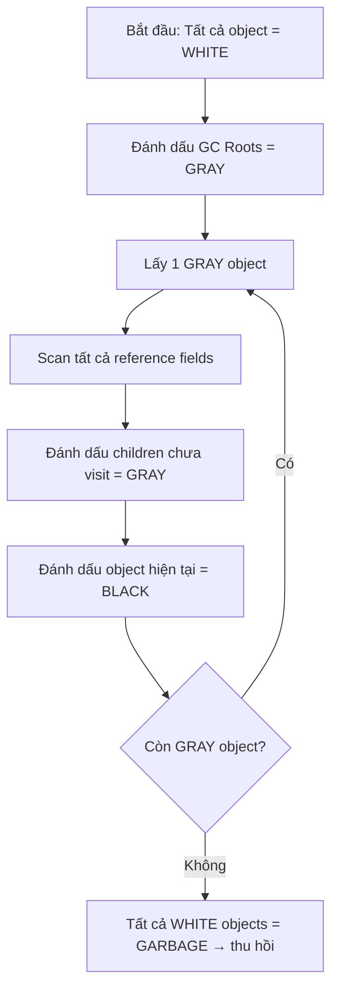
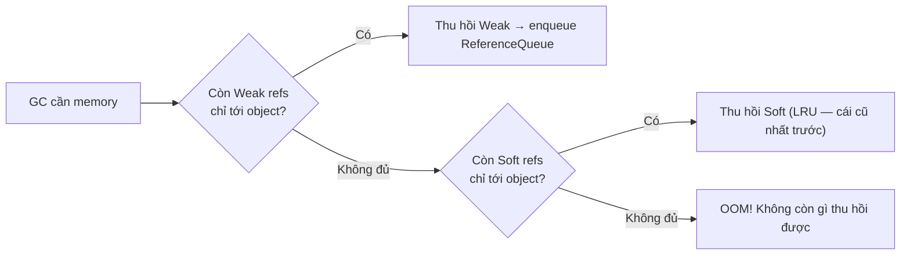
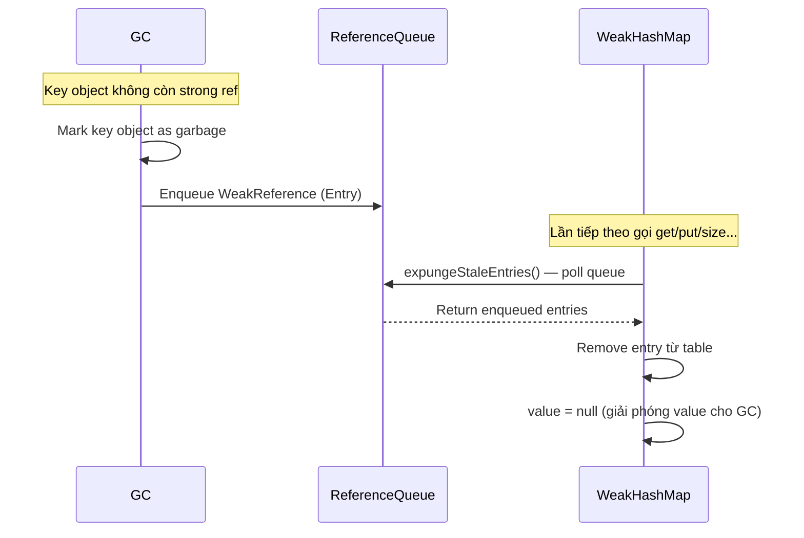
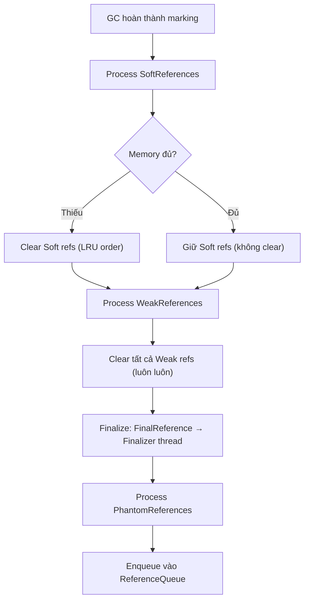
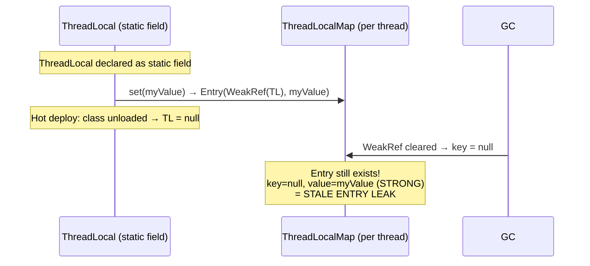
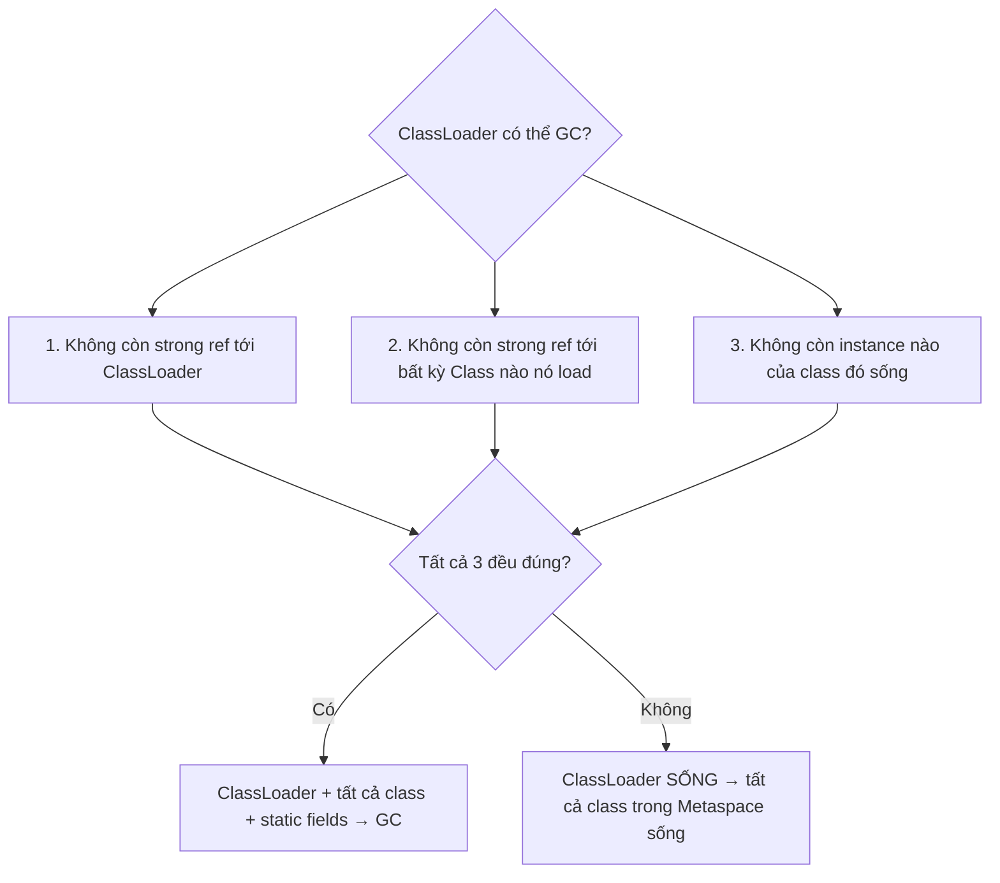
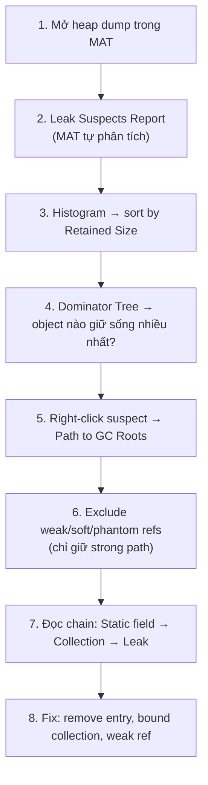

## Mục lục

- [OOM sau 3 ngày — GC chạy liên tục nhưng không cứu được](#1-oom-sau-3-ngày--gc-chạy-liên-tục-nhưng-không-cứu-được)
- [Memory Leak trong Java — GC không phải thuốc chữa bách bệnh](#2-memory-leak-trong-java--gc-không-phải-thuốc-chữa-bách-bệnh)
- [GC Roots & Reachability — ai quyết định object sống hay chết](#3-gc-roots--reachability--ai-quyết-định-object-sống-hay-chết)
- [GC Mark Phase — cách JVM duyệt object graph](#4-gc-mark-phase--cách-jvm-duyệt-object-graph)
- [Reference Types — Strong, Soft, Weak, Phantom](#5-reference-types--strong-soft-weak-phantom)
- [Reference Processing Pipeline — xử lý nội bộ của JVM](#6-reference-processing-pipeline--xử-lý-nội-bộ-của-jvm)
- [10 nguyên nhân Memory Leak phổ biến](#7-10-nguyên-nhân-memory-leak-phổ-biến)
- [ThreadLocal Leak — bẫy đặc biệt nguy hiểm](#8-threadlocal-leak--bẫy-đặc-biệt-nguy-hiểm)
- [ClassLoader Leak — Metaspace OOM](#9-classloader-leak--metaspace-oom)
- [Heap Dump — capture và phân tích](#10-heap-dump--capture-và-phân-tích)
- [MAT (Memory Analyzer Tool) — đọc heap dump](#11-mat-memory-analyzer-tool--đọc-heap-dump)
- [Production Monitoring — phát hiện leak sớm](#12-production-monitoring--phát-hiện-leak-sớm)
- [Anti-patterns & Tóm tắt](#13-anti-patterns--tóm-tắt)

---

## 1. OOM sau 3 ngày — GC chạy liên tục nhưng không cứu được

Service xử lý event từ Kafka. Mỗi event được log vào cache "gần đây" để debug:

```java
public class EventProcessor {
    private static final Map<String, Event> recentEvents = new HashMap<>();

    public void process(Event event) {
        recentEvents.put(event.getId(), event);  // cache để tra cứu debug
        doBusinessLogic(event);
    }
}
```

Trên dev (vài nghìn event): OK. Production (triệu event/ngày): heap tăng đều, GC chạy ngày càng nhiều:

```
Day 1:  Heap usage 40% → GC ~5%  time
Day 2:  Heap usage 70% → GC ~20% time
Day 3:  Heap usage 95% → GC ~80% time → Full GC liên tục
        java.lang.OutOfMemoryError: Java heap space
```

GC Log:
```
[Full GC (Ergonomics) 3891M->3889M(4096M), 8.234 secs]   ← thu hồi 2 MB / 3.8 GB
[Full GC (Ergonomics) 3891M->3890M(4096M), 8.456 secs]   ← GC gần như vô dụng
```

GC chạy liên tục nhưng **thu hồi gần như không gì** — vì `recentEvents` là `static` HashMap, giữ **strong reference** tới mọi event từ ngày 1. GC **không thể** thu hồi object mà vẫn reachable.

> [!IMPORTANT]
> Memory leak trong Java **không phải** "quên free memory" (như C/C++). Nó là **object vẫn reachable qua reference chain nhưng ứng dụng không bao giờ dùng nữa**. GC thấy object reachable → không thu hồi → heap đầy dần.

Phần còn lại của doc sẽ đi qua: memory leak trong Java & vì sao GC không cứu (§2) → GC Roots & reachability (§3) → GC mark phase (§4) → reference types Strong/Soft/Weak/Phantom (§5) → reference processing pipeline (§6) → 10 nguyên nhân leak phổ biến (§7) → ThreadLocal leak (§8) → ClassLoader leak & Metaspace OOM (§9) → heap dump (§10) → MAT (§11) → production monitoring (§12).

---

## 2. Memory Leak trong Java — GC không phải thuốc chữa bách bệnh

| Ngôn ngữ | Leak vì | Triệu chứng |
|----------|---------|-------------|
| C/C++ | Quên `free()` / `delete` | Dùng bao nhiêu leak bấy nhiêu |
| Java | Object reachable nhưng không dùng | Heap tăng dần, GC tốn thời gian tăng, cuối cùng OOM |

Định nghĩa trong Java: **Memory leak = object mà ứng dụng không còn cần nhưng GC không thu hồi được vì vẫn có reference chain tới GC Root.**

```
GC Root → ... → Container (HashMap) → Entry → Event object
                                              ↑
                                    Ứng dụng không cần nữa, nhưng reference vẫn còn
```

### 2.1. Phân biệt Leak vs High Memory Usage

| | Memory Leak | High Memory (bình thường) |
|--|------------|---------------------------|
| Heap sau GC | **Tăng dần** qua thời gian | Ổn định (lên xuống quanh 1 mức) |
| GC hiệu quả | **Giảm dần** (thu hồi ít đi) | Ổn định (thu hồi đều) |
| Fix | Tìm + remove reference chain | Tăng heap hoặc tối ưu object creation |

```
Heap usage over time:

Normal:                      Leak:
  ▲                            ▲
  │   /\/\/\/\                 │        ╱
  │  /        \                │      ╱
  │ /          \               │    ╱
  │/            \/\/\          │  ╱         ← baseline tăng dần
  └─────────────────→ time     └─────────────────→ time
       baseline ổn định              heading to OOM
```

---

## 3. GC Roots & Reachability — ai quyết định object sống hay chết

GC bắt đầu từ **GC Roots** và duyệt theo reference chain. Object **reachable** từ root → sống. Object **unreachable** → chết → thu hồi.

### 3.1. GC Roots trong Java — danh sách đầy đủ

| GC Root | Ví dụ | Tại sao là root? |
|---------|-------|-----------------|
| **Local variables** trên stack | Biến trong method đang chạy | Thread cần chúng để tiếp tục xử lý |
| **Static fields** | `private static final Map<> cache` | Sống cùng class (suốt lifetime app) |
| **Active threads** | Thread đang sống + ThreadLocal entries | Thread object là root tự nhiên |
| **JNI references** | Native code giữ reference | JVM không kiểm soát native code |
| **Synchronized monitors** | Object đang bị lock | Thread đang giữ lock cần object |
| **System ClassLoader classes** | Bootstrap/system classloader | Class cần tồn tại suốt JVM lifetime |
| **JVM internal** | Exception handling objects, StringTable | JVM cần chúng để vận hành |

### 3.2. Reachability chain — đường đi từ Root tới Leak

```
GC Root: Static field EventProcessor.recentEvents (HashMap)
    └─ HashMap.table (Node[])
        └─ Node (hash=42, key="evt-1234")
            ├─ key: "evt-1234" (String, 56 bytes)
            └─ value: Event object (1 KB)
                ├─ id: "evt-1234"
                ├─ timestamp: 1718000000
                └─ payload: byte[] (100 KB)  ← LEAK! Ứng dụng không cần nữa
```

**Tổng retained size cho 1 triệu entries:** ~100 GB leak chỉ vì thiếu `recentEvents.remove()` hoặc bounded size.

> [!NOTE]
> Leak thường không phải 1 object lớn mà là **hàng triệu object nhỏ** tích tụ qua thời gian. Biểu đồ heap điển hình: **đường chéo đi lên** — mỗi GC cycle thu hồi ít hơn lần trước, baseline tăng dần.

---

## 4. GC Mark Phase — cách JVM duyệt object graph

### 4.1. Tri-color marking algorithm

GC dùng **tri-color abstraction** để duyệt object graph (G1, ZGC, Shenandoah đều dùng biến thể):

```
Màu    | Ý nghĩa
-------|-------
White  | Chưa visit — có thể là garbage
Gray   | Đã visit nhưng chưa scan hết children
Black  | Đã visit + đã scan tất cả children → CHẮC CHẮN SỐNG
```



### 4.2. Tại sao reachable nhưng không cần = LEAK

```
Sau marking phase:

GC Root (static HashMap)
    │
    ├─→ Entry "evt-1" ── BLACK (reachable → SỐNG)
    ├─→ Entry "evt-2" ── BLACK (reachable → SỐNG)
    ├─→ Entry "evt-3" ── BLACK (reachable → SỐNG)
    │   ... 1 triệu entries ...
    └─→ Entry "evt-1000000" ── BLACK

GC kết luận: TẤT CẢ 1 triệu entries đều SỐNG → không thu hồi gì.
Thực tế: ứng dụng chỉ cần 100 entry gần nhất. 999.900 entries là LEAK.
```

**GC không có khái niệm "cần hay không cần"** — nó chỉ biết "reachable hay không". Responsibility nằm ở **developer**: phải remove reference khi object không cần nữa.

### 4.3. Concurrent marking — tại sao leak khó phát hiện bằng profiler thông thường

Modern GC (G1, ZGC) mark **concurrent** — ứng dụng vẫn chạy trong khi GC mark. Nghĩa là:
- Heap dump chỉ là **snapshot** tại 1 thời điểm
- Object có thể "mới thêm" hoặc "sắp remove" tại thời điểm dump
- Để xác nhận leak: cần **so sánh 2+ heap dumps** cách nhau vài giờ

---

## 5. Reference Types — Strong, Soft, Weak, Phantom

Java cung cấp 4 mức "sức mạnh" reference để kiểm soát GC:

| Type | Class | GC thu hồi khi | Use case |
|------|-------|----------------|----------|
| **Strong** | (default) | **Không** — chừng nào còn reachable | Mọi biến thông thường |
| **Soft** | `SoftReference<T>` | Khi **sắp OOM** (GC cố gắng giữ nếu có đủ memory) | Cache (GC tự evict khi cần) |
| **Weak** | `WeakReference<T>` | Ở **lần GC kế tiếp** (nếu không có strong ref khác) | `WeakHashMap`, canonicalize map |
| **Phantom** | `PhantomReference<T>` | Sau khi object đã finalize, trước khi memory thật sự thu hồi | Resource cleanup (thay thế `finalize()`) |

### 5.1. Thứ tự ưu tiên khi GC



### 5.2. WeakHashMap — internal mechanism

```java
// WeakHashMap.Entry extends WeakReference<Object> (key!)
private static class Entry<K,V> extends WeakReference<Object> {
    V value;
    final int hash;
    Entry<K,V> next;

    Entry(Object key, V value, ReferenceQueue<Object> queue,
          int hash, Entry<K,V> next) {
        super(key, queue);   // key được wrap trong WeakReference!
        this.value = value;
        // ...
    }
}
```

**Flow khi key bị GC:**



> [!WARNING]
> `WeakHashMap` chỉ weak trên **key**. Value vẫn là **strong reference**! Nếu value lớn và key chưa bị GC → memory vẫn bị giữ. Ngoài ra, cleanup chỉ xảy ra khi bạn **gọi method** trên WeakHashMap — nếu không ai gọi, stale entries chồng chất.

### 5.3. SoftReference cache

```java
Map<String, SoftReference<Bitmap>> imageCache = new HashMap<>();

public Bitmap getImage(String url) {
    SoftReference<Bitmap> ref = imageCache.get(url);
    Bitmap bmp = (ref != null) ? ref.get() : null;
    if (bmp == null) {
        bmp = loadFromDisk(url);
        imageCache.put(url, new SoftReference<>(bmp));
    }
    return bmp;
}
```

> [!TIP]
> `SoftReference` cho phép GC tự evict cache entry khi heap gần đầy — "best-effort cache" không cần LRU logic. Nhưng **không thể kiểm soát chính xác** entry nào bị evict → dùng cho cache thứ yếu, không phải primary storage. Production: ưu tiên **Caffeine** library (bounded, LRU/LFU, async, metrics).

### 5.4. PhantomReference & Cleaner — thay thế finalize()

```java
// Từ JDK 9+: dùng Cleaner thay cho finalize()
public class NativeResource implements AutoCloseable {
    private static final Cleaner cleaner = Cleaner.create();

    private final Cleaner.Cleanable cleanable;
    private final long nativePtr;  // native memory pointer

    public NativeResource() {
        this.nativePtr = allocateNative();
        // Cleaner giữ PhantomReference tới this
        // Khi this bị GC → Cleaner thread gọi action
        this.cleanable = cleaner.register(this, () -> freeNative(nativePtr));
    }

    @Override
    public void close() {
        cleanable.clean();  // explicit cleanup (preferred)
    }
}
```

**Flow nội bộ Cleaner:**

```
Object trở thành phantom reachable (chỉ PhantomReference trỏ tới)
    → GC enqueue PhantomReference vào ReferenceQueue
    → Cleaner daemon thread poll queue
    → Chạy cleanup action (freeNative)
    → Object memory được thu hồi ở lần GC tiếp
```

---

## 6. Reference Processing Pipeline — xử lý nội bộ của JVM

### 6.1. Reference Handler Thread

JVM có một **daemon thread** tên `Reference Handler` (priority MAX_PRIORITY - 2) chuyên xử lý reference:

```
┌─────────────────────────────────────────────────────────┐
│                    GC Mark Phase                        │
│                                                         │
│  1. Mark all reachable objects (tri-color)              │
│  2. Phát hiện objects chỉ reachable qua Reference       │
│  3. Phân loại: Soft? Weak? Phantom?                     │
│  4. Quyết định clear (dựa trên memory pressure)         │
└────────────────────────┬────────────────────────────────┘
                         │ discovered list
                         ▼
┌─────────────────────────────────────────────────────────┐
│              Reference Handler Thread                   │
│                                                         │
│  1. Nhận discovered references từ GC                    │
│  2. Clear referent (set referent = null)                │
│  3. Enqueue vào ReferenceQueue (nếu có)                 │
│  4. Notify waiting threads (FinalReference → Finalizer) │
└─────────────────────────────────────────────────────────┘
```

### 6.2. Processing order



> [!NOTE]
> Reference processing xảy ra **trong GC pause** (G1) hoặc **concurrent** (ZGC/Shenandoah). Nhiều Soft/Weak references có thể **tăng GC pause time** — đây là lý do không nên lạm dụng SoftReference cho cache lớn.

---

## 7. 10 nguyên nhân Memory Leak phổ biến

| # | Nguyên nhân | Pattern | Fix |
|---|------------|---------|-----|
| 1 | **Static collection không bound** | `static Map` chỉ `put`, không `remove` | Bounded cache (Caffeine, LRU), `WeakHashMap` |
| 2 | **Unclosed resources** | `InputStream`, `Connection`, `ResultSet` không close | `try-with-resources` |
| 3 | **Listener/callback không deregister** | `addListener()` mà không `removeListener()` | `WeakReference` listener, hoặc deregister ở lifecycle |
| 4 | **Inner class giữ outer reference** | Non-static inner class giữ implicit `this` | Dùng **static** inner class |
| 5 | **ThreadLocal không remove** | Thread pool reuse thread → ThreadLocal sống mãi | `try { ... } finally { threadLocal.remove(); }` |
| 6 | **String.intern() quá nhiều** | Intern string động → string pool phình | Không intern string từ user input |
| 7 | **ClassLoader leak** | Hot deploy tạo ClassLoader mới nhưng class cũ không unload | Restart JVM, Xử lý thread/static reference |
| 8 | **Autoboxing trong collection** | `Map<Integer, Integer>` → mỗi entry tạo Integer object | Primitive map (Eclipse Collections, HPPC) |
| 9 | **StringBuilder / byte[] tạm không giới hạn** | Buffer tăng dần, không shrink | Set max capacity, pool buffer |
| 10 | **Custom equals/hashCode sai** | Object "mất" trong HashSet/HashMap (mục 11 hashmap-deep-dive) | Immutable key, đúng contract |

### 7.1. Inner class leak — giải thích chi tiết

```java
public class Activity {
    private byte[] heavyData = new byte[10_000_000];  // 10 MB

    // ❌ Non-static inner class — implicit reference tới Activity.this
    class MyRunnable implements Runnable {
        @Override
        public void run() { /* không dùng heavyData */ }
    }

    void start() {
        executor.execute(new MyRunnable());
        // Activity "xong" nhưng MyRunnable vẫn chạy
        // MyRunnable giữ this$0 → Activity → heavyData (10 MB) LEAK!
    }
}
```

**Bytecode chứng minh:**
```
class Activity$MyRunnable {
    final Activity this$0;   // ← compiler TỰ THÊM reference tới outer class!
}
```

**Fix:** Dùng `static` inner class hoặc lambda (lambda capture **chỉ** biến nó dùng, không capture toàn bộ `this`):

```java
// ✅ Static inner class — không giữ outer reference
static class MyRunnable implements Runnable {
    @Override
    public void run() { /* ... */ }
}
```

---

## 8. ThreadLocal Leak — bẫy đặc biệt nguy hiểm

### 8.1. Cấu trúc ThreadLocal.ThreadLocalMap

Mỗi Thread có một `ThreadLocalMap` riêng (field `threadLocals`). Key là `WeakReference<ThreadLocal>`, value là **strong reference**:

```
Thread object
  └─ threadLocals: ThreadLocalMap
       └─ Entry[] table (open addressing, power-of-2 size)
            ┌─────────────────────────────────────────────┐
            │ Entry extends WeakReference<ThreadLocal<?>> │
            │                                             │
            │  ┌─────────┐                                │
            │  │   key   │ ── WeakRef ──→ ThreadLocal obj │
            │  ├─────────┤                                │
            │  │  value  │ ── STRONG ──→ Your object      │
            │  └─────────┘            (có thể rất lớn!)   │
            └─────────────────────────────────────────────┘
```

### 8.2. Tại sao key là WeakReference?

**Thiết kế:** Nếu `ThreadLocal` biến (ví dụ: static field bị set null, hoặc class bị unload trong hot deploy), WeakReference cho phép GC thu hồi ThreadLocal object → key trở thành `null`.

**Vấn đề:** Key = null nhưng **value vẫn strong reference** → value KHÔNG bị GC! Đây là "stale entry".



### 8.3. Khi nào leak thật sự xảy ra?

Trong **thread pool**, thread **không chết** → ThreadLocalMap **sống mãi**:

```java
private static final ThreadLocal<byte[]> BUFFER =
    ThreadLocal.withInitial(() -> new byte[1024 * 1024]);  // 1 MB

void handleRequest() {
    byte[] buf = BUFFER.get();     // 1 MB buffer per thread
    // ... dùng buf ...
    // QUÊN BUFFER.remove()
}
// Thread pool reuse thread → buffer 1 MB SỐNG MÃI cho mỗi thread
// 200 pool threads × 1 MB = 200 MB leak tĩnh
```

### 8.4. ThreadLocalMap cleanup — expungeStaleEntry

ThreadLocalMap có cơ chế **lazy cleanup**: khi gọi `get()`/`set()`/`remove()`, nó scan entry gần đó:

```java
// ThreadLocalMap.set() simplified:
private void set(ThreadLocal<?> key, Object value) {
    Entry[] tab = table;
    int i = key.threadLocalHashCode & (tab.length - 1);

    for (Entry e = tab[i]; e != null; e = tab[i = nextIndex(i, len)]) {
        if (e.get() == null) {
            replaceStaleEntry(key, value, i);  // ← cleanup stale!
            return;
        }
    }
    // ...
}
```

**Nhưng:** Cleanup chỉ xảy ra khi có **access** vào ThreadLocalMap. Nếu thread pool thread idle (không xử lý request) → không có access → stale entries chồng chất.

### 8.5. Fix pattern

```java
void handleRequest() {
    try {
        byte[] buf = BUFFER.get();
        // dùng buf
    } finally {
        BUFFER.remove();              // BẮT BUỘC trong thread pool
    }
}
```

> [!WARNING]
> **Luôn** gọi `ThreadLocal.remove()` trong `finally` khi dùng thread pool. Đây là nguyên nhân leak phổ biến nhất trong Spring (request-scoped ThreadLocal + Tomcat thread pool) và Netty.

---

## 9. ClassLoader Leak — Metaspace OOM

### 9.1. Cơ chế Class Unloading

Khi ứng dụng hot-deploy (JEE container, Tomcat, OSGi): ClassLoader cũ tạo mới → load class mới. Class cũ **chỉ** được unload khi **ClassLoader** bị GC. ClassLoader bị GC **chỉ khi** tất cả 3 điều kiện thoả:



Nếu **bất kỳ** tham chiếu nào còn sống (ThreadLocal, static field, timer, listener...) → cả ClassLoader + tất cả class + tất cả static → **sống mãi**.

```
Metaspace:
  Redeploy 1: ClassLoader₁ + 500 classes (10 MB)    ← không thể GC
  Redeploy 2: ClassLoader₂ + 500 classes (10 MB)    ← không thể GC
  Redeploy 3: ClassLoader₃ + 500 classes (10 MB)
  ...
  → Metaspace OOM: java.lang.OutOfMemoryError: Metaspace
```

### 9.2. Nguyên nhân thường gặp

| Nguyên nhân | Ví dụ | Giải thích |
|------------|-------|-----------|
| ThreadLocal không remove | Thread pool thread giữ class từ ClassLoader cũ | Thread → ThreadLocal value → Class → ClassLoader |
| JDBC Driver register | `DriverManager` giữ reference tới Driver class | Static list trong DriverManager → Driver → ClassLoader |
| Logging framework | Static logger giữ reference tới ClassLoader | Logger cache Class reference |
| Shutdown hook | `Runtime.addShutdownHook()` giữ thread/class | Thread object → its Class → ClassLoader |
| JMX MBean | Registered MBean giữ class reference | MBeanServer → MBean → Class → ClassLoader |

> [!NOTE]
> ClassLoader leak **không** gây OOM heap mà gây **OOM Metaspace** (hoặc PermGen trước Java 8). Fix: deregister mọi thứ trước undeploy, hoặc đơn giản — **restart JVM** (ưu tiên trong container/Kubernetes).

---

## 10. Heap Dump — capture và phân tích

### 10.1. Capture heap dump

```bash
# Cách 1: jmap (JDK tool) — full heap dump
jmap -dump:format=b,file=heap.hprof <pid>

# Cách 2: jcmd (khuyên dùng — an toàn hơn jmap)
jcmd <pid> GC.heap_dump /tmp/heap.hprof

# Cách 3: JVM flag — tự động dump khi OOM (BẮT BUỘC trên production!)
java -XX:+HeapDumpOnOutOfMemoryError \
     -XX:HeapDumpPath=/var/dumps/ \
     -jar app.jar

# Cách 4: JMX (programmatic — từ code hoặc JConsole)
HotSpotDiagnosticMXBean bean = ManagementFactory.getPlatformMXBean(
    HotSpotDiagnosticMXBean.class);
bean.dumpHeap("/tmp/heap.hprof", true);  // true = chỉ dump live objects
```

> [!IMPORTANT]
> **Luôn** bật `-XX:+HeapDumpOnOutOfMemoryError` trên production. Khi OOM xảy ra lúc 3 giờ sáng, heap dump là bằng chứng duy nhất. Không có nó = mất cơ hội debug.

### 10.2. Lưu ý khi dump

- Heap dump **đóng băng** JVM trong lúc dump (STW) — với heap 8 GB có thể mất **10-30 giây**
- File dump ≈ kích thước heap → cần đủ disk space
- `jcmd ... GC.heap_dump` với `-all` flag dump cả unreachable objects (hữu ích cho debugging)
- Compress trước khi download: `gzip heap.hprof` (giảm 60-80% size)

### 10.3. So sánh dump tools

| Tool | Trigger | Live/Full | Overhead |
|------|---------|-----------|----------|
| `jcmd GC.heap_dump` | Manual | Tuỳ chọn | STW 10-30s |
| `jmap -dump` | Manual | Full | STW (có thể attach failed) |
| `-XX:+HeapDumpOnOutOfMemoryError` | Auto OOM | Full | Zero (chỉ khi OOM) |
| JFR + jfr dump | Continuous | Allocation events | ~1-2% runtime |

---

## 11. MAT (Memory Analyzer Tool) — đọc heap dump

### 11.1. Key concepts trong MAT

| Concept | Ý nghĩa | Công dụng |
|---------|---------|-----------|
| **Shallow Size** | Bộ nhớ object tự nó chiếm (header + fields) | Biết 1 object "nặng" bao nhiêu |
| **Retained Size** | Bộ nhớ sẽ được giải phóng nếu GC object này | **Metric quan trọng nhất** — cho biết impact thật |
| **Dominator Tree** | Cây showing object nào "dominate" (giữ sống) object nào | Tìm "kẻ chủ mưu" giữ sống leak objects |
| **GC Root Path** | Đường từ GC Root → leak object | **Bước quyết định** — chỉ ra chính xác variable nào giữ reference |
| **Histogram** | Số lượng và memory theo class | Tìm class nào chiếm nhiều nhất |

### 11.2. Workflow tìm leak — step by step



**Ví dụ practical:**

```
MAT Leak Suspect #1:
  Problem: 1 instance of "java.util.HashMap" loaded by "<system>" 
           occupies 680 MB (60% of heap)

  Shortest Path to GC Root:
    com.example.EventProcessor.recentEvents (static HashMap)
      └─ table (Node[])
           └─ 1,000,000 Node entries
                └─ value: Event objects
                     └─ payload: byte[]

  FIX: Use bounded cache (Caffeine) instead of unbounded HashMap
```

### 11.3. OQL (Object Query Language)

```sql
-- Tìm tất cả HashMap với hơn 10000 entry
SELECT * FROM java.util.HashMap WHERE size > 10000

-- Tìm byte[] lớn hơn 1 MB
SELECT * FROM byte[] WHERE @retainedHeapSize > 1048576

-- Tìm ThreadLocal entries (potential leak)
SELECT * FROM java.lang.ThreadLocal$ThreadLocalMap$Entry WHERE referent = null

-- Tìm object giữ retained size lớn nhất
SELECT * FROM INSTANCEOF java.lang.Object WHERE @retainedHeapSize > 10000000
```

> [!TIP]
> Ngoài MAT (Eclipse), có thể dùng **VisualVM**, **YourKit**, **JProfiler**, hoặc `jhat` (deprecated). MAT là miễn phí và mạnh nhất cho phân tích leak. IntelliJ Ultimate cũng có memory profiler tích hợp.

---

## 12. Production Monitoring — phát hiện leak sớm

### 12.1. GC Log — indicator đầu tiên

```bash
java -Xlog:gc*:file=gc.log:time,uptime,level,tags \
     -XX:+HeapDumpOnOutOfMemoryError \
     -jar app.jar
```

**Dấu hiệu leak trong GC log**:

```
# BÌNH THƯỜNG: heap after GC ổn định quanh 200-300 MB
[GC pause (G1 Evacuation) 512M->280M(1024M), 0.015s]
[GC pause (G1 Evacuation) 530M->275M(1024M), 0.012s]
[GC pause (G1 Evacuation) 520M->285M(1024M), 0.014s]

# LEAK: heap after GC TĂNG DẦN
[GC pause (G1 Evacuation) 512M->350M(1024M), 0.015s]   ← Day 1
[GC pause (G1 Evacuation) 600M->480M(1024M), 0.025s]   ← Day 2: baseline tăng
[GC pause (G1 Evacuation) 700M->650M(1024M), 0.045s]   ← Day 3: GC thu hồi ít hơn
[Full GC (Ergonomics) 950M->940M(1024M), 3.5s]         ← CRITICAL: Full GC vô dụng
```

### 12.2. Metrics cần monitor

| Metric | Tool | Alert khi |
|--------|------|----------|
| Heap used **after GC** | Micrometer + Prometheus | Tăng đều > 80% qua 1 giờ |
| GC pause time | JMX `GarbageCollectorMXBean` | Pause > 500ms |
| GC overhead | `-XX:+UseGCOverheadLimit` | GC chiếm > 98% time |
| Metaspace used | `MemoryPoolMXBean` | Tăng liên tục (ClassLoader leak) |
| Thread count | `ThreadMXBean` | Tăng không giảm (thread leak) |
| Direct memory | `BufferPoolMXBean` | NIO ByteBuffer không release |

### 12.3. Grafana dashboard pattern cho leak detection

```
Panel 1: "Heap After GC" (jvm_memory_used_after_gc)
  → Line chart → nếu trend UP → có leak

Panel 2: "GC Pause Time" (jvm_gc_pause_seconds_max)
  → Nếu tăng dần → leak khiến GC phải scan nhiều hơn

Panel 3: "Object Count by Class" (custom JMX exporter)
  → Top-N classes by instance count → class nào tăng?
```

### 12.4. Live memory profiling (production-safe)

```bash
# JFR — low overhead (~1-2%), production-safe, built-in JDK 11+
jcmd <pid> JFR.start name=leak duration=60s filename=/tmp/recording.jfr \
     settings=profile

# Xem allocation hotspot trong JFR:
# JMC (JDK Mission Control) → Memory → Allocation tab

# Async-profiler — allocation profiling (even lower overhead)
./asprof -e alloc -d 30 -f alloc.html <pid>
```

> [!NOTE]
> JFR (Java Flight Recorder) là lựa chọn tốt nhất cho production profiling — overhead rất thấp (~1-2%), ghi lại allocation, GC, lock contention, I/O. Miễn phí từ JDK 11+. Kết hợp JFR + Grafana dashboard = phát hiện leak trong vài giờ thay vì vài ngày.

---

## 13. Anti-patterns & Tóm tắt

### Anti-patterns

| Anti-pattern | Vì sao sai | Sửa |
|--------------|-----------|-----|
| `static Map` chỉ put không remove | Collection lớn mãi | Bounded cache (Caffeine), WeakHashMap |
| Không close resource trong finally | File handle / connection leak | try-with-resources |
| ThreadLocal không remove trong thread pool | Value sống mãi per thread | `finally { tl.remove(); }` |
| Non-static inner class giữ outer `this` | Outer object không thể GC | Static inner class + explicit reference |
| Không bật HeapDumpOnOutOfMemoryError | Mất cơ hội debug OOM production | Luôn bật flag này |
| addListener mà không removeListener | Listener object sống mãi | Deregister lifecycle, WeakReference listener |
| Hot deploy không cleanup | ClassLoader leak → Metaspace OOM | Deregister drivers, hooks, TL; hoặc restart JVM |
| SoftReference cache quá lớn | GC pause tăng vì scan soft refs | Bounded cache (Caffeine) thay vì SoftRef |

### Tóm tắt — Cheat sheet

```
Memory Leak trong Java = Object reachable nhưng không cần → GC không thu hồi

1. GC Roots: static field, local variable, active thread, JNI, monitor
2. Leak = path từ GC Root → object không cần nữa vẫn tồn tại
3. GC mark: tri-color → reachable = BLACK = sống, dù "không cần"
4. Reference types: Strong > Soft > Weak > Phantom
5. Top causes: static collection, ThreadLocal, unclosed resource, listener, ClassLoader
6. Detect: GC log (baseline tăng), heap dump + MAT (Path to GC Roots)
7. -XX:+HeapDumpOnOutOfMemoryError là BẮT BUỘC trên production
8. WeakHashMap: key weak, value strong — cleanup lazy (khi access)
9. ThreadLocal: remove() trong finally — BẮT BUỘC với thread pool
```

| Tình huống | Giải pháp |
|-----------|-----------|
| Cache tự dọn khi cần memory | Caffeine (preferred) hoặc `SoftReference` |
| Map key tự GC | `WeakHashMap` |
| ThreadLocal trong thread pool | `finally { remove(); }` |
| Resource (IO, DB) | try-with-resources |
| Native resource cleanup | `Cleaner` (JDK 9+) thay finalize |
| Tìm leak object | Heap dump + MAT Dominator Tree + GC Root Path |
| Production monitoring | GC log + Micrometer + JFR |
| So sánh 2 thời điểm | 2 heap dumps + MAT "Compare" |

> [!TIP]
> Một câu để nhớ: *GC thu hồi object unreachable — memory leak là giữ reference tới object bạn không cần nữa.* Phòng tránh bằng bounded collection, try-with-resources, ThreadLocal.remove(), và luôn nghĩ "ai sẽ remove entry này khỏi collection?".
