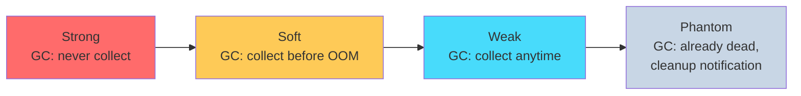
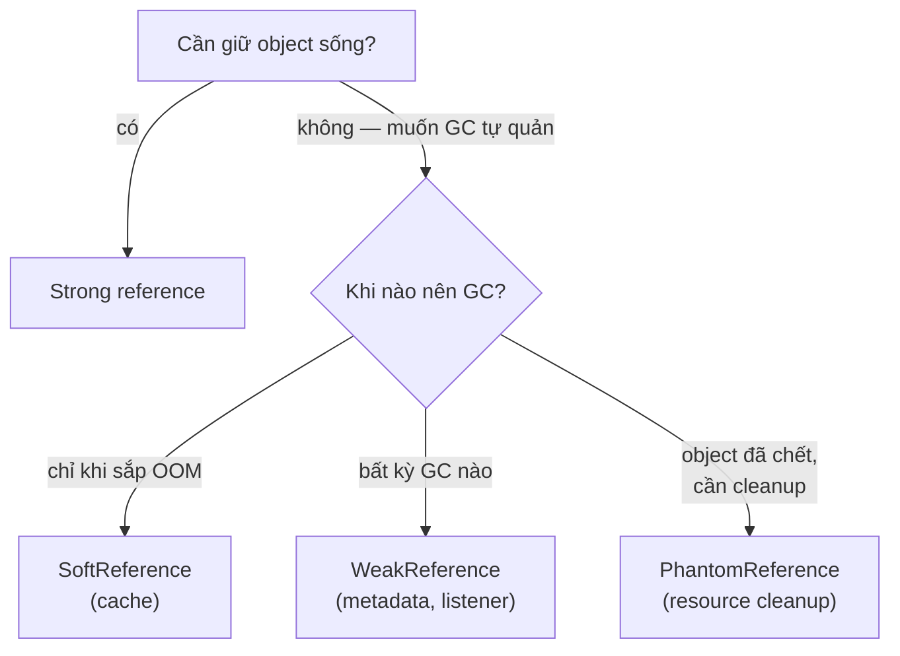

## Mục lục

- [Bối cảnh: cache 2GB không chịu GC — OOM chỉ vì Strong reference](#1-bối-cảnh-cache-2gb-không-chịu-gc--oom-chỉ-vì-strong-reference)
- [4 loại reference — từ mạnh đến yếu](#2-4-loại-reference--từ-mạnh-đến-yếu)
- [GC Reachability Analysis — khi nào object "chết"?](#3-gc-reachability-analysis--khi-nào-object-chết)
- [SoftReference — cache tự co khi sắp OOM](#4-softreference--cache-tự-co-khi-sắp-oom)
- [WeakReference — reference không ngăn GC](#5-weakreference--reference-không-ngăn-gc)
- [WeakHashMap internals — key biến mất tự động](#6-weakhashmap-internals--key-biến-mất-tự-động)
- [PhantomReference — cleanup sau khi object chết](#7-phantomreference--cleanup-sau-khi-object-chết)
- [ReferenceQueue — notification channel từ GC](#8-referencequeue--notification-channel-từ-gc)
- [Finalizer & Cleaner — phantom reference dưới hood](#9-finalizer--cleaner--phantom-reference-dưới-hood)
- [ThreadLocal memory leak — WeakReference bẫy](#10-threadlocal-memory-leak--weakreference-bẫy)
- [So sánh & decision matrix](#11-so-sánh--decision-matrix)
- [Tóm tắt — Cheat sheet & 5 nguyên tắc](#12-tóm-tắt--cheat-sheet--5-nguyên-tắc)

---

## 1. Bối cảnh: cache 2GB không chịu GC — OOM chỉ vì Strong reference

Service image-processing cache kết quả resize vào `HashMap<String, BufferedImage>`:

```java
Map<String, BufferedImage> cache = new HashMap<>();

BufferedImage getResized(String key, BufferedImage original) {
    return cache.computeIfAbsent(key, k -> resize(original));  // cache forever
}
```

Heap 4GB. Sau vài giờ: cache chứa 200.000 entry × 10KB mỗi image = **2GB**. GC **không thể** thu hồi vì `HashMap` → strong reference → mọi image "reachable". Full GC liên tục nhưng không giải phóng được gì → `OutOfMemoryError`.

```text
Full GC: 4096M → 4090M (recovered only 6MB!) — cache giữ sống mọi thứ
```

Fix bằng `SoftReference`:
```java
Map<String, SoftReference<BufferedImage>> cache = new ConcurrentHashMap<>();
// Hoặc tốt hơn: Caffeine/Guava cache với softValues()
```

> [!IMPORTANT]
> Strong reference = "tôi CẦN object này". GC **tuyệt đối không** thu hồi object có strong reference. Cache dùng strong reference = cache chỉ phình, không bao giờ co → OOM chắc chắn nếu data unbounded.

---

## 2. 4 loại reference — từ mạnh đến yếu

```java
// java.lang.ref package
Object obj = new Object();

// 1. Strong (mặc định — mọi biến thông thường)
Object strong = obj;                    // GC: KHÔNG THU HỒI khi còn strong ref

// 2. Soft — GC thu hồi KHI SẮP OOM
SoftReference<Object> soft = new SoftReference<>(obj);

// 3. Weak — GC thu hồi TẠI BẤT KỲ GC cycle nào (nếu không còn strong/soft)
WeakReference<Object> weak = new WeakReference<>(obj);

// 4. Phantom — object ĐÃ CHẾT, chỉ dùng cho post-mortem cleanup
PhantomReference<Object> phantom = new PhantomReference<>(obj, queue);
```



| Type | `get()` trả gì sau GC | Khi nào bị clear | Use case chính |
|------|----------------------|-----------------|----------------|
| Strong | Luôn có | Không bao giờ (nếu reachable) | Mọi thứ bình thường |
| Soft | Object hoặc `null` | Trước khi throw OOM | **Memory-sensitive cache** |
| Weak | Object hoặc `null` | Mỗi GC cycle | **Canonical map, metadata, listener** |
| Phantom | **Luôn `null`** (JDK 8) / object (JDK 9+) | Sau finalize | **Resource cleanup** |

---

## 3. GC Reachability Analysis — khi nào object "chết"?

GC đánh giá **reachability** từ GC Roots (stack variables, static fields, JNI refs...):

```
GC Root
  ├── strong → Object A  ← STRONGLY reachable (không GC)
  ├── soft → Object B    ← SOFTLY reachable (GC trước OOM)
  │     └── strong → Object C  ← C: softly reachable (transitive)
  └── weak → Object D    ← WEAKLY reachable (GC any time)
        └── strong → Object E  ← E: weakly reachable (weakest link)
```

**Quy tắc "mắt xích yếu nhất"**: reachability = loại reference **yếu nhất** trên path từ GC root tới object.

Object có **cả strong lẫn weak** reference:
```java
Object obj = new Object();     // strong ref
WeakReference<Object> wr = new WeakReference<>(obj);  // weak ref

// obj reachable qua STRONG → strongly reachable → KHÔNG bị GC
obj = null;  // bỏ strong ref → chỉ còn weak → weakly reachable → GC thu hồi
```

> [!NOTE]
> "Reachable" nghĩa là tồn tại **ít nhất 1 path** từ GC root tới object. Nếu có path strong → object: strongly reachable (dù có thêm 100 weak paths). Chỉ khi **mọi path** đều weak (hoặc yếu hơn) thì mới weakly reachable.

---

## 4. SoftReference — cache tự co khi sắp OOM

### 4.1. Hành vi

```java
SoftReference<byte[]> softRef = new SoftReference<>(new byte[10_000_000]);

byte[] data = softRef.get();  // object hoặc null
if (data == null) {
    // GC đã thu hồi → phải reload
    data = loadFromDisk();
    softRef = new SoftReference<>(data);
}
```

**GC chỉ clear soft reference khi:**
- Heap sắp đầy (gần OOM threshold)
- JVM spec: "all soft references...should have been cleared before throwing OOM"
- HotSpot: dùng formula LRU — clear least-recently-used soft refs trước

### 4.2. LRU eviction (HotSpot)

```
// HotSpot policy:
clock - last_access_time > threshold

threshold = free_heap_MB × SoftRefLRUPolicyMSPerMB (default 1000)
// Ví dụ: free heap = 500MB → threshold = 500,000 ms = 8 phút
// Soft ref truy cập > 8 phút trước → eligible for collection
```

> [!WARNING]
> Soft reference **không phải bounded cache**. Nếu access rate cao hơn GC rate, soft refs tích luỹ cho đến **gần OOM mới clear** → GC thrashing. Dùng bounded cache (Caffeine, Guava) với eviction policy rõ ràng tốt hơn.

### 4.3. Ví dụ: image cache

```java
Map<String, SoftReference<BufferedImage>> imageCache = new ConcurrentHashMap<>();

BufferedImage getImage(String path) {
    SoftReference<BufferedImage> ref = imageCache.get(path);
    BufferedImage img = (ref != null) ? ref.get() : null;
    if (img == null) {
        img = ImageIO.read(new File(path));
        imageCache.put(path, new SoftReference<>(img));
    }
    return img;
}
// Vấn đề: SoftReference bị clear nhưng entry (key → dead SoftRef) vẫn trong map
// → periodic cleanup cần thiết
```

---

## 5. WeakReference — reference không ngăn GC

### 5.1. Hành vi

```java
Object obj = new Object();
WeakReference<Object> wr = new WeakReference<>(obj);

wr.get();   // → obj (vẫn sống vì có strong ref `obj`)
obj = null; // bỏ strong ref cuối cùng
System.gc();
wr.get();   // → null (GC đã thu hồi — chỉ còn weak ref)
```

**Weak bị clear tại MỌI GC cycle** (minor hoặc full) nếu object chỉ weakly reachable. Không chờ OOM như soft.

### 5.2. Use cases

**Canonical mapping** (chỉ giữ sống nếu ai đó còn dùng):
```java
// WeakHashMap: key là weak reference
Map<Key, Metadata> metadata = new WeakHashMap<>();
// Khi Key object không còn strong ref ở nơi khác → entry tự biến mất
```

**Listener/callback** (tránh leak):
```java
// EventBus giữ listeners bằng weak ref → listener được GC khi không ai reference
List<WeakReference<EventListener>> listeners = new ArrayList<>();
```

**Thread-local metadata** (ThreadLocal dùng weak ref cho key — xem mục 10).

---

## 6. WeakHashMap internals — key biến mất tự động

```java
public class WeakHashMap<K,V> extends AbstractMap<K,V> {
    // Entry extend WeakReference<Object> — KEY là weak ref
    private static class Entry<K,V> extends WeakReference<Object> implements Map.Entry<K,V> {
        V value;
        final int hash;
        Entry<K,V> next;

        Entry(Object key, V value, ReferenceQueue<Object> queue, int hash, Entry<K,V> next) {
            super(key, queue);   // WeakReference(key, queue)
            this.value = value;
            this.hash = hash;
            this.next = next;
        }
    }

    private final ReferenceQueue<Object> queue = new ReferenceQueue<>();
}
```

**Cleanup mechanism** — `expungeStaleEntries()`:

```java
private void expungeStaleEntries() {
    // Poll queue: lấy tất cả weak ref đã bị GC clear
    for (Object x; (x = queue.poll()) != null; ) {
        Entry<K,V> e = (Entry<K,V>) x;
        int i = indexFor(e.hash, table.length);
        // Gỡ entry ra khỏi bucket chain
        // ... remove from linked list ...
        e.value = null;  // giải phóng value cho GC
        size--;
    }
}
```

**Khi nào expunge?** Được gọi tại đầu mỗi operation (`get`, `put`, `size`, `resize`). **Lazy cleanup** — không có background thread.

> [!IMPORTANT]
> WeakHashMap **không thread-safe** và cleanup là lazy. Nếu không gọi method nào (map không được truy cập) → stale entries tích luỹ. Trong concurrent env: wrap bằng `Collections.synchronizedMap()` hoặc tốt hơn: dùng Caffeine với `weakKeys()`.

---

## 7. PhantomReference — cleanup sau khi object chết

```java
PhantomReference<Object> phantom = new PhantomReference<>(obj, queue);
phantom.get();  // LUÔN null (JDK 8) — không thể "hồi sinh" object

// JDK 9+: get() có thể trả object (nhưng API vẫn return null by contract)
// Real purpose: notification qua ReferenceQueue rằng object đã finalize xong
```

**Vì sao cần phantom?**

`finalize()` có vấn đề: object có thể "hồi sinh" (trong finalize, gán `this` vào static field). PhantomReference đảm bảo: **khi phantom ref enqueue vào queue, object CHẮC CHẮN đã chết** — không thể hồi sinh.

### 7.1. Resource cleanup pattern

```java
public class ResourceCleaner {
    private static final ReferenceQueue<MyResource> queue = new ReferenceQueue<>();
    private static final Set<CleanupRef> refs = ConcurrentHashMap.newKeySet();

    static class CleanupRef extends PhantomReference<MyResource> {
        private final long nativePtr;  // resource cần giải phóng

        CleanupRef(MyResource obj, long ptr) {
            super(obj, queue);
            this.nativePtr = ptr;
            refs.add(this);  // giữ strong ref để phantom không bị GC
        }

        void cleanup() {
            freeNativeMemory(nativePtr);  // release native resource
            refs.remove(this);
        }
    }

    // Background thread poll queue:
    static {
        Thread cleaner = new Thread(() -> {
            while (true) {
                CleanupRef ref = (CleanupRef) queue.remove();  // block until available
                ref.cleanup();
            }
        });
        cleaner.setDaemon(true);
        cleaner.start();
    }
}
```

> [!TIP]
> JDK 9+ cung cấp `java.lang.ref.Cleaner` — chính xác pattern trên nhưng đóng gói sẵn. Thay thế `finalize()` (deprecated JDK 9). `DirectByteBuffer` dùng Cleaner để free native memory khi buffer bị GC.

---

## 8. ReferenceQueue — notification channel từ GC

```java
ReferenceQueue<Object> queue = new ReferenceQueue<>();
WeakReference<Object> wr = new WeakReference<>(obj, queue);

obj = null;  // bỏ strong ref
System.gc(); // GC clear weak ref

// Sau khi GC clear reference → reference object được enqueue vào queue:
Reference<?> ref = queue.poll();   // non-blocking: trả ref hoặc null
// hoặc:
Reference<?> ref = queue.remove(); // blocking: chờ cho đến khi có
// hoặc:
Reference<?> ref = queue.remove(5000); // timeout 5s
```

**Flow GC → ReferenceQueue:**

```
1. GC mark phase: phát hiện object chỉ weakly/softly/phantom reachable
2. GC clear reference: ref.referent = null
3. GC enqueue reference vào queue (nếu reference có queue)
4. Application thread poll queue → biết object đã bị GC
5. Application cleanup (remove from map, free resource, ...)
```

**Không có queue** (tạo reference không có queue param):
- Reference vẫn bị clear (get() → null)
- Nhưng **không có notification** — application phải poll get() thủ công

> [!NOTE]
> ReferenceQueue là **cầu nối** giữa GC và application code. GC push notifications (reference đã clear) → app thread pull và react. Đây là pattern "reactive cleanup" thay vì "proactive cleanup" (scan tất cả entry).

---

## 9. Finalizer & Cleaner — phantom reference dưới hood

### 9.1. finalize() — deprecated, vì sao?

```java
@Override
protected void finalize() throws Throwable {
    closeConnection();  // cleanup
}
```

Vấn đề:
1. **Không deterministic**: không biết khi nào GC gọi (có thể không bao giờ!).
2. **Hồi sinh object**: `finalize()` có thể gán `this` vào static → object sống lại.
3. **Performance**: object có finalizer phải qua **2 GC cycles** mới bị thu hồi (GC 1: finalize, GC 2: collect).
4. **Security**: subclass override finalize → bypass constructor checks.

### 9.2. Cleaner (JDK 9+) — thay thế finalize

```java
public class MyResource implements AutoCloseable {
    private static final Cleaner cleaner = Cleaner.create();
    private final Cleaner.Cleanable cleanable;
    private final long nativePtr;

    public MyResource() {
        this.nativePtr = allocateNative();
        // Register cleaning action (KHÔNG capture `this`!)
        this.cleanable = cleaner.register(this, new CleanAction(nativePtr));
    }

    // Cleaning action — static class, KHÔNG reference enclosing instance
    private static class CleanAction implements Runnable {
        private final long ptr;
        CleanAction(long ptr) { this.ptr = ptr; }
        public void run() { freeNative(ptr); }
    }

    @Override
    public void close() {
        cleanable.clean();  // deterministic cleanup — gọi thủ công
    }
    // Nếu quên close() → Cleaner gọi CleanAction khi GC collect MyResource
}
```

> [!WARNING]
> Cleaner action **KHÔNG ĐƯỢC** reference object gốc (trực tiếp hoặc gián tiếp). Nếu reference → object không bao giờ phantom reachable → Cleaner không bao giờ chạy → **memory leak**. Dùng static inner class, capture chỉ primitive/ptr cần cleanup.

---

## 10. ThreadLocal memory leak — WeakReference bẫy

`ThreadLocal` dùng `WeakReference` cho key trong `ThreadLocalMap`:

```java
// ThreadLocal.ThreadLocalMap:
static class Entry extends WeakReference<ThreadLocal<?>> {
    Object value;  // ← STRONG reference!
    Entry(ThreadLocal<?> k, Object v) {
        super(k);  // key = weak ref tới ThreadLocal
        value = v; // value = strong ref
    }
}
```

```
Thread.threadLocals (ThreadLocalMap):
┌──────────────────────┬────────────────┐
│ Key (WeakRef → TL)   │ Value (Strong) │
├──────────────────────┼────────────────┤
│ WeakRef → threadLocal│ → MyObject     │ ← strong ref giữ value sống
│ null (TL đã bị GC)   │ → MyObject     │ ← LEAK! key=null nhưng value vẫn sống
└──────────────────────┴────────────────┘
```

**Leak scenario:**
1. `ThreadLocal` variable ra khỏi scope (hoặc class unload) → GC clear weak key → key = null.
2. Nhưng **value** vẫn **strong reference** từ Entry → value KHÔNG bị GC.
3. Thread pool: thread sống mãi → ThreadLocalMap sống mãi → stale entry sống mãi.

**Fix:**
```java
try {
    threadLocal.set(value);
    // ... use ...
} finally {
    threadLocal.remove();  // ← LUÔN remove khi xong! Cleanup entry
}
```

> [!IMPORTANT]
> ThreadLocal + Thread pool = **memory leak classic**. Thread không chết → ThreadLocalMap không GC → stale values tích luỹ. **Luôn gọi `remove()`** trong finally block, đặc biệt khi value là object lớn hoặc reference ClassLoader (webapp redeploy leak — xem ClassLoader deep dive).

---

## 11. So sánh & decision matrix

| Scenario | Reference Type | Lý do |
|----------|---------------|-------|
| Biến cục bộ, field bình thường | **Strong** | Mặc định, GC biết bạn cần nó |
| Cache với memory pressure awareness | **Soft** | Tự evict khi heap đầy |
| Canonical map (key không còn ai dùng → remove) | **Weak** (WeakHashMap) | Key GC → entry tự mất |
| Listener registry (listener không còn ai reference) | **Weak** | Listener GC → auto-deregister |
| Native resource cleanup (backup cho close()) | **Phantom** + Cleaner | Post-mortem, non-resurrectible |
| ClassLoader metadata tracking | **Weak** | Loader unload → metadata GC |



---

## 12. Tóm tắt — Cheat sheet & 5 nguyên tắc

**Cỗ máy trong 6 dòng:**

```
1. Strong: GC KHÔNG collect. Mọi biến = strong ref.
2. Soft: GC collect TRƯỚC OOM. Cache tự co. LRU policy (HotSpot).
3. Weak: GC collect MỖI CYCLE. Canonical map, listener, ThreadLocal key.
4. Phantom: get()=null. Post-mortem notification qua ReferenceQueue. Cleaner pattern.
5. ReferenceQueue: GC enqueue cleared refs → app poll → cleanup.
6. Reachability = weakest link trên path từ GC root.
```

| Type | get() after GC | Enqueued to queue? | Typical use |
|------|---------------|--------------------|-------------|
| Strong | Always object | N/A | Default |
| Soft | null when near OOM | ✅ (if queue provided) | Cache |
| Weak | null after any GC | ✅ (if queue provided) | WeakHashMap, ThreadLocal |
| Phantom | null (JDK 8) | ✅ (always needs queue) | Cleaner, native cleanup |

**5 nguyên tắc khắc cốt:**

1. **Cache → SoftReference hoặc bounded cache library** — đừng dùng strong ref cho unbounded cache. Soft co tự động, Caffeine cho eviction policy rõ ràng.
2. **Metadata mapping → WeakHashMap/WeakReference** — khi "nếu object chính chết thì metadata vô nghĩa".
3. **Resource cleanup → Phantom + Cleaner (JDK 9+)** — backup cho `close()`. Không dùng finalize (deprecated, slow, unsafe).
4. **ThreadLocal phải `remove()` trong finally** — đặc biệt với thread pool. Key weak nhưng value strong = leak.
5. **ReferenceQueue cho reactive cleanup** — poll queue thay vì scan map. WeakHashMap tự gọi `expungeStaleEntries()` nhưng chỉ khi truy cập map.

> [!TIP]
> Một câu để nhớ: *Reference types là cách bạn "nói chuyện" với GC — Strong: "tôi cần đây, đừng chạm", Soft: "giữ nếu được, bỏ nếu cần", Weak: "tôi chỉ quan sát, bỏ lúc nào cũng được", Phantom: "nó chết rồi, cho tôi dọn xác".*
