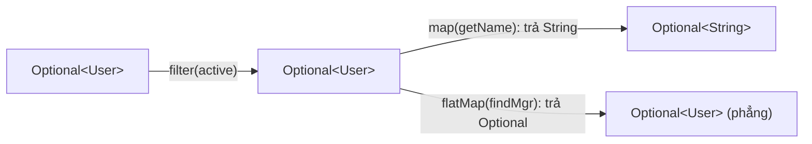

# Optional — Xử lý "có thể vắng mặt" một cách tường minh

`Optional` biểu diễn rõ ràng rằng một kết quả có thể có hoặc không có giá trị. Nó phù hợp nhất ở return type của API, nơi absence là một kết quả hợp lệ cần caller xử lý có chủ đích.

## Mục lục

- [Tổng quan](#1-tổng-quan)
- [Optional là gì — value-based class](#2-optional-là-gì--value-based-class)
- [Tạo Optional: of / ofNullable / empty](#3-tạo-optional-of--ofnullable--empty)
- [Biến đổi: map / flatMap / filter](#4-biến-đổi-map--flatmap--filter)
- [Lấy giá trị ra: orElse vs orElseGet vs orElseThrow](#5-lấy-giá-trị-ra-orelse-vs-orelseget-vs-orelsethrow)
- [Optional + Stream](#6-optional--stream)
- [Khi nào KHÔNG dùng Optional](#7-khi-nào-không-dùng-optional)
- [Chi phí & cân nhắc hiệu năng](#8-chi-phí--cân-nhắc-hiệu-năng)
- [Anti-patterns cần tránh](#9-anti-patterns-cần-tránh)
- [Tóm tắt — Cheat sheet](#10-tóm-tắt--cheat-sheet)

---

## 1. Tổng quan

`Optional` cung cấp các phép biến đổi như `map`, `flatMap`, `filter` và các nhánh fallback thay cho việc kiểm tra `null` lặp lại. Tuy nhiên nó không loại bỏ mọi `NullPointerException` và không nên được dùng tùy tiện cho field, parameter hoặc collection element.

Giá trị của `Optional` nằm ở hợp đồng API rõ ràng, không phải ở việc bọc mọi reference có thể `null`.

## 2. Optional là gì — value-based class

`Optional<T>` là một **container** chứa **0 hoặc 1** giá trị. Bên trong chỉ là một field:

```java
public final class Optional<T> {
    private final T value;   // null nghĩa là "empty"
    // KHÔNG có constructor public — chỉ tạo qua factory
}
```

Quan trọng: `Optional` là **value-based class** (như `Integer`, `LocalDate`). Hệ quả ràng buộc:

> [!WARNING]
> Với value-based class, **không** được dựa vào identity: đừng `synchronized(optional)`, đừng so sánh bằng `==`, đừng giả định `new` tạo instance riêng. Tương lai (Project Valhalla) có thể biến chúng thành **value type** không có identity. Dùng `.equals()` để so sánh, không `==`.

```java
Optional<String> a = Optional.of("x");
Optional<String> b = Optional.of("x");
a == b;        // KHÔNG đảm bảo — đừng dựa vào
a.equals(b);   // true — so sánh đúng
```

---

## 3. Tạo Optional: of / ofNullable / empty

Ba factory, chọn sai gây NPE ngay tại điểm tạo:

| Factory | Khi value... | Hành vi |
|---------|--------------|---------|
| `Optional.of(x)` | chắc chắn non-null | NPE nếu `x == null` |
| `Optional.ofNullable(x)` | có thể null | empty nếu null, present nếu không |
| `Optional.empty()` | luôn rỗng | container rỗng |

```java
Optional.of(user);          // dùng khi BIẾT chắc non-null (sai → NPE sớm, tốt)
Optional.ofNullable(map.get(key));   // map.get có thể null → dùng cái này
```

> [!TIP]
> Quy tắc: dùng `of()` khi bạn *muốn* nổ NPE ngay nếu giá trị bất ngờ null (fail-fast). Dùng `ofNullable()` khi null là khả năng hợp lệ. Đừng dùng `ofNullable` ở mọi nơi "cho an toàn" — `of` giúp lộ bug sớm.

---

## 4. Biến đổi: map / flatMap / filter

Đây là nơi `Optional` toả sáng — chuỗi biến đổi mà không cần `if null` lồng nhau:

```java
Optional<String> name = Optional.ofNullable(user)
    .filter(u -> u.isActive())          // giữ nếu thoả, nếu không → empty
    .map(User::getName)                 // T → U, tự bọc lại Optional<U>
    .map(String::trim);
```

`map` vs `flatMap` — điểm gây nhầm nhất:

```java
// map: hàm trả VALUE thường → Optional tự bọc → Optional<U>
opt.map(User::getName)                  // getName: User → String  ⇒ Optional<String>

// flatMap: hàm ĐÃ trả Optional → tránh Optional<Optional<U>>
opt.flatMap(User::findManager)          // findManager: User → Optional<User>
//  nếu dùng map ở đây sẽ ra Optional<Optional<User>> — sai
```



> [!NOTE]
> Quy tắc nhớ: nếu hàm bạn truyền vào **đã** trả `Optional`, dùng `flatMap` (để "làm phẳng"). Nếu trả giá trị thường, dùng `map`. Giống `Stream.map` vs `Stream.flatMap`.

---

## 5. Lấy giá trị ra: orElse vs orElseGet vs orElseThrow

| Method | Trả về khi rỗng | Đánh giá default |
|--------|-----------------|------------------|
| `get()` | ném `NoSuchElementException` | — (tránh dùng) |
| `orElse(x)` | `x` | **luôn** đánh giá `x`, kể cả khi present |
| `orElseGet(supplier)` | `supplier.get()` | **chỉ** gọi supplier khi rỗng (lazy) |
| `orElseThrow(supplier)` | ném exception bạn chọn | lazy |
| `or(supplier)` | `Optional` khác (lazy) | trả `Optional`, không unwrap |

Bẫy kinh điển — `orElse` đánh giá **eager**:

```java
// orElse: createDefaultUser() LUÔN chạy, kể cả khi opt có giá trị!
User u = opt.orElse(createDefaultUser());     // 😱 lãng phí / side-effect ngoài ý

// orElseGet: chỉ chạy khi opt rỗng
User u = opt.orElseGet(() -> createDefaultUser());   // ✅ lazy
```

> [!WARNING]
> `orElse(expensiveCall())` — biểu thức trong ngoặc được tính **trước khi** `orElse` chạy (Java đánh giá argument eager). Nếu default tốn kém hoặc có side-effect (query DB, tạo object), **luôn** dùng `orElseGet(() -> ...)`. Chỉ dùng `orElse` cho hằng số/giá trị có sẵn rẻ.

Và đừng dùng `get()` trần — nó chỉ khác `null` ở chỗ ném exception khác. Effective Java khuyên: nếu phải `isPresent()` + `get()`, gần như luôn có cách hàm hoá tốt hơn.

---

## 6. Optional + Stream

`Optional` ghép tự nhiên với `Stream`:

```java
// Optional.stream() (Java 9+): biến Optional thành Stream 0/1 phần tử
// → lọc bỏ empty khi flatMap qua nhiều Optional
List<User> managers = users.stream()
    .map(User::findManager)        // Stream<Optional<User>>
    .flatMap(Optional::stream)     // bỏ empty, mở present → Stream<User>
    .toList();

// Tìm phần tử đầu → trả Optional
Optional<User> first = users.stream().filter(User::isActive).findFirst();
```

> [!TIP]
> `Optional::stream` là cách sạch nhất để "lọc và mở" một stream các `Optional`. Trước Java 9 phải `.filter(Optional::isPresent).map(Optional::get)` — dài và dễ sai. Các method stream như `findFirst`, `findAny`, `min`, `max`, `reduce` đều trả `Optional` vì kết quả có thể vắng.

---

## 7. Khi nào KHÔNG dùng Optional

`Optional` được thiết kế **chủ yếu cho kiểu trả về** của method. Lạm dụng ở nơi khác là anti-pattern:

| Nơi | Nên dùng Optional? | Vì sao |
|-----|--------------------|--------|
| Kiểu **trả về** method | ✅ Có (use case chính) | báo "có thể vắng" cho caller |
| **Field** của class/entity | ❌ Không | tốn bộ nhớ, không `Serializable`, dùng null/empty collection |
| **Tham số** method | ❌ Không | bắt caller bọc `Optional.of(...)` rườm rà; dùng overload |
| Trả về **collection** | ❌ Không | trả `List` rỗng (`List.of()`), không `Optional<List>` |
| Key/value trong **Map** | ❌ Không | `Map.get` đã trả null; đừng `Optional` làm value |

```java
// SAI — Optional làm field
class User { private Optional<String> middleName; }   // không Serializable, tốn RAM

// ĐÚNG — field thường, getter trả Optional
class User {
    private String middleName;   // có thể null
    public Optional<String> middleName() { return Optional.ofNullable(middleName); }
}
```

> [!IMPORTANT]
> `Optional` **không** implement `Serializable` — đó là tín hiệu thiết kế rõ ràng: nó không dành cho field cần lưu trữ/truyền qua mạng. Trả về `List`/`Set` rỗng thay vì `Optional<Collection>` — "không có phần tử" đã được biểu diễn tự nhiên bằng collection rỗng.

---

## 8. Chi phí & cân nhắc hiệu năng

`Optional` là một **object trên heap** — mỗi `Optional` là một allocation. Trong vòng lặp nóng hàng triệu lần, chi phí này tích luỹ:

```java
// Trong hot loop, tạo hàng triệu Optional → áp lực GC
for (int i = 0; i < 10_000_000; i++) {
    Optional<Item> o = lookup(i);   // mỗi lần 1 allocation
    ...
}
```

> [!NOTE]
> JIT thường **escape-analysis** loại bỏ allocation nếu `Optional` không "thoát" khỏi method (scalar replacement) — nên trong nhiều trường hợp chi phí thực bằng 0. Nhưng đừng dựa vào điều đó cho hot path cực nhạy. Project Valhalla (value types) sẽ làm `Optional` "phẳng" và rẻ trong tương lai. Với code thường (không hot loop), tính rõ ràng đáng giá hơn vi-tối-ưu.

---

## 9. Anti-patterns cần tránh

| Anti-pattern | Vì sao sai | Thay bằng |
|--------------|-----------|-----------|
| `opt.isPresent()` rồi `opt.get()` | dài dòng, dễ quên check | `map`/`ifPresent`/`orElse` |
| `Optional.of(x)` khi `x` có thể null | NPE ngay tại đó | `ofNullable` |
| `orElse(expensiveCall())` | đánh giá eager dù present | `orElseGet(() -> ...)` |
| `Optional` làm field / parameter | tốn RAM, không Serializable | field null + getter Optional / overload |
| `Optional<List<T>>` | rỗng đã biểu diễn được | trả `List.of()` |
| `opt.get()` không check | chỉ là NPE đổi tên | `orElseThrow` với message rõ |
| `== null` trên Optional | Optional cũng có thể... đừng để nó null | đừng trả null Optional bao giờ |

> [!WARNING]
> **Không bao giờ trả về `null` cho một kiểu `Optional`** — đó là "tội nặng nhất". Method trả `Optional<T>` phải trả `Optional.empty()` khi vắng, không bao giờ `null`. Một `Optional` null buộc caller check null *của cả container* — phá huỷ toàn bộ lý do tồn tại của Optional.

---

## 10. Tóm tắt — Cheat sheet

**Optional trong 5 dòng:**

```
1. Dành cho KIỂU TRẢ VỀ của method (không phải field/parameter)
2. of (chắc non-null) / ofNullable (có thể null) / empty
3. map (hàm trả value) vs flatMap (hàm trả Optional)
4. orElse (eager) vs orElseGet (lazy) — dùng orElseGet cho default đắt
5. Đừng get() trần; đừng trả null cho Optional; collection rỗng thay Optional<List>
```

| Tình huống | Dùng |
|------------|------|
| Lấy giá trị / default rẻ | `orElse(x)` |
| Default đắt / side-effect | `orElseGet(() -> ...)` |
| Vắng = lỗi | `orElseThrow(...)` |
| Làm gì đó nếu present | `ifPresent` / `ifPresentOrElse` |
| Lọc stream Optional | `flatMap(Optional::stream)` |

**5 nguyên tắc khắc cốt:**

1. **Optional cho kiểu trả về**, không cho field/parameter/collection.
2. **`orElse` eager, `orElseGet` lazy** — sai chỗ này gây side-effect/lãng phí.
3. **`map` vs `flatMap`** theo việc hàm có trả Optional không.
4. **Không bao giờ trả `null` cho `Optional`** — dùng `empty()`.
5. **Tránh `isPresent()+get()`** — ưu tiên chuỗi hàm.

> [!TIP]
> Một câu để nhớ: *Optional không xoá null khỏi Java — nó di chuyển quyết định "xử lý vắng mặt" từ runtime (NPE bất ngờ) lên compile-time (kiểu bắt bạn nghĩ tới nó).*
