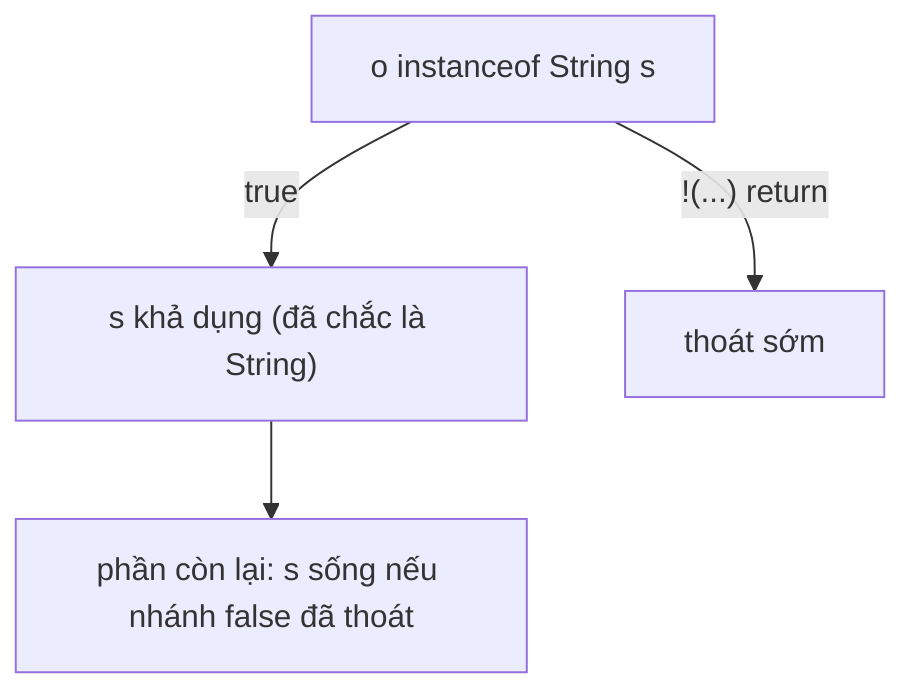

# Pattern Matching & Switch Expressions — Khai tử instanceof-cast-dài-dòng

Pattern matching trong Java kết hợp kiểm tra kiểu, trích xuất dữ liệu và rẽ nhánh trong cú pháp ngắn gọn hơn. Cùng với switch expression, nó giúp biểu diễn các nhánh xử lý theo shape của dữ liệu một cách rõ ràng và an toàn.

## Mục lục

- [Tổng quan](#1-tổng-quan)
- [Switch expression — arrow, yield, và là biểu thức](#2-switch-expression--arrow-yield-và-là-biểu-thức)
- [Pattern matching for instanceof & flow scoping](#3-pattern-matching-for-instanceof--flow-scoping)
- [Pattern matching for switch (Java 21)](#4-pattern-matching-for-switch-java-21)
- [Record pattern — destructuring lồng nhau](#5-record-pattern--destructuring-lồng-nhau)
- [Guarded pattern với when](#6-guarded-pattern-với-when)
- [Exhaustiveness, sealed & xử lý null](#7-exhaustiveness-sealed--xử-lý-null)
- [Compiler làm gì bên dưới](#8-compiler-làm-gì-bên-dưới)
- [Anti-patterns cần tránh](#9-anti-patterns-cần-tránh)
- [Tóm tắt — Cheat sheet](#10-tóm-tắt--cheat-sheet)

---

## 1. Tổng quan

Các phiên bản Java hiện đại bổ sung type pattern cho `instanceof`, switch expression, pattern trong `switch` và record pattern. Compiler kiểm tra phạm vi biến, tính đầy đủ của nhánh và quan hệ giữa các case.

Tính năng này đặc biệt hiệu quả khi làm việc với sealed hierarchy, nhưng vẫn cần tránh biến `switch` thành nơi chứa quá nhiều logic nghiệp vụ.

## 2. Switch expression — arrow, yield, và là biểu thức

Java 14 (chính thức) biến `switch` từ **statement** thành **expression** — nó *trả về giá trị*:

```java
// switch CŨ (statement) — cần break, dễ fall-through, không trả giá trị
int days;
switch (month) {
    case JAN: case MAR: days = 31; break;   // quên break = bug fall-through
    default: days = 30;
}

// switch MỚI (expression) — arrow, không fall-through, trả giá trị
int days = switch (month) {
    case JAN, MAR, MAY -> 31;       // nhiều nhãn, không break, không xuyên nhánh
    case FEB           -> 28;
    default            -> 30;
};
```

Khi một nhánh cần nhiều câu lệnh, dùng block + `yield`:

```java
int result = switch (code) {
    case "A" -> 1;
    case "B" -> {
        int x = compute();
        yield x * 2;            // yield trả giá trị cho switch expression
    }
    default -> 0;
};
```

| | switch cũ (statement) | switch mới (expression) |
|---|----------------------|--------------------------|
| Trả giá trị | không | có |
| Fall-through | có (cần `break`) | không (arrow tách biệt) |
| Nhiều nhãn | `case A: case B:` | `case A, B ->` |
| Đủ trường hợp | không bắt buộc | **bắt buộc** (cần default hoặc phủ kín) |

> [!TIP]
> `switch` expression **bắt buộc** đầy đủ — nếu thiếu trường hợp và không có `default`, compile lỗi. Điều này loại bỏ bug "quên một case" âm thầm trả giá trị rác — một cải tiến an toàn lớn so với switch statement.

---

## 3. Pattern matching for instanceof & flow scoping

Java 16 (JEP 394): `instanceof` có thể **bind** biến luôn:

```java
if (o instanceof String s) {     // kiểm + cast + gán s, tất cả một lần
    System.out.println(s.length());   // s là String trong scope này
}
```

Điều tinh tế nhất là **flow scoping** — phạm vi của biến binding theo *luồng logic*, không theo block cú pháp:

```java
// Binding "rò" ra theo logic nhờ &&
if (o instanceof String s && s.length() > 3) { ... }   // s dùng được sau &&

// Hoặc theo "early return" — s sống ở phần CÒN LẠI của method
if (!(o instanceof String s)) return;
System.out.println(s.length());   // ✅ s trong scope! vì nhánh kia đã return
```



> [!NOTE]
> Compiler dùng phân tích luồng (definite assignment) để biết chính xác nơi nào binding *chắc chắn* là kiểu đã kiểm. Nếu nhánh `false` thoát (return/throw), thì biến binding "sống tiếp" ở phần sau — gọi là **flow scoping**. Đây là vì sao binding mạnh hơn nhiều so với cast tay.

---

## 4. Pattern matching for switch (Java 21)

Java 21 (JEP 441) cho `switch` so khớp theo **kiểu** (type pattern), không chỉ hằng số:

```java
double area(Shape shape) {
    return switch (shape) {
        case Circle c    -> Math.PI * c.radius() * c.radius();
        case Rectangle r -> r.w() * r.h();
        case Triangle t  -> 0.5 * t.base() * t.height();
        // KHÔNG cần default nếu Shape là sealed và đã liệt kê hết (mục 7)
    };
}
```

Đây thay thế hoàn toàn pattern **Visitor** rườm rà (xem doc behavioral-patterns) trong nhiều trường hợp — bạn dispatch theo kiểu thực mà không cần thêm method `accept`/`visit` vào hệ thống lớp.

> [!TIP]
> So với chuỗi `if (x instanceof A) ... else if (x instanceof B)`, `switch` on pattern vừa ngắn vừa được compiler kiểm tra đủ trường hợp. Nó cũng nhanh hơn: compiler có thể sinh bảng nhảy (jump table) qua `invokedynamic` thay vì chuỗi so sánh tuyến tính (mục 8).

---

## 5. Record pattern — destructuring lồng nhau

Java 21 (JEP 440): **record pattern** tách (destructure) các thành phần của record ngay trong pattern:

```java
record Point(int x, int y) {}
record Line(Point start, Point end) {}

Object obj = new Line(new Point(0, 0), new Point(3, 4));

String s = switch (obj) {
    // destructure LỒNG NHAU: lấy thẳng x1,y1,x2,y2 ra
    case Line(Point(var x1, var y1), Point(var x2, var y2)) ->
        "Độ dài: " + Math.hypot(x2 - x1, y2 - y1);
    default -> "không phải Line";
};
```

`var` trong pattern để compiler tự suy kiểu. Record pattern hợp với type pattern + guard tạo nên ngôn ngữ mô tả dữ liệu rất biểu cảm:

```java
case Point(int x, int y) when x == y -> "trên đường chéo";
case Point(int x, int y)             -> "điểm (" + x + "," + y + ")";
```

> [!IMPORTANT]
> Record pattern chỉ hoạt động với **record** (vì record có "thành phần" rõ ràng và accessor chuẩn). Nó là mảnh ghép cuối để Java có **algebraic data types**: `sealed interface` (kiểu tổng) + `record` (kiểu tích) + record pattern (destructure) + exhaustive switch = mô hình dữ liệu kiểu hàm, an toàn compile-time.

---

## 6. Guarded pattern với when

Thêm điều kiện vào một case bằng `when` (guard):

```java
String classify(Object o) {
    return switch (o) {
        case Integer i when i < 0  -> "âm";
        case Integer i when i == 0 -> "không";
        case Integer i            -> "dương";        // i >= 0 còn lại
        case String s when s.isBlank() -> "chuỗi rỗng";
        case String s             -> "chuỗi: " + s;
        default                   -> "khác";
    };
}
```

> [!WARNING]
> Thứ tự case **quan trọng** với guard: case cụ thể/guard hẹp phải đặt **trước** case tổng quát hơn. Compiler báo lỗi "label is dominated" nếu một case không bao giờ với tới được vì case trước đã phủ. `case Integer i` đặt trước `case Integer i when i < 0` → lỗi dominance.

---

## 7. Exhaustiveness, sealed & xử lý null

### 7.1. Sealed + switch = không cần default

```java
sealed interface Shape permits Circle, Rectangle, Triangle {}

double area(Shape s) {
    return switch (s) {        // KHÔNG default — compiler biết đủ 3 nhánh
        case Circle c    -> ...;
        case Rectangle r -> ...;
        case Triangle t  -> ...;
    };   // thêm permits mới mà quên case → LỖI COMPILE (không phải runtime!)
}
```

Đây là sức mạnh thật: thêm một loại `Shape` mới → mọi `switch` thiếu nhánh **không biên dịch được**, ép bạn xử lý. Không còn `default -> throw new IllegalStateException()` âm thầm nuốt case mới.

### 7.2. null không còn ném NPE tự động

```java
switch (o) {
    case null  -> "rỗng";       // Java 21: xử lý null TƯỜNG MINH trong switch
    case String s -> s;
    default    -> "khác";
}
// Không có case null + o == null → vẫn ném NPE như switch truyền thống
```

> [!NOTE]
> Trước Java 21, `switch(null)` luôn ném `NullPointerException`. Giờ bạn có thể thêm `case null` để xử lý tường minh, hoặc gộp `case null, default ->`. Đây là một bước hợp lý hoá null vào pattern matching.

---

## 8. Compiler làm gì bên dưới

`switch` truyền thống trên `int`/`String` dùng bytecode `tableswitch`/`lookupswitch`. Nhưng `switch` on **patterns** phức tạp hơn — compiler sinh **`invokedynamic`** gọi vào `java.lang.runtime.SwitchBootstraps`:

```
case Circle, Rectangle, Triangle...
  → invokedynamic typeSwitch(...)  // bootstrap trả index nhánh khớp đầu tiên
  → tableswitch trên index đó      // rồi nhảy như switch thường
```

Cách này cho phép: thứ tự nhánh, guard, null, type pattern hoạt động đồng nhất; và JIT vẫn tối ưu thành bảng nhảy hiệu quả thay vì chuỗi `instanceof` tuyến tính.

> [!TIP]
> Hệ quả hiệu năng: `switch` on type pattern thường **nhanh hơn** chuỗi `if-instanceof` dài khi nhiều nhánh, vì bootstrap + tableswitch có chi phí gần như hằng số thay vì O(số nhánh). Với ít nhánh thì khác biệt không đáng kể — chọn theo độ rõ ràng.

---

## 9. Anti-patterns cần tránh

| Anti-pattern | Vì sao sai | Thay bằng |
|--------------|-----------|-----------|
| `instanceof` rồi cast tay | thừa, dễ sai kiểu | `instanceof Type t` binding |
| switch statement quên `break` | fall-through gây bug | switch expression (arrow) |
| `default -> throw` để "phủ" sealed | che mất lỗi quên case mới | bỏ default, để compiler ép đủ nhánh |
| case tổng quát trước case guard | "label dominated", không biên dịch | đặt cụ thể trước, tổng quát sau |
| Dùng pattern matching cho mọi đa hình | đôi khi method ảo sạch hơn | overriding khi hành vi thuộc về object |
| Lồng record pattern quá sâu | khó đọc | tách biến / method phụ |

> [!WARNING]
> Pattern matching **không thay thế** đa hình OOP hoàn toàn. Nếu hành vi *thuộc về* chính object (mỗi loại tự biết cách làm), method ảo (overriding) vẫn sạch hơn và "mở" hơn (thêm loại không sửa code cũ). Pattern matching tỏa sáng khi *logic nằm ngoài* hệ thống lớp (vd serialize, render) hoặc với data-oriented programming + sealed type.

---

## 10. Tóm tắt — Cheat sheet

**Tiến hoá qua các phiên bản:**

| Phiên bản | Tính năng |
|-----------|-----------|
| Java 14 | switch expression (arrow, yield) |
| Java 16 | pattern matching for `instanceof` |
| Java 17 | sealed classes (chính thức) |
| Java 21 | pattern matching for `switch`, record pattern, `case null` |

**Cú pháp trong 5 dòng:**

```
switch expr:   case A, B -> val;  case C -> { ...; yield val; }
instanceof:    if (o instanceof String s) ...        // bind + flow scoping
switch type:   case Circle c -> ...                  // dispatch theo kiểu
record:        case Line(Point(var x,var y), ...)     // destructure lồng nhau
guard:         case Integer i when i < 0 -> ...       // điều kiện thêm
```

**5 nguyên tắc khắc cốt:**

1. **switch expression bắt buộc đủ trường hợp** — diệt bug "quên case".
2. **`instanceof Type t` + flow scoping** thay cast tay; binding sống theo luồng.
3. **sealed + switch = exhaustiveness compile-time** — bỏ `default` để được bảo vệ.
4. **case cụ thể/guard trước, tổng quát sau** — tránh "dominated".
5. **Pattern matching cho logic ngoài object; overriding cho hành vi của object.**

> [!TIP]
> Một câu để nhớ: *Pattern matching + sealed + record biến `switch` từ "kiểm hằng số" thành "phân rã dữ liệu được compiler bảo chứng đủ trường hợp" — Java đang mượn sức mạnh của lập trình hàm mà vẫn giữ chất OOP.*
