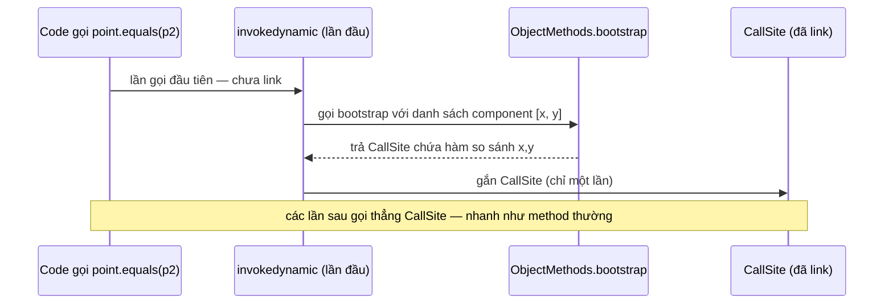
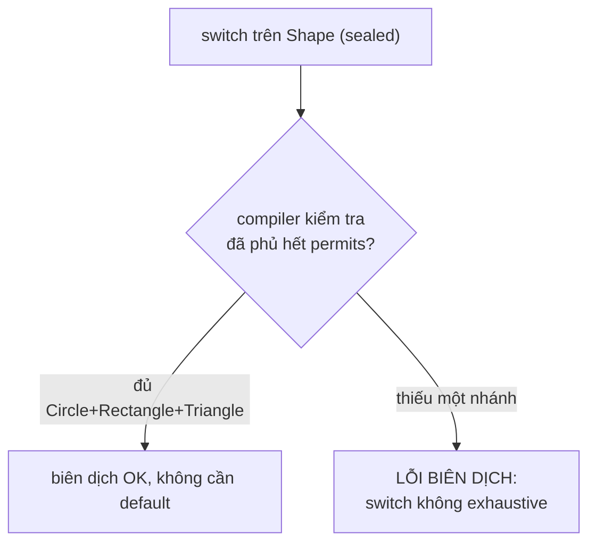

Records và sealed classes bổ sung hai công cụ để mô hình hóa dữ liệu và hệ phân cấp kiểu rõ ràng hơn. Record giảm boilerplate cho value-like data, còn sealed class giới hạn tập subtype được phép tồn tại.

## Mục lục

- [Tổng quan](#1-tổng-quan)
- [record — class dữ liệu bất biến](#2-record--class-dữ-liệu-bất-biến)
- [record sinh ra gì — đọc bytecode](#3-record-sinh-ra-gì--đọc-bytecode)
- [invokedynamic & ObjectMethods bootstrap](#4-invokedynamic--objectmethods-bootstrap)
- [Compact constructor & copy phòng thủ](#5-compact-constructor--copy-phòng-thủ)
- [Giới hạn của record — khi nào KHÔNG dùng](#6-giới-hạn-của-record--khi-nào-không-dùng)
- [sealed — kế thừa có kiểm soát](#7-sealed--kế-thừa-có-kiểm-soát)
- [PermittedSubclasses & exhaustive switch](#8-permittedsubclasses--exhaustive-switch)
- [Bộ đôi sealed + record: algebraic data type](#9-bộ-đôi-sealed--record-algebraic-data-type)
- [Anti-patterns cần tránh](#10-anti-patterns-cần-tránh)
- [Tóm tắt — Cheat sheet & nguyên tắc](#11-tóm-tắt--cheat-sheet--nguyên-tắc)

---

## 1. Tổng quan

Record tự sinh constructor, accessor, `equals()`, `hashCode()` và `toString()` dựa trên components, nhưng không làm object trở nên deep immutable. Sealed hierarchy khai báo các subtype hợp lệ qua `permits` hoặc quy tắc cùng module/package.

Kết hợp hai tính năng với pattern matching giúp biểu diễn domain đóng và xử lý đầy đủ các trường hợp ngay tại compile time.

## 2. record — class dữ liệu bất biến

`record Point(int x, int y)` khai báo các **component**. Compiler tự sinh:

| Thành phần | Sinh ra |
|-----------|---------|
| Field | `private final int x; private final int y;` |
| Canonical constructor | `Point(int x, int y)` gán mọi field |
| Accessor | `x()`, `y()` (không tiền tố `get`) |
| `equals` | so **tất cả component** theo giá trị |
| `hashCode` | tổ hợp hash mọi component |
| `toString` | `Point[x=1, y=2]` |

Đặc tính cố hữu của record:

- **`final`** ngầm (không extends được) và **mọi field `final`** → bất biến nông (shallow immutable).
- Kế thừa ngầm `java.lang.Record` (nên không extends class khác được — Java đơn kế thừa).
- **Được** `implements` interface và có method/static thêm.

```java
record Money(long cents, String currency) implements Comparable<Money> {
    public int compareTo(Money o) { return Long.compare(cents, o.cents); }
    public Money plus(Money o) { return new Money(cents + o.cents, currency); }  // trả về MỚI
    static Money zero(String cur) { return new Money(0, cur); }
}
```

---

## 3. record sinh ra gì — đọc bytecode

`javap -p Point` (sau biên dịch `record Point(int x, int y) {}`) cho thấy mọi thứ compiler đã sinh:

```text
final class Point extends java.lang.Record {
  private final int x;
  private final int y;
  Point(int, int);                       // canonical constructor
  public int x();                         // accessor
  public int y();
  public final java.lang.String toString();
  public final int hashCode();
  public final boolean equals(java.lang.Object);
  // + thuộc tính Record với danh sách component
}
```

Điều bất ngờ: thân của `equals`/`hashCode`/`toString` **không** phải bytecode tự viết tay từng phép so sánh. Chúng đều là **một lệnh `invokedynamic`** trỏ tới một **bootstrap method** chung:

```text
public final int hashCode();
  0: aload_0
  1: invokedynamic #xx, 0   // InvokeDynamic ... ObjectMethods bootstrap "hashCode"
  6: ireturn
```

> [!NOTE]
> Compiler **không** inline logic `equals`/`hashCode` vào mỗi record. Nó để lại một `invokedynamic` mà runtime sẽ "đúc" (link) một lần thành một hàm thật, dựa trên danh sách component lưu trong metadata. Điều này giữ bytecode nhỏ gọn và để JVM tự tối ưu — cùng kỹ thuật lambda dùng.

---

## 4. invokedynamic & ObjectMethods bootstrap

`invokedynamic` (indy) là lệnh "gọi mà đích được quyết định lần đầu lúc runtime" — nền tảng của lambda và record. Với record, bootstrap là `java.lang.runtime.ObjectMethods.bootstrap(...)`.



- Lần đầu chạm tới `equals`/`hashCode`/`toString`, JVM gọi bootstrap, nó dựng động một `MethodHandle` so sánh/băm **đúng các component**.
- `CallSite` được **ghi nhớ** (link) → các lần gọi sau nhanh như gọi method tĩnh, JIT inline được.

> [!TIP]
> Đây là lý do `record` vừa **gọn** (bytecode nhỏ) vừa **nhanh** (sau khi link, JIT inline). Bạn không phải đánh đổi hiệu năng để bớt boilerplate. Cùng cơ chế `invokedynamic` cũng đứng sau lambda (`LambdaMetafactory`) và string concatenation (`StringConcatFactory`) trong Java hiện đại.

---

## 5. Compact constructor & copy phòng thủ

Record cho **compact constructor** để validate/chuẩn hóa mà không cần liệt kê lại tham số:

```java
record Range(int lo, int hi) {
    Range {                              // compact: không có (int lo, int hi) và không gán this.x
        if (lo > hi) throw new IllegalArgumentException("lo > hi");
        // gán this.lo = lo; this.hi = hi; được thêm TỰ ĐỘNG ở cuối
    }
}
```

Nhưng "bất biến" của record là **nông**: nếu component là object **mutable** (vd `List`, mảng, `Date`), người ngoài vẫn sửa được nội dung. Phải **copy phòng thủ** trong compact constructor **và** accessor:

```java
record Team(String name, List<String> members) {
    Team {
        members = List.copyOf(members);          // copy phòng thủ KHI NHẬN (bản bất biến)
    }
    // Nếu chỉ copy lúc nhận mà trả về tham chiếu nội bộ vẫn an toàn vì List.copyOf bất biến.
    // Với mảng/Date mutable: phải clone cả trong accessor:
}

record Event(String title, Date when) {
    Event { when = new Date(when.getTime()); }   // copy lúc nhận
    public Date when() { return new Date(when.getTime()); }  // copy lúc trả
}
```

> [!WARNING]
> `record` chỉ làm field `final` (không gán lại được reference) — **không** làm object mà field trỏ tới bất biến. Một `record Team(String name, List<String> members)` mà nhận thẳng `List` mutable thì người gọi vẫn `members.add(...)` được sau đó. Luôn `List.copyOf`/`clone` mọi component mutable trong compact constructor. Đây chính là vấn đề "final ≠ immutable" ở [final keyword](/fundamentals/final-keyword/).

---

## 6. Giới hạn của record — khi nào KHÔNG dùng

| Giới hạn | Chi tiết |
|----------|----------|
| Không extends class | Đã ngầm extends `Record` (đơn kế thừa) |
| Bất biến nông | Component mutable vẫn sửa được nếu không copy phòng thủ |
| Mọi field phải là component | Không thêm field instance ngoài danh sách component |
| Không phù hợp entity JPA | JPA cần ctor rỗng + setter + mutable → record xung khắc |

Dùng record cho: **DTO, value object, key của Map, kết quả truy vấn, message/event bất biến, tuple trả về nhiều giá trị**. Tránh record cho: **JPA `@Entity`, object có vòng đời/định danh thay đổi, cần kế thừa class**.

> [!NOTE]
> Record là **value object** đúng nghĩa: hai record "bằng nhau nếu mọi component bằng nhau". Vì `equals`/`hashCode` chuẩn theo giá trị, record là **key của HashMap/HashSet rất tốt** (không lo quên override như class thường). Đây là một trong những ứng dụng mạnh nhất của record.

---

## 7. sealed — kế thừa có kiểm soát

`sealed` (Java 17) cho phép **giới hạn chính xác** những class nào được kế thừa — nằm giữa "mở hoàn toàn" và "`final` đóng hẳn":

```java
sealed interface Shape permits Circle, Rectangle, Triangle {}

record Circle(double r) implements Shape {}
record Rectangle(double w, double h) implements Shape {}
record Triangle(double base, double height) implements Shape {}
```

Mỗi subclass của một type `sealed` **phải** khai một trong ba:

| Modifier subclass | Ý nghĩa |
|-------------------|---------|
| `final` | đóng hẳn, không ai kế thừa tiếp (record là final sẵn) |
| `sealed` | tiếp tục giới hạn permits của riêng nó |
| `non-sealed` | "mở lại" cho phép kế thừa tự do từ điểm này |

> [!TIP]
> `sealed` trả lời câu hỏi mà `final` và `abstract` không trả lời được: *"Tôi muốn cho phép một tập **cố định, biết trước** các subclass — không hơn."* Khác `final` (cấm hết) và interface thường (mở vô hạn). Nếu subclass nằm khác file/package, dùng cùng module; thường để chung một file là gọn nhất.

---

## 8. PermittedSubclasses & exhaustive switch

Compiler ghi danh sách permits vào một thuộc tính bytecode **`PermittedSubclasses`** của class file. `javap` cho thấy:

```text
sealed interface Shape
  ...
  PermittedSubclasses:
    Circle
    Rectangle
    Triangle
```

Nhờ biết **đầy đủ** tập subclass lúc biên dịch, compiler cho phép **exhaustive switch** (pattern matching, Java 21) — **không cần `default`** vì đã phủ hết:

```java
double area(Shape s) {
    return switch (s) {                 // KHÔNG cần default — compiler biết đủ 3 nhánh
        case Circle c       -> Math.PI * c.r() * c.r();
        case Rectangle r    -> r.w() * r.h();
        case Triangle t     -> 0.5 * t.base() * t.height();
    };
}
```



> [!IMPORTANT]
> Đây là lợi ích lớn nhất của `sealed`: **an toàn lúc biên dịch khi thêm subtype**. Nếu sau này thêm `record Pentagon implements Shape`, **mọi** `switch` exhaustive không xử lý `Pentagon` sẽ **lỗi biên dịch** — compiler ép bạn cập nhật mọi nơi. Với hierarchy mở thường, bạn chỉ phát hiện thiếu nhánh lúc runtime (hoặc không bao giờ).

---

## 9. Bộ đôi sealed + record: algebraic data type

`sealed` (chọn một trong các khả năng — "OR") + `record` (gộp nhiều giá trị — "AND") cho Java khả năng mô hình hóa **kiểu dữ liệu đại số (ADT)** như ngôn ngữ hàm:

```java
sealed interface Result<T> permits Ok, Err {}
record Ok<T>(T value) implements Result<T> {}
record Err<T>(String message) implements Result<T> {}

// Xử lý vét cạn, an toàn, không null:
String render(Result<Integer> r) {
    return switch (r) {
        case Ok<Integer> ok   -> "Giá trị: " + ok.value();
        case Err<Integer> err -> "Lỗi: " + err.message();
    };
}
```

Kết hợp với **record deconstruction pattern** (Java 21) còn gọn hơn:

```java
String render(Result<Integer> r) {
    return switch (r) {
        case Ok(var v)   -> "Giá trị: " + v;       // rút v trực tiếp
        case Err(var m)  -> "Lỗi: " + m;
    };
}
```

> [!TIP]
> Mẫu `sealed interface` + các `record` cài đặt là cách hiện đại để biểu diễn "một giá trị là một trong N dạng" (Result, Either, cây cú pháp, trạng thái máy...). Nó loại bỏ `instanceof` lằng nhằng và `null`, đồng thời để compiler bảo đảm bạn xử lý mọi trường hợp. Đây là điểm hội tụ của mọi thứ trong bài: bất biến (record) + đóng (sealed) + vét cạn (switch).

---

## 10. Anti-patterns cần tránh

| Anti-pattern | Vì sao sai | Thay bằng |
|--------------|-----------|-----------|
| record nhận thẳng `List`/mảng mutable | Bất biến nông → người ngoài sửa được | `List.copyOf`/`clone` trong compact ctor |
| Dùng record làm `@Entity` JPA | JPA cần ctor rỗng + setter mutable | Class thường cho entity, record cho DTO |
| Tự viết `equals`/`hashCode` cho record | Thừa, dễ sai lệch chuẩn theo-giá-trị | Để record tự sinh |
| Dùng `default` trong switch trên sealed | Mất an toàn "thêm subtype → lỗi biên dịch" | Bỏ `default`, để switch exhaustive |
| Hierarchy nên đóng mà để mở (không sealed) | Thiếu nhánh chỉ lộ lúc runtime | `sealed` + `permits` |
| Đặt logic nghiệp vụ nặng / trạng thái vào record | record là value object bất biến | Class thường |

---

## 11. Tóm tắt — Cheat sheet & nguyên tắc

**Cỗ máy trong 6 dòng:**

```
1. record = nominal tuple bất biến: field final + ctor + accessor + equals/hashCode/toString
2. equals/hashCode/toString sinh qua invokedynamic → ObjectMethods bootstrap (gọn + nhanh)
3. record bất biến NÔNG → copy phòng thủ component mutable trong compact ctor
4. sealed + permits → giới hạn CHÍNH XÁC tập subclass (PermittedSubclasses)
5. subclass của sealed phải: final | sealed | non-sealed
6. sealed → switch EXHAUSTIVE không cần default; thêm subtype = lỗi biên dịch
```

| | record | sealed |
|---|--------|--------|
| Cho | dữ liệu bất biến (AND) | tập subtype đóng (OR) |
| Sinh/ép | equals/hashCode/toString | exhaustive switch |
| Khóa | mọi field final | cây kế thừa |

**5 nguyên tắc khắc cốt:**

1. **record cho value object/DTO/key** — không cho JPA entity hay object có trạng thái.
2. **record bất biến nông** — copy phòng thủ mọi component mutable.
3. **Đừng tự viết equals/hashCode cho record** — để compiler sinh chuẩn theo giá trị.
4. **sealed cho hierarchy đóng biết trước** — bật an toàn biên dịch khi thêm subtype.
5. **sealed + record + switch vét cạn** = mô hình dữ liệu kiểu hàm, không null, không `instanceof` rối.

> [!TIP]
> Một câu để nhớ: *record nói "dữ liệu này gồm đúng những phần này"; sealed nói "type này gồm đúng những dạng này".* Ghép lại, compiler nắm trọn hình dạng dữ liệu của bạn — và biến mọi thiếu sót thành lỗi biên dịch thay vì bug runtime.
