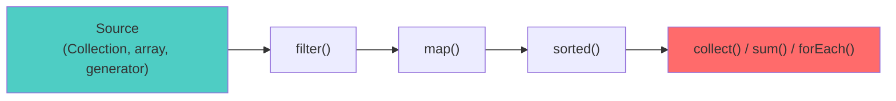
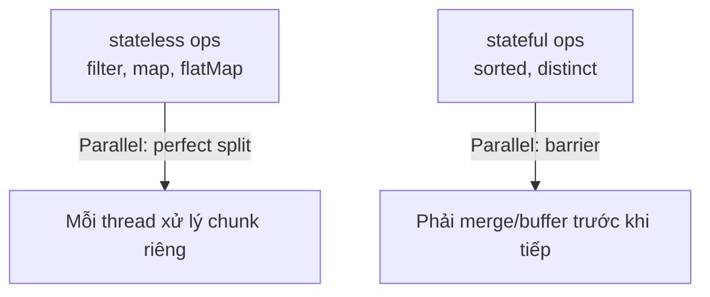
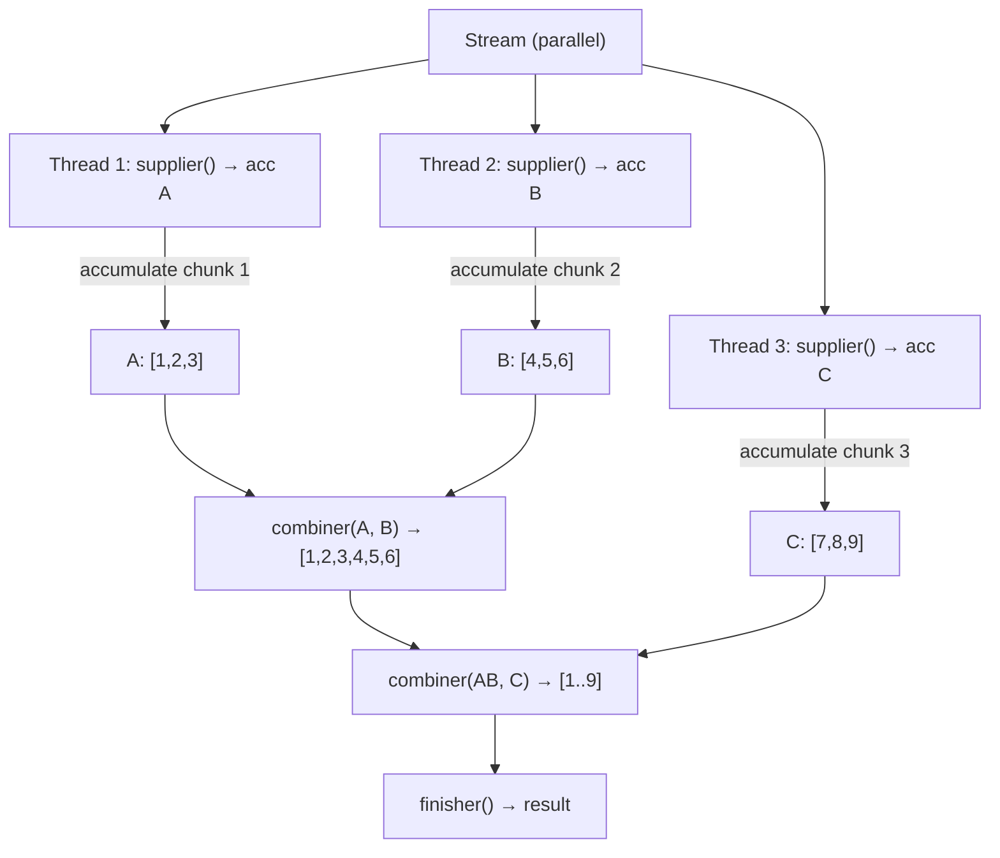

## Mục lục

- [Xử lý 10 triệu record — for loop 8s, stream 0.9s](#1-xử-lý-10-triệu-record--for-loop-8s-stream-09s)
- [Stream Pipeline Architecture — Source, Intermediate, Terminal](#2-stream-pipeline-architecture--source-intermediate-terminal)
- [Lazy Evaluation — không gì chạy cho tới terminal](#3-lazy-evaluation--không-gì-chạy-cho-tới-terminal)
- [Spliterator — nền tảng split & traverse](#4-spliterator--nền-tảng-split--traverse)
- [Intermediate Operations — stateless vs stateful](#5-intermediate-operations--stateless-vs-stateful)
- [Terminal Operations — trigger pipeline execution](#6-terminal-operations--trigger-pipeline-execution)
- [Short-circuiting — dừng sớm, không xử lý hết](#7-short-circuiting--dừng-sớm-không-xử-lý-hết)
- [Collector Internals — supplier, accumulator, combiner, finisher](#8-collector-internals--supplier-accumulator-combiner-finisher)
- [Parallel Stream — ForkJoinPool & splitting strategy](#9-parallel-stream--forkjoinpool--splitting-strategy)
- [Khi nào parallel nhanh hơn, khi nào chậm hơn](#10-khi-nào-parallel-nhanh-hơn-khi-nào-chậm-hơn)
- [Stream vs Loop — performance so sánh thực tế](#11-stream-vs-loop--performance-so-sánh-thực-tế)
- [Anti-patterns & production pitfalls](#12-anti-patterns--production-pitfalls)
- [Tóm tắt — Cheat sheet & 5 nguyên tắc](#13-tóm-tắt--cheat-sheet--5-nguyên-tắc)

---

## 1. Xử lý 10 triệu record — for loop 8s, stream 0.9s

Stream API là một **pipeline lười (lazy)** gồm source → intermediate ops → terminal op, cho phép khai báo *cái gì* thay vì *làm thế nào* và tự động song song hoá qua `parallelStream`. Nó quan trọng vì cùng bài toán xử lý 10 triệu bản ghi, code khai báo ngắn gọn mà còn **nhanh hơn** for-loop thủ công khi tận dụng được song song.

```java
long total = 0;
for (Transaction tx : transactions) {     // 10M items
    if (tx.status() == COMPLETED) {
        total += tx.amount();
    }
}
// Sequential: 1.2s
```

Với parallel stream:

```java
long total = transactions.parallelStream()
    .filter(tx -> tx.status() == COMPLETED)
    .mapToLong(Transaction::amount)
    .sum();
// Parallel (8 cores): 0.18s — 6.7x speedup
```

Nhưng câu chuyện không dừng ở đây. Dev khác viết:

```java
// ❌ parallelStream trên LinkedList + stateful operation
List<Transaction> sorted = linkedList.parallelStream()
    .filter(tx -> tx.amount() > 1000)
    .sorted()                             // stateful — phải buffer toàn bộ
    .collect(Collectors.toList());
// CHẬM HƠN sequential 3x — vì splitting LinkedList = O(n), sorted = barrier
```

> [!IMPORTANT]
> Stream API không magic. Hiệu năng phụ thuộc: **(1)** data source (array vs linked), **(2)** operation type (stateless vs stateful), **(3)** element count, **(4)** per-element cost. Doc này mổ xẻ từng yếu tố.

Phần còn lại của doc sẽ đi qua: kiến trúc pipeline Source/Intermediate/Terminal (§2) → lazy evaluation & Sink chain (§3) → Spliterator (§4) → intermediate ops stateless vs stateful (§5) → terminal ops (§6) → short-circuiting (§7) → collector internals (§8) → parallel stream & ForkJoinPool (§9) → khi nào parallel nhanh/chậm (§10) → so sánh stream vs loop (§11) → anti-patterns (§12) → cheat sheet (§13).

---

## 2. Stream Pipeline Architecture — Source, Intermediate, Terminal



| Component | Vai trò | Ví dụ |
|-----------|---------|-------|
| **Source** | Cung cấp elements | `list.stream()`, `Stream.of()`, `IntStream.range()` |
| **Intermediate** | Biến đổi stream → stream mới (lazy) | `filter`, `map`, `flatMap`, `sorted`, `distinct` |
| **Terminal** | Trigger execution, produce result | `collect`, `forEach`, `reduce`, `count`, `findFirst` |

**Đặc tính quan trọng:**
- Stream **không lưu trữ** data — nó là **pipeline** qua data source
- Stream **consumed một lần** — không thể reuse sau terminal operation
- Intermediate ops **lazy** — chỉ chạy khi terminal được gọi

---

## 3. Lazy Evaluation — không gì chạy cho tới terminal

```java
Stream<String> stream = list.stream()
    .filter(s -> {
        System.out.println("filter: " + s);  // KHÔNG in gì!
        return s.length() > 3;
    })
    .map(s -> {
        System.out.println("map: " + s);     // KHÔNG in gì!
        return s.toUpperCase();
    });
// Tới đây: CHƯA có gì chạy. Chỉ build pipeline description.

List<String> result = stream.collect(Collectors.toList());
// BÂY GIỜ mới chạy filter + map cho từng element
```

**Internal**: mỗi intermediate op tạo một **stage** (AbstractPipeline node). Các stages liên kết thành **linked list**:

```
Pipeline structure (linked list of stages):
Head → FilterOp → MapOp → [Terminal: collect]
  │        │         │
  │        │         └─ AbstractPipeline { previousStage=FilterOp, opFlags }
  │        └─ AbstractPipeline { previousStage=Head, opFlags }
  └─ AbstractPipeline { spliterator=source, sourceFlags }
```

### 3.1. Sink chain — wrapSink mechanism

Khi terminal operation trigger, JVM **wrap ngược** pipeline thành Sink chain:

```java
// Simplified terminal execution:
// 1. Wrap stages thành Sink chain (build từ cuối → đầu):
Sink<T> pipeline = terminalOp.makeSink();         // cuối
pipeline = mapStage.wrapSink(pipeline);            // map → delegate to collect
pipeline = filterStage.wrapSink(pipeline);         // filter → delegate to map

// 2. Push elements qua Sink chain:
pipeline.begin(size);
spliterator.forEachRemaining(pipeline::accept);    // source push vào filter
pipeline.end();
```

```
Sink chain (push-based):
Source.forEachRemaining(element) → Filter.accept(element)
    → if pass: Map.accept(element)
        → Collect.accept(transformed)
```

Mỗi Sink có 3 method: `begin(size)`, `accept(element)`, `end()` — cho phép short-circuit (vd `limit(5)` reject sau 5 accept) và stateful ops (vd `sorted()` buffer tất cả trong `accept`, emit trong `end`).

Terminal op **pull** element từ source qua từng stage:

```
Terminal.forEachRemaining():
    for each element from source:
        → filter stage: pass/skip
        → map stage: transform
        → collect stage: accumulate
```

**Loop fusion**: JVM xử lý **từng element qua toàn bộ pipeline** trước khi lấy element tiếp. Không tạo collection trung gian giữa các stage:

```
Element 1: source → filter ✓ → map → collect
Element 2: source → filter ✗ (skip)
Element 3: source → filter ✓ → map → collect
...
```

> [!TIP]
> Loop fusion = cache-friendly (element nóng trong L1 cache được xử lý xong trước khi chuyển sang element khác). Đây là lý do stream thường **không chậm hơn** hand-written loop dù có abstraction overhead.

---

## 4. Spliterator — nền tảng split & traverse

`Spliterator<T>` (Splittable Iterator) là abstraction cho phép stream **traverse** và **split** data source:

```java
public interface Spliterator<T> {
    boolean tryAdvance(Consumer<? super T> action);  // xử lý 1 element
    Spliterator<T> trySplit();                       // chia đôi → 2 Spliterator
    long estimateSize();                             // ước lượng số element còn lại
    int characteristics();                           // ORDERED, SIZED, SORTED, ...
}
```

### 4.1. Characteristics

| Flag | Ý nghĩa | Source có |
|------|---------|-----------|
| `SIZED` | Biết chính xác số element | ArrayList, array |
| `ORDERED` | Có thứ tự xác định | List, LinkedHashSet |
| `SORTED` | Đã sort theo comparator | TreeSet |
| `DISTINCT` | Không duplicate | Set |
| `SUBSIZED` | Mỗi split đều SIZED | ArrayList, array |
| `NONNULL` | Không có null | ConcurrentHashMap |

### 4.2. Split quality ảnh hưởng parallel performance

```
ArrayList Spliterator: split bằng cách chia index /2
→ 2 nửa bằng nhau → balanced work → parallel hiệu quả

LinkedList Spliterator: split = duyệt tới giữa (O(n))
→ split đắt + unbalanced → parallel kém
```

| Data Source | Split quality | Parallel effectiveness |
|-------------|--------------|----------------------|
| `ArrayList` / array | **Tuyệt vời** (index split) | Rất tốt |
| `IntStream.range()` | **Tuyệt vời** | Rất tốt |
| `HashSet` / `HashMap` | Tốt (bucket split) | Tốt |
| `LinkedList` | **Tệ** (O(n) traverse) | Thường chậm hơn sequential |
| `TreeSet` / `TreeMap` | Trung bình | Tốt |
| `Stream.iterate()` | **Tệ** (sequential dependency) | Không nên parallel |
| `BufferedReader.lines()` | Trung bình | Tuỳ file size |

> [!IMPORTANT]
> Parallel stream effectiveness phụ thuộc **chất lượng Spliterator.trySplit()**. Nếu source không split đều → thread bị imbalance → chậm hơn sequential. Luôn kiểm tra data source trước khi `parallelStream()`.

---

## 5. Intermediate Operations — stateless vs stateful

### 5.1. Stateless (mỗi element xử lý độc lập)

| Operation | Mô tả |
|-----------|--------|
| `filter(Predicate)` | Giữ element thoả điều kiện |
| `map(Function)` | Biến đổi element |
| `flatMap(Function)` | 1 element → nhiều elements (flatten) |
| `peek(Consumer)` | Side-effect (debug) — không đổi stream |
| `mapToInt/Long/Double` | Unbox sang primitive stream |

**Đặc điểm**: không cần biết element khác, xử lý hoàn toàn song song.

### 5.2. Stateful (cần biết/buffer nhiều element)

| Operation | Mô tả | Cost |
|-----------|--------|------|
| `sorted()` | Sort toàn bộ | O(n log n) + buffer toàn bộ |
| `distinct()` | Loại duplicate | O(n) HashSet buffer |
| `limit(n)` | Lấy n element đầu | Short-circuit nhưng cần ordering |
| `skip(n)` | Bỏ n element đầu | Phải đếm |



> [!WARNING]
> `sorted()` là **barrier** trong parallel stream: phải thu thập **toàn bộ** element trước khi sort. Nếu pipeline có `sorted()` → parallel benefit giảm đáng kể cho phần pipeline **sau** sorted (vì phải chờ barrier).

---

## 6. Terminal Operations — trigger pipeline execution

| Operation | Return | Short-circuit? |
|-----------|--------|---------------|
| `collect(Collector)` | Container (List, Map, ...) | Không |
| `reduce(identity, op)` | Single value | Không |
| `forEach(Consumer)` | void | Không |
| `count()` | long | Không* |
| `toList()` (JDK 16+) | Unmodifiable List | Không |
| `findFirst()` | Optional | **Có** |
| `findAny()` | Optional | **Có** |
| `anyMatch(Predicate)` | boolean | **Có** |
| `allMatch(Predicate)` | boolean | **Có** |
| `min()` / `max()` | Optional | Không |

*`count()` với SIZED source có thể optimize thành O(1) (JDK 9+):

```java
// JDK 9+: nếu stream chưa bị filter/flatMap → trả size trực tiếp
long n = list.stream().count();    // O(1) — không iterate
long m = list.stream().filter(x -> x > 0).count();  // O(n) — phải filter
```

---

## 7. Short-circuiting — dừng sớm, không xử lý hết

```java
Optional<String> found = hugeList.stream()   // 10M elements
    .filter(s -> s.startsWith("XYZ"))
    .findFirst();                             // dừng ngay khi tìm thấy 1 element
// Có thể chỉ xử lý 100 elements thay vì 10M
```

Short-circuit ops (`findFirst`, `findAny`, `anyMatch`, `limit`) signal upstream **"đủ rồi, dừng"**. Pipeline ngừng pull element từ source.

```
Source:     [a] [b] [c] [d] [e] [f] [g] ...
filter:      ✗   ✗   ✓   ←── pass "c" downstream
findFirst:   ←── nhận "c" → DONE. Cancel pipeline.
             (d, e, f, g... KHÔNG BAO GIỜ được xử lý)
```

**Parallel + short-circuit**: `findAny` hiệu quả hơn `findFirst` trong parallel vì không cần maintain ordering — thread nào tìm thấy đầu tiên thì dùng.

---

## 8. Collector Internals — supplier, accumulator, combiner, finisher

`Collector<T, A, R>` định nghĩa **cách** thu thập stream elements vào container:

```java
public interface Collector<T, A, R> {
    Supplier<A> supplier();            // tạo container mới (vd: new ArrayList<>())
    BiConsumer<A, T> accumulator();    // thêm 1 element vào container
    BinaryOperator<A> combiner();     // merge 2 container (parallel)
    Function<A, R> finisher();         // biến đổi cuối (A → R)
    Set<Characteristics> characteristics(); // CONCURRENT, UNORDERED, IDENTITY_FINISH
}
```

### 8.1. Ví dụ: Collectors.toList()

```java
Collector.of(
    ArrayList::new,              // supplier: tạo ArrayList mới
    ArrayList::add,             // accumulator: add element
    (left, right) -> {          // combiner: merge 2 list (parallel)
        left.addAll(right);
        return left;
    }
    // finisher: identity (ArrayList là List rồi)
);
```

### 8.2. Parallel collector flow



### 8.3. Custom Collector ví dụ: group by + stats

```java
// Tính average amount per status
Map<Status, Double> avgByStatus = transactions.stream()
    .collect(Collectors.groupingBy(
        Transaction::status,
        Collectors.averagingLong(Transaction::amount)
    ));

// Custom: collect vào StringBuilder (nhanh hơn Collectors.joining cho large stream)
Collector<String, StringBuilder, String> fastJoin = Collector.of(
    StringBuilder::new,
    (sb, s) -> sb.append(s).append(","),
    StringBuilder::append,
    sb -> sb.length() > 0 ? sb.substring(0, sb.length()-1) : ""
);
```

---

## 9. Parallel Stream — ForkJoinPool & splitting strategy

### 9.1. Execution model

Parallel stream mặc định chạy trên **`ForkJoinPool.commonPool()`** (size = CPU cores - 1):

```java
// Mặc định: commonPool
list.parallelStream().forEach(this::process);

// Custom pool (nếu cần isolate):
ForkJoinPool custom = new ForkJoinPool(16);
custom.submit(() -> 
    list.parallelStream().forEach(this::process)
).join();
```

### 9.2. Fork-Join splitting

```
1. Spliterator.trySplit() chia data làm đôi
2. Một nửa fork cho thread khác, nửa còn lại xử lý local
3. Lặp lại đến khi chunk đủ nhỏ (threshold)
4. Kết quả merge ngược lên (join)

         [1, 2, 3, 4, 5, 6, 7, 8]
              trySplit()
        /                    \
   [1,2,3,4]            [5,6,7,8]
   trySplit()            trySplit()
   /       \             /       \
[1,2]    [3,4]       [5,6]    [7,8]
  ↓        ↓           ↓        ↓
process  process    process  process
  ↓        ↓           ↓        ↓
merge ←──merge     merge ←──merge
       ↓                    ↓
       merge ←─────────── merge
              ↓
           final result
```

### 9.3. N-Q model (khi nào parallel đáng)

**N** = số elements, **Q** = cost per element

Parallel có lợi khi **N × Q** đủ lớn để bù overhead (fork/join/merge + thread communication):

| N | Q (per-element cost) | Parallel? |
|---|---------------------|-----------|
| 10.000+ | Cao (I/O, computation) | **Có** |
| 10.000+ | Thấp (simple compare) | Tuỳ (benchmark) |
| < 1.000 | Bất kỳ | **Không** (overhead > benefit) |
| 1M+ | Trung bình+ | **Gần như luôn** |

---

## 10. Khi nào parallel nhanh hơn, khi nào chậm hơn

### 10.1. Parallel nhanh hơn ✓

```java
// ✓ ArrayList (tốt split) + stateless ops + expensive per-element
List<Result> results = largeArrayList.parallelStream()   // 1M+ elements
    .filter(item -> item.isValid())                       // stateless
    .map(item -> expensiveComputation(item))              // CPU-heavy per element
    .collect(Collectors.toList());
```

### 10.2. Parallel chậm hơn ✗

```java
// ✗ LinkedList + sorted (barrier) + small data
linkedList.parallelStream()        // split = O(n), unbalanced
    .sorted()                      // barrier — phải buffer all
    .limit(10)                     // ordering constraint
    .collect(Collectors.toList());
```

### 10.3. Decision checklist

| Yếu tố | Parallel tốt | Parallel tệ |
|---------|-------------|-------------|
| Data source | ArrayList, array, IntStream.range | LinkedList, Stream.iterate |
| Operations | filter, map (stateless) | sorted, distinct (stateful) |
| Per-element cost | Cao (computation, I/O) | Thấp (simple getter) |
| Element count | > 10.000 | < 1.000 |
| Shared mutable state | Không | Có (synchronization) |
| Downstream collector | toList, groupingBy | toMap (merge conflict) |

> [!IMPORTANT]
> **Đo trước, parallel sau.** Đừng bao giờ thêm `.parallel()` vì "chắc sẽ nhanh hơn". JMH benchmark là cách duy nhất xác nhận. Parallel có overhead cố định — data nhỏ hoặc pipeline đơn giản → sequential nhanh hơn.

---

## 11. Stream vs Loop — performance so sánh thực tế

```text
JMH Benchmark (JDK 17, 1M integers, sum of squares of even numbers):

Benchmark                    Mode  Cnt    Score    Error  Units
forLoop                      avgt    5    2.31 ±  0.05   ms/op
streamSequential             avgt    5    2.45 ±  0.08   ms/op   (~6% slower)
streamParallel (8 cores)     avgt    5    0.41 ±  0.02   ms/op   (~5.6x faster)
```

**Sequential stream vs loop**: thường **~5-15% overhead** (auto-boxing, method call overhead, pipeline setup). JIT có thể close gap.

**Khi nào stream chậm hơn đáng kể?**
- **Primitive boxing**: `Stream<Integer>` vs `IntStream` — boxing/unboxing mỗi element
- **Small N**: pipeline setup overhead > computation
- **Heavy allocation**: `map()` tạo object mới mỗi element → GC pressure

```java
// ❌ Chậm: boxing Integer
int sum = list.stream()
    .map(x -> x * x)           // Integer → int → compute → Integer (boxing)
    .reduce(0, Integer::sum);

// ✅ Nhanh: primitive stream, no boxing
int sum = list.stream()
    .mapToInt(x -> x * x)      // int → int (no boxing)
    .sum();
```

---

## 12. Anti-patterns & production pitfalls

| Anti-pattern | Vì sao sai | Giải pháp |
|--------------|-----------|-----------|
| `parallelStream()` trên LinkedList | Split O(n), unbalanced | Dùng ArrayList hoặc sequential |
| Side-effect trong stream (modify shared state) | Race condition, unpredictable | `collect()` hoặc `reduce()` |
| `stream().forEach()` thay for-loop (no benefit) | Overhead, less readable | Plain for-loop |
| `.parallel()` cho < 1000 elements | Overhead > benefit | Sequential |
| `sorted()` rồi `findFirst()` | Sort toàn bộ chỉ để lấy min | `min(comparator)` |
| Stream reuse | `IllegalStateException` | Tạo stream mới mỗi lần |
| `peek()` cho business logic | Không đảm bảo chạy (lazy, short-circuit) | Dùng `map()` hoặc loop |
| `collect(toMap(...))` với duplicate key | `IllegalStateException` | Cung cấp merge function |

**Modify shared state trong stream:**

```java
// ❌ Race condition:
List<String> results = new ArrayList<>();  // shared mutable
list.parallelStream().forEach(item -> {
    results.add(process(item));            // concurrent add → ArrayIndexOutOfBounds
});

// ✅ Thread-safe collection:
List<String> results = list.parallelStream()
    .map(this::process)
    .collect(Collectors.toList());         // combiner merge safely
```

> [!WARNING]
> Stream API thiết kế cho **stateless, side-effect-free** operations. Hễ bạn thấy mình modify biến ngoài lambda → đang dùng sai tool. Dùng `collect`/`reduce` để accumulate results.

---

## 13. Tóm tắt — Cheat sheet & 5 nguyên tắc

**Cỗ máy trong 6 dòng:**

```
1. Stream = lazy pipeline: Source → Intermediate ops → Terminal op
2. Không gì chạy cho đến terminal op được gọi (lazy evaluation)
3. Loop fusion: mỗi element đi qua toàn bộ pipeline — không tạo collection trung gian
4. Parallel: Spliterator.trySplit() → ForkJoinPool → merge
5. Stateful ops (sorted, distinct) = barrier trong parallel — giảm benefit
6. N × Q phải đủ lớn để parallel bù overhead. Đo bằng JMH.
```

| Scenario | Dùng |
|----------|------|
| Transform collection → collection | `stream().map().collect()` |
| Filter + aggregate | `stream().filter().reduce()` |
| CPU-heavy trên large data | `parallelStream()` + ArrayList |
| Simple iteration, < 100 elements | Plain for-loop |
| Cần index hoặc break/continue | For-loop (stream không hỗ trợ) |

**5 nguyên tắc khắc cốt:**

1. **Lazy = miễn phí build pipeline** — chỉ tốn khi terminal chạy. Đừng sợ chain dài.
2. **Primitive stream** (`IntStream`, `LongStream`) — tránh boxing cho number-heavy code.
3. **Parallel ≠ magic** — đo bằng JMH, chỉ dùng khi N×Q lớn + source split tốt.
4. **Stateless > Stateful** — đặt `filter` trước `sorted` để giảm data qua barrier.
5. **Collect, don't mutate** — stream dành cho functional style. Side-effect = bug.

> [!TIP]
> Một câu để nhớ: *Stream nhanh vì lazy (không làm thừa) và fused (không allocate thừa). Parallel nhanh khi data lớn + source split đều + ops stateless. Violate bất kỳ điều kiện nào → chậm hơn for-loop.*
