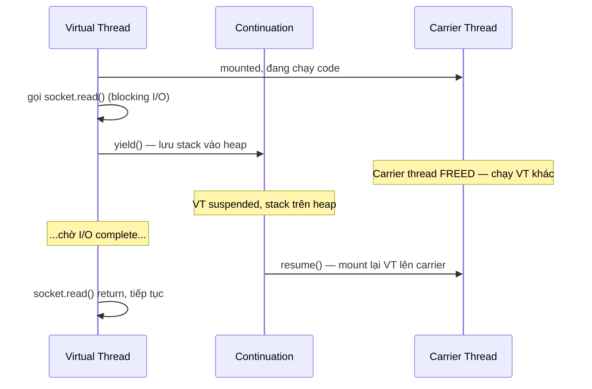
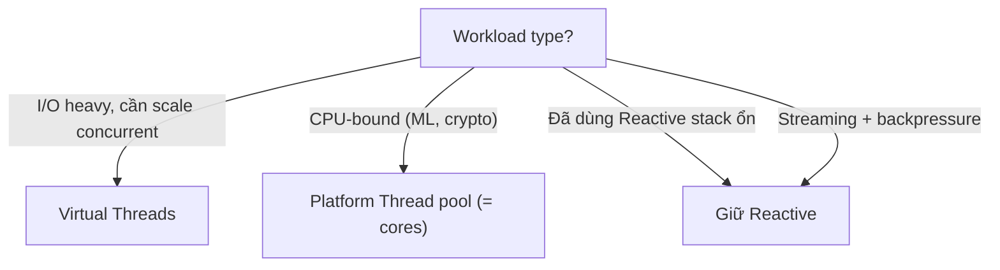

## Mục lục

- [Bối cảnh: 10.000 concurrent requests — nhưng chỉ 200 thread](#1-bối-cảnh-10000-concurrent-requests--nhưng-chỉ-200-thread)
- [Platform Thread vs Virtual Thread — kiến trúc cơ bản](#2-platform-thread-vs-virtual-thread--kiến-trúc-cơ-bản)
- [Continuation — trái tim của Virtual Thread](#3-continuation--trái-tim-của-virtual-thread)
- [Scheduler — ForkJoinPool và work-stealing](#4-scheduler--forkjoinpool-và-work-stealing)
- [Mount/Unmount — virtual thread nhảy giữa carrier](#5-mountunmount--virtual-thread-nhảy-giữa-carrier)
- [Pinning — khi virtual thread bị ghim vào carrier](#6-pinning--khi-virtual-thread-bị-ghim-vào-carrier)
- [Memory footprint — từ 1MB xuống 1KB](#7-memory-footprint--từ-1mb-xuống-1kb)
- [API thực hành — tạo và quản lý virtual thread](#8-api-thực-hành--tạo-và-quản-lý-virtual-thread)
- [Structured Concurrency (JDK 21 Preview)](#9-structured-concurrency-jdk-21-preview)
- [Scoped Values — thay thế ThreadLocal](#10-scoped-values--thay-thế-threadlocal)
- [Migration: thread pool → virtual thread](#11-migration-thread-pool--virtual-thread)
- [So sánh: Virtual Thread vs Platform Thread vs Reactive](#12-so-sánh-virtual-thread-vs-platform-thread-vs-reactive)
- [Anti-patterns & production pitfalls](#13-anti-patterns--production-pitfalls)
- [Tóm tắt — Cheat sheet & 5 nguyên tắc](#14-tóm-tắt--cheat-sheet--5-nguyên-tắc)

---

## 1. Bối cảnh: 10.000 concurrent requests — nhưng chỉ 200 thread

Bạn xây API gateway xử lý 10.000 request đồng thời. Mỗi request gọi downstream service, chờ ~100ms response. Mô hình cổ điển: **1 thread / request**.

```java
ExecutorService pool = Executors.newFixedThreadPool(200);

for (Request req : incoming) {    // 10.000 request
    pool.submit(() -> {
        Response resp = httpClient.send(req);  // block 100ms
        return process(resp);
    });
}
```

**Vấn đề**: pool chỉ có 200 thread. 10.000 request → 9.800 request **xếp hàng** chờ thread rảnh. Latency p99 tăng vọt.

Tăng pool lên 10.000? Mỗi platform thread tốn **~1MB stack** + OS scheduling overhead:
- 10.000 thread × 1MB = **10GB RAM** chỉ cho stack
- OS context switch giữa 10.000 thread → scheduler thrashing

Dùng **Virtual Threads** (JDK 21+):

```java
try (var executor = Executors.newVirtualThreadPerTaskExecutor()) {
    for (Request req : incoming) {
        executor.submit(() -> {
            Response resp = httpClient.send(req);  // block 100ms — nhưng VT unmount!
            return process(resp);
        });
    }
}
```

Kết quả: **10.000 virtual threads đồng thời**, chỉ dùng **~16 carrier threads** (= CPU cores). Memory: ~10.000 × **~1KB** = **10MB** (thay vì 10GB).

```text
Benchmark (10.000 concurrent I/O tasks, 100ms each)
Platform thread pool (200):   p99 = 5,200ms   (queueing)
Platform thread pool (10000): p99 = 120ms      (10GB RAM, OS thrash)
Virtual threads:              p99 = 105ms      (10MB RAM, smooth)
```

> [!IMPORTANT]
> Virtual threads không nhanh hơn platform threads trên CPU-bound work. Chúng nhanh hơn vì **không lãng phí thread khi I/O block** — cho phép scale tới hàng triệu concurrent task mà không tốn RAM hay OS resources.

---

## 2. Platform Thread vs Virtual Thread — kiến trúc cơ bản

### 2.1. Platform Thread (trước JDK 21)

```
Java Platform Thread = thin wrapper quanh OS thread (1:1 mapping)

┌──────────────┐     ┌──────────────┐
│ Java Thread  │ ──► │  OS Thread   │ ──► scheduled by OS kernel
│  (1MB stack) │     │ (kernel obj) │
└──────────────┘     └──────────────┘
```

- Tạo/destroy đắt (~1ms + syscall)
- Stack cố định ~1MB (hoặc `-Xss`)
- OS scheduler quản lý → context switch ~1-10μs
- Giới hạn thực tế: **vài nghìn** thread/JVM

### 2.2. Virtual Thread (JDK 21+)

```
Virtual Thread = lightweight, JVM-managed, multiplexed trên carrier threads

┌──────────┐  ┌──────────┐  ┌──────────┐       ┌──────────┐
│  VT #1   │  │  VT #2   │  │  VT #3   │  ...  │ VT #1M   │
└────┬─────┘  └────┬─────┘  └────┬─────┘       └────┬─────┘
     │              │              │                   │
     └──────────────┼──────────────┘                   │
                    ▼                                   │
         ┌───────────────────┐                         │
         │  Carrier Thread   │ (= platform thread)     │
         │  (ForkJoinPool)   │ ◄─────────────────────────┘
         └───────────────────┘
         ~N carriers (N ≈ CPU cores)
```

- Tạo cực rẻ (~1μs, no syscall)
- Stack **grows/shrinks** dynamically (bắt đầu ~1KB)
- JVM scheduler quản lý (ForkJoinPool)
- Giới hạn: **hàng triệu** virtual threads/JVM

---

## 3. Continuation — trái tim của Virtual Thread

**Continuation** = khả năng **tạm dừng** execution tại một điểm và **resume** lại sau đó, giữ nguyên toàn bộ call stack.



**Cơ chế**:
1. VT gặp blocking operation (I/O, sleep, lock)
2. JVM **yield** continuation: copy stack frame từ **carrier thread stack** lên **heap** (object array)
3. Carrier thread **freed** — nhận VT khác để chạy
4. Khi I/O sẵn sàng → JVM **resume** continuation: copy stack từ heap về carrier thread stack mới
5. VT tiếp tục chạy — **không biết** đã bị unmount

> [!IMPORTANT]
> Từ góc nhìn code, blocking call vẫn "block" (API không đổi). Nhưng bên dưới, chỉ **virtual thread** bị suspend — **carrier thread** (OS thread thật) được giải phóng để chạy task khác. Đây là "blocking without wasting OS thread".

---

## 4. Scheduler — ForkJoinPool và work-stealing

Virtual threads được schedule bởi **dedicated ForkJoinPool** (không phải `commonPool()`):

```java
// Mặc định: N carrier threads = Runtime.getRuntime().availableProcessors()
// Có thể set: -Djdk.virtualThreadScheduler.parallelism=32
```

```
ForkJoinPool (Virtual Thread Scheduler):
┌─────────────────────────────────────────────────┐
│  Worker 0: [VT-5] [VT-12] [VT-100]  ← queue    │
│  Worker 1: [VT-3] [VT-7]                        │
│  Worker 2: [VT-1] [VT-8] [VT-50] [VT-200]      │
│  Worker 3: []  ← rảnh → steal từ Worker 2       │
└─────────────────────────────────────────────────┘
```

**Work-stealing**: worker thread rảnh **lấy task** từ queue của worker bận → đảm bảo CPU utilization đều. Khi VT yield (blocking I/O) → carrier check queue → chạy VT tiếp theo **ngay lập tức** — không cần context switch OS.

---

## 5. Mount/Unmount — virtual thread nhảy giữa carrier

```
Timeline (2 carriers, 5 virtual threads):

Carrier-0:  [VT-1 ████|yield]  [VT-3 ██|yield]  [VT-1 resume ███]
Carrier-1:  [VT-2 █████|yield]  [VT-4 █|yield]  [VT-5 ████████]

VT-1: mount C0 → run → I/O → unmount C0 → (waiting) → mount C0 → run → done
VT-2: mount C1 → run → I/O → unmount C1 → (waiting) → ???
```

**Mount**: VT gắn vào carrier, continuation stack load lên thread stack, VT chạy.
**Unmount**: VT yield, stack lưu vào heap, carrier freed.

Một VT có thể mount lên **carrier khác** mỗi lần resume — không cố định. Điều này giống goroutine/coroutine trong Go/Kotlin.

---

## 6. Pinning — khi virtual thread bị ghim vào carrier

**Pinning** = VT **không thể unmount** khỏi carrier, ghim cứng carrier thread → carrier không phục vụ VT khác → giảm throughput.

### 6.1. Khi nào pinning xảy ra?

| Tình huống | Lý do |
|-----------|-------|
| **`synchronized` block/method** đang hold lock | JVM không thể unmount khi frame có monitor — object monitor gắn với OS thread |
| **Native method** (JNI) đang chạy | JNI frame không thể copy lên heap |
| **Class initializer** (`<clinit>`) | Spec yêu cầu hold initialization lock |

### 6.2. Tại sao synchronized gây pinning?

`synchronized` sử dụng **object monitor** — gắn chặt với OS thread (vì monitor owner = OS thread ID). Khi VT trong synchronized block gặp I/O:

```java
synchronized (lock) {          // VT acquire monitor → pinned to carrier
    var data = socket.read();  // I/O block — nhưng không thể unmount!
    process(data);             // carrier bị ghim suốt thời gian I/O
}                              // release monitor → unpin
```

Carrier bị ghim → 1 carrier ít hơn cho scheduler → throughput giảm nếu nhiều VT bị pin cùng lúc.

### 6.3. Giải pháp

```java
// ❌ Pinning:
synchronized (lock) { blockingIO(); }

// ✅ Không pinning — dùng ReentrantLock:
private final ReentrantLock lock = new ReentrantLock();
lock.lock();
try { blockingIO(); }
finally { lock.unlock(); }
```

`ReentrantLock` được **cập nhật** trong JDK 21 để hỗ trợ VT unmount khi chờ `lock()` — không ghim carrier.

> [!TIP]
> Phát hiện pinning: `-Djdk.tracePinnedThreads=full` in stack trace mỗi khi VT bị pin. Hoặc dùng JFR event `jdk.VirtualThreadPinned`.

---

## 7. Memory footprint — từ 1MB xuống 1KB

| Metric | Platform Thread | Virtual Thread |
|--------|----------------|----------------|
| Initial stack | **1MB** (fixed, `-Xss`) | **~1KB** (grows on demand) |
| Max stack | 1MB | Heap-bounded |
| OS resources | Kernel thread object | **Không** |
| Create time | ~1ms (syscall) | ~1μs (heap alloc) |
| 10.000 threads memory | **~10GB** | **~10-50MB** |
| 1.000.000 threads memory | **Bất khả** (OS limit) | **~1-5GB** |

Virtual thread stack **grow dynamically**: mỗi frame method = 1 object trên heap. Stack chỉ lớn bằng **call depth thực tế** — method nông = stack nhỏ.

```java
// Test: tạo 1 triệu virtual threads
long start = System.nanoTime();
List<Thread> threads = new ArrayList<>();
for (int i = 0; i < 1_000_000; i++) {
    threads.add(Thread.ofVirtual().start(() -> {
        try { Thread.sleep(Duration.ofSeconds(10)); }
        catch (InterruptedException e) {}
    }));
}
// ~2 giây tạo 1M threads, ~2GB heap
```

> [!NOTE]
> Vì stack trên heap → stack frames chịu GC pressure. Deep call stack (100+ frames) trên triệu VT sẽ tạo nhiều object → GC overhead. Trong thực tế, I/O-heavy code hiếm khi có stack quá deep.

---

## 8. API thực hành — tạo và quản lý virtual thread

### 8.1. Tạo virtual thread

```java
// Cách 1: Thread.ofVirtual()
Thread vt = Thread.ofVirtual()
    .name("worker-", 0)         // prefix + counter: worker-0, worker-1, ...
    .start(() -> doWork());

// Cách 2: Executors (recommended cho production)
try (var executor = Executors.newVirtualThreadPerTaskExecutor()) {
    Future<String> f = executor.submit(() -> fetchData());
    // mỗi submit() tạo 1 virtual thread mới — KHÔNG pooling
}

// Cách 3: Thread.startVirtualThread (simple)
Thread.startVirtualThread(() -> doWork());
```

### 8.2. Nhận diện virtual thread

```java
Thread.currentThread().isVirtual();     // true nếu đang chạy trên VT
Thread.currentThread().threadId();       // unique ID (long)
```

### 8.3. Không cần pooling!

```java
// ❌ SAI: pool virtual threads (vô nghĩa)
ExecutorService pool = Executors.newFixedThreadPool(100, Thread.ofVirtual().factory());

// ✅ ĐÚNG: tạo mới mỗi task — rẻ, không cần pool
ExecutorService exec = Executors.newVirtualThreadPerTaskExecutor();
```

> [!IMPORTANT]
> Virtual thread **không cần pool**. Tạo mới cực rẻ (~1μs). Pooling VT chỉ **giới hạn concurrency** mà không mang lại lợi ích — ngược lại mục đích. Tạo thoải mái, để JVM quản lý.

---

## 9. Structured Concurrency (JDK 21 Preview)

### 9.1. Vấn đề: "fire and forget" concurrency

```java
// Unstructured: task con chạy độc lập, khó cancel, khó propagate error
ExecutorService exec = Executors.newVirtualThreadPerTaskExecutor();
Future<User> user = exec.submit(() -> fetchUser(id));
Future<Order> order = exec.submit(() -> fetchOrder(id));
// Nếu fetchUser fail → fetchOrder vẫn chạy lãng phí
// Nếu parent bị cancel → con không tự cancel
```

### 9.2. StructuredTaskScope

```java
try (var scope = new StructuredTaskScope.ShutdownOnFailure()) {
    Subtask<User> user = scope.fork(() -> fetchUser(id));
    Subtask<Order> order = scope.fork(() -> fetchOrder(id));

    scope.join();              // chờ tất cả hoàn thành
    scope.throwIfFailed();     // nếu bất kỳ task fail → throw

    return new Response(user.get(), order.get());
}
// Khi 1 task fail → ShutdownOnFailure cancel tất cả task còn lại
// Khi scope close → mọi subtask CHẮC CHẮN đã kết thúc
```

### 9.3. Policies

| Policy | Hành vi |
|--------|---------|
| `ShutdownOnFailure` | Bất kỳ task fail → cancel tất cả, throw first exception |
| `ShutdownOnSuccess` | Task đầu tiên thành công → cancel còn lại, dùng kết quả đó |

```java
// Race: dùng kết quả từ server nhanh nhất
try (var scope = new StructuredTaskScope.ShutdownOnSuccess<String>()) {
    scope.fork(() -> fetchFromServerA());
    scope.fork(() -> fetchFromServerB());
    scope.fork(() -> fetchFromServerC());

    scope.join();
    return scope.result();    // kết quả từ server trả về đầu tiên
}
```

> [!TIP]
> Structured Concurrency đảm bảo: **(1)** lifetime subtask ≤ lifetime scope (không leak thread), **(2)** error propagation tự động, **(3)** cancellation cascading. Giống try-with-resources cho concurrency.

---

## 10. Scoped Values — thay thế ThreadLocal

### 10.1. Vấn đề với ThreadLocal + Virtual Threads

```java
static final ThreadLocal<User> CURRENT_USER = new ThreadLocal<>();

// Platform thread: 200 threads × 1 ThreadLocal = 200 entries → OK
// Virtual thread: 1M threads × 1 ThreadLocal = 1M entries → memory explosion!
```

`ThreadLocal` mutable, inherit bằng copy (`InheritableThreadLocal`) → triệu VT = triệu copy.

### 10.2. ScopedValue (JDK 21 Preview)

```java
static final ScopedValue<User> CURRENT_USER = ScopedValue.newInstance();

ScopedValue.where(CURRENT_USER, authenticatedUser).run(() -> {
    // trong scope này: CURRENT_USER.get() = authenticatedUser
    handleRequest();
    // child virtual threads (structured concurrency) cũng thấy giá trị này
});
// ngoài scope: CURRENT_USER.get() → NoSuchElementException
```

| Tiêu chí | `ThreadLocal` | `ScopedValue` |
|----------|--------------|---------------|
| Mutability | Mutable (`set()` bất kỳ lúc nào) | **Immutable** trong scope |
| Inheritance | Copy toàn bộ giá trị | **Zero-copy** (shared reference) |
| Lifetime | Tồn tại vĩnh viễn (nếu thread sống) | **Bounded** bởi scope |
| Memory (1M VTs) | 1M copies | **1 shared reference** |

---

## 11. Migration: thread pool → virtual thread

### 11.1. Spring Boot (3.2+)

```properties
# application.properties
spring.threads.virtual.enabled=true
```

Spring Boot tự chuyển Tomcat/Jetty handler threads sang virtual threads — **mỗi request 1 VT**, không pool cố định.

### 11.2. Checklist migration

| Step | Hành động |
|------|----------|
| 1 | Upgrade JDK ≥ 21 |
| 2 | Thay `synchronized` + I/O bên trong → `ReentrantLock` (tránh pinning) |
| 3 | Audit `ThreadLocal` → chuyển sang `ScopedValue` nếu có thể |
| 4 | Thay `Executors.newFixedThreadPool(N)` → `newVirtualThreadPerTaskExecutor()` |
| 5 | Xoá bỏ reactive/async callback code nếu chỉ dùng cho concurrency (WebFlux → MVC + VT) |
| 6 | Test với `-Djdk.tracePinnedThreads=full` để phát hiện pinning |
| 7 | Monitor: JFR events `jdk.VirtualThread*` |

### 11.3. Không migrate cái gì?

- **CPU-bound computation** — VT không giúp ích (chỉ N carrier = N cores)
- **Code đã reactive** ổn định — nếu đang dùng WebFlux/R2DBC tốt rồi thì không cần đổi
- **Library dùng `synchronized` nội bộ** (JDBC driver cũ, OkHttp < 5) — chờ library update

---

## 12. So sánh: Virtual Thread vs Platform Thread vs Reactive

| Tiêu chí | Platform Thread | Virtual Thread | Reactive (WebFlux) |
|----------|----------------|----------------|-------------------|
| Concurrency model | 1 thread/task | 1 VT/task (**M:N**) | Event loop + callback |
| Max concurrent tasks | ~5.000 (RAM limit) | **~1.000.000+** | ~1.000.000+ |
| Code style | **Blocking** (simple) | **Blocking** (simple) | Non-blocking (complex) |
| Debugging | Easy (stack trace) | Easy (stack trace) | **Khó** (callback chain) |
| I/O wait cost | **1 OS thread blocked** | ~1KB heap | ~0 (non-blocking I/O) |
| CPU-bound | Full utilization | = platform thread | Tốt (nhưng phức tạp) |
| Learning curve | Thấp | **Thấp** | Cao (Mono/Flux/backpressure) |
| Throughput overhead | Thread creation | ~0 | Callback/allocation |



> [!TIP]
> Virtual Threads = "viết code blocking đơn giản, được throughput của reactive". Đây là lý do Java community gọi nó là **"the end of reactive for I/O concurrency"** — không cần callback hell nữa.

---

## 13. Anti-patterns & production pitfalls

| Anti-pattern | Vì sao sai | Giải pháp |
|--------------|-----------|-----------|
| Pool virtual threads (FixedThreadPool + VT factory) | Giới hạn vô nghĩa, mất ý nghĩa scalability | `newVirtualThreadPerTaskExecutor()` |
| `synchronized` + blocking I/O bên trong | Pinning carrier thread | `ReentrantLock` |
| ThreadLocal với triệu VT | Memory explosion (1 copy/VT) | `ScopedValue` |
| CPU-bound loop trên VT | Carrier bị chiếm, VT khác starve | Dùng platform thread cho CPU work |
| Dùng VT cho `Thread.sleep()` thay cho scheduling | Tạo VT chỉ để sleep → lãng phí | `ScheduledExecutorService` |
| Assume thread count = concurrency limit | VT count không nên dùng để rate-limit | Dùng `Semaphore` cho rate limit |

**Rate limiting đúng cách:**

```java
// ❌ Sai: dựa vào thread pool size để limit concurrent calls
ExecutorService pool = Executors.newFixedThreadPool(100); // ← giới hạn nhân tạo

// ✅ Đúng: Semaphore cho explicit rate limit
Semaphore permits = new Semaphore(100); // max 100 concurrent DB calls

try (var exec = Executors.newVirtualThreadPerTaskExecutor()) {
    for (var req : requests) {
        exec.submit(() -> {
            permits.acquire();       // VT-friendly — unmount khi chờ
            try { return callDB(req); }
            finally { permits.release(); }
        });
    }
}
```

> [!WARNING]
> Virtual Threads scale concurrency **không giới hạn** — nhưng downstream systems (DB, API) có limit. PHẢI dùng `Semaphore` hoặc bulkhead pattern để bảo vệ downstream, không dựa vào thread pool size.

---

## 14. Tóm tắt — Cheat sheet & 5 nguyên tắc

**Cỗ máy trong 6 dòng:**

```
1. Virtual Thread = lightweight thread, stack trên heap (~1KB), JVM-scheduled
2. Blocking I/O → VT unmount khỏi carrier → carrier freed → chạy VT khác
3. Carrier thread = ForkJoinPool (≈ CPU cores), work-stealing
4. Pinning: synchronized + I/O → VT ghim carrier. Fix: dùng ReentrantLock
5. Structured Concurrency: scope đảm bảo lifetime + cancellation + error propagation
6. Không pool VT. Tạo mới mỗi task. Rate-limit bằng Semaphore.
```

| Khi nào dùng | Chọn |
|-------------|------|
| I/O-heavy service (web, API, microservice) | **Virtual Thread** |
| CPU-bound computation (ML, encoding) | Platform Thread pool (= cores) |
| Streaming + backpressure cần thiết | Reactive (WebFlux) |
| Đã có reactive stack ổn định | Giữ reactive |

**5 nguyên tắc khắc cốt:**

1. **1 VT / task** — đừng pool, đừng giới hạn. Để JVM schedule.
2. **Blocking is OK** — VT biến blocking thành cheap. Viết code đồng bộ đơn giản.
3. **synchronized → ReentrantLock** — tránh pinning, đặc biệt quanh I/O.
4. **Semaphore cho rate-limit** — VT scale vô hạn, downstream thì không.
5. **ThreadLocal → ScopedValue** — immutable, zero-copy, bounded lifetime.

> [!TIP]
> Một câu để nhớ: *Virtual Thread cho bạn viết code blocking đơn giản như single-thread, nhưng scale như reactive — bằng cách biến mỗi blocking I/O thành "unmount & yield" thay vì "chiếm cứng OS thread". Triệu task, vài carrier.*
