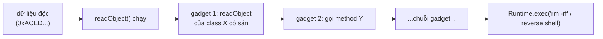

## Mục lục

- [Thêm một field, cả hệ thống không đọc được dữ liệu cũ](#1-thêm-một-field-cả-hệ-thống-không-đọc-được-dữ-liệu-cũ)
- [Cơ chế: Serializable, ObjectOutputStream & wire format](#2-cơ-chế-serializable-objectoutputstream--wire-format)
- [serialVersionUID — hợp đồng phiên bản](#3-serialversionuid--hợp-đồng-phiên-bản)
- [transient & static — cái gì KHÔNG được ghi](#4-transient--static--cái-gì-không-được-ghi)
- [Tùy biến: writeObject / readObject / readResolve](#5-tùy-biến-writeobject--readobject--readresolve)
- [Object graph, reference dùng chung & vòng lặp](#6-object-graph-reference-dùng-chung--vòng-lặp)
- [Deserialization là lỗ hổng bảo mật — gadget chain](#7-deserialization-là-lỗ-hổng-bảo-mật--gadget-chain)
- [Phòng thủ: ObjectInputFilter & tránh hoàn toàn](#8-phòng-thủ-objectinputfilter--tránh-hoàn-toàn)
- [Vì sao nên dùng JSON / Protobuf thay thế](#9-vì-sao-nên-dùng-json--protobuf-thay-thế)
- [Anti-patterns cần tránh](#10-anti-patterns-cần-tránh)
- [Tóm tắt — Cheat sheet & nguyên tắc](#11-tóm-tắt--cheat-sheet--nguyên-tắc)

---

## 1. Thêm một field, cả hệ thống không đọc được dữ liệu cũ

Một hệ thống cache session bằng Java Serialization vào Redis. Một hôm dev thêm một field vào class `Session`, deploy, và mọi session cũ bùng nổ:

```text
java.io.InvalidClassException: com.app.Session;
    local class incompatible:
    stream classdesc serialVersionUID = 8917239471203, local class serialVersionUID = 3321094872013
```

Class không khai báo `serialVersionUID`, nên JVM **tự tính** một giá trị từ cấu trúc class (tên, field, method). Thêm một field → giá trị tính ra **đổi** → mọi byte cũ trong Redis có UID không khớp → `InvalidClassException`. Toàn bộ session người dùng mất.

> [!IMPORTANT]
> Java Serialization gắn chặt với **chính xác cấu trúc class** ở thời điểm ghi. Đây vừa là nguồn lỗi tương thích phiên bản, vừa là gốc rễ của lỗ hổng bảo mật nghiêm trọng nhất Java từng có. Hiểu nó là hiểu vì sao cộng đồng (và chính kiến trúc sư Java) khuyên **tránh dùng nó** cho dữ liệu mới.

Phần còn lại của doc sẽ đi qua: cơ chế Serializable & wire format (§2) → serialVersionUID (§3) → transient & static (§4) → tùy biến writeObject/readObject/readResolve (§5) → object graph & reference dùng chung (§6) → deserialization lỗ hổng bảo mật gadget chain (§7) → phòng thủ ObjectInputFilter (§8) → vì sao nên dùng JSON/Protobuf (§9) → anti-patterns (§10).

---

## 2. Cơ chế: Serializable, ObjectOutputStream & wire format

Một object **`implements Serializable`** (marker interface, không method) có thể được `ObjectOutputStream` chuyển thành **chuỗi byte**, và `ObjectInputStream` dựng lại:

```java
class User implements Serializable {
    private static final long serialVersionUID = 1L;
    String name; int age;
}

// Ghi
try (var out = new ObjectOutputStream(new FileOutputStream("u.ser"))) {
    out.writeObject(new User("An", 30));
}
// Đọc
try (var in = new ObjectInputStream(new FileInputStream("u.ser"))) {
    User u = (User) in.readObject();   // dựng lại KHÔNG gọi constructor!
}
```

Chuỗi byte có format riêng, bắt đầu bằng **magic number `0xACED`** + version `0x0005`:

```
AC ED 00 05 73 72 00 04 55 73 65 72 ...
└─magic─┘ └ver┘ │  │  └len┘ └─"User"─┘
                 │  └ TC_CLASSDESC (mô tả class)
                 └ TC_OBJECT
→ stream chứa: tên class, serialVersionUID, danh sách field + kiểu, rồi giá trị field
```

> [!NOTE]
> Bất kỳ chuỗi byte nào bắt đầu bằng `AC ED 00 05` (hoặc base64 `rO0AB...`) là một Java serialized object. Đây là dấu hiệu pentester tìm để dò điểm deserialization — và là lý do **không bao giờ** deserialize dữ liệu từ nguồn không tin cậy (mục 7).

Điểm mấu chốt: deserialization **không gọi constructor** của class — JVM cấp phát object qua cơ chế đặc biệt (`Unsafe.allocateInstance`) rồi đổ giá trị field từ stream. Mọi invariant bạn đặt trong constructor **bị bỏ qua**.

---

## 3. serialVersionUID — hợp đồng phiên bản

`serialVersionUID` là "số phiên bản" của class dùng để kiểm tra tương thích khi đọc:

```java
private static final long serialVersionUID = 1L;
```

- Khi ghi, UID được nhúng vào stream.
- Khi đọc, JVM so UID trong stream với UID của class hiện tại. **Khác nhau → `InvalidClassException`**.
- Nếu **không khai báo**, JVM **tự tính** từ hash cấu trúc class (tên, field, method, interface) — cực kỳ nhạy: thêm method, đổi modifier... cũng đổi UID.

| | Khai báo UID thủ công | Không khai báo (auto) |
|---|------------------------|------------------------|
| Thêm field mới | Vẫn đọc được dữ liệu cũ (field thiếu = default) | `InvalidClassException` ngay |
| Kiểm soát tương thích | Bạn quyết định | JVM quyết định, dễ vỡ |
| Khuyến nghị | **Luôn khai báo** nếu phải Serializable | Tránh |

> [!WARNING]
> **Luôn khai báo `serialVersionUID` tường minh** cho mọi class `Serializable`. Nếu không, mọi thay đổi cấu trúc (kể cả vô hại như thêm method) sẽ phá khả năng đọc dữ liệu cũ. Khi thêm/bớt field mà giữ UID, Java xử lý uyển chuyển: field mới trong class nhưng thiếu trong stream → nhận giá trị mặc định; field trong stream nhưng không còn trong class → bỏ qua.

---

## 4. transient & static — cái gì KHÔNG được ghi

| Từ khóa | Có được serialize? | Lý do |
|---------|---------------------|-------|
| field thường | Có | dữ liệu instance |
| `transient` | **Không** | cố ý loại trừ (secret, cache, field tính được) |
| `static` | **Không** | thuộc về class, không thuộc instance |

```java
class Account implements Serializable {
    private static final long serialVersionUID = 1L;
    String username;
    transient String passwordHash;    // KHÔNG ghi ra stream (nhạy cảm)
    transient int cachedScore;        // KHÔNG ghi (tính lại được)
    static String appName = "bank";   // KHÔNG ghi (thuộc class)
}
```

Khi deserialize, field `transient` nhận **giá trị mặc định** (`null`, `0`, `false`). Nếu cần khôi phục chúng (vd dựng lại cache), phải dùng `readObject` tùy biến (mục 5).

> [!TIP]
> `transient` là công cụ quan trọng: dùng nó cho (1) dữ liệu **nhạy cảm** không muốn ghi ra đĩa/mạng, (2) field **dẫn xuất/cache** có thể tính lại, (3) field trỏ tới tài nguyên không serialize được (Thread, Socket, Connection). Quên `transient` cho mật khẩu = rò rỉ secret ra file/stream.

---

## 5. Tùy biến: writeObject / readObject / readResolve

Class có thể **chặn** cơ chế mặc định bằng các method "ma thuật" (magic methods) — JVM gọi chúng qua reflection nếu tồn tại:

```java
class Session implements Serializable {
    private static final long serialVersionUID = 1L;
    private transient SecretKey key;     // không serialize trực tiếp

    private void writeObject(ObjectOutputStream out) throws IOException {
        out.defaultWriteObject();        // ghi các field non-transient
        out.writeObject(key.getEncoded());// tự ghi key dưới dạng byte mã hóa
    }
    private void readObject(ObjectInputStream in) throws IOException, ClassNotFoundException {
        in.defaultReadObject();          // đọc field non-transient
        byte[] enc = (byte[]) in.readObject();
        this.key = rebuildKey(enc);      // tự dựng lại transient field
    }
}
```

Các magic method và mục đích:

| Method | Khi nào gọi | Dùng để |
|--------|-------------|---------|
| `writeObject` | lúc ghi | tùy biến cách ghi (mã hóa, nén, ghi transient) |
| `readObject` | lúc đọc | tùy biến cách đọc + **validate invariant** |
| `readResolve` | sau readObject | thay object vừa dựng bằng object khác (giữ **singleton/enum**) |
| `writeReplace` | trước writeObject | thay object bằng proxy serialization |

`readResolve` cứu pattern Singleton khỏi bị phá bởi deserialization (vốn tạo instance mới):

```java
private Object readResolve() { return INSTANCE; }   // luôn trả về singleton thật
```

> [!IMPORTANT]
> Vì deserialization **bỏ qua constructor**, mọi kiểm tra invariant trong constructor bị vô hiệu. Một class `Serializable` có invariant (vd "age ≥ 0") **phải** validate lại trong `readObject` — nếu không, kẻ tấn công có thể chế tạo stream tạo ra object ở trạng thái bất hợp lệ. Đây là một mặt của vấn đề bảo mật mục 7.

---

## 6. Object graph, reference dùng chung & vòng lặp

`writeObject` serialize **cả đồ thị object** (object graph) mà nó tham chiếu tới — đệ quy:

```java
class Node implements Serializable { Node next; String data; }
```

`ObjectOutputStream` dùng một **bảng handle** (identity map) để mỗi object chỉ ghi **một lần**; các tham chiếu sau ghi lại **handle** trỏ tới bản đã ghi. Nhờ vậy:

- **Reference dùng chung** (hai field trỏ cùng object) được giữ nguyên khi đọc lại (vẫn cùng object).
- **Vòng lặp** (A trỏ B, B trỏ A) **không** gây đệ quy vô hạn — object thứ hai chỉ là handle.

```
ghi A → ghi B (A.next) → B.prev trỏ về A → đã ghi A rồi → ghi HANDLE, không lặp
```

> [!CAUTION]
> Một field tham chiếu tới object **không** `Serializable` (vd một `Logger`, `Connection`) sẽ khiến `writeObject` ném `NotSerializableException` — vì nó cố serialize cả graph. Đây là lý do phải `transient` các field tài nguyên. Và serialize graph lớn có thể nuốt nhiều bộ nhớ/CPU bất ngờ.

---

## 7. Deserialization là lỗ hổng bảo mật — gadget chain

Đây là phần quan trọng nhất. **Deserialize dữ liệu không tin cậy = lỗ hổng thực thi mã từ xa (RCE)** — lớp lỗ hổng nghiêm trọng nhất lịch sử Java (Apache Commons Collections, WebLogic, Jenkins...).

Cơ chế:

1. `readObject` **chạy code** (các magic method `readObject`/`readResolve` của **mọi** class trong stream).
2. Kẻ tấn công gửi một stream chứa object của các class **có sẵn trên classpath** (không phải class bạn mong đợi).
3. Khi deserialize, chuỗi các `readObject`/getter/`finalize`... của các class này được "xâu chuỗi" (**gadget chain**) để cuối cùng gọi tới `Runtime.exec(...)`.



> [!WARNING]
> Điểm chết người: kẻ tấn công **không cần** class độc của riêng họ — họ lợi dụng các class **đã có** trên classpath (thư viện phổ biến). Công cụ `ysoserial` tạo sẵn payload cho hàng chục thư viện. Chỉ cần ứng dụng của bạn gọi `readObject` trên byte do người dùng kiểm soát (HTTP body, message queue, cookie, cache), nó có thể bị chiếm quyền — **kể cả khi class bạn mong đợi hoàn toàn vô hại**.

Nguồn dữ liệu nguy hiểm điển hình: RMI, JMX, cookie/session serialized, message trong queue, file upload, các endpoint nhận `application/x-java-serialized-object`.

---

## 8. Phòng thủ: ObjectInputFilter & tránh hoàn toàn

Nếu **buộc** phải dùng Java Serialization, áp **allowlist** bằng `ObjectInputFilter` (Java 9+):

```java
var ois = new ObjectInputStream(in);
ois.setObjectInputFilter(ObjectInputFilter.Config.createFilter(
    "com.app.dto.*;java.base/*;!*"   // chỉ cho phép package của bạn + java.base, CẤM phần còn lại
));
Object obj = ois.readObject();
```

- Filter chạy **trước khi** dựng object → chặn class ngoài allowlist ngay, không cho gadget chạy.
- `!*` ở cuối nghĩa "từ chối mọi class không khớp pattern trước đó".
- Có thể đặt giới hạn `maxdepth`, `maxarray`, `maxrefs` để chống deserialization bomb (object graph khổng lồ gây OOM).

Các lớp phòng thủ khác:

| Lớp | Biện pháp |
|-----|-----------|
| Tốt nhất | **Không deserialize dữ liệu không tin cậy** — dùng JSON/Protobuf (mục 9) |
| Nếu phải dùng | `ObjectInputFilter` allowlist + giới hạn depth/refs |
| JVM-wide | `-Djdk.serialFilter=...` đặt filter toàn cục |
| Class nhạy cảm | `readObject` validate invariant; cân nhắc **serialization proxy** |

> [!IMPORTANT]
> Lời khuyên chính thức (kể cả từ kiến trúc sư trưởng Java): **đừng deserialize byte stream từ nguồn không kiểm soát**. `ObjectInputFilter` là vá lỗi cho hệ thống cũ, không phải lý do để dùng Java Serialization cho thiết kế mới. Định dạng dữ liệu của bạn không nên là "thực thi readObject".

---

## 9. Vì sao nên dùng JSON / Protobuf thay thế

Java Serialization có quá nhiều nhược điểm cho dữ liệu liên hệ thống/lưu trữ:

| Tiêu chí | Java Serialization | JSON (Jackson) | Protobuf / Avro |
|----------|--------------------|----------------|------------------|
| Bảo mật | **RCE qua gadget chain** | An toàn (không chạy code) | An toàn |
| Liên ngôn ngữ | Chỉ Java | Mọi ngôn ngữ | Mọi ngôn ngữ |
| Tiến hóa schema | Mong manh (UID) | Linh hoạt | **Có schema, tương thích tiến/lùi** |
| Kích thước | Lớn (kèm metadata class) | Trung bình (text) | **Nhỏ (binary)** |
| Người đọc được | Không | **Có** | Không (binary) |
| Tốc độ | Chậm | Trung bình | **Nhanh** |

> [!TIP]
> Quy tắc thực dụng: **dữ liệu rời khỏi tiến trình JVM** (lưu DB/cache, gửi qua mạng, hàng đợi) → dùng JSON (dễ debug, liên ngôn ngữ) hoặc Protobuf/Avro (hiệu năng + schema chặt). Để dành Java Serialization cho các trường hợp nội bộ JVM hiếm hoi (vd `clone` sâu nhanh, RMI cũ) — và ngay cả khi đó cũng cân nhắc thay thế. Xem [Protobuf & Avro](/serialization/protobuf-avro/).

---

## 10. Anti-patterns cần tránh

| Anti-pattern | Vì sao sai | Thay bằng |
|--------------|-----------|-----------|
| `readObject` trên dữ liệu người dùng kiểm soát | RCE qua gadget chain | JSON/Protobuf; nếu phải, `ObjectInputFilter` |
| Không khai báo `serialVersionUID` | Đổi class → `InvalidClassException` dữ liệu cũ | Luôn khai báo UID tường minh |
| Quên `transient` cho field nhạy cảm | Mật khẩu/khóa lọt ra stream | `transient` + tự xử lý nếu cần |
| Serializable nhưng không validate trong `readObject` | Constructor bị bỏ qua → object bất hợp lệ | Validate invariant trong `readObject` |
| Dùng Java Serialization cho API/lưu trữ liên hệ thống | Lock-in, bảo mật, schema mong manh | JSON / Protobuf / Avro |
| Singleton `Serializable` không có `readResolve` | Deserialize tạo instance mới → phá singleton | Thêm `readResolve` |

---

## 11. Tóm tắt — Cheat sheet & nguyên tắc

**Cỗ máy trong 6 dòng:**

```
1. Serializable (marker) + ObjectOutputStream → byte (magic 0xACED)
2. deserialize KHÔNG gọi constructor → invariant bị bỏ qua
3. serialVersionUID: phải khai báo, nếu không đổi class = InvalidClassException
4. transient/static KHÔNG được ghi
5. readObject CHẠY CODE → deserialize dữ liệu lạ = RCE (gadget chain)
6. phòng: ObjectInputFilter allowlist; tốt nhất: dùng JSON/Protobuf
```

| Magic method | Vai trò |
|--------------|---------|
| `writeObject`/`readObject` | tùy biến ghi/đọc + validate |
| `readResolve` | giữ singleton/enum |
| `writeReplace` | serialization proxy |

**5 nguyên tắc khắc cốt:**

1. **Không deserialize dữ liệu không tin cậy** — đó là cửa hậu RCE.
2. **Luôn khai báo `serialVersionUID`** — tránh vỡ tương thích.
3. **`transient` mọi field nhạy cảm/dẫn xuất/tài nguyên**.
4. **Validate invariant trong `readObject`** — constructor đã bị bỏ qua.
5. **Dữ liệu liên hệ thống → JSON/Protobuf**, không phải Java Serialization.

> [!TIP]
> Một câu để nhớ: *Java Serialization biến "đọc dữ liệu" thành "chạy code" — và đó vừa là phép màu, vừa là tử huyệt của nó.* Với mọi thiết kế mới, hãy coi nó là lựa chọn cuối cùng, không phải mặc định.
