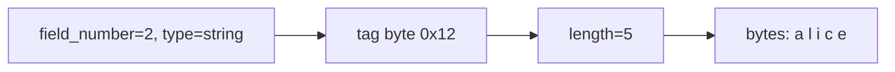
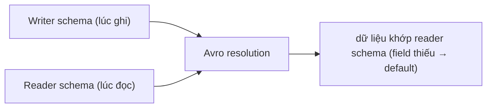

# Protobuf & Avro — Serialization nhị phân cho hệ thống lớn

## Mục lục

- [Vì sao JSON và Java Serializable không đủ](#1-vì-sao-json-và-java-serializable-không-đủ)
- [Protobuf — schema-first & wire format](#2-protobuf--schema-first--wire-format)
- [Bên trong wire format: tag, varint, ZigZag](#3-bên-trong-wire-format-tag-varint-zigzag)
- [Field number là hợp đồng — schema evolution của Protobuf](#4-field-number-là-hợp-đồng--schema-evolution-của-protobuf)
- [Avro — schema đi kèm dữ liệu](#5-avro--schema-đi-kèm-dữ-liệu)
- [Reader vs writer schema — schema resolution](#6-reader-vs-writer-schema--schema-resolution)
- [Schema Registry](#7-schema-registry)
- [So sánh: Protobuf vs Avro vs JSON vs Java Serializable](#8-so-sánh-protobuf-vs-avro-vs-json-vs-java-serializable)
- [Anti-patterns cần tránh](#9-anti-patterns-cần-tránh)
- [Tóm tắt — Cheat sheet](#10-tóm-tắt--cheat-sheet)

---

## 1. Vì sao JSON và Java Serializable không đủ

JSON tuyệt vời cho API public: người đọc được, ngôn ngữ nào cũng parse. Nhưng ở quy mô lớn (hàng triệu message/giây giữa các microservice, lưu vào Kafka/data lake), JSON lộ điểm yếu:

```json
{"userId": 12345, "userName": "alice", "isActive": true}
```

- **To**: tên field lặp lại trong **mọi** message (`"userId"` gửi triệu lần).
- **Chậm**: parse text → phân tích cú pháp tốn CPU.
- **Không kiểu chặt**: `"12345"` hay `12345`? schema lỏng lẻo, dễ sai.

Còn `java.io.Serializable` thì:

> [!WARNING]
> **Java Serializable bị xem là sai lầm thiết kế** (Effective Java Item 85): nó là lỗ hổng bảo mật khổng lồ (deserialization of untrusted data → RCE — hàng loạt CVE), gắn chặt với class Java (không cross-language), `serialVersionUID` mong manh, và hiệu năng kém. **Không bao giờ** dùng Java native serialization cho dữ liệu qua mạng/lưu trữ lâu dài. Protobuf/Avro sinh ra để thay thế.

Protobuf (Google) và Avro (Apache, từ Hadoop) giải quyết bằng **schema + nhị phân nhỏ gọn + cross-language + schema evolution**.

Phần còn lại của doc sẽ đi qua: Protobuf schema-first & wire format (§2) → bên trong wire format: tag, varint, ZigZag (§3) → field number là hợp đồng & schema evolution (§4) → Avro schema đi kèm dữ liệu (§5) → reader vs writer schema resolution (§6) → Schema Registry (§7) → so sánh Protobuf/Avro/JSON/Java Serializable (§8) → anti-patterns (§9).

---

## 2. Protobuf — schema-first & wire format

Protobuf bắt đầu từ file `.proto` mô tả schema; `protoc` sinh code cho Java/Go/Python...:

```protobuf
syntax = "proto3";
message User {
  int64  user_id   = 1;    // số 1, 2, 3 là FIELD NUMBER — cực kỳ quan trọng
  string user_name = 2;
  bool   is_active = 3;
  repeated string roles = 4;   // repeated = list
}
```

Điểm cốt lõi: trong dữ liệu nhị phân, Protobuf **không lưu tên field** (`user_name`) mà lưu **field number** (`2`). Tên field chỉ tồn tại trong code sinh ra, không trên đường truyền → message cực nhỏ.

```java
User u = User.newBuilder().setUserId(12345).setUserName("alice").build();
byte[] bytes = u.toByteArray();        // nhị phân, nhỏ hơn JSON nhiều lần
User parsed = User.parseFrom(bytes);   // không cần schema kèm — code đã biết
```

---

## 3. Bên trong wire format: tag, varint, ZigZag

Mỗi field trên đường truyền là cặp `(tag, value)`. **Tag** gộp field number + wire type vào một byte (thường):

```
tag = (field_number << 3) | wire_type
```

| Wire type | Dùng cho |
|-----------|----------|
| 0 (Varint) | int32, int64, bool, enum |
| 1 (64-bit) | fixed64, double |
| 2 (Length-delimited) | string, bytes, message lồng, repeated đóng gói |
| 5 (32-bit) | fixed32, float |

### 3.1. Varint — số nguyên độ dài thay đổi

Thay vì luôn 4/8 byte, **varint** mã hoá số nhỏ bằng ít byte: mỗi byte dùng 7 bit dữ liệu + 1 bit "còn nữa" (MSB).

```
150 (thập phân) → varint: 0x96 0x01  (2 byte thay vì 4)
số < 128 → chỉ 1 byte
```

### 3.2. ZigZag — cứu số âm

Varint thường mã hoá số âm rất tệ (số âm trong two's complement có bit cao = 1 → luôn 10 byte!). **ZigZag** (cho `sint32`/`sint64`) ánh xạ số âm thành số dương nhỏ:

```
ZigZag:  0→0, -1→1, 1→2, -2→3, 2→4 ...   công thức: (n << 1) ^ (n >> 31)
→ số âm nhỏ vẫn mã hoá ngắn gọn
```



> [!TIP]
> Hệ quả thực tế: dùng `sint32`/`sint64` (ZigZag) cho field **thường âm**; dùng `int32`/`int64` cho field **thường dương**. Chọn sai → số âm ngốn 10 byte. Đây là loại tối ưu mà JSON không bao giờ cho bạn.

---

## 4. Field number là hợp đồng — schema evolution của Protobuf

Vì wire format dựa trên **field number**, không phải tên, quy tắc tiến hoá schema xoay quanh số:

| Thay đổi | An toàn? | Vì sao |
|----------|----------|--------|
| Thêm field mới (number mới) | ✅ | reader cũ bỏ qua field lạ; field thiếu = default |
| Đổi **tên** field | ✅ | tên không lên dây; chỉ ảnh hưởng code |
| Đổi **field number** | ❌ | phá hợp đồng — đọc sai hoàn toàn |
| Xoá field | ⚠️ | phải **`reserved`** number để không tái dùng nhầm |
| Đổi kiểu field | ⚠️ | chỉ vài cặp tương thích (int32↔int64...) |

```protobuf
message User {
  reserved 3;                 // ĐÃ xoá field 3 — cấm dùng lại số này
  reserved "is_active";       // cấm dùng lại tên
  int64 user_id = 1;
  string user_name = 2;
  string email = 5;           // field mới — reader cũ bỏ qua an toàn
}
```

> [!IMPORTANT]
> Quy tắc vàng Protobuf: **field number là vĩnh viễn, không bao giờ tái sử dụng**. Một khi đã gán `roles = 4`, số 4 thuộc về `roles` mãi mãi. Xoá field thì `reserved` số đó. Vi phạm = dữ liệu cũ bị diễn giải sai âm thầm — bug tệ nhất vì không crash, chỉ sai dữ liệu.

proto3 còn bỏ khái niệm `required` (chỉ có `optional`/default) chính vì lý do evolution: field `required` không thể xoá an toàn trong tương lai.

---

## 5. Avro — schema đi kèm dữ liệu

Avro tiếp cận **khác hẳn**: dữ liệu nhị phân **không có tag/field number** gì cả — chỉ là các giá trị nối tiếp theo đúng thứ tự schema. Vậy làm sao đọc? **Schema phải có sẵn khi đọc.**

```json
{
  "type": "record", "name": "User",
  "fields": [
    {"name": "userId",   "type": "long"},
    {"name": "userName", "type": "string"},
    {"name": "isActive", "type": "boolean", "default": false}
  ]
}
```

Vì không lưu tag, Avro thường **nhỏ hơn cả Protobuf** cho dữ liệu nhiều field. Trong **Avro Object Container File** (dùng cho data lake/Hadoop), schema được ghi **một lần ở header** rồi hàng triệu record theo sau — cực kỳ tiết kiệm:

```
[Header: schema JSON 1 lần] [record][record][record]...  (record không lặp schema)
```

> [!NOTE]
> Triết lý khác nhau: **Protobuf** nhúng field number trong *mỗi* message → tự mô tả một phần, đọc được mà không cần schema ngoài (nếu có code sinh). **Avro** tách hẳn schema ra → dữ liệu "trần" nhỏ nhất có thể, nhưng **bắt buộc** có schema lúc đọc. Đây là lý do Avro hợp với lưu trữ hàng loạt (Kafka + Schema Registry, file Hadoop), còn Protobuf hợp với RPC (gRPC).

---

## 6. Reader vs writer schema — schema resolution

Tính năng mạnh nhất của Avro: đọc bằng schema **khác** với schema lúc ghi. Avro **resolve** hai schema:

- **Writer schema**: schema lúc dữ liệu được ghi.
- **Reader schema**: schema mà ứng dụng đọc *muốn* thấy.



Quy tắc resolution: khớp field **theo tên** (không theo vị trí); field reader có mà writer không → dùng `default`; field writer có mà reader không → bỏ qua. Nhờ vậy producer và consumer tiến hoá độc lập.

> [!IMPORTANT]
> Đây là điểm Avro vượt trội cho streaming: producer nâng cấp schema (thêm field) mà **không** cần consumer nâng cấp đồng thời — consumer dùng reader schema cũ vẫn đọc được (bỏ qua field mới). Để an toàn, cần phân biệt **backward** (reader mới đọc data cũ) và **forward** (reader cũ đọc data mới) compatibility — Schema Registry kiểm tra điều này.

---

## 7. Schema Registry

Trong hệ Kafka, gửi schema JSON kèm *mỗi* message vẫn lãng phí. **Schema Registry** (Confluent) lưu schema tập trung, mỗi message chỉ mang một **schema ID** (vài byte):

```
message trên Kafka = [magic byte][schema ID 4 byte][dữ liệu Avro trần]
consumer: lấy schema ID → hỏi registry → lấy writer schema → resolve với reader schema
```

Registry còn **ép luật tương thích** (compatibility mode: BACKWARD/FORWARD/FULL) — từ chối schema mới nếu nó phá vỡ tương thích, chặn bug evolution ngay lúc deploy.

> [!TIP]
> Pattern chuẩn cho event streaming hiện đại: **Avro + Schema Registry trên Kafka**. Producer đăng ký schema → nhận ID → gửi ID + data trần. Vừa nhỏ (không lặp schema), vừa an toàn (registry kiểm tương thích), vừa cho producer/consumer tiến hoá độc lập.

---

## 8. So sánh: Protobuf vs Avro vs JSON vs Java Serializable

| Tiêu chí | Protobuf | Avro | JSON | Java Serializable |
|----------|----------|------|------|-------------------|
| Định dạng | nhị phân | nhị phân | text | nhị phân |
| Schema | `.proto`, tách rời | JSON, đi kèm/registry | không (lỏng) | class Java |
| Lưu field name trên dây | không (dùng number) | không (dùng schema) | có (lặp) | metadata class |
| Cross-language | ✅ nhiều ngôn ngữ | ✅ nhiều ngôn ngữ | ✅ | ❌ chỉ Java |
| Kích thước | rất nhỏ | rất nhỏ (nhỏ nhất khi nhiều record) | to | to |
| Schema evolution | field number + reserved | reader/writer resolution | thủ công | serialVersionUID mong manh |
| Hợp với | gRPC, RPC | Kafka, data lake, Hadoop | API public, config | (tránh dùng) |
| Người đọc được | không | không | ✅ | không |

> [!NOTE]
> Còn các lựa chọn khác: **Thrift** (giống Protobuf, từ Facebook), **MessagePack** (như "JSON nhị phân", không schema), **FlatBuffers/Cap'n Proto** (zero-copy — đọc không cần parse, cho game/latency cực thấp). Nhưng Protobuf và Avro thống trị hai mảng RPC và streaming.

---

## 9. Anti-patterns cần tránh

| Anti-pattern | Vì sao sai | Thay bằng |
|--------------|-----------|-----------|
| Java `Serializable` cho dữ liệu mạng/lưu trữ | lỗ hổng RCE, không cross-language | Protobuf/Avro |
| Tái sử dụng field number Protobuf | đọc sai dữ liệu cũ âm thầm | `reserved` số đã xoá |
| `int32` cho field thường âm | tốn 10 byte | `sint32` (ZigZag) |
| Đọc Avro mà không quản schema | không resolve được | Schema Registry / lưu writer schema |
| Đổi kiểu field tuỳ tiện | phá tương thích | chỉ đổi giữa cặp tương thích |
| Dùng JSON cho luồng triệu msg/giây | to & chậm | Protobuf/Avro nhị phân |
| Bỏ qua compatibility mode | producer phá consumer | bật BACKWARD/FULL ở registry |

---

## 10. Tóm tắt — Cheat sheet

**Bản chất trong 4 dòng:**

```
Protobuf → schema .proto, wire format = (field_number, value), varint/ZigZag
           field number là hợp đồng vĩnh viễn; hợp với gRPC/RPC
Avro     → dữ liệu trần (không tag), schema tách rời, reader/writer resolution
           hợp với Kafka/data lake + Schema Registry
```

| Chọn khi | Dùng |
|----------|------|
| RPC giữa service (gRPC) | Protobuf |
| Event streaming / Kafka / data lake | Avro + Schema Registry |
| API public, người đọc | JSON |
| Latency cực thấp, zero-copy | FlatBuffers/Cap'n Proto |
| Dữ liệu qua mạng giữa các JVM | **không bao giờ** Java Serializable |

**5 nguyên tắc khắc cốt:**

1. **Đừng dùng Java `Serializable`** cho dữ liệu mạng/lưu trữ — rủi ro bảo mật.
2. **Protobuf: field number = hợp đồng vĩnh viễn**, xoá thì `reserved`.
3. **varint + ZigZag** — chọn `sint` cho số âm để tiết kiệm byte.
4. **Avro tách schema khỏi data** → nhỏ nhất, cần schema lúc đọc.
5. **reader/writer schema + registry** cho producer/consumer tiến hoá độc lập.

> [!TIP]
> Một câu để nhớ: *Protobuf nhét field number vào từng message để tự mô tả (hợp RPC); Avro vứt hết tag và để schema đi riêng để nhỏ nhất (hợp lưu trữ hàng loạt) — chọn theo việc schema sống ở đâu.*
