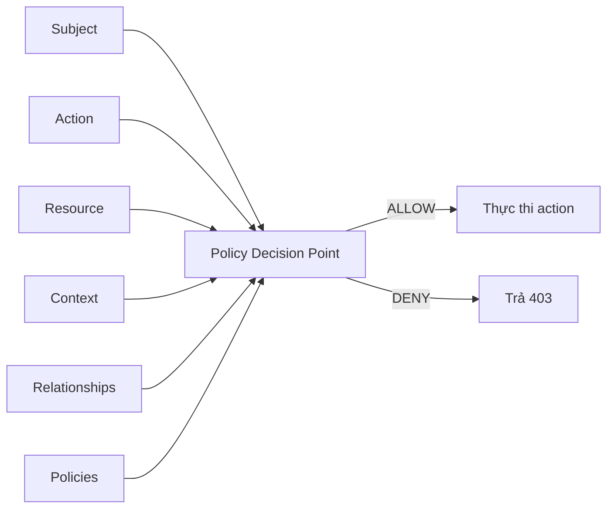
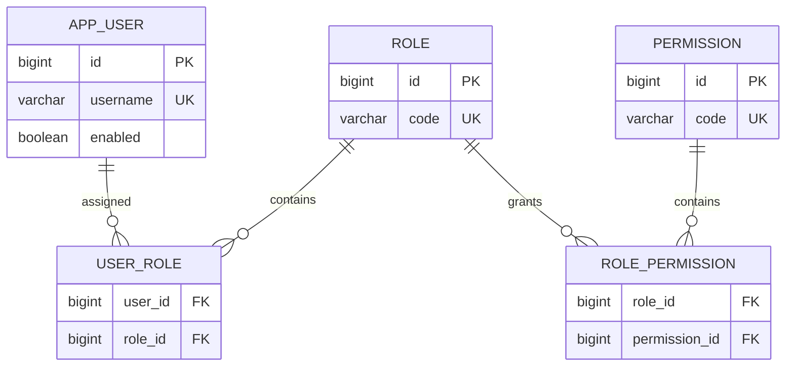
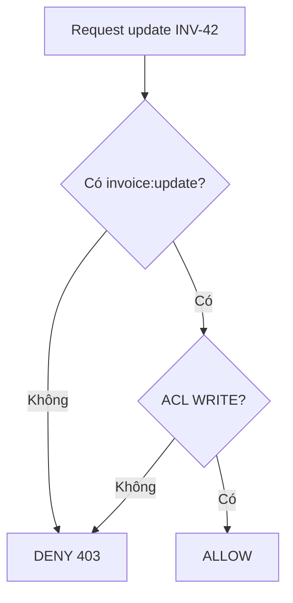
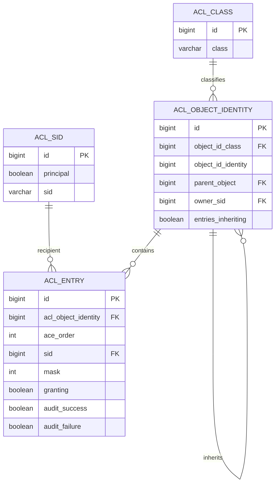
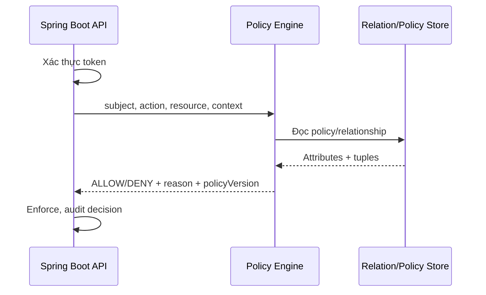
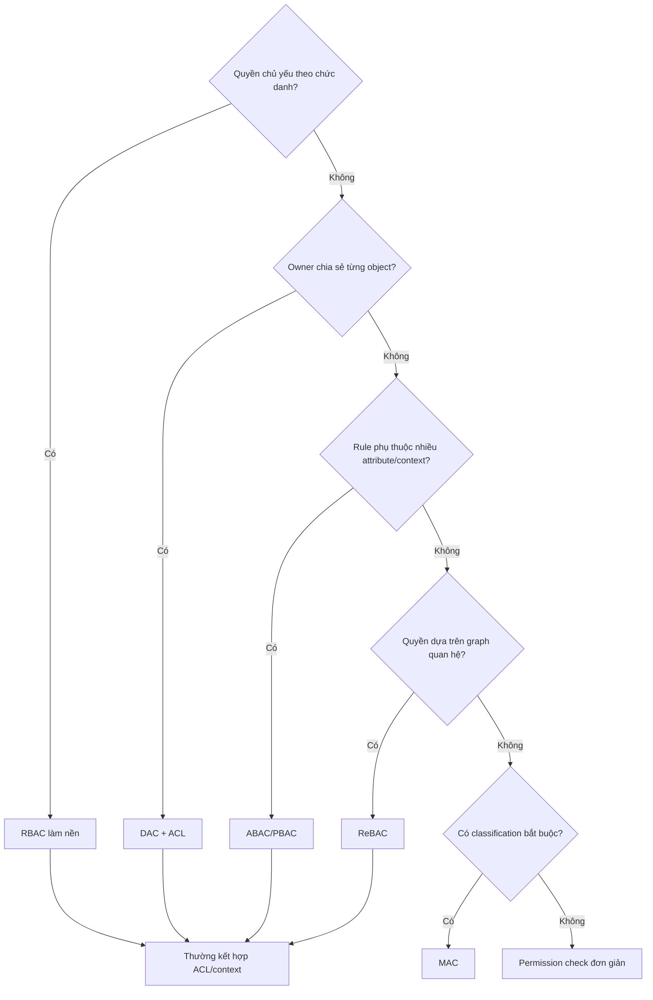

Authorization trả lời câu hỏi: **một principal đã được xác thực có được phép thực hiện action trên resource cụ thể trong context hiện tại hay không?** Tài liệu này phân biệt các mô hình access control phổ biến, sau đó đi sâu vào hai mô hình thường gặp nhất trong ứng dụng Spring Boot: **RBAC** và **ACL**.

> [!NOTE]
> Ví dụ dùng API của Spring Boot 3.x và Spring Security 6.x. Các khái niệm và phần lớn cấu hình vẫn áp dụng cho Spring Boot 4/Spring Security 7; hãy kiểm tra migration guide nếu API nhỏ thay đổi theo phiên bản.

## Mục lục

- [1. Mental model chung](#1-mental-model-chung)
  - [Authentication khác authorization](#11-authentication-khác-authorization)
  - [Một quyết định authorization gồm những gì](#12-một-quyết-định-authorization-gồm-những-gì)
- [2. Bản đồ các mô hình access control](#2-bản-đồ-các-mô-hình-access-control)
  - [DAC — Discretionary Access Control](#21-dac--discretionary-access-control)
  - [MAC — Mandatory Access Control](#22-mac--mandatory-access-control)
  - [RBAC — Role-Based Access Control](#23-rbac--role-based-access-control)
  - [ACL — Access Control List](#24-acl--access-control-list)
  - [PBAC — Policy-Based Access Control](#25-pbac--policy-based-access-control)
  - [Context-Based Access Control](#26-context-based-access-control)
  - [ReBAC — Relationship-Based Access Control](#27-rebac--relationship-based-access-control)
  - [Bảng so sánh nhanh](#28-bảng-so-sánh-nhanh)
- [3. RBAC chuyên sâu](#3-rbac-chuyên-sâu)
  - [Mô hình dữ liệu](#31-mô-hình-dữ-liệu)
  - [Role không phải permission](#32-role-không-phải-permission)
  - [Role hierarchy và separation of duties](#33-role-hierarchy-và-separation-of-duties)
- [4. Triển khai RBAC trong Spring Boot](#4-triển-khai-rbac-trong-spring-boot)
  - [Bước 1 — thiết kế permission vocabulary](#41-bước-1--thiết-kế-permission-vocabulary)
  - [Bước 2 — tạo database schema](#42-bước-2--tạo-database-schema)
  - [Bước 3 — nạp authority khi đăng nhập](#43-bước-3--nạp-authority-khi-đăng-nhập)
  - [Bước 4 — cấu hình request và method security](#44-bước-4--cấu-hình-request-và-method-security)
  - [Bước 5 — đóng gói rule bằng meta-annotation](#45-bước-5--đóng-gói-rule-bằng-meta-annotation)
  - [Bước 6 — role hierarchy](#46-bước-6--role-hierarchy)
  - [RBAC với JWT](#47-rbac-với-jwt)
  - [Cache và thay đổi quyền thời gian thực](#48-cache-và-thay-đổi-quyền-thời-gian-thực)
- [5. ACL chuyên sâu](#5-acl-chuyên-sâu)
  - [ACL giải quyết bài toán nào](#51-acl-giải-quyết-bài-toán-nào)
  - [Cấu trúc một ACE](#52-cấu-trúc-một-ace)
  - [Thứ tự đánh giá allow và deny](#53-thứ-tự-đánh-giá-allow-và-deny)
  - [RBAC và ACL phối hợp](#54-rbac-và-acl-phối-hợp)
- [6. Tự triển khai ACL không dùng bitmask](#6-tự-triển-khai-acl-không-dùng-bitmask)
  - [Schema ACL thực dụng](#61-schema-acl-thực-dụng)
  - [Repository đọc ACL](#62-repository-đọc-acl)
  - [Authorization service](#63-authorization-service)
  - [Tích hợp với @PreAuthorize](#64-tích-hợp-với-preauthorize)
  - [Grant và revoke an toàn](#65-grant-và-revoke-an-toàn)
- [7. Tối ưu ACL bằng bitmask](#7-tối-ưu-acl-bằng-bitmask)
- [8. Dùng Spring Security ACL module](#8-dùng-spring-security-acl-module)
  - [Bốn bảng cốt lõi](#81-bốn-bảng-cốt-lõi)
  - [Dependency và cấu hình](#82-dependency-và-cấu-hình)
  - [Tạo ACL và ACE](#83-tạo-acl-và-ace)
  - [Kiểm tra bằng hasPermission](#84-kiểm-tra-bằng-haspermission)
  - [Khi nào không nên dùng module này](#85-khi-nào-không-nên-dùng-module-này)
- [9. Query danh sách có phân quyền](#9-query-danh-sách-có-phân-quyền)
- [10. Context-Based, PBAC và ReBAC trong Spring](#10-context-based-pbac-và-rebac-trong-spring)
- [11. Kiểm thử authorization](#11-kiểm-thử-authorization)
- [12. Security checklist và anti-pattern](#12-security-checklist-và-anti-pattern)
  - [Checklist](#checklist)
  - [Anti-pattern](#anti-pattern)
- [13. Chọn mô hình nào](#13-chọn-mô-hình-nào)
- [14. Tóm tắt](#14-tóm-tắt)
  - [Tài liệu liên quan](#tài-liệu-liên-quan)

---

## 1. Mental model chung

### 1.1. Authentication khác authorization

- **Authentication** xác minh danh tính: “đây có thật là Alice không?”.
- **Authorization** kiểm tra quyền: “Alice có được duyệt hóa đơn `INV-42` không?”.

Spring Security lưu danh tính đã xác thực trong `Authentication`. Object này chứa principal và tập `GrantedAuthority`. Sau đó `AuthorizationManager`, expression trong `@PreAuthorize`, hoặc ACL service dùng dữ liệu đó để ra quyết định.

> [!WARNING]
> Đã đăng nhập không có nghĩa là được truy cập mọi resource. Nếu API chỉ gọi `.authenticated()` mà không kiểm tra quyền hoặc ownership, ứng dụng rất dễ mắc **IDOR/BOLA**: người dùng đổi ID trong URL để đọc object của người khác.

### 1.2. Một quyết định authorization gồm những gì

Có thể chuẩn hóa mọi rule thành năm thành phần:

```text
Decision = f(subject, action, resource, context, relationships)

subject       ai đang gọi? user, service account, role, group
action        đang làm gì? read, create, update, approve, delete
resource      tác động lên gì? Invoice, Project, File, API
context       thời gian, IP, device, risk score, MFA level
relationships owner, member, manager-of, parent-of, shared-with
```

Ví dụ:

> Cho phép Alice `APPROVE` invoice `INV-42` nếu Alice có permission `invoice:approve`, Alice không phải người tạo invoice, số tiền dưới hạn mức phê duyệt, và phiên đăng nhập đã hoàn tất MFA.

Rule này không còn là RBAC thuần túy. Nó kết hợp RBAC, context và relationship. Hệ thống thực tế thường là **hybrid**, không bắt buộc chỉ dùng đúng một mô hình.



- **PEP — Policy Enforcement Point**: nơi chặn request, ví dụ `AuthorizationFilter` hoặc method interceptor.
- **PDP — Policy Decision Point**: nơi tính quyết định allow/deny.
- **PIP — Policy Information Point**: nơi cung cấp dữ liệu cho policy, ví dụ database hoặc risk service.

## 2. Bản đồ các mô hình access control

### 2.1. DAC — Discretionary Access Control

Trong DAC, **chủ sở hữu resource tự quyết định** ai được truy cập. Google Drive là ví dụ trực quan: người tạo file chia sẻ file cho user hoặc group khác.

```text
Alice sở hữu File-1
└── Alice cấp Bob quyền READ
    └── tùy policy, Bob có thể hoặc không thể chia sẻ tiếp
```

ACL thường là cơ chế lưu trữ để hiện thực DAC. Tuy nhiên hai khái niệm không đồng nhất:

- DAC là **mô hình quản trị quyền**: owner có quyền tùy nghi cấp lại.
- ACL là **cấu trúc quyền gắn với object**: object nào có danh sách ACE của object đó.

DAC phù hợp với collaboration, file sharing và project workspace. Nhược điểm chính là quyền có thể lan truyền khó kiểm soát nếu cho phép người nhận chia sẻ tiếp.

### 2.2. MAC — Mandatory Access Control

Trong MAC, policy trung tâm quyết định quyền dựa trên **security label**. Owner không được tự ý hạ hoặc bỏ policy.

Ví dụ:

- Subject có clearance `SECRET`.
- Document có classification `TOP_SECRET`.
- Policy yêu cầu clearance của subject phải đủ cao và compartment phải khớp.

MAC phổ biến trong quốc phòng, chính phủ và hệ điều hành có SELinux. Nó chặt chẽ nhưng ít linh hoạt hơn ứng dụng doanh nghiệp thông thường.

> [!NOTE]
> “Admin có mọi quyền” chưa đủ để gọi là MAC. MAC cần policy bắt buộc, label và cơ chế enforcement mà owner/resource admin không thể tùy ý vượt qua.

### 2.3. RBAC — Role-Based Access Control

RBAC gán user vào **role**, rồi role chứa **permission**:

```text
User ──► Role ──► Permission ──► Action trên Resource Type
Alice    FINANCE_MANAGER        invoice:approve
```

RBAC phù hợp khi quyền đi theo chức danh hoặc trách nhiệm ổn định: kế toán, hỗ trợ, quản trị viên, kiểm toán viên.

Điểm mạnh là dễ quản trị hàng loạt. Điểm yếu là **role explosion**: tạo role mới cho mọi tổ hợp ngoại lệ và phạm vi dữ liệu.

### 2.4. ACL — Access Control List

Mỗi resource instance có danh sách **ACE — Access Control Entry**. Mỗi ACE nói subject nào được hoặc bị từ chối permission nào.

```text
Invoice INV-42 ACL
├── USER:alice      → READ, WRITE
├── USER:bob        → READ
├── ROLE:AUDITOR    → READ
└── USER:eve        → DENY READ
```

ACL cho phép object-level authorization chính xác. Chi phí đổi lại là số ACE có thể rất lớn, query phức tạp hơn và cache invalidation khó hơn RBAC.

### 2.5. PBAC — Policy-Based Access Control

PBAC đưa rule vào các **policy có thể quản trị độc lập** với code nghiệp vụ. Một policy có thể kết hợp role, attribute, context và relationship:

```text
ALLOW invoice.approve WHEN
  subject.department == resource.department
  AND subject.approvalLimit >= resource.amount
  AND context.mfa == true
  AND context.time within businessHours
```

Thuật ngữ PBAC đôi khi được dùng gần nghĩa với ABAC — Attribute-Based Access Control. Cách hiểu thực dụng:

- **ABAC** nhấn mạnh dữ liệu đầu vào là attribute.
- **PBAC** nhấn mạnh rule được biểu diễn, quản trị và đánh giá như policy.

OPA/Rego, Cedar và các policy engine là lựa chọn khi rule cần thay đổi độc lập với deployment hoặc cần dùng chung giữa nhiều service.

### 2.6. Context-Based Access Control

Context-Based Access Control dùng thông tin **tại thời điểm request**:

- IP hoặc network zone.
- Thời gian trong ngày.
- Device trust.
- Geo-location.
- Mức rủi ro.
- Trạng thái MFA.

Ví dụ: role `SUPPORT` chỉ được xem PII khi đang dùng thiết bị công ty, trong giờ trực và ticket đã được gán cho họ.

Context thường là một phần của ABAC/PBAC, không nhất thiết là hệ thống độc lập.

### 2.7. ReBAC — Relationship-Based Access Control

ReBAC quyết định dựa trên quan hệ giữa subject và resource. Quan hệ có thể trực tiếp hoặc đi qua graph:

```text
Alice ──member_of──► Team A ──owns──► Project P ──contains──► Document D
```

Nếu policy nói “member của team sở hữu project được đọc document”, Alice được đọc `D` nhờ đường đi trên graph.

ReBAC phù hợp với collaboration, social network, organization tree và hệ thống kiểu Google Zanzibar. Khi quan hệ sâu, nhiều loại và cần truy vấn ở quy mô lớn, một authorization graph chuyên dụng thường phù hợp hơn việc nối nhiều bảng JPA trong mỗi request.

### 2.8. Bảng so sánh nhanh

| Mô hình | Quyền dựa trên | Granularity | Điểm mạnh | Rủi ro chính |
|---|---|---:|---|---|
| DAC | quyết định của owner | object | chia sẻ linh hoạt | quyền lan truyền khó kiểm soát |
| MAC | label và policy bắt buộc | object/data | kiểm soát rất chặt | cứng, chi phí vận hành cao |
| RBAC | role → permission | resource type/action | dễ quản trị theo chức danh | role explosion, thiếu object scope |
| ACL | ACE trên từng object | object instance | chia sẻ chính xác | nhiều row, query/cache phức tạp |
| PBAC | policy tổng hợp | tùy policy | rule linh hoạt, quản trị tập trung | khó debug và test policy |
| Context-Based | request context | request/action | adaptive, zero-trust friendly | context giả mạo hoặc không ổn định |
| ReBAC | graph quan hệ | object/graph | tự nhiên cho collaboration | graph traversal và consistency |

## 3. RBAC chuyên sâu

### 3.1. Mô hình dữ liệu

RBAC cơ bản có bốn quan hệ:



Trong NIST RBAC, có thể mở rộng thêm:

- **Role hierarchy**: role cao bao hàm role thấp.
- **Static Separation of Duties — SSD**: một user không được đồng thời có hai role xung đột.
- **Dynamic Separation of Duties — DSD**: user có thể sở hữu nhiều role nhưng không được kích hoạt cùng lúc trong một session hoặc transaction.
- **Cardinality constraint**: giới hạn số user có một role nhạy cảm.

### 3.2. Role không phải permission

Role mô tả **trách nhiệm tổ chức**. Permission mô tả **khả năng kỹ thuật**.

```text
Role:       FINANCE_MANAGER
Permissions:
  invoice:read
  invoice:approve
  payment:read
```

Nên viết code kiểm tra permission:

```java
@PreAuthorize("hasAuthority('invoice:approve')")
void approveInvoice(long invoiceId) { }
```

Không nên rải role khắp business service:

```java
@PreAuthorize("hasAnyRole('ADMIN', 'FINANCE_MANAGER', 'CFO', 'SUPER_USER')")
void approveInvoice(long invoiceId) { }
```

Khi tổ chức đổi role nhưng capability không đổi, cách thứ nhất chỉ cần cập nhật mapping trong database. Code không phải redeploy.

> [!TIP]
> Dùng role để **quản trị assignment**, dùng permission để **enforce trong code**. Đây là cách giảm coupling giữa sơ đồ tổ chức và logic ứng dụng.

### 3.3. Role hierarchy và separation of duties

Role hierarchy tiện lợi nhưng dễ vô tình cấp quá nhiều quyền:

```text
ADMIN > MANAGER > USER
```

Nếu `MANAGER` về sau nhận quyền đọc lương, mọi `ADMIN` cũng tự động nhận quyền đó. Vì vậy hierarchy chỉ nên diễn tả quan hệ bao hàm thật sự ổn định.

Với quy trình maker-checker, chỉ role là chưa đủ:

```text
Người tạo invoice != người duyệt invoice
```

Rule này phụ thuộc vào relationship giữa user và object. Hãy kết hợp permission với kiểm tra creator:

```java
@PreAuthorize("hasAuthority('invoice:approve') and " +
              "@invoiceAuth.isNotCreator(authentication, #invoiceId)")
public void approve(long invoiceId) { }
```

## 4. Triển khai RBAC trong Spring Boot

### 4.1. Bước 1 — thiết kế permission vocabulary

Dùng format ổn định `resource:action`:

```text
invoice:read
invoice:create
invoice:update
invoice:approve
invoice:delete
acl:grant
acl:revoke
```

Tránh permission mơ hồ như `CAN_MANAGE` hoặc `FULL_ACCESS`. Tên permission là public contract giữa database, token, backend và đôi khi cả frontend.

> [!NOTE]
> Frontend có thể dùng permission để ẩn nút, nhưng backend vẫn phải enforce. Ẩn nút không phải security boundary.

### 4.2. Bước 2 — tạo database schema

Ví dụ PostgreSQL:

```sql
CREATE TABLE app_user (
    id          BIGSERIAL PRIMARY KEY,
    username    VARCHAR(100) NOT NULL UNIQUE,
    password    VARCHAR(255) NOT NULL,
    enabled     BOOLEAN NOT NULL DEFAULT TRUE
);

CREATE TABLE role (
    id          BIGSERIAL PRIMARY KEY,
    code        VARCHAR(100) NOT NULL UNIQUE,
    description VARCHAR(255)
);

CREATE TABLE permission (
    id          BIGSERIAL PRIMARY KEY,
    code        VARCHAR(120) NOT NULL UNIQUE,
    description VARCHAR(255)
);

CREATE TABLE user_role (
    user_id     BIGINT NOT NULL REFERENCES app_user(id),
    role_id     BIGINT NOT NULL REFERENCES role(id),
    PRIMARY KEY (user_id, role_id)
);

CREATE TABLE role_permission (
    role_id       BIGINT NOT NULL REFERENCES role(id),
    permission_id BIGINT NOT NULL REFERENCES permission(id),
    PRIMARY KEY (role_id, permission_id)
);

CREATE INDEX idx_user_role_lookup
    ON user_role (user_id, role_id);
CREATE INDEX idx_role_permission_lookup
    ON role_permission (role_id, permission_id);
```

Query nạp permission hiệu lực:

```sql
SELECT DISTINCT p.code
FROM user_role ur
JOIN role_permission rp ON rp.role_id = ur.role_id
JOIN permission p ON p.id = rp.permission_id
WHERE ur.user_id = :userId;
```

Dùng Flyway hoặc Liquibase để version schema và seed permission. Không tự động tạo permission từ annotation khi startup trong production, vì typo trong code có thể âm thầm tạo một capability mới.

### 4.3. Bước 3 — nạp authority khi đăng nhập

Tách repository chỉ đọc projection cần thiết:

```java
public interface AuthorizationQueryRepository {
    Set<String> findRoleCodes(long userId);
    Set<String> findPermissionCodes(long userId);
}
```

Tạo principal chứa `userId` và tập authority:

```java
public record AppPrincipal(
        long userId,
        String username,
        String password,
        Collection<? extends GrantedAuthority> authorities
) implements UserDetails {

    @Override public String getUsername() { return username; }
    @Override public String getPassword() { return password; }
    @Override public Collection<? extends GrantedAuthority> getAuthorities() {
        return authorities;
    }
}
```

`UserDetailsService` nạp cả role lẫn permission:

```java
@Service
@RequiredArgsConstructor
public class DatabaseUserDetailsService implements UserDetailsService {
    private final UserRepository users;
    private final AuthorizationQueryRepository authorization;

    @Override
    @Transactional(readOnly = true)
    public UserDetails loadUserByUsername(String username) {
        AppUser user = users.findEnabledByUsername(username)
                .orElseThrow(() -> new UsernameNotFoundException(username));

        Set<GrantedAuthority> authorities = new HashSet<>();
        authorization.findRoleCodes(user.getId()).stream()
                .map(role -> new SimpleGrantedAuthority("ROLE_" + role))
                .forEach(authorities::add);
        authorization.findPermissionCodes(user.getId()).stream()
                .map(SimpleGrantedAuthority::new)
                .forEach(authorities::add);

        return new AppPrincipal(
                user.getId(), user.getUsername(),
                user.getPassword(), Set.copyOf(authorities));
    }
}
```

### 4.4. Bước 4 — cấu hình request và method security

```java
@Configuration
@EnableMethodSecurity
public class SecurityConfig {

    @Bean
    SecurityFilterChain securityFilterChain(HttpSecurity http) throws Exception {
        return http
                .csrf(csrf -> csrf.disable()) // Chỉ phù hợp API stateless không dùng cookie
                .authorizeHttpRequests(auth -> auth
                        .requestMatchers("/actuator/health").permitAll()
                        .requestMatchers(HttpMethod.GET, "/api/invoices/**")
                            .hasAuthority("invoice:read")
                        .requestMatchers(HttpMethod.POST, "/api/invoices")
                            .hasAuthority("invoice:create")
                        .anyRequest().authenticated())
                .oauth2ResourceServer(oauth2 -> oauth2.jwt(Customizer.withDefaults()))
                .build();
    }
}
```

Request-level rule bảo vệ bề mặt HTTP. Method-level rule bảo vệ use case kể cả khi được gọi từ controller khác, scheduler hoặc message consumer:

```java
@Service
@RequiredArgsConstructor
public class InvoiceService {
    private final InvoiceRepository invoices;

    @PreAuthorize("hasAuthority('invoice:approve')")
    @Transactional
    public void approve(long invoiceId) {
        Invoice invoice = invoices.findById(invoiceId)
                .orElseThrow(InvoiceNotFoundException::new);
        invoice.approve();
    }
}
```

> [!IMPORTANT]
> Giữ rule quan trọng ở service layer. Controller rule chỉ là lớp phòng thủ sớm. Ngoài ra, method security chạy qua Spring AOP proxy; self-invocation `this.approve(...)` không đi qua proxy nên có thể bỏ qua annotation.

### 4.5. Bước 5 — đóng gói rule bằng meta-annotation

Meta-annotation làm code dễ đọc và giảm typo:

```java
@Target({ElementType.METHOD, ElementType.TYPE})
@Retention(RetentionPolicy.RUNTIME)
@PreAuthorize("hasAuthority('invoice:approve')")
public @interface CanApproveInvoice {
}
```

```java
@CanApproveInvoice
@Transactional
public void approve(long invoiceId) {
    // business logic
}
```

Nếu permission có tham số động, dùng bean trong SpEL thay vì viết expression dài ở mọi method.

### 4.6. Bước 6 — role hierarchy

Spring Security có `RoleHierarchy`:

```java
@Bean
static RoleHierarchy roleHierarchy() {
    return RoleHierarchyImpl.fromHierarchy("""
        ROLE_ADMIN > ROLE_MANAGER
        ROLE_MANAGER > ROLE_USER
        """);
}

@Bean
static MethodSecurityExpressionHandler methodSecurityExpressionHandler(
        RoleHierarchy roleHierarchy) {
    var handler = new DefaultMethodSecurityExpressionHandler();
    handler.setRoleHierarchy(roleHierarchy);
    return handler;
}
```

Với mapping role → permission lưu trong database, thường nên **expand permission khi tạo `Authentication`** thay vì hard-code toàn bộ mapping trong `RoleHierarchy`. `RoleHierarchy` phù hợp nhất cho hierarchy nhỏ và ổn định.

### 4.7. RBAC với JWT

Resource server có thể map claim thành authority:

```json
{
  "sub": "alice",
  "roles": ["FINANCE_MANAGER"],
  "permissions": ["invoice:read", "invoice:approve"],
  "exp": 1770000000
}
```

```java
@Bean
JwtAuthenticationConverter jwtAuthenticationConverter() {
    JwtGrantedAuthoritiesConverter scopes = new JwtGrantedAuthoritiesConverter();

    JwtAuthenticationConverter converter = new JwtAuthenticationConverter();
    converter.setJwtGrantedAuthoritiesConverter(jwt -> {
        Set<GrantedAuthority> result = new HashSet<>(scopes.convert(jwt));

        jwt.getClaimAsStringList("roles").stream()
                .map(role -> new SimpleGrantedAuthority("ROLE_" + role))
                .forEach(result::add);

        jwt.getClaimAsStringList("permissions").stream()
                .map(SimpleGrantedAuthority::new)
                .forEach(result::add);

        return result;
    });
    return converter;
}
```

Đăng ký converter:

```java
.oauth2ResourceServer(oauth2 -> oauth2
    .jwt(jwt -> jwt.jwtAuthenticationConverter(jwtAuthenticationConverter())))
```

JWT là snapshot quyền tại thời điểm phát hành. Nếu admin thu hồi role, token cũ vẫn có quyền tới khi hết hạn. Các lựa chọn:

- Access token ngắn hạn.
- Token version/security stamp và kiểm tra server-side.
- Introspection/opaque token cho quyền cần revoke gần real-time.
- Deny-list cho sự cố khẩn cấp.
- Không nhét hàng nghìn object ID hoặc ACL entry vào JWT.

### 4.8. Cache và thay đổi quyền thời gian thực

Có ba mức cache khác nhau:

1. `Authentication` trong session hoặc token.
2. Cache mapping user → roles/permissions.
3. Cache policy/ACL decision.

Khi grant/revoke quyền, phải xác định mức nào cần invalidation. Cache TTL không thay thế invalidation với quyền nhạy cảm.

Một chiến lược phổ biến:

```text
Grant/revoke role
    ├── commit database transaction
    ├── publish AuthorizationChanged(userId)
    ├── evict distributed cache
    └── tăng authz_version để token/session cũ bị từ chối
```

## 5. ACL chuyên sâu

### 5.1. ACL giải quyết bài toán nào

RBAC nói “Alice có thể đọc invoice”. ACL nói “Alice có thể đọc **invoice 42**, nhưng không thể đọc invoice 43”.

Các use case điển hình:

- Owner chia sẻ một document cho user khác.
- Auditor chỉ được xem một số case được giao.
- Project private chỉ cho member cụ thể.
- Support engineer chỉ được mở ticket đã assign.

### 5.2. Cấu trúc một ACE

Một ACE nên chứa ít nhất:

```text
(resource_type, resource_id, subject_type, subject_id, permission, effect)
```

Ví dụ:

```text
(INVOICE, 42, USER, alice, READ, ALLOW)
(INVOICE, 42, ROLE, AUDITOR, READ, ALLOW)
(INVOICE, 42, USER, eve, READ, DENY)
```

Có thể thêm thời hạn, người cấp, lý do và audit timestamp.

### 5.3. Thứ tự đánh giá allow và deny

Hãy định nghĩa semantics trước khi code. Một policy dễ hiểu:

1. Không tìm thấy rule phù hợp → `DENY`.
2. Explicit `DENY` khớp subject và permission → `DENY`.
3. `ADMINISTER` hoặc wildcard grant → `ALLOW`.
4. Explicit `ALLOW` → `ALLOW`.
5. Nếu có parent ACL, đánh giá parent.
6. Còn lại → `DENY`.

Không nên phụ thuộc vào thứ tự row ngẫu nhiên từ database. Nếu dùng deny override, query và code phải thể hiện rõ điều đó.

> [!WARNING]
> Kết hợp user grant và role deny cần rule ưu tiên rõ ràng. Nếu team không thực sự cần explicit deny, chỉ hỗ trợ grant và default-deny thường đơn giản, ít bất ngờ hơn.

### 5.4. RBAC và ACL phối hợp

Mô hình hybrid khuyên dùng:

```text
ALLOW = RBAC capability AND object scope

invoice:read              AND ACL READ trên INV-42
invoice:update            AND ACL WRITE trên INV-42
invoice:approve           AND không phải người tạo invoice
```

RBAC là coarse-grained gate. ACL thu hẹp object nào được thao tác. Không nên để ACL `READ` tự động cấp capability đọc invoice cho một principal vốn không thuộc module invoice, trừ khi đó là policy chia sẻ được chủ ý thiết kế.



## 6. Tự triển khai ACL không dùng bitmask

Hãy bắt đầu bằng schema **mỗi permission một row**. Cách này thể hiện trực tiếp mô hình ACL, dễ đọc trong database và chưa cần biết phép toán bit. Sau khi hiểu đầy đủ luồng lưu ACE, truy vấn và kiểm tra quyền ở phần này, phần 7 mới thay cột `permission` bằng bitmask như một tối ưu lưu trữ.

Custom domain ACL không dùng bitmask thường dễ hiểu hơn Spring Security ACL module khi:

- ID là UUID/string.
- Permission theo domain như `APPROVE`, `EXPORT`, `COMMENT`.
- Cần join ACL trực tiếp trong query danh sách.
- Team muốn schema minh bạch và ít abstraction.

### 6.1. Schema ACL thực dụng

```sql
CREATE TABLE resource_acl (
    id              BIGSERIAL PRIMARY KEY,
    resource_type   VARCHAR(80) NOT NULL,
    resource_id     VARCHAR(100) NOT NULL,
    subject_type    VARCHAR(20) NOT NULL,
    subject_id      VARCHAR(120) NOT NULL,
    permission      VARCHAR(80) NOT NULL,
    effect          VARCHAR(10) NOT NULL DEFAULT 'ALLOW',
    granted_by      BIGINT NOT NULL,
    reason          VARCHAR(255),
    expires_at      TIMESTAMPTZ,
    created_at      TIMESTAMPTZ NOT NULL DEFAULT now(),

    CONSTRAINT ck_acl_subject_type
        CHECK (subject_type IN ('USER', 'ROLE')),
    CONSTRAINT ck_acl_effect
        CHECK (effect IN ('ALLOW', 'DENY')),
    CONSTRAINT uk_resource_acl UNIQUE
        (resource_type, resource_id, subject_type, subject_id, permission)
);

CREATE INDEX idx_acl_resource_lookup
    ON resource_acl
       (resource_type, resource_id, permission, effect);

CREATE INDEX idx_acl_subject_lookup
    ON resource_acl
       (subject_type, subject_id, permission);
```

`resource_type` và `permission` phải lấy từ allow-list server-side. Không cho client gửi một chuỗi class name tùy ý.

### 6.2. Repository đọc ACL

Projection tối thiểu:

```java
public record AclEntryView(String permission, String effect) {
    boolean denies() { return "DENY".equals(effect); }
    boolean grants() { return "ALLOW".equals(effect); }
}
```

Dùng `NamedParameterJdbcTemplate` để query cả user SID và role SID trong một lần:

```java
@Repository
@RequiredArgsConstructor
public class ResourceAclRepository {
    private final NamedParameterJdbcTemplate jdbc;

    public List<AclEntryView> findRelevant(
            String resourceType,
            String resourceId,
            String username,
            Set<String> roles,
            String permission) {

        Set<String> safeRoles = roles.isEmpty() ? Set.of("__NO_ROLE__") : roles;

        String sql = """
            SELECT permission, effect
            FROM resource_acl
            WHERE resource_type = :resourceType
              AND resource_id = :resourceId
              AND (expires_at IS NULL OR expires_at > now())
              AND permission IN (:permission, 'ADMINISTER')
              AND (
                    (subject_type = 'USER' AND subject_id = :username)
                 OR (subject_type = 'ROLE' AND subject_id IN (:roles))
              )
            """;

        MapSqlParameterSource params = new MapSqlParameterSource()
                .addValue("resourceType", resourceType)
                .addValue("resourceId", resourceId)
                .addValue("username", username)
                .addValue("roles", safeRoles)
                .addValue("permission", permission);

        return jdbc.query(sql, params, (rs, rowNum) ->
                new AclEntryView(
                        rs.getString("permission"),
                        rs.getString("effect")));
    }
}
```

### 6.3. Authorization service

Service này là PDP của custom ACL:

```java
@Component("acl")
@RequiredArgsConstructor
public class AclAuthorizationService {
    private static final Set<String> RESOURCE_TYPES =
            Set.of("INVOICE", "DOCUMENT", "PROJECT");
    private static final Set<String> PERMISSIONS =
            Set.of("READ", "WRITE", "DELETE", "APPROVE", "ADMINISTER");

    private final ResourceAclRepository aclRepository;

    public boolean can(
            Authentication authentication,
            String resourceType,
            Object resourceId,
            String permission) {

        if (authentication == null || !authentication.isAuthenticated()) {
            return false;
        }
        if (!RESOURCE_TYPES.contains(resourceType)
                || !PERMISSIONS.contains(permission)) {
            return false;
        }

        Set<String> roles = authentication.getAuthorities().stream()
                .map(GrantedAuthority::getAuthority)
                .filter(a -> a.startsWith("ROLE_"))
                .collect(Collectors.toUnmodifiableSet());

        List<AclEntryView> entries = aclRepository.findRelevant(
                resourceType,
                resourceId.toString(),
                authentication.getName(),
                roles,
                permission);

        boolean denied = entries.stream().anyMatch(AclEntryView::denies);
        if (denied) return false;

        return entries.stream().anyMatch(AclEntryView::grants);
    }
}
```

Đây là policy **deny-overrides**. Nếu không dùng explicit deny, bỏ cột `effect` và chỉ kiểm tra sự tồn tại của grant.

### 6.4. Tích hợp với @PreAuthorize

Expression ghi rõ RBAC gate và ACL scope:

```java
@Service
@RequiredArgsConstructor
public class InvoiceService {

    @PreAuthorize("hasAuthority('invoice:read') and " +
                  "@acl.can(authentication, 'INVOICE', #invoiceId, 'READ')")
    @Transactional(readOnly = true)
    public InvoiceDto get(UUID invoiceId) {
        return loadInvoice(invoiceId);
    }

    @PreAuthorize("hasAuthority('invoice:update') and " +
                  "@acl.can(authentication, 'INVOICE', #invoiceId, 'WRITE')")
    @Transactional
    public void update(UUID invoiceId, UpdateInvoiceCommand command) {
        // update
    }
}
```

Đóng gói expression lặp lại bằng meta-annotation:

```java
@Target(ElementType.METHOD)
@Retention(RetentionPolicy.RUNTIME)
@PreAuthorize("hasAuthority('invoice:read') and " +
              "@acl.can(authentication, 'INVOICE', #invoiceId, 'READ')")
public @interface CanReadInvoice {
}
```

> [!IMPORTANT]
> Tên parameter trong SpEL phải còn trong bytecode. Với build chuẩn Spring Boot, giữ compiler flag `-parameters`. Integration test phải gọi đúng proxy để bắt lỗi expression sớm.

### 6.5. Grant và revoke an toàn

Chỉ principal có `ADMINISTER` trên object hoặc capability quản trị đặc biệt mới được grant ACL:

```java
@PreAuthorize("hasAuthority('acl:grant') and " +
              "@acl.can(authentication, #resourceType, " +
              "#resourceId, 'ADMINISTER')")
@Transactional
public void grant(
        String resourceType,
        UUID resourceId,
        GrantAclCommand command) {

    validatePermission(command.permission());
    validateSubject(command.subjectType(), command.subjectId());
    aclRepository.upsertGrant(/* ... */, currentUserId());
    auditPublisher.aclGranted(/* before/after, actor, reason */);
    aclCache.evict(resourceType, resourceId);
}
```

Các invariant cần bảo vệ:

- Không tự thu hồi ACE `ADMINISTER` cuối cùng nếu object bắt buộc có admin.
- Không grant cho subject không tồn tại.
- Không cho người có `READ` tự nâng lên `ADMINISTER`.
- Revoke phải idempotent.
- Grant/revoke và audit event nằm trong cùng transaction hoặc dùng transactional outbox.
- Cache chỉ được evict sau commit để tránh cache đọc trạng thái chưa commit.

## 7. Tối ưu ACL bằng bitmask

Phần 6 đã triển khai ACL theo cách dễ hiểu nhất: mỗi permission là một ACE riêng. Khi số row trở thành vấn đề và tập permission đủ nhỏ, ổn định, có thể nén nhiều permission của cùng một subject-resource vào một bitmask.

Trước hết cần tách hai khái niệm:

- **ACL** trả lời: subject nào có quyền gì trên resource nào.
- **Bitmask** chỉ là cách nén nhiều permission của một ACL entry vào một số nguyên.

Vì vậy, bitmask **không thay thế ACL**. Nó là một cách lưu trường `permissions` bên trong ACL.

```text
ACL entry
├── resource: Document 42
├── subject: alice
└── permissions: READ + WRITE  ← có thể lưu bằng nhiều row hoặc một bitmask
```

> [!IMPORTANT]
> Nếu schema “mỗi permission một row” đã đủ nhanh và dễ quản trị, không bắt buộc dùng bitmask. Chỉ dùng bitmask khi tập permission nhỏ, ổn định và lợi ích giảm số row thực sự đáng kể.

**Vì sao không chỉ dùng ACL với mỗi permission một row?**

Giả sử Alice có ba quyền trên document `42`: `READ`, `WRITE`, `DELETE`.

Cách ACL mỗi permission một row:

```text
resource  resource_id  subject  permission
DOCUMENT  42           alice    READ
DOCUMENT  42           alice    WRITE
DOCUMENT  42           alice    DELETE
```

Cách ACL dùng bitmask:

```text
resource  resource_id  subject  permission_mask
DOCUMENT  42           alice    7
```

Cả hai đều là ACL. Khác biệt chỉ nằm ở cách lưu tập permission:

| Tiêu chí | Mỗi permission một row | Bitmask trong một row |
|---|---|---|
| Dễ đọc trực tiếp trong DB | tốt | phải decode số |
| Thêm permission động | dễ | bị giới hạn số bit |
| Số row | nhiều hơn | ít hơn |
| Kiểm tra permission | tìm row | phép toán bit rất nhanh |
| Audit từng lần grant | tự nhiên | cần audit table riêng |
| Migration permission | đơn giản | phải giữ bit ổn định |

Bitmask phù hợp khi một resource-subject có nhiều permission và permission ít thay đổi. Row-per-permission phù hợp khi cần tính linh hoạt và khả năng quan sát cao hơn.

**Bước 1 — gán mỗi permission vào một bit**

Dùng ví dụ chỉ có bốn permission:

| Permission | Binary | Decimal |
|---|---:|---:|
| `READ` | `0001` | 1 |
| `WRITE` | `0010` | 2 |
| `DELETE` | `0100` | 4 |
| `SHARE` | `1000` | 8 |

Mỗi permission phải là một lũy thừa của hai. Nhờ vậy mỗi giá trị chỉ bật đúng một bit.

```java
public enum Permission {
    READ(1L << 0),    // 0001 = 1
    WRITE(1L << 1),   // 0010 = 2
    DELETE(1L << 2),  // 0100 = 4
    SHARE(1L << 3);   // 1000 = 8

    private final long mask;

    Permission(long mask) {
        this.mask = mask;
    }

    public long mask() {
        return mask;
    }
}
```

> [!WARNING]
> Không dùng `1L << ordinal()`. Nếu đổi thứ tự enum, dữ liệu cũ trong database sẽ mang nghĩa khác. Giá trị bit là một phần của database schema và phải được khai báo cố định.

**Bước 2 — gộp nhiều permission bằng phép OR**

Alice có `READ` và `WRITE`:

```text
READ       0001
WRITE      0010
           ---- OR
Kết quả    0011 = 3
```

Java:

```java
long alicePermissions = Permission.READ.mask()
        | Permission.WRITE.mask();

System.out.println(alicePermissions); // 3
```

Có thể đóng gói phép toán vào utility:

```java
public final class PermissionMask {
    private PermissionMask() {
    }

    public static long of(Permission... permissions) {
        long result = 0L;
        for (Permission permission : permissions) {
            result |= permission.mask();
        }
        return result;
    }

    public static long add(long current, Permission permission) {
        return current | permission.mask();
    }

    public static long remove(long current, Permission permission) {
        return current & ~permission.mask();
    }

    public static boolean has(long granted, Permission required) {
        return (granted & required.mask()) == required.mask();
    }

    public static boolean hasAll(long granted, Permission... required) {
        long requiredMask = of(required);
        if (requiredMask == 0L) {
            return false;
        }
        return (granted & requiredMask) == requiredMask;
    }

    public static boolean hasAny(long granted, Permission... required) {
        long requiredMask = of(required);
        if (requiredMask == 0L) {
            return false;
        }
        return (granted & requiredMask) != 0L;
    }
}
```

Ba công thức quan trọng:

```text
Grant:      current | permission
Revoke:     current & ~permission
Check:     (granted & required) == required
```

**Bước 3 — kiểm tra một permission**

Alice đang có mask `3`, tức binary `0011`:

```java
long granted = 3L;

PermissionMask.has(granted, Permission.READ);   // true
PermissionMask.has(granted, Permission.WRITE);  // true
PermissionMask.has(granted, Permission.DELETE); // false
```

Tại sao check `READ` trả về `true`?

```text
Granted    0011
READ       0001
           ---- AND
Kết quả    0001  == READ → có quyền
```

Tại sao check `DELETE` trả về `false`?

```text
Granted    0011
DELETE     0100
           ---- AND
Kết quả    0000  != DELETE → không có quyền
```

**Kiểm tra tất cả và kiểm tra bất kỳ**

Hai yêu cầu này khác nhau:

```java
long granted = PermissionMask.of(Permission.READ, Permission.WRITE);

PermissionMask.hasAll(
        granted,
        Permission.READ,
        Permission.WRITE); // true: có đủ cả hai

PermissionMask.hasAll(
        granted,
        Permission.READ,
        Permission.DELETE); // false: thiếu DELETE

PermissionMask.hasAny(
        granted,
        Permission.READ,
        Permission.DELETE); // true: có ít nhất READ
```

Tên method phải nói rõ `hasAll` hay `hasAny`. Một method chung chung như `checkPermissions` rất dễ bị gọi sai semantics.

**Bước 4 — lưu ACL bitmask trong database**

Schema tối giản, không đưa scope khác vào để tập trung vào cơ chế bitmask:

```sql
CREATE TABLE resource_acl (
    id              BIGSERIAL PRIMARY KEY,
    resource_type   VARCHAR(80) NOT NULL,
    resource_id     VARCHAR(100) NOT NULL,
    subject_type    VARCHAR(20) NOT NULL,
    subject_id      VARCHAR(120) NOT NULL,
    permission_mask BIGINT NOT NULL DEFAULT 0,
    created_at      TIMESTAMPTZ NOT NULL DEFAULT now(),
    updated_at      TIMESTAMPTZ NOT NULL DEFAULT now(),

    CONSTRAINT ck_acl_subject_type
        CHECK (subject_type IN ('USER', 'ROLE')),
    CONSTRAINT ck_permission_mask_non_negative
        CHECK (permission_mask >= 0),
    CONSTRAINT uk_resource_acl UNIQUE
        (resource_type, resource_id, subject_type, subject_id)
);

CREATE INDEX idx_resource_acl_lookup
    ON resource_acl
       (resource_type, resource_id, subject_type, subject_id);
```

Một row ví dụ:

```text
resource_type = DOCUMENT
resource_id = 42
subject_type = USER
subject_id = alice
permission_mask = 3
```

Mask `3` tương ứng `READ + WRITE`.

**Bước 5 — đọc mask và kiểm tra trong Spring Boot**

Repository chỉ cần lấy mask của Alice trên document:

```java
@Repository
@RequiredArgsConstructor
public class ResourceAclRepository {
    private final JdbcTemplate jdbc;

    public OptionalLong findUserMask(
            String resourceType,
            String resourceId,
            String username) {

        List<Long> masks = jdbc.query(
                """
                SELECT permission_mask
                FROM resource_acl
                WHERE resource_type = ?
                  AND resource_id = ?
                  AND subject_type = 'USER'
                  AND subject_id = ?
                """,
                (rs, rowNum) -> rs.getLong("permission_mask"),
                resourceType,
                resourceId,
                username);

        return masks.isEmpty()
                ? OptionalLong.empty()
                : OptionalLong.of(masks.get(0));
    }
}
```

Authorization service áp dụng **default deny**: không tìm thấy ACL entry thì từ chối.

```java
@Component("documentPermission")
@RequiredArgsConstructor
public class DocumentPermissionService {
    private final ResourceAclRepository aclRepository;

    public boolean canRead(Authentication authentication, UUID documentId) {
        return hasPermission(authentication, documentId, Permission.READ);
    }

    public boolean canWrite(Authentication authentication, UUID documentId) {
        return hasPermission(authentication, documentId, Permission.WRITE);
    }

    private boolean hasPermission(
            Authentication authentication,
            UUID documentId,
            Permission required) {

        if (authentication == null || !authentication.isAuthenticated()) {
            return false;
        }

        OptionalLong mask = aclRepository.findUserMask(
                "DOCUMENT",
                documentId.toString(),
                authentication.getName());

        return mask.isPresent()
                && PermissionMask.has(mask.getAsLong(), required);
    }
}
```

Dùng tại service layer:

```java
@Service
public class DocumentService {

    @PreAuthorize("@documentPermission.canRead(authentication, #documentId)")
    public DocumentDto get(UUID documentId) {
        // Chỉ chạy khi bit READ được bật.
        return loadDocument(documentId);
    }

    @PreAuthorize("@documentPermission.canWrite(authentication, #documentId)")
    public void update(UUID documentId, UpdateDocumentCommand command) {
        // Chỉ chạy khi bit WRITE được bật.
    }
}
```

Luồng kiểm tra hoàn chỉnh:

```text
Alice gọi get(documentId=42)
    ↓
Tìm ACL của (DOCUMENT, 42, USER, alice)
    ↓
Đọc permission_mask = 3 (0011)
    ↓
Check READ: 0011 & 0001 = 0001
    ↓
ALLOW
```

Nếu không có row hoặc bit `READ` không bật, method bị từ chối.

**Grant và revoke permission**

Grant `DELETE` cho mask hiện tại `3`:

```text
Current     0011 = READ + WRITE
DELETE      0100
            ---- OR
New mask    0111 = READ + WRITE + DELETE = 7
```

```java
long newMask = PermissionMask.add(3L, Permission.DELETE); // 7
```

Revoke `WRITE` khỏi mask `7`:

```text
Current     0111
~WRITE      1101
            ---- AND
New mask    0101 = READ + DELETE = 5
```

```java
long newMask = PermissionMask.remove(7L, Permission.WRITE); // 5
```

Nên update trực tiếp bằng SQL để tránh hai request cùng đọc mask cũ rồi ghi đè lên nhau:

```sql
-- Grant một permission.
UPDATE resource_acl
SET permission_mask = permission_mask | :permissionMask,
    updated_at = now()
WHERE id = :aclId;

-- Revoke một permission.
UPDATE resource_acl
SET permission_mask = permission_mask & ~:permissionMask,
    updated_at = now()
WHERE id = :aclId;
```

Nếu ACL row chưa tồn tại, dùng database upsert. Tránh flow `SELECT → không thấy → INSERT`, vì hai request đồng thời có thể cùng insert.

**Nếu user nhận quyền từ nhiều role**

Bitmask của nhiều ACL entry có thể được gộp bằng OR:

```text
USER:alice  có READ       → 0001
ROLE:EDITOR có WRITE      → 0010
                            ---- OR
Quyền hiệu lực             0011 = READ + WRITE
```

```java
long effectiveMask = entries.stream()
        .mapToLong(AclEntry::permissionMask)
        .reduce(0L, (left, right) -> left | right);
```

Sau khi aggregate, dùng cùng một phép check:

```java
PermissionMask.has(effectiveMask, Permission.WRITE);
```

Đây vẫn là ACL. Bitmask chỉ giúp mỗi ACE chứa nhiều action và giúp việc hợp nhất permission bằng phép OR đơn giản.

**Có cần explicit deny không?**

Không nên thêm deny nếu business không yêu cầu. Mô hình đơn giản nhất là:

```text
Có bit  → ALLOW
Không có bit hoặc không có ACL entry → DENY
```

Nếu thật sự cần explicit deny, lưu hai mask:

```text
allow_mask = các quyền được cấp
 deny_mask = các quyền bị từ chối rõ ràng
```

Check theo policy deny-overrides:

```java
public static boolean isAllowed(
        long allowMask,
        long denyMask,
        Permission required) {

    if ((denyMask & required.mask()) != 0L) {
        return false;
    }

    return (allowMask & required.mask()) == required.mask();
}
```

Ví dụ `READ` xuất hiện trong cả allow và deny thì kết quả là deny. Policy này phải được viết rõ và kiểm thử; không phụ thuộc thứ tự các row trong database.

**Unit test phần cốt lõi**

```java
class PermissionMaskTest {

    @Test
    void combinesPermissions() {
        long mask = PermissionMask.of(
                Permission.READ,
                Permission.WRITE);

        assertThat(mask).isEqualTo(3L);
    }

    @Test
    void checksPermission() {
        long mask = PermissionMask.of(
                Permission.READ,
                Permission.WRITE);

        assertThat(PermissionMask.has(mask, Permission.READ)).isTrue();
        assertThat(PermissionMask.has(mask, Permission.DELETE)).isFalse();
    }

    @Test
    void addsAndRemovesPermission() {
        long mask = PermissionMask.of(Permission.READ);

        mask = PermissionMask.add(mask, Permission.WRITE);
        assertThat(mask).isEqualTo(3L);

        mask = PermissionMask.remove(mask, Permission.READ);
        assertThat(mask).isEqualTo(Permission.WRITE.mask());
    }
}
```

**Khi nào nên và không nên dùng bitmask?**

Nên dùng khi:

- Tập permission nhỏ và ít thay đổi.
- Một subject thường có nhiều permission trên cùng resource.
- Muốn giảm số ACL row.
- Cần kiểm tra và hợp nhất permission nhanh.

Không nên dùng khi:

- Permission được tạo động bởi người dùng.
- Có nhiều hơn khoảng 63 permission.
- Cần query, báo cáo và audit từng permission thường xuyên.
- Team ưu tiên schema dễ đọc hơn tối ưu số row.
- Permission thay đổi liên tục và migration bit khó kiểm soát.

Các quy tắc vận hành quan trọng:

- Không tái sử dụng bit của permission đã xóa.
- Đổi tên permission được, nhưng giữ nguyên giá trị bit.
- API và audit log nên trả tên như `READ`, `WRITE`, không chỉ trả số `3`.
- Dùng `long`/`BIGINT` và chỉ dùng bit `0..62` để tránh vấn đề signed integer.
- Bitmask chỉ tối ưu cách lưu permission; nó không thay thế ownership, scope hoặc các policy nghiệp vụ khác.

## 8. Dùng Spring Security ACL module

Spring Security cung cấp module `spring-security-acl`. Module này dùng JDBC, bit mask permission, object identity và cache để giải quyết object-level ACL theo mô hình chuẩn.

### 8.1. Bốn bảng cốt lõi



Các khái niệm:

- `Sid`: principal hoặc authority nhận quyền.
- `ObjectIdentity`: cặp domain type + object ID.
- `Acl`: ACL của một object.
- `AccessControlEntry`: một ACE trong ACL.
- `Permission`: bit mask. Mặc định có `READ`, `WRITE`, `CREATE`, `DELETE`, `ADMINISTRATION`.
- `AclService`: đọc ACL.
- `MutableAclService`: tạo, sửa và xóa ACL.

> [!WARNING]
> Hãy dùng đúng file schema dành cho database và đúng version Spring Security của dự án. Identity/sequence query khác nhau giữa PostgreSQL, MySQL, Oracle và H2. Module truyền thống phù hợp nhất với numeric ID kiểu `long`; UUID/string ID cần kiểm chứng kỹ hoặc custom implementation.

### 8.2. Dependency và cấu hình

Maven:

```xml
<dependency>
    <groupId>org.springframework.security</groupId>
    <artifactId>spring-security-acl</artifactId>
</dependency>
<dependency>
    <groupId>org.springframework.boot</groupId>
    <artifactId>spring-boot-starter-jdbc</artifactId>
</dependency>
<dependency>
    <groupId>org.springframework</groupId>
    <artifactId>spring-context-support</artifactId>
</dependency>
```

Cấu hình các component chính:

```java
@Configuration
@EnableMethodSecurity
public class AclSecurityConfig {

    @Bean
    static MethodSecurityExpressionHandler methodSecurityExpressionHandler(
            AclPermissionEvaluator permissionEvaluator) {
        var handler = new DefaultMethodSecurityExpressionHandler();
        handler.setPermissionEvaluator(permissionEvaluator);
        return handler;
    }

    @Bean
    static AclPermissionEvaluator aclPermissionEvaluator(AclService aclService) {
        return new AclPermissionEvaluator(aclService);
    }

    @Bean
    static PermissionGrantingStrategy permissionGrantingStrategy() {
        return new DefaultPermissionGrantingStrategy(new ConsoleAuditLogger());
    }

    @Bean
    static AclAuthorizationStrategy aclAuthorizationStrategy() {
        return new AclAuthorizationStrategyImpl(
                new SimpleGrantedAuthority("ROLE_ACL_ADMIN"));
    }

    @Bean
    static AclCache aclCache(
            PermissionGrantingStrategy permissionGrantingStrategy,
            AclAuthorizationStrategy aclAuthorizationStrategy) {
        Cache springCache = new ConcurrentMapCache("aclCache");
        return new SpringCacheBasedAclCache(
                springCache,
                permissionGrantingStrategy,
                aclAuthorizationStrategy);
    }

    @Bean
    static LookupStrategy lookupStrategy(
            DataSource dataSource,
            AclCache aclCache,
            AclAuthorizationStrategy aclAuthorizationStrategy,
            PermissionGrantingStrategy permissionGrantingStrategy) {
        return new BasicLookupStrategy(
                dataSource,
                aclCache,
                aclAuthorizationStrategy,
                permissionGrantingStrategy);
    }

    @Bean
    static JdbcMutableAclService aclService(
            DataSource dataSource,
            LookupStrategy lookupStrategy,
            AclCache aclCache) {
        return new JdbcMutableAclService(dataSource, lookupStrategy, aclCache);
    }
}
```

`ConcurrentMapCache` chỉ phù hợp để minh họa hoặc chạy một instance. Với nhiều application instance, cần distributed cache hoặc event invalidation; nếu không mỗi node có thể giữ quyết định ACL cũ.

Với PostgreSQL dùng `BIGSERIAL`, có thể cần cấu hình identity query tương ứng với schema/version:

```java
service.setClassIdentityQuery(
    "select currval(pg_get_serial_sequence('acl_class', 'id'))");
service.setSidIdentityQuery(
    "select currval(pg_get_serial_sequence('acl_sid', 'id'))");
```

Đừng copy query này nếu migration dùng sequence tên riêng. Query phải khớp chính xác DDL thực tế.

### 8.3. Tạo ACL và ACE

ACL phải được tạo sau khi domain object đã có ID:

```java
@Service
@RequiredArgsConstructor
public class InvoiceAclAdminService {
    private final MutableAclService aclService;

    @Transactional
    public void createAclForInvoice(long invoiceId, String ownerUsername) {
        ObjectIdentity objectIdentity =
                new ObjectIdentityImpl(Invoice.class, invoiceId);

        MutableAcl acl = aclService.createAcl(objectIdentity);
        acl.setOwner(new PrincipalSid(ownerUsername));
        acl.insertAce(
                acl.getEntries().size(),
                BasePermission.ADMINISTRATION,
                new PrincipalSid(ownerUsername),
                true);
        acl.insertAce(
                acl.getEntries().size(),
                BasePermission.READ,
                new PrincipalSid(ownerUsername),
                true);

        aclService.updateAcl(acl);
    }

    @Transactional
    public void grantReadToUser(long invoiceId, String username) {
        ObjectIdentity oid = new ObjectIdentityImpl(Invoice.class, invoiceId);
        MutableAcl acl = (MutableAcl) aclService.readAclById(oid);

        acl.insertAce(
                acl.getEntries().size(),
                BasePermission.READ,
                new PrincipalSid(username),
                true);

        aclService.updateAcl(acl);
    }

    @Transactional
    public void grantReadToRole(long invoiceId, String role) {
        ObjectIdentity oid = new ObjectIdentityImpl(Invoice.class, invoiceId);
        MutableAcl acl = (MutableAcl) aclService.readAclById(oid);

        acl.insertAce(
                acl.getEntries().size(),
                BasePermission.READ,
                new GrantedAuthoritySid("ROLE_" + role),
                true);

        aclService.updateAcl(acl);
    }
}
```

Spring Security ACL không tự tạo/xóa ACL khi JPA entity được tạo/xóa. Application service phải phối hợp domain transaction và ACL lifecycle. Hãy có cleanup job hoặc foreign-key strategy để tránh orphan ACL.

### 8.4. Kiểm tra bằng hasPermission

Khi truyền object:

```java
@PreAuthorize("hasAuthority('invoice:read') and hasPermission(#invoice, 'read')")
public InvoiceDto read(Invoice invoice) {
    return mapper.toDto(invoice);
}
```

Khi chỉ có ID:

```java
@PreAuthorize("hasAuthority('invoice:update') and " +
              "hasPermission(#invoiceId, 'com.acme.invoice.Invoice', 'write')")
@Transactional
public void update(long invoiceId, UpdateInvoiceCommand command) {
    // update
}
```

`AclPermissionEvaluator` đọc ACL qua `AclService`, chuyển principal và authorities thành SID, rồi kiểm tra ACE phù hợp với permission.

Có thể dùng `@PostFilter`, nhưng không nên tải toàn bộ bảng rồi lọc trong memory:

```java
@PostFilter("hasPermission(filterObject, 'read')")
public List<Invoice> findAll() { ... }
```

Cách này chỉ chấp nhận được với tập nhỏ đã được giới hạn. Với hàng nghìn row, hãy đẩy authorization predicate xuống SQL.

### 8.5. Khi nào không nên dùng module này

Cân nhắc custom ACL hoặc authorization service khác nếu:

- Domain dùng UUID/string ID rộng rãi.
- Permission không phù hợp bit mask 32-bit.
- Cần explain decision chi tiết.
- Cần query list trực tiếp theo ACL với SQL riêng.
- Cần graph relationship nhiều bước.
- Team không muốn vận hành bốn bảng và cache semantics của framework.

Spring Security ACL không “tốt hơn” custom ACL trong mọi trường hợp. Nó tốt khi domain phù hợp với abstraction của module và team muốn dùng sẵn `AclService` + `hasPermission`.

## 9. Query danh sách có phân quyền

Không nên làm:

```text
SELECT * FROM invoice
→ tạo 100.000 object
→ @PostFilter từng object
→ trả 20 object
```

Đúng hơn là đưa RBAC scope và ACL vào query:

```sql
SELECT DISTINCT i.*
FROM invoice i
WHERE i.owner_username = :username
   OR EXISTS (
        SELECT 1
        FROM resource_acl a
        WHERE a.resource_type = 'INVOICE'
          AND a.resource_id = CAST(i.id AS VARCHAR)
          AND a.permission IN ('READ', 'ADMINISTER')
          AND a.effect = 'ALLOW'
          AND (
                (a.subject_type = 'USER' AND a.subject_id = :username)
             OR (a.subject_type = 'ROLE' AND a.subject_id IN (:roles))
          )
      )
ORDER BY i.created_at DESC
LIMIT :limit OFFSET :offset;
```

Nếu hỗ trợ explicit deny, query phải loại object có ACE deny ưu tiên. Luôn đo bằng `EXPLAIN ANALYZE`; index tốt phụ thuộc pattern query và độ phân bố dữ liệu thật.

Với pagination, authorization phải nằm **trong query trước LIMIT/OFFSET**. Lọc sau pagination tạo page thiếu item, sai total count và có thể rò rỉ timing/metadata.

## 10. Context-Based, PBAC và ReBAC trong Spring

Spring Security không buộc ứng dụng dùng RBAC. `AuthorizationManager` và method expression có thể gọi policy bean tùy chỉnh.

Ví dụ context-based:

```java
@Component("riskPolicy")
public class RiskPolicy {
    public boolean lowRisk(Authentication authentication, HttpServletRequest request) {
        boolean corporateNetwork = isCorporateIp(request.getRemoteAddr());
        boolean mfa = authentication.getAuthorities().stream()
                .anyMatch(a -> a.getAuthority().equals("FACTOR_MFA"));
        return corporateNetwork && mfa;
    }
}
```

```java
@PreAuthorize("hasAuthority('customer:export') and " +
              "@riskPolicy.lowRisk(authentication, @requestContext.request)")
public byte[] exportCustomers() { ... }
```

Trong code production, nên gom `AuthorizationContext` thành object rõ ràng thay vì để SpEL phụ thuộc nhiều bean toàn cục.

Ví dụ ReBAC đơn giản:

```java
@PreAuthorize("@projectPolicy.canRead(authentication, #projectId)")
public ProjectDto getProject(UUID projectId) { ... }
```

`projectPolicy` có thể query quan hệ:

```text
user --member_of--> team --owns--> project
user --manager_of--> project.owner
user --shared_with--> project
```

Khi relation graph sâu hoặc nhiều service cùng cần policy, cân nhắc external PDP. Request flow khi đó là:



Phải quy định timeout và failure mode. Với authorization, policy engine timeout thường phải **fail closed**: từ chối thay vì cho qua.

## 11. Kiểm thử authorization

RBAC method test:

```java
@SpringBootTest
class InvoiceServiceSecurityTest {
    @Autowired InvoiceService invoiceService;

    @Test
    @WithMockUser(authorities = "invoice:approve")
    void approve_withPermission_isAllowed() {
        invoiceService.approve(42L);
    }

    @Test
    @WithMockUser(authorities = "invoice:read")
    void approve_withoutPermission_isDenied() {
        assertThatThrownBy(() -> invoiceService.approve(42L))
                .isInstanceOf(AccessDeniedException.class);
    }
}
```

Với `hasRole('ADMIN')`, test dùng `roles = "ADMIN"`. Với `hasAuthority('invoice:approve')`, test dùng `authorities = "invoice:approve"`. Không thêm `ROLE_` nhầm chỗ.

ACL test phải bao phủ ma trận:

| Capability | Object ACE | Kỳ vọng |
|---|---|---|
| có | allow | allow |
| thiếu | allow | deny |
| có | thiếu | deny |
| có | deny | deny |
| admin ACL | administer | grant/revoke được |
| read ACL | read | không grant được |

Các test quan trọng khác:

- User sửa `resourceId` sang object của người khác.
- Role bị revoke nhưng session/token/cache còn cũ.
- Hai request đồng thời grant/revoke.
- ACL hết hạn đúng thời điểm biên.
- Service được gọi từ message listener, không qua controller.
- Self-invocation không vô tình bypass method security.

Với Spring Security ACL/JDBC, integration test nên dùng cùng database engine production qua Testcontainers. H2 có identity, locking và SQL behavior khác PostgreSQL/MySQL nên có thể che giấu lỗi.

## 12. Security checklist và anti-pattern

### Checklist

- [ ] Default deny: không có rule rõ ràng thì từ chối.
- [ ] Enforce ở service layer, không chỉ ở UI/controller.
- [ ] Permission name ổn định và có owner quản trị.
- [ ] Role → permission mapping được version/audit.
- [ ] Grant/revoke ACL yêu cầu `ADMINISTER` hoặc permission riêng.
- [ ] JWT/session/cache có kế hoạch revoke và invalidation.
- [ ] Write operation kiểm tra quyền **trước** khi thay đổi dữ liệu.
- [ ] Authorization decision quan trọng có audit: actor, action, resource, result, reason, policy version.
- [ ] Test cả allow path lẫn deny path.
- [ ] List query lọc quyền trong database trước pagination.
- [ ] External policy engine timeout thì fail closed.

### Anti-pattern

| Anti-pattern | Tại sao nguy hiểm | Cách sửa |
|---|---|---|
| `if (user.isAdmin())` rải khắp code | coupling, khó audit | permission + policy service |
| chỉ kiểm tra role ở controller | bypass từ entry point khác | method security ở service |
| ACL object ID trong JWT | token phình, stale | query/cached PDP |
| `@PostAuthorize` sau write | dữ liệu có thể đã thay đổi | pre-authorize trước write |
| `@PostFilter(findAll())` | tốn memory, sai pagination | filter trong SQL |
| grant mặc định khi policy lỗi | fail open | deny + alert |
| role `SUPER_ADMIN` không giới hạn | blast radius lớn | JIT access, MFA, audit, scope |
| permission lấy từ frontend | client tự nâng quyền | server-side allow-list |
| cache ACL không invalidation | quyền đã revoke vẫn dùng được | version/event-driven eviction |

## 13. Chọn mô hình nào



Khuyến nghị thực dụng cho đa số Spring Boot business application:

1. Bắt đầu bằng **permission-based RBAC**.
2. Thêm ACL chỉ cho resource thật sự cần share/object-level access.
3. Tách context rule vào policy bean có test độc lập.
4. Chuyển sang external PBAC/ReBAC engine khi nhiều service cần cùng policy hoặc graph đã vượt khả năng query đơn giản.

## 14. Tóm tắt

- **RBAC** quản trị quyền qua role; code nên enforce permission thay vì tên role.
- **ACL** quyết định quyền trên từng object instance; phù hợp sharing và object scope.
- **DAC** nói owner được tự quyết; ACL thường là cách hiện thực DAC.
- **MAC** dùng label và policy bắt buộc mà owner không thể tùy ý bỏ qua.
- **PBAC/ABAC** phù hợp rule nhiều attribute và cần quản trị như policy.
- **Context-Based** thêm dữ liệu thời gian thực như MFA, IP và risk.
- **ReBAC** dùng graph relationship như owner, member và parent.
- Trong Spring Boot, dùng `GrantedAuthority` + `@PreAuthorize` cho RBAC; dùng custom policy bean, `PermissionEvaluator`, hoặc `spring-security-acl` cho object-level ACL.
- Thiết kế production phải xử lý revoke, cache invalidation, audit, list filtering và default deny.

> [!TIP]
> Công thức dễ nhớ: **RBAC quyết định “được làm loại việc gì”; ACL/ReBAC quyết định “được làm trên object nào”; context/PBAC quyết định “được làm trong điều kiện nào”.**

### Tài liệu liên quan

- [Spring Security](/docs/spring/spring-security)
- [Spring Security — Method Security](https://docs.spring.io/spring-security/reference/servlet/authorization/method-security.html)
- [Spring Security — Domain Object Security ACL](https://docs.spring.io/spring-security/reference/servlet/authorization/acls.html)
- [Spring Security — Authorization Architecture](https://docs.spring.io/spring-security/reference/servlet/authorization/architecture.html)
