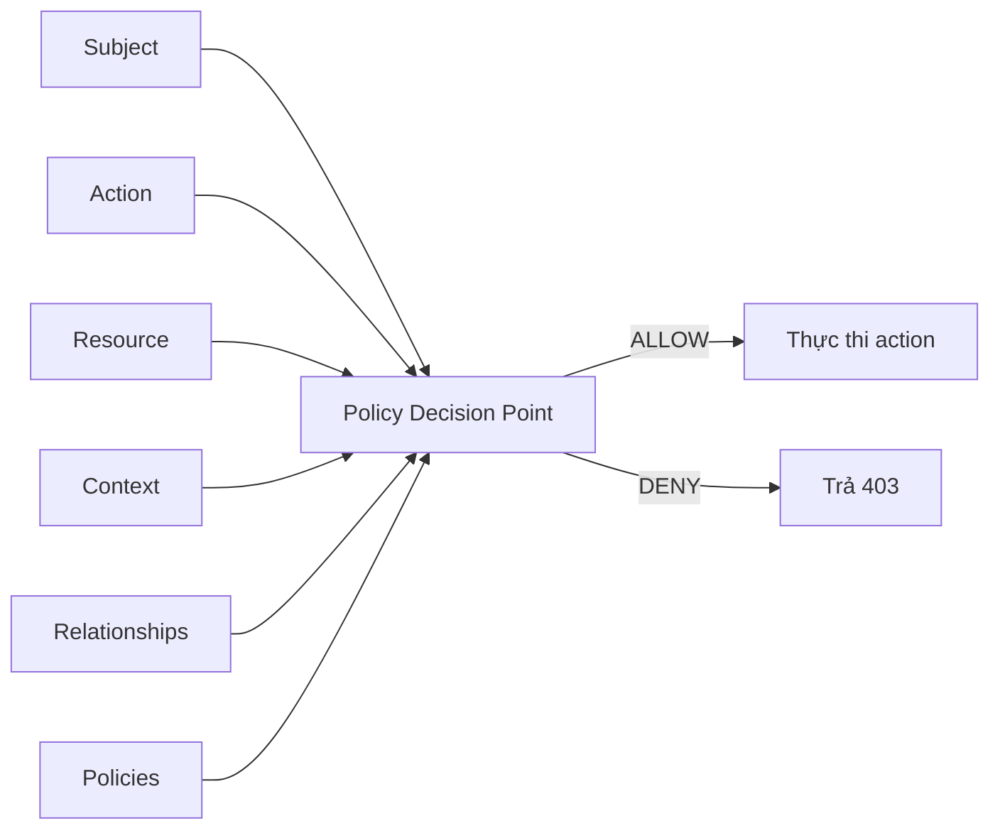
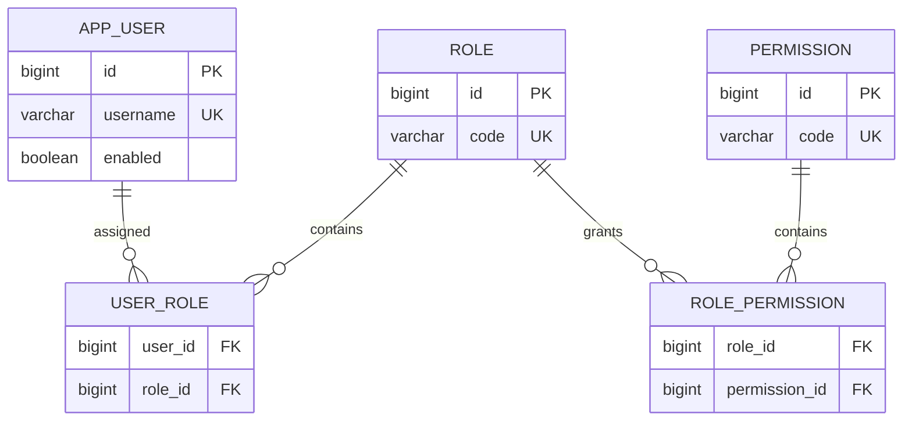
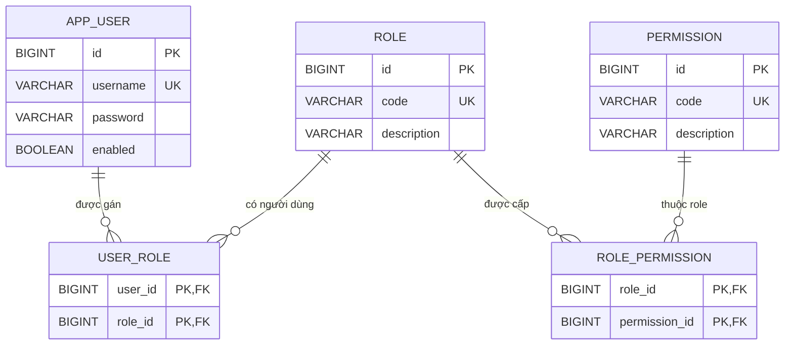
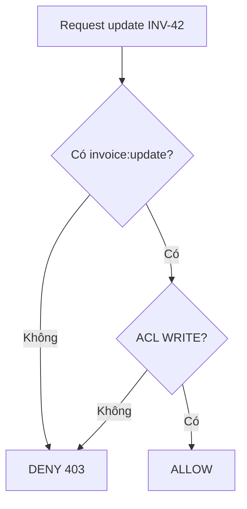
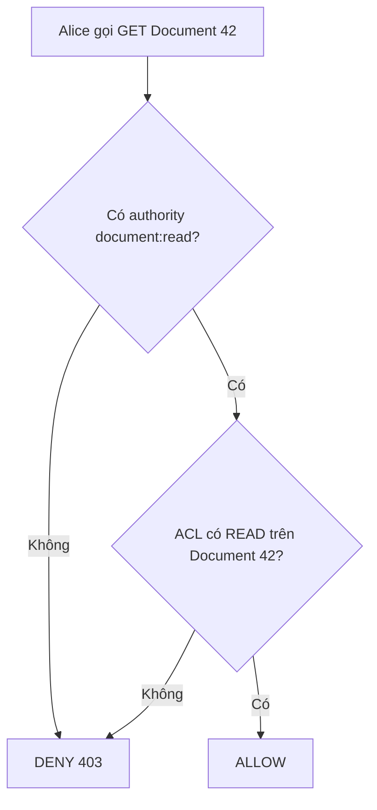
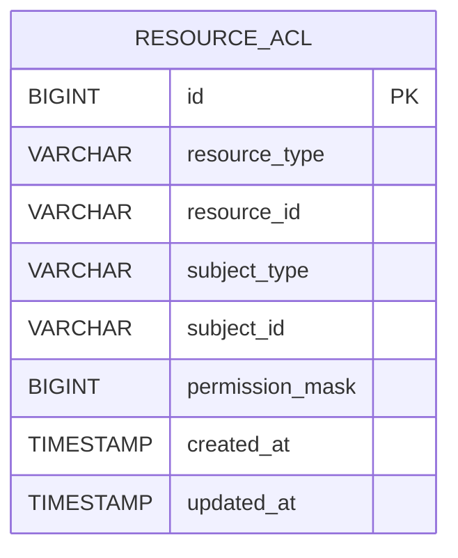
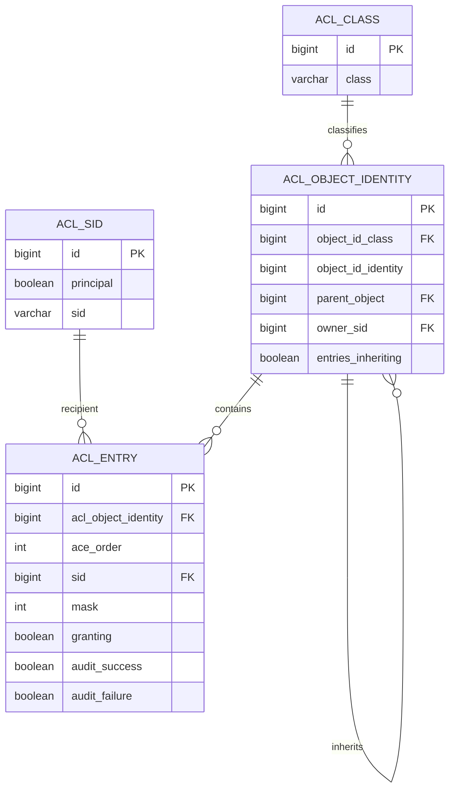
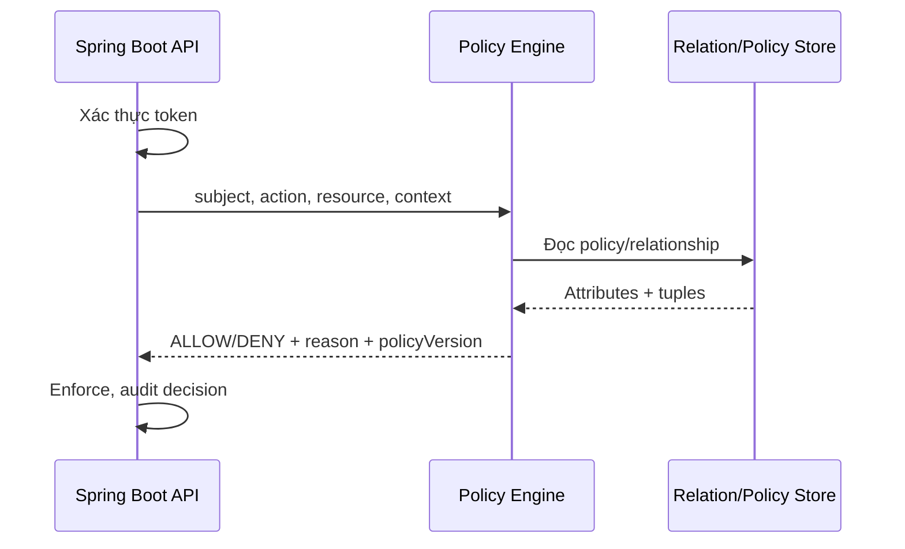
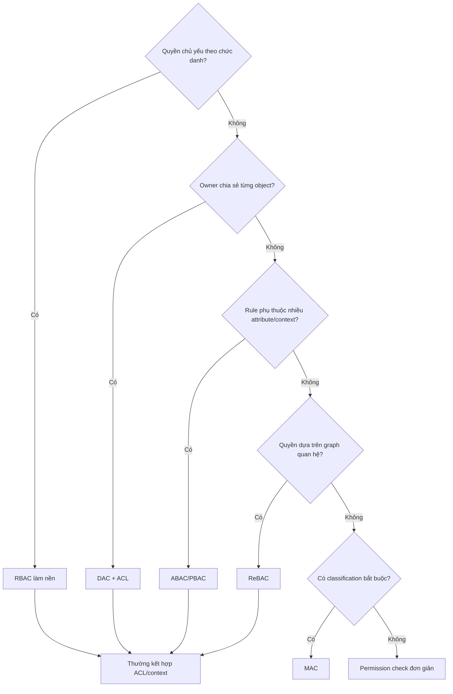

Authorization trả lời câu hỏi: **một principal đã được xác thực có được phép thực hiện action trên resource cụ thể trong context hiện tại hay không?** Tài liệu này phân biệt các mô hình access control phổ biến, sau đó đi sâu vào hai mô hình thường gặp nhất trong ứng dụng Spring Boot: **RBAC** và **ACL**.

> [!NOTE]
> Ví dụ dùng API của Spring Boot 3.x và Spring Security 6.x. Các khái niệm và phần lớn cấu hình vẫn áp dụng cho Spring Boot 4/Spring Security 7; hãy kiểm tra migration guide nếu API nhỏ thay đổi theo phiên bản.

## Mục lục

- [1. Mental model chung](#1-mental-model-chung)
  - [Authentication khác authorization](#11-authentication-khác-authorization)
  - [Một quyết định authorization gồm những gì](#12-một-quyết-định-authorization-gồm-những-gì)
- [2. Bản đồ các mô hình access control](#2-bản-đồ-các-mô-hình-access-control)
  - [DAC — Discretionary Access Control](#21-dac--discretionary-access-control)
  - [MAC — Mandatory Access Control](#22-mac--mandatory-access-control)
  - [RBAC — Role-Based Access Control](#23-rbac--role-based-access-control)
  - [ACL — Access Control List](#24-acl--access-control-list)
  - [PBAC — Policy-Based Access Control](#25-pbac--policy-based-access-control)
  - [Context-Based Access Control](#26-context-based-access-control)
  - [ReBAC — Relationship-Based Access Control](#27-rebac--relationship-based-access-control)
  - [Bảng so sánh nhanh](#28-bảng-so-sánh-nhanh)
- [3. RBAC chuyên sâu](#3-rbac-chuyên-sâu)
  - [Mô hình dữ liệu](#31-mô-hình-dữ-liệu)
  - [Role không phải permission](#32-role-không-phải-permission)
  - [Role hierarchy và separation of duties](#33-role-hierarchy-và-separation-of-duties)
- [4. Triển khai RBAC trong Spring Boot](#4-triển-khai-rbac-trong-spring-boot)
  - [Bước 1 — thiết kế permission vocabulary](#41-bước-1--thiết-kế-permission-vocabulary)
  - [Bước 2 — tạo database schema](#42-bước-2--tạo-database-schema)
  - [Bước 3 — nạp authority khi đăng nhập](#43-bước-3--nạp-authority-khi-đăng-nhập)
  - [Bước 4 — cấu hình request và method security](#44-bước-4--cấu-hình-request-và-method-security)
  - [Bước 5 — đóng gói rule bằng meta-annotation](#45-bước-5--đóng-gói-rule-bằng-meta-annotation)
  - [Bước 6 — role hierarchy](#46-bước-6--role-hierarchy)
  - [RBAC với JWT](#47-rbac-với-jwt)
  - [Cache và thay đổi quyền thời gian thực](#48-cache-và-thay-đổi-quyền-thời-gian-thực)
- [5. ACL chuyên sâu](#5-acl-chuyên-sâu)
  - [ACL giải quyết bài toán nào](#51-acl-giải-quyết-bài-toán-nào)
  - [Cấu trúc một ACE](#52-cấu-trúc-một-ace)
  - [Thứ tự đánh giá allow và deny](#53-thứ-tự-đánh-giá-allow-và-deny)
  - [RBAC và ACL phối hợp](#54-rbac-và-acl-phối-hợp)
- [6. Tự triển khai ACL trong Spring Boot](#6-tự-triển-khai-acl-trong-spring-boot)
  - [Bài toán cần giải quyết](#61-bài-toán-cần-giải-quyết)
  - [Cách lưu trực tiếp và vấn đề phát sinh](#62-cách-lưu-trực-tiếp-và-vấn-đề-phát-sinh)
  - [Bitmask giải quyết vấn đề gì](#63-bitmask-giải-quyết-vấn-đề-gì)
  - [Thiết kế bảng ACL](#64-thiết-kế-bảng-acl)
  - [Biểu diễn permission trong Java](#65-biểu-diễn-permission-trong-java)
  - [Đọc và tính quyền hiệu lực](#66-đọc-và-tính-quyền-hiệu-lực)
  - [Tích hợp với Spring Security](#67-tích-hợp-với-spring-security)
  - [Grant và revoke permission](#68-grant-và-revoke-permission)
  - [Kiểm thử và giới hạn](#69-kiểm-thử-và-giới-hạn)
- [7. Dùng Spring Security ACL module](#7-dùng-spring-security-acl-module)
  - [Bốn bảng cốt lõi](#71-bốn-bảng-cốt-lõi)
  - [Dependency và cấu hình](#72-dependency-và-cấu-hình)
  - [Tạo ACL và ACE](#73-tạo-acl-và-ace)
  - [Kiểm tra bằng hasPermission](#74-kiểm-tra-bằng-haspermission)
  - [Khi nào không nên dùng module này](#75-khi-nào-không-nên-dùng-module-này)
- [8. Query danh sách có phân quyền](#8-query-danh-sách-có-phân-quyền)
- [9. Context-Based, PBAC và ReBAC trong Spring](#9-context-based-pbac-và-rebac-trong-spring)
- [10. Kiểm thử authorization](#10-kiểm-thử-authorization)
- [11. Security checklist và anti-pattern](#11-security-checklist-và-anti-pattern)
  - [Checklist](#checklist)
  - [Anti-pattern](#anti-pattern)
- [12. Chọn mô hình nào](#12-chọn-mô-hình-nào)
- [13. Tóm tắt](#13-tóm-tắt)
  - [Tài liệu liên quan](#tài-liệu-liên-quan)

---

## 1. Mental model chung

### 1.1. Authentication khác authorization

- **Authentication** xác minh danh tính: “đây có thật là Alice không?”.
- **Authorization** kiểm tra quyền: “Alice có được duyệt hóa đơn `INV-42` không?”.

Spring Security lưu danh tính đã xác thực trong `Authentication`. Object này chứa principal và tập `GrantedAuthority`. Sau đó `AuthorizationManager`, expression trong `@PreAuthorize`, hoặc ACL service dùng dữ liệu đó để ra quyết định.

> [!WARNING]
> Đã đăng nhập không có nghĩa là được truy cập mọi resource. Nếu API chỉ gọi `.authenticated()` mà không kiểm tra quyền hoặc ownership, ứng dụng rất dễ mắc **IDOR/BOLA**: người dùng đổi ID trong URL để đọc object của người khác.

### 1.2. Một quyết định authorization gồm những gì

Có thể chuẩn hóa mọi rule thành năm thành phần:

```text
Decision = f(subject, action, resource, context, relationships)

subject       ai đang gọi? user, service account, role, group
action        đang làm gì? read, create, update, approve, delete
resource      tác động lên gì? Invoice, Project, File, API
context       thời gian, IP, device, risk score, MFA level
relationships owner, member, manager-of, parent-of, shared-with
```

Ví dụ:

> Cho phép Alice `APPROVE` invoice `INV-42` nếu Alice có permission `invoice:approve`, Alice không phải người tạo invoice, số tiền dưới hạn mức phê duyệt, và phiên đăng nhập đã hoàn tất MFA.

Rule này không còn là RBAC thuần túy. Nó kết hợp RBAC, context và relationship. Hệ thống thực tế thường là **hybrid**, không bắt buộc chỉ dùng đúng một mô hình.



- **PEP — Policy Enforcement Point**: nơi chặn request, ví dụ `AuthorizationFilter` hoặc method interceptor.
- **PDP — Policy Decision Point**: nơi tính quyết định allow/deny.
- **PIP — Policy Information Point**: nơi cung cấp dữ liệu cho policy, ví dụ database hoặc risk service.

## 2. Bản đồ các mô hình access control

### 2.1. DAC — Discretionary Access Control

Trong DAC, **chủ sở hữu resource tự quyết định** ai được truy cập. Google Drive là ví dụ trực quan: người tạo file chia sẻ file cho user hoặc group khác.

```text
Alice sở hữu File-1
└── Alice cấp Bob quyền READ
    └── tùy policy, Bob có thể hoặc không thể chia sẻ tiếp
```

ACL thường là cơ chế lưu trữ để hiện thực DAC. Tuy nhiên hai khái niệm không đồng nhất:

- DAC là **mô hình quản trị quyền**: owner có quyền tùy nghi cấp lại.
- ACL là **cấu trúc quyền gắn với object**: object nào có danh sách ACE của object đó.

DAC phù hợp với collaboration, file sharing và project workspace. Nhược điểm chính là quyền có thể lan truyền khó kiểm soát nếu cho phép người nhận chia sẻ tiếp.

### 2.2. MAC — Mandatory Access Control

Trong MAC, policy trung tâm quyết định quyền dựa trên **security label**. Owner không được tự ý hạ hoặc bỏ policy.

Ví dụ:

- Subject có clearance `SECRET`.
- Document có classification `TOP_SECRET`.
- Policy yêu cầu clearance của subject phải đủ cao và compartment phải khớp.

MAC phổ biến trong quốc phòng, chính phủ và hệ điều hành có SELinux. Nó chặt chẽ nhưng ít linh hoạt hơn ứng dụng doanh nghiệp thông thường.

> [!NOTE]
> “Admin có mọi quyền” chưa đủ để gọi là MAC. MAC cần policy bắt buộc, label và cơ chế enforcement mà owner/resource admin không thể tùy ý vượt qua.

### 2.3. RBAC — Role-Based Access Control

RBAC gán user vào **role**, rồi role chứa **permission**:

```text
User ──► Role ──► Permission ──► Action trên Resource Type
Alice    FINANCE_MANAGER        invoice:approve
```

RBAC phù hợp khi quyền đi theo chức danh hoặc trách nhiệm ổn định: kế toán, hỗ trợ, quản trị viên, kiểm toán viên.

Điểm mạnh là dễ quản trị hàng loạt. Điểm yếu là **role explosion**: tạo role mới cho mọi tổ hợp ngoại lệ và phạm vi dữ liệu.

### 2.4. ACL — Access Control List

Mỗi resource instance có danh sách **ACE — Access Control Entry**. Mỗi ACE nói subject nào được hoặc bị từ chối permission nào.

```text
Invoice INV-42 ACL
├── USER:alice      → READ, WRITE
├── USER:bob        → READ
├── ROLE:AUDITOR    → READ
└── USER:eve        → DENY READ
```

ACL cho phép object-level authorization chính xác. Chi phí đổi lại là số ACE có thể rất lớn, query phức tạp hơn và cache invalidation khó hơn RBAC.

### 2.5. PBAC — Policy-Based Access Control

PBAC đưa rule vào các **policy có thể quản trị độc lập** với code nghiệp vụ. Một policy có thể kết hợp role, attribute, context và relationship:

```text
ALLOW invoice.approve WHEN
  subject.department == resource.department
  AND subject.approvalLimit >= resource.amount
  AND context.mfa == true
  AND context.time within businessHours
```

Thuật ngữ PBAC đôi khi được dùng gần nghĩa với ABAC — Attribute-Based Access Control. Cách hiểu thực dụng:

- **ABAC** nhấn mạnh dữ liệu đầu vào là attribute.
- **PBAC** nhấn mạnh rule được biểu diễn, quản trị và đánh giá như policy.

OPA/Rego, Cedar và các policy engine là lựa chọn khi rule cần thay đổi độc lập với deployment hoặc cần dùng chung giữa nhiều service.

### 2.6. Context-Based Access Control

Context-Based Access Control dùng thông tin **tại thời điểm request**:

- IP hoặc network zone.
- Thời gian trong ngày.
- Device trust.
- Geo-location.
- Mức rủi ro.
- Trạng thái MFA.

Ví dụ: role `SUPPORT` chỉ được xem PII khi đang dùng thiết bị công ty, trong giờ trực và ticket đã được gán cho họ.

Context thường là một phần của ABAC/PBAC, không nhất thiết là hệ thống độc lập.

### 2.7. ReBAC — Relationship-Based Access Control

ReBAC quyết định dựa trên quan hệ giữa subject và resource. Quan hệ có thể trực tiếp hoặc đi qua graph:

```text
Alice ──member_of──► Team A ──owns──► Project P ──contains──► Document D
```

Nếu policy nói “member của team sở hữu project được đọc document”, Alice được đọc `D` nhờ đường đi trên graph.

ReBAC phù hợp với collaboration, social network, organization tree và hệ thống kiểu Google Zanzibar. Khi quan hệ sâu, nhiều loại và cần truy vấn ở quy mô lớn, một authorization graph chuyên dụng thường phù hợp hơn việc nối nhiều bảng JPA trong mỗi request.

### 2.8. Bảng so sánh nhanh

| Mô hình | Quyền dựa trên | Granularity | Điểm mạnh | Rủi ro chính |
|---|---|---:|---|---|
| DAC | quyết định của owner | object | chia sẻ linh hoạt | quyền lan truyền khó kiểm soát |
| MAC | label và policy bắt buộc | object/data | kiểm soát rất chặt | cứng, chi phí vận hành cao |
| RBAC | role → permission | resource type/action | dễ quản trị theo chức danh | role explosion, thiếu object scope |
| ACL | ACE trên từng object | object instance | chia sẻ chính xác | nhiều row, query/cache phức tạp |
| PBAC | policy tổng hợp | tùy policy | rule linh hoạt, quản trị tập trung | khó debug và test policy |
| Context-Based | request context | request/action | adaptive, zero-trust friendly | context giả mạo hoặc không ổn định |
| ReBAC | graph quan hệ | object/graph | tự nhiên cho collaboration | graph traversal và consistency |

## 3. RBAC chuyên sâu

### 3.1. Mô hình dữ liệu

RBAC cơ bản có bốn quan hệ:



Trong NIST RBAC, có thể mở rộng thêm:

- **Role hierarchy**: role cao bao hàm role thấp.
- **Static Separation of Duties — SSD**: một user không được đồng thời có hai role xung đột.
- **Dynamic Separation of Duties — DSD**: user có thể sở hữu nhiều role nhưng không được kích hoạt cùng lúc trong một session hoặc transaction.
- **Cardinality constraint**: giới hạn số user có một role nhạy cảm.

### 3.2. Role không phải permission

Role mô tả **trách nhiệm tổ chức**. Permission mô tả **khả năng kỹ thuật**.

```text
Role:       FINANCE_MANAGER
Permissions:
  invoice:read
  invoice:approve
  payment:read
```

Nên viết code kiểm tra permission:

```java
@PreAuthorize("hasAuthority('invoice:approve')")
void approveInvoice(long invoiceId) { }
```

Không nên rải role khắp business service:

```java
@PreAuthorize("hasAnyRole('ADMIN', 'FINANCE_MANAGER', 'CFO', 'SUPER_USER')")
void approveInvoice(long invoiceId) { }
```

Khi tổ chức đổi role nhưng capability không đổi, cách thứ nhất chỉ cần cập nhật mapping trong database. Code không phải redeploy.

> [!TIP]
> Dùng role để **quản trị assignment**, dùng permission để **enforce trong code**. Đây là cách giảm coupling giữa sơ đồ tổ chức và logic ứng dụng.

### 3.3. Role hierarchy và separation of duties

Role hierarchy tiện lợi nhưng dễ vô tình cấp quá nhiều quyền:

```text
ADMIN > MANAGER > USER
```

Nếu `MANAGER` về sau nhận quyền đọc lương, mọi `ADMIN` cũng tự động nhận quyền đó. Vì vậy hierarchy chỉ nên diễn tả quan hệ bao hàm thật sự ổn định.

Với quy trình maker-checker, chỉ role là chưa đủ:

```text
Người tạo invoice != người duyệt invoice
```

Rule này phụ thuộc vào relationship giữa user và object. Hãy kết hợp permission với kiểm tra creator:

```java
@PreAuthorize("hasAuthority('invoice:approve') and " +
              "@invoiceAuth.isNotCreator(authentication, #invoiceId)")
public void approve(long invoiceId) { }
```

## 4. Triển khai RBAC trong Spring Boot

### 4.1. Bước 1 — thiết kế permission vocabulary

Dùng format ổn định `resource:action`:

```text
invoice:read
invoice:create
invoice:update
invoice:approve
invoice:delete
acl:grant
acl:revoke
```

Tránh permission mơ hồ như `CAN_MANAGE` hoặc `FULL_ACCESS`. Tên permission là public contract giữa database, token, backend và đôi khi cả frontend.

> [!NOTE]
> Frontend có thể dùng permission để ẩn nút, nhưng backend vẫn phải enforce. Ẩn nút không phải security boundary.

### 4.2. Bước 2 — tạo database schema

RBAC cần ba bảng chính và hai bảng liên kết:



| Bảng | Vai trò | Ví dụ dữ liệu |
|---|---|---|
| `app_user` | Lưu tài khoản đăng nhập | `alice` |
| `role` | Gom nhóm trách nhiệm nghiệp vụ | `FINANCE_MANAGER` |
| `permission` | Mô tả một hành động được phép | `invoice:approve` |
| `user_role` | Gán nhiều role cho user | `alice → FINANCE_MANAGER` |
| `role_permission` | Gán nhiều permission cho role | `FINANCE_MANAGER → invoice:approve` |

Hai bảng liên kết dùng khóa chính kép để ngăn cùng một role hoặc permission bị gán lặp. Trong database thực tế, foreign key cũng phải được khai báo để không tạo ra assignment trỏ tới user, role hoặc permission không tồn tại.

Query nạp permission hiệu lực:

```sql
SELECT DISTINCT p.code
FROM user_role ur
JOIN role_permission rp ON rp.role_id = ur.role_id
JOIN permission p ON p.id = rp.permission_id
WHERE ur.user_id = :userId;
```

Dùng Flyway hoặc Liquibase để version schema và seed permission. Không tự động tạo permission từ annotation khi startup trong production, vì typo trong code có thể âm thầm tạo một capability mới.

### 4.3. Bước 3 — nạp authority khi đăng nhập

Tách repository chỉ đọc projection cần thiết:

```java
public interface AuthorizationQueryRepository {
    Set<String> findRoleCodes(long userId);
    Set<String> findPermissionCodes(long userId);
}
```

Tạo principal chứa `userId` và tập authority:

```java
public record AppPrincipal(
        long userId,
        String username,
        String password,
        Collection<? extends GrantedAuthority> authorities
) implements UserDetails {

    @Override public String getUsername() { return username; }
    @Override public String getPassword() { return password; }
    @Override public Collection<? extends GrantedAuthority> getAuthorities() {
        return authorities;
    }
}
```

`UserDetailsService` nạp cả role lẫn permission:

```java
@Service
@RequiredArgsConstructor
public class DatabaseUserDetailsService implements UserDetailsService {
    private final UserRepository users;
    private final AuthorizationQueryRepository authorization;

    @Override
    @Transactional(readOnly = true)
    public UserDetails loadUserByUsername(String username) {
        AppUser user = users.findEnabledByUsername(username)
                .orElseThrow(() -> new UsernameNotFoundException(username));

        Set<GrantedAuthority> authorities = new HashSet<>();
        authorization.findRoleCodes(user.getId()).stream()
                .map(role -> new SimpleGrantedAuthority("ROLE_" + role))
                .forEach(authorities::add);
        authorization.findPermissionCodes(user.getId()).stream()
                .map(SimpleGrantedAuthority::new)
                .forEach(authorities::add);

        return new AppPrincipal(
                user.getId(), user.getUsername(),
                user.getPassword(), Set.copyOf(authorities));
    }
}
```

### 4.4. Bước 4 — cấu hình request và method security

```java
@Configuration
@EnableMethodSecurity
public class SecurityConfig {

    @Bean
    SecurityFilterChain securityFilterChain(HttpSecurity http) throws Exception {
        return http
                .csrf(csrf -> csrf.disable()) // Chỉ phù hợp API stateless không dùng cookie
                .authorizeHttpRequests(auth -> auth
                        .requestMatchers("/actuator/health").permitAll()
                        .requestMatchers(HttpMethod.GET, "/api/invoices/**")
                            .hasAuthority("invoice:read")
                        .requestMatchers(HttpMethod.POST, "/api/invoices")
                            .hasAuthority("invoice:create")
                        .anyRequest().authenticated())
                .oauth2ResourceServer(oauth2 -> oauth2.jwt(Customizer.withDefaults()))
                .build();
    }
}
```

Request-level rule bảo vệ bề mặt HTTP. Method-level rule bảo vệ use case kể cả khi được gọi từ controller khác, scheduler hoặc message consumer:

```java
@Service
@RequiredArgsConstructor
public class InvoiceService {
    private final InvoiceRepository invoices;

    @PreAuthorize("hasAuthority('invoice:approve')")
    @Transactional
    public void approve(long invoiceId) {
        Invoice invoice = invoices.findById(invoiceId)
                .orElseThrow(InvoiceNotFoundException::new);
        invoice.approve();
    }
}
```

> [!IMPORTANT]
> Giữ rule quan trọng ở service layer. Controller rule chỉ là lớp phòng thủ sớm. Ngoài ra, method security chạy qua Spring AOP proxy; self-invocation `this.approve(...)` không đi qua proxy nên có thể bỏ qua annotation.

### 4.5. Bước 5 — đóng gói rule bằng meta-annotation

Meta-annotation làm code dễ đọc và giảm typo:

```java
@Target({ElementType.METHOD, ElementType.TYPE})
@Retention(RetentionPolicy.RUNTIME)
@PreAuthorize("hasAuthority('invoice:approve')")
public @interface CanApproveInvoice {
}
```

```java
@CanApproveInvoice
@Transactional
public void approve(long invoiceId) {
    // business logic
}
```

Nếu permission có tham số động, dùng bean trong SpEL thay vì viết expression dài ở mọi method.

### 4.6. Bước 6 — role hierarchy

Spring Security có `RoleHierarchy`:

```java
@Bean
static RoleHierarchy roleHierarchy() {
    return RoleHierarchyImpl.fromHierarchy("""
        ROLE_ADMIN > ROLE_MANAGER
        ROLE_MANAGER > ROLE_USER
        """);
}

@Bean
static MethodSecurityExpressionHandler methodSecurityExpressionHandler(
        RoleHierarchy roleHierarchy) {
    var handler = new DefaultMethodSecurityExpressionHandler();
    handler.setRoleHierarchy(roleHierarchy);
    return handler;
}
```

Với mapping role → permission lưu trong database, thường nên **expand permission khi tạo `Authentication`** thay vì hard-code toàn bộ mapping trong `RoleHierarchy`. `RoleHierarchy` phù hợp nhất cho hierarchy nhỏ và ổn định.

### 4.7. RBAC với JWT

Resource server có thể map claim thành authority:

```json
{
  "sub": "alice",
  "roles": ["FINANCE_MANAGER"],
  "permissions": ["invoice:read", "invoice:approve"],
  "exp": 1770000000
}
```

```java
@Bean
JwtAuthenticationConverter jwtAuthenticationConverter() {
    JwtGrantedAuthoritiesConverter scopes = new JwtGrantedAuthoritiesConverter();

    JwtAuthenticationConverter converter = new JwtAuthenticationConverter();
    converter.setJwtGrantedAuthoritiesConverter(jwt -> {
        Set<GrantedAuthority> result = new HashSet<>(scopes.convert(jwt));

        jwt.getClaimAsStringList("roles").stream()
                .map(role -> new SimpleGrantedAuthority("ROLE_" + role))
                .forEach(result::add);

        jwt.getClaimAsStringList("permissions").stream()
                .map(SimpleGrantedAuthority::new)
                .forEach(result::add);

        return result;
    });
    return converter;
}
```

Đăng ký converter:

```java
.oauth2ResourceServer(oauth2 -> oauth2
    .jwt(jwt -> jwt.jwtAuthenticationConverter(jwtAuthenticationConverter())))
```

JWT là snapshot quyền tại thời điểm phát hành. Nếu admin thu hồi role, token cũ vẫn có quyền tới khi hết hạn. Các lựa chọn:

- Access token ngắn hạn.
- Token version/security stamp và kiểm tra server-side.
- Introspection/opaque token cho quyền cần revoke gần real-time.
- Deny-list cho sự cố khẩn cấp.
- Không nhét hàng nghìn object ID hoặc ACL entry vào JWT.

### 4.8. Cache và thay đổi quyền thời gian thực

Có ba mức cache khác nhau:

1. `Authentication` trong session hoặc token.
2. Cache mapping user → roles/permissions.
3. Cache policy/ACL decision.

Khi grant/revoke quyền, phải xác định mức nào cần invalidation. Cache TTL không thay thế invalidation với quyền nhạy cảm.

Một chiến lược phổ biến:

```text
Grant/revoke role
    ├── commit database transaction
    ├── publish AuthorizationChanged(userId)
    ├── evict distributed cache
    └── tăng authz_version để token/session cũ bị từ chối
```

## 5. ACL chuyên sâu

### 5.1. ACL giải quyết bài toán nào

RBAC nói “Alice có thể đọc invoice”. ACL nói “Alice có thể đọc **invoice 42**, nhưng không thể đọc invoice 43”.

Các use case điển hình:

- Owner chia sẻ một document cho user khác.
- Auditor chỉ được xem một số case được giao.
- Project private chỉ cho member cụ thể.
- Support engineer chỉ được mở ticket đã assign.

### 5.2. Cấu trúc một ACE

Một ACE nên chứa ít nhất:

```text
(resource_type, resource_id, subject_type, subject_id, permission, effect)
```

Ví dụ:

```text
(INVOICE, 42, USER, alice, READ, ALLOW)
(INVOICE, 42, ROLE, AUDITOR, READ, ALLOW)
(INVOICE, 42, USER, eve, READ, DENY)
```

Có thể thêm thời hạn, người cấp, lý do và audit timestamp.

### 5.3. Thứ tự đánh giá allow và deny

Hãy định nghĩa semantics trước khi code. Một policy dễ hiểu:

1. Không tìm thấy rule phù hợp → `DENY`.
2. Explicit `DENY` khớp subject và permission → `DENY`.
3. `ADMINISTER` hoặc wildcard grant → `ALLOW`.
4. Explicit `ALLOW` → `ALLOW`.
5. Nếu có parent ACL, đánh giá parent.
6. Còn lại → `DENY`.

Không nên phụ thuộc vào thứ tự row ngẫu nhiên từ database. Nếu dùng deny override, query và code phải thể hiện rõ điều đó.

> [!WARNING]
> Kết hợp user grant và role deny cần rule ưu tiên rõ ràng. Nếu team không thực sự cần explicit deny, chỉ hỗ trợ grant và default-deny thường đơn giản, ít bất ngờ hơn.

### 5.4. RBAC và ACL phối hợp

Mô hình hybrid khuyên dùng:

```text
ALLOW = RBAC capability AND object scope

invoice:read              AND ACL READ trên INV-42
invoice:update            AND ACL WRITE trên INV-42
invoice:approve           AND không phải người tạo invoice
```

RBAC là coarse-grained gate. ACL thu hẹp object nào được thao tác. Không nên để ACL `READ` tự động cấp capability đọc invoice cho một principal vốn không thuộc module invoice, trừ khi đó là policy chia sẻ được chủ ý thiết kế.



## 6. Tự triển khai ACL trong Spring Boot

Phần này xây dựng một ACL đơn giản cho chức năng chia sẻ document. Trước hết, hãy xác định dữ liệu cần lưu và luồng kiểm tra quyền từ đầu đến cuối.

Mục tiêu nghiệp vụ:

```text
Alice có thể READ và WRITE Document 42
ROLE_EDITOR có thể READ Document 42
Bob không có ACE phù hợp nên bị từ chối
```

Trong ví dụ này, ACL chỉ lưu **grant** và áp dụng **default deny**:

```text
Có quyền phù hợp     → ALLOW
Không có quyền       → DENY
Không có ACL entry   → DENY
```

Cách này cố ý chưa hỗ trợ explicit `DENY`. Deny override làm precedence giữa user và role phức tạp hơn; chỉ thêm khi có yêu cầu nghiệp vụ rõ ràng.

### 6.1. Bài toán cần giải quyết

RBAC chỉ cho biết Alice có capability chung như `document:read`. Nó chưa trả lời Alice được đọc document nào.

ACL bổ sung object scope:

```text
RBAC: Alice có document:read không?
ACL:  Alice có READ trên Document 42 không?
```

Một request chỉ được phép khi cả hai điều kiện đều đúng:



Một ACL entry — thường viết tắt là **ACE** — cần xác định:

| Thành phần | Ý nghĩa | Ví dụ |
|---|---|---|
| Resource type | Loại object | `DOCUMENT` |
| Resource ID | Object cụ thể | `42` |
| Subject type | Quyền cấp cho user hay role | `USER` |
| Subject ID | Subject nhận quyền | `alice` |
| Permissions | Các action được phép | `READ`, `WRITE` |

### 6.2. Cách lưu trực tiếp và vấn đề phát sinh

Cách dễ nghĩ nhất là mỗi permission thành một row:

```text
resource_type  resource_id  subject_type  subject_id  permission
DOCUMENT       42           USER          alice       READ
DOCUMENT       42           USER          alice       WRITE
DOCUMENT       42           ROLE          ROLE_EDITOR READ
```

Thiết kế này hoàn toàn hợp lệ. Nó dễ đọc, dễ query và dễ audit từng permission.

Vấn đề xuất hiện khi một subject có nhiều permission trên cùng resource. Ví dụ 100.000 document, mỗi document được chia sẻ cho 10 subject, mỗi subject có trung bình 4 permission:

```text
100.000 × 10 × 4 = 4.000.000 ACL rows
```

Các row lặp lại gần như toàn bộ các cột:

```text
DOCUMENT | 42 | USER | alice | READ
DOCUMENT | 42 | USER | alice | WRITE
DOCUMENT | 42 | USER | alice | DELETE
DOCUMENT | 42 | USER | alice | SHARE
```

Điểm lặp duy nhất là permission. Nếu tập permission nhỏ và ổn định, ta có thể gộp bốn row trên thành một row.

> [!NOTE]
> Nhiều row không mặc định là chậm. Database có index phù hợp vẫn xử lý tốt hàng triệu row. Chỉ tối ưu khi storage, index size hoặc throughput ACL thực sự là vấn đề đã đo được.

### 6.3. Bitmask giải quyết vấn đề gì

Bitmask gộp nhiều permission của cùng một cặp `resource-subject` vào một số nguyên:

```text
Trước:
DOCUMENT | 42 | USER | alice | READ
DOCUMENT | 42 | USER | alice | WRITE

Sau:
DOCUMENT | 42 | USER | alice | permission_mask = 3
```

Mỗi permission chiếm một bit:

| Permission | Binary | Decimal |
|---|---:|---:|
| `READ` | `0001` | 1 |
| `WRITE` | `0010` | 2 |
| `DELETE` | `0100` | 4 |
| `SHARE` | `1000` | 8 |

Alice có `READ + WRITE`:

```text
READ       0001
WRITE      0010
           ---- OR
Mask       0011 = 3
```

Bitmask giải quyết ba việc cụ thể:

1. **Giảm số row**: một subject-resource chỉ cần một ACE.
2. **Kiểm tra nhanh**: dùng phép `AND` để biết một bit có bật hay không.
3. **Hợp nhất quyền**: dùng phép `OR` để cộng quyền trực tiếp và quyền từ role.

Bitmask không thay thế ACL. ACL vẫn xác định resource và subject; bitmask chỉ thay cách lưu cột permissions.

| ACL quyết định | Bitmask quyết định |
|---|---|
| Quyền thuộc resource nào? | Permission nào đang bật? |
| Quyền cấp cho user/role nào? | Cách gộp và kiểm tra các permission |

### 6.4. Thiết kế bảng ACL

Mỗi row đại diện cho một subject trên một resource:



PostgreSQL schema:

```sql
CREATE TABLE resource_acl (
    id              BIGSERIAL PRIMARY KEY,
    resource_type   VARCHAR(80) NOT NULL,
    resource_id     VARCHAR(100) NOT NULL,
    subject_type    VARCHAR(20) NOT NULL,
    subject_id      VARCHAR(120) NOT NULL,
    permission_mask BIGINT NOT NULL DEFAULT 0,
    created_at      TIMESTAMPTZ NOT NULL DEFAULT now(),
    updated_at      TIMESTAMPTZ NOT NULL DEFAULT now(),

    CONSTRAINT ck_acl_subject_type
        CHECK (subject_type IN ('USER', 'ROLE')),
    CONSTRAINT ck_permission_mask_non_negative
        CHECK (permission_mask >= 0),
    CONSTRAINT uk_resource_acl UNIQUE
        (resource_type, resource_id, subject_type, subject_id)
);

CREATE INDEX idx_resource_acl_lookup
    ON resource_acl
       (resource_type, resource_id, subject_type, subject_id);
```

Unique constraint bảo đảm Alice chỉ có một ACE trên Document 42. Khi grant thêm quyền, ta cập nhật `permission_mask` của row đó thay vì tạo row thứ hai.

Ví dụ dữ liệu:

| resource_type | resource_id | subject_type | subject_id | permission_mask |
|---|---|---|---|---:|
| `DOCUMENT` | `42` | `USER` | `alice` | 3 |
| `DOCUMENT` | `42` | `ROLE` | `ROLE_EDITOR` | 1 |

Mask `3` là `READ + WRITE`; mask `1` chỉ là `READ`.

### 6.5. Biểu diễn permission trong Java

Khai báo giá trị bit cố định:

```java
public enum Permission {
    READ(1L << 0),    // 0001 = 1
    WRITE(1L << 1),   // 0010 = 2
    DELETE(1L << 2),  // 0100 = 4
    SHARE(1L << 3);   // 1000 = 8

    private final long mask;

    Permission(long mask) {
        this.mask = mask;
    }

    public long mask() {
        return mask;
    }
}
```

> [!WARNING]
> Không dùng `ordinal()` để tính bit. Khi ai đó đổi thứ tự enum, dữ liệu cũ trong database sẽ đổi nghĩa. Giá trị bit là một phần của data contract và phải ổn định.

Utility chỉ cần bốn phép toán chính:

```java
public final class PermissionMask {
    private PermissionMask() {
    }

    public static long of(Permission... permissions) {
        long result = 0L;
        for (Permission permission : permissions) {
            result |= permission.mask();
        }
        return result;
    }

    public static boolean has(long grantedMask, Permission required) {
        return (grantedMask & required.mask()) == required.mask();
    }

    public static long add(long currentMask, Permission permission) {
        return currentMask | permission.mask();
    }

    public static long remove(long currentMask, Permission permission) {
        return currentMask & ~permission.mask();
    }
}
```

Công thức cần nhớ:

```text
Grant permission:  currentMask | permissionMask
Check permission: (grantedMask & requiredMask) == requiredMask
Revoke permission: currentMask & ~permissionMask
```

Ví dụ kiểm tra Alice có `READ`:

```text
Granted    0011
READ       0001
           ---- AND
Result     0001 == READ → ALLOW
```

Kiểm tra `DELETE`:

```text
Granted    0011
DELETE     0100
           ---- AND
Result     0000 != DELETE → DENY
```

### 6.6. Đọc và tính quyền hiệu lực

Alice có thể nhận quyền từ hai nguồn:

- ACE gán trực tiếp cho `USER alice`.
- ACE gán cho các role của Alice, ví dụ `ROLE_EDITOR`.

Repository đọc tất cả mask phù hợp trong một query:

```java
@Repository
@RequiredArgsConstructor
public class ResourceAclRepository {
    private final NamedParameterJdbcTemplate jdbc;

    public List<Long> findPermissionMasks(
            String resourceType,
            String resourceId,
            String username,
            Set<String> roles) {

        Set<String> roleSubjects = roles.isEmpty()
                ? Set.of("__NO_ROLE__")
                : roles;

        String sql = """
            SELECT permission_mask
            FROM resource_acl
            WHERE resource_type = :resourceType
              AND resource_id = :resourceId
              AND (
                    (subject_type = 'USER' AND subject_id = :username)
                 OR (subject_type = 'ROLE' AND subject_id IN (:roles))
              )
            """;

        MapSqlParameterSource params = new MapSqlParameterSource()
                .addValue("resourceType", resourceType)
                .addValue("resourceId", resourceId)
                .addValue("username", username)
                .addValue("roles", roleSubjects);

        return jdbc.queryForList(sql, params, Long.class);
    }
}
```

Sau đó gộp các mask bằng `OR`:

```text
USER:alice  → READ        → 0001
ROLE_EDITOR → WRITE       → 0010
                              OR
Effective permissions      = 0011 = READ + WRITE
```

```java
long effectiveMask = masks.stream()
        .reduce(0L, (left, right) -> left | right);
```

Nếu query không trả ACE nào, `effectiveMask` bằng `0`. Mọi permission check đều thất bại, đúng với nguyên tắc default deny.

### 6.7. Tích hợp với Spring Security

Authorization service đóng vai trò PDP: lấy subject từ `Authentication`, đọc ACL và đưa ra quyết định.

```java
@Component("acl")
@RequiredArgsConstructor
public class AclAuthorizationService {
    private static final Set<String> RESOURCE_TYPES =
            Set.of("DOCUMENT", "INVOICE", "PROJECT");

    private final ResourceAclRepository aclRepository;

    public boolean can(
            Authentication authentication,
            String resourceType,
            Object resourceId,
            Permission required) {

        if (authentication == null || !authentication.isAuthenticated()) {
            return false;
        }
        if (!RESOURCE_TYPES.contains(resourceType)) {
            return false;
        }

        Set<String> roles = authentication.getAuthorities().stream()
                .map(GrantedAuthority::getAuthority)
                .filter(authority -> authority.startsWith("ROLE_"))
                .collect(Collectors.toUnmodifiableSet());

        List<Long> masks = aclRepository.findPermissionMasks(
                resourceType,
                resourceId.toString(),
                authentication.getName(),
                roles);

        long effectiveMask = masks.stream()
                .reduce(0L, (left, right) -> left | right);

        return PermissionMask.has(effectiveMask, required);
    }
}
```

Để SpEL gọi enum dễ đọc hơn, expose các method theo use case:

```java
public boolean canReadDocument(
        Authentication authentication,
        UUID documentId) {
    return can(authentication, "DOCUMENT", documentId, Permission.READ);
}

public boolean canWriteDocument(
        Authentication authentication,
        UUID documentId) {
    return can(authentication, "DOCUMENT", documentId, Permission.WRITE);
}
```

Kết hợp RBAC và ACL tại service layer:

```java
@Service
@RequiredArgsConstructor
public class DocumentService {

    @PreAuthorize("hasAuthority('document:read') and " +
                  "@acl.canReadDocument(authentication, #documentId)")
    @Transactional(readOnly = true)
    public DocumentDto get(UUID documentId) {
        return loadDocument(documentId);
    }

    @PreAuthorize("hasAuthority('document:update') and " +
                  "@acl.canWriteDocument(authentication, #documentId)")
    @Transactional
    public void update(
            UUID documentId,
            UpdateDocumentCommand command) {
        // update document
    }
}
```

Luồng hoàn chỉnh:

```text
1. @PreAuthorize kiểm tra authority document:read
2. @acl đọc ACE của alice và các role
3. Các permission_mask được OR thành effectiveMask
4. effectiveMask & READ được kiểm tra
5. Đủ cả RBAC và ACL → method được chạy
```

> [!IMPORTANT]
> Enforce rule ở service layer, không chỉ ở controller. Method security chạy qua Spring AOP proxy, nên self-invocation như `this.get(...)` có thể bỏ qua interceptor.

### 6.8. Grant và revoke permission

Grant là bật thêm một bit. Revoke là tắt một bit.

```text
Mask hiện tại: READ              = 0001
Grant WRITE:   0001 OR 0010      = 0011
Revoke READ:   0011 AND NOT 0001 = 0010
```

Nên thực hiện trực tiếp trong SQL để tránh read-modify-write race.

Grant bằng PostgreSQL upsert:

```sql
INSERT INTO resource_acl (
    resource_type,
    resource_id,
    subject_type,
    subject_id,
    permission_mask
)
VALUES (
    :resourceType,
    :resourceId,
    :subjectType,
    :subjectId,
    :permissionMask
)
ON CONFLICT (resource_type, resource_id, subject_type, subject_id)
DO UPDATE SET
    permission_mask = resource_acl.permission_mask
                      | EXCLUDED.permission_mask,
    updated_at = now();
```

Revoke:

```sql
UPDATE resource_acl
SET permission_mask = permission_mask & ~:permissionMask,
    updated_at = now()
WHERE resource_type = :resourceType
  AND resource_id = :resourceId
  AND subject_type = :subjectType
  AND subject_id = :subjectId;
```

Sau revoke, có thể xóa ACE rỗng:

```sql
DELETE FROM resource_acl
WHERE resource_type = :resourceType
  AND resource_id = :resourceId
  AND subject_type = :subjectType
  AND subject_id = :subjectId
  AND permission_mask = 0;
```

Grant/revoke phải được bảo vệ bằng quyền quản trị riêng:

```java
@PreAuthorize("hasAuthority('acl:grant') and " +
              "@acl.can(authentication, #resourceType, " +
              "#resourceId, T(com.example.security.Permission).SHARE)")
@Transactional
public void grant(
        String resourceType,
        UUID resourceId,
        GrantAclCommand command) {
    validateSubject(command.subjectType(), command.subjectId());
    aclRepository.grant(/* ... */);
    auditPublisher.aclGranted(/* actor, resource, subject, permission */);
}
```

Các invariant cần bảo vệ:

- Không cho client truyền một numeric mask tùy ý; map tên permission sang enum ở server.
- Không grant cho subject không tồn tại.
- Không cho người chỉ có `READ` tự cấp `WRITE` hoặc `SHARE`.
- Revoke phải idempotent.
- Grant/revoke và audit event phải cùng transaction hoặc dùng transactional outbox.
- Nếu có cache ACL, evict sau khi transaction commit.

### 6.9. Kiểm thử và giới hạn

Unit test phép toán bit:

```java
class PermissionMaskTest {

    @Test
    void combinesAndChecksPermissions() {
        long mask = PermissionMask.of(
                Permission.READ,
                Permission.WRITE);

        assertThat(mask).isEqualTo(3L);
        assertThat(PermissionMask.has(mask, Permission.READ)).isTrue();
        assertThat(PermissionMask.has(mask, Permission.DELETE)).isFalse();
    }

    @Test
    void removesOnlyRequestedPermission() {
        long mask = PermissionMask.of(
                Permission.READ,
                Permission.WRITE);

        long result = PermissionMask.remove(mask, Permission.READ);

        assertThat(result).isEqualTo(Permission.WRITE.mask());
    }
}
```

Integration test ACL cần ít nhất các trường hợp:

| RBAC authority | ACL bit | Kỳ vọng |
|---|---|---|
| có | có | allow |
| thiếu | có | deny |
| có | thiếu | deny |
| có | không có ACE | deny |
| có | quyền đến từ role | allow |

Bitmask phù hợp khi:

- Tập permission nhỏ và ổn định.
- Một subject thường có nhiều permission trên cùng resource.
- Muốn giảm số ACL row và index entry.
- Cần hợp nhất permission từ user và role nhanh.

Không nên dùng bitmask khi:

- Permission được tạo động.
- Có hơn khoảng 63 permission.
- Cần query hoặc audit từng permission thường xuyên.
- Permission thay đổi liên tục khiến migration bit khó kiểm soát.

Các quy tắc cuối cùng:

- Không tái sử dụng bit của permission đã xóa.
- Đổi tên permission được, nhưng không đổi giá trị bit.
- API và audit log trả tên `READ`, `WRITE`, không chỉ trả số `3`.
- Dùng `long`/`BIGINT` và các bit `0..62` để tránh vấn đề signed integer.
- Nếu row-per-permission đã đủ tốt, giữ thiết kế đơn giản đó; bitmask là lựa chọn tối ưu storage, không phải yêu cầu bắt buộc của ACL.
## 7. Dùng Spring Security ACL module

Spring Security cung cấp module `spring-security-acl`. Module này dùng JDBC, bit mask permission, object identity và cache để giải quyết object-level ACL theo mô hình chuẩn.

### 7.1. Bốn bảng cốt lõi



Các khái niệm:

- `Sid`: principal hoặc authority nhận quyền.
- `ObjectIdentity`: cặp domain type + object ID.
- `Acl`: ACL của một object.
- `AccessControlEntry`: một ACE trong ACL.
- `Permission`: bit mask. Mặc định có `READ`, `WRITE`, `CREATE`, `DELETE`, `ADMINISTRATION`.
- `AclService`: đọc ACL.
- `MutableAclService`: tạo, sửa và xóa ACL.

> [!WARNING]
> Hãy dùng đúng file schema dành cho database và đúng version Spring Security của dự án. Identity/sequence query khác nhau giữa PostgreSQL, MySQL, Oracle và H2. Module truyền thống phù hợp nhất với numeric ID kiểu `long`; UUID/string ID cần kiểm chứng kỹ hoặc custom implementation.

### 7.2. Dependency và cấu hình

Maven:

```xml
<dependency>
    <groupId>org.springframework.security</groupId>
    <artifactId>spring-security-acl</artifactId>
</dependency>
<dependency>
    <groupId>org.springframework.boot</groupId>
    <artifactId>spring-boot-starter-jdbc</artifactId>
</dependency>
<dependency>
    <groupId>org.springframework</groupId>
    <artifactId>spring-context-support</artifactId>
</dependency>
```

Cấu hình các component chính:

```java
@Configuration
@EnableMethodSecurity
public class AclSecurityConfig {

    @Bean
    static MethodSecurityExpressionHandler methodSecurityExpressionHandler(
            AclPermissionEvaluator permissionEvaluator) {
        var handler = new DefaultMethodSecurityExpressionHandler();
        handler.setPermissionEvaluator(permissionEvaluator);
        return handler;
    }

    @Bean
    static AclPermissionEvaluator aclPermissionEvaluator(AclService aclService) {
        return new AclPermissionEvaluator(aclService);
    }

    @Bean
    static PermissionGrantingStrategy permissionGrantingStrategy() {
        return new DefaultPermissionGrantingStrategy(new ConsoleAuditLogger());
    }

    @Bean
    static AclAuthorizationStrategy aclAuthorizationStrategy() {
        return new AclAuthorizationStrategyImpl(
                new SimpleGrantedAuthority("ROLE_ACL_ADMIN"));
    }

    @Bean
    static AclCache aclCache(
            PermissionGrantingStrategy permissionGrantingStrategy,
            AclAuthorizationStrategy aclAuthorizationStrategy) {
        Cache springCache = new ConcurrentMapCache("aclCache");
        return new SpringCacheBasedAclCache(
                springCache,
                permissionGrantingStrategy,
                aclAuthorizationStrategy);
    }

    @Bean
    static LookupStrategy lookupStrategy(
            DataSource dataSource,
            AclCache aclCache,
            AclAuthorizationStrategy aclAuthorizationStrategy,
            PermissionGrantingStrategy permissionGrantingStrategy) {
        return new BasicLookupStrategy(
                dataSource,
                aclCache,
                aclAuthorizationStrategy,
                permissionGrantingStrategy);
    }

    @Bean
    static JdbcMutableAclService aclService(
            DataSource dataSource,
            LookupStrategy lookupStrategy,
            AclCache aclCache) {
        return new JdbcMutableAclService(dataSource, lookupStrategy, aclCache);
    }
}
```

`ConcurrentMapCache` chỉ phù hợp để minh họa hoặc chạy một instance. Với nhiều application instance, cần distributed cache hoặc event invalidation; nếu không mỗi node có thể giữ quyết định ACL cũ.

Với PostgreSQL dùng `BIGSERIAL`, có thể cần cấu hình identity query tương ứng với schema/version:

```java
service.setClassIdentityQuery(
    "select currval(pg_get_serial_sequence('acl_class', 'id'))");
service.setSidIdentityQuery(
    "select currval(pg_get_serial_sequence('acl_sid', 'id'))");
```

Đừng copy query này nếu migration dùng sequence tên riêng. Query phải khớp chính xác DDL thực tế.

### 7.3. Tạo ACL và ACE

ACL phải được tạo sau khi domain object đã có ID:

```java
@Service
@RequiredArgsConstructor
public class InvoiceAclAdminService {
    private final MutableAclService aclService;

    @Transactional
    public void createAclForInvoice(long invoiceId, String ownerUsername) {
        ObjectIdentity objectIdentity =
                new ObjectIdentityImpl(Invoice.class, invoiceId);

        MutableAcl acl = aclService.createAcl(objectIdentity);
        acl.setOwner(new PrincipalSid(ownerUsername));
        acl.insertAce(
                acl.getEntries().size(),
                BasePermission.ADMINISTRATION,
                new PrincipalSid(ownerUsername),
                true);
        acl.insertAce(
                acl.getEntries().size(),
                BasePermission.READ,
                new PrincipalSid(ownerUsername),
                true);

        aclService.updateAcl(acl);
    }

    @Transactional
    public void grantReadToUser(long invoiceId, String username) {
        ObjectIdentity oid = new ObjectIdentityImpl(Invoice.class, invoiceId);
        MutableAcl acl = (MutableAcl) aclService.readAclById(oid);

        acl.insertAce(
                acl.getEntries().size(),
                BasePermission.READ,
                new PrincipalSid(username),
                true);

        aclService.updateAcl(acl);
    }

    @Transactional
    public void grantReadToRole(long invoiceId, String role) {
        ObjectIdentity oid = new ObjectIdentityImpl(Invoice.class, invoiceId);
        MutableAcl acl = (MutableAcl) aclService.readAclById(oid);

        acl.insertAce(
                acl.getEntries().size(),
                BasePermission.READ,
                new GrantedAuthoritySid("ROLE_" + role),
                true);

        aclService.updateAcl(acl);
    }
}
```

Spring Security ACL không tự tạo/xóa ACL khi JPA entity được tạo/xóa. Application service phải phối hợp domain transaction và ACL lifecycle. Hãy có cleanup job hoặc foreign-key strategy để tránh orphan ACL.

### 7.4. Kiểm tra bằng hasPermission

Khi truyền object:

```java
@PreAuthorize("hasAuthority('invoice:read') and hasPermission(#invoice, 'read')")
public InvoiceDto read(Invoice invoice) {
    return mapper.toDto(invoice);
}
```

Khi chỉ có ID:

```java
@PreAuthorize("hasAuthority('invoice:update') and " +
              "hasPermission(#invoiceId, 'com.acme.invoice.Invoice', 'write')")
@Transactional
public void update(long invoiceId, UpdateInvoiceCommand command) {
    // update
}
```

`AclPermissionEvaluator` đọc ACL qua `AclService`, chuyển principal và authorities thành SID, rồi kiểm tra ACE phù hợp với permission.

Có thể dùng `@PostFilter`, nhưng không nên tải toàn bộ bảng rồi lọc trong memory:

```java
@PostFilter("hasPermission(filterObject, 'read')")
public List<Invoice> findAll() { ... }
```

Cách này chỉ chấp nhận được với tập nhỏ đã được giới hạn. Với hàng nghìn row, hãy đẩy authorization predicate xuống SQL.

### 7.5. Khi nào không nên dùng module này

Cân nhắc custom ACL hoặc authorization service khác nếu:

- Domain dùng UUID/string ID rộng rãi.
- Permission không phù hợp bit mask 32-bit.
- Cần explain decision chi tiết.
- Cần query list trực tiếp theo ACL với SQL riêng.
- Cần graph relationship nhiều bước.
- Team không muốn vận hành bốn bảng và cache semantics của framework.

Spring Security ACL không “tốt hơn” custom ACL trong mọi trường hợp. Nó tốt khi domain phù hợp với abstraction của module và team muốn dùng sẵn `AclService` + `hasPermission`.

## 8. Query danh sách có phân quyền

Không nên làm:

```text
SELECT * FROM invoice
→ tạo 100.000 object
→ @PostFilter từng object
→ trả 20 object
```

Đúng hơn là đưa RBAC scope và ACL vào query:

```sql
SELECT DISTINCT i.*
FROM invoice i
WHERE i.owner_username = :username
   OR EXISTS (
        SELECT 1
        FROM resource_acl a
        WHERE a.resource_type = 'INVOICE'
          AND a.resource_id = CAST(i.id AS VARCHAR)
          AND (a.permission_mask & :readMask) = :readMask
          AND (
                (a.subject_type = 'USER' AND a.subject_id = :username)
             OR (a.subject_type = 'ROLE' AND a.subject_id IN (:roles))
          )
      )
ORDER BY i.created_at DESC
LIMIT :limit OFFSET :offset;
```

`:readMask` là giá trị của `Permission.READ.mask()`. Query trên dùng mô hình allow-only; nếu hỗ trợ explicit deny, query phải loại object có deny bit ưu tiên. Luôn đo bằng `EXPLAIN ANALYZE`; index tốt phụ thuộc pattern query và độ phân bố dữ liệu thật.

Với pagination, authorization phải nằm **trong query trước LIMIT/OFFSET**. Lọc sau pagination tạo page thiếu item, sai total count và có thể rò rỉ timing/metadata.

## 9. Context-Based, PBAC và ReBAC trong Spring

Spring Security không buộc ứng dụng dùng RBAC. `AuthorizationManager` và method expression có thể gọi policy bean tùy chỉnh.

Ví dụ context-based:

```java
@Component("riskPolicy")
public class RiskPolicy {
    public boolean lowRisk(Authentication authentication, HttpServletRequest request) {
        boolean corporateNetwork = isCorporateIp(request.getRemoteAddr());
        boolean mfa = authentication.getAuthorities().stream()
                .anyMatch(a -> a.getAuthority().equals("FACTOR_MFA"));
        return corporateNetwork && mfa;
    }
}
```

```java
@PreAuthorize("hasAuthority('customer:export') and " +
              "@riskPolicy.lowRisk(authentication, @requestContext.request)")
public byte[] exportCustomers() { ... }
```

Trong code production, nên gom `AuthorizationContext` thành object rõ ràng thay vì để SpEL phụ thuộc nhiều bean toàn cục.

Ví dụ ReBAC đơn giản:

```java
@PreAuthorize("@projectPolicy.canRead(authentication, #projectId)")
public ProjectDto getProject(UUID projectId) { ... }
```

`projectPolicy` có thể query quan hệ:

```text
user --member_of--> team --owns--> project
user --manager_of--> project.owner
user --shared_with--> project
```

Khi relation graph sâu hoặc nhiều service cùng cần policy, cân nhắc external PDP. Request flow khi đó là:



Phải quy định timeout và failure mode. Với authorization, policy engine timeout thường phải **fail closed**: từ chối thay vì cho qua.

## 10. Kiểm thử authorization

RBAC method test:

```java
@SpringBootTest
class InvoiceServiceSecurityTest {
    @Autowired InvoiceService invoiceService;

    @Test
    @WithMockUser(authorities = "invoice:approve")
    void approve_withPermission_isAllowed() {
        invoiceService.approve(42L);
    }

    @Test
    @WithMockUser(authorities = "invoice:read")
    void approve_withoutPermission_isDenied() {
        assertThatThrownBy(() -> invoiceService.approve(42L))
                .isInstanceOf(AccessDeniedException.class);
    }
}
```

Với `hasRole('ADMIN')`, test dùng `roles = "ADMIN"`. Với `hasAuthority('invoice:approve')`, test dùng `authorities = "invoice:approve"`. Không thêm `ROLE_` nhầm chỗ.

ACL test phải bao phủ ma trận:

| Capability | Object ACE | Kỳ vọng |
|---|---|---|
| có | allow | allow |
| thiếu | allow | deny |
| có | thiếu | deny |
| có | deny | deny |
| admin ACL | administer | grant/revoke được |
| read ACL | read | không grant được |

Các test quan trọng khác:

- User sửa `resourceId` sang object của người khác.
- Role bị revoke nhưng session/token/cache còn cũ.
- Hai request đồng thời grant/revoke.
- ACL hết hạn đúng thời điểm biên.
- Service được gọi từ message listener, không qua controller.
- Self-invocation không vô tình bypass method security.

Với Spring Security ACL/JDBC, integration test nên dùng cùng database engine production qua Testcontainers. H2 có identity, locking và SQL behavior khác PostgreSQL/MySQL nên có thể che giấu lỗi.

## 11. Security checklist và anti-pattern

### Checklist

- [ ] Default deny: không có rule rõ ràng thì từ chối.
- [ ] Enforce ở service layer, không chỉ ở UI/controller.
- [ ] Permission name ổn định và có owner quản trị.
- [ ] Role → permission mapping được version/audit.
- [ ] Grant/revoke ACL yêu cầu `ADMINISTER` hoặc permission riêng.
- [ ] JWT/session/cache có kế hoạch revoke và invalidation.
- [ ] Write operation kiểm tra quyền **trước** khi thay đổi dữ liệu.
- [ ] Authorization decision quan trọng có audit: actor, action, resource, result, reason, policy version.
- [ ] Test cả allow path lẫn deny path.
- [ ] List query lọc quyền trong database trước pagination.
- [ ] External policy engine timeout thì fail closed.

### Anti-pattern

| Anti-pattern | Tại sao nguy hiểm | Cách sửa |
|---|---|---|
| `if (user.isAdmin())` rải khắp code | coupling, khó audit | permission + policy service |
| chỉ kiểm tra role ở controller | bypass từ entry point khác | method security ở service |
| ACL object ID trong JWT | token phình, stale | query/cached PDP |
| `@PostAuthorize` sau write | dữ liệu có thể đã thay đổi | pre-authorize trước write |
| `@PostFilter(findAll())` | tốn memory, sai pagination | filter trong SQL |
| grant mặc định khi policy lỗi | fail open | deny + alert |
| role `SUPER_ADMIN` không giới hạn | blast radius lớn | JIT access, MFA, audit, scope |
| permission lấy từ frontend | client tự nâng quyền | server-side allow-list |
| cache ACL không invalidation | quyền đã revoke vẫn dùng được | version/event-driven eviction |

## 12. Chọn mô hình nào



Khuyến nghị thực dụng cho đa số Spring Boot business application:

1. Bắt đầu bằng **permission-based RBAC**.
2. Thêm ACL chỉ cho resource thật sự cần share/object-level access.
3. Tách context rule vào policy bean có test độc lập.
4. Chuyển sang external PBAC/ReBAC engine khi nhiều service cần cùng policy hoặc graph đã vượt khả năng query đơn giản.

## 13. Tóm tắt

- **RBAC** quản trị quyền qua role; code nên enforce permission thay vì tên role.
- **ACL** quyết định quyền trên từng object instance; phù hợp sharing và object scope.
- **DAC** nói owner được tự quyết; ACL thường là cách hiện thực DAC.
- **MAC** dùng label và policy bắt buộc mà owner không thể tùy ý bỏ qua.
- **PBAC/ABAC** phù hợp rule nhiều attribute và cần quản trị như policy.
- **Context-Based** thêm dữ liệu thời gian thực như MFA, IP và risk.
- **ReBAC** dùng graph relationship như owner, member và parent.
- Trong Spring Boot, dùng `GrantedAuthority` + `@PreAuthorize` cho RBAC; dùng custom policy bean, `PermissionEvaluator`, hoặc `spring-security-acl` cho object-level ACL.
- Thiết kế production phải xử lý revoke, cache invalidation, audit, list filtering và default deny.

> [!TIP]
> Công thức dễ nhớ: **RBAC quyết định “được làm loại việc gì”; ACL/ReBAC quyết định “được làm trên object nào”; context/PBAC quyết định “được làm trong điều kiện nào”.**

### Tài liệu liên quan

- [Spring Security](/docs/spring/spring-security)
- [Spring Security — Method Security](https://docs.spring.io/spring-security/reference/servlet/authorization/method-security.html)
- [Spring Security — Domain Object Security ACL](https://docs.spring.io/spring-security/reference/servlet/authorization/acls.html)
- [Spring Security — Authorization Architecture](https://docs.spring.io/spring-security/reference/servlet/authorization/architecture.html)
