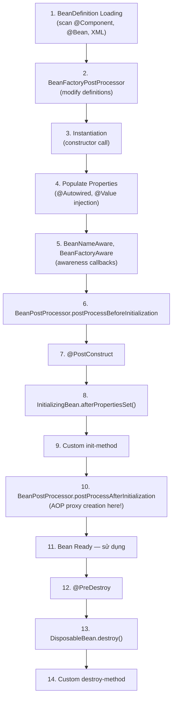
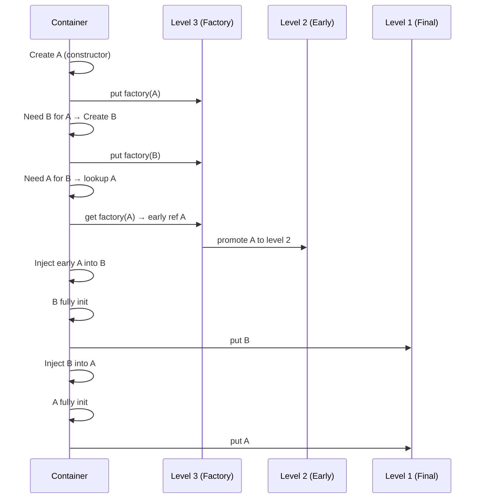

Spring Bean Lifecycle mô tả các giai đoạn từ lúc container đọc bean definition, tạo instance, inject dependency, chạy callback khởi tạo cho đến khi hủy bean. Thứ tự này quyết định thời điểm một bean thực sự sẵn sàng để sử dụng.

## Mục lục

- [Tổng quan](#1-tổng-quan)
- [Lifecycle tổng quan — 11 bước từ definition đến destruction](#2-lifecycle-tổng-quan--11-bước-từ-definition-đến-destruction)
- [BeanDefinition — metadata trước khi bean tồn tại](#3-beandefinition--metadata-trước-khi-bean-tồn-tại)
- [BeanFactoryPostProcessor — sửa definition trước instantiation](#4-beanfactorypostprocessor--sửa-definition-trước-instantiation)
- [Instantiation & Dependency Injection](#5-instantiation--dependency-injection)
- [BeanPostProcessor — hook trước/sau initialization](#6-beanpostprocessor--hook-trướcsau-initialization)
- [Initialization callbacks: @PostConstruct, InitializingBean, initMethod](#7-initialization-callbacks-postconstruct-initializingbean-initmethod)
- [AOP Proxy creation — JDK dynamic proxy vs CGLIB](#8-aop-proxy-creation--jdk-dynamic-proxy-vs-cglib)
- [Circular Dependency — three-level cache](#9-circular-dependency--three-level-cache)
- [Bean Scopes — singleton, prototype, request, session](#10-bean-scopes--singleton-prototype-request-session)
- [Destruction & Shutdown hooks](#11-destruction--shutdown-hooks)
- [SmartLifecycle — startup/shutdown ordering](#12-smartlifecycle--startupshutdown-ordering)
- [Anti-patterns & production pitfalls](#13-anti-patterns--production-pitfalls)
- [Tóm tắt — Cheat sheet & 5 nguyên tắc](#14-tóm-tắt--cheat-sheet--5-nguyên-tắc)

---

## 1. Tổng quan

Trong quá trình khởi tạo, bean đi qua constructor, dependency injection, các aware callback, `BeanPostProcessor`, init callback và có thể được thay thế bằng proxy. Vì vậy object ở một phase sớm chưa chắc đã có dependency đầy đủ hoặc chưa phải object cuối cùng được inject cho nơi khác.

Hiểu lifecycle giúp chọn đúng extension point và giải thích các lỗi liên quan đến `@PostConstruct`, circular dependency, AOP proxy và cleanup tài nguyên.

## 2. Lifecycle tổng quan — 11 bước từ definition đến destruction



> [!NOTE]
> **Thứ tự quan trọng**: DI injection (step 4) xảy ra SAU constructor (step 3). AOP proxy (step 10) xảy ra SAU initialization. Nếu bạn gọi dependency trong constructor → null. Nếu bạn self-call → bypass proxy.

---

## 3. BeanDefinition — metadata trước khi bean tồn tại

Trước khi bất kỳ bean nào được tạo, Spring scan và build **BeanDefinition** cho mỗi bean:

```java
// BeanDefinition chứa:
GenericBeanDefinition def = new GenericBeanDefinition();
def.setBeanClassName("com.example.OrderService");
def.setScope("singleton");
def.setLazyInit(false);
def.setAutowireMode(AUTOWIRE_CONSTRUCTOR);
def.setInitMethodName("init");
def.setDestroyMethodName("cleanup");
// + property values, constructor args, depends-on, ...
```

Sources:
- `@Component` / `@Service` / `@Repository` / `@Controller` → `ClassPathBeanDefinitionScanner`
- `@Bean` methods in `@Configuration` → `ConfigurationClassPostProcessor`
- XML `<bean>` → `XmlBeanDefinitionReader`

---

## 4. BeanFactoryPostProcessor — sửa definition trước instantiation

```java
@Component
public class CustomBFPP implements BeanFactoryPostProcessor {
    @Override
    public void postProcessBeanFactory(ConfigurableListableBeanFactory factory) {
        // Chạy TRƯỚC bất kỳ bean nào được tạo
        // Có thể sửa BeanDefinition, thêm/xoá bean definition
        BeanDefinition def = factory.getBeanDefinition("dataSource");
        def.getPropertyValues().add("maxPoolSize", 50);
    }
}
```

**Built-in BFPPs quan trọng:**

| BFPP | Vai trò |
|------|---------|
| `PropertySourcesPlaceholderConfigurer` | Resolve `${...}` placeholders |
| `ConfigurationClassPostProcessor` | Process `@Configuration`, `@Bean`, `@ComponentScan` |
| `MapperScannerConfigurer` (MyBatis) | Scan `@Mapper` interfaces |

> [!IMPORTANT]
> `BeanFactoryPostProcessor` chạy **rất sớm** — trước instantiation. Nếu BFPP inject bean khác (via `@Autowired`) → bean đó tạo sớm → miss lifecycle hooks, skip AOP proxying. **BFPP nên stateless**, không inject business beans.

---

## 5. Instantiation & Dependency Injection

### 5.1. Instantiation strategies

| Strategy | Khi nào |
|----------|---------|
| Constructor (default) | No-arg hoặc `@Autowired` constructor |
| Factory method | `@Bean` method trong `@Configuration` |
| CGLIB subclass | `@Configuration` class itself (for `@Bean` method interception) |

### 5.2. Dependency Injection types

```java
// 1. Constructor injection (RECOMMENDED):
@Service
public class OrderService {
    private final PaymentClient paymentClient;
    
    public OrderService(PaymentClient paymentClient) {  // auto-resolved
        this.paymentClient = paymentClient;
        // paymentClient GUARANTEED non-null here (hoặc throw nếu không resolve được)
    }
}

// 2. Setter injection:
@Autowired
public void setClient(PaymentClient client) { this.client = client; }

// 3. Field injection (NOT recommended):
@Autowired
private PaymentClient paymentClient;  // null trong constructor!
```

> [!TIP]
> **Constructor injection** đảm bảo: dependencies non-null khi constructor xong, bean immutable (final fields), dễ test (truyền mock qua constructor). Field injection ẩn dependencies + null trong constructor.

---

## 6. BeanPostProcessor — hook trước/sau initialization

```java
public interface BeanPostProcessor {
    // Chạy SAU injection, TRƯỚC @PostConstruct
    Object postProcessBeforeInitialization(Object bean, String beanName);
    
    // Chạy SAU @PostConstruct — nơi AOP proxy được tạo
    Object postProcessAfterInitialization(Object bean, String beanName);
}
```

**Flow cho MỖI bean**: injection → `before*` → init callbacks → `after*`

```java
@Component
public class LoggingBPP implements BeanPostProcessor {
    @Override
    public Object postProcessAfterInitialization(Object bean, String name) {
        if (bean.getClass().isAnnotationPresent(Monitored.class)) {
            // Trả proxy thay vì bean gốc
            return Proxy.newProxyInstance(...);
        }
        return bean;  // trả bean gốc (không wrap)
    }
}
```

**Built-in BPPs quan trọng:**

| BPP | Vai trò |
|-----|---------|
| `AutowiredAnnotationBeanPostProcessor` | Process `@Autowired`, `@Value` |
| `CommonAnnotationBeanPostProcessor` | Process `@PostConstruct`, `@PreDestroy`, `@Resource` |
| `AbstractAutoProxyCreator` | Tạo AOP proxy (step 10) |
| `ScheduledAnnotationBeanPostProcessor` | Process `@Scheduled` |
| `AsyncAnnotationBeanPostProcessor` | Process `@Async` |

---

## 7. Initialization callbacks: @PostConstruct, InitializingBean, initMethod

Ba cách định nghĩa initialization logic — chạy theo thứ tự:

```java
@Service
public class CacheService implements InitializingBean {
    @Autowired
    private RedisTemplate<String, String> redis;  // injected BEFORE init
    
    // 1️⃣ @PostConstruct (JSR-250, preferred)
    @PostConstruct
    public void postConstruct() {
        log.info("Step 1: @PostConstruct — redis available: {}", redis != null);
    }
    
    // 2️⃣ InitializingBean (Spring-specific)
    @Override
    public void afterPropertiesSet() {
        log.info("Step 2: afterPropertiesSet");
    }
    
    // 3️⃣ Custom init method (@Bean(initMethod="init"))
    public void init() {
        log.info("Step 3: custom init method");
        warmUpCache();  // safe to use redis here
    }
}
```

| Method | Thứ tự | Coupling | Use case |
|--------|--------|---------|----------|
| `@PostConstruct` | **1st** | Không phụ thuộc Spring | Validation, warm-up cache |
| `afterPropertiesSet()` | 2nd | Spring interface | Framework code |
| Custom init-method | 3rd | Config-driven | Legacy, XML-era |

> [!TIP]
> **`@PostConstruct` là best choice** cho application code: standard (JSR-250), chạy sau injection, không coupling Spring interface. Dùng cho: validate config, pre-load data, register listeners.

---

## 8. AOP Proxy creation — JDK dynamic proxy vs CGLIB

### 8.1. Khi nào proxy được tạo?

`BeanPostProcessor.postProcessAfterInitialization()` — step 10. Nếu bean có AOP advice (@Transactional, @Cacheable, @Async, custom @Around):

```
Bean gốc (target) → wrap bởi Proxy → container giữ Proxy, inject Proxy cho dependents
```

### 8.2. Hai loại proxy

| Feature | JDK Dynamic Proxy | CGLIB Proxy |
|---------|-------------------|-------------|
| Mechanism | `java.lang.reflect.Proxy` | Subclass via bytecode generation |
| Requirement | Bean **phải** implement interface | Bất kỳ class |
| Method visibility | Chỉ interface methods | Public + protected methods |
| `final` methods | N/A (interface) | **Không proxy được** |
| Default (Spring Boot) | Nếu có interface + config | **CGLIB** (default from SB 2.0+) |
| Performance | Slightly slower | Slightly faster |

```
JDK Proxy:
Caller → Proxy(implements Interface) → InvocationHandler → Target bean

CGLIB Proxy:
Caller → ProxySubclass(extends TargetClass) → MethodInterceptor → super.method()
```

### 8.3. Self-invocation problem

```java
@Service
public class UserService {
    @Transactional
    public void createUser(User user) { ... }
    
    public void register(User user) {
        this.createUser(user);    // ← "this" = TARGET, không phải PROXY!
        // @Transactional KHÔNG hoạt động vì gọi trực tiếp, bypass proxy
    }
}
```

```
Caller → Proxy.register() → Target.register() → Target.createUser() ← NO PROXY!
                                                   ↑ direct call, AOP skipped
```

**Giải pháp:**

```java
// 1. Inject self (circular, cần CGLIB):
@Autowired private UserService self;
public void register(User user) {
    self.createUser(user);  // qua proxy → @Transactional hoạt động
}

// 2. Extract sang service khác:
@Service
public class RegistrationService {
    @Autowired private UserService userService;
    public void register(User user) {
        userService.createUser(user);  // qua proxy ✓
    }
}
```

---

## 9. Circular Dependency — three-level cache

### 9.1. Vấn đề

```java
@Service
class A {
    @Autowired B b;    // A cần B
}

@Service
class B {
    @Autowired A a;    // B cần A
}
// Chicken-and-egg: tạo A cần B, tạo B cần A → deadlock?
```

### 9.2. Three-level cache giải quyết (singleton only)

```java
// DefaultSingletonBeanRegistry:
Map<String, Object> singletonObjects         = new ConcurrentHashMap<>(256);  // 1st: fully initialized
Map<String, Object> earlySingletonObjects     = new HashMap<>(16);            // 2nd: early reference
Map<String, ObjectFactory<?>> singletonFactories = new HashMap<>(16);         // 3rd: factory
```

**Tại sao 3 level? Sao không 2?**

Level 3 (`singletonFactories`) chứa **ObjectFactory** — lambda tạo early reference. Factory này gọi `SmartInstantiationAwareBeanPostProcessor.getEarlyBeanReference()`:

```java
// AbstractAutowireCapableBeanFactory — simplified
addSingletonFactory(beanName, () -> getEarlyBeanReference(beanName, mbd, bean));

protected Object getEarlyBeanReference(String name, RootBeanDefinition mbd, Object bean) {
    Object exposedObject = bean;
    for (SmartInstantiationAwareBeanPostProcessor bp : getBeanPostProcessors()) {
        exposedObject = bp.getEarlyBeanReference(exposedObject, name);
        // AbstractAutoProxyCreator: nếu bean cần AOP → trả proxy thay vì raw bean!
    }
    return exposedObject;
}
```

**Key insight:** Level 3 factory cho phép Spring quyết định **tại thời điểm bị cần** (lazy) xem trả về raw bean hay AOP proxy. Nếu chỉ dùng 2 level, Spring phải quyết định ngay lúc instantiate — nhưng lúc đó chưa biết bean có cần proxy không (BPP chưa chạy).

**Flow:**

```
1. Tạo A: instantiate A (constructor) → A chưa inject B
   → đặt ObjectFactory(() → getEarlyBeanReference(A)) vào cache level 3
   
2. Inject B cho A: cần tạo B
   → instantiate B (constructor) → B chưa inject A
   → đặt ObjectFactory cho B vào cache level 3
   
3. Inject A cho B: tìm A
   → cache level 1: không có (A chưa fully init)
   → cache level 2: không có
   → cache level 3: CÓ factory → gọi factory → lấy early reference A
   → đặt early A vào cache level 2, xoá khỏi level 3
   → inject early A vào B ✓
   
4. B fully initialized → vào cache level 1
5. Quay lại A: inject B (đã sẵn sàng) → A fully initialized → vào cache level 1
```



### 9.3. Khi nào circular dependency KHÔNG giải quyết được?

| Tình huống | Lý do | Giải pháp |
|-----------|-------|-----------|
| **Constructor injection** cả 2 chiều | A constructor cần B instance → B chưa tồn tại | `@Lazy` trên 1 param |
| **Prototype** scope | Không cache → vô hạn loop | Redesign |
| **@Async** + circular | Proxy tạo early ≠ final proxy | `@Lazy` injection |

```java
// Fix constructor circular:
@Service
public class A {
    public A(@Lazy B b) { this.b = b; }  // inject proxy, resolve later
}
```

> [!WARNING]
> Circular dependency = **design smell**. Three-level cache là safety net, không phải best practice. Refactor: extract shared logic thành 3rd service, dùng events, hoặc restructure dependencies.

---

## 10. Bean Scopes — singleton, prototype, request, session

| Scope | Lifetime | Instance count |
|-------|---------|---------------|
| **singleton** (default) | Container lifetime | 1 per container |
| **prototype** | Per-injection / per-lookup | Unlimited |
| **request** | 1 HTTP request | 1 per request |
| **session** | 1 HTTP session | 1 per session |
| **application** | ServletContext lifetime | 1 (≈ singleton) |

### 10.1. Prototype injection into Singleton — scoped proxy

```java
@Service  // singleton
public class OrderService {
    @Autowired
    private ShoppingCart cart;    // prototype — nhưng inject 1 lần lúc singleton init!
    // cart luôn là CÙNG instance → BUG cho multi-user
}
```

**Fix: scoped proxy hoặc ObjectFactory**

```java
// 1. Scoped proxy:
@Component
@Scope(value = "prototype", proxyMode = ScopedProxyMode.TARGET_CLASS)
public class ShoppingCart { ... }
// → inject proxy, mỗi access → tạo instance mới

// 2. ObjectFactory / Provider:
@Service
public class OrderService {
    @Autowired
    private ObjectFactory<ShoppingCart> cartFactory;
    
    public void process() {
        ShoppingCart cart = cartFactory.getObject();  // new instance mỗi lần
    }
}
```

---

## 11. Destruction & Shutdown hooks

Khi ApplicationContext close (app shutdown):

```java
@Service
public class ConnectionManager implements DisposableBean {
    
    // 1️⃣ @PreDestroy (JSR-250, preferred)
    @PreDestroy
    public void preDestroy() {
        log.info("Closing connections...");
    }
    
    // 2️⃣ DisposableBean (Spring-specific)
    @Override
    public void destroy() {
        connectionPool.close();
    }
    
    // 3️⃣ Custom destroy method (@Bean(destroyMethod="cleanup"))
    public void cleanup() { ... }
}
```

> [!NOTE]
> **Prototype beans KHÔNG nhận destruction callbacks!** Spring không track lifecycle prototype beans sau khi tạo. Bạn phải tự close/cleanup prototype beans. Chỉ singleton được managed đầy đủ.

**Graceful shutdown** (Spring Boot 2.3+):

```properties
server.shutdown=graceful
spring.lifecycle.timeout-per-shutdown-phase=30s
```

---

## 12. SmartLifecycle — startup/shutdown ordering

```java
@Component
public class MessageConsumer implements SmartLifecycle {
    private volatile boolean running = false;
    
    @Override
    public void start() {
        // Chạy SAU tất cả beans init xong
        // Start consuming messages
        running = true;
        consumer.subscribe(topics);
    }
    
    @Override
    public void stop(Runnable callback) {
        // Graceful shutdown: dừng consume, process pending, rồi callback
        consumer.unsubscribe();
        processPending();
        running = false;
        callback.run();  // signal done
    }
    
    @Override
    public int getPhase() { return 100; }  // higher = start later, stop earlier
    
    @Override
    public boolean isRunning() { return running; }
}
```

| Phase | Start order | Stop order | Use case |
|-------|-------------|-----------|----------|
| 0 (default) | First | Last | Database connections |
| 50 | Middle | Middle | Caches |
| 100 | Last | **First** | Message consumers, schedulers |

---

## 13. Anti-patterns & production pitfalls

| Anti-pattern | Vì sao sai | Giải pháp |
|--------------|-----------|-----------|
| Logic trong constructor cần dependency | Dependency chưa inject | `@PostConstruct` |
| Self-invocation expect AOP | `this` = target, bypass proxy | Inject self hoặc extract service |
| Circular dependency accepted | Design smell, fragile | Refactor, events, extract |
| Prototype inject vào singleton | Luôn cùng instance | `ObjectFactory` / scoped proxy |
| `@PreDestroy` trên prototype bean | Spring không gọi | Tự cleanup |
| `@Transactional` trên private method | CGLIB proxy không override private | Public method |
| `@Async` + circular + constructor | Proxy conflict | `@Lazy` |
| Heavy logic trong `@PostConstruct` | Kéo dài startup, block context | `SmartLifecycle.start()` (async possible) |

**@Transactional trên private/final methods:**

```java
@Service
public class PaymentService {
    @Transactional
    private void processPayment() { ... }   // ❌ CGLIB cannot override private
    
    @Transactional
    public final void pay() { ... }         // ❌ CGLIB cannot override final
    
    @Transactional
    public void pay() { ... }               // ✅ public, non-final
}
```

---

## 14. Tóm tắt — Cheat sheet & 5 nguyên tắc

**Cỗ máy trong 6 dòng:**

```
1. BeanDefinition scan → BeanFactoryPostProcessor sửa def → Instantiate
2. Populate (DI) → Aware callbacks → BPP.before → Init → BPP.after (proxy!)
3. AOP proxy tạo ở step "after init" → self-call bypass proxy
4. Circular dep: 3-level cache (singleton only, không cho constructor injection)
5. @PostConstruct: safe place cho init logic (sau injection, trước proxy)
6. Prototype: Spring không manage destruction. Singleton: full lifecycle.
```

| Lifecycle Hook | Thứ tự | Dùng cho |
|---------------|--------|----------|
| `BeanFactoryPostProcessor` | Trước instantiation | Modify bean definitions |
| Constructor | Instantiation | Set final fields |
| `@Autowired` / setter | After instantiation | Inject dependencies |
| `@PostConstruct` | After injection | Validation, warm-up |
| `BeanPostProcessor.after` | After init | AOP proxy, custom wrapping |
| `SmartLifecycle.start()` | After ALL beans ready | Start consumers, schedulers |
| `@PreDestroy` | Shutdown | Close connections |

**5 nguyên tắc khắc cốt:**

1. **Constructor injection** — dependencies guaranteed non-null, final, testable. Field injection = hidden + null trong constructor.
2. **@PostConstruct cho init logic** — chạy sau inject, trước proxy. Safe place cho validation/warm-up.
3. **Self-call ≠ proxy** — `this.method()` bypass AOP. Extract sang service khác hoặc inject self.
4. **Circular = smell** — three-level cache là safety net, KHÔNG phải design pattern. Refactor.
5. **Scope mismatch = bug** — prototype trong singleton = stale. Dùng `ObjectFactory`, `Provider`, hoặc scoped proxy.

> [!TIP]
> Một câu để nhớ: *Spring Bean lifecycle là: create → inject → init → proxy → use → destroy. Mọi bug "Spring không hoạt động" đều do bạn làm gì đó ở sai phase — dùng dependency trước inject, expect AOP mà tự gọi, hoặc init trước container ready.*
