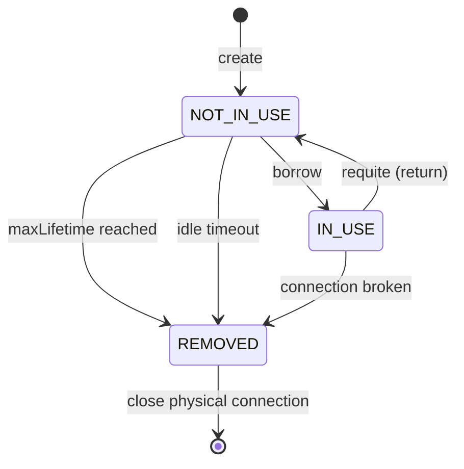

## Mục lục

- [Query 500ms bỗng thành 5s — connection pool cạn kiệt](#1-query-500ms-bỗng-thành-5s--connection-pool-cạn-kiệt)
- [Tại sao cần Connection Pool?](#2-tại-sao-cần-connection-pool)
- [HikariCP Architecture — tổng quan kiến trúc](#3-hikaricp-architecture--tổng-quan-kiến-trúc)
- [ConcurrentBag — lock-free connection borrowing](#4-concurrentbag--lock-free-connection-borrowing)
- [FastList — thay thế ArrayList cho performance](#5-fastlist--thay-thế-arraylist-cho-performance)
- [Connection Lifecycle — từ creation đến eviction](#6-connection-lifecycle--từ-creation-đến-eviction)
- [Pool Sizing — công thức và nguyên tắc](#7-pool-sizing--công-thức-và-nguyên-tắc)
- [Housekeeping — idle connection management](#8-housekeeping--idle-connection-management)
- [Leak Detection — phát hiện connection không trả](#9-leak-detection--phát-hiện-connection-không-trả)
- [Health Check & Validation](#10-health-check--validation)
- [Configuration thực chiến](#11-configuration-thực-chiến)
- [Metrics & Monitoring](#12-metrics--monitoring)
- [So sánh: HikariCP vs Tomcat JDBC vs DBCP2 vs c3p0](#13-so-sánh-hikaricp-vs-tomcat-jdbc-vs-dbcp2-vs-c3p0)
- [Anti-patterns & production pitfalls](#14-anti-patterns--production-pitfalls)
- [Tóm tắt — Cheat sheet & 5 nguyên tắc](#15-tóm-tắt--cheat-sheet--5-nguyên-tắc)

---

## 1. Query 500ms bỗng thành 5s — connection pool cạn kiệt

Connection pool (HikariCP, mặc định của Spring Boot 2.0+) là lớp **giữ một tập connection tái sử dụng** giữa app và database, thay vì mở/đóng connection mới mỗi query. Nó là tuyến phòng thủ trực tiếp cho database: giới hạn số connection, hàng đợi các request thừa, reuse connection đã tốn tiền TCP+auth để mở. Khi pool **cạn kiệt** (exhausted) — thường do leak hoặc sizing sai — triệu chứng không phải một query chậm, mà **toàn bộ** API bị nghẽn: mọi thread đều chờ mượn connection cho đến timeout. Đây là lý do pool sizing và leak detection thuộc nhóm cấu hình sống còn nhất của service thật.

Production alert: p99 latency API `/orders` nhảy từ 500ms lên **5,000ms**. Database load bình thường. Network OK.

```
Thread dump (100 threads chờ):
"http-nio-8080-exec-47" TIMED_WAITING
   at com.zaxxer.hikari.pool.HikariPool.getConnection(HikariPool.java:181)
   - waiting on: connectionBag.borrow(timeout)
```

Root cause: pool `maximumPoolSize=10`, nhưng 1 endpoint quên close connection (leak):

```java
@GetMapping("/report")
public Report generate() {
    Connection conn = dataSource.getConnection();  // borrow
    ResultSet rs = conn.createStatement().executeQuery(sql);
    return buildReport(rs);
    // ❌ KHÔNG close connection! Pool cạn dần...
}
```

10 request `/report` → 10 connections leaked → pool **exhausted** → tất cả request khác **chờ 5s timeout** → cascade failure.

Fix: **try-with-resources** + HikariCP **leak detection**:

```java
@GetMapping("/report")
public Report generate() {
    try (Connection conn = dataSource.getConnection()) {  // auto-close
        ResultSet rs = conn.createStatement().executeQuery(sql);
        return buildReport(rs);
    }  // connection trả về pool ở đây
}
```

```properties
spring.datasource.hikari.leak-detection-threshold=2000  # warn nếu >2s không trả
```

> [!IMPORTANT]
> Connection pool không phải "set and forget". Pool exhaustion = **tất cả** queries chậm (không chỉ query có vấn đề). Leak detection + proper sizing + monitoring = tam giác sống còn.

Phần còn lại của doc sẽ đi qua: vì sao cần pool (§2) → kiến trúc HikariCP (§3) → `ConcurrentBag` lock-free borrowing (§4) → `FastList` tối ưu (§5) → connection lifecycle (§6) → pool sizing (§7) → housekeeping (§8) → leak detection (§9) → health check (§10) → config thực chiến (§11) → metrics (§12) → so sánh các pool (§13) → anti-patterns (§14) → cheat sheet (§15).

---

## 2. Tại sao cần Connection Pool?

### 2.1. Cost tạo connection mới

```text
TCP handshake:         ~1ms (local), ~50ms (cross-region)
TLS handshake:         ~30-100ms (nếu SSL)
Database authentication: ~5-20ms
Connection initialization: ~5ms (set timezone, charset, schema)
─────────────────────────────────────────────────────────
Total per connection:   ~40-200ms (MỖI LẦN tạo mới)
```

Với 1000 request/s, mỗi request 1 query:
- **Không pool**: 1000 × 100ms overhead = **100 giây** connection cost/s (bất khả!)
- **Pool 20 connections**: tạo 20 lần khi startup, reuse → overhead **~0ms** per request

### 2.2. Database connection limit

PostgreSQL default: `max_connections = 100`. MySQL: `151`. Không pool → mỗi request 1 connection → 100 concurrent request = hết.

Pool **giới hạn** connection count, **queue** excess requests → bảo vệ database.

---

## 3. HikariCP Architecture — tổng quan kiến trúc

```
┌─────────────────────────────────────────────────────────────┐
│                         HikariCP                            │
├─────────────────────────────────────────────────────────────┤
│  ┌───────────────────────────────────────────────────────┐  │
│  │              ConcurrentBag                            │  │
│  │  ┌─────┐ ┌──────┐ ┌─────┐ ┌───────┐ ... ┌─────┐       │  │
│  │  │Conn1│ │Conn2 │ │Conn3│ │Conn4  │     │ConnN│       │  │
│  │  │ IDLE│ │IN_USE│ │IDLE │ │REMOVED│     │ IDLE│       │  │
│  │  └─────┘ └──────┘ └─────┘ └───────┘     └─────┘       │  │
│  └───────────────────────────────────────────────────────┘  │
│                                                             │
│  ┌─────────────────┐  ┌─────────────────────────────┐       │
│  │ Housekeeping    │  │ Connection Add Thread       │       │
│  │ (ScheduledTask) │  │ (creates new connections)   │       │
│  └─────────────────┘  └─────────────────────────────┘       │
│                                                             │
│  ┌─────────────────────────────────────────────────────┐    │
│  │  ProxyConnection / ProxyStatement / ProxyResultSet  │    │
│  │  (intercept close() → return to pool)               │    │
│  └─────────────────────────────────────────────────────┘    │
└─────────────────────────────────────────────────────────────┘
```

---

## 4. ConcurrentBag — lock-free connection borrowing

`ConcurrentBag` là **core innovation** của HikariCP — borrowing connection mà **gần như không lock**:

### 4.1. Three-tier borrowing strategy

```java
// Pseudocode ConcurrentBag.borrow():
public T borrow(long timeout, TimeUnit unit) {
    // 1️⃣ Thread-local: check nếu thread này có connection vừa trả
    List<Object> threadLocalList = threadList.get();
    for (int i = threadLocalList.size() - 1; i >= 0; i--) {
        Object entry = threadLocalList.remove(i);
        if (entry.compareAndSet(STATE_NOT_IN_USE, STATE_IN_USE)) {
            return entry;  // FAST PATH — no contention, no lock
        }
    }
    
    // 2️⃣ Shared list: CAS scan qua tất cả connections
    for (Object entry : sharedList) {
        if (entry.compareAndSet(STATE_NOT_IN_USE, STATE_IN_USE)) {
            return entry;  // CAS success — still lock-free
        }
    }
    
    // 3️⃣ Handoff queue: wait for connection được trả lại
    listener.addBagItem(waiting);
    return handoffQueue.poll(timeout, unit);  // SynchronousQueue
}
```

### 4.2. Tại sao nhanh?

| Strategy | Lock? | Contention | Latency |
|----------|-------|-----------|---------|
| Thread-local steal | **No** | Zero | ~10ns |
| Shared list CAS scan | **No** (CAS) | Low | ~50ns |
| Handoff queue | Wait (park) | Pool full | ~μs-ms |

Đa số requests (>90%) hit **thread-local** tier — cùng thread borrow+return liên tục → **zero contention**.

### 4.3. ConcurrentBag entry — CAS state machine

```java
// PoolEntry state (AtomicIntegerFieldUpdater):
static final int STATE_NOT_IN_USE = 0;
static final int STATE_IN_USE     = 1;
static final int STATE_REMOVED    = -1;
static final int STATE_RESERVED   = -2;

// Borrow: CAS(NOT_IN_USE → IN_USE) — atomic, lock-free
// Return: CAS(IN_USE → NOT_IN_USE) — set state + offer to handoff queue
// Evict:  CAS(NOT_IN_USE → REMOVED) — only idle connections can be evicted
```

**Tại sao CAS đủ mà không cần lock?**
- Mỗi connection chỉ có **1 owner** tại mọi thời điểm (IN_USE = 1 thread giữ)
- CAS transition: chỉ thread đang giữ mới CAS `IN_USE → NOT_IN_USE`
- Contention chỉ xảy ra ở `NOT_IN_USE → IN_USE` (nhiều thread cùng muốn borrow) — CAS retry loser, try entry tiếp

> [!TIP]
> HikariCP nhanh vì thiết kế ConcurrentBag **favour thread affinity**: connection bạn vừa trả = connection bạn sẽ lấy lại. Không cần lock, không cần sync, CAS overhead minimal.

---

## 5. FastList — thay thế ArrayList cho performance

HikariCP dùng **FastList** (custom) thay ArrayList cho list statements/connections:

```java
// ArrayList.get(i):
public E get(int index) {
    rangeCheck(index);        // bounds check EVERY call
    return elementData[index];
}

// FastList.get(i):
public T get(int index) {
    return elementData[index];  // NO bounds check — trust caller
}

// FastList.removeLast():
public T removeLast() {
    return elementData[--size];  // O(1), no arraycopy, no bounds check
}
```

**Impact**: micro-optimization — mỗi connection borrow/return tiết kiệm ~10-20ns. Ở scale **triệu** ops/second → **measurable** difference.

---

## 6. Connection Lifecycle — từ creation đến eviction



| State | Ý nghĩa |
|-------|---------|
| `NOT_IN_USE` | Trong pool, sẵn sàng cho borrow |
| `IN_USE` | Đang được application giữ |
| `REMOVED` | Marked for eviction, sẽ bị close |
| `RESERVED` | Đặt trước cho add thread |

### 6.1. maxLifetime

```properties
spring.datasource.hikari.max-lifetime=1800000  # 30 phút (default)
```

Mỗi connection bị **retire** sau `maxLifetime` — tránh: stale connection, database-side timeout, memory leak trong driver.

> [!IMPORTANT]
> `maxLifetime` PHẢI nhỏ hơn database `wait_timeout` (MySQL) hoặc `idle_in_transaction_session_timeout` (PostgreSQL). Nếu DB kill connection trước HikariCP retire → connection broken → error.

---

## 7. Pool Sizing — công thức và nguyên tắc

### 7.1. Công thức PostgreSQL wiki

```
pool_size = Tn × (Cm − 1) + 1

Tn = số threads (concurrent requests)
Cm = số connections mỗi thread cần simultaneously
```

Ví dụ: 10 threads, mỗi thread 1 connection tại 1 thời điểm:
```
pool_size = 10 × (1 - 1) + 1 = 1 ← quá nhỏ! Vì công thức giả định perfect interleaving
```

### 7.2. Practical formula

```
pool_size = CPU_cores × 2 + disk_spindles
```

Với SSD (no spindles):
```
pool_size ≈ CPU_cores × 2 = 8 cores × 2 = 16
```

> [!WARNING]
> **Bigger is NOT better!** Pool quá lớn → nhiều connection active → database context switching → **chậm hơn**. PostgreSQL với 96 cores: pool 20-30 thường nhanh hơn pool 200.

### 7.3. Testing-based approach

```text
Benchmark results (PostgreSQL, 8 cores, SSD):
Pool size  |  Throughput  |  p99 latency
    5      |   8,200 q/s  |   12ms
   10      |  14,500 q/s  |    8ms
   20      |  15,100 q/s  |    7ms  ← sweet spot
   50      |  14,800 q/s  |    9ms
  100      |  12,200 q/s  |   15ms  ← degrading!
```

---

## 8. Housekeeping — idle connection management

HikariCP chạy **scheduled task** (mỗi 30s mặc định) để:

1. **Retire** connections quá `maxLifetime`
2. **Close** idle connections quá `idleTimeout` (nếu pool > `minimumIdle`)
3. **Create** connections mới nếu pool < `minimumIdle`

```properties
spring.datasource.hikari.minimum-idle=5          # giữ ít nhất 5 connections
spring.datasource.hikari.idle-timeout=600000     # idle > 10 phút → close (nếu > minimumIdle)
spring.datasource.hikari.max-lifetime=1800000    # retire sau 30 phút
```

> [!TIP]
> HikariCP khuyến khích: **`minimumIdle` = `maximumPoolSize`** (fixed-size pool). Lý do: tránh overhead tạo/destroy connection khi traffic fluctuate. Connections rẻ khi idle — đừng tiết kiệm ở đây.

---

## 9. Leak Detection — phát hiện connection không trả

```properties
spring.datasource.hikari.leak-detection-threshold=2000  # ms
```

Nếu connection bị hold **> 2 giây** mà không trả:

```
WARN  HikariPool - Connection leak detection triggered for conn0
   java.lang.Exception: Apparent connection leak detected
      at com.example.ReportService.generate(ReportService.java:45)
      at com.example.ReportController.getReport(ReportController.java:22)
```

**Cơ chế**: khi borrow → schedule task sau `threshold` ms. Nếu task fire mà connection chưa return → log stack trace tại lúc borrow.

```java
// Internal (simplified):
ProxyConnection.borrow() {
    if (leakDetectionThreshold > 0) {
        leakTask = houseKeepingExecutor.schedule(
            () -> log.warn("Leak detected", borrowStackTrace),
            leakDetectionThreshold, MILLISECONDS
        );
    }
}

ProxyConnection.close() {  // return to pool
    if (leakTask != null) leakTask.cancel(false);
    delegate.requite(this);
}
```

---

## 10. Health Check & Validation

### 10.1. Connection validation

```properties
# Test connection trước khi cho mượn:
spring.datasource.hikari.connection-test-query=SELECT 1   # legacy (JDBC3)

# JDBC4+ preferred (isValid() — no query overhead):
# HikariCP tự dùng Connection.isValid(timeout) nếu driver hỗ trợ JDBC4
```

### 10.2. Khi nào validation chạy?

| Event | Validation |
|-------|-----------|
| Borrow from pool | `isValid()` check (nếu idle > 500ms) |
| Return to pool | Không (trust) |
| Housekeeping | Check idle connections |

> [!NOTE]
> HikariCP **không** validate mỗi lần borrow — chỉ khi connection idle > 500ms (mặc định). Connection vừa mới trả (< 500ms ago) → trust còn valid. Giảm overhead validation cho high-throughput.

---

## 11. Configuration thực chiến

### 11.1. Spring Boot defaults (good starting point)

```properties
# datasource
spring.datasource.url=jdbc:postgresql://localhost:5432/mydb
spring.datasource.username=app
spring.datasource.password=${DB_PASSWORD}
spring.datasource.driver-class-name=org.postgresql.Driver

# HikariCP tuning
spring.datasource.hikari.maximum-pool-size=20
spring.datasource.hikari.minimum-idle=20              # fixed pool
spring.datasource.hikari.idle-timeout=600000          # 10 min
spring.datasource.hikari.max-lifetime=1800000         # 30 min (< DB wait_timeout)
spring.datasource.hikari.connection-timeout=30000     # 30s wait for connection
spring.datasource.hikari.leak-detection-threshold=60000  # 60s for production
spring.datasource.hikari.pool-name=MyAppPool

# Validation
spring.datasource.hikari.validation-timeout=5000      # 5s for isValid()
```

### 11.2. High-throughput tuning

```properties
spring.datasource.hikari.maximum-pool-size=30
spring.datasource.hikari.minimum-idle=30
spring.datasource.hikari.connection-timeout=10000     # fail-fast 10s
spring.datasource.hikari.max-lifetime=900000          # 15 min (frequent rotate)
spring.datasource.hikari.leak-detection-threshold=5000
```

### 11.3. Microservice (container, short-lived)

```properties
spring.datasource.hikari.maximum-pool-size=10
spring.datasource.hikari.minimum-idle=2               # scale up on demand
spring.datasource.hikari.idle-timeout=300000          # 5 min
spring.datasource.hikari.initialization-fail-timeout=0  # fail-fast at startup
```

---

## 12. Metrics & Monitoring

### 12.1. HikariCP Metrics (Micrometer)

```java
@Bean
public HikariDataSource dataSource(MeterRegistry registry) {
    HikariDataSource ds = new HikariDataSource(config);
    ds.setMetricRegistry(registry);  // expose to Micrometer
    return ds;
}
```

| Metric | Ý nghĩa | Alert threshold |
|--------|---------|----------------|
| `hikaricp.connections.active` | Connections đang dùng | > 80% pool size |
| `hikaricp.connections.idle` | Connections rảnh | < 2 (pool starving) |
| `hikaricp.connections.pending` | Threads chờ connection | > 0 sustained |
| `hikaricp.connections.timeout` | Borrow timeout count | > 0 |
| `hikaricp.connections.acquire` | Time to borrow (histogram) | p99 > 100ms |
| `hikaricp.connections.usage` | Hold time (histogram) | p99 > 5s |
| `hikaricp.connections.creation` | Time to create new | p99 > 1s |

### 12.2. Key alerts

```yaml
# Grafana alert rules:
- alert: PoolExhaustion
  expr: hikaricp_connections_pending > 5
  for: 1m
  labels: { severity: critical }

- alert: ConnectionLeak
  expr: increase(hikaricp_connections_timeout_total[5m]) > 0
  labels: { severity: warning }

- alert: SlowAcquire
  expr: hikaricp_connections_acquire_seconds{quantile="0.99"} > 0.5
  labels: { severity: warning }
```

---

## 13. So sánh: HikariCP vs Tomcat JDBC vs DBCP2 vs c3p0

| Feature | HikariCP | Tomcat JDBC | DBCP2 | c3p0 |
|---------|----------|-------------|-------|------|
| Borrow mechanism | **ConcurrentBag (lock-free)** | FairBlockingQueue | GenericObjectPool (sync) | sync |
| Throughput (ops/s) | **~35M** | ~10M | ~5M | ~2M |
| Latency p99 | **~250ns** | ~1μs | ~5μs | ~10μs |
| Code size | ~130KB | ~160KB | ~200KB | ~600KB |
| Bytecode optimization | **FastList, CAS** | Standard | Standard | Standard |
| Leak detection | Built-in | Built-in | Built-in | Built-in |
| Spring Boot default | **Yes (since 2.0)** | No (was 1.x default) | No | No |
| JMX metrics | Yes | Yes | Yes | Yes |
| Statement cache | **Prepared statement cache** | Yes | Yes | Yes |

> [!TIP]
> HikariCP là default của Spring Boot 2.0+ vì lý do: **nhỏ nhất** (130KB), **nhanh nhất** (lock-free ConcurrentBag), **ít bug nhất** (ít code = ít bug). Không có lý do dùng pool khác cho project mới.

---

## 14. Anti-patterns & production pitfalls

| Anti-pattern | Vì sao sai | Giải pháp |
|--------------|-----------|-----------|
| Không close connection (leak) | Pool exhaustion | try-with-resources + leak detection |
| `maximumPoolSize=200` | DB thrashing, context switch | Benchmark optimal size (~20-30) |
| `minimumIdle=0` | Cold-start mỗi traffic spike | Set = maximumPoolSize (fixed pool) |
| `maxLifetime` > DB timeout | Connection broken when borrowed | Set < DB `wait_timeout` |
| Không monitor pool metrics | Blind to exhaustion | Micrometer + alerts |
| Connection hold quá lâu (transaction dài) | Block other threads | Shorten transactions, async processing |
| `connectionTimeout` quá lớn (60s) | Thread chờ lâu → cascade failure | 5-10s, fail-fast |
| Shared pool cho batch + OLTP | Batch hold all connections | Separate pools per workload |

**Separate pools cho workload khác nhau:**

```java
@Configuration
public class DataSourceConfig {
    @Bean("oltp")
    @Primary
    public DataSource oltpDataSource() {
        HikariConfig config = new HikariConfig();
        config.setMaximumPoolSize(20);
        config.setConnectionTimeout(5000);  // fail-fast
        config.setPoolName("OLTP-Pool");
        return new HikariDataSource(config);
    }
    
    @Bean("batch")
    public DataSource batchDataSource() {
        HikariConfig config = new HikariConfig();
        config.setMaximumPoolSize(5);       // ít connection, hold lâu OK
        config.setConnectionTimeout(30000);
        config.setPoolName("Batch-Pool");
        return new HikariDataSource(config);
    }
}
```

**Connection hold time quá lâu:**

```java
// ❌ Hold connection suốt business logic:
Connection conn = dataSource.getConnection();
Order order = buildOrder(request);           // 200ms business logic
Payment payment = processPayment(order);     // 500ms external call
conn.executeUpdate(insertSQL);               // chỉ cần connection ở đây
conn.close();
// Connection bị hold 700ms — lãng phí cho 690ms không cần DB

// ✅ Hold connection ngắn nhất có thể:
Order order = buildOrder(request);
Payment payment = processPayment(order);
try (Connection conn = dataSource.getConnection()) {
    conn.executeUpdate(insertSQL);           // borrow + use + return nhanh
}
```

---

## 15. Tóm tắt — Cheat sheet & 5 nguyên tắc

**Cỗ máy trong 6 dòng:**

```
1. HikariCP = lock-free pool dùng ConcurrentBag (thread-local → CAS → handoff)
2. Pool sizing: CPU_cores × 2 ≈ sweet spot. Bigger ≠ better.
3. maxLifetime < DB wait_timeout — tránh broken connection
4. Fixed pool (minimumIdle = maximumPoolSize) — tránh create/destroy overhead
5. Leak detection: threshold + try-with-resources = zero leak
6. Monitor: active/pending/timeout metrics → alert sớm pool exhaustion
```

| Config | Recommend | Lý do |
|--------|-----------|-------|
| `maximumPoolSize` | 20 (start) | CPU×2, benchmark to tune |
| `minimumIdle` | = maximumPoolSize | Fixed pool, no fluctuation |
| `connectionTimeout` | 10,000ms | Fail-fast, don't queue forever |
| `maxLifetime` | 1,800,000ms | < DB timeout |
| `idleTimeout` | 600,000ms | 10 min (if not fixed pool) |
| `leakDetectionThreshold` | 60,000ms (prod) | Alert long-hold connections |

**5 nguyên tắc khắc cốt:**

1. **Always try-with-resources** — connection PHẢI trả về pool. Leak = eventual exhaustion.
2. **Small pool wins** — 20-30 connections thường nhanh hơn 200. Test, don't guess.
3. **maxLifetime < DB timeout** — HikariCP retire trước DB kill. Zero broken connections.
4. **Monitor pending threads** — pending > 0 sustained = pool quá nhỏ hoặc connection hold quá lâu.
5. **Separate pools per workload** — OLTP (nhỏ, fast) vs Batch (lớn, slow). Không share.

> [!TIP]
> Một câu để nhớ: *Connection pool là hàng rào bảo vệ database — không phải bể bơi vô tận. Giữ pool nhỏ (DB context switch ít), trả connection nhanh (hold time ngắn), và monitor mọi lúc (pending = đèn đỏ). HikariCP làm phần lock-free cho bạn — việc bạn là close connection đúng lúc.*
