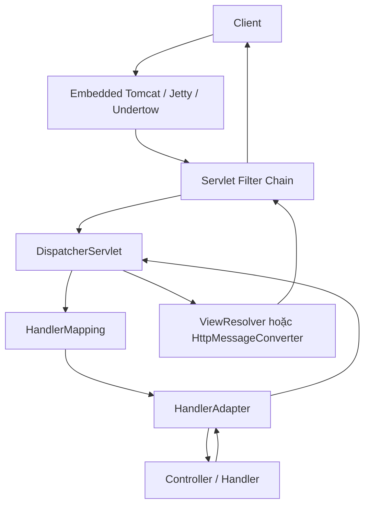
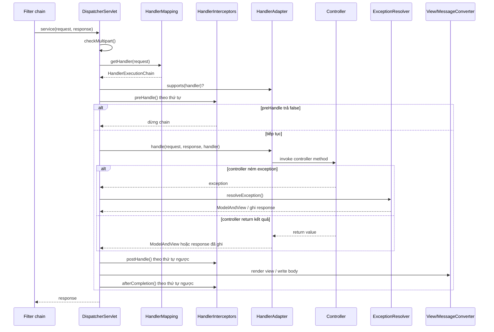
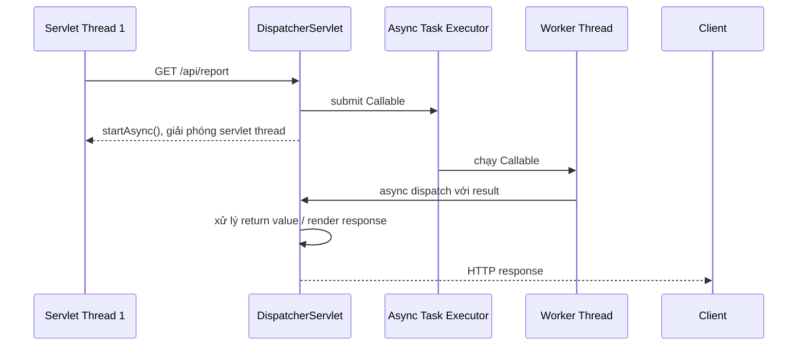

`DispatcherServlet` là servlet trung tâm của Spring MVC. Nó nhận request đã đi qua Servlet Filter chain, tìm controller phù hợp, điều phối xử lý, chuyển kết quả thành HTTP response và kết thúc request bằng exception resolver hoặc view rendering khi cần.

> [!IMPORTANT]
> `DispatcherServlet` thuộc **Spring MVC (Servlet stack)**. Nó không phải server HTTP và không thay thế Tomcat/Jetty/Undertow. Servlet container nhận socket HTTP, chạy filters rồi gọi `DispatcherServlet`. Với Spring WebFlux, thành phần tương đương là `DispatcherHandler`, không phải `DispatcherServlet`.

## Mục lục

- [1. DispatcherServlet giải quyết vấn đề gì?](#1-dispatcherservlet-giải-quyết-vấn-đề-gì)
- [2. Vị trí trong kiến trúc Servlet](#2-vị-trí-trong-kiến-trúc-servlet)
- [3. Front Controller pattern](#3-front-controller-pattern)
- [4. DispatcherServlet khởi tạo như thế nào?](#4-dispatcherservlet-khởi-tạo-như-thế-nào)
  - [4.1. Servlet container và ApplicationContext](#41-servlet-container-và-applicationcontext)
  - [4.2. Chiến lược mặc định](#42-chiến-lược-mặc-định)
- [5. Luồng doDispatch từng bước](#5-luồng-dodispatch-từng-bước)
- [6. HandlerMapping: tìm controller cho request](#6-handlermapping-tìm-controller-cho-request)
- [7. HandlerAdapter: gọi đúng loại handler](#7-handleradapter-gọi-đúng-loại-handler)
- [8. HandlerInterceptor trong vòng đời DispatcherServlet](#8-handlerinterceptor-trong-vòng-đời-dispatcherservlet)
- [9. Controller result: view, JSON và HTTP response](#9-controller-result-view-json-và-http-response)
  - [9.1. ViewResolver](#91-viewresolver)
  - [9.2. HttpMessageConverter](#92-httpmessageconverter)
- [10. Exception handling: HandlerExceptionResolver](#10-exception-handling-handlerexceptionresolver)
- [11. Multipart, locale, flash attribute và các strategy khác](#11-multipart-locale-flash-attribute-và-các-strategy-khác)
- [12. Async MVC: dispatch không luôn kết thúc trên một thread](#12-async-mvc-dispatch-không-luôn-kết-thúc-trên-một-thread)
- [13. Spring Boot auto-configure DispatcherServlet](#13-spring-boot-auto-configure-dispatcherservlet)
  - [13.1. Điều kiện kích hoạt Web MVC](#131-điều-kiện-kích-hoạt-web-mvc)
  - [13.2. DispatcherServletAutoConfiguration](#132-dispatcherservletautoconfiguration)
  - [13.3. WebMvcAutoConfiguration](#133-webmvcautoconfiguration)
- [14. Cấu hình trong Spring Boot](#14-cấu-hình-trong-spring-boot)
- [15. Debugging và observability](#15-debugging-và-observability)
- [16. Anti-patterns và cạm bẫy](#16-anti-patterns-và-cạm-bẫy)
- [17. Tóm tắt](#17-tóm-tắt)

---

## 1. DispatcherServlet giải quyết vấn đề gì?

Không có `DispatcherServlet`, mỗi servlet tự xử lý URL mapping, parse request, gọi code nghiệp vụ, format response và xử lý lỗi. Logic dùng chung bị lặp lại ở nhiều servlet.

`DispatcherServlet` áp dụng **Front Controller pattern**: một entry point chung nhận tất cả request MVC, sau đó delegate cho các strategy chuyên trách.

```text
Không có Front Controller:
/orders/*  → OrdersServlet
/users/*   → UsersServlet
/payments/*→ PaymentsServlet

Có DispatcherServlet:
/* → DispatcherServlet
       ├── HandlerMapping: URL nào, controller nào?
       ├── HandlerAdapter: gọi handler đó ra sao?
       ├── ExceptionResolver: exception trả về thế nào?
       └── View/Message conversion: response có dạng gì?
```

Lợi ích không nằm ở việc mọi endpoint dùng một class duy nhất. Lợi ích là framework có một pipeline nhất quán cho routing, binding, validation, authentication context, error response, locale và rendering.

## 2. Vị trí trong kiến trúc Servlet

Trong Spring Boot Servlet application, embedded Tomcat/Jetty/Undertow là Servlet container. Nó lắng nghe HTTP port, tạo `HttpServletRequest`/`HttpServletResponse`, chạy filter chain rồi chọn servlet theo URL mapping.



Mapping mặc định của Boot thường là `/`, nghĩa là `DispatcherServlet` xử lý mọi path không được một servlet cụ thể hơn nhận. Static resources vẫn có thể được Spring MVC xử lý qua `ResourceHttpRequestHandler` trong cùng DispatcherServlet pipeline.

> [!NOTE]
> Filter chạy **trước** DispatcherServlet. Vì vậy Spring Security, CORS filter, correlation ID filter hoặc compression filter có thể dừng request trước khi controller được chọn. `HandlerInterceptor` chạy muộn hơn, bên trong DispatcherServlet sau bước handler mapping.

## 3. Front Controller pattern

`DispatcherServlet` không hard-code rằng mọi handler phải là `@GetMapping` controller. Nó phối hợp các interface strategy:

| Strategy | Câu hỏi nó trả lời | Implementation phổ biến |
|---|---|---|
| `HandlerMapping` | Request này đi đến handler nào? | `RequestMappingHandlerMapping` |
| `HandlerAdapter` | Làm sao gọi handler này? | `RequestMappingHandlerAdapter` |
| `HandlerExceptionResolver` | Exception này đổi thành response gì? | `ExceptionHandlerExceptionResolver` |
| `ViewResolver` | Tên logical view map tới view nào? | Thymeleaf/JSP resolver |
| `View` | Render model thành response thế nào? | `InternalResourceView`, Thymeleaf view |
| `HttpMessageConverter` | Java object đọc/ghi HTTP body ra sao? | `MappingJackson2HttpMessageConverter` |

Thiết kế này tuân theo **Open/Closed Principle**. `DispatcherServlet` đóng với việc sửa flow trung tâm, nhưng mở với việc thêm mapping, adapter, converter hoặc resolver mới.

Ví dụ controller annotation-based chỉ là một tổ hợp strategy mặc định:

```java
@RestController
@RequestMapping("/api/orders")
class OrderController {

    @GetMapping("/{id}")
    OrderResponse getById(@PathVariable Long id) {
        return new OrderResponse(id, "PENDING");
    }
}
```

- `RequestMappingHandlerMapping` match `GET /api/orders/42` với method `getById`.
- `RequestMappingHandlerAdapter` resolve `@PathVariable Long id` và invoke Java method.
- `RequestResponseBodyMethodProcessor` chọn Jackson message converter để ghi `OrderResponse` thành JSON.

## 4. DispatcherServlet khởi tạo như thế nào?

`DispatcherServlet` kế thừa `FrameworkServlet`, rồi kế thừa `HttpServlet`. Container gọi lifecycle Servlet chuẩn: tạo instance, gọi `init()`, sau đó gọi `service()` cho từng request.

```text
HttpServlet
  └── HttpServletBean
        └── FrameworkServlet
              └── DispatcherServlet
```

### 4.1. Servlet container và ApplicationContext

Trong ứng dụng Spring MVC truyền thống, có thể có hai context:

```text
Servlet container
├── Root WebApplicationContext
│   └── service, repository, datasource, security beans...
│
└── DispatcherServlet named "app"
    └── Child WebApplicationContext của servlet "app"
        └── controller, HandlerMapping, ViewResolver, MVC beans...
```

Context con nhìn thấy bean của parent, nhưng parent không nhìn thấy bean của child. Điều này tách web layer khỏi service/data layer.

Trong Spring Boot hiện đại, phần lớn ứng dụng dùng một `ApplicationContext` duy nhất. Boot đăng ký `DispatcherServlet` như bean và map nó vào embedded container. Bạn vẫn có thể tạo servlet/context riêng, nhưng đó là trường hợp nâng cao.

### 4.2. Chiến lược mặc định

Khi `DispatcherServlet` refresh context, `onRefresh()` gọi `initStrategies()` để khởi tạo các strategy:

```java
// Pseudo-code rút gọn từ DispatcherServlet
protected void initStrategies(ApplicationContext context) {
    initMultipartResolver(context);
    initLocaleResolver(context);
    initThemeResolver(context);
    initHandlerMappings(context);
    initHandlerAdapters(context);
    initHandlerExceptionResolvers(context);
    initRequestToViewNameTranslator(context);
    initViewResolvers(context);
    initFlashMapManager(context);
}
```

Nguyên tắc lookup:

1. Nếu application context có bean strategy tương ứng, DispatcherServlet dùng các bean đó.
2. Nếu không có, nó dùng default strategy từ `DispatcherServlet.properties` trong Spring MVC JAR cho một số loại strategy.
3. Spring Boot thường đăng ký hoặc customize thêm strategy qua auto-configuration.

Đừng tạo một bean `HandlerMapping` hoặc `HandlerAdapter` chỉ để “thử”. Thêm strategy có thể thay đổi routing toàn hệ thống, đặc biệt khi order của mapping mới cao hơn mapping hiện có.

## 5. Luồng doDispatch từng bước

`DispatcherServlet.doService()` chuẩn bị request attributes, sau đó gọi `doDispatch()`. Đây là lõi của Spring MVC request handling.

```java
// Pseudo-code rút gọn, minh hoạ flow chính
protected void doDispatch(HttpServletRequest request,
                          HttpServletResponse response) throws Exception {
    HttpServletRequest processedRequest = checkMultipart(request);
    HandlerExecutionChain mappedHandler = null;
    ModelAndView modelAndView = null;

    try {
        // 1. Tìm handler + interceptor chain
        mappedHandler = getHandler(processedRequest);
        if (mappedHandler == null) {
            noHandlerFound(processedRequest, response);
            return;
        }

        // 2. Chọn adapter hỗ trợ handler đó
        HandlerAdapter handlerAdapter = getHandlerAdapter(mappedHandler.getHandler());

        // 3. Cache / conditional GET-HEAD handling (nếu áp dụng)
        // 4. preHandle interceptors
        if (!mappedHandler.applyPreHandle(processedRequest, response)) {
            return;
        }

        // 5. Invoke controller/handler
        modelAndView = handlerAdapter.handle(
            processedRequest, response, mappedHandler.getHandler());

        // 6. Xử lý async result nếu có, default view name nếu cần
        applyDefaultViewName(processedRequest, modelAndView);

        // 7. postHandle interceptors
        mappedHandler.applyPostHandle(processedRequest, response, modelAndView);
    } catch (Exception ex) {
        dispatchException(processedRequest, response, mappedHandler, ex);
    } finally {
        // 8. Render ModelAndView hoặc xử lý async; sau đó afterCompletion
        processDispatchResult(processedRequest, response, mappedHandler, modelAndView, null);
    }
}
```

Flow đầy đủ hơn:



Điểm quan trọng: controller không tự quyết định tất cả. Handler adapter xử lý argument resolution, data binding, validation và return value handling trước khi DispatcherServlet render hoặc hoàn tất response.

## 6. HandlerMapping: tìm controller cho request

`HandlerMapping` nhận `HttpServletRequest` và trả về `HandlerExecutionChain`: handler cộng các interceptor áp dụng.

```java
public interface HandlerMapping {
    HandlerExecutionChain getHandler(HttpServletRequest request) throws Exception;
}
```

### RequestMappingHandlerMapping

Đây là implementation trung tâm cho `@RequestMapping`, `@GetMapping`, `@PostMapping` và các annotation tương tự. Lúc startup, nó quét controller bean và tạo bảng mapping.

```java
@RestController
@RequestMapping("/api/orders")
class OrderController {

    @GetMapping(value = "/{id}", produces = MediaType.APPLICATION_JSON_VALUE)
    OrderResponse find(
            @PathVariable Long id,
            @RequestHeader("X-Tenant-Id") String tenantId) {
        return service.find(tenantId, id);
    }
}
```

Mapping không chỉ dựa trên path. Nó có thể xét HTTP method, `Content-Type` request (`consumes`), kiểu response mong muốn (`produces`), header, query parameter và custom condition.

```text
GET /api/orders/42
Accept: application/json
X-Tenant-Id: acme

→ path match: /api/orders/{id}
→ method match: GET
→ produces match: application/json được client accept
→ handler: OrderController#find
```

Nếu nhiều mapping match, Spring chọn mapping “cụ thể” hơn. Hai mapping cùng mức độ cụ thể có thể gây `AmbiguousMappingException` lúc startup hoặc request handling.

### Các HandlerMapping khác

| Mapping | Vai trò |
|---|---|
| `RequestMappingHandlerMapping` | `@RequestMapping` controllers; phổ biến nhất |
| `RouterFunctionMapping` | Functional endpoint `RouterFunction` |
| `BeanNameUrlHandlerMapping` | Bean name dạng URL; legacy/ít dùng |
| `SimpleUrlHandlerMapping` | URL map tới handler cụ thể; hay dùng cho resource/view controller |
| `WelcomePageHandlerMapping` | Trang welcome trong Spring Boot khi có `index.html`/template phù hợp |

**Thứ tự HandlerMapping rất quan trọng.** DispatcherServlet duyệt theo order và dùng mapping đầu tiên trả về handler. Một mapping custom có order quá cao có thể “cướp” request khỏi annotation controller hoặc static resource handler.

## 7. HandlerAdapter: gọi đúng loại handler

Sau khi có handler object, DispatcherServlet không gọi trực tiếp vì handler có thể có nhiều dạng. `HandlerAdapter` quyết định nó hỗ trợ handler nào và cách invoke.

```java
public interface HandlerAdapter {
    boolean supports(Object handler);

    ModelAndView handle(
        HttpServletRequest request,
        HttpServletResponse response,
        Object handler
    ) throws Exception;
}
```

Với `@RestController`, handler là `HandlerMethod`. `RequestMappingHandlerAdapter` xử lý nó qua nhiều thành phần nội bộ:

```text
HandlerMethod
   │
   ├── HandlerMethodArgumentResolver
   │     @PathVariable, @RequestParam, @RequestBody,
   │     @AuthenticationPrincipal, Pageable, HttpServletRequest...
   │
   ├── WebDataBinder / ConversionService
   │     String → Long, LocalDate, enum, custom type...
   │
   ├── Bean Validation
   │     @Valid, @Validated, BindingResult
   │
   └── HandlerMethodReturnValueHandler
         @ResponseBody, ResponseEntity, ModelAndView,
         String view name, void, DeferredResult...
```

Ví dụ:

```java
@PostMapping("/api/orders")
ResponseEntity<OrderResponse> create(
        @Valid @RequestBody CreateOrderRequest request,
        @AuthenticationPrincipal AppUser user) {
    OrderResponse created = service.create(request, user.id());
    return ResponseEntity.status(HttpStatus.CREATED).body(created);
}
```

- `RequestResponseBodyMethodProcessor` đọc JSON qua Jackson converter và tạo `CreateOrderRequest`.
- `@Valid` kích hoạt Bean Validation. Nếu fail, `MethodArgumentNotValidException` được ném.
- Security argument resolver lấy authenticated principal.
- Return value handler đọc `ResponseEntity`, set status `201`, header và nhờ message converter ghi body JSON.

> [!TIP]
> Controller nên mô tả HTTP contract, không chứa logic parse JSON, tự gọi Jackson hay tự kiểm tra từng field thủ công. Argument resolver, validation và converter đã xử lý các concern đó trong pipeline chuẩn.

## 8. HandlerInterceptor trong vòng đời DispatcherServlet

`HandlerInterceptor` là một phần của `HandlerExecutionChain`, không phải một filter container.

```java
public interface HandlerInterceptor {
    default boolean preHandle(
            HttpServletRequest request,
            HttpServletResponse response,
            Object handler) throws Exception {
        return true;
    }

    default void postHandle(
            HttpServletRequest request,
            HttpServletResponse response,
            Object handler,
            ModelAndView modelAndView) throws Exception { }

    default void afterCompletion(
            HttpServletRequest request,
            HttpServletResponse response,
            Object handler,
            Exception ex) throws Exception { }
}
```

Thứ tự callback với ba interceptors A, B, C:

```text
A.preHandle → B.preHandle → C.preHandle → Controller
Controller → C.postHandle → B.postHandle → A.postHandle
Render response → C.afterCompletion → B.afterCompletion → A.afterCompletion
```

`preHandle()` trả `false` dừng chain. Khi đó controller không chạy, các interceptor chưa chạy `preHandle` sẽ không được gọi, còn interceptor trước đó vẫn được `afterCompletion()` để cleanup.

Đăng ký explicit qua `WebMvcConfigurer`:

```java
@Configuration
class MvcConfig implements WebMvcConfigurer {

    @Override
    public void addInterceptors(InterceptorRegistry registry) {
        registry.addInterceptor(new TenantInterceptor())
            .addPathPatterns("/api/**")
            .excludePathPatterns("/api/public/**")
            .order(20);
    }
}
```

`postHandle()` không đáng tin để sửa REST JSON body. Với `@ResponseBody`, body có thể được ghi trước callback này. Nếu cần chuẩn hoá response JSON, cân nhắc `ResponseBodyAdvice`; nếu cần lỗi HTTP nhất quán, dùng `@RestControllerAdvice`.

## 9. Controller result: view, JSON và HTTP response

Controller method có thể trả về logical view, `ModelAndView`, Java object cho response body, `ResponseEntity`, hoặc không trả gì. Handler adapter/return value handler chuyển các kiểu này vào bước render phù hợp.

### 9.1. ViewResolver

Ứng dụng server-side rendering có thể trả về view name:

```java
@Controller
class OrderPageController {

    @GetMapping("/orders/{id}")
    String detail(@PathVariable Long id, Model model) {
        model.addAttribute("order", service.find(id));
        return "orders/detail"; // logical view name
    }
}
```

`DispatcherServlet` hỏi danh sách `ViewResolver` để biến `orders/detail` thành `View`, rồi gọi `view.render(model, request, response)`.

```text
Controller return "orders/detail"
        │
        ▼
ViewResolver
        │
        ▼
Thymeleaf view / JSP view
        │
        ▼
HTML response
```

`InternalResourceViewResolver` thường map view name tới JSP path. Khi dùng Thymeleaf, starter/configuration cung cấp resolver/template engine tương ứng. Spring Boot có thể auto-configure các integration này khi dependency xuất hiện trên classpath.

### 9.2. HttpMessageConverter

REST controller thường dùng `@ResponseBody` ngầm qua `@RestController`:

```java
@RestController
class OrderApi {

    @GetMapping("/api/orders/{id}")
    OrderResponse find(@PathVariable Long id) {
        return service.find(id);
    }
}
```

Spring xem `OrderResponse` là body. Nó thực hiện content negotiation dựa trên `Accept` request header và `produces`, rồi chọn converter phù hợp.

| Body / media type | Converter phổ biến |
|---|---|
| Java object ↔ `application/json` | `MappingJackson2HttpMessageConverter` |
| String ↔ `text/plain` | `StringHttpMessageConverter` |
| byte array ↔ binary | `ByteArrayHttpMessageConverter` |
| Form/multipart | `AllEncompassingFormHttpMessageConverter` |
| Resource download | `ResourceHttpMessageConverter` |

```text
Accept: application/json
Controller return: OrderResponse
        │
        ▼
MappingJackson2HttpMessageConverter
        │
        ▼
HTTP 200
Content-Type: application/json

{"id":42,"status":"PENDING"}
```

`406 Not Acceptable` thường nghĩa là server không có representation mà `Accept` yêu cầu. `415 Unsupported Media Type` thường nghĩa là request `Content-Type` không có converter phù hợp hoặc không match `consumes`.

> [!WARNING]
> Không dùng `ObjectMapper` trực tiếp trong từng controller để viết JSON vào `HttpServletResponse`. Bạn sẽ bỏ qua content negotiation, standard error handling và phần lớn cơ chế message converter của framework.

## 10. Exception handling: HandlerExceptionResolver

Khi handler hoặc handler adapter ném exception, DispatcherServlet gọi `processHandlerException()` và duyệt `HandlerExceptionResolver` theo order.

```java
protected ModelAndView processHandlerException(
        HttpServletRequest request,
        HttpServletResponse response,
        Object handler,
        Exception ex) throws Exception {

    for (HandlerExceptionResolver resolver : handlerExceptionResolvers) {
        ModelAndView resolved = resolver.resolveException(
            request, response, handler, ex);
        if (resolved != null) {
            return resolved;
        }
    }
    throw ex;
}
```

Các resolver quan trọng:

| Resolver | Vai trò |
|---|---|
| `ExceptionHandlerExceptionResolver` | Xử lý `@ExceptionHandler` trong controller hoặc `@ControllerAdvice` |
| `ResponseStatusExceptionResolver` | Xử lý `@ResponseStatus` và `ResponseStatusException` |
| `DefaultHandlerExceptionResolver` | Chuyển exception MVC chuẩn thành HTTP status phù hợp |

Ví dụ API error tập trung:

```java
@RestControllerAdvice
class ApiExceptionHandler {

    @ExceptionHandler(OrderNotFoundException.class)
    ResponseEntity<ApiError> handleNotFound(OrderNotFoundException ex) {
        return ResponseEntity.status(HttpStatus.NOT_FOUND)
            .body(new ApiError("ORDER_NOT_FOUND", ex.getMessage()));
    }

    @ExceptionHandler(MethodArgumentNotValidException.class)
    ResponseEntity<ApiError> handleValidation(MethodArgumentNotValidException ex) {
        return ResponseEntity.badRequest()
            .body(new ApiError("VALIDATION_FAILED", "Request is invalid"));
    }
}
```

Nếu không resolver nào xử lý exception, exception thoát về servlet container. Boot sau đó có thể dispatch đến `/error`, nơi `BasicErrorController` trả error response mặc định hoặc error view tuỳ content negotiation.

> [!IMPORTANT]
> `@ControllerAdvice` xử lý exception trong DispatcherServlet flow. Nó không phải catch-all cho exception ném bởi servlet filter nằm trước DispatcherServlet. Security filter có cơ chế riêng: `ExceptionTranslationFilter`, `AuthenticationEntryPoint` và `AccessDeniedHandler`.

## 11. Multipart, locale, flash attribute và các strategy khác

### MultipartResolver

Khi request là `multipart/form-data`, `checkMultipart()` có thể wrap request thành `MultipartHttpServletRequest`. Controller sau đó nhận `MultipartFile` qua argument resolver.

```java
@PostMapping(value = "/api/files", consumes = MediaType.MULTIPART_FORM_DATA_VALUE)
FileResponse upload(@RequestPart("file") MultipartFile file) throws IOException {
    return storage.store(file);
}
```

Cấu hình giới hạn upload trong Boot:

```properties
spring.servlet.multipart.max-file-size=10MB
spring.servlet.multipart.max-request-size=12MB
```

Kiểm tra size, content type thực tế và tên file. Không dùng tên file người dùng gửi làm path trực tiếp; điều đó mở đường cho path traversal như `../../etc/passwd`.

### LocaleResolver

`LocaleResolver` xác định locale của request, thường từ header `Accept-Language`, cookie hoặc session. Controller/view/message source dùng locale này để render thông điệp i18n.

```java
Locale locale = LocaleContextHolder.getLocale();
```

### FlashMapManager

Flash attribute dùng cho Post/Redirect/Get. Data chỉ sống qua request sau, thường được lưu trong session hoặc cơ chế tương đương.

```java
@PostMapping("/orders")
String create(CreateOrderForm form, RedirectAttributes redirectAttributes) {
    Long id = service.create(form);
    redirectAttributes.addFlashAttribute("message", "Order created");
    return "redirect:/orders/" + id;
}
```

Các strategy này tồn tại để controller tập trung vào endpoint contract thay vì tự parse multipart, locale hoặc session detail.

## 12. Async MVC: dispatch không luôn kết thúc trên một thread

Servlet MVC hỗ trợ async qua `Callable`, `DeferredResult`, `WebAsyncTask`, `ResponseBodyEmitter` và `SseEmitter`.

```java
@GetMapping("/api/report")
Callable<ReportResponse> report() {
    return () -> reportService.generate();
}
```

Flow đơn giản:



Async thay đổi lifecycle interceptor. `AsyncHandlerInterceptor.afterConcurrentHandlingStarted()` được gọi khi request bắt đầu concurrent handling. `preHandle()` có thể chạy lại trên async dispatch; `postHandle()` và `afterCompletion()` chạy khi dispatch cuối hoàn tất.

Do đó không giữ request context quan trọng chỉ trong `ThreadLocal` mà không propagation. MDC, tenant context và security context cần executor decorator/wrapper chuyên dụng hoặc dữ liệu phải được truyền tường minh.

> [!WARNING]
> Async không làm CPU-bound code nhanh hơn. Nó giúp giải phóng servlet thread khi chờ I/O hoặc work async. Nếu executor không được cấu hình giới hạn, async có thể chỉ chuyển vấn đề từ Tomcat thread pool sang một pool vô hạn/đầy queue khác.

## 13. Spring Boot auto-configure DispatcherServlet

Spring Framework cung cấp DispatcherServlet và MVC infrastructure. Spring Boot quyết định khi nào tạo, đăng ký vào embedded container, thêm default MVC configuration và bind properties.

### 13.1. Điều kiện kích hoạt Web MVC

`WebMvcAutoConfiguration` chỉ áp dụng khi app là Servlet web application và các class Spring MVC có trên classpath. `spring-boot-starter-web` thường kéo theo mọi dependency cần thiết:

```text
spring-boot-starter-web
├── spring-web
├── spring-webmvc          ← DispatcherServlet, Spring MVC
├── spring-boot-starter-json
├── spring-boot-starter-tomcat
└── spring-boot-starter-validation (tuỳ Boot version/dependency graph)
```

Khi cả `spring-boot-starter-web` và `spring-boot-starter-webflux` cùng tồn tại, Boot thường ưu tiên Servlet MVC nếu Servlet API có mặt. Đừng đưa cả hai starter vào classpath trừ khi bạn thực sự hiểu loại application cần chạy.

### 13.2. DispatcherServletAutoConfiguration

Về mặt khái niệm, auto-configuration làm ba việc:

```java
// Pseudo-code, rút gọn theo ý nghĩa từ Boot
@AutoConfiguration(after = WebMvcAutoConfiguration.class)
@ConditionalOnWebApplication(type = Type.SERVLET)
@ConditionalOnClass(DispatcherServlet.class)
public class DispatcherServletAutoConfiguration {

    @Bean
    @ConditionalOnMissingBean(name = "dispatcherServlet")
    DispatcherServlet dispatcherServlet(WebMvcProperties properties) {
        DispatcherServlet servlet = new DispatcherServlet();
        servlet.setDispatchOptionsRequest(properties.isDispatchOptionsRequest());
        servlet.setDispatchTraceRequest(properties.isDispatchTraceRequest());
        return servlet;
    }

    @Bean
    @ConditionalOnBean(name = "dispatcherServlet")
    @ConditionalOnMissingBean(name = "dispatcherServletRegistration")
    DispatcherServletRegistrationBean dispatcherServletRegistration(
            DispatcherServlet servlet,
            WebMvcProperties properties) {
        return new DispatcherServletRegistrationBean(
            servlet, properties.getServlet().getPath());
    }
}
```

`DispatcherServletRegistrationBean` là cầu nối giữa Spring bean và embedded Servlet container. Khi embedded Tomcat khởi động, Boot dùng registration bean để gọi Servlet API registration với mapping đã cấu hình.

Tên mặc định bean/servlet là `dispatcherServlet`. Mapping mặc định thường là `/`.

### 13.3. WebMvcAutoConfiguration

`DispatcherServletAutoConfiguration` đăng ký servlet. `WebMvcAutoConfiguration` cấu hình **MVC infrastructure** xung quanh servlet, ví dụ:

- `ContentNegotiatingViewResolver`
- `RequestMappingHandlerMapping` và `RequestMappingHandlerAdapter`
- `HttpMessageConverters` (Jackson khi có trên classpath)
- static resource handling
- welcome page
- formatter/converter mặc định
- `ProblemDetails`/error response integration tuỳ version và config

Boot dùng triết lý **convention over configuration**: JSON converter xuất hiện khi Jackson có mặt; static files trong classpath location chuẩn được serve; application có thể thêm converter/interceptor mà không cần tự tạo lại toàn bộ MVC stack.

> [!TIP]
> Muốn **thêm** interceptor, formatter hoặc converter, implement `WebMvcConfigurer`. Không thêm `@EnableWebMvc` chỉ để làm việc đó. `@EnableWebMvc` chuyển sang “full control” và khiến nhiều auto-config MVC mặc định của Boot back off.

## 14. Cấu hình trong Spring Boot

Các property phổ biến:

```properties
# Đổi servlet mapping, ví dụ ứng dụng chỉ xử lý dưới /api
spring.mvc.servlet.path=/api

# Đổi mapping tĩnh của DispatcherServlet (ít dùng; ảnh hưởng static resource routing)
spring.mvc.servlet.path=/

# Chuyển exception không tìm thấy handler thành exception để @ControllerAdvice xử lý
spring.mvc.throw-exception-if-no-handler-found=true

# Bật log request mapping chi tiết khi debug
logging.level.org.springframework.web.servlet.DispatcherServlet=DEBUG
logging.level.org.springframework.web.servlet.mvc.method.annotation.RequestMappingHandlerMapping=TRACE

# Upload multipart
spring.servlet.multipart.max-file-size=10MB
spring.servlet.multipart.max-request-size=12MB
```

Cấu hình MVC mở rộng an toàn:

```java
@Configuration
class MvcConfiguration implements WebMvcConfigurer {

    @Override
    public void addInterceptors(InterceptorRegistry registry) {
        registry.addInterceptor(new AuditInterceptor())
            .addPathPatterns("/api/**")
            .order(100);
    }

    @Override
    public void addFormatters(FormatterRegistry registry) {
        registry.addConverter(new StringToOrderIdConverter());
    }

    @Override
    public void extendMessageConverters(List<HttpMessageConverter<?>> converters) {
        // Thêm hoặc điều chỉnh converter; giữ lại default converters.
    }
}
```

`configureMessageConverters()` thay thế danh sách default converter. `extendMessageConverters()` mở rộng danh sách hiện có. Trong đa số ứng dụng, dùng `extend...` để không vô tình làm mất Jackson/String/form converters mà Boot đã đăng ký.

### Khi nào dùng @EnableWebMvc?

`@EnableWebMvc` phù hợp nếu ứng dụng muốn kiểm soát hoàn toàn MVC configuration như một Spring Framework app không dùng opinionated defaults của Boot. Trade-off là bạn phải chủ động cấu hình nhiều phần mà Boot thường lo giúp.

```java
@Configuration
@EnableWebMvc // Không phải lựa chọn mặc định cho Spring Boot app
class FullMvcConfiguration implements WebMvcConfigurer { }
```

## 15. Debugging và observability

Khi endpoint trả 404, 405, 406 hoặc controller “không chạy”, debug theo pipeline thay vì đoán.

### Bật mapping log

```properties
logging.level.org.springframework.web.servlet.mvc.method.annotation.RequestMappingHandlerMapping=TRACE
logging.level.org.springframework.web.servlet.DispatcherServlet=DEBUG
```

Bạn sẽ thấy mapping đã đăng ký lúc startup và handler được chọn cho request. Actuator cũng hữu ích:

```properties
management.endpoints.web.exposure.include=mappings
```

```bash
curl http://localhost:8080/actuator/mappings
```

### Checklist theo HTTP status

| Triệu chứng | Nơi kiểm tra đầu tiên |
|---|---|
| `404 Not Found` | URL/method/context path, controller scan, mapping log, static resource handler |
| `405 Method Not Allowed` | Path match nhưng HTTP method không match (`GET` vs `POST`) |
| `415 Unsupported Media Type` | `Content-Type`, `consumes`, request body converter |
| `406 Not Acceptable` | `Accept`, `produces`, response converter |
| `400 Bad Request` | Argument binding, JSON parse, Bean Validation, `@ControllerAdvice` |
| Controller không chạy, `401`/`403` | Spring Security filter chain chạy trước DispatcherServlet |
| Interceptor không chạy | Request có match MVC handler không? Path include/exclude, interceptor registration |

Có thể đặt breakpoint theo thứ tự:

```text
1. DispatcherServlet#doDispatch
2. AbstractHandlerMethodMapping#getHandlerInternal
3. RequestMappingHandlerAdapter#handleInternal
4. InvocableHandlerMethod#doInvoke
5. ExceptionHandlerExceptionResolver#doResolveHandlerMethodException
```

Không debug production bằng cách log toàn bộ request body/token. Dùng correlation ID, structured logging, access log và metrics để liên kết request một cách an toàn.

## 16. Anti-patterns và cạm bẫy

| Anti-pattern | Hậu quả | Cách làm đúng |
|---|---|---|
| Nghĩ DispatcherServlet là Tomcat | Nhầm boundary giữa server, filter và MVC | Container chạy HTTP; DispatcherServlet điều phối MVC |
| Dùng `@EnableWebMvc` chỉ để thêm interceptor | Boot MVC auto-config back off; mất default tiện ích | Implement `WebMvcConfigurer` |
| Tự ghi JSON trong mọi controller | Lặp code, bỏ qua converter/content negotiation | Return object hoặc `ResponseEntity` |
| Parse request body trong interceptor | Body stream có thể bị tiêu thụ; sai layer | Dùng `@RequestBody`, filter wrapper hoặc argument resolver |
| Dùng interceptor làm authentication chính | Bỏ qua integration/security semantics; khó xử lý 401/403 | Dùng Spring Security filter chain |
| Custom `HandlerMapping` order quá cao | Mapping annotation/static resource bị che | Đặt order rõ ràng và test tất cả route |
| Thay toàn bộ message converter vô ý | JSON/form/string response bỗng fail | Ưu tiên `extendMessageConverters()` |
| Dựa vào `postHandle` để sửa JSON | Response có thể đã committed | `ResponseBodyAdvice` hoặc body wrapper phù hợp |
| Quên async lifecycle | MDC/tenant context rò rỉ hoặc biến mất ở worker thread | Dùng async interceptor, task decorator, `finally` cleanup |
| Để exception từ filter mong `@ControllerAdvice` bắt | Error format không nhất quán | Xử lý tại filter/security layer hoặc delegate đúng mechanism |

## 17. Tóm tắt

```text
1. Servlet container nhận HTTP request.
2. Container chạy Filter chain.
3. DispatcherServlet nhận request đã qua filters.
4. HandlerMapping chọn controller/handler và interceptor chain.
5. HandlerAdapter resolve arguments, validate và invoke handler.
6. Return value handler + ViewResolver/HttpMessageConverter tạo response.
7. HandlerExceptionResolver chuyển exception MVC thành response phù hợp.
8. Spring Boot tự đăng ký DispatcherServlet, mapping và MVC defaults khi Servlet MVC có trên classpath.
```

| Thành phần | Trách nhiệm |
|---|---|
| Servlet container | Socket HTTP, servlet lifecycle, filter chain |
| `DispatcherServlet` | Điều phối toàn bộ Spring MVC request |
| `HandlerMapping` | Tìm handler cho request |
| `HandlerAdapter` | Gọi handler và xử lý argument/return value |
| `HandlerInterceptor` | Cross-cutting logic ở MVC endpoint layer |
| `HttpMessageConverter` | Java object ↔ HTTP body |
| `HandlerExceptionResolver` | Exception MVC ↔ HTTP response |
| Spring Boot auto-configuration | Tạo/đăng ký servlet và default MVC infrastructure |

> [!TIP]
> Một câu để nhớ: **Tomcat nhận request, Filter chặn ở tầng Servlet, DispatcherServlet điều phối MVC, HandlerAdapter gọi controller, converter/view tạo response.** Khi lỗi xảy ra, lần theo chính pipeline này để tìm đúng layer.

<Cards>
  <Card title="Filter và Interceptor" href="/docs/spring/filter-va-interceptor" description="Phân biệt Servlet Filter, HandlerInterceptor, AOP và Spring Security filter chain." />
  <Card title="Spring Boot Auto-Configuration" href="/docs/spring/spring-boot-autoconfiguration" description="Hiểu @Conditional và cách Boot tạo cấu hình mặc định." />
  <Card title="Spring Security" href="/docs/spring/spring-security" description="Xem security filter chain chạy trước DispatcherServlet như thế nào." />
</Cards>
