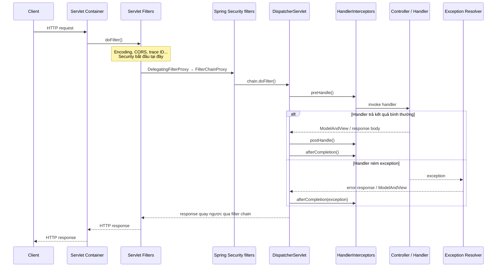
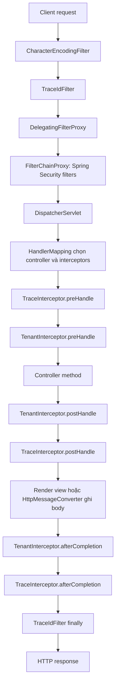

`Filter` và `Interceptor` đều có thể chặn request để thêm logic dùng chung như xác thực, logging, trace ID hoặc giới hạn tốc độ. Tuy nhiên chúng chạy ở các tầng khác nhau. Chọn sai tầng thường dẫn đến lỗi CORS, response đã commit, `ThreadLocal` bị rò rỉ hoặc endpoint không bao giờ đi qua logic mong muốn.

> [!IMPORTANT]
> Trong Spring, từ **interceptor** có hai nghĩa. `HandlerInterceptor` chặn HTTP handler trong Spring MVC. `MethodInterceptor` chặn method của Spring AOP. Bài này tập trung vào `Filter` và `HandlerInterceptor`, đồng thời phân biệt chúng với AOP để tránh nhầm lẫn.

## Mục lục

- [1. Tổng quan: request đi qua những tầng nào?](#1-tổng-quan-request-đi-qua-những-tầng-nào)
- [2. Filter là gì?](#2-filter-là-gì)
  - [2.1. Servlet Filter Chain](#21-servlet-filter-chain)
  - [2.2. Hợp đồng doFilter](#22-hợp-đồng-dofilter)
  - [2.3. Các dispatcher type](#23-các-dispatcher-type)
- [3. HandlerInterceptor là gì?](#3-handlerinterceptor-là-gì)
  - [3.1. Ba callback chính](#31-ba-callback-chính)
  - [3.2. Interceptor chain được chọn thế nào](#32-interceptor-chain-được-chọn-thế-nào)
- [4. Luồng request end-to-end](#4-luồng-request-end-to-end)
- [5. Filter vs HandlerInterceptor vs AOP](#5-filter-vs-handlerinterceptor-vs-aop)
- [6. Đăng ký và sắp xếp Filter](#6-đăng-ký-và-sắp-xếp-filter)
  - [6.1. OncePerRequestFilter](#61-onceperrequestfilter)
  - [6.2. FilterRegistrationBean và thứ tự](#62-filterregistrationbean-và-thứ-tự)
  - [6.3. Request wrapper](#63-request-wrapper)
- [7. Đăng ký và sắp xếp HandlerInterceptor](#7-đăng-ký-và-sắp-xếp-handlerinterceptor)
- [8. Ví dụ thực tế: correlation ID và request logging](#8-ví-dụ-thực-tế-correlation-id-và-request-logging)
- [9. Authentication và authorization: đặt ở đâu?](#9-authentication-và-authorization-đặt-ở-đâu)
- [10. CORS, exception và response: những ranh giới quan trọng](#10-cors-exception-và-response-những-ranh-giới-quan-trọng)
- [11. Async request và ThreadLocal](#11-async-request-và-threadlocal)
- [12. Reactive WebFlux: không dùng Servlet Filter](#12-reactive-webflux-không-dùng-servlet-filter)
- [13. Anti-patterns và cạm bẫy production](#13-anti-patterns-và-cạm-bẫy-production)
- [14. Checklist chọn đúng cơ chế](#14-checklist-chọn-đúng-cơ-chế)
- [15. Tóm tắt](#15-tóm-tắt)

---

## 1. Tổng quan: request đi qua những tầng nào?

Trong ứng dụng Spring MVC chạy trên Tomcat, Jetty hoặc Undertow, HTTP request đi vào **Servlet container** trước. Container chạy Servlet `Filter` chain. Sau đó request đến `DispatcherServlet`, Spring MVC chọn controller handler phù hợp và chạy `HandlerInterceptor` chain.



Một filter nằm **ngoài** Spring MVC. Vì vậy nó thấy mọi request đi qua servlet mapping: static resource, request bị Spring Security chặn, request không match controller và cả một số error dispatch tuỳ cấu hình.

Một `HandlerInterceptor` nằm **trong** `DispatcherServlet`. Nó chỉ chạy khi Spring MVC đã tìm được một handler qua `HandlerMapping`. Interceptor biết controller method nào sắp chạy, nhưng không thể thay thế filter cho các vấn đề ở tầng container.

> [!TIP]
> Câu hỏi quyết định: **cần chặn HTTP request trước khi Spring MVC chọn controller không?** Nếu có, dùng Filter. Nếu cần metadata của controller hoặc logic MVC, dùng `HandlerInterceptor`.

## 2. Filter là gì?

`Filter` là chuẩn Jakarta Servlet, không phải API riêng của Spring:

```java
import jakarta.servlet.Filter;

public interface Filter {
    void doFilter(
        ServletRequest request,
        ServletResponse response,
        FilterChain chain
    ) throws IOException, ServletException;
}
```

Nó được Servlet container gọi. Vì là chuẩn Servlet, cùng một filter có thể chạy trong Spring MVC, Jakarta EE thuần hoặc bất kỳ framework nào dùng Servlet.

### 2.1. Servlet Filter Chain

Mỗi filter nhận `FilterChain`. Gọi `chain.doFilter(request, response)` để chuyển request tới filter tiếp theo. Khi filter cuối hoàn thành, container gọi servlet đích — trong Spring MVC thường là `DispatcherServlet`.

```text
Request đi xuống:
Client → Filter A → Filter B → DispatcherServlet → Controller

Response quay ngược:
Client ← Filter A ← Filter B ← DispatcherServlet ← Controller
```

Cấu trúc này giải thích vì sao một filter có thể thực hiện logic trước và sau controller:

```java
@Component
@Order(20)
public class TimingFilter implements Filter {

    @Override
    public void doFilter(
            ServletRequest request,
            ServletResponse response,
            FilterChain chain) throws IOException, ServletException {

        long startedAt = System.nanoTime();
        try {
            chain.doFilter(request, response); // tiếp tục chain
        } finally {
            long elapsedMs = (System.nanoTime() - startedAt) / 1_000_000;
            System.out.println("Request took " + elapsedMs + " ms");
        }
    }
}
```

Nếu filter **không gọi** `chain.doFilter()`, chain bị dừng. Đây là cách một filter trả `401 Unauthorized`, xử lý CORS preflight hoặc redirect trước khi controller chạy.

```java
if (!isAllowed(request)) {
    HttpServletResponse httpResponse = (HttpServletResponse) response;
    httpResponse.sendError(HttpServletResponse.SC_FORBIDDEN);
    return; // controller và các filter sau không chạy
}
chain.doFilter(request, response);
```

> [!WARNING]
> Sau khi đã tự ghi response hoặc gọi `sendError()`, không gọi `chain.doFilter()`. Hai bên cùng ghi response có thể gây `IllegalStateException`, body bị trộn hoặc status code sai.

### 2.2. Hợp đồng doFilter

Một filter cần bảo toàn ba điều:

1. Chỉ gọi `chain.doFilter()` **một lần**, trừ khi bạn chủ động triển khai flow đặc biệt và hiểu rõ hậu quả.
2. Dọn tài nguyên trong `finally`, vì controller hoặc filter sau có thể ném exception.
3. Không giả định `ServletRequest` luôn là HTTP nếu filter có thể tái sử dụng. Với ứng dụng web thông thường, cast sớm sang `HttpServletRequest` và `HttpServletResponse` giúp code rõ ràng hơn.

Mẫu an toàn:

```java
@Override
public void doFilter(
        ServletRequest request,
        ServletResponse response,
        FilterChain chain) throws IOException, ServletException {

    try {
        beforeRequest((HttpServletRequest) request);
        chain.doFilter(request, response);
    } finally {
        afterRequest(); // đóng span, clear MDC, clear ThreadLocal...
    }
}
```

Filter có thể thay request/response bằng wrapper. Ví dụ, `ContentCachingRequestWrapper` cho phép đọc lại body sau khi request được xử lý; `ContentCachingResponseWrapper` cho phép quan sát body trước khi gửi về client. Chi tiết ở phần [Request wrapper](#63-request-wrapper).

### 2.3. Các dispatcher type

Một HTTP interaction không nhất thiết chỉ có một `REQUEST` dispatch. Servlet API có các dispatcher type quan trọng:

| Dispatcher type | Khi nào xuất hiện | Ví dụ |
|---|---|---|
| `REQUEST` | Request ban đầu từ client | `GET /orders/42` |
| `ASYNC` | Async Servlet tiếp tục xử lý | `Callable`, `DeferredResult` hoàn tất |
| `ERROR` | Container dispatch sang error endpoint | `/error` sau exception hoặc `sendError()` |
| `FORWARD` | Servlet/controller forward nội bộ | `RequestDispatcher.forward()` |
| `INCLUDE` | Include output của resource khác | JSP include |

Một filter được map cho dispatcher type nào quyết định nó có chạy lại trên các dispatch tiếp theo hay không. Đây là lý do `OncePerRequestFilter` tồn tại.

## 3. HandlerInterceptor là gì?

`HandlerInterceptor` là extension point của Spring MVC. Nó hoạt động sau khi `DispatcherServlet` xác định handler sẽ phục vụ request, nhưng trước khi controller method được gọi.

```java
import org.springframework.web.servlet.HandlerInterceptor;

public class AuditInterceptor implements HandlerInterceptor {
    // override các callback cần thiết
}
```

Khác Filter, interceptor nhận `Object handler`. Với controller annotation-based, object này thường là `HandlerMethod`, chứa controller bean, Java `Method`, annotation và thông tin tham số.

### 3.1. Ba callback chính

```java
public class AuditInterceptor implements HandlerInterceptor {

    @Override
    public boolean preHandle(
            HttpServletRequest request,
            HttpServletResponse response,
            Object handler) throws Exception {
        // chạy trước handler
        return true;
    }

    @Override
    public void postHandle(
            HttpServletRequest request,
            HttpServletResponse response,
            Object handler,
            ModelAndView modelAndView) throws Exception {
        // chạy sau handler return thành công,
        // trước khi render view
    }

    @Override
    public void afterCompletion(
            HttpServletRequest request,
            HttpServletResponse response,
            Object handler,
            Exception ex) throws Exception {
        // luôn chạy sau khi toàn bộ request hoàn tất
    }
}
```

| Callback | Thời điểm | Mục đích phù hợp |
|---|---|---|
| `preHandle` | Sau handler mapping, trước controller | Kiểm tra annotation, tenant context, request audit |
| `postHandle` | Controller return bình thường, trước render view | Bổ sung model cho MVC view |
| `afterCompletion` | Sau render hoặc sau khi exception được xử lý | Dọn request context, ghi audit outcome |

`preHandle()` trả `true` để tiếp tục. Trả `false` sẽ dừng execution chain. Interceptor đã dừng chain chịu trách nhiệm hoàn thành response, ví dụ set status/body hoặc redirect.

```java
@Override
public boolean preHandle(
        HttpServletRequest request,
        HttpServletResponse response,
        Object handler) throws IOException {

    if (!hasValidTenant(request)) {
        response.sendError(HttpServletResponse.SC_BAD_REQUEST, "Missing tenant");
        return false;
    }
    return true;
}
```

`postHandle()` không phải nơi tốt để sửa JSON response. Với `@ResponseBody` hoặc `ResponseEntity`, `HttpMessageConverter` có thể đã ghi body và commit response trước khi `postHandle()` được gọi. Hãy dùng `ResponseBodyAdvice`, `@ControllerAdvice` hoặc Filter response wrapper nếu thực sự cần biến đổi body.

> [!NOTE]
> `afterCompletion()` chỉ được gọi cho các interceptor có `preHandle()` đã trả `true`. Vì vậy chỉ tạo state cần cleanup sau khi interceptor đã quyết định cho request đi tiếp.

### 3.2. Interceptor chain được chọn thế nào

`DispatcherServlet` hỏi các `HandlerMapping` để tìm handler. `RequestMappingHandlerMapping` thường trả về `HandlerExecutionChain`: handler cộng với danh sách interceptor áp dụng cho path đó.

```text
GET /api/orders/42
      │
      ▼
RequestMappingHandlerMapping
      │
      ├── chọn handler: OrderController.getById(Long)
      └── ghép HandlerExecutionChain:
          [TraceInterceptor, TenantInterceptor, AuditInterceptor]
      │
      ▼
DispatcherServlet gọi preHandle theo thứ tự
```

Khi handler hoàn thành, callback đi ngược:

```text
preHandle:        Trace → Tenant → Audit → Controller
postHandle:       Controller → Audit → Tenant → Trace
afterCompletion:  Controller → Audit → Tenant → Trace
```

Nếu `TenantInterceptor.preHandle()` trả `false`, `AuditInterceptor` và controller không chạy. `afterCompletion()` chỉ chạy cho các interceptor đã pre-handle thành công trước đó, tức `TraceInterceptor`.

## 4. Luồng request end-to-end

Ví dụ ứng dụng có encoding filter, Spring Security, trace filter và hai MVC interceptor:



Các điểm cần nhớ:

- Spring Security là **một phần của servlet filter chain**, không phải `HandlerInterceptor`.
- `DispatcherServlet` chỉ thấy request nếu filter trước đó gọi `chain.doFilter()`.
- `HandlerInterceptor` chỉ có mặt sau khi Spring MVC đã xác định handler.
- Filter có thể quan sát request/response bao quanh toàn bộ DispatcherServlet. Interceptor có thêm ngữ cảnh handler nhưng không bao trùm container.

## 5. Filter vs HandlerInterceptor vs AOP

| Tiêu chí | Servlet Filter | `HandlerInterceptor` | AOP `MethodInterceptor` / `@Around` |
|---|---|---|---|
| Tầng chạy | Servlet container | Spring MVC, trong `DispatcherServlet` | Spring bean proxy |
| Đơn vị chặn | HTTP request/response | HTTP handler/controller | Java method call |
| Biết controller method? | Không trực tiếp | Có, qua `HandlerMethod` | Có method của bean được proxy |
| Chạy trước Spring Security? | Có thể, tuỳ order | Không, Security đã chạy trước | Không liên quan HTTP nếu method gọi từ nơi khác |
| Áp dụng cho static resource | Có | Thường không nếu không có MVC handler phù hợp | Không |
| Có thể wrap request/response | Có | Không phải mục đích chính | Không |
| Use case điển hình | CORS, compression, logging, request body wrapper | Audit theo endpoint, tenant từ route, annotation-based policy | Transaction, cache, retry, method authorization |

Ví dụ `@Transactional` không nên đặt trong Filter hoặc HandlerInterceptor. Transaction là concern của **business method**, vì nó phải bao quanh chính xác service/repository operations. Spring dùng AOP `TransactionInterceptor` để chặn lời gọi service qua proxy.

Ngược lại, CORS không nên giải quyết bằng AOP. Browser cần CORS header ngay ở HTTP layer, kể cả với preflight `OPTIONS` request không đi tới controller.

> [!TIP]
> Filter xử lý **HTTP transport**. `HandlerInterceptor` xử lý **MVC endpoint**. AOP xử lý **lời gọi method trong application**.

## 6. Đăng ký và sắp xếp Filter

Spring Boot có nhiều cách đăng ký filter. Với filter quản lý bởi Spring, phổ biến nhất là `@Component` kết hợp `@Order`, hoặc `FilterRegistrationBean` khi cần mapping/dispatcher type rõ ràng.

### 6.1. OncePerRequestFilter

Với filter Spring, ưu tiên kế thừa `OncePerRequestFilter`:

```java
import org.springframework.web.filter.OncePerRequestFilter;

@Component
@Order(20)
public class TraceIdFilter extends OncePerRequestFilter {

    @Override
    protected void doFilterInternal(
            HttpServletRequest request,
            HttpServletResponse response,
            FilterChain filterChain) throws ServletException, IOException {

        // logic chạy tối đa một lần cho mỗi request dispatch theo policy của class
        filterChain.doFilter(request, response);
    }
}
```

Class này đặt request attribute với tên riêng để phát hiện filter đã chạy. Nó cũng cung cấp hook rõ ràng cho async và error dispatch:

```java
@Override
protected boolean shouldNotFilterAsyncDispatch() {
    return true; // mặc định: không chạy trong ASYNC dispatch
}

@Override
protected boolean shouldNotFilterErrorDispatch() {
    return true; // mặc định: không chạy trong ERROR dispatch
}
```

`OncePerRequestFilter` không có nghĩa “chỉ chạy một lần cho toàn bộ vòng đời logic trong mọi trường hợp”. Ý nghĩa chính xác phụ thuộc dispatcher type và hai hook trên. Khi bạn override để chạy trong async/error dispatch, hãy thiết kế logic idempotent — có thể chạy thêm dispatch.

### 6.2. FilterRegistrationBean và thứ tự

Dùng `FilterRegistrationBean` khi filter chỉ áp dụng cho một số URL, phải chọn dispatcher type, hoặc cần order rõ ràng so với các registration khác:

```java
@Configuration
public class FilterConfig {

    @Bean
    FilterRegistrationBean<RequestLogFilter> requestLogFilterRegistration(
            RequestLogFilter filter) {

        FilterRegistrationBean<RequestLogFilter> registration =
            new FilterRegistrationBean<>(filter);

        registration.addUrlPatterns("/api/*");
        registration.setDispatcherTypes(
            DispatcherType.REQUEST,
            DispatcherType.ASYNC,
            DispatcherType.ERROR
        );
        registration.setOrder(50);
        return registration;
    }
}
```

**Số order nhỏ chạy trước.** Hãy coi order là một phần của contract hệ thống, không phải chi tiết ngẫu nhiên. Ví dụ CORS phải chạy trước authentication để preflight không bị trả `401`.

Có hai hệ thống order hay bị lẫn:

| API | Nó sắp xếp cái gì? |
|---|---|
| `@Order` / `FilterRegistrationBean#setOrder()` | Servlet filters được Boot đăng ký với container |
| `http.addFilterBefore()` / `addFilterAfter()` | Chỉ filters **bên trong Spring Security FilterChain** |
| `InterceptorRegistration.order()` | Spring MVC `HandlerInterceptor` |

Không thể dùng `http.addFilterBefore()` để sắp xếp một filter container thông thường. Nó chỉ thêm filter vào `FilterChainProxy` của Spring Security.

### 6.3. Request wrapper

Servlet request body là stream, thường chỉ đọc được một lần. Nếu logging filter đọc `request.getInputStream()` trực tiếp, controller sau đó có thể nhận body rỗng.

Dùng caching wrapper và chỉ đọc cache sau khi downstream đã xử lý:

```java
@Component
@Order(30)
public class PayloadLoggingFilter extends OncePerRequestFilter {

    @Override
    protected void doFilterInternal(
            HttpServletRequest request,
            HttpServletResponse response,
            FilterChain filterChain) throws ServletException, IOException {

        ContentCachingRequestWrapper wrappedRequest =
            new ContentCachingRequestWrapper(request);
        ContentCachingResponseWrapper wrappedResponse =
            new ContentCachingResponseWrapper(response);

        try {
            filterChain.doFilter(wrappedRequest, wrappedResponse);
            logPayload(wrappedRequest.getContentAsByteArray());
        } finally {
            // BẮT BUỘC: chép body cache về response thật.
            wrappedResponse.copyBodyToResponse();
        }
    }
}
```

Không log password, access token, cookie, dữ liệu thanh toán hoặc toàn bộ body không giới hạn kích thước. Production logger nên có allowlist content type, giới hạn byte và cơ chế masking.

## 7. Đăng ký và sắp xếp HandlerInterceptor

Đăng ký MVC interceptor qua `WebMvcConfigurer`. Cách này giữ mapping và thứ tự ở một nơi có thể review được:

```java
@Configuration
public class WebConfig implements WebMvcConfigurer {

    private final TraceInterceptor traceInterceptor;
    private final TenantInterceptor tenantInterceptor;

    public WebConfig(
            TraceInterceptor traceInterceptor,
            TenantInterceptor tenantInterceptor) {
        this.traceInterceptor = traceInterceptor;
        this.tenantInterceptor = tenantInterceptor;
    }

    @Override
    public void addInterceptors(InterceptorRegistry registry) {
        registry.addInterceptor(traceInterceptor)
            .addPathPatterns("/**")
            .excludePathPatterns("/actuator/health", "/error")
            .order(10);

        registry.addInterceptor(tenantInterceptor)
            .addPathPatterns("/api/**")
            .excludePathPatterns("/api/public/**")
            .order(20);
    }
}
```

`addPathPatterns()` và `excludePathPatterns()` chỉ điều khiển interceptor này có được thêm vào `HandlerExecutionChain` hay không. Chúng không phải security rule. Một endpoint bị exclude khỏi audit interceptor vẫn cần được authorize bởi Spring Security nếu endpoint đó không public.

Trong `preHandle`, kiểm tra `handler` trước khi cast. Một số handler có thể không phải `HandlerMethod`.

```java
@Override
public boolean preHandle(
        HttpServletRequest request,
        HttpServletResponse response,
        Object handler) {

    if (handler instanceof HandlerMethod method) {
        boolean isPublic = method.hasMethodAnnotation(PublicEndpoint.class);
        // dùng annotation nếu cần
    }
    return true;
}
```

> [!WARNING]
> Đừng dựa vào `@Order` trên bean interceptor để suy luận thứ tự MVC. Khai báo thứ tự bằng `InterceptorRegistration.order(...)` tại nơi đăng ký để ý định không mơ hồ.

## 8. Ví dụ thực tế: correlation ID và request logging

Correlation ID là mã định danh liên kết log của cùng một request. Đây là use case đúng cho Filter vì ID cần có từ đầu request, bao gồm cả Spring Security và lỗi trước controller.

```java
@Component
@Order(10)
public class CorrelationIdFilter extends OncePerRequestFilter {
    private static final String HEADER = "X-Correlation-Id";
    private static final String MDC_KEY = "correlationId";

    @Override
    protected void doFilterInternal(
            HttpServletRequest request,
            HttpServletResponse response,
            FilterChain filterChain) throws ServletException, IOException {

        String correlationId = Optional.ofNullable(request.getHeader(HEADER))
            .filter(value -> value.matches("[A-Za-z0-9-]{1,128}"))
            .orElseGet(() -> UUID.randomUUID().toString());

        MDC.put(MDC_KEY, correlationId);
        response.setHeader(HEADER, correlationId);

        try {
            filterChain.doFilter(request, response);
        } finally {
            MDC.remove(MDC_KEY);
        }
    }
}
```

`MDC` (Mapped Diagnostic Context) là map theo thread mà logging framework dùng để chèn field vào log. `finally` là bắt buộc: Tomcat tái sử dụng thread. Không clear MDC có thể khiến log của request B mang correlation ID của request A.

Nếu audit cần tên controller và method, bổ sung một interceptor chuyên MVC thay vì cố suy đoán ở filter:

```java
@Component
public class EndpointAuditInterceptor implements HandlerInterceptor {

    @Override
    public boolean preHandle(
            HttpServletRequest request,
            HttpServletResponse response,
            Object handler) {

        if (handler instanceof HandlerMethod method) {
            String endpoint = method.getBeanType().getSimpleName()
                + "#" + method.getMethod().getName();
            request.setAttribute("audit.endpoint", endpoint);
        }
        return true;
    }

    @Override
    public void afterCompletion(
            HttpServletRequest request,
            HttpServletResponse response,
            Object handler,
            Exception ex) {

        String endpoint = (String) request.getAttribute("audit.endpoint");
        // Ghi audit bất đồng bộ hoặc publish event; không làm I/O chậm trong request path.
        log.info("endpoint={}, status={}, failed={}",
            endpoint, response.getStatus(), ex != null);
    }
}
```

## 9. Authentication và authorization: đặt ở đâu?

Không dùng `HandlerInterceptor` tự viết làm security framework mặc định. Spring Security thực hiện authentication và authorization bằng filter chain để nó có thể bảo vệ request **trước** DispatcherServlet và áp dụng nhất quán cho mọi endpoint.

```text
Servlet container
  └── DelegatingFilterProxy
        └── FilterChainProxy (Spring Security)
              ├── SecurityContextHolderFilter
              ├── CorsFilter
              ├── BearerTokenAuthenticationFilter / BasicAuthenticationFilter
              ├── ExceptionTranslationFilter
              └── AuthorizationFilter
```

Ví dụ resource server dùng JWT:

```java
@Bean
SecurityFilterChain securityFilterChain(HttpSecurity http) throws Exception {
    return http
        .csrf(csrf -> csrf.disable()) // chỉ phù hợp API stateless không dùng cookie auth
        .authorizeHttpRequests(auth -> auth
            .requestMatchers("/api/public/**", "/actuator/health").permitAll()
            .anyRequest().authenticated()
        )
        .oauth2ResourceServer(oauth2 -> oauth2.jwt())
        .build();
}
```

`BearerTokenAuthenticationFilter` đọc token và tạo `Authentication`. `AuthorizationFilter` kiểm tra quyền trước khi DispatcherServlet chạy. Controller/interceptor sau đó có thể đọc principal từ `SecurityContextHolder`, nhưng không nên tự parse JWT lần nữa.

| Yêu cầu | Lựa chọn |
|---|---|
| Xác thực JWT/session/basic auth | Spring Security filter chain |
| URL authorization (`/admin/**`) | Spring Security `authorizeHttpRequests` |
| Rule phụ thuộc method/đối tượng nghiệp vụ | `@PreAuthorize` hoặc service-layer authorization |
| Kiểm tra metadata endpoint cho mục đích audit | `HandlerInterceptor` |
| Tenant context sau khi user đã xác thực | Filter sau security hoặc interceptor, tuỳ nguồn tenant |

> [!IMPORTANT]
> `excludePathPatterns()` của interceptor không phải là cơ chế bypass Spring Security. Security được quyết định trong filter chain trước đó.

## 10. CORS, exception và response: những ranh giới quan trọng

### CORS phải xử lý trước authentication

Preflight request là `OPTIONS` request do browser gửi trước request cross-origin thật. Nó thường không có credential như JWT. Nếu authentication filter chạy trước CORS và trả `401`, browser sẽ chặn request thật.

Dùng Spring Security CORS integration hoặc `CorsFilter` được sắp xếp đúng:

```java
@Bean
CorsConfigurationSource corsConfigurationSource() {
    CorsConfiguration config = new CorsConfiguration();
    config.setAllowedOrigins(List.of("https://app.example.com"));
    config.setAllowedMethods(List.of("GET", "POST", "PUT", "DELETE"));
    config.setAllowedHeaders(List.of("Authorization", "Content-Type", "X-Correlation-Id"));
    config.setAllowCredentials(true);

    UrlBasedCorsConfigurationSource source = new UrlBasedCorsConfigurationSource();
    source.registerCorsConfiguration("/api/**", config);
    return source;
}

// Trong SecurityFilterChain:
// http.cors(Customizer.withDefaults());
```

Không cấu hình `allowedOrigins = "*"` cùng `allowCredentials = true`. Browser không cho phép tổ hợp đó, và nó cũng phá vỡ ranh giới origin cần thiết cho cookie credential.

### Exception từ Filter và từ Controller không đi cùng một đường

`@ControllerAdvice` và `HandlerExceptionResolver` xử lý exception trong luồng DispatcherServlet/controller. Exception ném ở **filter trước DispatcherServlet** có thể không tới `@ControllerAdvice`.

Nếu filter tự xử lý lỗi API, hãy trả format response nhất quán và không nuốt exception vô tình:

```java
try {
    filterChain.doFilter(request, response);
} catch (InvalidTenantException ex) {
    response.setStatus(HttpServletResponse.SC_BAD_REQUEST);
    response.setContentType(MediaType.APPLICATION_JSON_VALUE);
    response.getWriter().write("{\"code\":\"INVALID_TENANT\"}");
}
```

Với authentication/authorization, để Spring Security `AuthenticationEntryPoint` và `AccessDeniedHandler` trả `401`/`403`. Đừng bắt `AccessDeniedException` ở một filter chung rồi biến mọi lỗi thành `500`.

## 11. Async request và ThreadLocal

Spring MVC async (`Callable`, `DeferredResult`, streaming) có thể nhả thread container ban đầu và hoàn tất trên thread khác. `ThreadLocal`, bao gồm MDC và context tự tạo, không tự động đi theo thread mới.

```java
@GetMapping("/report")
public Callable<Report> report() {
    return () -> reportService.generate(); // có thể chạy ở task executor thread
}
```

Hệ quả:

- Filter có thể được gọi lại ở `ASYNC` dispatch nếu được cấu hình cho dispatcher type đó.
- `HandlerInterceptor.preHandle()` có thể được gọi trong dispatch lại.
- `postHandle()` và `afterCompletion()` không phải thời điểm duy nhất cần cleanup khi async bắt đầu.
- MDC/tenant context giữ trong `ThreadLocal` cần được truyền sang task executor hoặc thiết kế lại thành tham số/context rõ ràng.

`AsyncHandlerInterceptor` thêm callback `afterConcurrentHandlingStarted()`. Khi request chuyển sang async, callback này chạy trên thread ban đầu trước khi thread được giải phóng:

```java
@Component
public class TenantAsyncInterceptor implements AsyncHandlerInterceptor {

    @Override
    public boolean preHandle(HttpServletRequest request,
                             HttpServletResponse response,
                             Object handler) {
        TenantContext.set(readTenant(request));
        return true;
    }

    @Override
    public void afterConcurrentHandlingStarted(
            HttpServletRequest request,
            HttpServletResponse response,
            Object handler) {
        TenantContext.clear(); // giải phóng thread gốc ngay khi async bắt đầu
    }

    @Override
    public void afterCompletion(HttpServletRequest request,
                                HttpServletResponse response,
                                Object handler,
                                Exception ex) {
        TenantContext.clear();
    }
}
```

Nếu dùng `@Async`, `CompletableFuture` hoặc executor riêng, dùng `TaskDecorator` để copy có kiểm soát MDC/context sang task rồi clear trong `finally`. Với `SecurityContext`, dùng `DelegatingSecurityContextAsyncTaskExecutor` thay vì tự copy object authentication một cách tuỳ tiện.

> [!WARNING]
> `InheritableThreadLocal` không giải quyết thread pool. Giá trị chỉ được sao chép lúc thread được tạo; thread pool tái sử dụng worker cho request khác. Điều đó có thể làm tenant hoặc identity của request cũ rò rỉ sang request mới.

## 12. Reactive WebFlux: không dùng Servlet Filter

Spring WebFlux không chạy trên Servlet API khi dùng Reactor Netty. Vì vậy `jakarta.servlet.Filter` và `HandlerInterceptor` của Spring MVC không áp dụng.

WebFlux tương ứng:

| Spring MVC / Servlet | Spring WebFlux |
|---|---|
| `Filter` | `WebFilter` |
| `FilterChain` | `WebFilterChain` |
| `HandlerInterceptor` | `WebFilter`, `HandlerFilterFunction`, `WebExceptionHandler` |
| `ThreadLocal` context | Reactor `Context` |

```java
@Component
public class CorrelationWebFilter implements WebFilter {

    @Override
    public Mono<Void> filter(ServerWebExchange exchange, WebFilterChain chain) {
        String id = UUID.randomUUID().toString();
        exchange.getResponse().getHeaders().add("X-Correlation-Id", id);

        return chain.filter(exchange)
            .contextWrite(context -> context.put("correlationId", id));
    }
}
```

Không lưu request context reactive vào `ThreadLocal`. Một reactive pipeline có thể đổi thread giữa các operator. Dùng Reactor `Context` hoặc truyền data tường minh.

## 13. Anti-patterns và cạm bẫy production

| Anti-pattern | Vì sao sai | Cách sửa |
|---|---|---|
| Tự viết auth trong `HandlerInterceptor` | Request đã qua một phần MVC; xử lý 401/403, async, path rule dễ sai | Dùng Spring Security filter chain |
| Đọc request body trực tiếp trong filter | Controller không đọc lại được stream | Dùng `ContentCachingRequestWrapper` hoặc wrapper riêng |
| Quên `copyBodyToResponse()` | `ContentCachingResponseWrapper` giữ body trong buffer | Luôn copy trong `finally` khi wrapper được dùng |
| Log toàn bộ payload | Lộ PII/token/password; tốn memory và I/O | Mask field nhạy cảm, giới hạn size, allowlist content type |
| Set `ThreadLocal` mà không clear | Thread pool reuse → context request cũ bị rò rỉ | Clear trong `finally`; xử lý async rõ ràng |
| Xử lý CORS sau authentication | Preflight bị `401`/`403` | Cấu hình `.cors()` trong Security hoặc đặt CORS filter đúng order |
| Gọi `chain.doFilter()` sau `sendError()` | Hai layer cùng ghi response | `return` ngay sau khi tự hoàn tất response |
| Dùng interceptor để bảo vệ static file | Interceptor có thể không chạy với resource đó | Security/filter rule phù hợp ở container/security layer |
| Đặt order rời rạc bằng số magic | Thay đổi filter làm flow khó dự đoán | Ghi rõ contract order, dùng `addFilterBefore` cho Security nội bộ |
| Throw exception từ filter và mong `@ControllerAdvice` luôn bắt | Filter có thể nằm ngoài DispatcherServlet | Tự trả lỗi phù hợp hoặc delegate cho cơ chế Security/container |
| Long-running I/O trong interceptor/filter | Giữ servlet thread, tăng latency toàn hệ thống | Chỉ thiết lập context/validate nhẹ; đưa I/O nặng sang service/event queue |

## 14. Checklist chọn đúng cơ chế

1. Logic cần chạy cho **mọi HTTP request**, trước DispatcherServlet, hoặc cần wrap request/response? → **Servlet Filter**.
2. Logic cần biết controller method, route mapping hoặc annotation endpoint? → **`HandlerInterceptor`**.
3. Logic cần bao quanh service/repository method và cả lời gọi không đến từ HTTP? → **Spring AOP** (`@Transactional`, `@Cacheable`, aspect).
4. Logic liên quan identity, JWT, session, URL authorization, CSRF hay CORS với security chain? → **Spring Security**.
5. Ứng dụng là WebFlux? → **`WebFilter`**, không dùng Servlet Filter/MVC interceptor.
6. Có `ThreadLocal`? → Có `finally` clear, và có kế hoạch propagation/cleanup cho async.
7. Tự dừng chain? → Đã set đầy đủ status, header, body và `return` chưa?

## 15. Tóm tắt

```text
Filter
  = tầng Servlet container
  = bao quanh DispatcherServlet
  = phù hợp cho HTTP transport, CORS, tracing, wrapping request/response

HandlerInterceptor
  = tầng Spring MVC
  = chạy sau khi đã chọn controller handler
  = phù hợp cho endpoint metadata, MVC audit, context theo route

AOP MethodInterceptor
  = tầng Spring bean method
  = phù hợp cho transaction, cache, retry và business cross-cutting concern

Spring Security
  = filter chain chuyên dụng
  = nơi mặc định cho authentication và authorization HTTP
```

> [!TIP]
> Quy tắc ngắn gọn: **Filter trước MVC, Interceptor quanh controller, AOP quanh service method.** Giữ mỗi concern ở đúng tầng sẽ giúp order dễ đọc, lỗi dễ debug và security nhất quán hơn.

<Cards>
  <Card title="Spring Security" href="/docs/spring/spring-security" description="Hiểu DelegatingFilterProxy, FilterChainProxy và security filter chain." />
  <Card title="Spring Proxy" href="/docs/spring/spring-proxy" description="Hiểu interceptor chain của Spring AOP và giới hạn proxy." />
  <Card title="Spring Transaction" href="/docs/spring/spring-transaction" description="Xem TransactionInterceptor áp dụng transaction quanh service method." />
</Cards>
