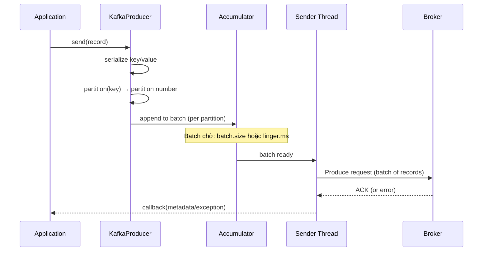
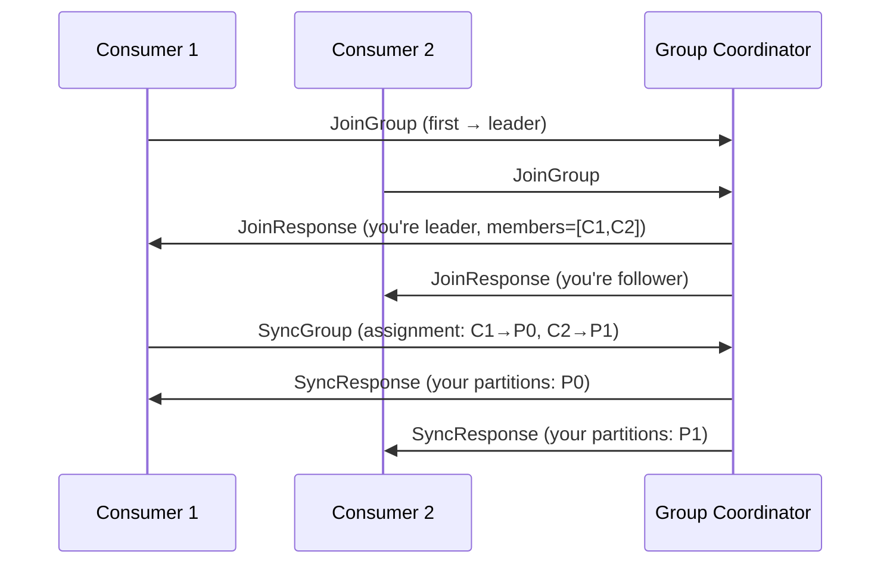
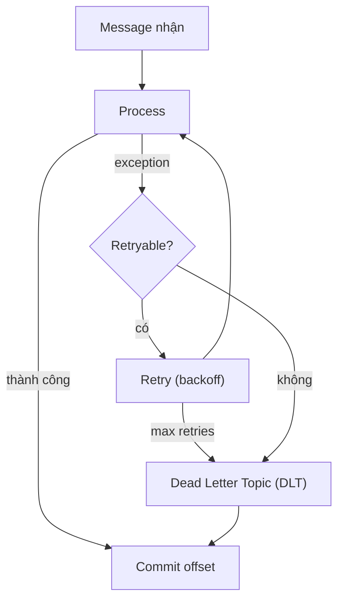

## Mục lục

- [Bối cảnh: Message mất — consumer commit trước khi xử lý xong](#1-bối-cảnh-message-mất--consumer-commit-trước-khi-xử-lý-xong)
- [Kafka Architecture — Broker, Topic, Partition, Replica](#2-kafka-architecture--broker-topic-partition-replica)
- [Producer Internals — batching, acks, idempotent](#3-producer-internals--batching-acks-idempotent)
- [Consumer Group Protocol — coordinator & rebalancing](#4-consumer-group-protocol--coordinator--rebalancing)
- [Offset Management — commit strategies](#5-offset-management--commit-strategies)
- [Spring KafkaTemplate — producer trong Spring](#6-spring-kafkatemplate--producer-trong-spring)
- [@KafkaListener — consumer trong Spring](#7-kafkalistener--consumer-trong-spring)
- [Error Handling — retry, DLT, backoff](#8-error-handling--retry-dlt-backoff)
- [Exactly-Once Semantics (EOS)](#9-exactly-once-semantics-eos)
- [Production Tuning & Monitoring](#10-production-tuning--monitoring)
- [Anti-patterns & Tóm tắt](#11-anti-patterns--tóm-tắt)

---

## 1. Bối cảnh: Message mất — consumer commit trước khi xử lý xong

Order service nhận event từ Kafka:

```java
@KafkaListener(topics = "orders")
public void onOrder(OrderEvent event) {
    orderService.process(event);  // call DB + external API (2-5 giây)
}
```

Cấu hình default Spring Kafka: `enable.auto.commit=true`, `auto.commit.interval.ms=5000`.

Kịch bản: consumer poll 100 message → xử lý message 1-50 (25 giây) → **auto-commit offset = 100** (đã poll tất cả) → **crash** → restart → consumer tiếp tục từ offset 101 → **message 51-100 mất** (đã commit nhưng chưa xử lý).

```
poll 100 messages: [1, 2, 3, ..., 50, 51, ..., 100]
                    │                  │
                    ▼                  ▼
        xử lý xong 1-50      chưa xử lý 51-100
                    │
    auto-commit offset = 100 (commit hết batch đã poll)
                    │
                CRASH 💥
                    │
    restart → resume từ 101 → 51-100 MẤT
```

> [!IMPORTANT]
> `enable.auto.commit=true` (default Kafka client) commit offset **theo thời gian**, không theo xử lý. Spring Kafka mặc định **tắt** auto-commit và dùng `AckMode.BATCH` (commit sau khi xử lý hết batch). Nhưng nếu override config sai → message loss.

---

## 2. Kafka Architecture — Broker, Topic, Partition, Replica

```
┌─────────────────────────────────────────────────────┐
│                    Kafka Cluster                      │
│                                                       │
│  Broker 0            Broker 1           Broker 2      │
│  ┌──────────┐       ┌──────────┐      ┌──────────┐   │
│  │Topic: orders│     │Topic: orders│   │Topic: orders│ │
│  │ P0 (leader)│     │ P1 (leader)│   │ P2 (leader)│  │
│  │ P1 (replica)│    │ P2 (replica)│  │ P0 (replica)│ │
│  └──────────┘       └──────────┘      └──────────┘   │
│                                                       │
│  Controller: Broker 0 (quản lý partition assignment)  │
└─────────────────────────────────────────────────────┘

Producer ──→ Partition (by key hash) ──→ Broker (leader)
Consumer ←── Partition (assigned by group coordinator) ←── Broker
```

| Concept | Ý nghĩa |
|---------|---------|
| **Topic** | Logical channel (giống table) |
| **Partition** | Unit of parallelism — ordered, append-only log |
| **Offset** | Position trong partition (0, 1, 2, ...) — immutable |
| **Replica** | Bản sao partition — leader serve read/write, follower replicate |
| **ISR** | In-Sync Replicas — follower đã replicate đủ |

### 2.1. Partition = parallelism

```
Topic "orders" (3 partitions):

Partition 0: [msg0][msg3][msg6][msg9]...
Partition 1: [msg1][msg4][msg7][msg10]...
Partition 2: [msg2][msg5][msg8][msg11]...

Consumer Group "order-service" (3 instances):
  Consumer A ← P0
  Consumer B ← P1
  Consumer C ← P2
```

> [!NOTE]
> **Số partition = upper bound** cho consumer parallelism trong 1 group. 3 partition → tối đa 3 consumer. Consumer thứ 4 sẽ **idle**. Nhưng tăng partition → tăng end-to-end latency, metadata overhead, và rebalancing time.

---

## 3. Producer Internals — batching, acks, idempotent

### 3.1. Send flow



### 3.2. Acks — mức đảm bảo ghi

| acks | Ý nghĩa | Durability | Throughput |
|------|---------|-----------|-----------|
| `0` | Fire-and-forget — không chờ | Có thể mất | **Cao nhất** |
| `1` | Leader nhận — không chờ replica | Mất nếu leader crash trước replicate | Cao |
| `all` (`-1`) | **Tất cả ISR** nhận | **Cao nhất** | Thấp hơn |

### 3.3. Idempotent Producer

```properties
enable.idempotence=true   # default từ Kafka 3.0
```

Producer gắn **sequence number** cho mỗi message gửi tới partition. Broker track `(producerId, partition, seqNum)`:
- Duplicate → reject (seqNum đã thấy)
- Gap → reject (seqNum nhảy — mất message)

→ **Exactly-once** ghi vào **1 partition** (không cần transaction cho single partition).

> [!TIP]
> Từ Kafka 3.0: `enable.idempotence=true` là **default**. Kết hợp `acks=all` + `retries=MAX_INT` → **at-least-once delivery** mạnh nhất ở producer side. Zero config cần thay đổi.

---

## 4. Consumer Group Protocol — coordinator & rebalancing

### 4.1. Group Coordinator

Mỗi consumer group có **1 broker** làm **Group Coordinator** (broker hosting `__consumer_offsets` partition cho group đó):



### 4.2. Rebalancing — khi nào?

| Trigger | Ví dụ |
|---------|------|
| Consumer join | New instance deploy |
| Consumer leave | Instance crash / `close()` |
| Consumer timeout | `session.timeout.ms` (heartbeat miss) |
| Topic metadata change | Partition count tăng |

**Rebalance = stop-the-world cho consumer group** — tất cả consumer **dừng fetch**, rebalance, assign lại partition → message processing **bị gián đoạn**.

### 4.3. Partition Assignment Strategies

| Strategy | Hành vi |
|----------|---------|
| `RangeAssignor` (default) | Chia partition liên tục cho mỗi consumer |
| `RoundRobinAssignor` | Round-robin partition across consumers |
| `StickyAssignor` | Giữ assignment cũ nhiều nhất có thể → **ít migration** |
| `CooperativeStickyAssignor` | **Incremental rebalance** — chỉ revoke partition cần di chuyển | |

> [!IMPORTANT]
> `CooperativeStickyAssignor` (Kafka 2.4+) là **best practice** — giảm rebalance impact từ "stop-the-world" xuống "chỉ migrate partition cần thiết". Config: `partition.assignment.strategy=org.apache.kafka.clients.consumer.CooperativeStickyAssignor`.

---

## 5. Offset Management — commit strategies

| Strategy | Hành vi | Risk |
|----------|---------|------|
| **Auto commit** | Commit mỗi `auto.commit.interval.ms` | **Message loss** (commit trước khi xử lý) |
| **Manual sync** (`commitSync`) | Block cho đến khi commit thành công | Chậm (block per batch) |
| **Manual async** (`commitAsync`) | Non-blocking, callback | Có thể commit fail âm thầm |
| **Spring BATCH** (default) | Commit sau khi xử lý hết records từ `poll()` | **At-least-once** — duplicate khi crash |
| **Spring RECORD** | Commit sau **mỗi record** | Chậm hơn, ít duplicate |
| **Spring MANUAL_IMMEDIATE** | Code gọi `ack.acknowledge()` | Full control |

### 5.1. At-least-once vs At-most-once

```
At-least-once (commit SAU xử lý):
  poll → process → commit
  Crash after process, before commit → re-process (DUPLICATE)

At-most-once (commit TRƯỚC xử lý):
  poll → commit → process
  Crash after commit, before process → LOST message

Exactly-once:
  poll → process + commit TRONG CÙNG transaction
  Cần: Kafka transaction + idempotent consumer
```

> [!NOTE]
> **At-least-once + idempotent consumer** là strategy phổ biến nhất trong production. Đảm bảo không mất message, xử lý duplicate ở application layer (dedup by ID).

---

## 6. Spring KafkaTemplate — producer trong Spring

### 6.1. Gửi message

```java
@Autowired
private KafkaTemplate<String, OrderEvent> kafkaTemplate;

public void sendOrder(OrderEvent event) {
    CompletableFuture<SendResult<String, OrderEvent>> future =
        kafkaTemplate.send("orders", event.getOrderId(), event);

    future.whenComplete((result, ex) -> {
        if (ex != null) {
            log.error("Send failed: {}", ex.getMessage());
        } else {
            RecordMetadata meta = result.getRecordMetadata();
            log.info("Sent to {}:{} offset={}",
                meta.topic(), meta.partition(), meta.offset());
        }
    });
}
```

### 6.2. Config

```yaml
spring:
  kafka:
    bootstrap-servers: kafka:9092
    producer:
      key-serializer: org.apache.kafka.common.serialization.StringSerializer
      value-serializer: org.springframework.kafka.support.serializer.JsonSerializer
      acks: all
      retries: 2147483647
      properties:
        enable.idempotence: true
        max.in.flight.requests.per.connection: 5   # safe với idempotent
        linger.ms: 20          # batch 20ms → throughput tăng
        batch.size: 65536      # 64KB batch
```

---

## 7. @KafkaListener — consumer trong Spring

### 7.1. Cơ bản

```java
@KafkaListener(
    topics = "orders",
    groupId = "order-service",
    concurrency = "3"    // 3 consumer threads
)
public void onOrder(
        @Payload OrderEvent event,
        @Header(KafkaHeaders.RECEIVED_PARTITION) int partition,
        @Header(KafkaHeaders.OFFSET) long offset,
        Acknowledgment ack) {

    orderService.process(event);
    ack.acknowledge();    // manual commit (nếu AckMode = MANUAL)
}
```

### 7.2. ConcurrentMessageListenerContainer

`concurrency = "3"` tạo **3 KafkaMessageListenerContainer** — mỗi container = 1 thread = 1 Kafka consumer:

```
ConcurrentMessageListenerContainer
  ├─ KafkaMessageListenerContainer #0 → Consumer → P0
  ├─ KafkaMessageListenerContainer #1 → Consumer → P1
  └─ KafkaMessageListenerContainer #2 → Consumer → P2
```

> [!WARNING]
> `concurrency` > số partition → consumer thừa **idle**. `concurrency` < số partition → 1 consumer xử lý nhiều partition. Tối ưu: `concurrency` = số partition (hoặc tuning theo throughput cần thiết).

### 7.3. Batch listener

```java
@KafkaListener(topics = "events", groupId = "analytics")
public void onBatch(List<EventRecord> events) {
    // Nhận batch — xử lý bulk insert hiệu quả hơn
    eventRepo.saveAll(events);
}
```

Config: `spring.kafka.listener.type=batch`

---

## 8. Error Handling — retry, DLT, backoff

### 8.1. DefaultErrorHandler (Spring Kafka 2.8+)

```java
@Bean
DefaultErrorHandler errorHandler(KafkaOperations<String, Object> template) {
    DeadLetterPublishingRecoverer recoverer =
        new DeadLetterPublishingRecoverer(template);

    DefaultErrorHandler handler = new DefaultErrorHandler(
        recoverer,
        new FixedBackOff(1000L, 3)  // retry 3 lần, 1s interval
    );

    // Non-retryable exceptions — skip retry, gửi thẳng DLT
    handler.addNotRetryableExceptions(
        DeserializationException.class,
        ValidationException.class
    );

    return handler;
}
```

### 8.2. Flow



### 8.3. Non-blocking retry (Spring Kafka 2.7+)

```java
@RetryableTopic(
    attempts = "3",
    backoff = @Backoff(delay = 5000, multiplier = 2),
    topicSuffixingStrategy = TopicSuffixingStrategy.SUFFIX_WITH_INDEX_VALUE
)
@KafkaListener(topics = "orders")
public void onOrder(OrderEvent event) {
    orderService.process(event);
}

@DltHandler
public void handleDlt(OrderEvent event) {
    log.error("DLT: order {} failed after all retries", event.getOrderId());
    // alert, store for manual review
}
```

Tạo retry topics: `orders-retry-0`, `orders-retry-1`, `orders-dlt` — message chuyển qua topic retry thay vì block thread.

> [!TIP]
> **Non-blocking retry** (`@RetryableTopic`) tốt hơn blocking retry vì: (1) không block consumer thread, (2) không block partition khác, (3) delay chính xác bằng Kafka topic delay. Nhưng tạo thêm topic → cần manage.

---

## 9. Exactly-Once Semantics (EOS)

### 9.1. Kafka Transaction

Producer đọc từ topic A, xử lý, ghi vào topic B — cần atomic "consume + produce":

```java
@Bean
KafkaTransactionManager<String, Object> kafkaTransactionManager(
        ProducerFactory<String, Object> pf) {
    return new KafkaTransactionManager<>(pf);
}

@Transactional
public void processAndForward(OrderEvent event) {
    // consume (đã được @KafkaListener nhận)
    EnrichedOrder enriched = enrich(event);
    kafkaTemplate.send("enriched-orders", enriched.getId(), enriched);
    // commit offset + produce gửi TRONG CÙNG transaction
}
```

Config:
```yaml
spring.kafka.producer.transaction-id-prefix: tx-order-
spring.kafka.consumer.properties.isolation.level: read_committed
```

### 9.2. Giới hạn EOS

| Scope | EOS? |
|-------|------|
| Kafka → Kafka (consume + produce) | Có (Kafka transaction) |
| Kafka → DB | **Không** trực tiếp — cần outbox pattern hoặc idempotent consumer |
| DB → Kafka | **Không** trực tiếp — cần transactional outbox + CDC |

> [!NOTE]
> EOS trong Kafka chỉ áp dụng cho **Kafka-to-Kafka** flow. Khi có external system (DB, API), dùng **idempotent consumer** + **outbox pattern** thay vì Kafka transaction.

---

## 10. Production Tuning & Monitoring

### 10.1. Key metrics

| Metric | Ý nghĩa | Alert khi |
|--------|---------|----------|
| **Consumer lag** | Khoảng cách giữa latest offset và committed offset | Lag tăng liên tục |
| `records-consumed-rate` | Records/sec per consumer | Giảm đột ngột |
| `commit-latency-avg` | Offset commit latency | > 100ms |
| `rebalance-latency-avg` | Thời gian rebalance | > 30s |
| Producer `record-send-rate` | Records/sec gửi | Giảm đột ngột |
| Producer `record-error-rate` | Lỗi gửi/sec | > 0 kéo dài |

### 10.2. Consumer tuning

```yaml
spring:
  kafka:
    consumer:
      max-poll-records: 500            # records per poll
      properties:
        max.poll.interval.ms: 300000   # 5 phút — nếu xử lý lâu hơn → rebalance
        session.timeout.ms: 45000
        heartbeat.interval.ms: 15000
        fetch.min.bytes: 1048576       # 1MB min fetch
        fetch.max.wait.ms: 500
    listener:
      ack-mode: BATCH
      concurrency: 3
```

> [!WARNING]
> `max.poll.interval.ms` phải **lớn hơn** thời gian xử lý 1 batch (`max.poll.records` × time-per-record). Nếu không → consumer bị kick khỏi group → rebalance → duplicate processing.

---

## 11. Anti-patterns & Tóm tắt

### Anti-patterns

| Anti-pattern | Vì sao sai | Sửa |
|--------------|-----------|-----|
| `enable.auto.commit=true` | Commit trước xử lý → message loss | Spring default tắt, dùng AckMode.BATCH |
| Xử lý quá lâu > `max.poll.interval.ms` | Consumer kicked → rebalance loop | Giảm `max.poll.records` hoặc tăng timeout |
| `acks=1` cho critical data | Leader crash → message mất | `acks=all` + `min.insync.replicas=2` |
| 1 partition cho high-throughput topic | Bottleneck — chỉ 1 consumer | Partition count phù hợp (throughput / consumer-rate) |
| Catch exception rồi nuốt | Message "processed" nhưng failed → data loss | Rethrow hoặc gửi DLT |
| Không monitor consumer lag | Không biết consumer tụt hậu | Grafana + Burrow / Kafka Exporter |
| EOS cho Kafka-to-DB | Kafka transaction không bao DB | Idempotent consumer + outbox pattern |

### Tóm tắt — Cheat sheet

```
Kafka + Spring Boot = KafkaTemplate (produce) + @KafkaListener (consume)

1. Topic → Partitions → Consumer Group (1 partition = 1 consumer max)
2. Producer: acks=all + idempotent (default Kafka 3.0) + batch (linger.ms)
3. Consumer: at-least-once (commit SAU xử lý) + idempotent processing
4. Spring: AckMode.BATCH (default) — commit sau mỗi poll batch
5. Error: DefaultErrorHandler + retry + DLT (@RetryableTopic)
6. EOS: chỉ Kafka-to-Kafka, không bao external system
7. Monitor: consumer lag, rebalance latency, error rate
```

| Cần gì | Dùng gì |
|--------|---------|
| Không mất message | `acks=all`, commit sau xử lý, `min.insync.replicas=2` |
| Không duplicate | Idempotent consumer (dedup by message ID) |
| Retry failed message | `DefaultErrorHandler` + `DeadLetterPublishingRecoverer` |
| Non-blocking retry | `@RetryableTopic` |
| Kafka-to-Kafka atomic | Kafka transaction |
| Kafka-to-DB atomic | Idempotent consumer + outbox pattern |

> [!TIP]
> Một câu để nhớ: *Kafka đảm bảo at-least-once dễ, exactly-once khó, at-most-once nguy hiểm.* Mặc định: at-least-once + idempotent consumer. Chỉ dùng transaction khi thực sự cần Kafka-to-Kafka EOS.
