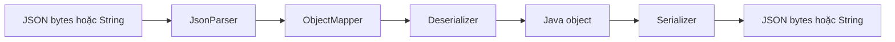
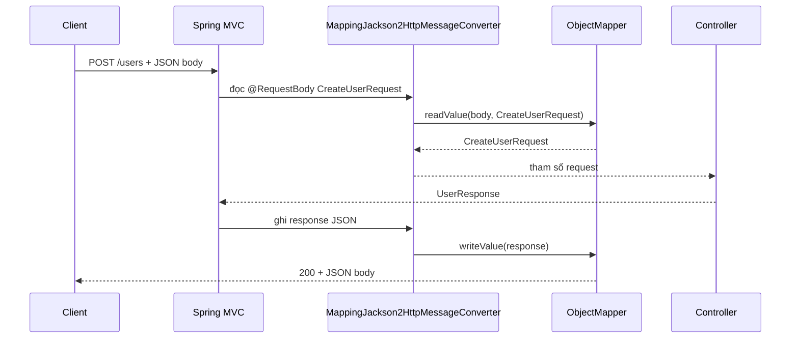

`ObjectMapper` là trung tâm chuyển đổi giữa JSON và object Java trong hầu hết ứng dụng Spring Boot. Hiểu đúng bean này giúp API nhất quán, tránh lỗi ngày giờ/generic type, và không vô tình làm lộ hoặc nhận dữ liệu sai.

> [!NOTE]
> Bài viết dùng Spring Boot 3.x và Jackson 2.x. Trong Spring Boot, không cần tự tạo `ObjectMapper` cho các nhu cầu thông thường: Boot đã auto-configure một bean dùng chung và các HTTP message converter dùng chính cấu hình đó.

## Mục lục

- [Tổng quan: ObjectMapper làm gì?](#1-tổng-quan-objectmapper-làm-gì)
- [Luồng JSON trong Spring MVC](#2-luồng-json-trong-spring-mvc)
- [Các API cốt lõi của ObjectMapper](#3-các-api-cốt-lõi-của-objectmapper)
- [ObjectMapper mặc định của Spring Boot](#4-objectmapper-mặc-định-của-spring-boot)
- [Định hình JSON bằng annotation](#5-định-hình-json-bằng-annotation)
  - [Tên field, field ẩn và field rỗng](#51-tên-field-field-ẩn-và-field-rỗng)
  - [Constructor, enum và dữ liệu chỉ-ghi](#52-constructor-enum-và-dữ-liệu-chỉ-ghi)
- [Date, time và timezone](#6-date-time-và-timezone)
- [Generic type, tree model và convertValue](#7-generic-type-tree-model-và-convertvalue)
- [Tùy biến an toàn trong Spring Boot](#8-tùy-biến-an-toàn-trong-spring-boot)
  - [Cấu hình qua application.yml](#81-cấu-hình-qua-applicationyml)
  - [Thêm module hoặc custom serializer](#82-thêm-module-hoặc-custom-serializer)
  - [Khi nào nên tự khai báo ObjectMapper?](#83-khi-nào-nên-tự-khai-báo-objectmapper)
- [Xử lý lỗi và kiểm tra input](#9-xử-lý-lỗi-và-kiểm-tra-input)
- [Bảo mật: dữ liệu nhạy cảm và polymorphic type](#10-bảo-mật-dữ-liệu-nhạy-cảm-và-polymorphic-type)
- [Hiệu năng và các anti-pattern](#11-hiệu-năng-và-các-anti-pattern)
- [Kiểm thử serialization contract](#12-kiểm-thử-serialization-contract)
- [Cheat sheet](#13-cheat-sheet)

---

## 1. Tổng quan: ObjectMapper làm gì?

`ObjectMapper` là class chính của **Jackson Databind**. Nó đọc JSON để tạo object Java (**deserialization**) và ghi object Java thành JSON (**serialization**).

```java
ObjectMapper mapper = new ObjectMapper();

User user = mapper.readValue("{\"id\":1,\"name\":\"An\"}", User.class);
String json = mapper.writeValueAsString(user);
// {"id":1,"name":"An"}
```

Jackson không chỉ sao chép tên field. Nó dựa trên metadata của class, getter/setter, constructor và annotation như `@JsonProperty` để quyết định JSON nào hợp lệ và JSON đầu ra có hình dạng gì.



> [!TIP]
> `ObjectMapper` được thiết kế để **dùng lại** và an toàn khi nhiều thread cùng đọc/ghi sau khi cấu hình hoàn tất. Hãy coi nó là hạ tầng của ứng dụng, không phải object tạo mới trong từng request.

## 2. Luồng JSON trong Spring MVC

Khi controller nhận hoặc trả DTO, bạn thường không gọi `ObjectMapper` trực tiếp. Spring MVC gọi `HttpMessageConverter`; với JSON, converter phổ biến là `MappingJackson2HttpMessageConverter`. Converter này dùng `ObjectMapper` do Spring Boot cấu hình.

```java
@RestController
@RequestMapping("/users")
class UserController {

    @PostMapping
    UserResponse create(@Valid @RequestBody CreateUserRequest request) {
        return new UserResponse(1L, request.name());
    }
}

record CreateUserRequest(String name, String email) { }
record UserResponse(Long id, String name) { }
```

Với request sau:

```http
POST /users
Content-Type: application/json

{"name":"An","email":"an@example.com"}
```

luồng xử lý là:



Vì vậy, một thay đổi ở `spring.jackson.*`, `@JsonProperty`, serializer tùy biến hoặc bean `ObjectMapper` có thể ảnh hưởng **toàn bộ REST API**. Đó là lý do cần ưu tiên cấu hình tập trung thay vì tự dùng các mapper khác nhau ở từng controller.

## 3. Các API cốt lõi của ObjectMapper

| API | Hướng chuyển đổi | Khi dùng |
|---|---|---|
| `readValue(...)` | JSON → object | Đọc JSON từ String, `byte[]`, `InputStream`, file |
| `writeValueAsString(...)` | object → JSON String | Log, cache text, gọi HTTP client thủ công |
| `writeValue(...)` | object → output đích | Ghi trực tiếp vào `OutputStream`, file hoặc HTTP response |
| `readTree(...)` | JSON → `JsonNode` | JSON có cấu trúc động/chưa biết trước |
| `valueToTree(...)` | object → `JsonNode` | Chỉnh một phần JSON trong bộ nhớ |
| `treeToValue(...)` | `JsonNode` → object | Đưa tree đã kiểm tra về DTO |
| `convertValue(...)` | object/map/tree → object khác | Chuyển đổi trong bộ nhớ, không quản lý chuỗi JSON thủ công |

Ví dụ đọc/ghi đơn giản:

```java
@Service
@RequiredArgsConstructor
class AuditPayloadService {
    private final ObjectMapper objectMapper;

    String toJson(Object payload) throws JsonProcessingException {
        return objectMapper.writeValueAsString(payload);
    }

    UserResponse fromJson(String json) throws JsonProcessingException {
        return objectMapper.readValue(json, UserResponse.class);
    }
}
```

`JsonProcessingException` là lỗi dữ liệu hoặc lỗi mapping có thể dự đoán được. Đừng nuốt exception rồi trả về `null`: caller sẽ mất thông tin JSON nào sai và có thể tạo lỗi `NullPointerException` ở nơi khác.

## 4. ObjectMapper mặc định của Spring Boot

Khi `spring-boot-starter-web` có trên classpath, Boot có Jackson Databind và thường auto-configure `ObjectMapper` thông qua `JacksonAutoConfiguration`. Bean này được xây từ `Jackson2ObjectMapperBuilder`.

Theo mặc định, Boot còn phát hiện và đăng ký các Jackson module có mặt trên classpath. Ví dụ, `JavaTimeModule` giúp `LocalDate`, `Instant` và các type `java.time` hoạt động đúng.

Các khác biệt đáng chú ý so với `new ObjectMapper()` thuần:

| Hành vi | ObjectMapper Jackson thuần | Spring Boot mặc định |
|---|---|---|
| Field JSON không có trong DTO | Thường fail với `UnrecognizedPropertyException` | Bỏ qua để API dễ tương thích hơn |
| `java.time` | Cần đăng ký `JavaTimeModule` | Được Boot hỗ trợ khi module có mặt |
| Date/time output | Có thể thành timestamp tùy cấu hình | Ưu tiên chuỗi ISO-8601 |
| `DEFAULT_VIEW_INCLUSION` | Bật | Boot tắt để `@JsonView` rõ ràng hơn |
| Cấu hình | Java code | `spring.jackson.*`, module bean, customizer |

> [!WARNING]
> Boot mặc định bỏ qua unknown field là một quyết định tương thích API, không phải kiểm tra bảo mật. Nếu endpoint cần schema chặt chẽ, hãy bật strict mode cho mapper/reader phù hợp hoặc dùng validation rõ ràng; xem [Xử lý lỗi và kiểm tra input](#9-xử-lý-lỗi-và-kiểm-tra-input).

Bạn có thể inject đúng mapper mà HTTP layer đang dùng:

```java
@RestController
@RequiredArgsConstructor
class DebugController {
    private final ObjectMapper objectMapper;

    @GetMapping("/debug/sample")
    String sample() throws JsonProcessingException {
        return objectMapper.writeValueAsString(Map.of("status", "ok"));
    }
}
```

## 5. Định hình JSON bằng annotation

Annotation ở DTO mô tả **contract của dữ liệu**. Chúng tốt hơn việc sửa JSON bằng tay trong controller vì cả request và response đều dùng cùng quy tắc.

### 5.1. Tên field, field ẩn và field rỗng

```java
@JsonInclude(JsonInclude.Include.NON_NULL)
record UserResponse(
    @JsonProperty("user_id") Long id,
    @JsonProperty("display_name") String name,
    @JsonIgnore String internalNote,
    String avatarUrl
) { }
```

| Annotation | Tác dụng |
|---|---|
| `@JsonProperty("user_id")` | Đổi tên property ở JSON; có hiệu lực khi đọc và ghi |
| `@JsonAlias({"fullName", "full_name"})` | Chấp nhận thêm tên cũ khi **đọc**, nhưng vẫn ghi tên chuẩn |
| `@JsonIgnore` | Không đọc/ghi property đó |
| `@JsonInclude(NON_NULL)` | Không ghi field có giá trị `null` |
| `@JsonIgnoreProperties({"legacyField"})` | Bỏ qua một hay nhiều property cụ thể |

`@JsonAlias` phù hợp khi đổi tên input mà không muốn phá client cũ:

```java
record CreateUserRequest(
    @JsonAlias({"fullName", "full_name"})
    @JsonProperty("name")
    String name
) { }
```

JSON `{"full_name":"An"}` và `{"name":"An"}` đều đọc được, nhưng response luôn dùng `"name"`. Đây là cách migration API có kiểm soát.

### 5.2. Constructor, enum và dữ liệu chỉ-ghi

Với record và constructor có tên tham số rõ ràng, Jackson hiện đại có thể bind trực tiếp. Khi cần factory có kiểm tra riêng, dùng `@JsonCreator` và `@JsonProperty`:

```java
class Money {
    private final BigDecimal amount;
    private final Currency currency;

    @JsonCreator
    Money(
        @JsonProperty("amount") BigDecimal amount,
        @JsonProperty("currency") Currency currency
    ) {
        if (amount == null || amount.signum() < 0) {
            throw new IllegalArgumentException("amount must be non-negative");
        }
        this.amount = amount;
        this.currency = Objects.requireNonNull(currency);
    }

    public BigDecimal getAmount() { return amount; }
    public Currency getCurrency() { return currency; }
}
```

Password là dữ liệu chỉ nên **đọc từ request**, không được phản chiếu lại trong response:

```java
record RegisterRequest(
    String email,
    @JsonProperty(access = JsonProperty.Access.WRITE_ONLY)
    String password
) { }
```

> [!IMPORTANT]
> `@JsonIgnore` trên password có thể khiến Jackson không đọc được password từ request. Với field cần nhận nhưng không được trả ra, dùng `WRITE_ONLY`; đồng thời tuyệt đối không dùng entity chứa password hash làm response DTO.

## 6. Date, time và timezone

`LocalDate`, `LocalDateTime`, `OffsetDateTime` và `Instant` biểu diễn các khái niệm khác nhau. Chọn sai type thường nguy hiểm hơn chọn sai format.

| Type | Có timezone/offset? | Dùng cho |
|---|---:|---|
| `LocalDate` | Không | Ngày sinh, ngày hết hạn |
| `LocalDateTime` | Không | Lịch theo timezone đã được quy ước rõ ràng |
| `OffsetDateTime` | Có offset | Thời điểm API cần giữ offset người gửi |
| `Instant` | UTC tuyệt đối | Event time, audit time, dữ liệu lưu trữ nội bộ |

Với API, `Instant` hoặc `OffsetDateTime` thường ít mơ hồ hơn `LocalDateTime`:

```java
record OrderResponse(
    Long id,
    Instant createdAt,
    @JsonFormat(pattern = "yyyy-MM-dd") LocalDate deliveryDate
) { }
```

Ví dụ output:

```json
{
  "id": 10,
  "createdAt": "2026-03-15T08:30:00Z",
  "deliveryDate": "2026-03-20"
}
```

`@JsonFormat` nên dành cho field có contract đặc biệt, như ngày không có giờ. Đừng ép mọi thời điểm về format không có offset như `yyyy-MM-dd HH:mm:ss`; client sẽ không biết `08:30` thuộc timezone nào.

> [!TIP]
> Quy tắc đơn giản: lưu thời điểm xảy ra sự kiện là `Instant` theo UTC; chỉ đổi sang timezone hiển thị ở rìa hệ thống (UI/report). Đặt `spring.jackson.time-zone` không biến `LocalDateTime` thành dữ liệu có timezone.

## 7. Generic type, tree model và convertValue

### Generic type: vì sao `List.class` không đủ?

Java xóa generic type khi chạy (type erasure). Vì vậy `readValue(json, List.class)` chỉ cho Jackson biết đây là `List`, không biết phần tử là `UserResponse`; kết quả thường là `List<LinkedHashMap>`.

```java
String json = "[{\"id\":1,\"name\":\"An\"}]";

List<UserResponse> users = objectMapper.readValue(
    json,
    new TypeReference<List<UserResponse>>() {}
);
```

Trong code dùng `Class` động, tạo `JavaType` rõ ràng:

```java
JavaType type = objectMapper.getTypeFactory()
    .constructCollectionType(List.class, UserResponse.class);

List<UserResponse> users = objectMapper.readValue(json, type);
```

### Tree model: JSON không cố định cấu trúc

`JsonNode` hữu ích với webhook, JSON metadata hoặc payload mà một phần schema thay đổi. Nó không thay thế DTO cho dữ liệu business cố định.

```java
JsonNode root = objectMapper.readTree("""
    {"type":"payment", "data":{"amount":120000, "currency":"VND"}}
    """);

String type = root.path("type").asText();
long amount = root.path("data").path("amount").asLong();

if (!"payment".equals(type) || amount <= 0) {
    throw new IllegalArgumentException("Invalid payment payload");
}
```

`path()` trả về missing node thay vì `null`, nên an toàn hơn chuỗi `get(...).get(...)`. Tuy nhiên `asLong()` trả `0` nếu giá trị không thể chuyển đổi; với input quan trọng, hãy kiểm tra `isIntegralNumber()` trước.

### `convertValue`: chuyển đổi trong bộ nhớ

Khi một framework trả về `Map<String, Object>`, `convertValue` chuyển map sang DTO bằng cùng annotation/module của mapper:

```java
Map<String, Object> raw = Map.of(
    "user_id", 1,
    "display_name", "An"
);

UserResponse user = objectMapper.convertValue(raw, UserResponse.class);
```

API này tiện, nhưng không thay validation. Map có thể thiếu field, có sai type hoặc chứa dữ liệu không hợp lệ; DTO nên có constructor validation hoặc được kiểm tra bằng Bean Validation ở boundary HTTP.

## 8. Tùy biến an toàn trong Spring Boot

Thứ tự ưu tiên nên là: **annotation trên DTO** → **`application.yml`** → **module/customizer bean** → cuối cùng mới là **tự thay bean `ObjectMapper`**. Cách ở trên ít phá vỡ auto-configuration hơn.

### 8.1. Cấu hình qua application.yml

Các option Jackson có thể map từ `spring.jackson`. Tên feature dùng kebab-case.

```yaml
spring:
  jackson:
    default-property-inclusion: non_null
    property-naming-strategy: SNAKE_CASE
    time-zone: Asia/Ho_Chi_Minh
    serialization:
      write-dates-as-timestamps: false
    deserialization:
      fail-on-unknown-properties: true
```

Cấu hình này áp dụng cho mapper dùng bởi web layer. Sau khi bật `fail-on-unknown-properties`, client gửi `{"name":"An","typo_email":"..."}` tới DTO không có `typo_email` sẽ nhận lỗi thay vì dữ liệu bị âm thầm bỏ qua.

> [!WARNING]
> `property-naming-strategy: SNAKE_CASE` thay đổi JSON của **mọi** DTO chưa có `@JsonProperty`. Đây có thể là breaking change với API đang chạy. Với API public đã tồn tại, ưu tiên annotation hoặc version API thay vì đổi global strategy.

### 8.2. Thêm module hoặc custom serializer

Nếu type đặc biệt xuất hiện nhiều nơi, đóng gói quy tắc trong `Module`. Spring Boot tự đăng ký mọi bean kiểu `com.fasterxml.jackson.databind.Module` vào mapper của nó.

Ví dụ serialize `Money` thành một chuỗi dễ đọc:

```java
@Configuration
class JacksonConfiguration {

    @Bean
    Module moneyModule() {
        SimpleModule module = new SimpleModule();
        module.addSerializer(Money.class, new JsonSerializer<>() {
            @Override
            public void serialize(Money value, JsonGenerator gen,
                                  SerializerProvider serializers) throws IOException {
                gen.writeString(value.amount() + " " + value.currency().getCurrencyCode());
            }
        });
        return module;
    }
}

record Money(BigDecimal amount, Currency currency) { }
```

Nếu cần thay đổi feature của builder nhưng không muốn thay mapper, dùng `Jackson2ObjectMapperBuilderCustomizer`:

```java
@Configuration
class JacksonConfiguration {

    @Bean
    Jackson2ObjectMapperBuilderCustomizer strictJson() {
        return builder -> builder.featuresToEnable(
            DeserializationFeature.FAIL_ON_UNKNOWN_PROPERTIES
        );
    }
}
```

Một custom serializer chỉ giải quyết chiều ghi. Nếu API cũng phải **đọc** format `"120000 VND"`, hãy đăng ký thêm `JsonDeserializer<Money>` và quy định rõ lỗi khi format sai.

### 8.3. Khi nào nên tự khai báo ObjectMapper?

Tự tạo mapper chỉ phù hợp khi ứng dụng thực sự cần một mapper độc lập, ví dụ đọc file của hệ thống cũ với naming/date format khác API. Đặt tên bean riêng để không vô tình thay JSON contract REST:

```java
@Configuration
class LegacyJsonConfiguration {

    @Bean("legacyObjectMapper")
    ObjectMapper legacyObjectMapper() {
        return JsonMapper.builder()
            .propertyNamingStrategy(PropertyNamingStrategies.SNAKE_CASE)
            .enable(DeserializationFeature.FAIL_ON_UNKNOWN_PROPERTIES)
            .build();
    }
}
```

```java
@Service
class LegacyImportService {
    private final ObjectMapper legacyObjectMapper;

    LegacyImportService(@Qualifier("legacyObjectMapper") ObjectMapper legacyObjectMapper) {
        this.legacyObjectMapper = legacyObjectMapper;
    }
}
```

> [!CAUTION]
> Khai báo một bean `ObjectMapper` không có qualifier có thể làm Boot không tạo mapper mặc định. Bạn phải tự chịu trách nhiệm đăng ký `JavaTimeModule`, Kotlin module (nếu có), các module đang dùng và các feature cần thiết. Đừng thay global mapper chỉ để phục vụ một integration riêng.

## 9. Xử lý lỗi và kiểm tra input

Trong Spring MVC, JSON sai cú pháp hoặc không map được vào `@RequestBody` thường trở thành `HttpMessageNotReadableException`. Nguyên nhân gốc thường là `JsonMappingException`, `InvalidFormatException` hoặc `UnrecognizedPropertyException`.

Trả lỗi 400 nhất quán bằng `@RestControllerAdvice`:

```java
@RestControllerAdvice
class ApiExceptionHandler {

    @ExceptionHandler(HttpMessageNotReadableException.class)
    ResponseEntity<Map<String, String>> handleInvalidJson(
            HttpMessageNotReadableException exception) {
        return ResponseEntity.badRequest().body(Map.of(
            "code", "INVALID_JSON",
            "message", "Request body must match the expected JSON format"
        ));
    }
}
```

Đừng trả nguyên `exception.getMessage()` cho client. Thông điệp đó có thể lộ tên class nội bộ, đường dẫn property hoặc chi tiết không ổn định giữa phiên bản thư viện. Hãy log exception đầy đủ ở server và trả error code ổn định ra ngoài.

Jackson kiểm tra **hình dạng và type**; Bean Validation kiểm tra **rule nghiệp vụ đơn giản**. Hai lớp này bổ sung nhau:

```java
record CreateOrderRequest(
    @NotBlank String customerId,
    @NotEmpty List<@Valid LineItemRequest> items
) { }

record LineItemRequest(
    @NotBlank String sku,
    @Positive int quantity
) { }
```

```java
@PostMapping("/orders")
OrderResponse create(@Valid @RequestBody CreateOrderRequest request) {
    // Chỉ chạy sau khi JSON map được VÀ validation pass
}
```

Với một integration cần strict mode cục bộ mà không muốn đổi toàn API, tạo `ObjectReader` từ mapper chung. `ObjectReader` là immutable và an toàn để dùng lại:

```java
ObjectReader strictReader = objectMapper.readerFor(CreateUserRequest.class)
    .with(DeserializationFeature.FAIL_ON_UNKNOWN_PROPERTIES);

CreateUserRequest request = strictReader.readValue(json);
```

## 10. Bảo mật: dữ liệu nhạy cảm và polymorphic type

### Không serialize nhầm secret

Response DTO nên chỉ chứa dữ liệu được phép công khai. `WRITE_ONLY` là lớp phòng vệ phụ, không phải lý do để đưa password hash/token vào response model.

```java
record LoginRequest(
    String username,
    @JsonProperty(access = JsonProperty.Access.WRITE_ONLY)
    String password
) { }

record UserProfileResponse(Long id, String displayName) { }
```

Tránh log JSON raw của request đăng nhập hoặc token. Nếu cần audit, log metadata cần thiết như request ID, user ID sau xác thực và kết quả xử lý.

### Không bật default typing cho input không tin cậy

Jackson có polymorphic type: JSON có thể mang type metadata để chọn subclass. Ví dụ `@JsonTypeInfo` có thể khiến một field interface deserialize thành nhiều implementation. Đây là tính năng mạnh nhưng mở rộng bề mặt tấn công nếu client kiểm soát class/type name.

```java
// Không làm điều này với JSON từ bên ngoài:
objectMapper.activateDefaultTyping(
    LaissezFaireSubTypeValidator.instance,
    ObjectMapper.DefaultTyping.NON_FINAL
);
```

> [!CAUTION]
> Không dùng `activateDefaultTyping` với `LaissezFaireSubTypeValidator` cho dữ liệu không tin cậy. Nếu thật sự cần polymorphism, khai báo tập subtype nhỏ, tường minh bằng `@JsonSubTypes` hoặc dùng `PolymorphicTypeValidator` allow-list nghiêm ngặt. Tốt hơn nữa, dùng trường discriminator như `"type": "CARD"` rồi tự map sang command/DTO được allow-list.

## 11. Hiệu năng và các anti-pattern

### Dùng một mapper đã cấu hình xong

Sai:

```java
String json = new ObjectMapper().writeValueAsString(order);
```

Đoạn này tạo serializer/deserializer cache mới, bỏ qua module của Boot và có thể không hỗ trợ `Instant`. Nó còn làm JSON từ job/service khác JSON của REST API.

Đúng:

```java
@RequiredArgsConstructor
@Service
class ExportService {
    private final ObjectMapper objectMapper;

    String export(OrderResponse order) throws JsonProcessingException {
        return objectMapper.writeValueAsString(order);
    }
}
```

### Không mutate mapper trong lúc ứng dụng đang chạy

Các method như `registerModule`, `configure` và `setDateFormat` thay đổi cấu hình mapper. Chỉ cấu hình lúc khởi động. Nếu một luồng đang serialize còn luồng khác đổi module/feature, kết quả khó đoán và cache nội bộ có thể không nhất quán.

Khi chỉ khác target type hoặc feature đọc/ghi, tạo `ObjectReader`/`ObjectWriter`:

```java
ObjectWriter prettyWriter = objectMapper.writerWithDefaultPrettyPrinter();
String readableJson = prettyWriter.writeValueAsString(order);
```

`ObjectWriter` không thay đổi mapper gốc và có thể tái sử dụng.

### Stream payload lớn

`writeValueAsString` giữ toàn bộ JSON trong RAM. Với export rất lớn, ghi thẳng sang `OutputStream` hoặc dùng streaming API (`JsonGenerator`) để tránh tạo một `String` khổng lồ.

```java
try (JsonGenerator generator = objectMapper.getFactory().createGenerator(outputStream)) {
    generator.writeStartArray();
    for (OrderResponse order : orders) {
        objectMapper.writeValue(generator, order);
    }
    generator.writeEndArray();
}
```

Nói ngắn gọn: mapper dùng chung cho contract chung; `ObjectReader`/`ObjectWriter` cho biến thể; streaming cho dữ liệu lớn.

## 12. Kiểm thử serialization contract

JSON là contract giữa server và client. Kiểm thử serialization giúp phát hiện đổi tên field, format ngày hoặc lộ field nhạy cảm trước khi deploy.

```java
@SpringBootTest
class ObjectMapperContractTest {

    @Autowired
    ObjectMapper objectMapper;

    @Test
    void serializesPublicUserContract() throws Exception {
        UserResponse response = new UserResponse(1L, "An", "internal", null);

        JsonNode json = objectMapper.readTree(objectMapper.writeValueAsString(response));

        assertThat(json.path("user_id").asLong()).isEqualTo(1L);
        assertThat(json.path("display_name").asText()).isEqualTo("An");
        assertThat(json.has("internalNote")).isFalse();
        assertThat(json.has("avatarUrl")).isFalse();
    }
}
```

Test trên dùng **mapper thật của Spring Boot**, nên phát hiện cả thay đổi global như `property-naming-strategy` hoặc module bean. Với controller, thêm `MockMvc` test để xác nhận HTTP status và error body khi JSON sai.

## 13. Cheat sheet

| Nhu cầu | Cách nên dùng |
|---|---|
| JSON request/response bình thường | DTO + `@RequestBody`/`@ResponseBody`; để Spring MVC dùng mapper chung |
| Đổi một tên field | `@JsonProperty` |
| Chấp nhận tên input cũ | `@JsonAlias` |
| Không trả password/token | Response DTO riêng; `@JsonProperty(WRITE_ONLY)` khi cần nhận input |
| Bỏ field `null` | `@JsonInclude(NON_NULL)` cục bộ hoặc `spring.jackson.default-property-inclusion` |
| Parse `List<User>` | `new TypeReference<List<User>>() {}` hoặc `JavaType` |
| JSON cấu trúc động | `JsonNode` và kiểm tra type rõ ràng |
| Date/time | `Instant`/`OffsetDateTime` cho thời điểm; ISO-8601 |
| Thêm quy tắc cho một type | Bean `Module` hoặc serializer/deserializer |
| Đổi feature toàn API | `spring.jackson.*` hoặc `Jackson2ObjectMapperBuilderCustomizer` |
| Mapper cho legacy integration | Bean mapper có tên riêng + `@Qualifier` |
| JSON lớn | Ghi trực tiếp `OutputStream`/`JsonGenerator` |

<Cards>
  <Card title="Spring Boot Auto-Configuration" href="/spring/spring-boot-autoconfiguration" description="Hiểu vì sao Spring Boot tự tạo và cấu hình ObjectMapper." />
  <Card title="Java Serialization & Deserialization" href="/serialization/java-serialization" description="So sánh JSON/Jackson với native Java serialization và rủi ro bảo mật." />
</Cards>
