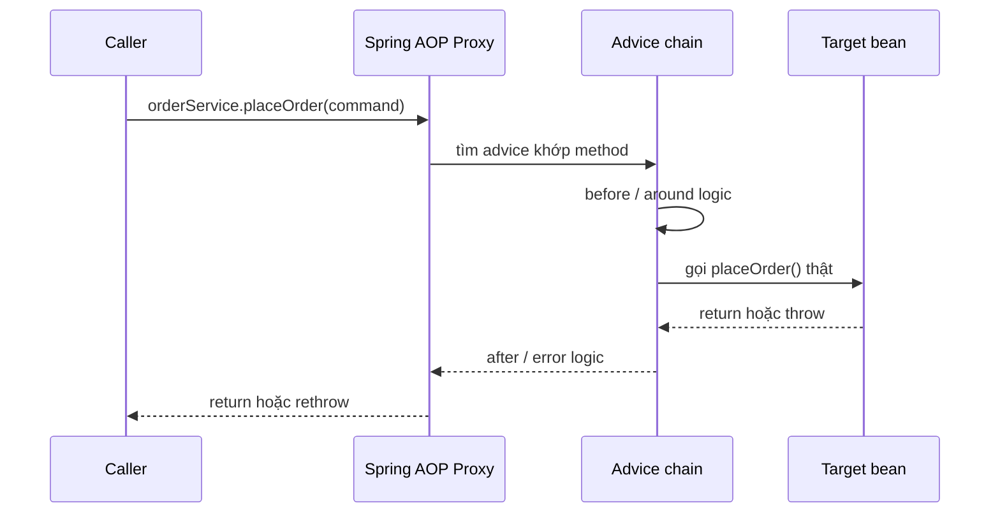
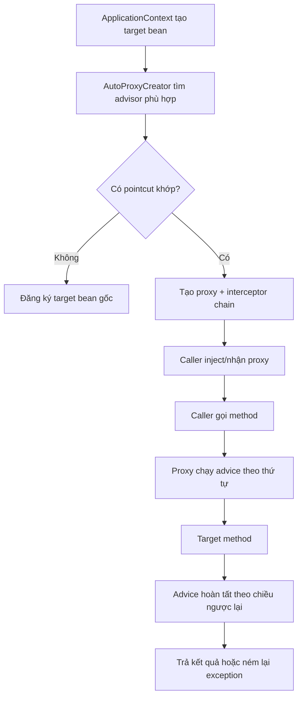
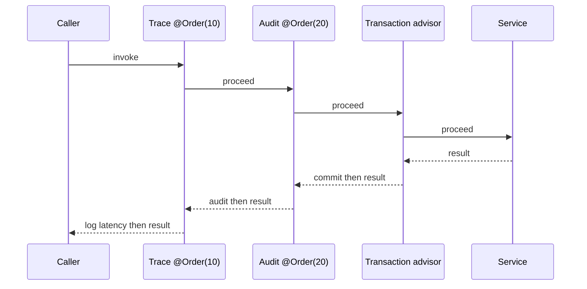

Spring AOP giúp tách những logic lặp lại ở nhiều nơi — logging, đo thời gian, audit, authorization, transaction hoặc retry — ra khỏi code nghiệp vụ. Nó rất hữu ích khi được dùng cho **cross-cutting concern** (mối quan tâm cắt ngang), nhưng sẽ khó debug nếu không hiểu ranh giới proxy.

> [!IMPORTANT]
> Spring AOP là **proxy-based AOP**. Nó chỉ chặn lời gọi method đi qua proxy của một Spring bean; không tự sửa bytecode của class như AspectJ weaving. Vì vậy, annotation hay aspect chỉ là cấu hình — proxy mới là nơi advice thực sự chạy.

## Mục lục

- [1. AOP giải quyết vấn đề gì?](#1-aop-giải-quyết-vấn-đề-gì)
- [2. Từ vựng cốt lõi](#2-từ-vựng-cốt-lõi)
  - [2.1. Aspect, advice, join point và pointcut](#21-aspect-advice-join-point-và-pointcut)
  - [2.2. Target, proxy và weaving](#22-target-proxy-và-weaving)
- [3. Spring AOP chạy một lời gọi method như thế nào?](#3-spring-aop-chạy-một-lời-gọi-method-như-thế-nào)
- [4. Khởi tạo AOP trong Spring Boot](#4-khởi-tạo-aop-trong-spring-boot)
- [5. Viết aspect đầu tiên: đo thời gian service](#5-viết-aspect-đầu-tiên-đo-thời-gian-service)
- [6. Năm loại advice](#6-năm-loại-advice)
  - [6.1. `@Around`: loại mạnh nhất](#61-around-loại-mạnh-nhất)
  - [6.2. `@Before`, `@AfterReturning`, `@AfterThrowing`, `@After`](#62-before-afterreturning-afterthrowing-after)
- [7. Pointcut expression: chọn đúng nơi để áp dụng](#7-pointcut-expression-chọn-đúng-nơi-để-áp-dụng)
  - [7.1. `execution`: lọc theo chữ ký method](#71-execution-lọc-theo-chữ-ký-method)
  - [7.2. Annotation, bean và tham số runtime](#72-annotation-bean-và-tham-số-runtime)
  - [7.3. Tái sử dụng và kết hợp pointcut](#73-tái-sử-dụng-và-kết-hợp-pointcut)
- [8. Thứ tự nhiều aspect](#8-thứ-tự-nhiều-aspect)
- [9. Ví dụ production: audit bằng annotation](#9-ví-dụ-production-audit-bằng-annotation)
- [10. Spring AOP và AspectJ: chọn công cụ nào?](#10-spring-aop-và-aspectj-chọn-công-cụ-nào)
- [11. Những giới hạn và cạm bẫy quan trọng](#11-những-giới-hạn-và-cạm-bẫy-quan-trọng)
- [12. Checklist thiết kế aspect](#12-checklist-thiết-kế-aspect)
- [13. Tóm tắt](#13-tóm-tắt)

---

## 1. AOP giải quyết vấn đề gì?

Giả sử mọi service đều cần log thời gian chạy. Cách viết trực tiếp sẽ làm business method bị lặp `try/finally`:

```java
@Service
public class OrderService {
    public Order placeOrder(CreateOrderCommand command) {
        long startedAt = System.nanoTime();
        try {
            return doPlaceOrder(command); // logic nghiệp vụ thật
        } finally {
            log.info("placeOrder took {} ms", (System.nanoTime() - startedAt) / 1_000_000);
        }
    }
}
```

Một lần thì không sao. Nhưng hàng chục service đều có logging, audit, kiểm tra quyền và transaction thì code nghiệp vụ bị che khuất. Các concern này **cắt ngang** nhiều module, thay vì thuộc riêng một use case.

AOP đặt logic chung vào một aspect và nói rõ nơi áp dụng bằng pointcut. `OrderService` khi đó chỉ tập trung đặt đơn hàng:

```java
@Service
public class OrderService {
    public Order placeOrder(CreateOrderCommand command) {
        return doPlaceOrder(command);
    }
}
```

Các use case phù hợp:

| Use case | Aspect làm gì | Lưu ý |
|---|---|---|
| Transaction | mở, commit hoặc rollback transaction | Spring đã cung cấp `@Transactional` |
| Observability | đo latency, thêm trace/log context | không log dữ liệu nhạy cảm |
| Audit | ghi ai đã thay đổi tài nguyên nào | nên chạy sau khi nghiệp vụ thành công |
| Authorization | kiểm tra quyền trước method | Spring Security method security thường phù hợp hơn |
| Retry / circuit breaker | thử lại hoặc chặn lời gọi lỗi | chỉ retry thao tác idempotent |
| Validation chung | kiểm tra policy dùng ở nhiều service | validation theo use case vẫn nên nằm trong domain/service |

> [!TIP]
> Quy tắc nhanh: aspect nên trả lời câu hỏi **“logic này có lặp lại ở nhiều use case mà không thay đổi ý nghĩa nghiệp vụ không?”**. Nếu có, AOP là một ứng viên tốt. Nếu logic quyết định đơn hàng có được tạo hay không, nó là business rule và nên đọc thấy trực tiếp trong service.

## 2. Từ vựng cốt lõi

### 2.1. Aspect, advice, join point và pointcut

Bốn khái niệm này thường bị trộn lẫn:

| Khái niệm | Nghĩa | Ví dụ |
|---|---|---|
| **Aspect** | module gom một concern cắt ngang | `PerformanceAspect` |
| **Join point** | một điểm có thể chèn hành vi | trong Spring AOP: một lần thực thi method |
| **Pointcut** | điều kiện chọn các join point | mọi public method trong `..service..` |
| **Advice** | đoạn code chạy tại join point đã chọn | log trước/sau khi gọi method |

Có thể nhớ bằng công thức:

```text
Aspect = Pointcut (chạy ở đâu) + Advice (chạy việc gì)
```

Trong Spring AOP, join point thực tế chỉ là **method execution trên Spring bean**. AspectJ đầy đủ còn có thể chèn vào constructor, field access hoặc exception handler; Spring AOP không làm các việc đó.

### 2.2. Target, proxy và weaving

- **Target** là bean thật, ví dụ `OrderService`.
- **Proxy** là object Spring đặt trước target. Caller gọi proxy, proxy chạy advice rồi mới gọi target.
- **Weaving** là hành động ghép aspect vào chương trình. Spring AOP làm việc này lúc khởi tạo bean bằng proxy; AspectJ có thể weave ở compile time hoặc class-load time.



Proxy có thể là JDK Dynamic Proxy (dựa trên interface) hoặc CGLIB proxy (subclass ở runtime). Việc chọn và interceptor chain được giải thích sâu hơn trong [Spring Proxy](/spring/spring-proxy).

## 3. Spring AOP chạy một lời gọi method như thế nào?

Khi ApplicationContext tạo bean, một `BeanPostProcessor` tìm các advisor/aspect có pointcut khớp bean đó. Nếu có, Spring trả proxy thay vì target gốc khi bean được inject.

Luồng của một lần gọi có thể tóm tắt như sau:



Hai điểm quyết định hành vi:

1. **Bean phải do Spring quản lý.** `new OrderService(...)` tạo object Java bình thường, không có proxy nên aspect không chạy.
2. **Lời gọi phải đi vào proxy.** Lời gọi `this.process()` bên trong target không quay ra proxy. Đây là self-invocation, một nguồn bug phổ biến.

> [!WARNING]
> Đừng dùng aspect để “cứu” kiến trúc đang tạo service bằng `new`. Hãy để dependency đi qua constructor injection. Khi object không ở container, nó không có lifecycle, dependency management hay AOP của Spring.

## 4. Khởi tạo AOP trong Spring Boot

Với Spring Boot, thêm starter AOP:

```xml
<dependency>
    <groupId>org.springframework.boot</groupId>
    <artifactId>spring-boot-starter-aop</artifactId>
</dependency>
```

Starter mang theo Spring AOP và AspectJ Weaver API. Spring Boot auto-configuration kích hoạt auto-proxying khi các dependency cần thiết có trên classpath. Một class aspect vẫn cần là Spring bean, thường là `@Component`.

```java
@Aspect
@Component
public class PerformanceAspect {
    // advice ở đây
}
```

Với Spring Framework không dùng Boot, bật proxy-based AspectJ annotation style bằng cấu hình sau:

```java
@Configuration
@EnableAspectJAutoProxy
public class AopConfig {
}
```

`@EnableAspectJAutoProxy` **không bật AspectJ bytecode weaving**. Tên annotation nói rằng Spring hiểu cú pháp annotation quen thuộc của AspectJ (`@Aspect`, `@Around`, `execution(...)`), nhưng cơ chế vẫn là Spring proxy.

## 5. Viết aspect đầu tiên: đo thời gian service

Ví dụ dưới đây đo thời gian mọi public method trong package `com.example.app.service`:

```java
import org.aspectj.lang.ProceedingJoinPoint;
import org.aspectj.lang.annotation.Around;
import org.aspectj.lang.annotation.Aspect;
import org.springframework.stereotype.Component;

@Aspect
@Component
public class PerformanceAspect {

    @Around("execution(public * com.example.app.service..*(..))")
    public Object measure(ProceedingJoinPoint joinPoint) throws Throwable {
        long start = System.nanoTime();

        try {
            return joinPoint.proceed();
        } finally {
            long elapsedMs = (System.nanoTime() - start) / 1_000_000;
            String method = joinPoint.getSignature().toShortString();
            log.info("method={} elapsedMs={}", method, elapsedMs);
        }
    }
}
```

`joinPoint.proceed()` là lệnh chuyển quyền điều khiển sang advice tiếp theo, hoặc sang target method nếu không còn advice nào. `finally` đảm bảo thời gian vẫn được log khi target ném exception.

Ví dụ cho thấy AOP tách được technical concern, nhưng không nên log toàn bộ argument hay return value mặc định. `command` có thể chứa email, token, số thẻ hoặc dữ liệu cá nhân.

> [!TIP]
> Đo latency bằng `System.nanoTime()`, không phải `System.currentTimeMillis()`. `nanoTime()` chỉ dùng để đo khoảng thời gian, không bị ảnh hưởng khi hệ điều hành đồng bộ lại đồng hồ.

## 6. Năm loại advice

### 6.1. `@Around`: loại mạnh nhất

`@Around` bao cả lời gọi method. Nó có thể chạy trước/sau, thay đổi argument, thay return value, chuyển exception, hoặc không gọi target. Vì quyền lực lớn, nó cũng dễ tạo bug nhất.

```java
@Around("@annotation(CacheableResult)")
public Object cache(ProceedingJoinPoint joinPoint) throws Throwable {
    String key = createKey(joinPoint.getArgs());
    Object cached = cache.get(key);
    if (cached != null) {
        return cached;                 // target không chạy
    }

    Object result = joinPoint.proceed(); // target chạy đúng một lần
    cache.put(key, result);
    return result;
}
```

Các lỗi điển hình là quên `proceed()` khiến business method không chạy, hoặc gọi `proceed()` hai lần khiến side effect xảy ra hai lần. Với cache, retry hay permission logic phức tạp, ưu tiên các abstraction có sẵn và đã được kiểm thử như Spring Cache, Resilience4j hoặc Spring Security.

### 6.2. `@Before`, `@AfterReturning`, `@AfterThrowing`, `@After`

Bốn advice còn lại hẹp hơn. Chúng không kiểm soát lời gọi như `@Around`.

| Advice | Khi chạy | Có thể làm gì tốt |
|---|---|---|
| `@Before` | trước target | kiểm tra precondition, gắn context |
| `@AfterReturning` | target trả về thành công | audit kết quả, metric success |
| `@AfterThrowing` | target ném exception | metric error, log lỗi đã chuẩn hoá |
| `@After` | luôn chạy, tương tự `finally` | cleanup context nhỏ |

```java
@Before("execution(* com.example.app.service..*(..))")
public void addMethodToMdc(JoinPoint joinPoint) {
    MDC.put("method", joinPoint.getSignature().toShortString());
}

@AfterReturning(
    pointcut = "execution(* com.example.app.service..*(..))",
    returning = "result"
)
public void countSuccess(JoinPoint joinPoint, Object result) {
    metrics.increment("service.success", "method", joinPoint.getSignature().getName());
}

@AfterThrowing(
    pointcut = "execution(* com.example.app.service..*(..))",
    throwing = "error"
)
public void countFailure(JoinPoint joinPoint, Throwable error) {
    metrics.increment("service.failure", "exception", error.getClass().getSimpleName());
}

@After("execution(* com.example.app.service..*(..))")
public void clearMethodFromMdc() {
    MDC.remove("method");
}
```

`@AfterReturning` không chạy nếu target ném exception. Ngược lại, `@AfterThrowing` không chạy khi target return bình thường. Nếu cần cả hai nhánh và cần kiểm soát exception/return value, dùng một `@Around` nhỏ, rõ ràng, có `try/catch/finally`.

## 7. Pointcut expression: chọn đúng nơi để áp dụng

Pointcut quá rộng sẽ tạo logging/overhead ở những nơi không cần thiết. Pointcut quá hẹp thì aspect âm thầm không chạy. Hãy bắt đầu bằng ý định kiến trúc rõ ràng: “mọi application service public” hoặc “mọi method được đánh dấu audit”.

### 7.1. `execution`: lọc theo chữ ký method

Cú pháp tổng quát:

```text
execution(modifiers-pattern? ret-type-pattern declaring-type-pattern? name-pattern(param-pattern) throws-pattern?)
```

Các biểu thức thực dụng:

| Expression | Match |
|---|---|
| `execution(* com.example.app.service..*(..))` | mọi method, mọi visibility trong package `service` và subpackage |
| `execution(public * com.example.app.service..*(..))` | mọi public method trong service |
| `execution(* com.example.app.service.OrderService.place*(..))` | method `place...` của `OrderService` |
| `execution(* *(Long, ..))` | method có tham số đầu tiên là `Long` |
| `execution(@org.springframework.transaction.annotation.Transactional * *(..))` | method mang `@Transactional` |

Trong biểu thức package, `*` khớp một phần tên hoặc một package segment. `..` khớp bất kỳ số package segment nào. Vì vậy `service..*` bao gồm cả `service.OrderService` và `service.payment.PaymentService`.

> [!NOTE]
> Một expression hợp lệ không bảo đảm advice sẽ chạy. Target vẫn phải là Spring bean và call vẫn phải đi qua proxy. Khi debug, in `bean.getClass()` hoặc dùng `AopUtils.isAopProxy(bean)` để kiểm tra trước.

### 7.2. Annotation, bean và tham số runtime

Annotation là lựa chọn an toàn khi chỉ một số method cần concern. Nó làm điểm áp dụng hiện ngay tại use case:

```java
@Around("@annotation(com.example.app.audit.Audited)")
public Object audit(ProceedingJoinPoint joinPoint) throws Throwable {
    return joinPoint.proceed();
}
```

Các designator hay dùng:

| Designator | Ý nghĩa | Ví dụ |
|---|---|---|
| `@annotation(...)` | method có annotation | `@annotation(Audited)` |
| `@within(...)` | class target có annotation | `@within(Transactional)` |
| `within(...)` | class thuộc type/package | `within(com.example.app.service..*)` |
| `bean(...)` | Spring bean name khớp pattern | `bean(*Service)` |
| `args(...)` | runtime argument có type chỉ định | `args(command,..)` |
| `this(...)` / `target(...)` | proxy/target có type chỉ định | thường ít cần trong application code |

`args(...)` kiểm tra **object thật ở runtime**, còn `execution(...)` kiểm tra chữ ký method. Nếu interface khai báo tham số `Object` nhưng caller truyền `CreateOrderCommand`, `args(CreateOrderCommand)` vẫn có thể match.

### 7.3. Tái sử dụng và kết hợp pointcut

Đặt pointcut có tên để tránh copy chuỗi expression và để code nói rõ ý định:

```java
@Aspect
@Component
public class ObservabilityAspect {

    @Pointcut("execution(public * com.example.app.service..*(..))")
    private void publicServiceOperation() {}

    @Pointcut("!@annotation(com.example.app.audit.NoMetrics)")
    private void metricsEnabled() {}

    @Around("publicServiceOperation() && metricsEnabled()")
    public Object recordLatency(ProceedingJoinPoint joinPoint) throws Throwable {
        return timer.recordCallable(joinPoint::proceed);
    }
}
```

Toán tử `&&`, `||` và `!` kết hợp pointcut. Giữ expression theo package/layer ngắn, rồi thêm annotation opt-out khi cần. Một chuỗi pointcut dài, chồng nhiều wildcard và điều kiện phủ định thường khó review hơn một aspect nhỏ tách theo mục đích.

## 8. Thứ tự nhiều aspect

Một method có thể khớp nhiều aspect: tracing, security, transaction, audit và metrics. Spring tạo một interceptor chain. Advice có `@Order` nhỏ hơn là lớp **ngoài**: chạy trước lúc đi vào target và chạy sau lúc return.

```java
@Aspect
@Component
@Order(10)
class TraceAspect { /* outer */ }

@Aspect
@Component
@Order(20)
class AuditAspect { /* middle */ }
```

```text
Request đi vào:
Trace.before → Audit.before → Transaction.begin → Target

Kết quả quay ra:
Target → Transaction.commit/rollback → Audit.after → Trace.after
```



Không nên dựa vào thứ tự đăng ký bean nếu các advisor cùng precedence. Hãy đặt `@Order` khi thứ tự thay đổi semantics. Ví dụ, kiểm tra quyền thường phải nằm ngoài transaction để request bị từ chối không mở connection; audit “success” phải chạy sau khi biết target thành công.

> [!WARNING]
> `@Order` trên **method business** không sắp xếp aspect. Nó phải ở class aspect, hoặc trên advisor/configuration tương ứng. Với `@Transactional`, thứ tự advisor được cấu hình bởi transaction infrastructure; xem [Spring Transaction](/spring/spring-transaction) khi cần phối hợp cache và transaction.

## 9. Ví dụ production: audit bằng annotation

Audit thường không nên áp dụng cho toàn bộ service package. Một annotation rõ ràng giúp reviewer thấy operation nào tạo audit event.

```java
@Target(ElementType.METHOD)
@Retention(RetentionPolicy.RUNTIME)
public @interface Audited {
    String action();
    String resource();
}
```

Dùng annotation ở public application service:

```java
@Service
public class UserService {

    @Audited(action = "UPDATE", resource = "USER")
    public User updateProfile(UUID userId, UpdateProfileCommand command) {
        return userRepository.update(userId, command);
    }
}
```

Aspect lấy annotation đã bind, actor từ security context và ghi event **sau khi target return thành công**:

```java
@Aspect
@Component
@RequiredArgsConstructor
public class AuditAspect {
    private final AuditEventPublisher publisher;
    private final CurrentActor currentActor;

    @AfterReturning(
        pointcut = "@annotation(audited)",
        returning = "result"
    )
    public void publish(JoinPoint joinPoint, Audited audited, Object result) {
        AuditEvent event = AuditEvent.success(
            audited.action(),
            audited.resource(),
            currentActor.id(),
            resourceIdFrom(joinPoint.getArgs(), result)
        );
        publisher.publish(event);
    }
}
```

`@AfterReturning` phù hợp nếu audit event nghĩa là “operation đã return thành công”. Nhưng “return thành công” chưa chắc đã là “transaction đã commit”: event có thể được publish trước khi transaction advisor commit, tuỳ thứ tự chain.

Nếu audit phải được gửi **chỉ sau commit**, hãy publish một application event trong transaction và xử lý nó bằng `@TransactionalEventListener(phase = TransactionPhase.AFTER_COMMIT)`. Đây là ranh giới transaction rõ ràng hơn là cố gắng đoán thứ tự aspect.

```java
@Component
public class AuditAfterCommitListener {

    @TransactionalEventListener(phase = TransactionPhase.AFTER_COMMIT)
    public void on(AuditRequested event) {
        auditRepository.save(event.toRecord());
    }
}
```

> [!TIP]
> Aspect nên thu thập và phát event nhỏ. Việc ghi audit bền vững, gọi hệ thống ngoài hoặc retry nên do listener/outbox xử lý. Nhờ vậy lời gọi business không bị chậm và audit không vô tình làm hỏng transaction chính.

## 10. Spring AOP và AspectJ: chọn công cụ nào?

| Tiêu chí | Spring AOP | AspectJ weaving |
|---|---|---|
| Cơ chế | proxy quanh Spring bean | sửa bytecode compile-time hoặc load-time |
| Join point | method execution | rộng hơn: method, constructor, field access, exception handler... |
| Self-invocation | không intercept | intercept được |
| `final` / `private` method | bị giới hạn bởi proxy | có thể advise, tuỳ pointcut/weaving |
| Setup | đơn giản, tích hợp Spring Boot | cần compiler/weaver và quy trình build/runtime rõ ràng |
| Debug | xem proxy/advisor tương đối dễ | cần theo dõi weaving và bytecode |
| Lựa chọn mặc định | gần như mọi application Spring | nhu cầu kỹ thuật đặc biệt |

Dùng Spring AOP cho service-level concern của bean Spring. Chỉ chọn AspectJ khi yêu cầu thật sự cần join point mà proxy không thấy — ví dụ instrument constructor/field access, hoặc không thể refactor self-invocation/final method trong một thư viện legacy.

> [!WARNING]
> AspectJ không phải bản vá mặc định cho self-invocation. Tách operation sang bean khác thường giúp transaction boundary, ownership và test rõ hơn. Weaving làm phạm vi aspect lớn hơn, nên lỗi pointcut cũng có phạm vi lớn hơn.

## 11. Những giới hạn và cạm bẫy quan trọng

| Cạm bẫy | Vì sao xảy ra | Cách xử lý |
|---|---|---|
| Self-invocation | `this.method()` gọi target trực tiếp | tách sang bean khác; xem [Spring Proxy](/spring/spring-proxy) |
| Object tạo bằng `new` | object không phải Spring bean | dùng constructor injection và container quản lý |
| Method/class `final` | CGLIB không override được; JDK proxy chỉ thấy interface | tránh `final` tại điểm cần advice hoặc dùng thiết kế khác |
| Aspect không là bean | Spring không quét/không tạo aspect | thêm `@Component` hoặc khai báo `@Bean` |
| Quên `proceed()` trong `@Around` | chain dừng trước target | luôn kiểm thử success và failure path |
| Gọi `proceed()` hai lần | target side effect chạy hai lần | chỉ gọi lại khi bạn chủ đích retry và operation idempotent |
| Pointcut quá rộng | advice chạy cả repository/controller/adapter | giới hạn theo layer hoặc annotation |
| Nuốt exception trong advice | caller tưởng thành công, transaction có thể commit sai | log rồi rethrow, hoặc chuyển đổi exception có chủ đích |
| Thứ tự không rõ | advisor cùng precedence không có thứ tự đáng tin cậy | đặt `@Order` khi semantics phụ thuộc thứ tự |
| Aspect giữ mutable state | singleton aspect bị chia sẻ giữa request | giữ aspect stateless; dùng context theo request an toàn |

Một `@Around` cũng không nên catch mọi `Throwable` rồi trả `null`. Điều đó phá contract của method và có thể che mất `Error` nghiêm trọng. Nếu chỉ muốn ghi lỗi, log exception rồi `throw error`.

```java
@Around("publicServiceOperation()")
public Object logFailure(ProceedingJoinPoint joinPoint) throws Throwable {
    try {
        return joinPoint.proceed();
    } catch (Throwable error) {
        log.error("operation failed: {}", joinPoint.getSignature(), error);
        throw error; // giữ nguyên semantics cho caller và transaction interceptor
    }
}
```

## 12. Checklist thiết kế aspect

Trước khi thêm một aspect, kiểm tra:

- [ ] Concern có thực sự lặp qua nhiều use case và không phải business rule không?
- [ ] Pointcut có giới hạn rõ theo layer hoặc annotation không?
- [ ] Target có là Spring bean và lời gọi có đi qua proxy không?
- [ ] Advice có giữ nguyên return value, exception và số lần gọi target không?
- [ ] `@Around` có gọi `proceed()` đúng một lần trên normal path không?
- [ ] Thứ tự với transaction, security và cache đã được quyết định bằng `@Order` hoặc event phase chưa?
- [ ] Log/metric/audit có tránh PII, secret và payload quá lớn không?
- [ ] Aspect có test cho success, exception, self-invocation và pointcut không match không?

Một test integration nhỏ nên xác nhận advice chạy thật qua Spring proxy, không chỉ unit test method trong aspect:

```java
@SpringBootTest
class PerformanceAspectTest {

    @Autowired
    private OrderService orderService;

    @Test
    void recordsMetricWhenPublicServiceMethodIsCalled() {
        orderService.placeOrder(validCommand());

        assertThat(metrics.count("service.latency", "method", "placeOrder"))
            .isEqualTo(1);
    }
}
```

Nếu `new OrderService(...)` trong test, test chỉ kiểm tra target. Nó không chứng minh AOP đã được cấu hình đúng.

## 13. Tóm tắt

```text
Aspect  = concern cắt ngang được đóng gói
Pointcut = chọn method nào chịu ảnh hưởng
Advice  = logic chạy trước/sau/quanh method
Proxy   = object Spring thực sự chạy advice

Caller → Proxy → advice chain → target method → advice chain → Caller
```

Nguyên tắc cần nhớ:

1. Spring AOP phù hợp với logging, metrics, audit, security boundary và transaction — không thay thế domain logic.
2. Spring AOP chỉ thấy **method call qua proxy của Spring bean**. `new` và self-invocation là hai đường bypass phổ biến nhất.
3. Chọn pointcut hẹp, có ý nghĩa kiến trúc; annotation là cách tốt khi concern chỉ áp dụng chọn lọc.
4. Dùng `@Around` khi cần kiểm soát flow; còn lại ưu tiên advice hẹp hơn để ý định dễ đọc.
5. Khi nhiều aspect cùng áp dụng, `@Order` quyết định lớp ngoài/trong. Nếu audit cần sau commit, dùng transaction event thay vì đoán thứ tự.

<Cards>
  <Card title="Spring Proxy" href="/spring/spring-proxy" description="Đi sâu vào JDK Proxy, CGLIB, advisor và interceptor chain." />
  <Card title="Spring Transaction" href="/spring/spring-transaction" description="Xem @Transactional được thực thi bởi AOP proxy như thế nào." />
  <Card title="Filter và Interceptor" href="/spring/filter-va-interceptor" description="Phân biệt AOP MethodInterceptor với các tầng chặn HTTP request." />
</Cards>
