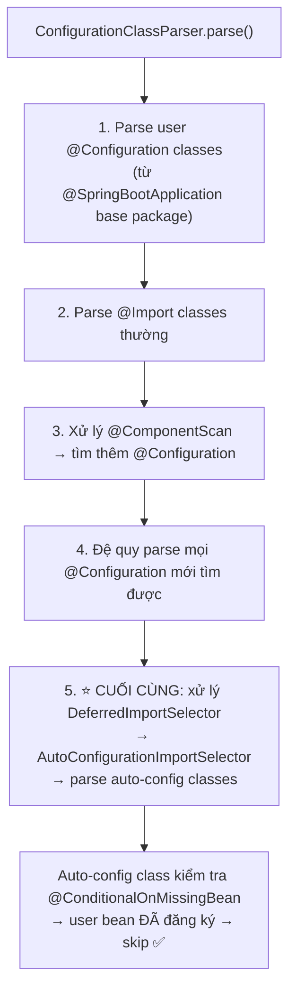
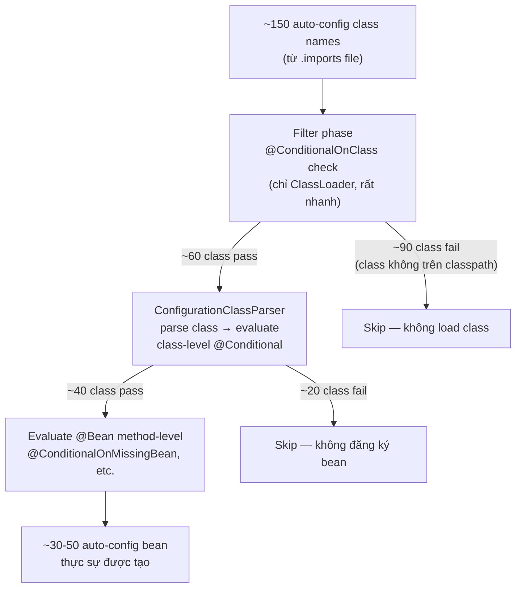
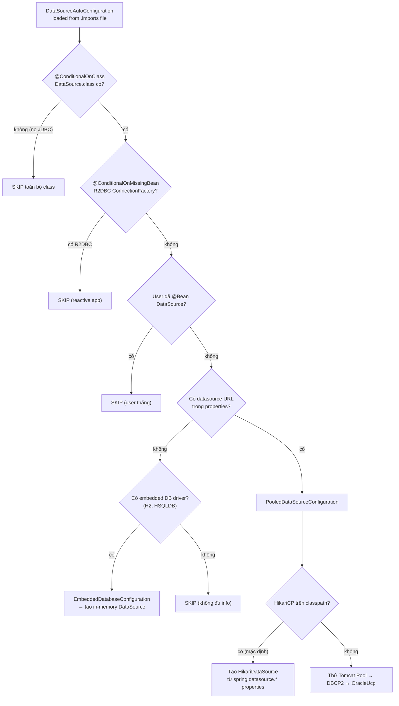
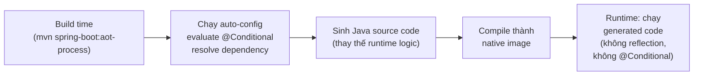

## Mục lục

- [Bối cảnh: Chỉ thêm dependency — bean tự xuất hiện?](#1-bối-cảnh-chỉ-thêm-dependency--bean-tự-xuất-hiện)
- [@EnableAutoConfiguration — annotation kích hoạt cỗ máy](#2-enableautoconfiguration--annotation-kích-hoạt-cỗ-máy)
- [AutoConfigurationImportSelector — load danh sách từ đâu?](#3-autoconfigurationimportselector--load-danh-sách-từ-đâu)
- [DeferredImportSelector — tại sao auto-config chạy SAU user config?](#4-deferredimportselector--tại-sao-auto-config-chạy-sau-user-config)
- [@Conditional — engine đánh giá điều kiện](#5-conditional--engine-đánh-giá-điều-kiện)
- [Condition Evaluation Order — class-level trước, method-level sau](#6-condition-evaluation-order--class-level-trước-method-level-sau)
- [Auto-Configuration Ordering — @AutoConfigureBefore/After/Order](#7-auto-configuration-ordering--autoconfigurebeforeafterorder)
- [DataSourceAutoConfiguration — mổ xẻ một auto-config thật](#8-datasourceautoconfiguration--mổ-xẻ-một-auto-config-thật)
- [spring-boot-autoconfigure module — 150+ auto-config classes](#9-spring-boot-autoconfigure-module--150-auto-config-classes)
- [Custom Starter — xây auto-configuration riêng](#10-custom-starter--xây-auto-configuration-riêng)
- [Failure Analysis — khi auto-config fail thì báo lỗi thế nào](#11-failure-analysis--khi-auto-config-fail-thì-báo-lỗi-thế-nào)
- [Condition Report — debug tại sao bean có/không tồn tại](#12-condition-report--debug-tại-sao-bean-cókhông-tồn-tại)
- [AOT & GraalVM Native — auto-config trong native image](#13-aot--graalvm-native--auto-config-trong-native-image)
- [Anti-patterns & Production Pitfalls](#14-anti-patterns--production-pitfalls)
- [Tóm tắt — Cheat sheet & 7 nguyên tắc](#15-tóm-tắt--cheat-sheet--7-nguyên-tắc)

---

## 1. Bối cảnh: Chỉ thêm dependency — bean tự xuất hiện?

Bạn tạo project Spring Boot mới. Chỉ thêm `spring-boot-starter-data-jpa` vào `pom.xml`:

```xml
<dependency>
    <groupId>org.springframework.boot</groupId>
    <artifactId>spring-boot-starter-data-jpa</artifactId>
</dependency>
<dependency>
    <groupId>com.h2database</groupId>
    <artifactId>h2</artifactId>
    <scope>runtime</scope>
</dependency>
```

Không viết `@Bean DataSource`, không viết `@Bean EntityManagerFactory`, không viết `@Bean TransactionManager`. Nhưng:

```java
@Service
public class UserService {
    @Autowired
    private DataSource dataSource;          // ✅ tồn tại — HikariDataSource
    @Autowired
    private EntityManagerFactory emf;       // ✅ tồn tại — LocalContainerEntityManagerFactoryBean
    @Autowired
    private PlatformTransactionManager tm;  // ✅ tồn tại — JpaTransactionManager
}
```

3 bean phức tạp **tự xuất hiện** chỉ vì bạn thêm JAR vào classpath. Không có magic — đây là **auto-configuration**: Spring Boot quét classpath, phát hiện class `DataSource`/`EntityManager` có mặt → kích hoạt `DataSourceAutoConfiguration`, `HibernateJpaAutoConfiguration` → tạo bean mặc định.

> [!IMPORTANT]
> Auto-configuration = **"opinionated defaults with easy override"**. Spring Boot tạo bean mặc định nếu bạn không define. Hễ bạn define `@Bean DataSource` riêng → auto-config bean bị **skip**. Hiểu cơ chế này = hiểu vì sao bean xuất hiện/biến mất khi thêm/bớt dependency hoặc config.

---

## 2. @EnableAutoConfiguration — annotation kích hoạt cỗ máy

### 2.1. @SpringBootApplication bao gồm gì?

```java
@Target(ElementType.TYPE)
@SpringBootConfiguration          // = @Configuration
@EnableAutoConfiguration          // ⭐ kích hoạt auto-configuration
@ComponentScan                    // quét package hiện tại + sub-packages
public @interface SpringBootApplication { ... }
```

### 2.2. @EnableAutoConfiguration internals

```java
@Target(ElementType.TYPE)
@AutoConfigurationPackage                    // đăng ký base package cho entity scanning
@Import(AutoConfigurationImportSelector.class)  // ⭐ import selector
public @interface EnableAutoConfiguration {
    String[] exclude() default {};           // loại trừ auto-config class cụ thể
    String[] excludeName() default {};
}
```

`@Import(AutoConfigurationImportSelector.class)` là **trigger** — nó đăng ký một `ImportSelector` mà Spring sẽ gọi trong quá trình parse `@Configuration`.

### 2.3. @AutoConfigurationPackage — entity scanning base

```java
@Import(AutoConfigurationPackages.Registrar.class)
public @interface AutoConfigurationPackage { }
```

`AutoConfigurationPackages.Registrar` đăng ký **package** chứa `@SpringBootApplication` class. Các auto-config khác (JPA, MyBatis) dùng thông tin này để biết scan entity/mapper ở package nào:

```java
// Ví dụ: JPA auto-config lấy base packages:
String[] packages = AutoConfigurationPackages.get(beanFactory);
// → ["com.app"] — package chứa main class
// → EntityManagerFactory scan entity trong package này
```

---

## 3. AutoConfigurationImportSelector — load danh sách từ đâu?

### 3.1. Entry point

```java
// Rút gọn từ AutoConfigurationImportSelector
public class AutoConfigurationImportSelector implements DeferredImportSelector {

    @Override
    public String[] selectImports(AnnotationMetadata annotationMetadata) {
        // Không dùng trực tiếp — DeferredImportSelector dùng getImportGroup() thay thế
        return NO_IMPORTS;
    }

    @Override
    public Class<? extends Group> getImportGroup() {
        return AutoConfigurationGroup.class;   // ⭐ xử lý thật ở đây
    }
}
```

### 3.2. AutoConfigurationGroup — flow chính

```java
// Rút gọn từ AutoConfigurationImportSelector.AutoConfigurationGroup
private static class AutoConfigurationGroup implements DeferredImportSelector.Group {

    @Override
    public void process(AnnotationMetadata metadata, DeferredImportSelector selector) {
        // 1) Load TẤT CẢ auto-configuration class names
        List<String> configurations = getAutoConfigurationEntry(metadata).getConfigurations();
        // → ~150 class names từ spring-boot-autoconfigure
    }

    @Override
    public Iterable<Entry> selectImports() {
        // 2) Trả danh sách đã filter + sắp xếp → Spring import chúng
        return sortedEntries;
    }
}
```

### 3.3. getAutoConfigurationEntry() — 5 bước filter

```java
// Rút gọn từ AutoConfigurationImportSelector.getAutoConfigurationEntry()
protected AutoConfigurationEntry getAutoConfigurationEntry(AnnotationMetadata metadata) {

    // Bước 1: Load tất cả candidate từ file registry
    List<String> configurations = getCandidateConfigurations(metadata, attributes);
    // → đọc META-INF/spring/org.springframework.boot.autoconfigure.AutoConfiguration.imports
    // → ~150 class names

    // Bước 2: Loại bỏ trùng lặp
    configurations = removeDuplicates(configurations);

    // Bước 3: Loại bỏ class user chỉ định exclude
    Set<String> exclusions = getExclusions(metadata, attributes);
    // → từ @EnableAutoConfiguration(exclude=...) hoặc spring.autoconfigure.exclude property
    configurations.removeAll(exclusions);

    // Bước 4: Filter bằng AutoConfigurationImportFilter (chủ yếu @ConditionalOnClass)
    configurations = getConfigurationClassFilter().filter(configurations);
    // → loại class mà @ConditionalOnClass FAIL (class không có trên classpath)
    // → đây là "fast filter" — check TRƯỚC khi parse class → tiết kiệm thời gian

    // Bước 5: Fire AutoConfigurationImportEvent (cho listener)
    fireAutoConfigurationImportEvents(configurations, exclusions);

    return new AutoConfigurationEntry(configurations, exclusions);
}
```

### 3.4. File registry — từ spring.factories đến AutoConfiguration.imports

**Spring Boot 2.x (cũ):**
```
META-INF/spring.factories
# key:
org.springframework.boot.autoconfigure.EnableAutoConfiguration=\
  com.example.MyAutoConfiguration,\
  com.example.AnotherAutoConfiguration
```

**Spring Boot 3.x (mới):**
```
META-INF/spring/org.springframework.boot.autoconfigure.AutoConfiguration.imports
# Mỗi dòng = 1 fully qualified class name
com.example.MyAutoConfiguration
com.example.AnotherAutoConfiguration
```

> [!NOTE]
> Spring Boot 3.0 chuyển sang file `.imports` vì `spring.factories` bị overload (dùng cho quá nhiều mục đích). File mới chỉ chứa auto-config class — đơn giản hơn, dễ tooling hơn. Spring Boot 2.7 hỗ trợ cả hai (backward compatible).

### 3.5. Xem danh sách thật

```bash
# Trong spring-boot-autoconfigure JAR:
$ jar tf spring-boot-autoconfigure-3.x.jar | grep AutoConfiguration.imports
META-INF/spring/org.springframework.boot.autoconfigure.AutoConfiguration.imports

$ unzip -p spring-boot-autoconfigure-3.x.jar META-INF/spring/org.springframework.boot.autoconfigure.AutoConfiguration.imports | head -20
org.springframework.boot.autoconfigure.admin.SpringApplicationAdminJmxAutoConfiguration
org.springframework.boot.autoconfigure.aop.AopAutoConfiguration
org.springframework.boot.autoconfigure.cache.CacheAutoConfiguration
org.springframework.boot.autoconfigure.context.ConfigurationPropertiesAutoConfiguration
org.springframework.boot.autoconfigure.data.jpa.JpaRepositoriesAutoConfiguration
org.springframework.boot.autoconfigure.jdbc.DataSourceAutoConfiguration
org.springframework.boot.autoconfigure.orm.jpa.HibernateJpaAutoConfiguration
# ... ~150 class tổng cộng
```

---

## 4. DeferredImportSelector — tại sao auto-config chạy SAU user config?

### 4.1. Vấn đề

`@ConditionalOnMissingBean` cần kiểm tra: "user đã define bean này chưa?" Nhưng nếu auto-config class được parse **trước** user's `@Configuration` → user bean chưa đăng ký → `@ConditionalOnMissingBean` nghĩ "chưa có" → tạo bean mặc định → **xung đột** với bean user define sau đó.

### 4.2. Giải pháp: DeferredImportSelector

```java
public interface DeferredImportSelector extends ImportSelector {
    // Import được "hoãn" — chỉ xử lý SAU KHI tất cả @Configuration class thường đã parse xong
}
```

`AutoConfigurationImportSelector` implement `DeferredImportSelector` → Spring **hoãn** xử lý nó đến **cuối cùng** trong `ConfigurationClassParser`:



### 4.3. Source code — ConfigurationClassParser

```java
// Rút gọn từ ConfigurationClassParser
public void parse(Set<BeanDefinitionHolder> configCandidates) {
    // 1) Parse tất cả configuration class thường
    for (BeanDefinitionHolder holder : configCandidates) {
        parse(holder.getBeanDefinition(), holder.getBeanName());
    }

    // 2) SAU KHI parse xong hết → xử lý deferred selectors
    this.deferredImportSelectorHandler.process();   // ← auto-config ở đây
}

// DeferredImportSelectorHandler.process():
public void process() {
    List<DeferredImportSelectorHolder> deferredImports = this.deferredImportSelectors;
    this.deferredImportSelectors = null;

    // Group các deferred selector lại (AutoConfigurationGroup)
    // Gọi group.process() → getAutoConfigurationEntry() → lấy danh sách class
    // Gọi group.selectImports() → trả danh sách đã sort
    // Parse từng auto-config class → evaluate @Conditional
}
```

> [!IMPORTANT]
> **Thứ tự này là cốt lõi**: User `@Configuration` parse trước → user bean đăng ký BeanDefinition trước → auto-config parse sau → `@ConditionalOnMissingBean` thấy user bean đã có → skip. Đây là lý do "user bean luôn thắng auto-config bean".

---

## 5. @Conditional — engine đánh giá điều kiện

### 5.1. Interface nền tảng

```java
@FunctionalInterface
public interface Condition {
    boolean matches(ConditionContext context, AnnotatedTypeMetadata metadata);
}

// ConditionContext cung cấp:
public interface ConditionContext {
    BeanDefinitionRegistry getRegistry();     // kiểm tra bean đã đăng ký
    ConfigurableListableBeanFactory getBeanFactory();  // kiểm tra bean instance
    Environment getEnvironment();             // đọc property
    ResourceLoader getResourceLoader();       // kiểm tra resource
    ClassLoader getClassLoader();             // kiểm tra class trên classpath
}
```

### 5.2. SpringBootCondition — base class cho Boot's @Conditional

```java
// Mọi @ConditionalOn... của Spring Boot extend SpringBootCondition:
public abstract class SpringBootCondition implements Condition {

    @Override
    public final boolean matches(ConditionContext context, AnnotatedTypeMetadata metadata) {
        // 1) Lấy tên class/method đang evaluate (for logging)
        String classOrMethodName = getClassOrMethodName(metadata);

        // 2) Gọi implementation cụ thể
        ConditionOutcome outcome = getMatchOutcome(context, metadata);

        // 3) Log kết quả (hiện trong CONDITIONS EVALUATION REPORT)
        logOutcome(classOrMethodName, outcome);

        // 4) Record vào ConditionEvaluationReport
        recordEvaluation(context, classOrMethodName, outcome);

        return outcome.isMatch();
    }

    // Subclass implement:
    protected abstract ConditionOutcome getMatchOutcome(
        ConditionContext context, AnnotatedTypeMetadata metadata);
}
```

### 5.3. @ConditionalOnClass — internals

```java
@Conditional(OnClassCondition.class)
public @interface ConditionalOnClass {
    Class<?>[] value() default {};    // class literals
    String[] name() default {};       // class name strings (khi class có thể không tồn tại)
}

// OnClassCondition.getMatchOutcome():
protected ConditionOutcome getMatchOutcome(ConditionContext context, AnnotatedTypeMetadata metadata) {
    ClassLoader classLoader = context.getClassLoader();
    List<String> onClasses = getAnnotationValue(metadata, "value", "name");

    List<String> missing = filter(onClasses, ClassNameFilter.MISSING, classLoader);
    // → thử ClassLoader.loadClass() cho mỗi class name
    // → nếu ClassNotFoundException → thêm vào "missing"

    if (!missing.isEmpty()) {
        return ConditionOutcome.noMatch("Required classes not found: " + missing);
    }
    return ConditionOutcome.match();
}
```

### 5.4. @ConditionalOnMissingBean — internals

```java
// OnBeanCondition.getMatchOutcome() — rút gọn:
protected ConditionOutcome getMatchOutcome(ConditionContext context, AnnotatedTypeMetadata metadata) {
    ConfigurableListableBeanFactory beanFactory = context.getBeanFactory();
    // Lấy type cần kiểm tra
    List<String> types = getAnnotationValue(metadata, "type", "value");

    for (String type : types) {
        // Tìm bean name theo type trong BeanFactory
        String[] beanNames = beanFactory.getBeanNamesForType(
            ClassUtils.forName(type, classLoader), true, false);

        if (beanNames.length > 0) {
            return ConditionOutcome.noMatch("Found existing bean: " + beanNames[0]);
            // → có bean rồi → condition FAIL → auto-config bean bị SKIP
        }
    }
    return ConditionOutcome.match();  // → chưa có → condition PASS → tạo bean
}
```

### 5.5. Bảng @Conditional phổ biến

| Annotation | Kiểm tra | Ví dụ thực tế |
|-----------|----------|--------------|
| `@ConditionalOnClass` | Class có trên classpath | `@ConditionalOnClass(DataSource.class)` — có JDBC driver |
| `@ConditionalOnMissingClass` | Class KHÔNG có | Fallback khi thiếu library |
| `@ConditionalOnBean` | Bean type/name đã tồn tại trong context | `@ConditionalOnBean(DataSource.class)` → configure JdbcTemplate |
| `@ConditionalOnMissingBean` | Bean CHƯA tồn tại | "User chưa define → tôi tạo mặc định" |
| `@ConditionalOnProperty` | Property có giá trị cụ thể | `@ConditionalOnProperty("spring.cache.type")` |
| `@ConditionalOnResource` | Resource tồn tại | `@ConditionalOnResource("classpath:schema.sql")` |
| `@ConditionalOnWebApplication` | Đang là web app (Servlet/Reactive) | Configure DispatcherServlet |
| `@ConditionalOnNotWebApplication` | KHÔNG phải web app | CLI app config |
| `@ConditionalOnExpression` | SpEL expression = true | `@ConditionalOnExpression("${feature.enabled:false}")` |
| `@ConditionalOnJava` | Java version match | `@ConditionalOnJava(range = EQUAL_OR_NEWER, value = JavaVersion.SEVENTEEN)` |
| `@ConditionalOnSingleCandidate` | Chỉ có 1 bean (hoặc 1 @Primary) | Tránh ambiguous |

---

## 6. Condition Evaluation Order — class-level trước, method-level sau

### 6.1. Hai phase evaluation

Spring Boot evaluate condition theo **hai phase**:

```
Phase 1 (PARSE_CONFIGURATION): @Conditional trên CLASS
    → Nếu fail → TOÀN BỘ class bị skip, không parse @Bean methods bên trong

Phase 2 (REGISTER_BEAN): @Conditional trên @Bean METHOD
    → Class đã pass → evaluate từng @Bean method riêng
```

```java
@Configuration
@ConditionalOnClass(DataSource.class)         // ← Phase 1: class-level
@ConditionalOnProperty("spring.datasource.url")  // ← Phase 1: class-level
public class DataSourceAutoConfiguration {

    @Bean
    @ConditionalOnMissingBean                  // ← Phase 2: method-level
    public DataSource dataSource() { ... }

    @Bean
    @ConditionalOnMissingBean
    @ConditionalOnProperty("spring.datasource.jndi-name")  // ← Phase 2
    public DataSource jndiDataSource() { ... }
}
```

### 6.2. Filter phase — trước cả parsing (optimization)

`AutoConfigurationImportFilter` chạy **trước** khi class được parse bởi `ConfigurationClassParser`:

```java
// Trong getAutoConfigurationEntry():
configurations = getConfigurationClassFilter().filter(configurations);
```

Filter này chỉ check `@ConditionalOnClass` và `@ConditionalOnWebApplication` — những condition **rẻ** (chỉ cần ClassLoader, không cần BeanFactory). Mục đích: loại nhanh ~50-70% auto-config class mà classpath không match → **tránh load/parse class vô ích** → startup nhanh hơn.



> [!TIP]
> Đặt `@ConditionalOnClass` ở **class-level** (không phải method-level) giúp toàn bộ class bị skip sớm nếu classpath không match → tiết kiệm startup time đáng kể. Đây là convention của Spring Boot auto-config.

---

## 7. Auto-Configuration Ordering — @AutoConfigureBefore/After/Order

### 7.1. Tại sao ordering quan trọng?

`HibernateJpaAutoConfiguration` cần `DataSource` bean đã được tạo → phải chạy **sau** `DataSourceAutoConfiguration`. `TransactionAutoConfiguration` cần `PlatformTransactionManager` = `JpaTransactionManager` → phải chạy **sau** JPA auto-config.

### 7.2. Annotations ordering

```java
@AutoConfiguration(
    after = DataSourceAutoConfiguration.class,     // chạy SAU DataSource config
    before = TransactionAutoConfiguration.class    // chạy TRƯỚC Transaction config
)
@ConditionalOnClass({ LocalContainerEntityManagerFactoryBean.class, EntityManager.class })
@ConditionalOnBean(DataSource.class)
public class HibernateJpaAutoConfiguration { ... }
```

**Spring Boot 3.x:** dùng `@AutoConfiguration(after=..., before=...)` — kết hợp `@Configuration` + ordering.

**Spring Boot 2.x (cũ):** dùng annotation riêng:
```java
@Configuration
@AutoConfigureAfter(DataSourceAutoConfiguration.class)
@AutoConfigureBefore(TransactionAutoConfiguration.class)
@AutoConfigureOrder(Ordered.HIGHEST_PRECEDENCE + 10)
```

### 7.3. Sorting internals

```java
// AutoConfigurationSorter — sắp xếp auto-config classes
public List<String> getInPriorityOrder(Collection<String> classNames) {
    // 1) Xây dependency graph từ @AutoConfigureBefore/@AutoConfigureAfter
    AutoConfigurationClasses classes = new AutoConfigurationClasses(classNames);

    // 2) Topo sort — đảm bảo "after" class nằm SAU "before" class
    List<String> orderedClassNames = new ArrayList<>(classNames);
    orderedClassNames.sort((c1, c2) -> {
        int order1 = classes.get(c1).getOrder();
        int order2 = classes.get(c2).getOrder();
        return Integer.compare(order1, order2);
    });

    // 3) Áp dụng before/after constraint (topological ordering)
    return sortByAnnotation(classes, orderedClassNames);
}
```

> [!WARNING]
> `@AutoConfigureOrder` quyết định thứ tự giữa các auto-config class **với nhau** — KHÔNG ảnh hưởng thứ tự so với user's `@Configuration`. User config **luôn** được parse trước auto-config (nhờ `DeferredImportSelector`). `@Order` trên auto-config class **không có tác dụng** — phải dùng `@AutoConfigureOrder`.

---

## 8. DataSourceAutoConfiguration — mổ xẻ một auto-config thật

Đây là auto-config phổ biến nhất — hãy xem nó hoạt động thế nào từng bước:

### 8.1. Source code (rút gọn)

```java
@AutoConfiguration(before = SqlInitializationAutoConfiguration.class)
@ConditionalOnClass({ DataSource.class, EmbeddedDatabaseType.class })
@ConditionalOnMissingBean(type = "io.r2dbc.spi.ConnectionFactory")
@EnableConfigurationProperties(DataSourceProperties.class)
@Import({
    DataSourcePoolMetadataProvidersConfiguration.class,
    DataSourceCheckpointRestoreConfiguration.class
})
public class DataSourceAutoConfiguration {

    // === Embedded database (H2, HSQLDB, Derby) ===
    @Configuration(proxyBeanMethods = false)
    @Conditional(EmbeddedDatabaseCondition.class)       // có embedded DB driver + không có pooled config
    @ConditionalOnMissingBean({ DataSource.class, XADataSource.class })
    @Import(EmbeddedDataSourceConfiguration.class)
    protected static class EmbeddedDatabaseConfiguration { }

    // === Pooled database (HikariCP, Tomcat, DBCP2) ===
    @Configuration(proxyBeanMethods = false)
    @Conditional(PooledDataSourceCondition.class)       // có datasource URL hoặc pooled driver
    @ConditionalOnMissingBean({ DataSource.class, XADataSource.class })
    @Import({
        HikariJdbcConnectionDetailsBeanPostProcessor.class,
        DataSourceConfiguration.Hikari.class,           // @ConditionalOnClass(HikariDataSource.class)
        DataSourceConfiguration.Tomcat.class,           // @ConditionalOnClass(org.apache.tomcat.jdbc.pool.DataSource.class)
        DataSourceConfiguration.Dbcp2.class,            // @ConditionalOnClass(BasicDataSource.class)
        DataSourceConfiguration.OracleUcp.class
    })
    protected static class PooledDataSourceConfiguration { }
}
```

### 8.2. Evaluation flow



### 8.3. DataSourceProperties — bind properties tự động

```java
@ConfigurationProperties(prefix = "spring.datasource")
public class DataSourceProperties {
    private String url;
    private String username;
    private String password;
    private String driverClassName;
    private Class<? extends DataSource> type;  // ép pool implementation cụ thể
    // ...
}
```

`@EnableConfigurationProperties(DataSourceProperties.class)` đăng ký bean `DataSourceProperties` và **bind tự động** từ `application.properties`:

```properties
spring.datasource.url=jdbc:postgresql://localhost:5432/app
spring.datasource.username=app_user
spring.datasource.password=secret
spring.datasource.hikari.maximum-pool-size=20
spring.datasource.hikari.minimum-idle=5
```

> [!NOTE]
> `spring.datasource.hikari.*` được bind **trực tiếp** vào `HikariConfig` bằng relaxed binding — Spring Boot dùng `Binder` API để map property names (kebab-case, camelCase, SCREAMING_CASE đều match).

---

## 9. spring-boot-autoconfigure module — 150+ auto-config classes

### 9.1. Phân nhóm chính

| Nhóm | Auto-config classes | Ví dụ |
|------|-------------------|-------|
| **Data Access** | DataSource, JPA, MongoDB, Redis, R2DBC, Elasticsearch | `DataSourceAutoConfiguration`, `RedisAutoConfiguration` |
| **Web** | DispatcherServlet, WebMvc, WebFlux, Embedded Server | `WebMvcAutoConfiguration`, `ReactiveWebServerFactoryAutoConfiguration` |
| **Security** | Spring Security, OAuth2, SAML | `SecurityAutoConfiguration`, `OAuth2ClientAutoConfiguration` |
| **Messaging** | Kafka, RabbitMQ, JMS | `KafkaAutoConfiguration`, `RabbitAutoConfiguration` |
| **Caching** | Cache abstraction (Caffeine, Redis, EhCache...) | `CacheAutoConfiguration` |
| **Actuator** | Health, Metrics, Info endpoints | `HealthEndpointAutoConfiguration` |
| **JSON** | Jackson, Gson, JSON-B | `JacksonAutoConfiguration` |
| **Task** | TaskExecution, Scheduling | `TaskExecutionAutoConfiguration` |

### 9.2. Dependency chain example

```
WebMvcAutoConfiguration
  └── requires: DispatcherServletAutoConfiguration (DispatcherServlet bean)
        └── requires: ServletWebServerFactoryAutoConfiguration (embedded Tomcat/Jetty/Undertow)
              └── requires: EmbeddedWebServerFactoryCustomizerAutoConfiguration

JpaRepositoriesAutoConfiguration
  └── requires: HibernateJpaAutoConfiguration (EntityManagerFactory)
        └── requires: DataSourceAutoConfiguration (DataSource)
              └── requires: spring.datasource.url property OR embedded DB
```

### 9.3. Starter = dependency aggregation + auto-config trigger

```
spring-boot-starter-data-jpa (POM — no code)
├── spring-boot-starter (base)
├── spring-boot-starter-aop (AOP for @Transactional)
├── spring-data-jpa (Spring Data JPA)
├── hibernate-core (JPA provider)
├── spring-boot-starter-jdbc (JDBC + HikariCP)
└── jakarta.persistence-api
```

Starter **không chứa code** — chỉ khai báo dependency. Khi dependency có mặt trên classpath → `@ConditionalOnClass` pass → auto-config kích hoạt.

---

## 10. Custom Starter — xây auto-configuration riêng

### 10.1. Naming convention

```
spring-boot-starter-{name}          — official Spring Boot starters
{name}-spring-boot-starter          — third-party / custom starters
```

### 10.2. Module structure

```
my-service-spring-boot-starter/          (POM — dependency aggregation)
├── pom.xml (type = pom)
└── depends on: my-service-spring-boot-autoconfigure

my-service-spring-boot-autoconfigure/    (JAR — auto-config code)
├── src/main/java/
│   └── com/example/autoconfigure/
│       ├── MyServiceAutoConfiguration.java
│       └── MyServiceProperties.java
└── src/main/resources/
    └── META-INF/spring/
        └── org.springframework.boot.autoconfigure.AutoConfiguration.imports
```

### 10.3. Ví dụ đầy đủ

```java
// === Properties class ===
@ConfigurationProperties(prefix = "myservice")
public class MyServiceProperties {
    private String endpoint = "http://localhost:8080";
    private int timeout = 5000;
    private boolean enabled = true;
    // getters/setters
}

// === Auto-configuration class ===
@AutoConfiguration
@ConditionalOnClass(MyServiceClient.class)                    // library có trên classpath
@ConditionalOnProperty(prefix = "myservice", name = "enabled", matchIfMissing = true)
@EnableConfigurationProperties(MyServiceProperties.class)
public class MyServiceAutoConfiguration {

    @Bean
    @ConditionalOnMissingBean       // user define riêng → skip
    public MyServiceClient myServiceClient(MyServiceProperties properties) {
        return MyServiceClient.builder()
            .endpoint(properties.getEndpoint())
            .timeout(Duration.ofMillis(properties.getTimeout()))
            .build();
    }

    @Bean
    @ConditionalOnMissingBean
    @ConditionalOnBean(MyServiceClient.class)
    public MyServiceHealthIndicator myServiceHealthIndicator(MyServiceClient client) {
        return new MyServiceHealthIndicator(client);
    }
}
```

### 10.4. Đăng ký — .imports file

```
# src/main/resources/META-INF/spring/org.springframework.boot.autoconfigure.AutoConfiguration.imports
com.example.autoconfigure.MyServiceAutoConfiguration
```

### 10.5. Nguyên tắc thiết kế starter

| Nguyên tắc | Lý do |
|-----------|-------|
| `@ConditionalOnMissingBean` trên mọi `@Bean` | User có thể override |
| `@ConditionalOnClass` ở class-level | Skip sớm nếu library không có |
| `@ConditionalOnProperty(matchIfMissing = true)` | Enable by default, disable bằng property |
| `proxyBeanMethods = false` | Performance — không cần CGLIB cho auto-config class |
| Tách starter (POM) và autoconfigure (JAR) | Flexibility — user có thể dùng autoconfigure mà không lấy hết transitive deps |
| `@AutoConfiguration(after=...)` thay vì `@Order` | Chỉ ordering giữa auto-configs |
| Properties class với default values | Zero-config hoạt động out-of-box |

---

## 11. Failure Analysis — khi auto-config fail thì báo lỗi thế nào

### 11.1. FailureAnalyzer

Khi app không start được (vd thiếu DataSource config), Spring Boot **không** chỉ throw `BeanCreationException` dài khó đọc. Nó dùng `FailureAnalyzer` tạo **human-readable error message**:

```text
***************************
APPLICATION FAILED TO START
***************************

Description:

Failed to configure a DataSource: 'url' attribute is not specified and no
embedded datasource could be configured.

Reason: Failed to determine a suitable driver class

Action:

Consider the following:
    If you want an embedded database (H2, HSQL or Derby), please put it on the
    classpath.
    If you have database settings to be loaded from a particular profile you may
    need to activate it (no profiles are currently active).
```

### 11.2. FailureAnalyzer internals

```java
public interface FailureAnalyzer {
    FailureAnalysis analyze(Throwable failure);
}

public class FailureAnalysis {
    private final String description;   // mô tả vấn đề
    private final String action;        // gợi ý cách fix
    private final Throwable cause;
}

// Ví dụ: DataSourceBeanCreationFailureAnalyzer
public class DataSourceBeanCreationFailureAnalyzer extends AbstractFailureAnalyzer<BeanCreationException> {
    @Override
    protected FailureAnalysis analyze(Throwable rootFailure, BeanCreationException cause) {
        // Phát hiện: bean DataSource fail vì thiếu URL
        return new FailureAnalysis(
            "Failed to configure a DataSource: 'url' attribute is not specified...",
            "Consider: If you want an embedded database, put it on the classpath...",
            cause
        );
    }
}
```

### 11.3. Custom FailureAnalyzer

```java
// Đăng ký trong META-INF/spring.factories:
// org.springframework.boot.diagnostics.FailureAnalyzer=\
//   com.example.MyServiceFailureAnalyzer

public class MyServiceFailureAnalyzer extends AbstractFailureAnalyzer<MyServiceConnectionException> {
    @Override
    protected FailureAnalysis analyze(Throwable rootFailure, MyServiceConnectionException cause) {
        return new FailureAnalysis(
            "Cannot connect to MyService at " + cause.getEndpoint(),
            "Ensure myservice.endpoint is correct and the service is running. " +
            "Set myservice.enabled=false to disable.",
            cause
        );
    }
}
```

---

## 12. Condition Report — debug tại sao bean có/không tồn tại

### 12.1. Bật debug report

```properties
# application.properties
debug=true
# HOẶC command line: --debug
# HOẶC environment: DEBUG=true
```

### 12.2. Output format

```text
============================
CONDITIONS EVALUATION REPORT
============================

Positive matches:
-----------------

   DataSourceAutoConfiguration matched:
      - @ConditionalOnClass found required classes 'javax.sql.DataSource',
        'org.springframework.jdbc.datasource.embedded.EmbeddedDatabaseType' (OnClassCondition)
      - @ConditionalOnMissingBean (types: io.r2dbc.spi.ConnectionFactory) did not find any beans (OnBeanCondition)

   DataSourceAutoConfiguration.PooledDataSourceConfiguration matched:
      - AnyNestedCondition 1 matched 1 did not; NestedCondition on DataSourceAutoConfiguration
        .PooledDataSourceCondition.PooledDataSourceAvailable @ConditionalOnProperty
        (spring.datasource.url) matched (OnPropertyCondition)
      - @ConditionalOnMissingBean (types: javax.sql.DataSource, javax.sql.XADataSource)
        did not find any beans (OnBeanCondition)

Negative matches:
-----------------

   MongoAutoConfiguration:
      Did not match:
         - @ConditionalOnClass did not find required class
           'com.mongodb.client.MongoClient' (OnClassCondition)

   RabbitAutoConfiguration:
      Did not match:
         - @ConditionalOnClass did not find required class
           'com.rabbitmq.client.Channel' (OnClassCondition)

Exclusions:
-----------

   org.springframework.boot.autoconfigure.security.servlet.SecurityAutoConfiguration

Unconditional classes:
----------------------

   org.springframework.boot.autoconfigure.context.ConfigurationPropertiesAutoConfiguration
   org.springframework.boot.autoconfigure.context.LifecycleAutoConfiguration
```

### 12.3. Programmatic access — ConditionEvaluationReport

```java
@Component
public class AutoConfigDebugger implements CommandLineRunner {
    @Autowired
    private ApplicationContext context;

    @Override
    public void run(String... args) {
        ConditionEvaluationReport report = ConditionEvaluationReport.get(
            (ConfigurableListableBeanFactory) context.getAutowireCapableBeanFactory());

        // Xem tại sao một class cụ thể match/không match:
        ConditionEvaluationReport.ConditionAndOutcomes outcomes =
            report.getConditionAndOutcomesBySource().get("org.springframework.boot.autoconfigure.jdbc.DataSourceAutoConfiguration");

        for (ConditionEvaluationReport.ConditionAndOutcome co : outcomes) {
            System.out.println(co.getCondition().getClass().getSimpleName() + ": " + co.getOutcome());
        }
    }
}
```

### 12.4. Actuator endpoint

```properties
management.endpoints.web.exposure.include=conditions
```

```bash
# GET /actuator/conditions
curl http://localhost:8080/actuator/conditions | jq '.contexts.application.positiveMatches'
```

> [!TIP]
> Khi gặp "bean not found" hoặc "unexpected bean", **đầu tiên** bật `debug=true` xem CONDITIONS EVALUATION REPORT. 90% vấn đề auto-config được giải đáp ở đây: class thiếu trên classpath, property chưa set, hoặc user bean đã define trước.

---

## 13. AOT & GraalVM Native — auto-config trong native image

### 13.1. Vấn đề với native image

GraalVM native image yêu cầu **biết tất cả class, reflection, proxy** tại compile-time. Nhưng auto-configuration:
- Dùng `ClassLoader.loadClass()` runtime
- Dùng reflection đọc annotation
- Tạo CGLIB proxy runtime
- Evaluate condition runtime

→ Native image **không thể** chạy auto-config logic bình thường.

### 13.2. AOT (Ahead-of-Time) processing — Spring Boot 3.x

Spring Boot 3 thêm **AOT engine**: chạy auto-config logic **tại build-time**, sinh code Java thay thế:



### 13.3. Sinh ra gì?

```java
// Generated: __BeanDefinitions.java (thay thế ConfigurationClassPostProcessor scan)
public class DataSourceAutoConfiguration__BeanDefinitions {
    public static BeanDefinition getDataSourceBeanDefinition() {
        RootBeanDefinition def = new RootBeanDefinition(HikariDataSource.class);
        def.setInstanceSupplier(() -> {
            DataSourceProperties props = ...;
            return DataSourceBuilder.create()
                .type(HikariDataSource.class)
                .url(props.getUrl())
                .build();
        });
        return def;
    }
}
// Không reflection, không @Conditional runtime, không ClassLoader tricks
```

### 13.4. Ảnh hưởng đến custom auto-config

| Yếu tố | JVM mode | Native (AOT) mode |
|--------|----------|-------------------|
| `@ConditionalOnClass` | Runtime check | Build-time: class có → sinh code; không → bỏ |
| `@ConditionalOnProperty` | Runtime check | ⚠️ Property phải biết lúc build (hoặc dùng `@ConditionalOnProperty(matchIfMissing)`) |
| `@ConditionalOnBean` | Runtime check | Build-time: resolve bean graph |
| CGLIB proxy | Runtime bytecode gen | Build-time: sinh proxy class trước |
| Reflection | Runtime | Phải đăng ký `reflect-config.json` hoặc dùng `@RegisterReflectionForBinding` |

> [!WARNING]
> Nếu custom auto-config dùng `@ConditionalOnProperty` mà property **thay đổi giữa các environment** (dev vs prod), AOT mode sẽ **"đóng băng"** giá trị lúc build. Phải design condition cẩn thận — ưu tiên `matchIfMissing = true` và xử lý absent property gracefully.

---

## 14. Anti-patterns & Production Pitfalls

| Pitfall | Vì sao sai | Triệu chứng | Fix |
|---------|-----------|-------------|-----|
| Quên `@ConditionalOnMissingBean` trên custom starter | Auto-config bean conflict với user bean | `BeanDefinitionOverrideException` | Luôn thêm `@ConditionalOnMissingBean` |
| `@ConditionalOnBean` trên auto-config class nhưng bean target chưa tạo | Ordering sai | Bean không được tạo (false negative) | Dùng `@AutoConfiguration(after=...)` |
| `@ConditionalOnProperty` thiếu `matchIfMissing` | Property chưa set → bean không tạo | "Vì sao bean biến mất khi chuyển profile?" | `matchIfMissing = true` nếu muốn default enabled |
| `@ComponentScan` quá rộng scan auto-config package | User app scan luôn auto-config class → bypass `@Conditional` | Bean được tạo dù condition fail | Đặt auto-config ở package riêng, không nằm trong scan path |
| `spring.main.allow-bean-definition-overriding=true` | Che giấu conflict thay vì fix | 2 bean cùng tên, bean nào thắng không xác định | Fix conflict gốc (đổi tên, thêm `@ConditionalOnMissingBean`) |
| Custom starter không tách autoconfigure module | Transitive dependency kéo hết library vào | Bloated classpath, conflict version | Tách `starter` (POM) và `autoconfigure` (JAR) |
| `@Configuration(proxyBeanMethods = true)` cho auto-config | Tốn CGLIB overhead mỗi auto-config class | Startup chậm hơn | Dùng `proxyBeanMethods = false`, inject qua parameter |
| Dùng `@Order` trên auto-config class | `@Order` cho Advisor/Interceptor, KHÔNG cho auto-config ordering | Ordering không như mong đợi | Dùng `@AutoConfigureOrder` hoặc `@AutoConfiguration(after/before)` |

### 14.1. Debug checklist khi "bean không xuất hiện"

```
1. debug=true → xem CONDITIONS EVALUATION REPORT
2. Bean có trong "Negative matches"?
   → Xem condition nào fail:
     - OnClassCondition: thiếu dependency/JAR
     - OnPropertyCondition: property chưa set hoặc sai giá trị
     - OnBeanCondition (OnMissingBean): ai đó đã define bean đó
     - OnWebApplicationCondition: app type sai (servlet vs reactive vs none)
3. Bean không ở cả Positive lẫn Negative?
   → Class không trong .imports file → chưa đăng ký auto-config
4. Auto-config class bị exclude?
   → Xem @EnableAutoConfiguration(exclude=...) hoặc spring.autoconfigure.exclude
```

---

## 15. Tóm tắt — Cheat sheet & 7 nguyên tắc

**Cỗ máy trong 8 dòng:**

```
1. @SpringBootApplication → @EnableAutoConfiguration → @Import(AutoConfigurationImportSelector)
2. Selector load ~150 class names từ META-INF/spring/...AutoConfiguration.imports
3. Filter phase: @ConditionalOnClass loại nhanh class không có trên classpath (~60% bị loại)
4. DeferredImportSelector đảm bảo auto-config parse SAU user @Configuration
5. Class-level @Conditional evaluate → fail = skip toàn bộ class
6. Method-level @Conditional evaluate → @ConditionalOnMissingBean check user bean đã có?
7. Pass → tạo bean mặc định. User define cùng type → auto-config bean skip.
8. Ordering: @AutoConfiguration(after/before) → topological sort → đảm bảo dependency chain
```

| Component | Vai trò |
|-----------|---------|
| `AutoConfigurationImportSelector` | Load + filter + sort danh sách auto-config class |
| `DeferredImportSelector` | Đảm bảo auto-config chạy SAU user config |
| `SpringBootCondition` | Base class evaluate @Conditional, log kết quả |
| `ConditionEvaluationReport` | Ghi lại tất cả kết quả condition (cho `debug=true`) |
| `@ConfigurationProperties` | Bind properties → POJO, dùng trong auto-config bean |
| `FailureAnalyzer` | Human-readable error khi auto-config fail |
| `AutoConfigurationMetadata` | Metadata cho filter phase (tránh load class) |

**7 nguyên tắc khắc cốt:**

1. **User bean luôn thắng** — `DeferredImportSelector` đảm bảo auto-config parse sau. `@ConditionalOnMissingBean` skip nếu user đã define.
2. **`@ConditionalOnClass` ở class-level** — skip sớm, tránh load class vô ích. Method-level = lãng phí parse time.
3. **Starter = POM (deps) + autoconfigure = JAR (logic)** — tách để user có thể exclude transitive deps mà vẫn giữ auto-config logic.
4. **`proxyBeanMethods = false` cho auto-config** — không cần CGLIB overhead. Inject dependency qua `@Bean` method parameter.
5. **Ordering chỉ giữa auto-configs** — dùng `@AutoConfiguration(after/before)`. `@Order` và `@AutoConfigureOrder` cho mục đích khác nhau.
6. **`debug=true` là bạn thân** — CONDITIONS EVALUATION REPORT giải đáp 90% câu hỏi "vì sao bean có/không tồn tại".
7. **AOT changes the game** — `@Conditional` evaluate lúc build. Design condition để hoạt động ở cả JVM và native mode: `matchIfMissing = true`, tránh condition phụ thuộc runtime-only state.

> [!TIP]
> Một câu để nhớ: *Auto-configuration = "nếu classpath có X và user chưa define Y, thì tạo Y mặc định".* Mọi lần bean "tự xuất hiện" hoặc "biến mất", lần ngược lại luôn quy về: classpath có class nào, property set giá trị gì, và user đã define bean nào.
