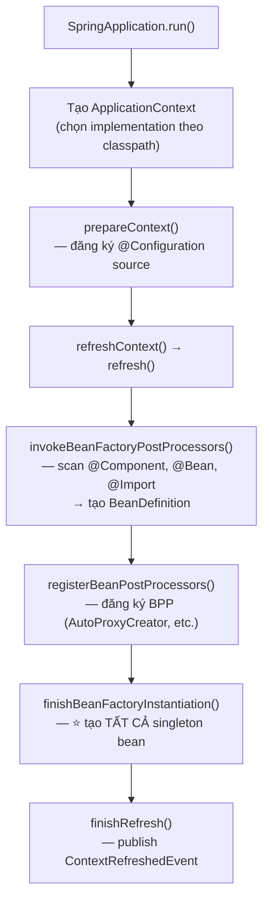
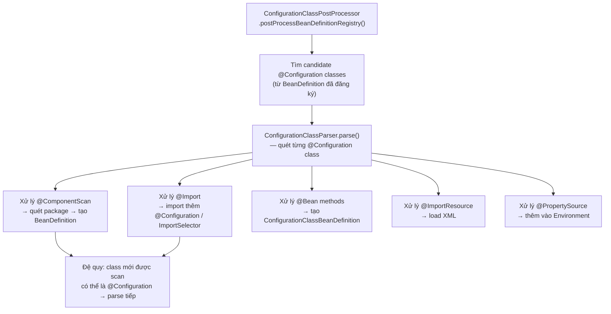
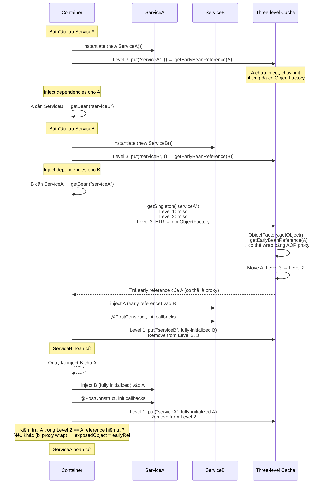
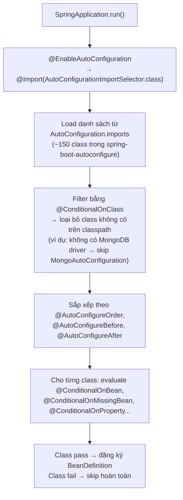

## Mục lục

- [@Autowired có 3 bean cùng type — ai được chọn](#1-autowired-có-3-bean-cùng-type--ai-được-chọn)
- [Container Architecture — BeanFactory vs ApplicationContext](#2-container-architecture--beanfactory-vs-applicationcontext)
- [DefaultListableBeanFactory — class "thần thánh" 4000 dòng](#3-defaultlistablebeanfactory--class-thần-thánh-4000-dòng)
- [BeanDefinition — blueprint trước khi bean tồn tại](#4-beandefinition--blueprint-trước-khi-bean-tồn-tại)
- [ConfigurationClassPostProcessor — quét @Configuration, @Bean, @ComponentScan](#5-configurationclasspostprocessor--quét-configuration-bean-componentscan)
- [Dependency Resolution Algorithm — resolveDependency() internals](#6-dependency-resolution-algorithm--resolvedependency-internals)
- [Circular Dependency — Three-level Cache chi tiết](#7-circular-dependency--three-level-cache-chi-tiết)
- [FactoryBean vs @Bean — hai cơ chế tạo bean khác nhau](#8-factorybean-vs-bean--hai-cơ-chế-tạo-bean-khác-nhau)
- [@Conditional & Auto-Configuration — Spring Boot quyết định bean nào tồn tại](#9-conditional--auto-configuration--spring-boot-quyết-định-bean-nào-tồn-tại)
- [Environment & PropertySource — @Value resolve thế nào](#10-environment--propertysource--value-resolve-thế-nào)
- [ApplicationEvent — Event system internals](#11-applicationevent--event-system-internals)
- [Bean Scope — singleton, prototype, request, và custom scope](#12-bean-scope--singleton-prototype-request-và-custom-scope)
- [BeanFactory Hierarchy — parent-child context](#13-beanfactory-hierarchy--parent-child-context)
- [Anti-patterns & Production Pitfalls](#14-anti-patterns--production-pitfalls)
- [Tóm tắt — Cheat sheet & 7 nguyên tắc](#15-tóm-tắt--cheat-sheet--7-nguyên-tắc)

---

## 1. @Autowired có 3 bean cùng type — ai được chọn

IoC Container là **lớp sâu nhất** của Spring: nó nắm giữ **BeanDefinition** (metadata mỗi bean), **singleton cache** (instance thực), và **dependency resolution algorithm** — bộ máy quyết định khi `@Autowired` một type có nhiều hơn một bean thì chọn cái nào. Mọi thứ khác (AOP, Transaction, Security, Boot auto-config) đều chạy **bên trên** container. Nắm container nghĩa là nắm được: bean sinh ra từ đâu, khi inject type có nhiều candidate thì ưu tiên theo thứ tự nào, và circular dependency được khéo léo xử lý ra sao. Khi xảy ra `NoUniqueBeanDefinitionException` hay "inject nhầm bean", câu trả lời gần như luôn nằm ở `DefaultListableBeanFactory` — class "thần thánh" ~4000 dòng đứng sau mọi `@Autowired`.

Bạn có 3 `DataSource` bean trong application:

```java
@Configuration
public class DataSourceConfig {

    @Bean
    @Primary
    public DataSource primaryDs() {
        return HikariDataSourceBuilder.create()
            .url("jdbc:postgresql://primary:5432/app").build();
    }

    @Bean
    @Qualifier("replica")
    public DataSource replicaDs() {
        return HikariDataSourceBuilder.create()
            .url("jdbc:postgresql://replica:5432/app").build();
    }

    @Bean
    public DataSource analyticsDs() {
        return HikariDataSourceBuilder.create()
            .url("jdbc:postgresql://analytics:5432/warehouse").build();
    }
}
```

Ở service, bạn inject:

```java
@Service
public class ReportService {
    @Autowired
    private DataSource dataSource;   // ← 3 bean cùng type DataSource. Ai được chọn?
}
```

Không exception, không warning — Spring chọn `primaryDs` vì có `@Primary`. Nhưng nếu **không** có `@Primary`? Spring ném `NoUniqueBeanDefinitionException`. Nếu field tên `replicaDs`? Spring match theo tên. Nếu vừa có `@Primary` vừa có `@Qualifier`?

Đây không phải magic — đây là **dependency resolution algorithm** trong `DefaultListableBeanFactory`, với thứ tự ưu tiên rõ ràng. Hiểu algorithm này = hiểu vì sao bean nào được inject.

> [!IMPORTANT]
> IoC Container là **lớp sâu nhất** của Spring — mọi thứ khác (AOP, Transaction, Security, Boot) chạy **bên trên** container. `DefaultListableBeanFactory` là nơi mọi bean được tạo, inject, quản lý. Doc này mổ xẻ từng cơ chế bên trong.

Phần còn lại của doc sẽ đi qua: kiến trúc container `BeanFactory` vs `ApplicationContext` (§2) → `DefaultListableBeanFactory` 4000 dòng (§3) → `BeanDefinition` blueprint (§4) → `ConfigurationClassPostProcessor` (§5) → dependency resolution algorithm (§6) → circular dependency three-level cache (§7) → `FactoryBean` vs `@Bean` (§8) → `@Conditional` & auto-configuration (§9) → `Environment` & `PropertySource` (§10) → `ApplicationEvent` system (§11) → bean scope (§12) → parent-child context (§13) → anti-patterns (§14) → cheat sheet (§15).

---

## 2. Container Architecture — BeanFactory vs ApplicationContext

### 2.1. BeanFactory — interface nền tảng

```java
public interface BeanFactory {
    Object getBean(String name) throws BeansException;
    <T> T getBean(Class<T> requiredType) throws BeansException;
    <T> T getBean(String name, Class<T> requiredType) throws BeansException;
    boolean containsBean(String name);
    boolean isSingleton(String name);
    boolean isPrototype(String name);
    Class<?> getType(String name);
    // ...
}
```

`BeanFactory` là interface tối giản — chỉ biết **lấy bean theo tên/type**. Nó **lazy**: chỉ tạo bean khi được hỏi.

### 2.2. ApplicationContext — extends BeanFactory + nhiều hơn

```java
public interface ApplicationContext extends
    EnvironmentCapable,           // Environment (profiles, properties)
    ListableBeanFactory,          // liệt kê tất cả bean theo type
    HierarchicalBeanFactory,      // parent-child context
    MessageSource,                // i18n
    ApplicationEventPublisher,    // event system
    ResourcePatternResolver {     // classpath:/file: resource loading
    // ...
}
```

`ApplicationContext` **eager** mặc định: tạo **tất cả singleton bean** lúc startup. Đây là lý do app Spring Boot start chậm (nhiều bean) nhưng request đầu tiên nhanh (bean đã sẵn sàng).

### 2.3. Implementations phổ biến

| Implementation | Khi nào dùng |
|---------------|-------------|
| `AnnotationConfigApplicationContext` | Standalone app, `@Configuration` class |
| `AnnotationConfigServletWebServerApplicationContext` | Spring Boot web (Servlet) |
| `AnnotationConfigReactiveWebServerApplicationContext` | Spring Boot WebFlux |
| `ClassPathXmlApplicationContext` | XML config (legacy) |
| `GenericWebApplicationContext` | Test / programmatic |

### 2.4. Startup flow tổng quan



> [!NOTE]
> `refresh()` là method ~100 dòng chứa **12 bước** theo thứ tự cố định. Mọi thứ trong Spring khởi động từ đây. Nếu bạn hiểu `refresh()`, bạn hiểu toàn bộ startup sequence.

---

## 3. DefaultListableBeanFactory — class "thần thánh" 4000 dòng

`DefaultListableBeanFactory` là **concrete implementation** duy nhất mà Spring thực sự dùng để quản lý bean. Mọi `ApplicationContext` đều chứa nó bên trong:

```java
// GenericApplicationContext (base cho hầu hết ApplicationContext)
public class GenericApplicationContext extends AbstractApplicationContext {
    private final DefaultListableBeanFactory beanFactory;   // ← đây

    public GenericApplicationContext() {
        this.beanFactory = new DefaultListableBeanFactory();
    }
}
```

### 3.1. Hierarchy

```
BeanFactory (interface)
└── ListableBeanFactory (liệt kê bean)
    └── ConfigurableListableBeanFactory (config + liệt kê)
        └── DefaultListableBeanFactory (CONCRETE — ~4000 dòng)
            ├── extends AbstractAutowireCapableBeanFactory
            │     └── extends AbstractBeanFactory
            │           └── extends DefaultSingletonBeanRegistry
            │                 └── ⭐ chứa singletonObjects map (bean cache)
            └── implements ConfigurableListableBeanFactory, BeanDefinitionRegistry
```

### 3.2. Các data structure quan trọng

```java
// Rút gọn từ DefaultListableBeanFactory + DefaultSingletonBeanRegistry
public class DefaultListableBeanFactory {

    // === Bean Definition Registry ===
    // Tên bean → BeanDefinition (metadata)
    private final Map<String, BeanDefinition> beanDefinitionMap = new ConcurrentHashMap<>(256);
    // Thứ tự đăng ký (dùng cho ordering)
    private volatile List<String> beanDefinitionNames = new ArrayList<>(256);

    // === Singleton Cache (DefaultSingletonBeanRegistry) ===
    // 1st level: bean name → fully initialized singleton
    private final Map<String, Object> singletonObjects = new ConcurrentHashMap<>(256);
    // 2nd level: bean name → early singleton (chưa inject xong, dùng cho circular dep)
    private final Map<String, Object> earlySingletonObjects = new ConcurrentHashMap<>(16);
    // 3rd level: bean name → ObjectFactory (lambda tạo early reference)
    private final Map<String, ObjectFactory<?>> singletonFactories = new HashMap<>(16);

    // === Type Cache (tối ưu lookup by type) ===
    // type → bean names[] (cache kết quả tìm kiếm theo type)
    private final Map<Class<?>, String[]> allBeanNamesByType = new ConcurrentHashMap<>(64);
    private final Map<Class<?>, String[]> singletonBeanNamesByType = new ConcurrentHashMap<>(64);

    // === Resolution Cache ===
    // dependency type → resolved bean (cache dependency resolution)
    private final Map<Class<?>, Object> resolvableDependencies = new ConcurrentHashMap<>(16);
}
```

### 3.3. getBean() — entry point mọi thứ

```java
// Rút gọn từ AbstractBeanFactory.doGetBean()
protected <T> T doGetBean(String name, Class<T> requiredType, Object[] args) {
    String beanName = transformedBeanName(name);  // xử lý alias, FactoryBean prefix "&"

    // 1) Kiểm tra singleton cache TRƯỚC (tránh tạo lại)
    Object sharedInstance = getSingleton(beanName);
    if (sharedInstance != null) {
        return getObjectForBeanInstance(sharedInstance, name, beanName, null);
    }

    // 2) Nếu definition không có ở đây → hỏi parent BeanFactory
    BeanFactory parentBeanFactory = getParentBeanFactory();
    if (parentBeanFactory != null && !containsBeanDefinition(beanName)) {
        return parentBeanFactory.getBean(name, requiredType);
    }

    // 3) Lấy merged BeanDefinition
    RootBeanDefinition mbd = getMergedLocalBeanDefinition(beanName);

    // 4) Đảm bảo bean phụ thuộc (depends-on) đã tạo trước
    String[] dependsOn = mbd.getDependsOn();
    if (dependsOn != null) {
        for (String dep : dependsOn) {
            getBean(dep);  // đệ quy — tạo dependency trước
        }
    }

    // 5) Tạo bean theo scope
    if (mbd.isSingleton()) {
        sharedInstance = getSingleton(beanName, () -> createBean(beanName, mbd, args));
        return getObjectForBeanInstance(sharedInstance, name, beanName, mbd);
    } else if (mbd.isPrototype()) {
        Object prototypeInstance = createBean(beanName, mbd, args);
        return getObjectForBeanInstance(prototypeInstance, name, beanName, mbd);
    } else {
        // custom scope (request, session, ...)
        String scopeName = mbd.getScope();
        Scope scope = this.scopes.get(scopeName);
        Object scopedInstance = scope.get(beanName, () -> createBean(beanName, mbd, args));
        return getObjectForBeanInstance(scopedInstance, name, beanName, mbd);
    }
}
```

> [!IMPORTANT]
> `doGetBean()` là **điểm vào duy nhất** để lấy bất kỳ bean nào. Nó kiểm tra cache → parent → tạo mới → trả về. Method `createBean()` bên trong mới thực sự instantiate, inject, và init bean (xem bài Bean Lifecycle).

---

## 4. BeanDefinition — blueprint trước khi bean tồn tại

`BeanDefinition` là **metadata mô tả bean** — giống như bản thiết kế trước khi xây nhà. Bean chưa tồn tại khi BeanDefinition được tạo.

### 4.1. Thông tin trong BeanDefinition

```java
public interface BeanDefinition extends AttributeAccessor {
    String getBeanClassName();             // class name (hoặc null nếu @Bean method)
    String getScope();                     // singleton, prototype, request...
    boolean isLazyInit();                  // @Lazy
    String[] getDependsOn();              // @DependsOn
    boolean isAutowireCandidate();        // có thể bị inject bởi người khác?
    boolean isPrimary();                  // @Primary
    String getFactoryBeanName();          // @Configuration class chứa @Bean method
    String getFactoryMethodName();        // @Bean method name
    ConstructorArgumentValues getConstructorArgumentValues();
    MutablePropertyValues getPropertyValues();
    // ...
}
```

### 4.2. BeanDefinition types

| Type | Tạo từ | Đặc điểm |
|------|--------|----------|
| `ScannedGenericBeanDefinition` | `@Component`, `@Service`, `@Repository` qua component scan | `beanClassName` = class đó |
| `ConfigurationClassBeanDefinition` | `@Bean` method trong `@Configuration` | `factoryBeanName` = config class, `factoryMethodName` = method name |
| `RootBeanDefinition` | Merge result (runtime) | Đã merge hết parent/child, sẵn sàng dùng |
| `AnnotatedGenericBeanDefinition` | `@Import`, `@Configuration` class trực tiếp | Đăng ký qua `register()` |

### 4.3. BeanDefinition Merging

Khi bean A extends bean B trong XML config (legacy), hoặc khi `@Configuration` class extends class khác, Spring **merge** BeanDefinition:

```java
// AbstractBeanFactory — rút gọn
protected RootBeanDefinition getMergedBeanDefinition(String beanName, BeanDefinition bd) {
    RootBeanDefinition mbd;

    if (bd.getParentName() == null) {
        // Không có parent → copy sang RootBeanDefinition
        mbd = new RootBeanDefinition(bd);
    } else {
        // Có parent → merge: child override parent attributes
        BeanDefinition pbd = getMergedBeanDefinition(bd.getParentName());  // đệ quy lấy parent
        mbd = new RootBeanDefinition(pbd);   // copy parent
        mbd.overrideFrom(bd);                 // child ghi đè lên
    }
    return mbd;
}
```

> [!NOTE]
> Trong Spring Boot hiện đại (annotation-based), merging ít gặp. Nhưng `getMergedLocalBeanDefinition()` vẫn được gọi cho **mọi bean** — nó cache kết quả trong `mergedBeanDefinitions` map để tránh tính toán lặp.

---

## 5. ConfigurationClassPostProcessor — quét @Configuration, @Bean, @ComponentScan

Đây là `BeanFactoryPostProcessor` **quan trọng nhất** trong Spring Boot — nó biến annotation thành BeanDefinition.

### 5.1. Khi nào chạy?

Trong `refresh()` bước 5: `invokeBeanFactoryPostProcessors()` — chạy **trước** khi bất kỳ bean thường nào được tạo.

### 5.2. Công việc



### 5.3. @Configuration CGLIB enhancement

Khi `@Configuration` class có `@Bean` method gọi nhau, Spring phải đảm bảo bean vẫn là **singleton**:

```java
@Configuration
public class AppConfig {

    @Bean
    public DataSource dataSource() {
        return new HikariDataSource();
    }

    @Bean
    public JdbcTemplate jdbcTemplate() {
        return new JdbcTemplate(dataSource());  // gọi dataSource() lần nữa
        // Bình thường → tạo DataSource MỚI → 2 instance!
        // Nhưng Spring proxy @Configuration class → trả về CÙNG singleton
    }
}
```

`ConfigurationClassPostProcessor` dùng **CGLIB** wrap `@Configuration` class:

```java
// AppConfig$$EnhancerBySpringCGLIB:
@Override
public DataSource dataSource() {
    // Kiểm tra: bean "dataSource" đã có trong container chưa?
    if (beanFactory.containsSingleton("dataSource")) {
        return beanFactory.getBean("dataSource", DataSource.class);  // trả singleton
    }
    // Chưa có → gọi method gốc tạo bean → register vào container
    return super.dataSource();
}
```

> [!WARNING]
> Nếu dùng `@Configuration(proxyBeanMethods = false)` (lite mode, Spring Boot 3+ khuyến khích cho performance), CGLIB enhancement bị **tắt**. Lúc này `dataSource()` gọi lần 2 = tạo instance mới. Phải inject qua parameter thay vì gọi method:
> ```java
> @Bean
> public JdbcTemplate jdbcTemplate(DataSource dataSource) {  // inject qua param ✅
>     return new JdbcTemplate(dataSource);
> }
> ```

---

## 6. Dependency Resolution Algorithm — resolveDependency() internals

Khi Spring gặp `@Autowired` field/constructor/setter, nó gọi `DefaultListableBeanFactory.resolveDependency()`. Đây là **algorithm** quyết định bean nào được inject:

### 6.1. Flow tổng quan

```java
// Rút gọn từ DefaultListableBeanFactory.resolveDependency()
public Object resolveDependency(DependencyDescriptor descriptor, String requestingBeanName) {

    // 1) Xử lý special types (Optional, ObjectFactory, Provider, lazy proxy)
    Object result = getAutowireCandidateResolver().getLazyResolutionProxyIfNecessary(descriptor, requestingBeanName);
    if (result != null) return result;

    // 2) Xử lý multi-value injection (Collection, Map, array)
    Object multipleBeans = resolveMultipleBeans(descriptor, requestingBeanName);
    if (multipleBeans != null) return multipleBeans;

    // 3) Tìm tất cả candidate bean theo TYPE
    Map<String, Object> matchingBeans = findAutowireCandidates(requestingBeanName, descriptor.getDependencyType(), descriptor);

    if (matchingBeans.isEmpty()) {
        if (descriptor.isRequired()) {
            throw new NoSuchBeanDefinitionException(descriptor.getDependencyType());
        }
        return null;
    }

    // 4) Nếu chỉ 1 candidate → done
    if (matchingBeans.size() == 1) {
        return matchingBeans.values().iterator().next();
    }

    // 5) Nhiều candidate → phải chọn 1 (determineAutowireCandidate)
    String autowiredBeanName = determineAutowireCandidate(matchingBeans, descriptor);
    if (autowiredBeanName == null) {
        throw new NoUniqueBeanDefinitionException(descriptor.getDependencyType(), matchingBeans.keySet());
    }
    return matchingBeans.get(autowiredBeanName);
}
```

### 6.2. determineAutowireCandidate — thứ tự ưu tiên chọn bean

Khi có **nhiều bean cùng type**, Spring chọn theo thứ tự ưu tiên **từ trên xuống**:

```java
// Rút gọn từ DefaultListableBeanFactory.determineAutowireCandidate()
protected String determineAutowireCandidate(Map<String, Object> candidates, DependencyDescriptor descriptor) {

    // 1) @Primary — ưu tiên cao nhất
    String primaryCandidate = determinePrimaryCandidate(candidates, descriptor.getDependencyType());
    if (primaryCandidate != null) return primaryCandidate;

    // 2) @Priority (javax.annotation.Priority) — ưu tiên theo số
    String priorityCandidate = determineHighestPriorityCandidate(candidates, descriptor.getDependencyType());
    if (priorityCandidate != null) return priorityCandidate;

    // 3) Tên field/parameter trùng bean name (fallback by name)
    for (Map.Entry<String, Object> entry : candidates.entrySet()) {
        String beanName = entry.getKey();
        if (matchesBeanName(beanName, descriptor.getDependencyName())) {
            return beanName;  // field name "replicaDs" match bean name "replicaDs"
        }
    }

    // 4) Không match → return null → NoUniqueBeanDefinitionException
    return null;
}
```

### 6.3. Resolution priority table

| Ưu tiên | Cơ chế | Ví dụ | Khi nào |
|---------|--------|-------|---------|
| **1** | `@Qualifier` | `@Qualifier("replica") DataSource ds` | Match chính xác bean name/qualifier |
| **2** | `@Primary` | `@Primary @Bean DataSource primaryDs()` | 1 bean được đánh dấu "mặc định" |
| **3** | `@Priority` | `@Priority(1)` trên class | Số nhỏ = ưu tiên cao (JSR-250) |
| **4** | Field/param name | `private DataSource replicaDs` | Tên field trùng bean name |
| **5** | — | — | Không match → `NoUniqueBeanDefinitionException` |

> [!IMPORTANT]
> `@Qualifier` thực ra được xử lý **sớm hơn** — nó **filter** danh sách candidate ở bước 3 (`findAutowireCandidates`), trước cả khi vào `determineAutowireCandidate`. Nếu có `@Qualifier`, Spring chỉ xét bean name/qualifier match → nếu chỉ 1 bean match → inject luôn, không cần `@Primary`.

### 6.4. Special type handling

```java
// resolveDependency() xử lý đặc biệt các type sau:
@Autowired private Optional<PaymentService> optionalService;     // → empty nếu không có bean
@Autowired private ObjectFactory<PaymentService> factory;        // → lazy: gọi factory.getObject() mới resolve
@Autowired private Provider<PaymentService> provider;            // JSR-330 Provider, tương tự ObjectFactory
@Autowired private List<PaymentService> allServices;             // → inject TẤT CẢ bean cùng type
@Autowired private Map<String, PaymentService> serviceMap;       // → bean name → bean instance
```

`List<T>` injection: Spring tìm **tất cả** bean cùng type `T` → sắp xếp theo `@Order`/`Ordered` → inject list. Rất hữu ích cho strategy pattern.

```java
@Service
@Order(1)
public class CreditCardPayment implements PaymentService { ... }

@Service
@Order(2)
public class PayPalPayment implements PaymentService { ... }

@Service
public class PaymentRouter {
    @Autowired
    private List<PaymentService> strategies;
    // → [CreditCardPayment, PayPalPayment] — theo order
}
```

---

## 7. Circular Dependency — Three-level Cache chi tiết

### 7.1. Vấn đề

```java
@Service
class ServiceA {
    @Autowired private ServiceB b;    // A cần B
}

@Service
class ServiceB {
    @Autowired private ServiceA a;    // B cần A
}
```

Tạo A → cần inject B → tạo B → cần inject A → A chưa tạo xong → **deadlock?**

### 7.2. Three-level cache

```java
// DefaultSingletonBeanRegistry
// Level 1: fully initialized singletons
private final Map<String, Object> singletonObjects = new ConcurrentHashMap<>(256);

// Level 2: early singleton references (đã được ObjectFactory tạo, nhưng chưa init xong)
private final Map<String, Object> earlySingletonObjects = new ConcurrentHashMap<>(16);

// Level 3: ObjectFactory — lambda tạo early reference (có thể trả proxy)
private final Map<String, ObjectFactory<?>> singletonFactories = new HashMap<>(16);
```

### 7.3. Flow chi tiết



### 7.4. Tại sao 3 level? Sao không 2?

**Level 3 (ObjectFactory) tồn tại vì AOP proxy.**

Khi bean A cần proxy (có `@Transactional` chẳng hạn), Spring cần trả **proxy** cho B (không phải raw A). Nhưng lúc B hỏi A, A **chưa init xong** → AOP proxy chưa được tạo (bình thường proxy tạo ở `postProcessAfterInitialization`).

Giải pháp: Level 3 chứa `ObjectFactory` — lambda **có thể tạo proxy sớm** nếu cần:

```java
// AbstractAutowireCapableBeanFactory — khi tạo bean
addSingletonFactory(beanName, () -> getEarlyBeanReference(beanName, mbd, bean));

// getEarlyBeanReference:
protected Object getEarlyBeanReference(String beanName, RootBeanDefinition mbd, Object bean) {
    Object exposedObject = bean;
    for (SmartInstantiationAwareBeanPostProcessor bp : getBeanPostProcessors()) {
        // AbstractAutoProxyCreator → tạo proxy NGAY nếu bean cần AOP
        exposedObject = bp.getEarlyBeanReference(exposedObject, beanName);
    }
    return exposedObject;   // raw bean HOẶC proxy
}
```

Nếu **không** có circular dependency, ObjectFactory **không bao giờ** được gọi → proxy tạo bình thường ở `postProcessAfterInitialization`. Chỉ khi circular dependency, ObjectFactory mới bị trigger → proxy tạo **sớm** → di chuyển sang Level 2.

**Nếu chỉ có 2 level** (bỏ Level 3), Spring phải tạo proxy cho **mọi bean** lúc instantiation "phòng trường hợp" circular dependency. Quá lãng phí — hầu hết bean **không** circular.

> [!WARNING]
> Circular dependency chỉ hoạt động với **singleton + field/setter injection**. **Constructor injection** → fail ngay (`BeanCurrentlyInCreationException`) vì lúc gọi constructor, bean chưa instantiate → không có gì để cho vào Level 3. **Prototype scope** → fail ngay vì prototype không cache.

### 7.5. Khi nào circular dependency KHÔNG được giải quyết

| Tình huống | Kết quả | Lý do |
|-----------|---------|-------|
| Constructor injection A ↔ B | ❌ `BeanCurrentlyInCreationException` | Bean chưa tồn tại → không có early reference |
| Prototype scope A ↔ B | ❌ Exception | Prototype không cache singleton registry |
| `@Lazy` trên constructor param | ✅ Hoạt động | Inject lazy proxy thay vì bean thật |
| A (singleton) ↔ B (prototype) | ⚠️ B inject early A OK, nhưng A giữ cùng B mãi | Prototype trong singleton = "singleton behavior" |
| Spring Boot 3.x (circular disabled by default) | ❌ Exception mặc định | `spring.main.allow-circular-references=false` |

> [!IMPORTANT]
> Từ **Spring Boot 2.6+**, circular dependency **bị cấm mặc định** (`spring.main.allow-circular-references=false`). Đây là best practice — circular dependency là code smell (coupling quá chặt). Giải pháp: refactor tách responsibility, dùng `@Lazy`, hoặc event-driven.

---

## 8. FactoryBean vs @Bean — hai cơ chế tạo bean khác nhau

### 8.1. @Bean — đơn giản, phổ biến

```java
@Configuration
public class AppConfig {
    @Bean
    public ObjectMapper objectMapper() {
        return new ObjectMapper()
            .registerModule(new JavaTimeModule())
            .disable(SerializationFeature.WRITE_DATES_AS_TIMESTAMPS);
    }
}
// Container gọi method → lấy return value → đăng ký làm bean
```

### 8.2. FactoryBean — factory tạo bean phức tạp

`FactoryBean<T>` là interface đặc biệt: container **không** đăng ký FactoryBean làm bean — mà đăng ký **object nó tạo ra**:

```java
public interface FactoryBean<T> {
    T getObject() throws Exception;        // object được tạo
    Class<?> getObjectType();              // type của object
    default boolean isSingleton() { return true; }
}
```

Ví dụ thực tế — `SqlSessionFactoryBean` (MyBatis):

```java
public class SqlSessionFactoryBean implements FactoryBean<SqlSessionFactory> {
    private DataSource dataSource;
    private Resource[] mapperLocations;
    // ... nhiều config phức tạp ...

    @Override
    public SqlSessionFactory getObject() throws Exception {
        // Logic tạo SqlSessionFactory rất phức tạp:
        // parse config, scan mapper XML, build configuration, ...
        SqlSessionFactoryBuilder builder = new SqlSessionFactoryBuilder();
        return builder.build(configuration);
    }

    @Override
    public Class<?> getObjectType() {
        return SqlSessionFactory.class;
    }
}
```

### 8.3. Khác biệt quan trọng

```java
@Autowired
private SqlSessionFactory factory;  // → nhận object TỪ FactoryBean.getObject()

// Nếu muốn lấy FactoryBean CHÍNH NÓ (hiếm khi cần):
@Autowired @Qualifier("&sqlSessionFactory")  // prefix "&"
private FactoryBean<SqlSessionFactory> factoryBean;
```

```java
// Container logic:
applicationContext.getBean("sqlSessionFactory");     // → SqlSessionFactory (sản phẩm)
applicationContext.getBean("&sqlSessionFactory");    // → SqlSessionFactoryBean (nhà máy)
```

### 8.4. So sánh

| Tiêu chí | `@Bean` method | `FactoryBean` |
|----------|---------------|---------------|
| Khi nào dùng | Tạo bean đơn giản, config rõ ràng | Tạo bean phức tạp (nhiều bước init), library/framework code |
| Đăng ký | Return value = bean | `getObject()` return = bean, FactoryBean là "nhà máy" ẩn |
| Lazy | Default eager | `getObject()` có thể lazy (gọi khi cần) |
| Ví dụ thực tế | `ObjectMapper`, `RestTemplate` | `SqlSessionFactoryBean`, `ProxyFactoryBean`, `JndiObjectFactoryBean` |
| Code vị trí | Trong `@Configuration` class | Class riêng implement `FactoryBean<T>` |

> [!NOTE]
> Trong Spring Boot hiện đại, `@Bean` + builder pattern đủ cho hầu hết trường hợp. `FactoryBean` chủ yếu còn gặp trong **library code** (MyBatis, Spring Data, Spring Security filter chains) — nơi logic tạo object quá phức tạp để gói trong 1 method.

---

## 9. @Conditional & Auto-Configuration — Spring Boot quyết định bean nào tồn tại

### 9.1. @Conditional — nền tảng

```java
@Target({ElementType.TYPE, ElementType.METHOD})
public @interface Conditional {
    Class<? extends Condition>[] value();
}

@FunctionalInterface
public interface Condition {
    boolean matches(ConditionContext context, AnnotatedTypeMetadata metadata);
}
```

Nếu `matches()` trả `false` → bean/configuration **bị bỏ qua hoàn toàn** — không tạo BeanDefinition, không tạo bean.

### 9.2. Các @Conditional phổ biến (Spring Boot)

| Annotation | Điều kiện | Ví dụ dùng |
|-----------|-----------|-----------|
| `@ConditionalOnClass` | Class có trên classpath | `@ConditionalOnClass(DataSource.class)` — có JDBC driver → configure DataSource |
| `@ConditionalOnMissingBean` | Chưa có bean type đó | `@ConditionalOnMissingBean(ObjectMapper.class)` — user chưa define → auto-configure |
| `@ConditionalOnProperty` | Property có giá trị cụ thể | `@ConditionalOnProperty("app.feature.enabled", havingValue="true")` |
| `@ConditionalOnBean` | Đã có bean type đó | `@ConditionalOnBean(DataSource.class)` → configure JdbcTemplate |
| `@ConditionalOnMissingClass` | Class KHÔNG có trên classpath | Fallback configuration |
| `@ConditionalOnWebApplication` | Đang là web application | Configure DispatcherServlet |

### 9.3. Auto-Configuration mechanism

```
META-INF/spring/org.springframework.boot.autoconfigure.AutoConfiguration.imports
```

File này liệt kê tất cả auto-configuration class. `AutoConfigurationImportSelector` load danh sách, filter theo `@Conditional`, rồi import:



### 9.4. Ví dụ: DataSourceAutoConfiguration

```java
@AutoConfiguration(before = SqlInitializationAutoConfiguration.class)
@ConditionalOnClass({ DataSource.class, EmbeddedDatabaseType.class })
@ConditionalOnMissingBean(type = "io.r2dbc.spi.ConnectionFactory")
@EnableConfigurationProperties(DataSourceProperties.class)
public class DataSourceAutoConfiguration {

    @Configuration
    @Conditional(PooledDataSourceCondition.class)
    @ConditionalOnMissingBean({ DataSource.class, XADataSource.class })
    static class PooledDataSourceConfiguration {

        @Bean
        @ConditionalOnMissingBean
        DataSource dataSource(DataSourceProperties properties) {
            // Nếu user CHƯA define DataSource bean → tạo HikariDataSource mặc định
            return properties.initializeDataSourceBuilder()
                .type(HikariDataSource.class).build();
        }
    }
}
```

Luồng suy nghĩ:
1. Có `DataSource.class` trên classpath? (có JDBC driver) → **tiếp**
2. Không có R2DBC ConnectionFactory? → **tiếp** (không phải reactive)
3. User đã define `DataSource` bean chưa? → **chưa** → tạo HikariDataSource tự động

> [!TIP]
> Nguyên tắc auto-configuration: **"opinionated defaults with easy override"**. Spring Boot tạo bean mặc định nếu bạn không define. Hễ bạn define → `@ConditionalOnMissingBean` fail → auto-config bean bị skip → bean của bạn thắng.

### 9.5. Debug auto-configuration

```properties
# application.properties — xem Spring Boot quyết định ra sao
debug=true
```

Output:
```text
============================
CONDITIONS EVALUATION REPORT
============================

Positive matches:
-----------------
   DataSourceAutoConfiguration matched:
      - @ConditionalOnClass found required classes 'javax.sql.DataSource', ... (OnClassCondition)
      - @ConditionalOnMissingBean (types: io.r2dbc.spi.ConnectionFactory; ...) did not find any beans (OnBeanCondition)

Negative matches:
-----------------
   MongoAutoConfiguration:
      Did not match:
         - @ConditionalOnClass did not find required class 'com.mongodb.client.MongoClient' (OnClassCondition)
```

---

## 10. Environment & PropertySource — @Value resolve thế nào

### 10.1. Environment abstraction

```java
public interface Environment extends PropertyResolver {
    String[] getActiveProfiles();      // ["dev", "local"]
    String[] getDefaultProfiles();     // ["default"]
    boolean acceptsProfiles(Profiles profiles);
}

public interface PropertyResolver {
    String getProperty(String key);
    String getProperty(String key, String defaultValue);
    <T> T getProperty(String key, Class<T> targetType);
    String resolvePlaceholders(String text);   // "Hello ${name}" → "Hello World"
}
```

### 10.2. PropertySource hierarchy — thứ tự ưu tiên

Spring Boot resolve property theo thứ tự **từ trên xuống** (trên thắng):

| Ưu tiên | Source | Ví dụ |
|---------|--------|-------|
| 1 (cao nhất) | Command line args | `--server.port=9090` |
| 2 | `SPRING_APPLICATION_JSON` | JSON inline |
| 3 | ServletConfig/ServletContext params | Web container |
| 4 | OS environment variables | `SERVER_PORT=9090` |
| 5 | `application-{profile}.properties` | `application-dev.yml` |
| 6 | `application.properties` | `application.yml` |
| 7 | `@PropertySource` annotation | `@PropertySource("classpath:custom.properties")` |
| 8 | Default properties | `SpringApplication.setDefaultProperties()` |

### 10.3. @Value resolution internals

```java
@Service
public class NotificationService {
    @Value("${notification.email.from:noreply@app.com}")
    private String fromEmail;
}
```

Flow resolve `@Value`:

```java
// 1) AutowiredAnnotationBeanPostProcessor phát hiện @Value
// 2) Gọi BeanExpressionResolver.evaluate() hoặc StringValueResolver

// PropertySourcesPlaceholderConfigurer (BeanFactoryPostProcessor) đăng ký StringValueResolver:
beanFactory.addEmbeddedValueResolver(strVal -> {
    // "Hello ${name}" → tìm property "name" trong Environment
    return this.environment.resolvePlaceholders(strVal);
});

// PropertySourcesPropertyResolver.resolvePlaceholders():
// 1) Parse "${notification.email.from:noreply@app.com}"
//    → key = "notification.email.from", default = "noreply@app.com"
// 2) Duyệt PropertySource list theo thứ tự ưu tiên
// 3) Source đầu tiên có key → trả value. Không ai có → dùng default.
```

### 10.4. SpEL trong @Value

```java
@Value("#{systemProperties['user.home']}")           // SpEL: Java system property
private String userHome;

@Value("#{T(java.lang.Math).random() * 100}")        // SpEL: gọi static method
private double randomNumber;

@Value("#{myBean.computeValue()}")                   // SpEL: gọi method bean khác
private String computed;

@Value("${app.servers}")                             // comma-separated → List
private List<String> servers;                        // app.servers=s1,s2,s3

@Value("#{${app.map}}")                              // SpEL parse Map literal
private Map<String, Integer> map;                    // app.map={a:1,b:2}
```

> [!WARNING]
> `${...}` = **property placeholder** — tìm trong Environment. `#{...}` = **SpEL expression** — evaluate Java expression. Nhầm lẫn hai cú pháp này là lỗi phổ biến.

---

## 11. ApplicationEvent — Event system internals

### 11.1. Architecture

```
ApplicationEventPublisher (interface)
    └── ApplicationContext (implement sẵn)
           └── publishEvent(event)
                  └── ApplicationEventMulticaster
                         └── multicastEvent(event)
                                └── duyệt tất cả listener match → invoke
```

### 11.2. Đăng ký listener

```java
// Cách 1: @EventListener (Spring 4.2+ — khuyên dùng)
@Component
public class OrderEventHandler {

    @EventListener
    public void onOrderCreated(OrderCreatedEvent event) {
        // được gọi khi publish OrderCreatedEvent
        emailService.sendConfirmation(event.getOrder());
    }

    @EventListener(condition = "#event.amount > 1000")  // SpEL condition
    public void onLargeOrder(OrderCreatedEvent event) {
        alertService.notifyManager(event);
    }
}

// Cách 2: implement ApplicationListener<T> (cũ hơn nhưng vẫn hợp lệ)
@Component
public class OrderListener implements ApplicationListener<OrderCreatedEvent> {
    @Override
    public void onApplicationEvent(OrderCreatedEvent event) { ... }
}
```

### 11.3. Publish event

```java
@Service
public class OrderService {
    @Autowired
    private ApplicationEventPublisher publisher;

    @Transactional
    public Order createOrder(OrderRequest request) {
        Order order = orderRepo.save(new Order(request));
        publisher.publishEvent(new OrderCreatedEvent(order));  // sync mặc định!
        return order;
    }
}
```

### 11.4. Sync vs Async — mặc định là SYNC

```java
// SimpleApplicationEventMulticaster — mặc định
public void multicastEvent(ApplicationEvent event, ResolvableType eventType) {
    for (ApplicationListener<?> listener : getApplicationListeners(event, eventType)) {
        Executor executor = getTaskExecutor();
        if (executor != null) {
            executor.execute(() -> invokeListener(listener, event));  // async
        } else {
            invokeListener(listener, event);  // ⚠️ SYNC — cùng thread, cùng transaction!
        }
    }
}
```

Mặc định **sync** = listener chạy **trong** cùng transaction của publisher. Nếu listener ném exception → transaction **rollback**.

```java
// Muốn async: dùng @Async
@EventListener
@Async   // chạy trên thread pool riêng → KHÔNG cùng transaction
public void onOrderCreated(OrderCreatedEvent event) { ... }
```

### 11.5. @TransactionalEventListener — chạy sau commit

```java
@TransactionalEventListener(phase = TransactionPhase.AFTER_COMMIT)
public void onOrderCommitted(OrderCreatedEvent event) {
    // Chỉ chạy SAU KHI transaction COMMIT thành công
    // Nếu TX rollback → listener KHÔNG chạy → tránh gửi email cho order bị huỷ
    emailService.sendConfirmation(event.getOrder());
}
```

| Phase | Khi nào chạy |
|-------|-------------|
| `AFTER_COMMIT` (mặc định) | Sau commit thành công |
| `AFTER_ROLLBACK` | Sau rollback |
| `AFTER_COMPLETION` | Sau commit hoặc rollback (finally) |
| `BEFORE_COMMIT` | Trước commit (vẫn trong TX, có thể rollback nếu fail) |

> [!IMPORTANT]
> `@TransactionalEventListener` + `AFTER_COMMIT` là pattern chuẩn cho **side-effect** (gửi email, publish message, gọi webhook): chỉ thực hiện khi dữ liệu **chắc chắn** đã persist. Tránh gửi email rồi transaction rollback.

---

## 12. Bean Scope — singleton, prototype, request, và custom scope

### 12.1. Bảng scope

| Scope | Vòng đời | Instance | Destruction |
|-------|---------|----------|-------------|
| `singleton` (mặc định) | Suốt đời container | 1 duy nhất | Container shutdown |
| `prototype` | Mỗi lần `getBean()` | Mới mỗi lần | **Không** — container không quản lý destruction |
| `request` | 1 HTTP request | Mới mỗi request | Cuối request |
| `session` | 1 HTTP session | Mới mỗi session | Session invalidate |
| `application` | 1 ServletContext | 1 duy nhất (giống singleton nhưng scope khác) | Context destroy |
| `websocket` | 1 WebSocket session | Mới mỗi WS session | WS close |

### 12.2. Prototype — container "bỏ rơi" sau khi tạo

```java
@Component
@Scope("prototype")
public class RequestTracker {
    private final String id = UUID.randomUUID().toString();
    @PreDestroy
    public void cleanup() {
        // ⚠️ KHÔNG BAO GIỜ ĐƯỢC GỌI! Container không track prototype bean
    }
}
```

> [!WARNING]
> Container **không gọi** `@PreDestroy` cho prototype bean. Sau `getBean()`, bạn **tự chịu trách nhiệm** vòng đời. Nếu prototype giữ resource (connection, file handle), bạn phải close thủ công. Đây là lý do prototype ít được dùng.

### 12.3. Custom scope

```java
// Ví dụ: Tenant scope — 1 bean per tenant
public class TenantScope implements Scope {
    private final Map<String, Map<String, Object>> tenantBeans = new ConcurrentHashMap<>();

    @Override
    public Object get(String name, ObjectFactory<?> objectFactory) {
        String tenantId = TenantContext.getCurrentTenant();
        Map<String, Object> beans = tenantBeans.computeIfAbsent(tenantId, k -> new ConcurrentHashMap<>());
        return beans.computeIfAbsent(name, k -> objectFactory.getObject());
    }

    @Override
    public Object remove(String name) { ... }

    @Override
    public void registerDestructionCallback(String name, Runnable callback) { ... }
}

// Đăng ký:
@Configuration
public class ScopeConfig {
    @Bean
    public static CustomScopeConfigurer scopeConfigurer() {
        CustomScopeConfigurer configurer = new CustomScopeConfigurer();
        configurer.addScope("tenant", new TenantScope());
        return configurer;
    }
}

// Sử dụng:
@Component
@Scope("tenant")
public class TenantCache { ... }  // mỗi tenant có cache riêng
```

---

## 13. BeanFactory Hierarchy — parent-child context

### 13.1. Khi nào dùng

Spring cho phép **lồng** ApplicationContext: child context có thể tham chiếu bean từ parent, nhưng parent **không** thấy bean trong child.

```
Parent ApplicationContext
├── shared beans (DataSource, common services)
│
├── Child Context 1 (DispatcherServlet — web endpoints)
│   └── Controllers, ViewResolvers
│
└── Child Context 2 (Admin DispatcherServlet)
    └── Admin Controllers
```

### 13.2. Lookup order

```java
// AbstractBeanFactory.doGetBean():
if (parentBeanFactory != null && !containsBeanDefinition(beanName)) {
    // Bean không có trong child → hỏi parent
    return parentBeanFactory.getBean(name, requiredType);
}
```

Thứ tự: **child trước → parent sau**. Nếu child define bean cùng tên → **override** parent (child thắng).

### 13.3. Ứng dụng thực tế — Spring MVC multi-servlet

```java
// Root context (parent): service + repository beans
// DispatcherServlet context (child): controller + web beans

// Controller (child) inject Service (parent) → OK ✅
// Service (parent) inject Controller (child) → FAIL ❌ (parent không thấy child)
```

> [!NOTE]
> Spring Boot mặc định dùng **single context** (không hierarchy). Multi-context chủ yếu gặp ở Spring MVC truyền thống (XML config) hoặc khi cần isolation giữa modules.

---

## 14. Anti-patterns & Production Pitfalls

| Pitfall | Vì sao sai | Triệu chứng | Fix |
|---------|-----------|-------------|-----|
| Circular dependency (constructor) | 3-level cache không giải constructor DI | `BeanCurrentlyInCreationException` | Refactor, `@Lazy` param, event-driven |
| Prototype inject vào singleton | Singleton giữ cùng prototype instance mãi | "Prototype" nhưng hành xử như singleton | Inject `ObjectFactory<T>` hoặc `Provider<T>` |
| `@Value` trong constructor + missing property | `PropertySourcesPlaceholderConfigurer` chưa chạy? Không — chỉ là property thiếu | App không start, error message khó hiểu | Thêm default: `${key:default}` |
| `@Bean` method gọi `@Bean` method trong lite mode | `proxyBeanMethods=false` → mỗi lần gọi = instance mới | 2 DataSource instance → 2 connection pool → resource leak | Inject qua parameter thay vì gọi method |
| `@ConditionalOnMissingBean` order sai | Auto-config class chạy trước user's `@Bean` | User bean bị ignore | Dùng `@AutoConfigureAfter` / `@AutoConfigureBefore` |
| Quá nhiều bean (1000+) khiến startup chậm | Mỗi bean cần scan advisor, resolve dependency | 20-60 giây startup | `@Lazy`, AOT (GraalVM), reduce scan scope |
| `@EventListener` ném exception | Sync listener → exception propagate lên publisher | Publisher's transaction rollback bất ngờ | Wrap try/catch trong listener, hoặc dùng `@Async` |
| `@PreDestroy` trong prototype | Container không gọi destroy cho prototype | Resource leak (connection, file handle) | Dùng singleton + scope management, hoặc manual close |
| Parent context refresh sau child | Bean ở child tham chiếu bean parent cũ | Stale reference, NPE | Đảm bảo parent refresh trước child |

### 14.1. Prototype injection vào singleton — fix đúng

```java
// ❌ Sai — prototype "chết" thành singleton
@Service   // singleton
public class OrderProcessor {
    @Autowired
    private RequestTracker tracker;   // inject 1 lần lúc startup → cùng instance mãi
}

// ✅ Đúng — inject factory, lấy instance mới mỗi lần cần
@Service
public class OrderProcessor {
    @Autowired
    private ObjectFactory<RequestTracker> trackerFactory;

    public void process(Order order) {
        RequestTracker tracker = trackerFactory.getObject();  // instance mới
        // ...
    }
}

// ✅ Hoặc dùng lookup method (CGLIB override tại runtime)
@Service
public abstract class OrderProcessor {
    @Lookup
    protected abstract RequestTracker createTracker();  // Spring override bằng CGLIB

    public void process(Order order) {
        RequestTracker tracker = createTracker();  // instance mới mỗi lần
    }
}
```

---

## 15. Tóm tắt — Cheat sheet & 7 nguyên tắc

**Cỗ máy trong 9 dòng:**

```
1. SpringApplication.run() → tạo ApplicationContext (chứa DefaultListableBeanFactory)
2. ConfigurationClassPostProcessor quét @Configuration/@ComponentScan/@Bean → tạo BeanDefinition
3. BeanDefinition = metadata (class, scope, lazy, primary, depends-on, factory method)
4. finishBeanFactoryInstantiation() → tạo TẤT CẢ singleton bean (eager)
5. Tạo bean: instantiate → inject dependency (resolveDependency) → init (@PostConstruct) → BPP (proxy)
6. Dependency resolution: type match → @Qualifier filter → @Primary → @Priority → field name match
7. Circular dep (field/setter): 3-level cache — ObjectFactory tạo early reference (có thể proxy)
8. Auto-configuration: @ConditionalOnClass/@ConditionalOnMissingBean filter → bean mặc định nếu user chưa define
9. Event: sync mặc định (cùng TX), @TransactionalEventListener cho side-effect sau commit
```

| Component | Vai trò |
|-----------|---------|
| `DefaultListableBeanFactory` | Giữ tất cả: BeanDefinition map, singleton cache, dependency resolution |
| `ConfigurationClassPostProcessor` | Quét annotation → tạo BeanDefinition |
| `AutowiredAnnotationBeanPostProcessor` | Inject `@Autowired`/`@Value` |
| `AbstractAutoProxyCreator` | Tạo AOP proxy |
| `PropertySourcesPlaceholderConfigurer` | Resolve `${...}` placeholder |
| `ApplicationEventMulticaster` | Dispatch event → listener |
| `ConditionEvaluator` | Evaluate `@Conditional` → quyết định bean có tồn tại |

**7 nguyên tắc khắc cốt:**

1. **Container = BeanDefinition + Singleton Cache** — hiểu 2 map này = hiểu nơi bean "sống". Mọi `getBean()` kiểm tra cache trước, tạo mới sau.
2. **Dependency resolution có thứ tự** — `@Qualifier` > `@Primary` > `@Priority` > field name. Khi ambiguous, Spring **không đoán** — ném exception.
3. **Circular dependency = code smell** — 3-level cache là "lưới an toàn", không phải giấy phép. Spring Boot 2.6+ cấm mặc định. Refactor tách responsibility.
4. **`@ConditionalOnMissingBean` = "bạn define thì tôi nhường"** — auto-configuration luôn **thua** bean user define. Đây là triết lý Spring Boot.
5. **Prototype inject vào singleton = bug** — singleton giữ cùng instance mãi. Dùng `ObjectFactory<T>` hoặc `@Lookup`.
6. **Event mặc định sync + cùng TX** — listener ném exception = publisher rollback. Dùng `@TransactionalEventListener(AFTER_COMMIT)` cho side-effect.
7. **`@Configuration(proxyBeanMethods=false)` = lite mode** — gọi `@Bean` method = instance mới. Inject qua parameter, không gọi method trực tiếp.

> [!TIP]
> Một câu để nhớ: *IoC Container quản lý vòng đời và quan hệ giữa bean — bạn chỉ khai báo "cần gì", container lo "tạo và nối".* Mọi lỗi "bean not found", "ambiguous", "circular" đều quy về: BeanDefinition có đúng không, dependency resolution chọn ai, và cache ở level nào.
