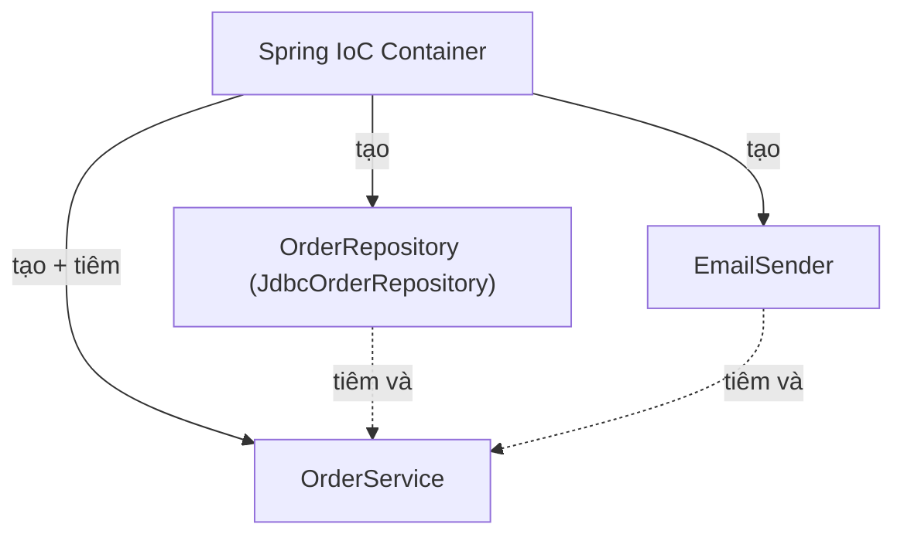
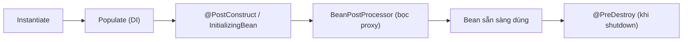
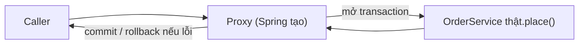
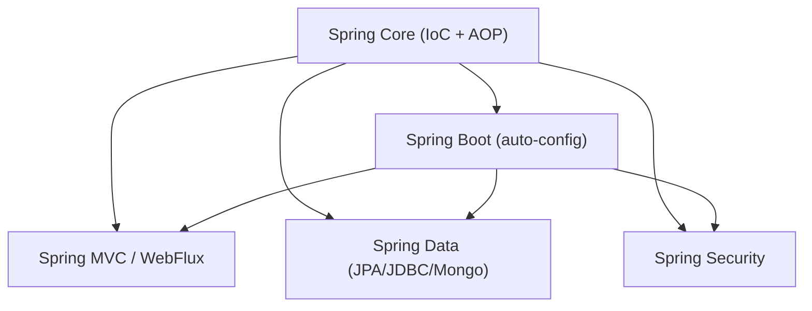

# Spring — Hiểu cơ chế bên dưới, không chỉ annotation

## Mục lục

- [Bối cảnh: Spring giải quyết vấn đề gì](#1-bối-cảnh-spring-giải-quyết-vấn-đề-gì)
- [IoC & Dependency Injection — trái tim của Spring](#2-ioc--dependency-injection--trái-tim-của-spring)
- [Container: BeanFactory vs ApplicationContext](#3-container-beanfactory-vs-applicationcontext)
- [Bean lifecycle & scope](#4-bean-lifecycle--scope)
- [AOP — @Transactional hoạt động thế nào](#5-aop--transactional-hoạt-động-thế-nào)
- [Spring Boot: auto-configuration & starter](#6-spring-boot-auto-configuration--starter)
- [Các module chính](#7-các-module-chính)
- [Kiểu inject & best practice](#8-kiểu-inject--best-practice)
- [Anti-patterns cần tránh](#9-anti-patterns-cần-tránh)
- [Tóm tắt — Cheat sheet](#10-tóm-tắt--cheat-sheet)

---

## 1. Bối cảnh: Spring giải quyết vấn đề gì

Không có Spring, code Java doanh nghiệp đầy "dây nối" thủ công: mỗi class tự `new` dependency của nó, tự quản vòng đời, tự mở/đóng transaction, tự lo cấu hình:

```java
class OrderService {
    private final OrderRepository repo = new JdbcOrderRepository(
        new HikariDataSource(loadConfig()));   // tự tạo cả cây phụ thuộc
    private final EmailSender email = new SmtpEmailSender(...);

    void place(Order o) {
        Connection c = dataSource.getConnection();
        try { c.setAutoCommit(false); /* logic */ c.commit(); }   // tự quản transaction
        catch (Exception e) { c.rollback(); } finally { c.close(); }
    }
}
```

Vấn đề: coupling chặt (khoá cứng lớp cụ thể), khó test (không mock được), lặp boilerplate (transaction/connection ở mọi method). Spring giải quyết bằng **đảo ngược quyền điều khiển** (IoC): bạn *khai báo* cần gì, container *tạo và lắp ráp* cho bạn.

> [!IMPORTANT]
> Spring không phải "một framework web" — nó là một **container quản lý object** (bean) + **AOP**. Mọi thứ khác (MVC, Data, Security) xây trên hai nền này. Hiểu IoC + AOP = hiểu 80% Spring; phần còn lại chỉ là annotation tiện lợi gói quanh hai cơ chế đó.

---

## 2. IoC & Dependency Injection — trái tim của Spring

**Inversion of Control (IoC)**: thay vì object tự tạo dependency, *quyền điều khiển* việc tạo/lắp ráp được **đảo ngược** cho container. **Dependency Injection (DI)** là cách hiện thực: container "tiêm" dependency vào.

```java
@Service
class OrderService {
    private final OrderRepository repo;
    private final EmailSender email;
    OrderService(OrderRepository repo, EmailSender email) {  // container TIÊM vào
        this.repo = repo; this.email = email;
    }
}
```

Đây chính là hiện thực của **Dependency Inversion Principle** (xem doc SOLID): `OrderService` phụ thuộc *interface* `OrderRepository`, không biết lớp cụ thể. Container quyết định cắm `JdbcOrderRepository` hay (trong test) một mock.



> [!TIP]
> Lợi ích thực tế: (1) **test dễ** — inject mock thay vì real DB; (2) **đổi implementation** không sửa code dùng; (3) **không lo vòng đời** — container tạo/huỷ. "Bean" chỉ là object do Spring quản lý. Bạn khai báo bean bằng `@Component`/`@Service`/`@Repository`/`@Bean`, và Spring tự lắp ráp đồ thị phụ thuộc.

---

## 3. Container: BeanFactory vs ApplicationContext

Container Spring có hai tầng:

| | `BeanFactory` | `ApplicationContext` |
|---|---------------|----------------------|
| Vai trò | container cơ bản (DI, lazy) | mở rộng BeanFactory (dùng thực tế) |
| Khởi tạo bean | lazy (khi cần) | **eager** (singleton tạo sẵn lúc start) |
| Thêm | — | i18n, event, AOP, resource, environment |

`ApplicationContext` là thứ bạn dùng 99% thời gian. Quá trình khởi động:

```
1. Đọc cấu hình (annotation/@Configuration/XML) → định nghĩa bean (BeanDefinition)
2. BeanFactoryPostProcessor: sửa định nghĩa bean (vd thay ${placeholder})
3. Tạo instance bean (theo thứ tự phụ thuộc)
4. Tiêm dependency (DI)
5. BeanPostProcessor: bọc proxy (AOP), xử lý @PostConstruct
6. Container sẵn sàng
```

> [!NOTE]
> `BeanPostProcessor` (bước 5) là điểm "ma thuật" của Spring: đây là nơi bean *thật* của bạn bị **bọc trong proxy** để thêm AOP (transaction, cache, security). Khi bạn `@Autowired` một service, thứ bạn nhận có thể là **proxy** chứ không phải instance gốc — chi tiết quan trọng để hiểu mục 5.

---

## 4. Bean lifecycle & scope

### 4.1. Vòng đời một bean



```java
@Component
class CacheWarmer {
    @PostConstruct void init() { /* chạy SAU khi DI xong — nạp cache */ }
    @PreDestroy   void cleanup() { /* chạy trước khi huỷ — đóng tài nguyên */ }
}
```

### 4.2. Scope — vòng đời bean kéo dài bao lâu

| Scope | Ý nghĩa |
|-------|---------|
| `singleton` (mặc định) | **một** instance cho cả container |
| `prototype` | tạo mới mỗi lần inject/lấy |
| `request` | một instance mỗi HTTP request (web) |
| `session` | một instance mỗi HTTP session |

> [!WARNING]
> Bean Spring **mặc định là singleton** → **phải stateless** (không giữ state mutable theo từng request). Giữ field mutable trong singleton service = bug đa luồng (mọi request chia sẻ nó). Đây là lý do service Spring thường chỉ chứa dependency (final, immutable) chứ không chứa dữ liệu xử lý. Cần state theo request → dùng scope `request` hoặc truyền tham số.

> [!WARNING]
> Bẫy kinh điển: inject bean `prototype` vào bean `singleton`. Singleton chỉ được tiêm **một lần** lúc tạo → prototype "đông cứng" thành một instance, mất ý nghĩa prototype. Giải pháp: `ObjectProvider`, `@Lookup`, hoặc scoped proxy.

---

## 5. AOP — @Transactional hoạt động thế nào

**Aspect-Oriented Programming**: tách "mối quan tâm cắt ngang" (cross-cutting: transaction, log, security, cache) ra khỏi logic nghiệp vụ. Spring hiện thực AOP bằng **proxy** (xem doc Structural Patterns — Proxy).

```java
@Service
class OrderService {
    @Transactional                       // không có code transaction trong method!
    public void place(Order o) {
        repo.save(o);                    // chỉ logic nghiệp vụ thuần
        inventory.reduce(o);
    }
}
```

Điều thực sự xảy ra: Spring tạo một **proxy** bọc `OrderService`. Khi bạn gọi `place()`, bạn gọi proxy trước:



```
proxy.place():
    txManager.begin()            ← before
    try { realService.place() }  ← logic thật của bạn
    catch { txManager.rollback(); throw }
    txManager.commit()           ← after
```

> [!WARNING]
> Hệ quả cực kỳ quan trọng của cơ chế proxy: **self-invocation không qua proxy**. Nếu method A (không `@Transactional`) gọi method B (`@Transactional`) **trong cùng class**, lời gọi `this.B()` **không** đi qua proxy → `@Transactional` của B **bị bỏ qua hoàn toàn**. Tương tự cho `@Cacheable`, `@Async`. Giải pháp: tách B sang bean khác, hoặc inject chính mình (self-injection). Đây là bug "tại sao transaction của tôi không chạy" số một.

> [!NOTE]
> Spring chọn proxy động: **JDK dynamic proxy** nếu bean có interface, **CGLIB** (subclass) nếu là class cụ thể. Vì CGLIB tạo subclass nên method/class `final` không proxy được → `@Transactional` trên method `final` âm thầm vô hiệu.

---

## 6. Spring Boot: auto-configuration & starter

Spring "thuần" cấu hình rườm rà. **Spring Boot** thêm hai thứ:

### 6.1. Starter — gom dependency theo nhóm

```xml
<!-- Một dòng kéo về Tomcat + Spring MVC + Jackson + validation... -->
<dependency>
  <groupId>org.springframework.boot</groupId>
  <artifactId>spring-boot-starter-web</artifactId>
</dependency>
```

### 6.2. Auto-configuration — cấu hình theo "có gì trên classpath"

```
@SpringBootApplication → @EnableAutoConfiguration
→ quét các AutoConfiguration class
→ mỗi cái có @ConditionalOnClass / @ConditionalOnMissingBean ...
→ "thấy H2 trên classpath mà chưa có DataSource → tự tạo DataSource H2"
```

> [!TIP]
> Cơ chế cốt lõi của auto-config là **`@Conditional`**: "chỉ cấu hình X *nếu* điều kiện Y" (có class này, thiếu bean kia, property nọ bật). Đó là vì sao Spring Boot "chạy được ngay" nhưng vẫn cho bạn ghi đè — bạn khai báo bean của mình, `@ConditionalOnMissingBean` thấy có rồi nên auto-config nhường. Xem `--debug` để in "condition evaluation report" biết cái gì được/không được cấu hình và vì sao.

---

## 7. Các module chính



| Module | Vai trò |
|--------|---------|
| Spring Core | IoC container + DI + AOP (nền của tất cả) |
| Spring MVC | web MVC servlet (`@Controller`, `@RestController`) |
| Spring WebFlux | web reactive (non-blocking, `Flux`/`Mono`) |
| Spring Data | trừu tượng truy cập dữ liệu (repository tự sinh query) |
| Spring Security | xác thực + phân quyền (filter chain) |
| Spring Boot | auto-config + starter + embedded server + actuator |

---

## 8. Kiểu inject & best practice

Ba cách tiêm dependency:

```java
// 1. Constructor injection — KHUYÊN DÙNG
@Service
class A {
    private final B b;
    A(B b) { this.b = b; }     // final, bắt buộc, dễ test, phát hiện circular sớm
}

// 2. Setter injection — cho dependency tuỳ chọn
@Autowired void setB(B b) { this.b = b; }

// 3. Field injection — TRÁNH
@Autowired private B b;        // không final, khó test (phải reflection), giấu phụ thuộc
```

> [!TIP]
> **Constructor injection là chuẩn vàng**: (1) field `final` → immutable, thread-safe; (2) dependency bắt buộc lộ rõ trong constructor; (3) test không cần Spring (chỉ `new A(mockB)`); (4) circular dependency bị phát hiện lúc khởi động thay vì ẩn. Field injection tiện nhưng giấu phụ thuộc và buộc dùng reflection để test — tránh. Với một dependency, Spring tự `@Autowired` constructor (khỏi ghi annotation).

---

## 9. Anti-patterns cần tránh

| Anti-pattern | Vì sao sai | Thay bằng |
|--------------|-----------|-----------|
| Field injection (`@Autowired` field) | khó test, không final, giấu phụ thuộc | constructor injection |
| State mutable trong singleton bean | bug đa luồng (chia sẻ giữa request) | stateless / scope request |
| Gọi `@Transactional` cùng class (self-invocation) | không qua proxy → bị bỏ qua | tách bean / self-inject |
| `@Transactional`/`@Async` trên method `final` | CGLIB không proxy được | bỏ `final` |
| Inject prototype vào singleton trực tiếp | prototype đông cứng | `ObjectProvider`/scoped proxy |
| Tự `new` bean trong code | mất DI/AOP/lifecycle | để container tạo |
| Logic nặng trong constructor bean | chậm khởi động, khó test | `@PostConstruct` |

---

## 10. Tóm tắt — Cheat sheet

**Hai nền tảng:**

```
IoC/DI → container TẠO + TIÊM dependency (bạn khai báo, không new)
         bean mặc định SINGLETON → phải stateless
AOP    → proxy bọc bean để thêm transaction/cache/security
         self-invocation KHÔNG qua proxy → annotation bị bỏ
```

| Khái niệm | Nắm gì |
|-----------|--------|
| Bean | object do Spring quản lý vòng đời |
| ApplicationContext | container dùng thực tế (eager singleton) |
| `@Transactional` | proxy mở/commit/rollback quanh method |
| Auto-configuration | `@Conditional` — cấu hình theo classpath |
| Inject | constructor (chuẩn), setter (tuỳ chọn), field (tránh) |

**5 nguyên tắc khắc cốt:**

1. **IoC + AOP là nền của mọi thứ** — hiểu hai cái này là hiểu Spring.
2. **Bean mặc định singleton → phải stateless.**
3. **`@Transactional` chạy nhờ proxy** → self-invocation và method `final` làm nó vô hiệu.
4. **Constructor injection là chuẩn vàng** — final, dễ test, lộ phụ thuộc.
5. **Auto-config dựa trên `@Conditional`** — chạy ngay nhưng vẫn ghi đè được.

> [!TIP]
> Một câu để nhớ: *Spring lấy đi hai việc nhàm chán — lắp ráp object (IoC) và rải code cắt-ngang như transaction (AOP) — bằng cách tạo bean và bọc chúng trong proxy. Mọi "ma thuật" annotation chỉ là hai cơ chế đó hoạt động sau lưng bạn.*
