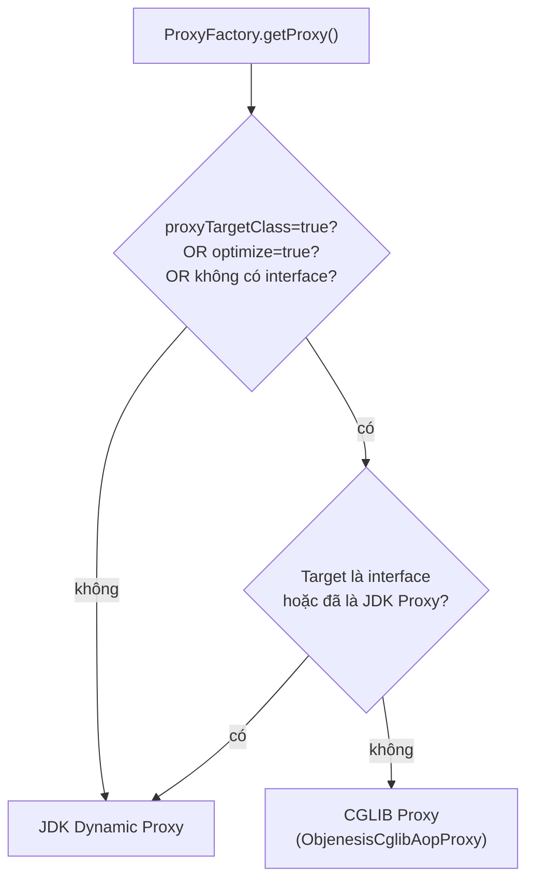
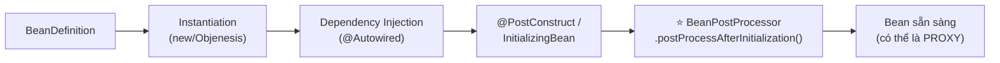
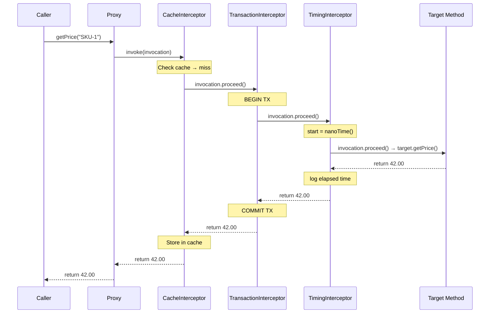

## Mục lục

- [Bối cảnh: @Cacheable hoạt động, nhưng @Retry thì không](#1-bối-cảnh-cacheable-hoạt-động-nhưng-retry-thì-không)
- [Proxy Pattern — ý tưởng nền tảng](#2-proxy-pattern--ý-tưởng-nền-tảng)
- [JDK Dynamic Proxy — Proxy.newProxyInstance() bên trong](#3-jdk-dynamic-proxy--proxynewproxyinstance-bên-trong)
- [CGLIB Proxy — bytecode generation và FastClass](#4-cglib-proxy--bytecode-generation-và-fastclass)
- [JDK vs CGLIB — benchmark và trade-off thực tế](#5-jdk-vs-cglib--benchmark-và-trade-off-thực-tế)
- [ProxyFactory — API tay của Spring](#6-proxyfactory--api-tay-của-spring)
- [AbstractAutoProxyCreator — proxy được sinh tự động thế nào](#7-abstractautoproxycreator--proxy-được-sinh-tự-động-thế-nào)
- [Advisor / Advice / Pointcut — bộ ba AOP](#8-advisor--advice--pointcut--bộ-ba-aop)
- [Interceptor Chain — khi bean có nhiều aspect](#9-interceptor-chain--khi-bean-có-nhiều-aspect)
- [@EnableAspectJAutoProxy — một dòng kích hoạt cỗ máy](#10-enableaspectjautoproxy--một-dòng-kích-hoạt-cỗ-máy)
- [Scoped Proxy — inject request-scope vào singleton](#11-scoped-proxy--inject-request-scope-vào-singleton)
- [Self-invocation — bản chất sâu và mọi cách giải](#12-self-invocation--bản-chất-sâu-và-mọi-cách-giải)
- [Debugging Proxy — AopUtils, target extraction, và proxy inspection](#13-debugging-proxy--aoputils-target-extraction-và-proxy-inspection)
- [Anti-patterns & Pitfalls](#14-anti-patterns--pitfalls)
- [Tóm tắt — Cheat sheet & 7 nguyên tắc](#15-tóm-tắt--cheat-sheet--7-nguyên-tắc)

---

## 1. Bối cảnh: @Cacheable hoạt động, nhưng @Retry thì không

Bạn xây một service gọi API bên ngoài. Để tối ưu, bạn dùng `@Cacheable` cache kết quả, và `@Retryable` retry khi API timeout:

```java
@Service
public class PricingService {

    @Cacheable("prices")
    public BigDecimal getPrice(String sku) {
        return externalApi.fetchPrice(sku);  // gọi HTTP, có thể timeout
    }

    @Retryable(maxAttempts = 3, backoff = @Backoff(delay = 500))
    public BigDecimal getPriceWithRetry(String sku) {
        return getPrice(sku);  // 😱 gọi nội bộ
    }
}
```

Bạn test: `@Cacheable` hoạt động — lần gọi thứ 2 trả về từ cache. Nhưng `@Retryable`? API timeout lần đầu → **không retry**, exception bay thẳng lên caller.

Debug thêm: nếu gọi `getPriceWithRetry()` từ **bên ngoài** (controller gọi trực tiếp), `@Retryable` hoạt động tốt. Chỉ khi `getPrice()` gọi nội bộ từ cùng class thì mới hỏng.

Và rồi bạn nhận ra: `@Cacheable` hoạt động vì controller gọi `getPrice()` qua **proxy**. Nhưng `getPriceWithRetry()` gọi `this.getPrice()` — **bỏ qua proxy** → `@Cacheable` cũng hỏng khi gọi từ `getPriceWithRetry()`.

Bạn tưởng annotation là "phép thuật" — nhưng thực ra, **mọi thứ** đều đi qua proxy. Hiểu proxy hoạt động thế nào = hiểu vì sao annotation hoạt động hay thất bại.

> [!IMPORTANT]
> Trong Spring, `@Transactional`, `@Cacheable`, `@Async`, `@Retryable`, `@Secured`, `@Validated`... đều hoạt động qua **cùng cơ chế proxy**. Hiểu một = hiểu tất cả. Doc này mổ xẻ proxy từ bytecode đến interceptor chain.

---

## 2. Proxy Pattern — ý tưởng nền tảng

Proxy pattern: đặt một **object trung gian** giữa caller và target. Object trung gian (proxy) **cùng kiểu** với target (cùng interface hoặc subclass), nên caller không biết đang nói chuyện với ai:

```
Caller ──▶ Proxy ──▶ Target
              │
              ├── thêm logic trước (begin TX, check cache, log, auth...)
              ├── gọi target method thật
              └── thêm logic sau (commit TX, store cache, measure time...)
```

Trong Java, có **ba** cách tạo proxy:

| Cách | Cơ chế | Khi nào dùng |
|------|--------|-------------|
| **JDK Dynamic Proxy** | `java.lang.reflect.Proxy` — tạo class mới implement interface | Target có interface |
| **CGLIB** | Bytecode generation — tạo subclass runtime | Target không có interface, hoặc cần proxy class methods |
| **AspectJ** | Bytecode weaving compile-time/load-time | Cần proxy `final`, `private`, self-invocation |

Spring dùng **JDK Dynamic Proxy hoặc CGLIB** tuỳ cấu hình. Từ Spring Boot 2.0, **CGLIB là mặc định**.

---

## 3. JDK Dynamic Proxy — Proxy.newProxyInstance() bên trong

### 3.1. API cơ bản

JDK Dynamic Proxy chỉ cần **2 thứ**: target implement ít nhất 1 interface, và một `InvocationHandler`:

```java
public interface PaymentService {
    void pay(BigDecimal amount);
}

public class PaymentServiceImpl implements PaymentService {
    public void pay(BigDecimal amount) {
        System.out.println("Paid: " + amount);
    }
}

// Tạo proxy thủ công
PaymentService target = new PaymentServiceImpl();

PaymentService proxy = (PaymentService) Proxy.newProxyInstance(
    target.getClass().getClassLoader(),
    new Class<?>[]{ PaymentService.class },        // interfaces
    (proxyObj, method, args) -> {                    // InvocationHandler
        System.out.println("Before: " + method.getName());
        Object result = method.invoke(target, args); // gọi target thật
        System.out.println("After: " + method.getName());
        return result;
    }
);

proxy.pay(BigDecimal.TEN);
// Output:
// Before: pay
// Paid: 10
// After: pay
```

### 3.2. Class được sinh ra — $Proxy0

`Proxy.newProxyInstance()` **sinh một class mới tại runtime** (tên kiểu `$Proxy0`, `$Proxy1`...). Class này:

```java
// Pseudo-code — JVM sinh class tương đương thế này:
final class $Proxy0 extends java.lang.reflect.Proxy implements PaymentService {

    // Method objects được cache là static final (tạo 1 lần khi class load)
    private static final Method m_pay;

    static {
        m_pay = PaymentService.class.getMethod("pay", BigDecimal.class);
    }

    $Proxy0(InvocationHandler h) {
        super(h);  // lưu handler vào field "h" của lớp cha Proxy
    }

    @Override
    public void pay(BigDecimal amount) {
        // MỌI method call đều delegate cho InvocationHandler
        this.h.invoke(this, m_pay, new Object[]{ amount });
    }

    // equals(), hashCode(), toString() cũng delegate cho handler
    @Override
    public boolean equals(Object o) {
        return this.h.invoke(this, m_equals, new Object[]{ o });
    }
    // ...
}
```

### 3.3. Xem class thật bằng cách dump proxy class

```java
// JDK 8: System.setProperty("sun.misc.ProxyGenerator.saveGeneratedFiles", "true");
// JDK 9+:
System.setProperty("jdk.proxy.ProxyGenerator.saveGeneratedFiles", "true");

// Hoặc dùng decompiler:
System.out.println(proxy.getClass().getName());
// Output: com.sun.proxy.$Proxy0

for (Method m : proxy.getClass().getDeclaredMethods()) {
    System.out.println(m);
}
// public final void com.sun.proxy.$Proxy0.pay(java.math.BigDecimal)
```

### 3.4. Tại sao chỉ proxy interface?

`$Proxy0` extends `java.lang.reflect.Proxy` — Java là **single inheritance**. Vì đã extends `Proxy`, nó **không thể** extends thêm class nào khác. Nó chỉ có thể **implement interface**.

```
java.lang.reflect.Proxy (class cha)
    └── $Proxy0 implements PaymentService
           └── KHÔNG THỂ extends PaymentServiceImpl
```

Hệ quả: method chỉ khai báo trong class (không ở interface) → **không** nằm trong proxy → không qua `InvocationHandler` → annotation bị bỏ qua.

> [!NOTE]
> `equals()`, `hashCode()`, `toString()` là ngoại lệ — chúng **luôn** được proxy delegate cho handler dù không khai báo trong interface. Đây là hard-code trong `ProxyGenerator`.

---

## 4. CGLIB Proxy — bytecode generation và FastClass

### 4.1. CGLIB tạo subclass

CGLIB (Code Generation Library) tạo proxy bằng cách **sinh subclass tại runtime** thông qua bytecode manipulation (dựa trên ASM):

```java
// Tạo CGLIB proxy thủ công (Spring dùng nội bộ)
Enhancer enhancer = new Enhancer();
enhancer.setSuperclass(PaymentServiceImpl.class);  // subclass, KHÔNG cần interface
enhancer.setCallback(new MethodInterceptor() {
    @Override
    public Object intercept(Object obj, Method method, Object[] args,
                            MethodProxy proxy) throws Throwable {
        System.out.println("Before: " + method.getName());
        Object result = proxy.invokeSuper(obj, args);  // gọi super (method gốc)
        System.out.println("After: " + method.getName());
        return result;
    }
});

PaymentServiceImpl proxy = (PaymentServiceImpl) enhancer.create();
proxy.pay(BigDecimal.TEN);
```

### 4.2. Class được sinh ra — $$EnhancerByCGLIB

```java
// Pseudo-code — CGLIB sinh class tương đương:
public class PaymentServiceImpl$$EnhancerByCGLIB extends PaymentServiceImpl {

    private MethodInterceptor callback;

    @Override
    public void pay(BigDecimal amount) {
        if (callback != null) {
            callback.intercept(this, payMethod, new Object[]{amount}, methodProxy);
        } else {
            super.pay(amount);  // fallback nếu không có interceptor
        }
    }

    // CGLIB tạo method "CGLIB$pay$0" — trỏ thẳng vào super.pay()
    final void CGLIB$pay$0(BigDecimal amount) {
        super.pay(amount);   // gọi thẳng, KHÔNG qua interceptor (avoid infinite loop)
    }
}
```

### 4.3. FastClass — tối ưu invoke không qua reflection

Điểm khác biệt lớn nhất giữa CGLIB và JDK Proxy: **FastClass**.

JDK Proxy dùng `method.invoke(target, args)` — **reflection**, chậm (dù JVM có optimize sau vài nghìn lần gọi).

CGLIB sinh thêm 2 class "FastClass" — mỗi class chứa **switch-case** map từ method index sang direct call:

```java
// PaymentServiceImpl$$FastClassByCGLIB (pseudo-code)
public class PaymentServiceImpl$$FastClassByCGLIB extends FastClass {

    @Override
    public Object invoke(int index, Object obj, Object[] args) {
        PaymentServiceImpl target = (PaymentServiceImpl) obj;
        switch (index) {
            case 0: target.pay((BigDecimal) args[0]); return null;
            case 1: return target.toString();
            // ... các method khác
        }
        throw new IllegalArgumentException("No method for index: " + index);
    }
}
```

`MethodProxy.invokeSuper()` dùng FastClass → **gọi trực tiếp** `super.pay()` qua index, **không** qua `Method.invoke()`. Đây là lý do CGLIB **nhanh hơn** JDK Proxy khi invoke.

### 4.4. Hạn chế của CGLIB

```java
// ❌ CGLIB KHÔNG proxy được final class:
public final class FinalService { ... }  // → Cannot subclass final class!

// ❌ CGLIB KHÔNG proxy được final method:
public class MyService {
    public final void doWork() { ... }   // → method KHÔNG bị override
    // proxy "bỏ qua" → gọi thẳng, không qua interceptor
}

// ❌ CGLIB KHÔNG proxy được private method:
public class MyService {
    private void internal() { ... }      // → subclass KHÔNG thấy
}

// ❌ CGLIB CẦN default constructor (hoặc Objenesis):
public class MyService {
    public MyService(SomeDep dep) { ... }
    // Spring dùng Objenesis bypass constructor → OK
    // Nhưng bare CGLIB.create() sẽ gọi default constructor → fail nếu không có
}
```

> [!IMPORTANT]
> Spring dùng **Objenesis** (thư viện tạo object không gọi constructor) để tạo CGLIB proxy. Nhờ vậy bạn không cần default constructor. Nhưng nếu constructor có side-effect (ghi DB, gửi HTTP...), side-effect đó **không** chạy khi tạo proxy — có thể gây nhầm lẫn.

---

## 5. JDK vs CGLIB — benchmark và trade-off thực tế

### 5.1. So sánh chi tiết

| Tiêu chí | JDK Dynamic Proxy | CGLIB |
|----------|-------------------|-------|
| **Cơ chế** | `java.lang.reflect.Proxy` — interface-based | Bytecode subclass — class-based |
| **Yêu cầu** | Target phải implement ≥1 interface | Không cần interface; class/method không `final` |
| **Proxy creation time** | **Nhanh hơn** (~2-5x) | Chậm hơn (sinh bytecode phức tạp) |
| **Method invocation** | `Method.invoke()` (reflection) | FastClass (direct call) — **nhanh hơn** |
| **Memory** | 1 class (`$Proxy0`) | 3 class (Enhancer + 2 FastClass) — **nhiều hơn** |
| **`final` class/method** | Không áp dụng (proxy interface) | **Bỏ qua** `final` — gọi thẳng, không qua proxy |
| **`equals/hashCode/toString`** | Delegate cho handler (**luôn proxy**) | Proxy nếu override trong target; nếu không thì gọi `Object` method |
| **Constructor** | Không gọi constructor target | Dùng Objenesis bypass constructor |
| **Spring Boot default** | Trước 2.0 | **Từ 2.0** (`proxyTargetClass=true`) |

### 5.2. Performance benchmark

```text
# JMH benchmark, JDK 17, 10M iterations, interface method call
Benchmark                          Mode  Cnt    Score    Error  Units
ProxyBench.directCall              avgt    5    2.31 ±   0.02  ns/op   (baseline)
ProxyBench.cglibProxy              avgt    5    5.87 ±   0.11  ns/op   (~2.5x overhead)
ProxyBench.jdkProxy                avgt    5    7.42 ±   0.19  ns/op   (~3.2x overhead)
ProxyBench.jdkProxy_after_warmup   avgt    5    5.91 ±   0.08  ns/op   (~2.5x — JIT optimize sau warmup)
```

Sau JIT warmup, JDK Proxy gần bằng CGLIB. Trong thực tế, **overhead proxy** (vài nanosecond) **không đáng kể** so với business logic (microsecond đến millisecond). Đừng chọn proxy type vì performance — chọn vì **tính tương thích** (interface có/không, `final` method, v.v.).

> [!TIP]
> Spring Boot chọn CGLIB làm default **không phải** vì nhanh hơn, mà vì **ít bất ngờ hơn**: dev không cần extract interface chỉ để annotation hoạt động. Với JDK Proxy, `@Autowired MyServiceImpl` sẽ fail vì proxy chỉ implement interface, không phải `MyServiceImpl`.

---

## 6. ProxyFactory — API tay của Spring

Spring trừu tượng hoá JDK Proxy và CGLIB qua `ProxyFactory` — một API thống nhất:

```java
// Tạo proxy thủ công bằng Spring ProxyFactory
ProxyFactory factory = new ProxyFactory();
factory.setTarget(new PaymentServiceImpl());            // target bean
factory.addInterface(PaymentService.class);              // interface (tuỳ chọn)
factory.addAdvice(new MethodInterceptor() {              // interceptor
    @Override
    public Object invoke(MethodInvocation invocation) throws Throwable {
        System.out.println("Before: " + invocation.getMethod().getName());
        Object result = invocation.proceed();            // gọi tiếp chain
        System.out.println("After");
        return result;
    }
});
factory.setProxyTargetClass(true);  // ép CGLIB (mặc định false → JDK nếu có interface)

PaymentService proxy = (PaymentService) factory.getProxy();
```

### 6.1. Quyết định JDK hay CGLIB — DefaultAopProxyFactory

Khi `factory.getProxy()` được gọi, `DefaultAopProxyFactory` quyết định dùng kiểu proxy nào:

```java
// Rút gọn từ DefaultAopProxyFactory
public AopProxy createAopProxy(AdvisedSupport config) {
    if (config.isOptimize() ||                        // optimize = true
        config.isProxyTargetClass() ||                // proxyTargetClass = true (Spring Boot default)
        hasNoUserSuppliedProxyInterfaces(config)) {   // không có interface nào ngoài SpringProxy/Advised
        Class<?> targetClass = config.getTargetClass();
        if (targetClass.isInterface() || Proxy.isProxyClass(targetClass)) {
            return new JdkDynamicAopProxy(config);    // target là interface → JDK
        }
        return new ObjenesisCglibAopProxy(config);    // → CGLIB
    } else {
        return new JdkDynamicAopProxy(config);        // → JDK
    }
}
```

Flowchart:



### 6.2. AdvisedSupport — proxy config lưu ở đâu

Mỗi proxy Spring đều implement interface `Advised`, cho phép **introspect** và **thay đổi** config lúc runtime:

```java
// Mọi Spring proxy implement Advised
Advised advised = (Advised) proxy;

// Xem danh sách advisor đang active
for (Advisor advisor : advised.getAdvisors()) {
    System.out.println(advisor.getAdvice().getClass().getName());
}
// Output:
// org.springframework.transaction.interceptor.TransactionInterceptor
// org.springframework.cache.interceptor.CacheInterceptor

// Thậm chí thêm/xoá advisor lúc runtime!
advised.addAdvice(new LoggingInterceptor());  // thêm interceptor
advised.removeAdvice(someAdvice);             // xoá interceptor
```

> [!NOTE]
> Tính năng sửa advisor lúc runtime hầu như không ai dùng trong production, nhưng **rất hữu ích khi debug**: cast proxy sang `Advised` để xem danh sách interceptor đang chạy.

---

## 7. AbstractAutoProxyCreator — proxy được sinh tự động thế nào

Trong Spring, bạn **không** tự gọi `ProxyFactory`. Thay vào đó, `BeanPostProcessor` tự động phát hiện bean cần proxy và tạo proxy:

### 7.1. Vị trí trong bean lifecycle



`AbstractAutoProxyCreator.postProcessAfterInitialization()` là nơi proxy được tạo:

```java
// Rút gọn từ AbstractAutoProxyCreator
public Object postProcessAfterInitialization(Object bean, String beanName) {
    if (bean != null) {
        Object cacheKey = getCacheKey(bean.getClass(), beanName);
        if (this.earlyProxyReferences.remove(cacheKey) != bean) {
            return wrapIfNecessary(bean, beanName, cacheKey);   // ⭐
        }
    }
    return bean;
}

protected Object wrapIfNecessary(Object bean, String beanName, Object cacheKey) {
    // 1) Tìm tất cả Advisor match với bean này
    Object[] specificInterceptors = getAdvicesAndAdvisorsForBean(
        bean.getClass(), beanName, null);

    if (specificInterceptors != DO_NOT_PROXY) {
        // 2) Có ít nhất 1 advisor match → tạo proxy
        this.advisedBeans.put(cacheKey, Boolean.TRUE);
        Object proxy = createProxy(
            bean.getClass(), beanName, specificInterceptors, new SingletonTargetSource(bean));
        this.proxyTypes.put(cacheKey, proxy.getClass());
        return proxy;    // ← trả về PROXY thay vì bean gốc
    }

    this.advisedBeans.put(cacheKey, Boolean.FALSE);
    return bean;         // ← không cần proxy → trả bean gốc
}
```

### 7.2. Hierarchy — ai auto-create proxy?

```
AbstractAutoProxyCreator (BeanPostProcessor)
├── InfrastructureAdvisorAutoProxyCreator     ← @Transactional, @Cacheable (infrastructure)
├── DefaultAdvisorAutoProxyCreator            ← tất cả Advisor trong context
└── AnnotationAwareAspectJAutoProxyCreator    ← @Aspect + @Around/@Before/@After
```

Khi Spring Boot start, `@EnableTransactionManagement` đăng ký `InfrastructureAdvisorAutoProxyCreator`. `@EnableAspectJAutoProxy` đăng ký `AnnotationAwareAspectJAutoProxyCreator`. Nếu cả hai đều có, Spring giữ cái **mạnh nhất** (theo thứ tự ưu tiên).

### 7.3. getAdvicesAndAdvisorsForBean — scan như thế nào

```java
// Rút gọn — BeanFactoryAdvisorRetrievalHelper
protected List<Advisor> findEligibleAdvisors(Class<?> beanClass, String beanName) {
    // 1) Thu thập TẤT CẢ Advisor từ ApplicationContext
    List<Advisor> candidateAdvisors = findCandidateAdvisors();
    // → bao gồm: BeanFactoryTransactionAttributeSourceAdvisor, CacheAdvisor,
    //            AspectJPointcutAdvisor (từ @Aspect classes), ...

    // 2) Filter: advisor nào match class này?
    List<Advisor> eligibleAdvisors = findAdvisorsThatCanApply(candidateAdvisors, beanClass, beanName);
    // → dùng Pointcut.matches(method, targetClass) cho từng method

    // 3) Sắp xếp theo @Order / Ordered / PriorityOrdered
    sortAdvisors(eligibleAdvisors);

    return eligibleAdvisors;
}
```

> [!IMPORTANT]
> Mỗi bean đều được **quét** qua tất cả Advisor khi khởi tạo. Nếu **bất kỳ** Advisor nào match (ít nhất 1 method match Pointcut), **toàn bộ bean** được wrap bằng proxy. Proxy sẽ chỉ intercept những method match — method không match được gọi thẳng.

---

## 8. Advisor / Advice / Pointcut — bộ ba AOP

### 8.1. Khái niệm

```
Advisor = Pointcut + Advice
         "WHERE"   "WHAT"
```

| Concept | Vai trò | Ví dụ |
|---------|---------|-------|
| **Advice** | Logic cần chèn (what to do) | `TransactionInterceptor`, `CacheInterceptor`, custom `@Around` method |
| **Pointcut** | Điều kiện match method (where to apply) | "Mọi method có `@Transactional`", "Mọi method trong package `com.app.service`" |
| **Advisor** | Gói cả hai: khi Pointcut match → chạy Advice | `BeanFactoryTransactionAttributeSourceAdvisor` |

### 8.2. Ví dụ Advisor cho @Transactional

```java
// Spring tự đăng ký khi @EnableTransactionManagement
public class BeanFactoryTransactionAttributeSourceAdvisor extends AbstractBeanFactoryPointcutAdvisor {

    // Pointcut: match method/class có @Transactional
    private final TransactionAttributeSourcePointcut pointcut =
        new TransactionAttributeSourcePointcut() {
            protected TransactionAttributeSource getTransactionAttributeSource() {
                return transactionAttributeSource;  // đọc @Transactional annotation
            }
        };

    // Advice: TransactionInterceptor (begin TX, invoke, commit/rollback)
    // → set qua setAdvice(transactionInterceptor)
}
```

### 8.3. Custom Advisor — execution time logging

```java
// Pointcut: match mọi method trong package service
@Component
public class ServiceTimingAdvisor extends AbstractPointcutAdvisor {

    private final Pointcut pointcut = new AspectJExpressionPointcut() {{
        setExpression("execution(* com.app.service..*(..))");
    }};

    private final Advice advice = (MethodInterceptor) invocation -> {
        long start = System.nanoTime();
        try {
            return invocation.proceed();
        } finally {
            long elapsed = System.nanoTime() - start;
            log.debug("{}.{}() took {} ms",
                invocation.getThis().getClass().getSimpleName(),
                invocation.getMethod().getName(),
                elapsed / 1_000_000);
        }
    };

    @Override public Pointcut getPointcut() { return pointcut; }
    @Override public Advice getAdvice() { return advice; }
}
```

### 8.4. Advice types trong AOP Alliance

| Type | Interface | Khi nào chạy |
|------|-----------|-------------|
| **Around** | `MethodInterceptor` | Bao quanh method — kiểm soát toàn bộ (dùng nhiều nhất) |
| **Before** | `MethodBeforeAdvice` | Trước khi method chạy |
| **After returning** | `AfterReturningAdvice` | Sau khi method return thành công |
| **After throwing** | `ThrowsAdvice` | Sau khi method ném exception |
| **After (finally)** | — | Luôn chạy (Spring `@After`) |

Tất cả đều được Spring **adapt** thành `MethodInterceptor` (Around advice) trước khi đưa vào proxy chain:

```java
// Spring adapt Before advice thành MethodInterceptor
public class MethodBeforeAdviceInterceptor implements MethodInterceptor {
    private final MethodBeforeAdvice advice;

    @Override
    public Object invoke(MethodInvocation mi) throws Throwable {
        this.advice.before(mi.getMethod(), mi.getArguments(), mi.getThis());
        return mi.proceed();   // gọi tiếp chain
    }
}
```

---

## 9. Interceptor Chain — khi bean có nhiều aspect

Khi một bean có **nhiều** annotation (`@Transactional` + `@Cacheable` + custom `@Timed`), proxy không tạo nhiều lớp proxy. Thay vào đó, **một proxy duy nhất** chạy **một chain** gồm nhiều `MethodInterceptor`:

### 9.1. Chain execution model



### 9.2. ReflectiveMethodInvocation — engine của chain

```java
// Rút gọn từ ReflectiveMethodInvocation
public class ReflectiveMethodInvocation implements MethodInvocation {
    protected final List<Object> interceptorsAndDynamicMethodMatchers;  // chain
    private int currentInterceptorIndex = -1;                          // vị trí hiện tại

    @Override
    public Object proceed() throws Throwable {
        // Hết chain → gọi target method thật
        if (this.currentInterceptorIndex == this.interceptorsAndDynamicMethodMatchers.size() - 1) {
            return invokeJoinpoint();   // → method.invoke(target, args)
        }

        // Lấy interceptor tiếp theo
        Object interceptorOrInterceptionAdvice =
            this.interceptorsAndDynamicMethodMatchers.get(++this.currentInterceptorIndex);

        if (interceptorOrInterceptionAdvice instanceof MethodInterceptor mi) {
            // Gọi interceptor, truyền "this" (invocation) để nó gọi proceed() tiếp
            return mi.invoke(this);
        } else {
            // Dynamic match → skip nếu không match runtime
            return proceed();
        }
    }
}
```

**Mỗi interceptor gọi `invocation.proceed()`** → index tăng → interceptor tiếp theo chạy → ... → cuối chain → gọi target. Return value truyền ngược theo stack. Nếu interceptor **không gọi** `proceed()`, chain bị **cắt** — method thật không chạy (đây là cách `@Cacheable` cache hit hoạt động).

### 9.3. Ordering — thứ tự interceptor

Thứ tự trong chain **rất quan trọng**. Ví dụ: `@Cacheable` nên chạy **trước** `@Transactional` (check cache trước, nếu hit thì không cần mở transaction).

Thứ tự quyết định bởi `@Order` / `Ordered` interface trên Advisor:

```java
@Aspect
@Order(1)   // chạy đầu tiên (outermost)
public class CachingAspect { ... }

@Aspect
@Order(2)   // chạy sau CachingAspect
public class TransactionAspect { ... }
```

Quy tắc:
- **Số nhỏ = chạy trước** (outermost trong chain)
- Spring infrastructure advisor (Transaction, Cache) có default order: `Ordered.LOWEST_PRECEDENCE` (Integer.MAX_VALUE)
- Nếu cùng order → thứ tự **không đảm bảo** — phụ thuộc bean registration order

```
Order nhỏ → outer → chạy TRƯỚC proceed() và SAU khi proceed() return
Order lớn → inner → chạy SAU nhưng gần target nhất

Chain:  [Order 1: Cache] → [Order 2: TX] → [Order 3: Timing] → Target
         outer                                                  inner
```

> [!WARNING]
> Nếu bạn đặt `@Transactional` và `@Cacheable` trên **cùng một method** mà không chỉ rõ order, thứ tự có thể thay đổi giữa các version Spring. Với `@EnableCaching` + `@EnableTransactionManagement`, Spring mặc định cho cache advisor **cùng order** với transaction advisor. Kết quả: cache check có thể nằm **trong** transaction → vẫn mở TX dù cache hit. Nếu muốn tránh, set `@EnableCaching(order = 1)`.

---

## 10. @EnableAspectJAutoProxy — một dòng kích hoạt cỗ máy

```java
@Configuration
@EnableAspectJAutoProxy  // Spring Boot auto-config đã bật sẵn
public class AppConfig { }
```

### 10.1. Bên trong @EnableAspectJAutoProxy

```java
@Import(AspectJAutoProxyRegistrar.class)
public @interface EnableAspectJAutoProxy {
    boolean proxyTargetClass() default false;   // true → ép CGLIB cho mọi proxy
    boolean exposeProxy() default false;        // true → lưu proxy vào AopContext (ThreadLocal)
}
```

`AspectJAutoProxyRegistrar` đăng ký bean `AnnotationAwareAspectJAutoProxyCreator` — `BeanPostProcessor` mạnh nhất, xử lý:
- `@Aspect` classes (`@Around`, `@Before`, `@After`, `@AfterReturning`, `@AfterThrowing`, `@Pointcut`)
- Infrastructure advisors (`@Transactional`, `@Cacheable`, `@Async`...)
- Custom `Advisor` beans

### 10.2. proxyTargetClass — Spring Boot default

```properties
# Spring Boot application.properties
spring.aop.proxy-target-class=true   # ← ĐÂY LÀ MẶC ĐỊNH từ Boot 2.0
```

Khi `true`: **mọi proxy** dùng CGLIB, bất kể bean có implement interface hay không. Điều này tránh lỗi:

```java
@Service
public class PaymentServiceImpl implements PaymentService { ... }

// Nếu JDK Proxy (proxyTargetClass=false):
@Autowired
private PaymentServiceImpl service;   // ❌ FAIL! Proxy chỉ là PaymentService, không phải PaymentServiceImpl

// Nếu CGLIB (proxyTargetClass=true):
@Autowired
private PaymentServiceImpl service;   // ✅ OK — proxy extends PaymentServiceImpl
```

### 10.3. exposeProxy — giải pháp cho self-invocation

```java
@EnableAspectJAutoProxy(exposeProxy = true)
```

Khi bật, proxy được lưu vào **`AopContext` ThreadLocal** trước khi gọi target:

```java
// JdkDynamicAopProxy.invoke() — rút gọn
if (this.advised.exposeProxy) {
    oldProxy = AopContext.setCurrentProxy(proxy);  // lưu vào ThreadLocal
    setProxyContext = true;
}
// ... invoke chain ...
// finally: AopContext.setCurrentProxy(oldProxy);
```

Nhờ vậy, target có thể lấy proxy của chính nó:

```java
@Service
public class PricingService {
    @Cacheable("prices")
    public BigDecimal getPrice(String sku) { ... }

    @Retryable(maxAttempts = 3)
    public BigDecimal getPriceWithRetry(String sku) {
        PricingService self = (PricingService) AopContext.currentProxy();
        return self.getPrice(sku);  // ✅ qua proxy → @Cacheable hoạt động
    }
}
```

> [!NOTE]
> `AopContext` chỉ hoạt động khi `exposeProxy=true`. Đây là API gắn chặt Spring AOP → code phụ thuộc framework. Ưu tiên **tách service** hơn dùng `AopContext`.

---

## 11. Scoped Proxy — inject request-scope vào singleton

### 11.1. Vấn đề

```java
@Component
@Scope("request")    // tạo mới mỗi HTTP request
public class RequestContext {
    private String traceId;
    // getters/setters
}

@Service   // singleton — tạo 1 lần, sống suốt app
public class OrderService {
    @Autowired
    private RequestContext ctx;   // ❌ inject lúc startup — chưa có request nào!
}
```

Singleton `OrderService` được tạo **1 lần** lúc app start. Lúc đó không có HTTP request → không có `RequestContext` → Spring ném `BeanCreationException`.

### 11.2. Giải pháp: ScopedProxyMode

```java
@Component
@Scope(value = "request", proxyMode = ScopedProxyMode.TARGET_CLASS)
public class RequestContext { ... }
```

Spring inject **proxy** vào singleton — không phải `RequestContext` thật:

```
OrderService (singleton)
    └── ctx = RequestContext$$Proxy  (proxy, tạo 1 lần lúc startup)
                    │
                    └── mỗi khi gọi ctx.getTraceId():
                        proxy → lấy RequestContext thật từ current HTTP request (ThreadLocal)
                        → delegate method call sang bean thật
```

### 11.3. Bên trong — SimpleBeanTargetSource

```java
// ScopedProxyFactoryBean tạo proxy với target source đặc biệt:
public class SimpleBeanTargetSource extends AbstractBeanFactoryBasedTargetSource {
    @Override
    public Object getTarget() {
        // Mỗi lần proxy gọi method → lấy bean thật từ BeanFactory
        // → BeanFactory kiểm tra scope → lấy từ request scope (ThreadLocal<RequestAttributes>)
        return getBeanFactory().getBean(getTargetBeanName());
    }
}
```

Proxy không giữ target cố định. Mỗi method call, proxy hỏi BeanFactory "cho tôi bean có scope này" → BeanFactory trả đúng instance cho request/session/thread hiện tại.

> [!TIP]
> `ScopedProxyMode.INTERFACES` dùng JDK Proxy (cần interface). `ScopedProxyMode.TARGET_CLASS` dùng CGLIB (không cần interface). **Phần lớn trường hợp dùng `TARGET_CLASS`** vì ít hạn chế hơn.

---

## 12. Self-invocation — bản chất sâu và mọi cách giải

Self-invocation đã được đề cập qua ở các bài khác — ở đây tổng hợp **bản chất proxy** và **đánh giá mọi cách giải**:

### 12.1. Bản chất

```java
// Khi Spring inject "service" vào Controller:
@Autowired
private OrderService service;
// "service" là PROXY, không phải OrderService thật

// Trong OrderService:
public void batchProcess() {
    this.processOrder(order);
    //   ↑ "this" là TARGET (OrderService thật), không phải Proxy
    //   → gọi trực tiếp, không qua interceptor chain
}
```

JVM resolve `this` tại compile-time → luôn trỏ đến **instance hiện tại** (target). Proxy là object khác, wrap target bên ngoài. Khi target gọi chính nó, lời gọi **không** quay ra proxy.

### 12.2. Tất cả cách giải và trade-off

| Cách | Ưu điểm | Nhược điểm | Khuyên dùng? |
|------|---------|------------|-------------|
| **Tách service** | Clean, dễ test, không magic | Thêm class | ✅ **Tốt nhất** |
| **Self-injection** (`@Autowired private Self self`) | Gọn, không thêm class | Circular dependency (Spring cho phép singleton), gây nhầm | ⚠️ OK nếu team hiểu |
| **`AopContext.currentProxy()`** | Không thêm class/field | Cần `exposeProxy=true`, phụ thuộc framework, dễ quên | ⚠️ Hạn chế dùng |
| **`ApplicationContext.getBean()`** | Rõ ràng | Service Locator anti-pattern, khó test | ❌ Tránh |
| **AspectJ weaving** | Self-invocation hoạt động, `final`/`private` cũng hoạt động | Cần AspectJ compiler, phức tạp setup, debug khó | ❌ Trừ khi bắt buộc |
| **Redesign** (loại bỏ self-call) | Triệt để | Có thể cần refactor nhiều | ✅ Nếu hợp lý |

---

## 13. Debugging Proxy — AopUtils, target extraction, và proxy inspection

### 13.1. Kiểm tra bean có phải proxy?

```java
import org.springframework.aop.support.AopUtils;
import org.springframework.aop.framework.AopProxyUtils;

// Kiểm tra
boolean isProxy   = AopUtils.isAopProxy(bean);       // true nếu JDK hoặc CGLIB proxy
boolean isJdk     = AopUtils.isJdkDynamicProxy(bean); // true nếu JDK Dynamic Proxy
boolean isCglib   = AopUtils.isCglibProxy(bean);      // true nếu CGLIB proxy

// Lấy target class thật (bên trong proxy)
Class<?> targetClass = AopUtils.getTargetClass(bean);
// PaymentServiceImpl (không phải PaymentServiceImpl$$EnhancerByCGLIB)
```

### 13.2. Lấy target object thật

```java
import org.springframework.aop.framework.AopProxyUtils;
import org.springframework.test.util.AopTestUtils;

// Cách 1: AopProxyUtils (production code)
Object target = AopProxyUtils.getSingletonTarget(proxy);

// Cách 2: AopTestUtils (test code — unwrap mọi lớp proxy)
PaymentServiceImpl target = AopTestUtils.getUltimateTargetObject(proxy);
// "Ultimate" = unwrap qua mọi nested proxy (proxy-of-proxy)
```

### 13.3. Xem interceptor chain

```java
if (bean instanceof Advised advised) {
    System.out.println("=== Proxy info: " + bean.getClass().getSimpleName() + " ===");
    System.out.println("Target class: " + advised.getTargetClass());
    System.out.println("Proxy target class: " + advised.isProxyTargetClass());
    System.out.println("Advisor count: " + advised.getAdvisorCount());

    for (Advisor advisor : advised.getAdvisors()) {
        System.out.println("  Advisor: " + advisor.getClass().getSimpleName());
        System.out.println("  Advice:  " + advisor.getAdvice().getClass().getSimpleName());
        if (advisor instanceof PointcutAdvisor pa) {
            System.out.println("  Pointcut: " + pa.getPointcut());
        }
    }
}
// Output:
// === Proxy info: PaymentServiceImpl$$EnhancerByCGLIB ===
// Target class: class com.app.PaymentServiceImpl
// Proxy target class: true
// Advisor count: 2
//   Advisor: BeanFactoryTransactionAttributeSourceAdvisor
//   Advice:  TransactionInterceptor
//   Advisor: BeanFactoryCacheOperationSourceAdvisor
//   Advice:  CacheInterceptor
```

### 13.4. Xem proxy class name trong log

```java
@Autowired private PaymentService service;

System.out.println(service.getClass().getName());
// JDK:   com.sun.proxy.$Proxy42
// CGLIB: com.app.PaymentServiceImpl$$EnhancerBySpringCGLIB$$abc123

// Kiểm tra nhanh trong debug log:
log.debug("Service class: {}", service.getClass());
```

> [!TIP]
> Khi gặp bug annotation không hoạt động, debug đầu tiên: `System.out.println(bean.getClass())`. Nếu thấy `$$EnhancerBySpringCGLIB` hoặc `$Proxy` → bean **đã** được proxy. Nếu thấy class gốc → bean **không** được proxy → annotation chắc chắn không hoạt động.

---

## 14. Anti-patterns & Pitfalls

| Pitfall | Vì sao sai | Triệu chứng | Fix |
|---------|-----------|-------------|-----|
| `@Transactional` trên `final` method | CGLIB không override `final` | TX không hoạt động, data inconsistent | Bỏ `final` |
| `@Cacheable` trên `private` method | CGLIB/JDK không proxy `private` | Cache miss mọi lần | Đổi sang `public` |
| Self-invocation | `this` = target, không phải proxy | Annotation bị bỏ qua | Tách service / self-inject |
| `@Autowired MyServiceImpl` + JDK Proxy | Proxy chỉ implement interface | `BeanNotOfRequiredTypeException` | Inject bằng interface, hoặc dùng CGLIB |
| `@Aspect` class không là bean | Spring không scan được | Aspect không chạy | Thêm `@Component` hoặc `@Bean` |
| `@Around` quên gọi `proceed()` | Chain bị cắt, target không chạy | Method return null/void bất ngờ | Luôn gọi `joinPoint.proceed()` |
| `@Order` trên `@Transactional` method | `@Order` apply cho Advisor, không cho individual method | Ordering không như mong đợi | Set order trên `@EnableTransactionManagement(order=...)` |
| Exception trong `@AfterReturning` | Exception bay lên caller, mask return value | Caller nhận exception thay vì kết quả | Wrap try/catch trong advice |
| Proxy-of-proxy (double proxying) | Hai BeanPostProcessor cùng proxy | Performance overhead, debug phức tạp | Kiểm tra `Advised.getAdvisors()` |

### 14.1. Double proxying — khi nào xảy ra?

```java
// Nếu cùng lúc:
// - @EnableTransactionManagement → InfrastructureAdvisorAutoProxyCreator
// - @EnableAspectJAutoProxy → AnnotationAwareAspectJAutoProxyCreator
// Spring sẽ giữ 1 BeanPostProcessor mạnh nhất, KHÔNG tạo 2 proxy.

// Nhưng nếu bạn tự register thêm BeanPostProcessor tạo proxy:
@Component
public class CustomProxyCreator extends AbstractAutoProxyCreator { ... }
// → CÓ THỂ tạo proxy bọc proxy → overhead, debug khó
```

> [!WARNING]
> Spring có cơ chế **priority** giữa các `AbstractAutoProxyCreator` — chỉ giữ cái mạnh nhất. Nhưng nếu bạn tự thêm custom `BeanPostProcessor` tạo proxy ngoài hệ thống `AbstractAutoProxyCreator`, Spring **không ngăn** double proxying. Luôn kiểm tra `AopUtils.isAopProxy()` trước khi wrap thêm.

---

## 15. Tóm tắt — Cheat sheet & 7 nguyên tắc

**Cỗ máy trong 8 dòng:**

```
1. Spring quét bean → BeanPostProcessor tìm Advisor match (Pointcut.matches)
2. Có ≥1 Advisor match → tạo 1 PROXY duy nhất wrap target
3. Proxy type: CGLIB (subclass, mặc định Boot 2+) hoặc JDK (interface-based)
4. Proxy giữ interceptor chain: [Advisor1.Advice] → [Advisor2.Advice] → ... → target
5. Caller gọi proxy → proxy tạo MethodInvocation → chạy chain tuần tự
6. Mỗi interceptor gọi proceed() → interceptor tiếp → ... → target method
7. Return value truyền ngược chain → caller
8. "this" trong target = target object → self-call BYPASS chain
```

| Ai | Làm gì |
|----|--------|
| `DefaultAopProxyFactory` | Chọn JDK hay CGLIB |
| `AbstractAutoProxyCreator` | `BeanPostProcessor` — scan advisor, tạo proxy thay bean |
| `ProxyFactory` / `AdvisedSupport` | Giữ config: target, advisors, proxy type |
| `ReflectiveMethodInvocation` | Engine chạy interceptor chain (index-based proceed) |
| `Advisor` = `Pointcut` + `Advice` | "Ở đâu" + "làm gì" |
| `AopContext` | ThreadLocal lưu proxy hiện tại (khi `exposeProxy=true`) |

**7 nguyên tắc khắc cốt:**

1. **Proxy = một object riêng biệt** — `this` trong target không phải proxy. Self-invocation = bypass mọi aspect.
2. **Không `final`, không `private`** — CGLIB cần override. Method `final`/`private` = proxy bỏ qua, annotation vô tác dụng.
3. **Một proxy, nhiều interceptor** — bean có 5 annotation AOP vẫn chỉ 1 proxy với 1 chain. Ordering quyết định bởi `@Order` trên Advisor.
4. **`proceed()` = tiếp tục chain** — quên gọi `proceed()` = target không chạy. Gọi 2 lần = target chạy 2 lần.
5. **Spring Boot mặc định CGLIB** — inject bằng concrete class OK. Nhưng `final` class/method sẽ lặng lẽ thất bại.
6. **Proxy chỉ tạo 1 lần lúc init** — không có overhead runtime tạo proxy. Chi phí duy nhất là interceptor chain mỗi method call (vài nanosecond).
7. **Debug proxy: cast sang `Advised`** — xem `getAdvisors()`, `getTargetClass()`, `isProxyTargetClass()`. Nếu class name không có `$$EnhancerByCGLIB` hoặc `$Proxy` → bean không được proxy.

> [!TIP]
> Một câu để nhớ: *Annotation AOP trong Spring chỉ là metadata — proxy mới là người thực thi.* Mọi lần annotation "không hoạt động", câu hỏi đầu tiên luôn là: **lời gọi có đi qua proxy không?**
