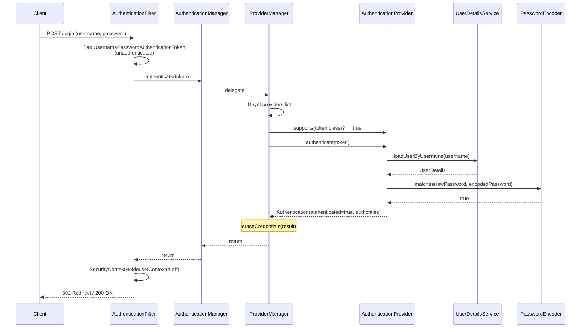
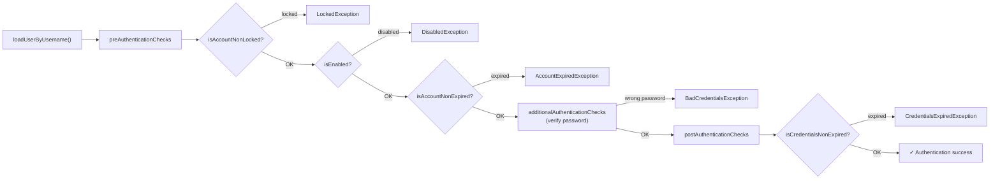
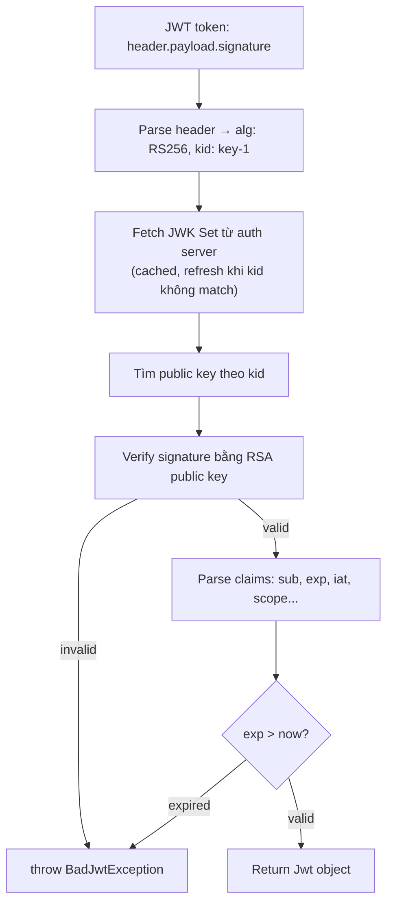
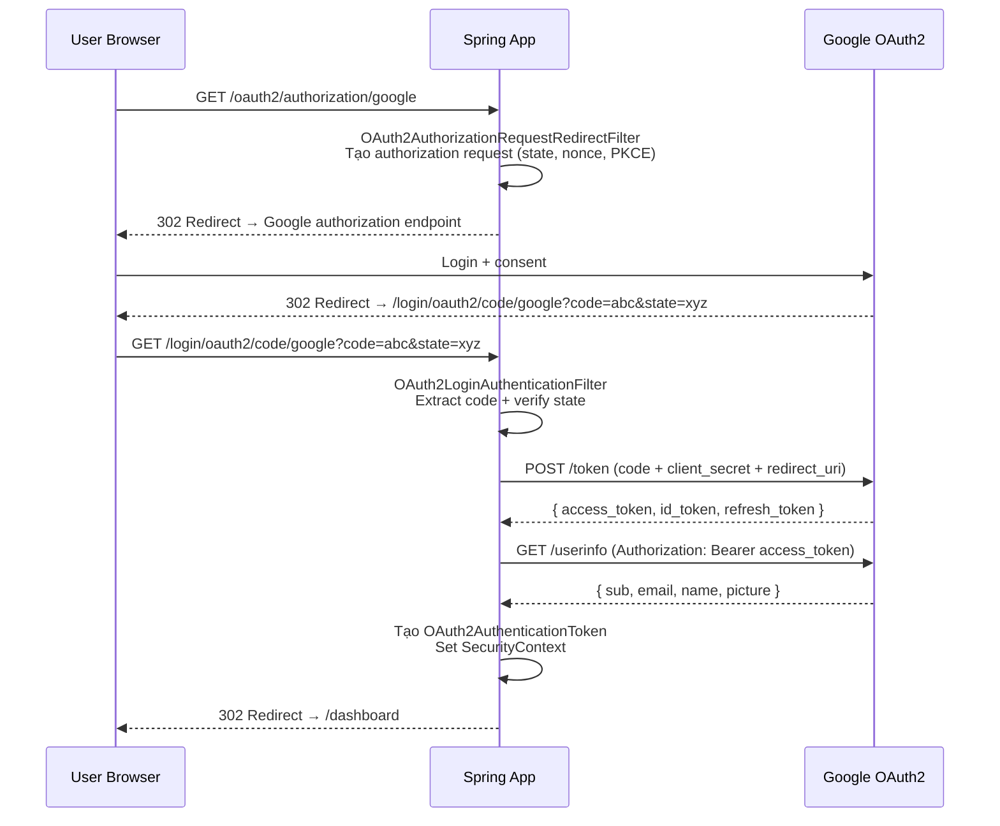

## Mục lục

- [Bypass authentication — filter sai thứ tự, ẩn danh thành thật](#1-bypass-authentication--filter-sai-thứ-tự-ẩn-danh-thành-thật)
- [Kiến trúc tổng quan — Filter Chain Architecture](#2-kiến-trúc-tổng-quan--filter-chain-architecture)
- [DelegatingFilterProxy & FilterChainProxy internals](#3-delegatingfilterproxy--filterchainproxy-internals)
- [HttpSecurity — builder pattern tạo SecurityFilterChain](#4-httpsecurity--builder-pattern-tạo-securityfilterchain)
- [15+ Security Filter mặc định — chức năng và thứ tự](#5-15-security-filter-mặc-định--chức-năng-và-thứ-tự)
- [Authentication Flow — ProviderManager internals](#6-authentication-flow--providermanager-internals)
- [DaoAuthenticationProvider — xác thực username/password chi tiết](#7-daoauthenticationprovider--xác-thực-usernamepassword-chi-tiết)
- [SecurityContext — ThreadLocal lifecycle & async propagation](#8-securitycontext--threadlocal-lifecycle--async-propagation)
- [Password Encoding — BCrypt, Argon2, DelegatingPasswordEncoder](#9-password-encoding--bcrypt-argon2-delegatingpasswordencoder)
- [Authorization — request-level và method-level internals](#10-authorization--request-level-và-method-level-internals)
- [ExceptionTranslationFilter — xử lý lỗi auth](#11-exceptiontranslationfilter--xử-lý-lỗi-auth)
- [OAuth2 Resource Server — JWT & Opaque Token](#12-oauth2-resource-server--jwt--opaque-token)
- [OAuth2 Login — Authorization Code Flow](#13-oauth2-login--authorization-code-flow)
- [CSRF Protection — internals](#14-csrf-protection--internals)
- [CORS — CorsFilter vs CorsConfigurationSource](#15-cors--corsfilter-vs-corsconfigurationsource)
- [Session Management — fixation, concurrent, stateless](#16-session-management--fixation-concurrent-stateless)
- [Remember-me — token-based & persistent](#17-remember-me--token-based--persistent)
- [Multi-chain — nhiều SecurityFilterChain với @Order](#18-multi-chain--nhiều-securityfilterchain-với-order)
- [Anti-patterns & Production Pitfalls](#19-anti-patterns--production-pitfalls)
- [Tóm tắt — Cheat sheet & 7 nguyên tắc](#20-tóm-tắt--cheat-sheet--7-nguyên-tắc)

---

## 1. Bypass authentication — filter sai thứ tự, ẩn danh thành thật

Spring Security bảo vệ ứng dụng bằng một **chain of filters** chặn mọi HTTP request trước khi tới controller: filter nào authenticate (set `SecurityContext`), filter nào authorize (kiểm tra quyền), filter nào xử lý exception — tất cả chạy theo **thứ tự cố định**. Khiến Spring Security khó không phải ở việc viết annotation (`@PreAuthorize`, DSL `authorizeHttpRequests`) — mà ở việc nắm chính xác **filter nào chạy trước/khi nào**, vì thứ tự đó quyết định request được chấp nhận hay bị lỗ hổng. Hầu hết lỗ hổng bypass authentication trong thực tế không phải do framework sai, mà do dev thêm filter custom mà không hiểu ai set `SecurityContext` trước/lúc nào, dẫn tới anonymous token "lén" được chấp nhận như user thật.

Team thêm JWT filter custom vào Spring Security:

```java
@Bean
SecurityFilterChain filterChain(HttpSecurity http) throws Exception {
    http
        .authorizeHttpRequests(auth -> auth
            .requestMatchers("/api/**").authenticated()
        )
        .addFilterBefore(new JwtFilter(), UsernamePasswordAuthenticationFilter.class);
    return http.build();
}
```

Test trên dev: hoạt động. Pentester phát hiện: request tới `/api/admin` với **header `Authorization` rỗng** → bypass JWT filter → trả về 200 với data admin.

Nguyên nhân: `JwtFilter` bỏ qua request khi header rỗng (không set `SecurityContext`) → filter tiếp theo là `AnonymousAuthenticationFilter` **tự động set** `AnonymousAuthenticationToken` → `authorizeHttpRequests` thấy "authenticated" (anonymous cũng có `Authentication` object) → cho qua.

Fix: cấu hình rõ ràng `.anonymous(AbstractHttpConfigurer::disable)` hoặc check `isAuthenticated() && !isAnonymous()`.

Bug này không phải do Spring Security sai — mà do dev **không hiểu filter chain flow**. Doc này mổ xẻ từng lớp, từ servlet container đến SpEL authorization.

> [!IMPORTANT]
> Spring Security hoạt động bằng **chain of filters**. Hiểu thứ tự filter, flow authentication, và cách `SecurityContext` được populate là nền tảng để tránh lỗ hổng bảo mật. Mọi annotation (`@PreAuthorize`, `@Secured`) và config DSL (`authorizeHttpRequests`) cuối cùng đều chạy qua filter chain.

Phần còn lại của doc sẽ đi qua: kiến trúc filter chain (§2) → `DelegatingFilterProxy` & `FilterChainProxy` (§3) → `HttpSecurity` builder (§4) → 15+ filter mặc định (§5) → authentication flow `ProviderManager` (§6) → `DaoAuthenticationProvider` (§7) → `SecurityContext` ThreadLocal (§8) → password encoding (§9) → authorization request & method level (§10) → `ExceptionTranslationFilter` (§11) → OAuth2 resource server (§12) → OAuth2 login (§13) → CSRF (§14) → CORS (§15) → session management (§16) → remember-me (§17) → multi-chain `@Order` (§18) → anti-patterns (§19) → cheat sheet (§20).

---

## 2. Kiến trúc tổng quan — Filter Chain Architecture

```
HTTP Request
     │
     ▼
┌──────────────────────────────────────────────────────────────┐
│                    Servlet Container (Tomcat)                │
│                                                              │
│  Servlet Filter Chain:                                       │
│  [CharacterEncodingFilter]                                   │
│  [HiddenHttpMethodFilter]                                    │
│  [DelegatingFilterProxy] ──────────────────────────┐         │
│  [...]                                             │         │
│                                                    ▼         │
│  ┌─────────────────────────────────────────────────────────┐ │
│  │FilterChainProxy(Spring Bean:"springSecurityFilterChain")│ │
│  │                                                         │ │
│  │  SecurityFilterChain #0: /api/**                        │ │
│  │    → [SecurityContextHolderFilter]                      │ │
│  │    → [CsrfFilter]                                       │ │
│  │    → [BearerTokenAuthenticationFilter]                  │ │
│  │    → [AuthorizationFilter]                              │ │
│  │                                                         │ │
│  │  SecurityFilterChain #1: /**                            │ │
│  │    → [SecurityContextHolderFilter]                      │ │
│  │    → [CsrfFilter]                                       │ │
│  │    → [UsernamePasswordAuthenticationFilter]             │ │
│  │    → [AnonymousAuthenticationFilter]                    │ │
│  │    → [ExceptionTranslationFilter]                       │ │
│  │    → [AuthorizationFilter]                              │ │
│  └─────────────────────────────────────────────────────────┘ │
│                                                              │
│                    DispatcherServlet                         │
│                    └── Controller                            │
└──────────────────────────────────────────────────────────────┘
```

`FilterChainProxy` giữ **danh sách** `SecurityFilterChain`. Mỗi chain có **request matcher** + **danh sách filter riêng**. `FilterChainProxy` chọn chain **đầu tiên** match request → chạy filter chain đó → request không đi qua chain khác.

---

## 3. DelegatingFilterProxy & FilterChainProxy internals

### 3.1. DelegatingFilterProxy — cầu nối Servlet ↔ Spring

Servlet container (Tomcat) không biết Spring Bean. `DelegatingFilterProxy` là **javax.servlet.Filter** đăng ký với Tomcat, lazy-lookup Spring Bean và delegate:

```java
// Rút gọn từ DelegatingFilterProxy
public class DelegatingFilterProxy extends GenericFilterBean {
    private String targetBeanName;       // = "springSecurityFilterChain"
    private volatile Filter delegate;    // = FilterChainProxy instance

    @Override
    public void doFilter(ServletRequest request, ServletResponse response, FilterChain chain) {
        Filter delegateToUse = this.delegate;
        if (delegateToUse == null) {
            // Lazy init: lấy bean từ Spring ApplicationContext
            WebApplicationContext wac = findWebApplicationContext();
            delegateToUse = wac.getBean(targetBeanName, Filter.class);
            this.delegate = delegateToUse;
        }
        // Delegate hoàn toàn cho Spring Bean
        delegateToUse.doFilter(request, response, chain);
    }
}
```

### 3.2. FilterChainProxy — chọn chain và chạy VirtualFilterChain

```java
// Rút gọn từ FilterChainProxy
public class FilterChainProxy extends GenericFilterBean {
    private List<SecurityFilterChain> filterChains;

    @Override
    public void doFilter(ServletRequest request, ServletResponse response, FilterChain chain) {
        // 1) Fire SecurityContext vào request attribute (cho logging)
        HttpServletRequest httpRequest = (HttpServletRequest) request;

        // 2) Chọn SecurityFilterChain phù hợp
        List<Filter> filters = getFilters(httpRequest);

        if (filters == null || filters.isEmpty()) {
            // Không có chain match → tiếp tục servlet filter chain (bỏ qua security)
            chain.doFilter(request, response);
            return;
        }

        // 3) Tạo VirtualFilterChain — chạy security filters rồi quay lại servlet chain
        VirtualFilterChain virtualChain = new VirtualFilterChain(httpRequest, chain, filters);
        virtualChain.doFilter(request, response);
    }

    private List<Filter> getFilters(HttpServletRequest request) {
        // Duyệt từng SecurityFilterChain — trả về chain ĐẦU TIÊN match
        for (SecurityFilterChain chain : this.filterChains) {
            if (chain.matches(request)) {   // RequestMatcher.matches()
                return chain.getFilters();
            }
        }
        return null;
    }
}
```

### 3.3. VirtualFilterChain — engine chạy filter

```java
// Rút gọn từ FilterChainProxy.VirtualFilterChain
private static final class VirtualFilterChain implements FilterChain {
    private final FilterChain originalChain;      // servlet filter chain gốc
    private final List<Filter> additionalFilters; // security filters
    private int currentPosition = 0;

    @Override
    public void doFilter(ServletRequest request, ServletResponse response) {
        if (this.currentPosition == this.additionalFilters.size()) {
            // Hết security filter → quay lại servlet chain → DispatcherServlet
            this.originalChain.doFilter(request, response);
            return;
        }
        this.currentPosition++;
        Filter nextFilter = this.additionalFilters.get(this.currentPosition - 1);
        nextFilter.doFilter(request, response, this);
        // ↑ truyền "this" (VirtualFilterChain) để filter gọi chain.doFilter() tiếp
    }
}
```

Cơ chế giống `ReflectiveMethodInvocation` trong AOP — index-based, mỗi filter gọi `chain.doFilter()` → index tăng → filter tiếp theo. Nếu filter **không gọi** `chain.doFilter()`, request bị **dừng** tại filter đó (ví dụ: trả 401 ngay).

---

## 4. HttpSecurity — builder pattern tạo SecurityFilterChain

### 4.1. DSL → SecurityFilterChain

```java
@Bean
SecurityFilterChain filterChain(HttpSecurity http) throws Exception {
    http
        .csrf(Customizer.withDefaults())
        .authorizeHttpRequests(auth -> auth
            .requestMatchers("/api/**").authenticated()
        )
        .httpBasic(Customizer.withDefaults());
    return http.build();  // ← tạo DefaultSecurityFilterChain
}
```

### 4.2. SecurityConfigurer — mỗi DSL method đăng ký 1 configurer

Mỗi method như `.csrf()`, `.httpBasic()`, `.authorizeHttpRequests()` thực ra đăng ký một `SecurityConfigurer`:

```java
// HttpSecurity (rút gọn)
public HttpSecurity csrf(Customizer<CsrfConfigurer<HttpSecurity>> customizer) {
    CsrfConfigurer<HttpSecurity> configurer = getOrApply(new CsrfConfigurer<>(context));
    customizer.customize(configurer);   // user's lambda chạy ở đây
    return this;
}

public HttpSecurity httpBasic(Customizer<HttpBasicConfigurer<HttpSecurity>> customizer) {
    HttpBasicConfigurer<HttpSecurity> configurer = getOrApply(new HttpBasicConfigurer<>());
    customizer.customize(configurer);
    return this;
}
```

### 4.3. http.build() — assemble filter chain

```java
// HttpSecurity.build() → performBuild()
protected DefaultSecurityFilterChain performBuild() {
    // 1) Sắp xếp configurer theo thứ tự
    this.configurers.sort(/* order */);

    // 2) Gọi init() cho mỗi configurer (chuẩn bị, tạo shared objects)
    for (SecurityConfigurer<?, ?> configurer : this.configurers) {
        configurer.init(this);
    }

    // 3) Gọi configure() cho mỗi configurer (thêm filter vào HttpSecurity)
    for (SecurityConfigurer<?, ?> configurer : this.configurers) {
        configurer.configure(this);
        // Ví dụ: CsrfConfigurer.configure() → http.addFilter(new CsrfFilter(...))
        // HttpBasicConfigurer.configure() → http.addFilter(new BasicAuthenticationFilter(...))
    }

    // 4) Sắp xếp filter theo FilterOrderRegistration (thứ tự chuẩn)
    this.filters.sort(FilterOrderRegistration.COMPARATOR);

    // 5) Tạo DefaultSecurityFilterChain(requestMatcher, filters)
    return new DefaultSecurityFilterChain(requestMatcher, this.filters);
}
```

> [!NOTE]
> Mỗi `SecurityConfigurer` chịu trách nhiệm tạo và đăng ký filter tương ứng. `CsrfConfigurer` → `CsrfFilter`. `HttpBasicConfigurer` → `BasicAuthenticationFilter`. `AuthorizeHttpRequestsConfigurer` → `AuthorizationFilter`. Hiểu mapping này giúp debug: nếu filter không xuất hiện → configurer tương ứng chưa được gọi.

---

## 5. 15+ Security Filter mặc định — chức năng và thứ tự

Thứ tự filter trong chain mặc định (Spring Security 6.x):

| # | Filter | Chức năng | Configurer |
|---|--------|----------|-----------|
| 1 | `DisableEncodeUrlFilter` | Chặn session ID trong URL (prevent session fixation via URL) | Tự động |
| 2 | `WebAsyncManagerIntegrationFilter` | SecurityContext cho async Servlet request | Tự động |
| 3 | `SecurityContextHolderFilter` | Load/save SecurityContext từ `SecurityContextRepository` | `.securityContext()` |
| 4 | `HeaderWriterFilter` | Set security headers (X-Frame-Options, X-Content-Type-Options, CSP...) | `.headers()` |
| 5 | `CorsFilter` | CORS preflight handling | `.cors()` |
| 6 | `CsrfFilter` | CSRF token validation | `.csrf()` |
| 7 | `LogoutFilter` | Xử lý logout URL, invalidate session, clear context | `.logout()` |
| 8 | `UsernamePasswordAuthenticationFilter` | Form login (`POST /login`) | `.formLogin()` |
| 9 | `BasicAuthenticationFilter` | HTTP Basic auth (header `Authorization: Basic ...`) | `.httpBasic()` |
| 10 | `BearerTokenAuthenticationFilter` | OAuth2 JWT/Opaque token (header `Authorization: Bearer ...`) | `.oauth2ResourceServer()` |
| 11 | `RequestCacheAwareFilter` | Redirect sau login về URL ban đầu (saved request) | `.requestCache()` |
| 12 | `SecurityContextHolderAwareRequestFilter` | Wrap request (`isUserInRole()`, `getRemoteUser()`) | Tự động |
| 13 | `AnonymousAuthenticationFilter` | Set `AnonymousAuthenticationToken` nếu chưa authenticated | `.anonymous()` |
| 14 | `ExceptionTranslationFilter` | Catch `AuthenticationException`/`AccessDeniedException` → redirect/401/403 | Tự động |
| 15 | `AuthorizationFilter` | Check quyền truy cập (thay thế `FilterSecurityInterceptor` từ 6.x) | `.authorizeHttpRequests()` |

### 5.1. FilterOrderRegistration — ai quyết định thứ tự?

```java
// FilterOrderRegistration (Spring Security internal)
// Mỗi filter class được gán 1 order number cố định:
put(DisableEncodeUrlFilter.class, 100);
put(SecurityContextHolderFilter.class, 300);
put(CsrfFilter.class, 600);
put(LogoutFilter.class, 700);
put(UsernamePasswordAuthenticationFilter.class, 1900);
put(BasicAuthenticationFilter.class, 2100);
put(BearerTokenAuthenticationFilter.class, 2200);
put(AnonymousAuthenticationFilter.class, 3100);
put(ExceptionTranslationFilter.class, 3300);
put(AuthorizationFilter.class, 3400);
```

Khi bạn gọi `addFilterBefore(myFilter, UsernamePasswordAuthenticationFilter.class)`, Spring gán order = 1900 - 1 = 1899 cho `myFilter` → nó nằm **trước** `UsernamePasswordAuthenticationFilter` trong chain.

> [!TIP]
> Debug filter chain: bật `logging.level.org.springframework.security=TRACE`. Log sẽ in **từng filter** chạy qua và kết quả. Hoặc: `@Bean SecurityFilterChain` method — set breakpoint ở `http.build()` và inspect `this.filters`.

---

## 6. Authentication Flow — ProviderManager internals

### 6.1. Flow tổng quan



### 6.2. ProviderManager — chain of providers + parent

```java
// Rút gọn từ ProviderManager
public class ProviderManager implements AuthenticationManager {
    private List<AuthenticationProvider> providers;
    private AuthenticationManager parent;         // fallback
    private boolean eraseCredentialsAfterAuthentication = true;

    @Override
    public Authentication authenticate(Authentication authentication) throws AuthenticationException {
        Class<? extends Authentication> toTest = authentication.getClass();
        AuthenticationException lastException = null;

        // 1) Duyệt từng provider
        for (AuthenticationProvider provider : getProviders()) {
            if (!provider.supports(toTest)) {
                continue;   // provider không hỗ trợ token type này → skip
            }
            try {
                Authentication result = provider.authenticate(authentication);
                if (result != null) {
                    // 2) Thành công → copy details, erase credentials
                    copyDetails(authentication, result);
                    if (eraseCredentialsAfterAuthentication) {
                        ((CredentialsContainer) result).eraseCredentials();
                        // ↑ xoá password khỏi Authentication object (security)
                    }
                    // 3) Publish AuthenticationSuccessEvent
                    eventPublisher.publishAuthenticationSuccess(result);
                    return result;
                }
            } catch (AccountStatusException | InternalAuthenticationServiceException e) {
                // Account locked/disabled/expired → throw ngay, KHÔNG thử provider khác
                throw e;
            } catch (AuthenticationException e) {
                lastException = e;
                // Thất bại → thử provider tiếp theo
            }
        }

        // 4) Không provider nào thành công → delegate lên parent (nếu có)
        if (parent != null) {
            try {
                return parent.authenticate(authentication);
            } catch (AuthenticationException e) {
                lastException = e;
            }
        }

        // 5) Tất cả thất bại → throw
        throw lastException != null ? lastException
            : new ProviderNotFoundException("No AuthenticationProvider for " + toTest);
    }
}
```

### 6.3. Parent chain — ProviderManager hierarchy

```
ProviderManager (API endpoints)
├── JwtAuthenticationProvider (Bearer token)
└── parent: ProviderManager (global)
         ├── DaoAuthenticationProvider (username/password)
         └── LdapAuthenticationProvider (LDAP)
```

Khi API chain không có provider cho username/password → delegate lên parent → `DaoAuthenticationProvider` xử lý. Pattern này cho phép **share** provider giữa nhiều `SecurityFilterChain`.

### 6.4. eraseCredentials — tại sao xoá password?

Sau authenticate thành công, `ProviderManager` gọi `result.eraseCredentials()` → set `credentials = null` trong `Authentication` object. Lý do: `Authentication` được lưu trong `SecurityContext` (session/ThreadLocal) → nếu giữ password → memory dump, heap dump, log leak → lộ password. Xoá ngay sau verify = defense in depth.

---

## 7. DaoAuthenticationProvider — xác thực username/password chi tiết

`DaoAuthenticationProvider` là provider phổ biến nhất — xác thực username/password từ database:

### 7.1. authenticate() internals

```java
// Rút gọn từ DaoAuthenticationProvider (extends AbstractUserDetailsAuthenticationProvider)
public Authentication authenticate(Authentication authentication) {
    String username = authentication.getName();

    // 1) Load user từ cache hoặc UserDetailsService
    boolean cacheWasUsed = true;
    UserDetails user = this.userCache.getUserFromCache(username);
    if (user == null) {
        cacheWasUsed = false;
        user = retrieveUser(username, authentication);
        // → this.getUserDetailsService().loadUserByUsername(username)
    }

    // 2) Pre-authentication checks (TRƯỚC verify password)
    preAuthenticationChecks.check(user);
    // → user.isAccountNonLocked()?   → throw LockedException
    // → user.isEnabled()?            → throw DisabledException
    // → user.isAccountNonExpired()?  → throw AccountExpiredException

    // 3) Verify password
    additionalAuthenticationChecks(user, authentication);
    // → passwordEncoder.matches(rawPassword, user.getPassword())
    // → throw BadCredentialsException nếu không match

    // 4) Post-authentication checks (SAU verify password)
    postAuthenticationChecks.check(user);
    // → user.isCredentialsNonExpired()?  → throw CredentialsExpiredException

    // 5) Cache user nếu cần
    if (!cacheWasUsed) {
        this.userCache.putUserInCache(user);
    }

    // 6) Tạo Authentication result (authenticated=true)
    return createSuccessAuthentication(user.getUsername(), authentication, user);
}
```

### 7.2. Pre/Post authentication checks timeline



### 7.3. UserCache — tối ưu cho UserDetailsService chậm

```java
// Nếu UserDetailsService gọi DB mỗi request (expensive):
@Bean
DaoAuthenticationProvider authProvider(UserDetailsService uds, PasswordEncoder pe) {
    DaoAuthenticationProvider provider = new DaoAuthenticationProvider();
    provider.setUserDetailsService(uds);
    provider.setPasswordEncoder(pe);
    provider.setUserCache(new SpringCacheBasedUserCache(
        cacheManager.getCache("users")   // cache UserDetails
    ));
    return provider;
}
```

> [!WARNING]
> Khi dùng UserCache, nếu user bị disable/lock trong DB → cache vẫn trả user cũ (enabled) → **bypass disable**. Phải clear cache khi thay đổi user status: `userCache.removeUserFromCache(username)`.

---

## 8. SecurityContext — ThreadLocal lifecycle & async propagation

### 8.1. SecurityContextHolder internals

```java
// SecurityContextHolder — facade cho strategy pattern
public class SecurityContextHolder {
    private static SecurityContextHolderStrategy strategy;
    // default: ThreadLocalSecurityContextHolderStrategy

    public static SecurityContext getContext() {
        return strategy.getContext();
    }
}

// ThreadLocalSecurityContextHolderStrategy
final class ThreadLocalSecurityContextHolderStrategy {
    private static final ThreadLocal<Supplier<SecurityContext>> contextHolder = new ThreadLocal<>();

    public SecurityContext getContext() {
        Supplier<SecurityContext> supplier = contextHolder.get();
        if (supplier == null) {
            supplier = SecurityContext::createEmpty;
            contextHolder.set(supplier);
        }
        return supplier.get();  // lazy evaluation
    }
}
```

### 8.2. Lifecycle trong 1 HTTP request

```mermaid
sequenceDiagram
    participant T as Tomcat Thread
    participant SCHF as SecurityContextHolderFilter
    participant SCR as SecurityContextRepository
    participant TL as ThreadLocal
    participant AF as Auth Filters
    participant C as Controller
    participant AZ as AuthorizationFilter

    T->>SCHF: doFilter(request)
    SCHF->>SCR: loadDeferredContext(request)
    Note over SCR: Session-based: HttpSession.getAttribute("SPRING_SECURITY_CONTEXT")<br/>Stateless: return empty
    SCR-->>SCHF: Supplier&lt;SecurityContext&gt; (lazy!)
    SCHF->>TL: setContext(supplier)

    T->>AF: Authentication filters chạy
    AF->>TL: getContext() → supplier.get() → trigger load
    AF->>TL: setAuthentication(auth)

    T->>AZ: AuthorizationFilter
    AZ->>TL: getContext().getAuthentication() → check authorities

    T->>C: Controller
    C->>TL: SecurityContextHolder.getContext() → user info

    Note over SCHF: Response complete
    SCHF->>SCR: saveContext(context, request, response)
    Note over SCR: Session-based: save to HttpSession<br/>Stateless: no-op
    SCHF->>TL: clearContext() ⚠️ CRITICAL — prevent thread pool leak
```

### 8.3. SecurityContextRepository — lưu context ở đâu?

| Implementation | Lưu trữ | Khi nào |
|---------------|---------|---------|
| `HttpSessionSecurityContextRepository` | HttpSession (`SPRING_SECURITY_CONTEXT` attribute) | Form login, session-based app (mặc định) |
| `RequestAttributeSecurityContextRepository` | Request attribute | Stateless (JWT), per-request only |
| `DelegatingSecurityContextRepository` | Delegate cho nhiều repo (chain) | Spring Security 6+ default: Session + RequestAttribute |
| `NullSecurityContextRepository` | Không lưu | Hoàn toàn stateless |

### 8.4. Async propagation — vấn đề và giải pháp

```java
@Async
public CompletableFuture<Report> generateReport() {
    // ❌ SecurityContextHolder.getContext().getAuthentication() → NULL!
    // @Async chạy trên thread pool thread khác → ThreadLocal rỗng
}
```

**Giải pháp 1 (khuyên dùng): DelegatingSecurityContextExecutor**

```java
@Bean
TaskExecutor taskExecutor() {
    ThreadPoolTaskExecutor executor = new ThreadPoolTaskExecutor();
    executor.setCorePoolSize(10);
    executor.initialize();
    // Wrap với DelegatingSecurityContext → auto copy SecurityContext sang child thread
    return new DelegatingSecurityContextAsyncTaskExecutor(executor);
}
```

**Giải pháp 2: MODE_INHERITABLETHREADLOCAL**

```java
// Application startup
SecurityContextHolder.setStrategyName(SecurityContextHolder.MODE_INHERITABLETHREADLOCAL);
// ⚠️ Chỉ hoạt động khi child thread tạo MỚI
// Thread pool reuse thread → InheritableThreadLocal KHÔNG copy lại
// → KHÔNG an toàn với @Async + thread pool!
```

**Giải pháp 3: Manual propagation**

```java
SecurityContext ctx = SecurityContextHolder.getContext();
executor.execute(() -> {
    SecurityContextHolder.setContext(ctx);
    try {
        doWork();
    } finally {
        SecurityContextHolder.clearContext();   // ⚠️ BẮT BUỘC clear
    }
});
```

> [!WARNING]
> **Luôn** clear SecurityContext trong `finally` khi set thủ công trên thread pool. Thread được reuse → SecurityContext cũ "rò rỉ" sang request khác → **privilege escalation** (user A thấy data của user B).

---

## 9. Password Encoding — BCrypt, Argon2, DelegatingPasswordEncoder

### 9.1. Tại sao hash, không encrypt?

| | Hash (BCrypt/Argon2) | Encrypt (AES) |
|--|---------------------|---------------|
| Chiều | **Một chiều** — không reverse | Hai chiều — có key thì giải được |
| DB bị lộ | Attacker có hash, brute-force rất chậm | Attacker có key → ra tất cả password |
| Dùng cho | Password storage | Data at rest/in transit |

### 9.2. BCrypt internals

```
$2a$12$N9qo8uLOickgx2ZMRZoMyeIjZAgcfl7p92ldGxad68LJZdL17lhWy
 │  │  └─────────────────── 22 char salt + 31 char hash (Base64)
 │  └───── cost factor (2^12 = 4096 rounds)
 └──── version (2a, 2b, 2y)
```

- **Salt**: random 128-bit, **mỗi password khác nhau** → hai user cùng password → hash khác nhau → rainbow table vô dụng
- **Cost factor**: mỗi +1 = **gấp đôi** thời gian hash. `10` = ~100ms, `12` = ~400ms, `14` = ~1.6s
- **Verify**: extract salt từ hash string → hash input password với cùng salt → compare

```java
// BCryptPasswordEncoder.matches() (simplified):
public boolean matches(CharSequence rawPassword, String encodedPassword) {
    String salt = encodedPassword.substring(0, 29);   // extract salt
    String hashed = BCrypt.hashpw(rawPassword.toString(), salt);  // hash với cùng salt
    return MessageDigest.isEqual(                      // constant-time compare (anti timing attack)
        encodedPassword.getBytes(), hashed.getBytes());
}
```

### 9.3. DelegatingPasswordEncoder — migration-friendly

```java
@Bean
PasswordEncoder passwordEncoder() {
    return PasswordEncoderFactories.createDelegatingPasswordEncoder();
}
```

Stored format: `{algorithm}hash`

```
{bcrypt}$2a$10$N9qo8uLOickgx...     ← BCrypt
{argon2}$argon2id$v=19$m=4096...     ← Argon2
{scrypt}$e0801$...                    ← SCrypt
{noop}plaintext                       ← không hash (CHỈ dùng dev/test!)
{sha256}97cde...                     ← SHA-256 (legacy, yếu)
```

```java
// DelegatingPasswordEncoder.matches() (simplified):
public boolean matches(CharSequence rawPassword, String prefixEncodedPassword) {
    String id = extractId(prefixEncodedPassword);        // "bcrypt"
    PasswordEncoder delegate = idToPasswordEncoder.get(id); // BCryptPasswordEncoder
    String encodedPassword = extractEncodedPassword(prefixEncodedPassword); // "$2a$10$..."
    return delegate.matches(rawPassword, encodedPassword);
}
```

Ưu điểm: migrate thuật toán **không cần re-hash** tất cả password cũ. Thêm encoder mới → password mới dùng thuật toán mới → password cũ vẫn verify được nhờ prefix.

### 9.4. So sánh thuật toán

| Thuật toán | Chống | Ưu điểm | Nhược |
|-----------|-------|---------|-------|
| **BCrypt** | GPU brute-force (CPU-intensive) | Battle-tested, widely supported | Chỉ CPU-hard, memory cố định |
| **Argon2id** | GPU + ASIC (memory-intensive) | Winner of PHC (2015), tunable memory | Mới hơn, ít adoption |
| **SCrypt** | GPU + ASIC (memory-intensive) | Memory-hard | Complex tuning |
| MD5/SHA | ❌ Không chống gì | — | ❌ Quá nhanh → brute-force dễ |

> [!IMPORTANT]
> **Không bao giờ** dùng MD5/SHA cho password. 1 GPU hiện đại hash ~10 tỷ MD5/giây → toàn bộ password 8 ký tự bị crack trong vài giờ. BCrypt cost=12 → ~3 hash/giây/GPU → tổng thời gian: hàng nghìn năm.

---

## 10. Authorization — request-level và method-level internals

### 10.1. Request-level: AuthorizationFilter

```java
// Rút gọn từ AuthorizationFilter (thay thế FilterSecurityInterceptor từ Spring Security 6)
public class AuthorizationFilter extends GenericFilterBean {
    private final AuthorizationManager<HttpServletRequest> authorizationManager;

    @Override
    public void doFilter(ServletRequest request, ServletResponse response, FilterChain chain) {
        HttpServletRequest httpRequest = (HttpServletRequest) request;

        // Lấy Authentication từ SecurityContext
        Supplier<Authentication> authentication =
            SecurityContextHolder.getDeferredContext().getDeferredAuthentication();

        // Gọi AuthorizationManager kiểm tra quyền
        AuthorizationDecision decision = this.authorizationManager.check(authentication, httpRequest);

        if (decision != null && !decision.isGranted()) {
            throw new AccessDeniedException("Access Denied");
            // → ExceptionTranslationFilter bắt → 403 hoặc redirect login
        }

        chain.doFilter(request, response);
    }
}
```

### 10.2. RequestMatcherDelegatingAuthorizationManager

```java
// DSL config:
http.authorizeHttpRequests(auth -> auth
    .requestMatchers("/api/admin/**").hasRole("ADMIN")
    .requestMatchers("/api/user/**").hasAnyRole("USER", "ADMIN")
    .requestMatchers("/public/**").permitAll()
    .anyRequest().authenticated()
);

// Sinh ra RequestMatcherDelegatingAuthorizationManager:
// [
//   AntPathRequestMatcher("/api/admin/**") → AuthorityAuthorizationManager("ROLE_ADMIN"),
//   AntPathRequestMatcher("/api/user/**")  → AuthorityAuthorizationManager("ROLE_USER", "ROLE_ADMIN"),
//   AntPathRequestMatcher("/public/**")    → (req, auth) → GRANTED,
//   AnyRequestMatcher                      → AuthenticatedAuthorizationManager
// ]
```

Duyệt tuần tự — **matcher đầu tiên** match → dùng `AuthorizationManager` tương ứng → dừng. **Thứ tự khai báo quan trọng**: specific trước, general sau.

### 10.3. Method-level Security — @PreAuthorize internals

```java
@EnableMethodSecurity  // Spring Security 6+
```

`@EnableMethodSecurity` đăng ký `AuthorizationManagerBeforeMethodInterceptor` — một AOP `MethodInterceptor` chạy **trước** method:

```java
// Rút gọn từ AuthorizationManagerBeforeMethodInterceptor
public class AuthorizationManagerBeforeMethodInterceptor implements MethodInterceptor {
    private final AuthorizationManager<MethodInvocation> authorizationManager;

    @Override
    public Object invoke(MethodInvocation invocation) throws Throwable {
        // 1) Lấy Authentication
        Supplier<Authentication> authentication = this::getAuthentication;

        // 2) Evaluate SpEL expression (từ @PreAuthorize)
        AuthorizationDecision decision =
            this.authorizationManager.check(authentication, invocation);

        if (decision != null && !decision.isGranted()) {
            throw new AccessDeniedException("Access Denied");
        }

        // 3) Authorized → proceed method
        return invocation.proceed();
    }
}
```

### 10.4. SpEL evaluation cho @PreAuthorize

```java
@PreAuthorize("#userId == authentication.principal.id or hasRole('ADMIN')")
public User getUser(Long userId) { ... }
```

Spring Security tạo `MethodSecurityExpressionRoot` làm SpEL root object:

```java
// MethodSecurityExpressionRoot cung cấp:
// - hasRole(), hasAuthority(), hasAnyRole(), hasAnyAuthority()
// - isAuthenticated(), isAnonymous(), isFullyAuthenticated()
// - authentication (property) → SecurityContext.getAuthentication()
// - principal → authentication.getPrincipal()
// - #paramName → method parameter (qua ParameterNameDiscoverer)
// - returnObject (cho @PostAuthorize)
// - filterObject (cho @PreFilter/@PostFilter)
```

Evaluation flow:
```
"#userId == authentication.principal.id or hasRole('ADMIN')"
      │                    │                        │
      ▼                    ▼                        ▼
  method param         root.getAuthentication()   root.hasRole("ADMIN")
  resolver               .getPrincipal()          → check authorities
                           .getId()               → contains "ROLE_ADMIN"?
```

### 10.5. @PreAuthorize vs @Secured vs @RolesAllowed

| Annotation | SpEL | Custom expression | Spring Security version |
|-----------|------|-------------------|----------------------|
| `@PreAuthorize` | ✅ | ✅ Full SpEL | 3.0+ (khuyên dùng) |
| `@PostAuthorize` | ✅ | ✅ Check sau method (access `returnObject`) | 3.0+ |
| `@Secured` | ❌ | ❌ Chỉ role name | Legacy |
| `@RolesAllowed` (JSR-250) | ❌ | ❌ Chỉ role name | JSR-250 |

> [!TIP]
> `@PreAuthorize` + SpEL là cách mạnh nhất và linh hoạt nhất. `@Secured` chỉ check role — nếu cần check nhiều hơn (field-level, parameter-based), phải dùng `@PreAuthorize`.

---

## 11. ExceptionTranslationFilter — xử lý lỗi auth

`ExceptionTranslationFilter` nằm **trước** `AuthorizationFilter` trong chain. Nó catch exception từ `AuthorizationFilter` (và các filter sau nó) rồi **translate** thành HTTP response phù hợp:

```java
// Rút gọn từ ExceptionTranslationFilter
public class ExceptionTranslationFilter extends GenericFilterBean {
    private AuthenticationEntryPoint authenticationEntryPoint;   // xử lý 401
    private AccessDeniedHandler accessDeniedHandler;             // xử lý 403

    @Override
    public void doFilter(ServletRequest req, ServletResponse res, FilterChain chain) {
        try {
            chain.doFilter(req, res);    // chạy filter tiếp (AuthorizationFilter, etc.)
        } catch (AuthenticationException ex) {
            // User chưa authenticated → redirect login hoặc trả 401
            sendStartAuthentication(request, response, chain, ex);
        } catch (AccessDeniedException ex) {
            Authentication auth = SecurityContextHolder.getContext().getAuthentication();
            if (isAnonymous(auth) || isRememberMe(auth)) {
                // Anonymous/RememberMe → coi như chưa authenticated → redirect login
                sendStartAuthentication(request, response, chain,
                    new InsufficientAuthenticationException("Full auth required"));
            } else {
                // User đã authenticated nhưng không đủ quyền → 403
                this.accessDeniedHandler.handle(request, response, ex);
            }
        }
    }

    private void sendStartAuthentication(HttpServletRequest request, ...) {
        // 1) Save current request (để redirect sau login)
        this.requestCache.saveRequest(request, response);
        // 2) Clear SecurityContext
        SecurityContextHolder.clearContext();
        // 3) Gọi AuthenticationEntryPoint
        this.authenticationEntryPoint.commence(request, response, reason);
    }
}
```

### 11.1. AuthenticationEntryPoint implementations

| EntryPoint | Response | Khi nào |
|-----------|----------|---------|
| `LoginUrlAuthenticationEntryPoint` | 302 Redirect → `/login` | Form login |
| `BasicAuthenticationEntryPoint` | 401 + `WWW-Authenticate: Basic` | HTTP Basic |
| `BearerTokenAuthenticationEntryPoint` | 401 + `WWW-Authenticate: Bearer` | OAuth2 Resource Server |
| `Http403ForbiddenEntryPoint` | 403 | API không có login page |
| `HttpStatusEntryPoint` | Custom HTTP status | REST API |

### 11.2. AccessDeniedHandler implementations

| Handler | Response | Khi nào |
|---------|----------|---------|
| `AccessDeniedHandlerImpl` | 403 + error page | Default |
| Custom lambda | JSON error response | REST API |

```java
http.exceptionHandling(ex -> ex
    .authenticationEntryPoint((req, res, authEx) -> {
        res.setStatus(401);
        res.getWriter().write("{\"error\": \"Unauthorized\"}");
    })
    .accessDeniedHandler((req, res, accessEx) -> {
        res.setStatus(403);
        res.getWriter().write("{\"error\": \"Forbidden\"}");
    })
);
```

---

## 12. OAuth2 Resource Server — JWT & Opaque Token

### 12.1. JWT Resource Server config

```java
@Bean
SecurityFilterChain filterChain(HttpSecurity http) throws Exception {
    http
        .oauth2ResourceServer(oauth2 -> oauth2
            .jwt(jwt -> jwt
                .decoder(jwtDecoder())                      // verify signature
                .jwtAuthenticationConverter(jwtConverter())  // map claims → authorities
            )
        );
    return http.build();
}

@Bean
JwtDecoder jwtDecoder() {
    // Verify JWT bằng public key từ Authorization Server
    return NimbusJwtDecoder.withJwkSetUri("https://auth-server/.well-known/jwks.json").build();
}
```

### 12.2. BearerTokenAuthenticationFilter internals

```java
// Rút gọn từ BearerTokenAuthenticationFilter
public class BearerTokenAuthenticationFilter extends OncePerRequestFilter {

    @Override
    protected void doFilterInternal(HttpServletRequest request, ...) {
        // 1) Extract token từ header
        String token = this.bearerTokenResolver.resolve(request);
        // → parse "Authorization: Bearer eyJhbG..." → "eyJhbG..."

        if (token == null) {
            // Không có token → tiếp tục chain (AnonymousAuthenticationFilter xử lý)
            chain.doFilter(request, response);
            return;
        }

        // 2) Tạo BearerTokenAuthenticationToken
        BearerTokenAuthenticationToken authRequest = new BearerTokenAuthenticationToken(token);

        // 3) Authenticate qua AuthenticationManager
        try {
            Authentication result = this.authenticationManager.authenticate(authRequest);
            // → JwtAuthenticationProvider.authenticate()
            //   → JwtDecoder.decode(token) → verify signature + expiry
            //   → JwtAuthenticationConverter.convert(jwt) → map claims → authorities
            //   → return JwtAuthenticationToken(principal, authorities)

            // 4) Set SecurityContext
            SecurityContextHolder.getContext().setAuthentication(result);

            chain.doFilter(request, response);
        } catch (AuthenticationException e) {
            SecurityContextHolder.clearContext();
            // → BearerTokenAuthenticationEntryPoint.commence()
            // → 401 + WWW-Authenticate: Bearer error="invalid_token"
            this.authenticationEntryPoint.commence(request, response, e);
        }
    }
}
```

### 12.3. JwtDecoder — verify signature



### 12.4. Opaque Token — token introspection

Khác JWT (self-contained, verify local), opaque token cần **gọi Authorization Server** mỗi request để validate:

```java
http.oauth2ResourceServer(oauth2 -> oauth2
    .opaqueToken(opaque -> opaque
        .introspectionUri("https://auth-server/introspect")
        .introspectionClientCredentials("client-id", "client-secret")
    )
);
```

```
Resource Server → POST https://auth-server/introspect
                  token=abc123&token_type_hint=access_token
                ← { "active": true, "sub": "user1", "scope": "read write", "exp": 1234567890 }
```

| | JWT | Opaque Token |
|--|-----|-------------|
| Validate | Local (public key) | Remote (introspection endpoint) |
| Latency | Không thêm network call | +1 HTTP call mỗi request |
| Revoke | Khó (phải đợi expire hoặc blacklist) | Dễ (auth server kiểm tra real-time) |
| Size | Lớn (chứa claims) | Nhỏ (chỉ random string) |

---

## 13. OAuth2 Login — Authorization Code Flow

### 13.1. Config

```java
http.oauth2Login(oauth2 -> oauth2
    .loginPage("/login")
    .defaultSuccessUrl("/dashboard")
    .userInfoEndpoint(userInfo -> userInfo
        .userService(customOAuth2UserService())   // custom user mapping
    )
);
```

```yaml
# application.yml
spring:
  security:
    oauth2:
      client:
        registration:
          google:
            client-id: xxx
            client-secret: yyy
            scope: openid, profile, email
        provider:
          google:
            authorization-uri: https://accounts.google.com/o/oauth2/v2/auth
            token-uri: https://oauth2.googleapis.com/token
            user-info-uri: https://www.googleapis.com/oauth2/v3/userinfo
```

### 13.2. Authorization Code Flow



### 13.3. Hai filter chính

| Filter | Vai trò | URL |
|--------|---------|-----|
| `OAuth2AuthorizationRequestRedirectFilter` | Tạo authorization request, redirect user đến provider | `/oauth2/authorization/{registrationId}` |
| `OAuth2LoginAuthenticationFilter` | Nhận callback, exchange code → token, load user info | `/login/oauth2/code/{registrationId}` |

---

## 14. CSRF Protection — internals

### 14.1. CSRF attack scenario

Attacker tạo trang web chứa form ẩn submit tới API của bạn. User đã login (cookie session) → browser **tự gắn cookie** → request hợp lệ từ góc nhìn server.

### 14.2. CsrfFilter internals

```java
// Rút gọn từ CsrfFilter
public class CsrfFilter extends OncePerRequestFilter {
    private CsrfTokenRepository tokenRepository;  // lưu trữ CSRF token

    @Override
    protected void doFilterInternal(HttpServletRequest request, ...) {
        // 1) Load CSRF token
        CsrfToken csrfToken = this.tokenRepository.loadToken(request);
        boolean missingToken = (csrfToken == null);
        if (missingToken) {
            csrfToken = this.tokenRepository.generateToken(request);
            this.tokenRepository.saveToken(csrfToken, request, response);
        }

        // 2) Set token vào request attribute (để Thymeleaf/form access)
        request.setAttribute(CsrfToken.class.getName(), csrfToken);

        // 3) Skip check cho safe methods (GET, HEAD, OPTIONS, TRACE)
        if (!requireCsrfProtectionMatcher.matches(request)) {
            chain.doFilter(request, response);
            return;
        }

        // 4) Extract token từ request (header hoặc parameter)
        String actualToken = request.getHeader(csrfToken.getHeaderName());
        if (actualToken == null) {
            actualToken = request.getParameter(csrfToken.getParameterName());
        }

        // 5) Compare tokens
        if (!equalsConstantTime(csrfToken.getToken(), actualToken)) {
            // ⚠️ Constant-time comparison (anti timing attack)
            throw new InvalidCsrfTokenException(csrfToken, actualToken);
        }

        chain.doFilter(request, response);
    }
}
```

### 14.3. CsrfTokenRepository implementations

| Implementation | Lưu trữ | Khi nào |
|---------------|---------|---------|
| `HttpSessionCsrfTokenRepository` | HttpSession | Server-side rendered (Thymeleaf, JSP) — mặc định |
| `CookieCsrfTokenRepository` | Cookie `XSRF-TOKEN` | SPA (Angular, React) — JS đọc cookie, gửi header |

```java
// SPA config — cookie-based CSRF:
http.csrf(csrf -> csrf
    .csrfTokenRepository(CookieCsrfTokenRepository.withHttpOnlyFalse())
    // withHttpOnlyFalse() → JS có thể đọc cookie XSRF-TOKEN
    .csrfTokenRequestHandler(new CsrfTokenRequestAttributeHandler())
);
// Angular tự động đọc XSRF-TOKEN cookie → gửi header X-XSRF-TOKEN
```

### 14.4. Khi nào tắt CSRF?

| Tình huống | CSRF |
|-----------|------|
| API stateless (JWT, no cookie) | **Tắt** — không có session/cookie → CSRF không áp dụng |
| Server-side rendered (Thymeleaf, JSP) | **Bật** — form-based, cookie session |
| SPA + cookie session | **Bật** — dùng `CookieCsrfTokenRepository` |
| SPA + JWT (Bearer token, no cookie) | **Tắt** — attacker không thể forge Bearer header |

> [!WARNING]
> **Không** tắt CSRF chỉ vì "nó gây lỗi 403". Hiểu tại sao cần CSRF rồi mới quyết định tắt. Nếu dùng cookie-based authentication → **phải** bật CSRF.

---

## 15. CORS — CorsFilter vs CorsConfigurationSource

### 15.1. CORS preflight

Browser gửi **preflight** `OPTIONS` request trước cross-origin request thật:

```
OPTIONS /api/data HTTP/1.1
Origin: https://frontend.com
Access-Control-Request-Method: POST
Access-Control-Request-Headers: Content-Type, Authorization
```

Server phải trả:
```
Access-Control-Allow-Origin: https://frontend.com
Access-Control-Allow-Methods: GET, POST, PUT
Access-Control-Allow-Headers: Content-Type, Authorization
Access-Control-Max-Age: 3600
```

### 15.2. Spring Security CORS config

```java
// Cách 1: CorsConfigurationSource bean (khuyên dùng)
@Bean
CorsConfigurationSource corsConfigurationSource() {
    CorsConfiguration config = new CorsConfiguration();
    config.setAllowedOrigins(List.of("https://frontend.com"));
    config.setAllowedMethods(List.of("GET", "POST", "PUT", "DELETE"));
    config.setAllowedHeaders(List.of("Authorization", "Content-Type"));
    config.setAllowCredentials(true);
    config.setMaxAge(3600L);

    UrlBasedCorsConfigurationSource source = new UrlBasedCorsConfigurationSource();
    source.registerCorsConfiguration("/api/**", config);
    return source;
}

// HttpSecurity:
http.cors(Customizer.withDefaults());
// → tự động tìm CorsConfigurationSource bean
```

### 15.3. CORS + Spring Security: thứ tự quan trọng

`CorsFilter` **phải** chạy **trước** `CsrfFilter` và authentication filters. Lý do: preflight `OPTIONS` request **không** chứa cookie/CSRF token → nếu CsrfFilter chạy trước → reject preflight → browser không gửi request thật → CORS fail.

Spring Security tự đảm bảo thứ tự đúng khi dùng `.cors()` DSL. Nhưng nếu bạn đăng ký `CorsFilter` thủ công qua `@Bean FilterRegistrationBean`, cần set order thấp hơn security filter.

> [!NOTE]
> `http.cors(Customizer.withDefaults())` tìm bean `CorsConfigurationSource` trong context. Nếu không có → CORS không được xử lý. Nếu bạn dùng `@CrossOrigin` trên controller → đó là Spring MVC CORS (DispatcherServlet level), **không phải** Security filter level → preflight có thể bị block bởi Security filter trước khi đến controller.

---

## 16. Session Management — fixation, concurrent, stateless

### 16.1. Session Fixation Protection

Attacker gửi victim link kèm session ID → victim login → session ID đó có auth → attacker dùng cùng session ID → hijack session.

Spring Security mặc định: **changeSessionId** — sau login, tạo session ID mới, giữ nguyên session object:

```java
http.sessionManagement(sm -> sm
    .sessionFixation().changeSessionId()       // default (Servlet 3.1+)
    // .sessionFixation().migrateSession()      // tạo session mới, copy attributes
    // .sessionFixation().newSession()           // tạo session hoàn toàn mới (attributes mất)
    // .sessionFixation().none()                 // ❌ KHÔNG BẢO VỆ — đừng dùng
);
```

### 16.2. Concurrent Session Control

```java
http.sessionManagement(sm -> sm
    .maximumSessions(1)                         // 1 session per user
    .maxSessionsPreventsLogin(true)             // block login mới
    // .maxSessionsPreventsLogin(false)          // kick session cũ (mặc định)
    .expiredUrl("/login?expired")
);
```

Internals: `ConcurrentSessionControlAuthenticationStrategy` kiểm tra `SessionRegistry`:

```java
// SessionRegistry giữ: Map<principal, List<SessionInformation>>
// Login mới → check: user đã có bao nhiêu session?
//   > maximumSessions → maxSessionsPreventsLogin?
//     true:  throw SessionAuthenticationException (block login mới)
//     false: mark session cũ nhất là expired → SessionInformationExpiredStrategy xử lý
```

### 16.3. Stateless (JWT)

```java
http.sessionManagement(sm -> sm
    .sessionCreationPolicy(SessionCreationPolicy.STATELESS)
    // → Spring Security KHÔNG tạo/sử dụng HttpSession
    // → SecurityContextRepository = NullSecurityContextRepository
    // → Mỗi request phải tự authenticate (JWT header)
);
```

| Policy | Hành vi |
|--------|---------|
| `ALWAYS` | Luôn tạo session |
| `IF_REQUIRED` (mặc định) | Tạo session khi cần |
| `NEVER` | Không tạo, nhưng dùng nếu đã có |
| `STATELESS` | Không tạo, không dùng — hoàn toàn stateless |

---

## 17. Remember-me — token-based & persistent

### 17.1. Token-based (Simple Hash)

```java
http.rememberMe(rm -> rm
    .key("uniqueAndSecret")          // key để hash
    .tokenValiditySeconds(604800)    // 7 ngày
    .userDetailsService(userDetailsService)
);
```

Cookie value: `base64(username + ":" + expirationTime + ":" + md5(username + ":" + expirationTime + ":" + password + ":" + key))`

⚠️ Nhược điểm: nếu user đổi password → **tất cả** remember-me token bị invalidate (vì hash chứa password). Và nếu attacker có cookie → valid đến khi expire, không revoke được.

### 17.2. Persistent Token (an toàn hơn)

```java
http.rememberMe(rm -> rm
    .tokenRepository(persistentTokenRepository())  // lưu vào DB
);

@Bean
PersistentTokenRepository persistentTokenRepository() {
    JdbcTokenRepositoryImpl repo = new JdbcTokenRepositoryImpl();
    repo.setDataSource(dataSource);
    // Table: persistent_logins (username, series, token, last_used)
    return repo;
}
```

Mỗi lần dùng remember-me token → token mới được sinh ra (rotate). Nếu attacker dùng token cũ → Spring phát hiện token mismatch (same series, different token) → **xoá tất cả** token của user → force re-login.

---

## 18. Multi-chain — nhiều SecurityFilterChain với @Order

### 18.1. Config

```java
@Configuration
public class SecurityConfig {

    @Bean
    @Order(1)    // ưu tiên cao — check TRƯỚC
    SecurityFilterChain apiChain(HttpSecurity http) throws Exception {
        http
            .securityMatcher("/api/**")      // chỉ match /api/**
            .csrf(AbstractHttpConfigurer::disable)
            .sessionManagement(sm -> sm.sessionCreationPolicy(SessionCreationPolicy.STATELESS))
            .oauth2ResourceServer(oauth2 -> oauth2.jwt(Customizer.withDefaults()))
            .authorizeHttpRequests(auth -> auth.anyRequest().authenticated());
        return http.build();
    }

    @Bean
    @Order(2)    // ưu tiên thấp — check SAU
    SecurityFilterChain webChain(HttpSecurity http) throws Exception {
        http
            .securityMatcher("/**")          // match mọi thứ còn lại
            .formLogin(Customizer.withDefaults())
            .csrf(Customizer.withDefaults())
            .authorizeHttpRequests(auth -> auth
                .requestMatchers("/login", "/register").permitAll()
                .anyRequest().authenticated()
            );
        return http.build();
    }
}
```

### 18.2. FilterChainProxy chọn chain

```
Request: GET /api/users
  → Chain #1 (@Order 1): securityMatcher("/api/**") → MATCH ✓
  → Dùng chain #1 (JWT, stateless, no CSRF)

Request: GET /dashboard
  → Chain #1: securityMatcher("/api/**") → NO MATCH
  → Chain #2 (@Order 2): securityMatcher("/**") → MATCH ✓
  → Dùng chain #2 (form login, session, CSRF)
```

> [!IMPORTANT]
> `@Order` nhỏ = ưu tiên cao = check trước. Nếu quên `@Order`, thứ tự **không đảm bảo** → có thể chain `/**` match trước `/api/**` → API dùng form login config. Luôn explicit `@Order` khi có nhiều chain.

---

## 19. Anti-patterns & Production Pitfalls

| Pitfall | Vì sao sai | Triệu chứng | Fix |
|---------|-----------|-------------|-----|
| Tắt CSRF cho cookie-based auth | CSRF attack possible | Form submission giả mạo từ site khác | Giữ bật, dùng `CookieCsrfTokenRepository` cho SPA |
| Store password plaintext/MD5/SHA | Brute-force quá dễ (~10B MD5/s/GPU) | DB leak = toàn bộ password bị crack | BCrypt (cost ≥ 12) hoặc Argon2 |
| `permitAll()` rồi check role trong controller | Bypass nếu quên check 1 endpoint | Unauthenticated access | Centralize authorization trong SecurityFilterChain |
| SecurityContext propagation thiếu clear | Thread pool reuse → privilege escalation | User A thấy data user B | `DelegatingSecurityContextExecutor` hoặc `finally { clear }` |
| JWT không validate expiry | Token sống mãi | Token bị steal → access vĩnh viễn | Check `exp` claim, short-lived + refresh token |
| `hasRole` vs `hasAuthority` nhầm | `hasRole("ADMIN")` check `ROLE_ADMIN`, `hasAuthority("ADMIN")` check `ADMIN` | Authorization bypass | Hiểu prefix rule |
| Custom filter không gọi `chain.doFilter()` | Request bị "nuốt" | Blank response, timeout | Luôn gọi `chain.doFilter` trừ khi chủ ý reject |
| JWT secret key quá ngắn/hardcode | Attacker brute-force hoặc decompile | Token forgery | Dùng RSA key pair, rotate keys, lưu secret ngoài code |
| `@CrossOrigin` thay vì Security CORS config | Preflight bị Security filter block trước khi đến controller | CORS error trên browser | Dùng `http.cors()` + `CorsConfigurationSource` bean |
| Multi-chain thiếu `@Order` | Chain `/**` match trước chain `/api/**` | API endpoint dùng sai authentication method | Explicit `@Order` trên mọi chain |
| `MODE_INHERITABLETHREADLOCAL` với thread pool | InheritableThreadLocal không copy khi thread reuse | Stale SecurityContext, intermittent privilege escalation | Dùng `DelegatingSecurityContextAsyncTaskExecutor` |
| UserCache không invalidate khi disable user | Cache trả user cũ (enabled) | Disabled user vẫn access được | Clear cache khi thay đổi user status |

---

## 20. Tóm tắt — Cheat sheet & 7 nguyên tắc

**Cỗ máy trong 10 dòng:**

```
1.  Request → Tomcat → DelegatingFilterProxy → FilterChainProxy (Spring Bean)
2.  FilterChainProxy chọn SecurityFilterChain đầu tiên match (theo @Order)
3.  VirtualFilterChain chạy ~15 filter tuần tự (index-based, giống AOP chain)
4.  SecurityContextHolderFilter: load context từ Session/Request → ThreadLocal
5.  Auth filter (Form/Basic/Bearer/OAuth2): authenticate → set SecurityContext
6.  AuthenticationManager → ProviderManager → loop AuthenticationProvider.authenticate()
7.  DaoAuthenticationProvider: loadUser → preCheck → verifyPassword → postCheck → eraseCredentials
8.  AnonymousAuthenticationFilter: nếu chưa authenticated → set AnonymousToken
9.  ExceptionTranslationFilter: catch AuthException → 401/redirect; AccessDeniedException → 403
10. AuthorizationFilter: check authorities (request-level) hoặc SpEL (method-level @PreAuthorize)
```

| Component | Vai trò |
|-----------|---------|
| `FilterChainProxy` | Chọn SecurityFilterChain, chạy VirtualFilterChain |
| `HttpSecurity` | Builder pattern → SecurityConfigurer → Filter |
| `ProviderManager` | Chain of AuthenticationProvider + parent fallback |
| `DaoAuthenticationProvider` | Username/password auth (UserDetailsService + PasswordEncoder) |
| `SecurityContextHolder` | ThreadLocal facade cho SecurityContext |
| `AuthorizationFilter` | Request-level authorization (Spring Security 6+) |
| `AuthorizationManagerBeforeMethodInterceptor` | Method-level @PreAuthorize (AOP) |
| `ExceptionTranslationFilter` | Translate auth exceptions → HTTP response |

**7 nguyên tắc khắc cốt:**

1. **Security = Filter Chain** — mọi thứ (auth, CSRF, CORS, authorization) là filter. Thứ tự filter quyết định security. Filter không gọi `chain.doFilter()` = request dừng.
2. **Authentication ≠ Authorization** — Authentication = "bạn là ai?" (filter chain, ProviderManager). Authorization = "bạn được làm gì?" (AuthorizationFilter, @PreAuthorize). Tách biệt hai concern.
3. **SecurityContext = ThreadLocal** — mỗi thread có context riêng. Async/thread pool = phải propagate thủ công. **Luôn** clear trong finally.
4. **User bean config luôn thắng** — Spring Security auto-config (SecurityAutoConfiguration) tạo default chain. Bạn define `@Bean SecurityFilterChain` → auto-config bị skip (`@ConditionalOnMissingBean`).
5. **CSRF bật cho cookie, tắt cho Bearer** — Cookie = browser tự gắn → CSRF possible. Bearer header = app phải chủ động gắn → CSRF không áp dụng.
6. **Password: BCrypt ≥ 12 hoặc Argon2** — dùng `DelegatingPasswordEncoder` để migrate thuật toán không downtime. **Không bao giờ** MD5/SHA/plaintext.
7. **Multi-chain + @Order = explicit** — chain đầu tiên match = chain duy nhất chạy. `@Order` nhỏ = ưu tiên cao. Thiếu `@Order` = bug ngầm.

> [!TIP]
> Một câu để nhớ: *Spring Security là chain of filters — hiểu filter nào chạy trước, filter nào set SecurityContext, và filter nào check authorization là hiểu được 80% cách nó hoạt động.* Mọi lỗ hổng bảo mật Spring Security đều quy về: filter thứ tự sai, SecurityContext bị misconfigure, hoặc authorization check bị bypass.
