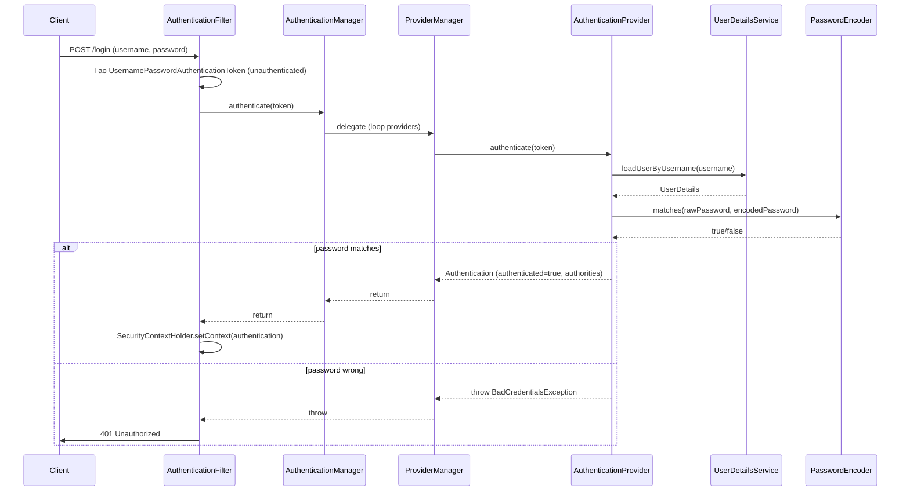
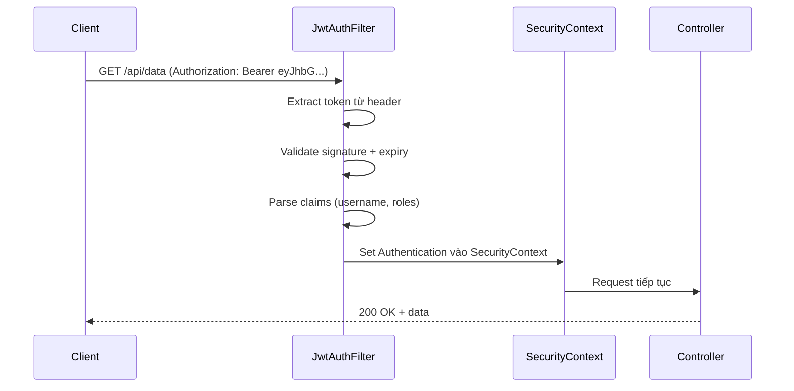

## Mục lục

- [Bối cảnh: Bypass authentication — filter thứ tự sai](#1-bối-cảnh-bypass-authentication--filter-thứ-tự-sai)
- [Kiến trúc tổng quan — Filter Chain](#2-kiến-trúc-tổng-quan--filter-chain)
- [DelegatingFilterProxy & FilterChainProxy](#3-delegatingfilterproxy--filterchainproxy)
- [15+ Security Filter mặc định](#4-15-security-filter-mặc-định)
- [Authentication Flow — ai xác thực?](#5-authentication-flow--ai-xác-thực)
- [SecurityContext — lưu trữ và truyền authentication](#6-securitycontext--lưu-trữ-và-truyền-authentication)
- [Password Encoding — BCrypt internals](#7-password-encoding--bcrypt-internals)
- [Authorization — RBAC, SpEL, Method Security](#8-authorization--rbac-spel-method-security)
- [CSRF Protection — SynchronizerToken & SameSite](#9-csrf-protection--synchronizertoken--samesite)
- [JWT Stateless Authentication](#10-jwt-stateless-authentication)
- [Session Management — concurrent session, fixation](#11-session-management--concurrent-session-fixation)
- [Anti-patterns & Tóm tắt](#12-anti-patterns--tóm-tắt)

---

## 1. Bối cảnh: Bypass authentication — filter thứ tự sai

Team thêm JWT filter custom vào Spring Security:

```java
@Bean
SecurityFilterChain filterChain(HttpSecurity http) throws Exception {
    http
        .authorizeHttpRequests(auth -> auth
            .requestMatchers("/api/**").authenticated()
        )
        .addFilterBefore(new JwtFilter(), UsernamePasswordAuthenticationFilter.class);
    return http.build();
}
```

Test trên dev: hoạt động. Pentester phát hiện: request tới `/api/admin` với **header `Authorization` rỗng** → bypass JWT filter → trả về 200 với data admin.

Nguyên nhân: `JwtFilter` bỏ qua request khi header rỗng (không set `SecurityContext`) → filter tiếp theo là `AnonymousAuthenticationFilter` **tự động set** `AnonymousAuthenticationToken` → `authorizeHttpRequests` thấy "authenticated" (anonymous cũng có `Authentication` object) → cho qua.

Fix: cấu hình rõ ràng `.anonymous(AbstractHttpConfigurer::disable)` hoặc check `isAuthenticated() && !isAnonymous()`.

> [!IMPORTANT]
> Spring Security hoạt động bằng **chain of filters**. Hiểu thứ tự filter, flow authentication, và cách SecurityContext được populate là nền tảng để tránh lỗ hổng bảo mật.

---

## 2. Kiến trúc tổng quan — Filter Chain

```
HTTP Request
     │
     ▼
┌──────────────────────────────────────────────────────────┐
│                    Servlet Container (Tomcat)            │
│  ┌─────────────────────────────────────────────────────┐ │
│  │              DelegatingFilterProxy                  │ │
│  │  ┌───────────────────────────────────────────────┐  │ │
│  │  │           FilterChainProxy                    │  │ │
│  │  │  ┌─────────────────────────────────────────┐  │  │ │
│  │  │  │     SecurityFilterChain #1              │  │  │ │
│  │  │  │  [SecurityContextPersistence]           │  │  │ │
│  │  │  │  [CsrfFilter]                           │  │  │ │
│  │  │  │  [LogoutFilter]                         │  │  │ │
│  │  │  │  [UsernamePasswordAuthenticationFilter] │  │  │ │
│  │  │  │  [AnonymousAuthenticationFilter]        │  │  │ │
│  │  │  │  [ExceptionTranslationFilter]           │  │  │ │
│  │  │  │  [AuthorizationFilter]                  │  │  │ │
│  │  │  └─────────────────────────────────────────┘  │  │ │
│  │  └───────────────────────────────────────────────┘  │ │
│  └─────────────────────────────────────────────────────┘ │
│                                                          │
│                    DispatcherServlet                     │
│                    └── Controller                        │
└──────────────────────────────────────────────────────────┘
```

> [!NOTE]
> Có thể có **nhiều** `SecurityFilterChain` (mỗi chain match pattern khác nhau). `FilterChainProxy` chọn chain **đầu tiên** match request. Thứ tự chain quan trọng — Spring Boot 3 dùng `@Order` hoặc method order.

---

## 3. DelegatingFilterProxy & FilterChainProxy

### 3.1. DelegatingFilterProxy

Servlet container (Tomcat) không biết Spring Bean. `DelegatingFilterProxy` là **servlet Filter** đăng ký với Tomcat, delegate xuống Spring Bean `FilterChainProxy`:

```
Tomcat Filter Chain → DelegatingFilterProxy → FilterChainProxy (Spring Bean)
                                                    └→ SecurityFilterChain(s)
```

### 3.2. FilterChainProxy

- Quản lý **danh sách** `SecurityFilterChain`
- Match request → chọn chain phù hợp → chạy filters **theo thứ tự**
- Cung cấp **duy nhất 1** entry point cho Spring Security (dễ debug: breakpoint ở đây)

---

## 4. 15+ Security Filter mặc định

Thứ tự filter trong chain mặc định (Spring Security 6.x):

| # | Filter | Chức năng |
|---|--------|----------|
| 1 | `DisableEncodeUrlFilter` | Chặn session ID trong URL |
| 2 | `WebAsyncManagerIntegrationFilter` | SecurityContext cho async request |
| 3 | `SecurityContextHolderFilter` | Load/save SecurityContext |
| 4 | `HeaderWriterFilter` | Set security headers (X-Frame-Options, CSP...) |
| 5 | `CorsFilter` | CORS preflight handling |
| 6 | `CsrfFilter` | CSRF token validation |
| 7 | `LogoutFilter` | Xử lý logout URL |
| 8 | `UsernamePasswordAuthenticationFilter` | Form login |
| 9 | `BasicAuthenticationFilter` | HTTP Basic auth |
| 10 | `RequestCacheAwareFilter` | Redirect sau login về URL ban đầu |
| 11 | `SecurityContextHolderAwareRequestFilter` | Wrap request (isUserInRole) |
| 12 | `AnonymousAuthenticationFilter` | Set AnonymousAuthenticationToken nếu chưa authenticated |
| 13 | `ExceptionTranslationFilter` | Catch AuthenticationException / AccessDeniedException |
| 14 | `AuthorizationFilter` | Check quyền truy cập (thay thế FilterSecurityInterceptor) |

> [!TIP]
> Debug filter chain: bật `logging.level.org.springframework.security=TRACE`. Log sẽ in **từng filter** chạy qua và kết quả. Hoặc: `@Bean FilterRegistrationBean` log custom.

---

## 5. Authentication Flow — ai xác thực?



### 5.1. Các interface chính

| Interface | Trách nhiệm | Implement thường gặp |
|----------|-------------|---------------------|
| `AuthenticationManager` | Entry point — `authenticate(Authentication)` | `ProviderManager` |
| `AuthenticationProvider` | Xác thực 1 loại token cụ thể | `DaoAuthenticationProvider` |
| `UserDetailsService` | Load user từ DB/LDAP | Custom implementation |
| `PasswordEncoder` | Hash & verify password | `BCryptPasswordEncoder` |

### 5.2. ProviderManager — chain of providers

`ProviderManager` giữ **danh sách** `AuthenticationProvider`. Nó duyệt từng provider:
- Provider hỗ trợ token type? (`supports(Class<?>)`)
- Nếu có → `authenticate()`. Thành công → return. Thất bại → throw.
- Không provider nào support → throw `ProviderNotFoundException`.

```java
for (AuthenticationProvider provider : getProviders()) {
    if (!provider.supports(toTest)) continue;
    result = provider.authenticate(authentication);
    if (result != null) return result;   // thành công
}
// Không ai xác thực được → delegate lên parent (nếu có) hoặc throw
```

---

## 6. SecurityContext — lưu trữ và truyền authentication

### 6.1. SecurityContextHolder

```java
// Đọc user hiện tại:
Authentication auth = SecurityContextHolder.getContext().getAuthentication();
String username = auth.getName();
Collection<? extends GrantedAuthority> roles = auth.getAuthorities();
```

Mặc định: **ThreadLocal strategy** — mỗi thread có SecurityContext riêng.

| Strategy | Khi nào dùng |
|----------|-------------|
| `MODE_THREADLOCAL` (default) | Servlet (1 thread per request) |
| `MODE_INHERITABLETHREADLOCAL` | Cần propagate sang child thread |
| `MODE_GLOBAL` | Standalone app (hiếm) |

### 6.1b. SecurityContextHolder internals

```java
// SecurityContextHolder (simplified):
final class ThreadLocalSecurityContextHolderStrategy {
    private static final ThreadLocal<SecurityContext> contextHolder = new ThreadLocal<>();
    
    public SecurityContext getContext() {
        SecurityContext ctx = contextHolder.get();
        if (ctx == null) {
            ctx = createEmptyContext();  // lazy create
            contextHolder.set(ctx);
        }
        return ctx;
    }
    public void clearContext() { contextHolder.remove(); }
}
```

**Lifecycle trong 1 HTTP request:**
1. `SecurityContextHolderFilter`: load context từ `SecurityContextRepository` (Session) → set ThreadLocal
2. Authentication filters: đặt `Authentication` vào context
3. Controller: `SecurityContextHolder.getContext().getAuthentication()` → ThreadLocal get
4. Response complete: filter **clear ThreadLocal** → tránh leak sang request kế tiếp (thread pool reuse!)

### 6.2. Async propagation problem

```java
@Async
public void asyncMethod() {
    // SecurityContextHolder.getContext() → NULL!
    // Vì @Async chạy trên thread pool thread khác → ThreadLocal rỗng
}
```

Fix:

```java
// Cách 1: DelegatingSecurityContextExecutor
@Bean
Executor taskExecutor() {
    return new DelegatingSecurityContextAsyncTaskExecutor(
        new ThreadPoolTaskExecutor()
    );
}

// Cách 2: Propagate manual
SecurityContext ctx = SecurityContextHolder.getContext();
executor.execute(() -> {
    SecurityContextHolder.setContext(ctx);
    try { doWork(); }
    finally { SecurityContextHolder.clearContext(); }
});
```

> [!WARNING]
> **Luôn** clear SecurityContext trong `finally` khi set thủ công trên thread pool. Thread được reuse → SecurityContext cũ "rò rỉ" sang request khác → **privilege escalation**.

---

## 7. Password Encoding — BCrypt internals

### 7.1. Tại sao hash, không encrypt?

| | Hash (BCrypt) | Encrypt (AES) |
|--|--------------|---------------|
| Chiều | **Một chiều** — không reverse | Hai chiều — có key thì giải được |
| DB bị lộ | Attacker có hash, không ra password | Attacker có key → ra tất cả password |
| Dùng cho | Password storage | Data at rest/in transit |

### 7.2. BCrypt format

```
$2a$10$N9qo8uLOickgx2ZMRZoMyeIjZAgcfl7p92ldGxad68LJZdL17lhWy
 │  │  └─────────────────── 22 char salt + 31 char hash (Base64)
 │  └───── cost factor (2^10 = 1024 rounds)
 └──── version (2a, 2b, 2y)
```

- **Salt**: random 128-bit, **mỗi password khác nhau** → hai user cùng password → hash khác nhau
- **Cost factor**: mỗi +1 = **gấp đôi** thời gian hash. `10` = ~100ms, `12` = ~400ms, `14` = ~1.6s

### 7.3. Spring Security PasswordEncoder

```java
@Bean
PasswordEncoder passwordEncoder() {
    return new BCryptPasswordEncoder(12);  // cost = 12
}

// Hoặc: DelegatingPasswordEncoder (khuyên dùng — hỗ trợ migration)
@Bean
PasswordEncoder passwordEncoder() {
    return PasswordEncoderFactories.createDelegatingPasswordEncoder();
    // Mặc định: bcrypt. Hỗ trợ đọc: {noop}, {sha256}, {scrypt}...
    // Stored: {bcrypt}$2a$10$...
}
```

> [!TIP]
> Dùng `DelegatingPasswordEncoder` để dễ **migrate** thuật toán sau này. Nếu muốn chuyển từ bcrypt sang argon2, chỉ cần đổi default encoder — password cũ vẫn verify được nhờ prefix `{bcrypt}`.

---

## 8. Authorization — RBAC, SpEL, Method Security

### 8.1. Request-level (HttpSecurity)

```java
http.authorizeHttpRequests(auth -> auth
    .requestMatchers("/api/admin/**").hasRole("ADMIN")
    .requestMatchers("/api/user/**").hasAnyRole("USER", "ADMIN")
    .requestMatchers("/public/**").permitAll()
    .anyRequest().authenticated()
);
```

### 8.2. Method-level Security

```java
@EnableMethodSecurity  // Spring Security 6+

@PreAuthorize("hasRole('ADMIN')")
public void deleteUser(Long id) { ... }

@PreAuthorize("#userId == authentication.principal.id or hasRole('ADMIN')")
public User getUser(Long userId) { ... }

@PostAuthorize("returnObject.owner == authentication.name")
public Document getDocument(Long docId) { ... }

@PreFilter("filterObject.owner == authentication.name")
public void deleteDocuments(List<Document> docs) { ... }
```

### 8.3. SpEL expressions phổ biến

| Expression | Ý nghĩa |
|-----------|---------|
| `hasRole('ADMIN')` | Có role ROLE_ADMIN |
| `hasAuthority('WRITE')` | Có authority WRITE (không prefix ROLE_) |
| `isAuthenticated()` | Đã xác thực (bao gồm remember-me) |
| `isFullyAuthenticated()` | Xác thực đầy đủ (không phải remember-me) |
| `#paramName` | Tham số method |
| `authentication.principal` | UserDetails object |
| `returnObject` | Return value (cho @PostAuthorize) |

> [!NOTE]
> `hasRole('ADMIN')` tự thêm prefix `ROLE_` → check authority `ROLE_ADMIN`. `hasAuthority('ADMIN')` check **chính xác** `ADMIN`. Nhầm lẫn giữa hai cái → authorization bypass.

---

## 9. CSRF Protection — SynchronizerToken & SameSite

### 9.1. CSRF attack

Attacker tạo trang web chứa form ẩn submit tới API của bạn. Nếu user đã login (cookie session) → browser **tự gắn cookie** → request hợp lệ từ góc nhìn server.

### 9.2. Synchronizer Token Pattern

Spring Security tạo **CSRF token** (random) gắn vào session. Mỗi form/request phải gửi kèm token. Attacker không biết token → request bị reject.

```html
<!-- Thymeleaf tự thêm -->
<input type="hidden" name="_csrf" value="abc123..." />
```

### 9.3. Khi nào tắt CSRF?

```java
http.csrf(AbstractHttpConfigurer::disable);  // TẮT CSRF
```

| Tình huống | CSRF |
|-----------|------|
| API stateless (JWT, no cookie) | **Tắt** — không có session/cookie, CSRF không áp dụng |
| Server-side rendered (Thymeleaf, JSP) | **Bật** — form-based, cookie session |
| SPA + cookie session | **Bật** — dùng CookieCsrfTokenRepository (XSRF-TOKEN cookie) |

> [!WARNING]
> **Không** tắt CSRF chỉ vì "nó gây lỗi 403". Hiểu tại sao cần CSRF rồi mới quyết định tắt. Nếu dùng cookie-based authentication → **phải** bật CSRF.

---

## 10. JWT Stateless Authentication

### 10.1. Flow



### 10.2. Custom JwtFilter

```java
public class JwtFilter extends OncePerRequestFilter {
    @Override
    protected void doFilterInternal(HttpServletRequest request,
            HttpServletResponse response, FilterChain chain)
            throws ServletException, IOException {

        String header = request.getHeader("Authorization");
        if (header != null && header.startsWith("Bearer ")) {
            String token = header.substring(7);
            try {
                Claims claims = Jwts.parserBuilder()
                    .setSigningKey(secretKey)
                    .build()
                    .parseClaimsJws(token)
                    .getBody();

                List<GrantedAuthority> authorities = ((List<String>) claims.get("roles"))
                    .stream().map(SimpleGrantedAuthority::new).toList();

                UsernamePasswordAuthenticationToken auth =
                    new UsernamePasswordAuthenticationToken(
                        claims.getSubject(), null, authorities);
                SecurityContextHolder.getContext().setAuthentication(auth);
            } catch (JwtException e) {
                // Token invalid — không set context → AnonymousAuthenticationFilter xử lý
            }
        }
        chain.doFilter(request, response);
    }
}
```

### 10.3. JWT + Spring Security config

```java
@Bean
SecurityFilterChain filterChain(HttpSecurity http) throws Exception {
    http
        .csrf(AbstractHttpConfigurer::disable)           // stateless → no CSRF
        .sessionManagement(sm -> sm
            .sessionCreationPolicy(SessionCreationPolicy.STATELESS))
        .addFilterBefore(jwtFilter, UsernamePasswordAuthenticationFilter.class)
        .authorizeHttpRequests(auth -> auth
            .requestMatchers("/auth/**").permitAll()
            .anyRequest().authenticated()
        );
    return http.build();
}
```

---

## 11. Session Management — concurrent session, fixation

### 11.1. Session Fixation Protection

Attacker gửi victim link kèm session ID → victim login → session ID đó giờ có auth → attacker dùng cùng session ID.

Spring Security mặc định: **changeSessionId** — sau login, tạo session ID mới, copy attributes:

```java
http.sessionManagement(sm -> sm
    .sessionFixation().changeSessionId()       // default (Servlet 3.1+)
    // .sessionFixation().migrateSession()      // tạo session mới, copy attrs
    // .sessionFixation().newSession()           // tạo session hoàn toàn mới
);
```

### 11.2. Concurrent Session Control

```java
http.sessionManagement(sm -> sm
    .maximumSessions(1)                         // 1 session per user
    .maxSessionsPreventsLogin(true)             // block login mới (thay vì kick session cũ)
    .expiredUrl("/login?expired")
);
```

---

## 12. Anti-patterns & Tóm tắt

### Anti-patterns

| Anti-pattern | Vì sao sai | Sửa |
|--------------|-----------|-----|
| Tắt CSRF cho cookie-based auth | CSRF attack possible | Giữ bật, dùng CookieCsrfTokenRepository cho SPA |
| Store password plaintext/MD5/SHA | Brute-force quá dễ | BCrypt (cost ≥ 10) hoặc Argon2 |
| `permitAll()` rồi check role trong controller | Bypass nếu quên check | Centralize authorization trong SecurityFilterChain |
| SecurityContext propagation thiếu clear | Thread pool reuse → privilege escalation | `DelegatingSecurityContextExecutor` hoặc `finally { clear }` |
| JWT không validate expiry | Token sống mãi | Check `exp` claim, dùng short-lived token + refresh |
| `hasRole` vs `hasAuthority` nhầm | Authorization bypass | `hasRole` = auto prefix ROLE_, `hasAuthority` = exact match |
| Custom filter không gọi `chain.doFilter()` | Request bị "nuốt", không response | Luôn gọi chain.doFilter trừ khi chủ ý reject |

### Tóm tắt — Cheat sheet

```
Spring Security = Filter Chain + Authentication + Authorization

1. Request → DelegatingFilterProxy → FilterChainProxy → SecurityFilterChain
2. Authentication: Filter → AuthenticationManager → ProviderManager → AuthenticationProvider
3. SecurityContext: ThreadLocal per request → clear sau khi done
4. Password: BCrypt/Argon2, KHÔNG MD5/SHA, dùng DelegatingPasswordEncoder
5. Authorization: HttpSecurity (request-level) + @PreAuthorize (method-level)
6. CSRF: bật cho cookie-based, tắt cho stateless JWT
7. JWT: stateless, validate signature + expiry, short-lived + refresh token
```

| Cần gì | Dùng gì |
|--------|---------|
| Form login (server-rendered) | `formLogin()` + CSRF + session |
| API stateless | JWT + `SessionCreationPolicy.STATELESS` + disable CSRF |
| OAuth2 login | `oauth2Login()` + `oauth2ResourceServer()` |
| Method-level security | `@EnableMethodSecurity` + `@PreAuthorize` |
| Password storage | `BCryptPasswordEncoder` hoặc `DelegatingPasswordEncoder` |

> [!TIP]
> Một câu để nhớ: *Spring Security là chain of filters — hiểu filter nào chạy trước, filter nào set SecurityContext, và filter nào check authorization là hiểu được 80% cách nó hoạt động.* Mọi lỗ hổng bảo mật Spring Security đều quy về filter thứ tự sai hoặc SecurityContext bị misconfigure.
