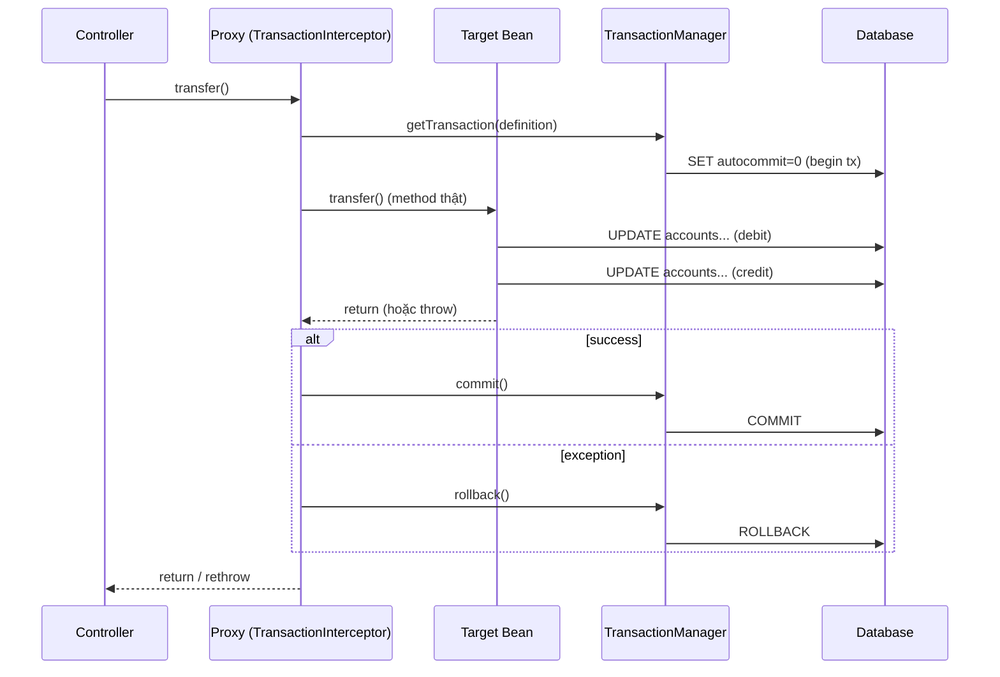
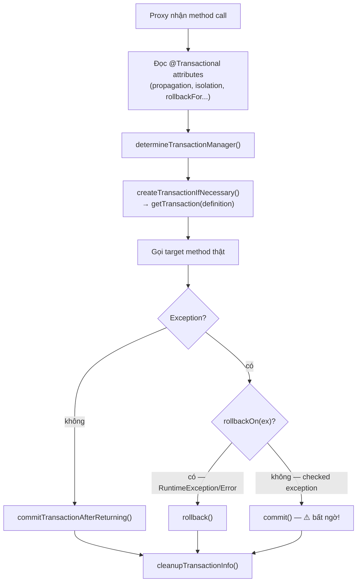
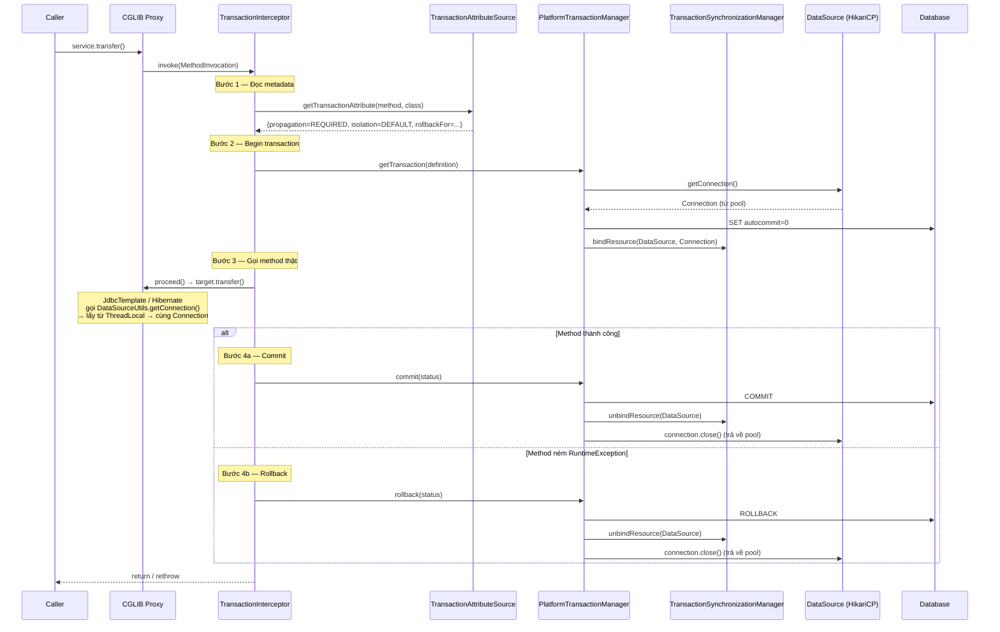
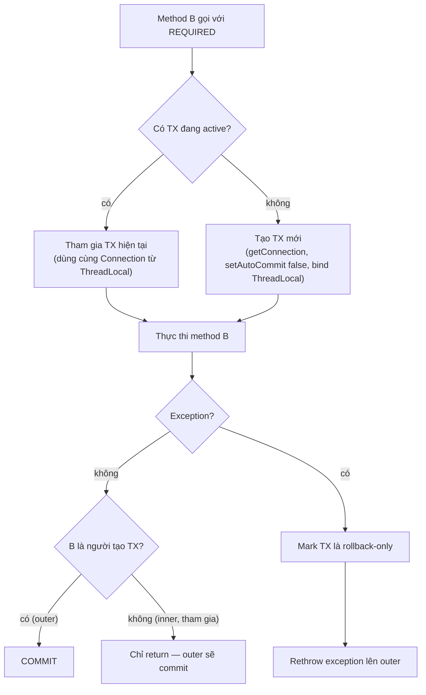

## Mục lục

- [@Transactional mà dữ liệu vẫn mất — gọi nội bộ, proxy vô hình](#1-transactional-mà-dữ-liệu-vẫn-mất--gọi-nội-bộ-proxy-vô-hình)
- [Spring Transaction nhìn từ 10.000 feet — AOP Proxy](#2-spring-transaction-nhìn-từ-10000-feet--aop-proxy)
- [Proxy được tạo như thế nào — JDK Dynamic Proxy vs CGLIB](#3-proxy-được-tạo-như-thế-nào--jdk-dynamic-proxy-vs-cglib)
- [TransactionInterceptor — trái tim của @Transactional](#4-transactioninterceptor--trái-tim-của-transactional)
- [PlatformTransactionManager — ai thực sự commit/rollback?](#5-platformtransactionmanager--ai-thực-sự-commitrollback)
- [TransactionSynchronizationManager — ThreadLocal giữ connection](#6-transactionsynchronizationmanager--threadlocal-giữ-connection)
- [Flow đầy đủ: từ @Transactional đến COMMIT SQL](#7-flow-đầy-đủ-từ-transactional-đến-commit-sql)
- [Propagation — 7 chế độ lan truyền và internal flow](#8-propagation--7-chế-độ-lan-truyền-và-internal-flow)
- [Isolation Level — từ annotation đến SET TRANSACTION ISOLATION](#9-isolation-level--từ-annotation-đến-set-transaction-isolation)
- [Rollback Rules — checked exception không rollback?](#10-rollback-rules--checked-exception-không-rollback)
- [Self-invocation Trap — gọi nội bộ, proxy "vô hình"](#11-self-invocation-trap--gọi-nội-bộ-proxy-vô-hình)
- [Read-only Optimization — không chỉ là hint](#12-read-only-optimization--không-chỉ-là-hint)
- [Savepoint & NESTED propagation — rollback một phần](#13-savepoint--nested-propagation--rollback-một-phần)
- [Programmatic Transaction — TransactionTemplate & TransactionOperator](#14-programmatic-transaction--transactiontemplate--transactionoperator)
- [Anti-patterns & Bug kinh điển](#15-anti-patterns--bug-kinh-điển)
- [So sánh @Transactional / TransactionTemplate / Manual / ChainedTransactionManager](#16-so-sánh-transactional--transactiontemplate--manual--chainedtransactionmanager)
- [Tóm tắt — Cheat sheet & 7 nguyên tắc](#17-tóm-tắt--cheat-sheet--7-nguyên-tắc)

---

## 1. @Transactional mà dữ liệu vẫn mất — gọi nội bộ, proxy vô hình

`@Transactional` trong Spring **không phải phép thuật**: nó chỉ là metadata báo cho một **proxy AOP** biết phải mở/commit/rollback transaction quanh method nào. Proxy là người thực sự điều khiển transaction — begin, bind connection vào ThreadLocal, gọi method thật, rồi commit hoặc rollback tuỳ kết quả. Vì vậy annotation **chỉ có hiệu lực khi lời gọi đi qua proxy**; nếu method tự gọi method khác trong cùng class (self-invocation), lời gọi `this` đi thẳng tới target và **bỏ qua proxy hoàn toàn** → transaction không bao giờ được mở → từng câu SQL auto-commit riêng lẻ → dữ liệu inconsistent. Đây là root cause của đại đa số bug "đã `@Transactional` mà dữ liệu vẫn hỏng".

Bạn viết một service chuyển tiền. Logic rõ ràng: trừ tài khoản A, cộng tài khoản B, ghi log giao dịch — tất cả trong một method `@Transactional`:

```java
@Service
public class TransferService {

    @Transactional
    public void transfer(Long fromId, Long toId, BigDecimal amount) {
        accountRepo.debit(fromId, amount);   // trừ tiền A
        accountRepo.credit(toId, amount);    // cộng tiền B
        auditRepo.log(fromId, toId, amount); // ghi audit
    }

    public void batchTransfer(List<TransferRequest> requests) {
        for (TransferRequest r : requests) {
            transfer(r.from(), r.to(), r.amount());  // 😱 gọi nội bộ
        }
    }
}
```

Trên môi trường dev: chạy tốt. Lên production, một giao dịch `credit` ném exception — bạn kỳ vọng toàn bộ transaction rollback, tài khoản A không bị trừ. Nhưng kiểm tra DB: **tiền A đã bị trừ**, tài khoản B chưa cộng, audit trống. Dữ liệu **inconsistent**.

Bạn debug: `@Transactional` rõ ràng đã đặt, exception rõ ràng đã ném. Vậy tại sao transaction không rollback?

Nguyên nhân: `batchTransfer()` gọi `transfer()` **từ bên trong cùng class** — đây là **self-invocation**. Lời gọi này **đi thẳng đến method thật**, bỏ qua proxy AOP → `@Transactional` **không bao giờ được kích hoạt** → mỗi câu SQL chạy trong auto-commit riêng lẻ.

> [!IMPORTANT]
> `@Transactional` **không** phải phép thuật. Nó chỉ hoạt động khi method được gọi **qua proxy**. Hiểu proxy đi qua đâu, bind connection ra sao, rollback khi nào — đó là hiểu Spring Transaction. Doc này mổ xẻ từng lớp từ annotation đến `COMMIT` SQL.

Phần còn lại của doc sẽ đi qua: AOP proxy nhìn từ 10.000 feet (§2) → JDK vs CGLIB proxy (§3) → `TransactionInterceptor` (§4) → `PlatformTransactionManager` (§5) → `TransactionSynchronizationManager` ThreadLocal (§6) → flow đầy đủ đến COMMIT (§7) → propagation 7 chế độ (§8) → isolation level (§9) → rollback rules (§10) → self-invocation trap (§11) → read-only optimization (§12) → savepoint & NESTED (§13) → programmatic transaction (§14) → anti-patterns (§15) → so sánh các cách quản lý TX (§16) → cheat sheet (§17).

---

## 2. Spring Transaction nhìn từ 10.000 feet — AOP Proxy

Spring Transaction dựa trên **AOP (Aspect-Oriented Programming)**. Khi bạn đặt `@Transactional` lên method hoặc class, Spring **không sửa bytecode** của method đó. Thay vào đó, nó tạo một **proxy object** bao quanh bean:

```
Caller ──▶ Proxy ──▶ Target (bean thật)
              │
              ├── begin transaction
              ├── invoke target method
              ├── commit (nếu thành công)
              └── rollback (nếu exception)
```

Khi `ApplicationContext` khởi tạo bean, `BeanPostProcessor` (cụ thể là `InfrastructureAdvisorAutoProxyCreator`) quét class. Nếu phát hiện method/class có `@Transactional`, nó **thay thế bean gốc bằng proxy** trong container. Mọi nơi inject bean đó sẽ nhận **proxy**, không phải object gốc.



> [!NOTE]
> Điểm mấu chốt: **proxy là người quyết định** begin/commit/rollback — không phải target bean, không phải annotation. `@Transactional` chỉ là **metadata** để proxy biết phải làm gì. Nếu lời gọi không đi qua proxy → annotation bị **bỏ qua hoàn toàn**.

---

## 3. Proxy được tạo như thế nào — JDK Dynamic Proxy vs CGLIB

Spring có hai cách tạo proxy:

### 3.1. JDK Dynamic Proxy (interface-based)

```java
// Bean implement interface → Spring dùng java.lang.reflect.Proxy
public interface TransferService {
    void transfer(Long from, Long to, BigDecimal amount);
}

@Service
public class TransferServiceImpl implements TransferService { ... }
```

JDK Proxy tạo class mới tại runtime **implement cùng interface**, chuyển mọi method call qua `InvocationHandler`:

```java
// Pseudo-code — Spring làm điều này tự động
Proxy.newProxyInstance(
    classLoader,
    new Class<?>[]{ TransferService.class },
    (proxy, method, args) -> {
        // begin tx, invoke target, commit/rollback
    }
);
```

**Hạn chế**: chỉ proxy được **method khai báo trong interface**. Method chỉ có trong class (không ở interface) → không qua proxy.

### 3.2. CGLIB Proxy (class-based)

```java
// Không implement interface → Spring dùng CGLIB (hoặc khi proxyTargetClass=true)
@Service
public class TransferService {
    @Transactional
    public void transfer(...) { ... }
}
```

CGLIB tạo **subclass tại runtime** (bytecode generation), override mọi method non-final để chèn logic proxy:

```java
// Pseudo-code — CGLIB tạo class:
public class TransferService$$EnhancerBySpringCGLIB extends TransferService {
    @Override
    public void transfer(...) {
        // begin tx
        super.transfer(...);    // gọi method thật
        // commit/rollback
    }
}
```

**Hạn chế**: không proxy được **`final` method** (vì subclass không override được) và **`final` class**.

### 3.3. So sánh

| Tiêu chí | JDK Dynamic Proxy | CGLIB |
|----------|-------------------|-------|
| Yêu cầu | Bean phải implement interface | Không cần interface |
| Cơ chế | `java.lang.reflect.Proxy` | Tạo subclass bằng bytecode |
| Proxy method | Chỉ method trên interface | Mọi non-final method |
| `final` method | Không áp dụng | **Bỏ qua** — gọi thẳng, không qua proxy |
| Performance | Nhẹ hơn lúc tạo proxy | Nhanh hơn lúc invoke (không qua reflection) |
| Default (Spring Boot 2+) | — | **CGLIB** (`spring.aop.proxy-target-class=true` mặc định) |

> [!IMPORTANT]
> Từ Spring Boot 2.0, **CGLIB là mặc định** — kể cả khi bean implement interface. Nếu bạn đặt `@Transactional` trên một **`final` method**, không có warning, không có error — **proxy đơn giản bỏ qua** method đó. Transaction sẽ **không** hoạt động, và bạn sẽ không biết cho đến khi dữ liệu hỏng.

---

## 4. TransactionInterceptor — trái tim của @Transactional

Khi proxy chặn một method call, nó delegate cho `TransactionInterceptor` — class thực sự xử lý transaction lifecycle. Đây là source (đã rút gọn) từ Spring Framework:

```java
// TransactionInterceptor extends TransactionAspectSupport
public Object invoke(MethodInvocation invocation) throws Throwable {
    // lấy target class thật (không phải proxy class)
    Class<?> targetClass = (invocation.getThis() != null
        ? AopUtils.getTargetClass(invocation.getThis()) : null);

    // delegate sang method cha: invokeWithinTransaction
    return invokeWithinTransaction(invocation.getMethod(), targetClass,
        new CoroutinesInvocationCallback() {
            public Object proceedWithInvocation() throws Throwable {
                return invocation.proceed();  // gọi method thật
            }
        });
}
```

Logic chính nằm trong `TransactionAspectSupport.invokeWithinTransaction()`:

```java
// Rút gọn từ TransactionAspectSupport (Spring 6.x)
protected Object invokeWithinTransaction(Method method, Class<?> targetClass,
        InvocationCallback invocation) throws Throwable {

    // 1) Đọc thuộc tính @Transactional
    TransactionAttributeSource tas = getTransactionAttributeSource();
    TransactionAttribute txAttr = tas.getTransactionAttribute(method, targetClass);

    // 2) Lấy TransactionManager phù hợp
    TransactionManager tm = determineTransactionManager(txAttr);
    PlatformTransactionManager ptm = asPlatformTransactionManager(tm);

    // 3) Tạo hoặc tham gia transaction
    TransactionInfo txInfo = createTransactionIfNecessary(ptm, txAttr, joinpointId);

    Object retVal;
    try {
        // 4) Gọi method thật
        retVal = invocation.proceedWithInvocation();
    } catch (Throwable ex) {
        // 5) Xử lý exception → rollback hoặc commit
        completeTransactionAfterThrowing(txInfo, ex);
        throw ex;
    } finally {
        // 6) Dọn dẹp TransactionInfo (pop khỏi ThreadLocal stack)
        cleanupTransactionInfo(txInfo);
    }

    // 7) Commit nếu không có exception
    commitTransactionAfterReturning(txInfo);
    return retVal;
}
```

Flow nội bộ của `TransactionInterceptor`:



> [!WARNING]
> Bước H là nơi rất nhiều dev bất ngờ: **checked exception mặc định KHÔNG rollback**. Chỉ `RuntimeException` và `Error` mới trigger rollback. Chi tiết ở mục 10.

---

## 5. PlatformTransactionManager — ai thực sự commit/rollback?

`TransactionInterceptor` **không** tự nói chuyện với database. Nó delegate cho `PlatformTransactionManager` — interface trừu tượng định nghĩa 3 method duy nhất:

```java
public interface PlatformTransactionManager extends TransactionManager {
    TransactionStatus getTransaction(TransactionDefinition definition)
        throws TransactionException;
    void commit(TransactionStatus status) throws TransactionException;
    void rollback(TransactionStatus status) throws TransactionException;
}
```

### 5.1. Hierarchy — implementation cho từng công nghệ

```
PlatformTransactionManager
├── DataSourceTransactionManager     ← JDBC / MyBatis
├── JpaTransactionManager            ← JPA / Hibernate
├── HibernateTransactionManager      ← Hibernate thuần (không qua JPA)
├── JtaTransactionManager            ← Distributed transaction (XA)
└── R2dbcTransactionManager          ← Reactive (WebFlux + R2DBC — implement ReactiveTransactionManager)
```

### 5.2. DataSourceTransactionManager — dùng JDBC

Khi `getTransaction()` được gọi, `DataSourceTransactionManager` làm gì bên trong?

```java
// Rút gọn từ DataSourceTransactionManager.doBegin()
protected void doBegin(Object transaction, TransactionDefinition definition) {
    DataSourceTransactionObject txObject = (DataSourceTransactionObject) transaction;

    // 1) Lấy connection từ DataSource (HikariCP, Tomcat pool...)
    Connection con = obtainDataSource().getConnection();

    // 2) Tắt auto-commit — bắt đầu transaction thật sự ở DB level
    if (con.getAutoCommit()) {
        txObject.setMustRestoreAutoCommit(true);
        con.setAutoCommit(false);   // ← đây là lúc "BEGIN" xảy ra
    }

    // 3) Set isolation level nếu khác default
    Integer previousIsolation = DataSourceUtils.prepareConnectionForTransaction(con, definition);
    txObject.setPreviousIsolationLevel(previousIsolation);

    // 4) Set read-only nếu được yêu cầu
    if (definition.isReadOnly()) {
        con.setReadOnly(true);
    }

    // 5) Set timeout
    int timeout = determineTimeout(definition);
    if (timeout != TransactionDefinition.TIMEOUT_DEFAULT) {
        txObject.setTimeoutInSeconds(timeout);
    }

    // 6) ⭐ BIND connection vào ThreadLocal — cực kỳ quan trọng!
    if (txObject.isNewConnectionHolder()) {
        TransactionSynchronizationManager.bindResource(
            obtainDataSource(), txObject.getConnectionHolder());
    }
}
```

> [!IMPORTANT]
> Bước 6 là **xương sống** của Spring Transaction: connection được bind vào `ThreadLocal` theo key là `DataSource`. Khi JdbcTemplate / Hibernate / MyBatis cần connection trong cùng thread, chúng lấy từ **cùng ThreadLocal** → dùng **cùng connection** → cùng transaction. Nếu không có bước này, mỗi SQL query sẽ lấy connection riêng và auto-commit riêng.

### 5.3. JpaTransactionManager — dùng Hibernate/JPA

`JpaTransactionManager` tương tự nhưng thêm một lớp: nó bind **cả** `EntityManager` **và** JDBC Connection vào `ThreadLocal`:

```java
// Rút gọn từ JpaTransactionManager.doBegin()
protected void doBegin(Object transaction, TransactionDefinition definition) {
    JpaTransactionObject txObject = (JpaTransactionObject) transaction;

    // 1) Tạo EntityManager từ EntityManagerFactory
    EntityManager em = createEntityManagerForTransaction();

    // 2) Bind EntityManager vào ThreadLocal
    txObject.setEntityManagerHolder(new EntityManagerHolder(em));
    TransactionSynchronizationManager.bindResource(
        obtainEntityManagerFactory(), txObject.getEntityManagerHolder());

    // 3) Lấy JDBC connection từ EntityManager (Hibernate unwrap)
    // 4) setAutoCommit(false), set isolation, set readOnly
    // 5) Bind JDBC connection vào ThreadLocal (như DataSourceTransactionManager)
}
```

Vì vậy khi dùng JPA:
- `@PersistenceContext EntityManager em` → lấy từ ThreadLocal → cùng EntityManager trong cùng transaction
- `JdbcTemplate` nếu dùng cùng `DataSource` → lấy cùng connection → **cùng transaction** với JPA

---

## 6. TransactionSynchronizationManager — ThreadLocal giữ connection

Đây là class **ẩn** mà mọi thứ phụ thuộc vào, nhưng ít dev biết tới. Nó quản lý **toàn bộ transaction state** qua `ThreadLocal`:

```java
// Rút gọn từ TransactionSynchronizationManager
public abstract class TransactionSynchronizationManager {

    // Connection / EntityManager được bind theo resource key (DataSource, EMF)
    private static final ThreadLocal<Map<Object, Object>> resources =
        new NamedThreadLocal<>("Transactional resources");

    // Danh sách callback (beforeCommit, afterCommit, afterCompletion...)
    private static final ThreadLocal<Set<TransactionSynchronization>> synchronizations =
        new NamedThreadLocal<>("Transaction synchronizations");

    // Tên transaction hiện tại (for logging/monitoring)
    private static final ThreadLocal<String> currentTransactionName =
        new NamedThreadLocal<>("Current transaction name");

    // Transaction hiện tại có read-only không?
    private static final ThreadLocal<Boolean> currentTransactionReadOnly =
        new NamedThreadLocal<>("Current transaction read-only status");

    // Isolation level hiện tại
    private static final ThreadLocal<Integer> currentTransactionIsolationLevel =
        new NamedThreadLocal<>("Current transaction isolation level");

    // Transaction có đang active không?
    private static final ThreadLocal<Boolean> actualTransactionActive =
        new NamedThreadLocal<>("Actual transaction active");
}
```

### 6.1. Vì sao ThreadLocal?

Mỗi HTTP request trong Spring MVC chạy trên **một thread**. `ThreadLocal` đảm bảo:

1. **Mỗi thread có connection riêng** — không chia sẻ connection giữa các request
2. **Mọi DAO/Repository trong cùng thread dùng cùng connection** — cùng transaction
3. **Không cần truyền connection qua tham số** — Spring tự lấy từ ThreadLocal

```
Thread-1 (Request A):
  ThreadLocal → { DataSource → Connection_1, EMF → EntityManager_1 }
  │
  ├── ServiceA.transfer()       → dùng Connection_1
  ├── AccountRepo.debit()       → dùng Connection_1  ← cùng connection!
  └── AuditRepo.log()           → dùng Connection_1  ← cùng transaction!

Thread-2 (Request B):
  ThreadLocal → { DataSource → Connection_2, EMF → EntityManager_2 }
  │
  └── ServiceB.query()          → dùng Connection_2  ← hoàn toàn tách biệt
```

### 6.2. DataSourceUtils — cầu nối giữa JdbcTemplate và ThreadLocal

Khi `JdbcTemplate` cần connection, nó **không** gọi `dataSource.getConnection()` trực tiếp. Nó gọi `DataSourceUtils.getConnection()`:

```java
// Rút gọn từ DataSourceUtils
public static Connection getConnection(DataSource dataSource) {
    // 1) Kiểm tra ThreadLocal có connection cho DataSource này không?
    ConnectionHolder conHolder = (ConnectionHolder)
        TransactionSynchronizationManager.getResource(dataSource);

    if (conHolder != null && conHolder.hasConnection()) {
        conHolder.requested();
        return conHolder.getConnection();    // ← trả về connection đang trong transaction
    }

    // 2) Không có → lấy connection mới (auto-commit, không nằm trong transaction)
    Connection con = fetchConnection(dataSource);
    // ... register synchronization nếu transaction active ...
    return con;
}
```

> [!TIP]
> Đây là lý do **bạn không nên tự gọi `dataSource.getConnection()`** trong code nếu muốn tham gia transaction Spring. Luôn dùng `JdbcTemplate`, `NamedParameterJdbcTemplate`, hoặc `DataSourceUtils.getConnection()`. Connection lấy trực tiếp từ DataSource sẽ **nằm ngoài transaction**.

### 6.3. Hệ quả: async/multi-thread phá vỡ transaction

Vì transaction state nằm trong `ThreadLocal`, bất cứ gì chạy trên **thread khác** sẽ **không** thấy transaction hiện tại:

```java
@Transactional
public void transfer(Long fromId, Long toId, BigDecimal amount) {
    accountRepo.debit(fromId, amount);     // Thread-1, Connection_1, TX active

    CompletableFuture.runAsync(() -> {
        accountRepo.credit(toId, amount);  // Thread-pool-1, Connection_2, NO TX!
    });

    auditRepo.log(fromId, toId, amount);   // Thread-1, Connection_1, TX active
}
```

`credit()` chạy trên thread khác → ThreadLocal rỗng → lấy connection mới → **auto-commit** → nếu `debit` rollback, `credit` vẫn đã commit.

> [!WARNING]
> **`@Transactional` + `@Async` / `CompletableFuture` / thread pool = KHÔNG cùng transaction.** Mỗi thread phải quản lý transaction riêng. Nếu cần atomic across thread, phải dùng distributed transaction (XA/Saga) hoặc redesign flow.

---

## 7. Flow đầy đủ: từ @Transactional đến COMMIT SQL

Tổng hợp tất cả các component, đây là flow end-to-end khi một method `@Transactional` được gọi:



Tóm lại **4 giai đoạn**:
1. **Parse metadata** — đọc annotation attributes
2. **Begin** — lấy connection, tắt auto-commit, bind vào ThreadLocal
3. **Execute** — mọi SQL trong method dùng chung connection từ ThreadLocal
4. **Complete** — commit hoặc rollback, unbind, trả connection về pool

---

## 8. Propagation — 7 chế độ lan truyền và internal flow

`Propagation` quyết định: khi method B (có `@Transactional`) được gọi **trong** method A (cũng có `@Transactional`), B có **tạo transaction mới**, **tham gia** transaction A, hay **từ chối** chạy?

### 8.1. Bảng tổng hợp 7 propagation

| Propagation | TX bên ngoài **có** | TX bên ngoài **không có** | Dùng khi |
|-------------|---------------------|--------------------------|----------|
| `REQUIRED` (mặc định) | **Tham gia** TX hiện tại | **Tạo mới** | Hầu hết mọi trường hợp |
| `REQUIRES_NEW` | **Suspend** TX hiện tại → **tạo mới** | **Tạo mới** | Audit log phải commit dù parent rollback |
| `NESTED` | Tạo **savepoint** trong TX hiện tại | **Tạo mới** | Rollback một phần (batch processing) |
| `SUPPORTS` | **Tham gia** TX hiện tại | Chạy **không TX** | Read method — dùng TX nếu có, không thì thôi |
| `NOT_SUPPORTED` | **Suspend** TX hiện tại → chạy **không TX** | Chạy **không TX** | Heavy read tránh hold connection lock |
| `MANDATORY` | **Tham gia** TX hiện tại | **Ném exception** | Bắt buộc phải có TX (defensive coding) |
| `NEVER` | **Ném exception** | Chạy **không TX** | Đảm bảo không bao giờ chạy trong TX |

### 8.2. REQUIRED — flow nội bộ



**Cạm bẫy `rollback-only`**: khi method B (inner) ném exception và bị catch bởi method A (outer):

```java
@Transactional  // outer — REQUIRED
public void methodA() {
    try {
        methodB();  // inner ném RuntimeException
    } catch (Exception e) {
        log.warn("B failed, continuing...");  // bạn tưởng đã "nuốt" exception
    }
    // ... tiếp tục logic ...
}  // COMMIT? KHÔNG! → UnexpectedRollbackException

@Transactional  // inner — REQUIRED → tham gia TX của A
public void methodB() {
    throw new RuntimeException("oops");
}
```

Method B ném exception → `TransactionInterceptor` đặt **`rollback-only`** lên transaction **trước khi** rethrow. Method A catch exception, nhưng khi A kết thúc và cố commit → transaction đã bị đánh dấu `rollback-only` → Spring ném `UnexpectedRollbackException`.

> [!WARNING]
> Với `REQUIRED`, inner method **không** có quyền commit/rollback riêng — nó chỉ "tham gia". Nhưng nó CÓ quyền **đánh dấu rollback-only** → ảnh hưởng toàn bộ outer transaction. Catch exception ở outer **không** cứu được.

### 8.3. REQUIRES_NEW — suspend và tạo mới

```java
@Transactional
public void methodA() {
    accountRepo.debit(fromId, amount);     // Connection_1, TX_1

    auditService.log(fromId, toId, amount); // REQUIRES_NEW → Connection_2, TX_2

    // nếu exception ở đây → TX_1 rollback, nhưng TX_2 đã COMMIT
}

// AuditService
@Transactional(propagation = Propagation.REQUIRES_NEW)
public void log(...) { ... }
```

Internal flow khi `REQUIRES_NEW`:

```java
// Rút gọn từ AbstractPlatformTransactionManager.handleExistingTransaction()
if (definition.getPropagationBehavior() == PROPAGATION_REQUIRES_NEW) {
    // 1) Suspend TX hiện tại: unbind Connection_1 khỏi ThreadLocal, lưu vào SuspendedResourcesHolder
    SuspendedResourcesHolder suspendedResources = suspend(transaction);
    try {
        // 2) Tạo TX mới: getConnection_2, setAutoCommit(false), bind Connection_2 vào ThreadLocal
        return startTransaction(definition, transaction, ...);
    } catch (...) {
        // 3) Nếu lỗi khi tạo TX mới → resume TX cũ
        resume(transaction, suspendedResources);
        throw ex;
    }
}
// Khi TX mới commit/rollback xong → resume: unbind Connection_2, bind lại Connection_1
```

```
ThreadLocal trước: { DataSource → Connection_1 }  (TX_1 active)
   ↓ suspend
ThreadLocal:       { }                             (TX_1 suspended)
   ↓ begin TX_2
ThreadLocal:       { DataSource → Connection_2 }  (TX_2 active)
   ↓ commit TX_2
ThreadLocal:       { }
   ↓ resume TX_1
ThreadLocal:       { DataSource → Connection_1 }  (TX_1 active lại)
```

> [!IMPORTANT]
> `REQUIRES_NEW` dùng **Connection khác** → **transaction vật lý hoàn toàn tách biệt**. Commit/rollback của TX_2 **không ảnh hưởng** TX_1 và ngược lại. Nhưng cũng có nghĩa bạn **giữ 2 connection** cùng lúc từ pool — cẩn thận deadlock nếu pool nhỏ.

### 8.4. NESTED — savepoint

```java
@Transactional
public void processBatch(List<Order> orders) {
    for (Order order : orders) {
        try {
            processOrder(order);   // NESTED
        } catch (Exception e) {
            log.warn("Order {} failed, skip", order.id());
            // rollback chỉ order này, tiếp tục order khác
        }
    }
}  // COMMIT toàn bộ orders thành công

@Transactional(propagation = Propagation.NESTED)
public void processOrder(Order order) { ... }
```

`NESTED` tạo **savepoint** thay vì transaction mới:

```java
// Rút gọn từ DataSourceTransactionManager.doBegin() khi NESTED
if (useSavepointForNestedTransaction()) {
    // Cùng Connection, cùng physical transaction
    DefaultTransactionStatus status = ...;
    status.createAndHoldSavepoint();   // → connection.setSavepoint("SAVEPOINT_1")
}
```

Khi inner rollback → `connection.rollback(savepoint)` — chỉ rollback **đến savepoint**, không ảnh hưởng SQL đã chạy trước đó trong cùng transaction.

> [!NOTE]
> `NESTED` yêu cầu JDBC driver hỗ trợ savepoint (hầu hết DB hiện đại đều hỗ trợ: PostgreSQL, MySQL/InnoDB, Oracle). Với JPA/Hibernate, savepoint **có thể** không hoạt động vì Hibernate có first-level cache (persistence context) không rollback theo savepoint — cần `entityManager.flush()` trước và `entityManager.clear()` sau. Chi tiết ở mục 13.

---

## 9. Isolation Level — từ annotation đến SET TRANSACTION ISOLATION

```java
@Transactional(isolation = Isolation.REPEATABLE_READ)
public BigDecimal getBalance(Long accountId) { ... }
```

Spring truyền isolation level xuống JDBC connection:

```java
// Trong DataSourceUtils.prepareConnectionForTransaction()
if (definition.getIsolationLevel() != TransactionDefinition.ISOLATION_DEFAULT) {
    int currentIsolation = con.getTransactionIsolation();
    if (currentIsolation != definition.getIsolationLevel()) {
        previousIsolationLevel = currentIsolation;
        con.setTransactionIsolation(definition.getIsolationLevel());
        // → DB nhận: SET TRANSACTION ISOLATION LEVEL REPEATABLE READ
    }
}
```

### 9.1. Bảng isolation level

| Level | Dirty Read | Non-repeatable Read | Phantom Read | Ý nghĩa |
|-------|-----------|-------------------|-------------|---------|
| `READ_UNCOMMITTED` | ✅ có thể | ✅ có thể | ✅ có thể | Đọc được data chưa commit — hầu như không dùng |
| `READ_COMMITTED` | ❌ không | ✅ có thể | ✅ có thể | **Mặc định PostgreSQL/Oracle** — đọc chỉ thấy data đã commit |
| `REPEATABLE_READ` | ❌ không | ❌ không | ✅ có thể (MySQL: ❌) | **Mặc định MySQL/InnoDB** — cùng query cùng kết quả trong TX |
| `SERIALIZABLE` | ❌ không | ❌ không | ❌ không | Mạnh nhất, chậm nhất — lock range/table |

> [!TIP]
> `Isolation.DEFAULT` (mặc định của Spring) = **dùng default của database**. Trong hầu hết trường hợp, đây là lựa chọn đúng. Chỉ override khi bạn **hiểu rõ** anomaly cần tránh và chấp nhận trade-off performance.

### 9.2. Cạm bẫy: Isolation level không áp dụng khi tham gia transaction

Khi inner method dùng `REQUIRED` (tham gia TX outer):

```java
@Transactional(isolation = Isolation.READ_COMMITTED)
public void outer() {
    inner();  // isolation = SERIALIZABLE nhưng REQUIRED → tham gia TX outer
}

@Transactional(isolation = Isolation.SERIALIZABLE)
public void inner() { ... }
```

Inner tham gia TX đã có → **dùng connection đã có** → isolation **đã set** từ lúc begin → **SERIALIZABLE bị bỏ qua**. Spring sẽ **warning** (hoặc throw nếu `validateExistingTransaction=true`) nhưng mặc định chỉ log.

> [!WARNING]
> Isolation level **chỉ có ý nghĩa khi tạo transaction mới** (`REQUIRED` + chưa có TX, hoặc `REQUIRES_NEW`). Khi tham gia TX đã có, isolation của inner **bị bỏ qua**.

---

## 10. Rollback Rules — checked exception không rollback?

Đây là quy tắc mặc định đáng ngạc nhiên nhất của Spring Transaction:

```java
// TransactionAspectSupport.completeTransactionAfterThrowing()
protected void completeTransactionAfterThrowing(TransactionInfo txInfo, Throwable ex) {
    if (txInfo.transactionAttribute != null) {
        // ⭐ Kiểm tra: exception này có nên rollback không?
        if (txInfo.transactionAttribute.rollbackOn(ex)) {
            txInfo.getTransactionManager().rollback(txInfo.getTransactionStatus());
        } else {
            // Không rollback → COMMIT dù có exception!
            txInfo.getTransactionManager().commit(txInfo.getTransactionStatus());
        }
    }
}

// DefaultTransactionAttribute.rollbackOn() — quy tắc mặc định
public boolean rollbackOn(Throwable ex) {
    return (ex instanceof RuntimeException || ex instanceof Error);
}
```

### 10.1. Quy tắc mặc định

| Exception type | Hành vi mặc định | Lý do |
|----------------|-------------------|-------|
| `RuntimeException` (và subclass) | **ROLLBACK** | Unchecked = bug không lường trước |
| `Error` (OOM, StackOverflow...) | **ROLLBACK** | Hệ thống hỏng |
| `Exception` (checked, vd `IOException`) | **COMMIT** ⚠️ | Spring coi checked exception = "business decision có thể xử lý" |

```java
@Transactional
public void processFile(String path) throws IOException {
    accountRepo.debit(fromId, amount);    // thành công
    Files.readAllBytes(Path.of(path));    // throws IOException
    accountRepo.credit(toId, amount);     // chưa chạy
}
// IOException → checked → Spring COMMIT → debit đã commit, credit chưa chạy → inconsistent!
```

### 10.2. Fix — khai báo rollbackFor

```java
// Cách 1: chỉ định cụ thể
@Transactional(rollbackFor = IOException.class)
public void processFile(String path) throws IOException { ... }

// Cách 2: rollback mọi exception (khuyên dùng)
@Transactional(rollbackFor = Exception.class)
public void processFile(String path) throws IOException { ... }

// Cách 3: dùng noRollbackFor để loại trừ
@Transactional(rollbackFor = Exception.class, noRollbackFor = BusinessWarningException.class)
public void process() { ... }
```

> [!IMPORTANT]
> **Luôn cân nhắc `rollbackFor = Exception.class`** nếu method có thể ném checked exception. Mặc định "checked exception = commit" là **legacy design** từ thời EJB và gây bất ngờ cho hầu hết developer. Nhiều team quy ước tất cả `@Transactional` đều dùng `rollbackFor = Exception.class`.

### 10.3. Rollback programmatically

Trong trường hợp bạn muốn rollback mà **không ném exception**:

```java
@Transactional
public void transfer(Long fromId, Long toId, BigDecimal amount) {
    accountRepo.debit(fromId, amount);

    if (fraudDetector.isSuspicious(fromId, toId, amount)) {
        // Không ném exception, nhưng vẫn rollback
        TransactionAspectSupport.currentTransactionStatus().setRollbackOnly();
        return;
    }

    accountRepo.credit(toId, amount);
}
```

---

## 11. Self-invocation Trap — gọi nội bộ, proxy "vô hình"

Quay lại bug mở đầu. Đây là vấn đề phổ biến nhất với `@Transactional`:

```java
@Service
public class OrderService {

    @Transactional
    public void processOrder(Order order) { ... }

    public void batchProcess(List<Order> orders) {
        for (Order order : orders) {
            processOrder(order);  // ⚠️ gọi this.processOrder() → KHÔNG qua proxy
        }
    }
}
```

### 11.1. Tại sao self-invocation bỏ qua proxy?

```
Bên ngoài gọi → Proxy → Target:

    controller.orderService.batchProcess()
                  │
                  ▼
            [CGLIB Proxy]     ← batchProcess() không có @Transactional → proxy gọi thẳng target
                  │
                  ▼
            [Target Bean]
                  │
                  ├── this.processOrder()     ← "this" là TARGET, không phải proxy!
                  │     (gọi method trực tiếp, không qua proxy interceptor)
                  │     → @Transactional bị bỏ qua
```

`this` trong Java **luôn** trỏ đến object thật (target), không phải proxy. Khi target gọi method của chính nó, lời gọi **không** đi ra ngoài proxy rồi quay lại — nó đi **thẳng nội bộ**.

### 11.2. Các cách fix

**Cách 1: Tách service (khuyên dùng)**

```java
@Service
public class OrderService {
    @Autowired
    private OrderProcessor processor;  // bean khác → inject proxy

    public void batchProcess(List<Order> orders) {
        for (Order order : orders) {
            processor.processOrder(order);  // ✅ gọi qua proxy
        }
    }
}

@Service
public class OrderProcessor {
    @Transactional
    public void processOrder(Order order) { ... }
}
```

**Cách 2: Inject chính mình (self-injection)**

```java
@Service
public class OrderService {
    @Autowired
    private OrderService self;  // inject proxy của chính mình (Spring cho phép)

    @Transactional
    public void processOrder(Order order) { ... }

    public void batchProcess(List<Order> orders) {
        for (Order order : orders) {
            self.processOrder(order);  // ✅ "self" là proxy
        }
    }
}
```

**Cách 3: `ApplicationContext.getBean()`** (ít dùng)

```java
@Autowired private ApplicationContext ctx;

public void batchProcess(List<Order> orders) {
    OrderService proxy = ctx.getBean(OrderService.class);
    for (Order order : orders) {
        proxy.processOrder(order);  // ✅ proxy
    }
}
```

**Cách 4: AspectJ mode — weave bytecode thật** (nặng nhất)

```java
@EnableTransactionManagement(mode = AdviceMode.ASPECTJ)
```

AspectJ sửa bytecode **tại compile-time** hoặc **load-time** → không dùng proxy → self-invocation **hoạt động**. Nhưng cần AspectJ compiler/weaver — phức tạp hơn nhiều.

> [!TIP]
> **Cách 1 (tách service)** là chuẩn nhất, dễ test nhất. Self-injection (cách 2) gọn hơn nhưng gây nhầm lẫn cho dev mới. Tránh cách 3 và 4 trừ khi có lý do rất cụ thể.

---

## 12. Read-only Optimization — không chỉ là hint

```java
@Transactional(readOnly = true)
public List<Account> getAllAccounts() {
    return accountRepo.findAll();
}
```

`readOnly = true` **không** chỉ là documentation hint. Nó kích hoạt nhiều tối ưu ở cả Spring, Hibernate, và database:

### 12.1. Chain tối ưu

| Tầng | Hành vi | Tác dụng |
|------|---------|----------|
| **Spring** | `connection.setReadOnly(true)` | JDBC driver biết transaction chỉ đọc |
| **JDBC Driver** (PostgreSQL) | Gửi `SET TRANSACTION READ ONLY` | DB từ chối INSERT/UPDATE/DELETE → fail-fast nếu code sai |
| **Hibernate** | Tắt **dirty checking** | Không so sánh entity state trước/sau → tiết kiệm CPU đáng kể |
| **Hibernate** | Flush mode = `MANUAL` | Không auto-flush persistence context → bớt SQL không cần thiết |
| **MySQL** | Có thể route đến **read replica** | Với ProxySQL/MySQL Router, read-only TX đi replica, giảm tải master |

### 12.2. Dirty checking tắt — tác động thực tế

Bình thường, khi transaction commit, Hibernate **so sánh** toàn bộ entity đã load với snapshot ban đầu (dirty checking) để phát hiện thay đổi. Với 10.000 entity, đây là **10.000 lần so sánh field-by-field** — tốn CPU.

```java
@Transactional(readOnly = true)
public List<Account> getAll() {
    List<Account> accounts = repo.findAll();  // load 10.000 entity
    return accounts;
}
// commit → Hibernate SKIP dirty check → tiết kiệm hàng chục ms
```

> [!TIP]
> **Mọi method chỉ đọc nên dùng `readOnly = true`**. Ngoài performance, nó còn là **documentation** rõ ràng: method này không thay đổi data. Nếu ai đó vô tình thêm `save()` vào method read-only, Hibernate sẽ **bỏ qua** change (hoặc DB reject) → fail-fast.

---

## 13. Savepoint & NESTED propagation — rollback một phần

### 13.1. Savepoint hoạt động thế nào ở DB level?

```sql
BEGIN;                                -- bắt đầu transaction
INSERT INTO orders VALUES (1, ...);   -- thành công
SAVEPOINT sp1;                        -- đánh dấu điểm
INSERT INTO orders VALUES (2, ...);   -- thành công
INSERT INTO order_items VALUES (...); -- FAIL!
ROLLBACK TO SAVEPOINT sp1;            -- rollback chỉ từ sp1 → order 2 bị huỷ
                                      -- order 1 vẫn còn
INSERT INTO orders VALUES (3, ...);   -- tiếp tục
COMMIT;                               -- order 1 và 3 được commit
```

### 13.2. Spring NESTED internals

```java
// AbstractPlatformTransactionManager — khi propagation = NESTED
if (definition.getPropagationBehavior() == PROPAGATION_NESTED) {
    if (useSavepointForNestedTransaction()) {
        // Tạo savepoint trên connection hiện tại
        DefaultTransactionStatus status = newTransactionStatus(...);
        status.createAndHoldSavepoint();  // → connection.setSavepoint()
        return status;
    } else {
        // JTA: tạo TX lồng thật (begin nested TX)
        return startTransaction(definition, transaction, ...);
    }
}
```

### 13.3. NESTED vs REQUIRES_NEW

| Tiêu chí | `NESTED` | `REQUIRES_NEW` |
|----------|----------|----------------|
| Connection | **Cùng** connection với outer | **Khác** connection (từ pool) |
| Transaction vật lý | **Một** — savepoint trong cùng TX | **Hai** — TX hoàn toàn tách biệt |
| Inner rollback | Rollback **đến savepoint** — outer không bị ảnh hưởng | Rollback TX inner — outer không bị ảnh hưởng |
| Outer rollback | **Rollback tất cả** — kể cả phần inner đã "thành công" | Outer rollback — inner đã commit **không bị ảnh hưởng** |
| Connection pool | Không cần thêm connection | Cần thêm 1 connection → cẩn thận pool exhaustion |
| Use case | Batch: rollback 1 item, tiếp tục item khác | Audit log: phải persist dù parent rollback |

> [!IMPORTANT]
> Với `NESTED`: inner rollback → outer vẫn commit được. Nhưng outer rollback → **inner cũng rollback** (vì cùng physical transaction). Với `REQUIRES_NEW`: inner commit **không thể bị rollback** bởi outer — đây là sự khác biệt quan trọng nhất.

### 13.4. Cẩn thận với JPA/Hibernate + NESTED

Hibernate persistence context (first-level cache) **không** rollback theo savepoint. Sau `ROLLBACK TO SAVEPOINT`, DB đã quay lại nhưng entity trong persistence context vẫn ở **trạng thái đã thay đổi**:

```java
@Transactional
public void batch() {
    for (Order order : orders) {
        try {
            processNested(order);
        } catch (Exception e) {
            // Savepoint đã rollback ở DB
            // Nhưng persistence context vẫn "bẩn"!
            entityManager.clear();  // ← BẮT BUỘC: xoá cache để đồng bộ với DB
        }
    }
}

@Transactional(propagation = Propagation.NESTED)
public void processNested(Order order) {
    entityManager.flush();  // ← flush trước savepoint để đảm bảo SQL đã gửi
    // ... process ...
}
```

> [!WARNING]
> Khi dùng `NESTED` với JPA/Hibernate: luôn `flush()` trước khi vào nested, và `clear()` sau khi catch rollback. Nếu không, entity cache sẽ **không đồng bộ** với DB state → các thao tác sau có thể dựa trên data "ảo".

---

## 14. Programmatic Transaction — TransactionTemplate & TransactionOperator

Khi cần **kiểm soát tường minh** hơn `@Transactional`:

### 14.1. TransactionTemplate (imperative)

```java
@Service
public class TransferService {
    private final TransactionTemplate txTemplate;

    public TransferService(PlatformTransactionManager txManager) {
        this.txTemplate = new TransactionTemplate(txManager);
        this.txTemplate.setIsolationLevel(TransactionDefinition.ISOLATION_REPEATABLE_READ);
        this.txTemplate.setTimeout(5);  // 5 seconds
    }

    public void transfer(Long fromId, Long toId, BigDecimal amount) {
        txTemplate.executeWithoutResult(status -> {
            accountRepo.debit(fromId, amount);
            accountRepo.credit(toId, amount);

            if (fraudDetector.isSuspicious(fromId, toId, amount)) {
                status.setRollbackOnly();  // rollback không cần ném exception
                return;
            }

            auditRepo.log(fromId, toId, amount);
        });
    }
}
```

`TransactionTemplate` internals:

```java
// Rút gọn từ TransactionTemplate.execute()
public <T> T execute(TransactionCallback<T> action) {
    TransactionStatus status = this.transactionManager.getTransaction(this);
    T result;
    try {
        result = action.doInTransaction(status);
    } catch (RuntimeException | Error ex) {
        rollbackOnException(status, ex);
        throw ex;
    }
    this.transactionManager.commit(status);
    return result;
}
```

### 14.2. TransactionOperator (reactive — WebFlux)

```java
@Service
public class ReactiveTransferService {
    private final TransactionalOperator txOperator;

    public ReactiveTransferService(ReactiveTransactionManager txManager) {
        this.txOperator = TransactionalOperator.create(txManager);
    }

    public Mono<Void> transfer(Long fromId, Long toId, BigDecimal amount) {
        return accountRepo.debit(fromId, amount)
            .then(accountRepo.credit(toId, amount))
            .then(auditRepo.log(fromId, toId, amount))
            .as(txOperator::transactional);  // wrap toàn bộ chain trong TX
    }
}
```

### 14.3. Khi nào dùng programmatic?

| Tình huống | Dùng |
|-----------|------|
| Transaction boundary = method boundary | `@Transactional` |
| Cần transaction chỉ bao 1 phần code | `TransactionTemplate` |
| Cần rollback không ném exception | `TransactionTemplate` + `setRollbackOnly()` |
| Transaction scope phụ thuộc runtime logic | `TransactionTemplate` |
| Reactive (WebFlux + R2DBC) | `TransactionalOperator` hoặc `@Transactional` |
| Test: muốn kiểm soát TX boundary tường minh | `TransactionTemplate` |

---

## 15. Anti-patterns & Bug kinh điển

| Anti-pattern | Vì sao sai | Triệu chứng | Fix |
|-------------|-----------|-------------|-----|
| Self-invocation | Gọi `this.method()` bỏ qua proxy | `@Transactional` không hoạt động, data inconsistent | Tách service / self-inject |
| `@Transactional` trên `private` method | CGLIB không override `private` → proxy bỏ qua | Âm thầm không có TX | Dùng `public` (hoặc `protected` / package-private) |
| `@Transactional` trên `final` method | CGLIB không override `final` → proxy bỏ qua | Âm thầm không có TX | Bỏ `final` |
| Checked exception → commit | Mặc định chỉ rollback `RuntimeException`/`Error` | `IOException` → data commit một phần | `rollbackFor = Exception.class` |
| `@Async` + `@Transactional` cùng method | Async tạo thread mới → ThreadLocal rỗng | Mỗi SQL auto-commit riêng | Tách: async method gọi transactional method ở bean khác |
| Catch exception trong cùng TX (REQUIRED) | Inner đã set rollback-only | `UnexpectedRollbackException` lúc commit | Dùng `REQUIRES_NEW` cho inner, hoặc không catch |
| Long-running TX (gọi external API trong TX) | Giữ connection + lock lâu | Pool exhaustion, lock timeout, performance drop | Tách TX: gọi API ngoài TX, chỉ wrap DB operations |
| `@Transactional` ở interface method | CGLIB proxy class, không proxy interface | TX có thể không hoạt động | Đặt `@Transactional` ở **class implementation** |
| Dùng `new Service()` thay vì inject | Không phải Spring bean → không có proxy | Không có TX | Luôn inject bean từ container |

### 15.1. Long-running transaction — kẻ giết connection pool

```java
// ❌ Sai — giữ connection suốt thời gian gọi API
@Transactional
public void processOrder(Order order) {
    orderRepo.save(order);                        // SQL nhanh
    PaymentResult result = paymentApi.charge(order); // 😱 HTTP call 2-5 giây
    order.setPaymentId(result.id());
    orderRepo.save(order);                        // SQL nhanh
}
// Connection bị giữ 2-5 giây → HikariCP pool 10 connection → 10 concurrent request = hết pool

// ✅ Đúng — tách TX
public void processOrder(Order order) {
    orderRepo.save(order);                         // TX ngắn
    PaymentResult result = paymentApi.charge(order); // không trong TX → không giữ connection
    updatePayment(order, result);                  // TX ngắn
}

@Transactional
public void updatePayment(Order order, PaymentResult result) {
    order.setPaymentId(result.id());
    orderRepo.save(order);
}
```

> [!IMPORTANT]
> Nguyên tắc vàng: **transaction scope nên nhỏ nhất có thể** — chỉ bao DB operations. Không gọi external API, gửi email, upload file, hay bất cứ I/O chậm nào **bên trong transaction**. Mỗi giây giữ connection trong TX = ít connection hơn cho request khác.

---

## 16. So sánh @Transactional / TransactionTemplate / Manual / ChainedTransactionManager

| Tiêu chí | `@Transactional` | `TransactionTemplate` | Manual (`getTransaction/commit`) | `ChainedTransactionManager` |
|----------|------------------|-----------------------|----------------------------------|----------------------------|
| Kiểu | Declarative (AOP) | Programmatic (callback) | Programmatic (explicit) | Declarative / Programmatic |
| Scope | Method level | Block level (bất kỳ) | Block level | Multiple DataSource |
| Self-invocation | ⚠️ Bỏ qua | ✅ Không bị ảnh hưởng | ✅ Không bị ảnh hưởng | ⚠️ Như `@Transactional` |
| Nested TX scope | Cần propagation | Tạo template mới với config khác | Tự quản lý savepoint | — |
| Boilerplate | Ít nhất | Vừa | Nhiều nhất | Vừa |
| Testability | Cần Spring context | Có thể mock TxManager | Có thể mock TxManager | Cần Spring context |
| Reactive | ✅ (`@Transactional`) | ❌ | `ReactiveTransactionManager` | ❌ |
| Khi nào dùng | **90% trường hợp** | TX boundary ≠ method boundary | Rất hiếm (framework/library code) | Pseudo-distributed TX (best-effort) |

> [!WARNING]
> `ChainedTransactionManager` (Spring Data) commit nhiều DataSource **theo thứ tự**. Nếu DataSource thứ 2 fail khi commit, DataSource thứ 1 đã commit → **không atomic**. Đây là **best-effort 1PC**, không phải 2PC/XA. Dùng khi chấp nhận rủi ro inconsistency thấp, hoặc có compensating logic.

---

## 17. Tóm tắt — Cheat sheet & 7 nguyên tắc

**Cỗ máy trong 7 dòng:**

```
1. @Transactional → Spring tạo Proxy (CGLIB/JDK) bao quanh bean
2. Proxy delegate cho TransactionInterceptor → đọc metadata annotation
3. TransactionInterceptor → gọi PlatformTransactionManager.getTransaction()
4. TxManager lấy Connection từ pool → setAutoCommit(false) → bind vào ThreadLocal
5. Mọi DAO/Repository trong cùng thread lấy Connection từ ThreadLocal → cùng TX
6. Method thành công → commit; RuntimeException/Error → rollback; checked exception → COMMIT (⚠️)
7. Unbind Connection khỏi ThreadLocal → trả về pool
```

| Thao tác | Ai chịu trách nhiệm | Cơ chế |
|----------|---------------------|--------|
| Tạo proxy | `InfrastructureAdvisorAutoProxyCreator` | CGLIB subclass / JDK Proxy |
| Đọc `@Transactional` | `AnnotationTransactionAttributeSource` | Reflection lúc init |
| Begin/Commit/Rollback | `PlatformTransactionManager` (impl cụ thể) | JDBC `setAutoCommit(false)` / `commit()` / `rollback()` |
| Bind connection vào thread | `TransactionSynchronizationManager` | `ThreadLocal<Map<Object, Object>>` |
| Lấy connection đang trong TX | `DataSourceUtils.getConnection()` | Tra ThreadLocal theo key = DataSource |

**7 nguyên tắc khắc cốt:**

1. **`@Transactional` chỉ hoạt động qua proxy** — gọi nội bộ (`this.method()`) = bỏ qua. Tách service hoặc self-inject.
2. **Không `final`, không `private`** — CGLIB cần override method. `final` / `private` = proxy bỏ qua âm thầm.
3. **Checked exception = COMMIT theo mặc định** — luôn xem xét `rollbackFor = Exception.class`.
4. **ThreadLocal = single-thread** — `@Async`, `CompletableFuture`, thread pool = thoát khỏi transaction.
5. **TX scope càng nhỏ càng tốt** — không gọi external API, gửi email, heavy I/O bên trong `@Transactional`.
6. **REQUIRED ≠ transaction riêng** — inner method chỉ "tham gia", không thể commit riêng, nhưng CÓ THỂ set `rollback-only` ảnh hưởng toàn bộ.
7. **`readOnly = true` cho mọi method chỉ đọc** — tối ưu dirty checking, có thể route read replica, và là documentation tự nhiên.

> [!TIP]
> Một câu để nhớ: *`@Transactional` là metadata cho proxy — không có proxy, không có transaction.* Mọi bug transaction trong Spring, lần ngược lại, gần như luôn quy về: lời gọi có đi qua proxy không, exception có đúng loại không, và connection có đúng thread không.
